# Caspian-BYOC

🇮🇷 **فارسی** | [🇬🇧 English](README.md) | [🇷🇺 Русский](README.ru.md) | [🇨🇳 中文](README.zh.md)

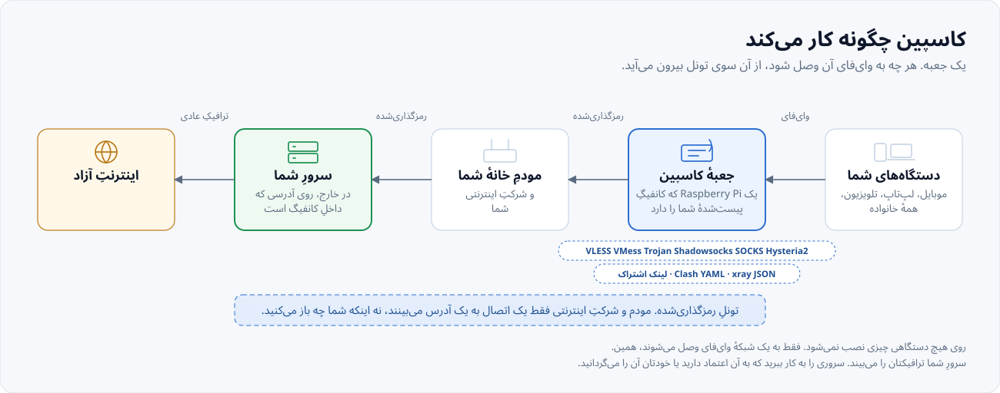

> ### [English: the full guide in English](README.md)
>
> این سند نسخهٔ فارسیِ `README.md` است. بخش‌به‌بخش و با همان ترتیب نوشته شده تا
> بتوانید میان دو زبان جابه‌جا شوید.
>
> **[این صفحه به انگلیسی](README.md)**

Caspian-BYOC یک کامپیوتر Windows 11، یک Mac با macOS، یک Raspberry Pi یا یک
دستگاه Linux را به دروازهٔ وای‌فای تبدیل می‌کند که کانفیگش را خودتان می‌آورید.
یک کانفیگ سازگار با V2Ray یا Xray را در پنل وب پیست کنید و یک کلید را بزنید.
Caspian لینک‌های VLESS،
VMess، Shadowsocks، SOCKS، Trojan و Hysteria2 را می‌پذیرد. فایل‌های YAML مربوط
به Clash و Clash.Meta، فایل JSON خامِ Xray، فهرست لینک‌ها و اشتراک base64 نیز
پذیرفته می‌شوند. Caspian با Xray-core وصل می‌شود و تونل را به شکل هات‌اسپات
وای‌فای پخش می‌کند، پس هر دستگاهی که وصل شود بدون نصب برنامه محافظت می‌شود.

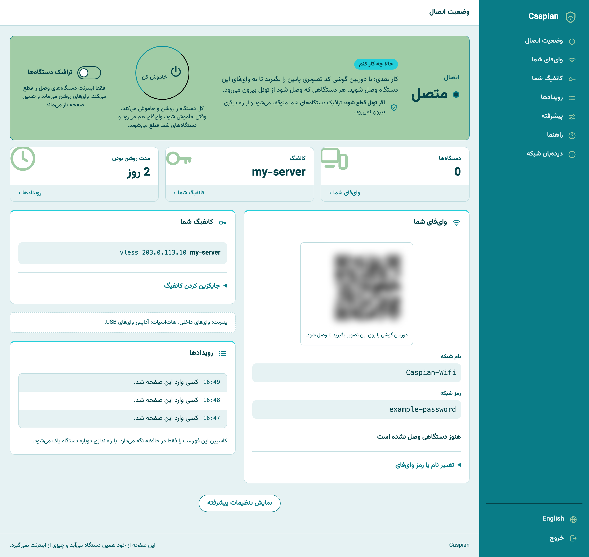

تصویرِ بالا یک اسکرین‌شاتِ واقعی از یک دستگاهِ در حالِ کار است، گرفته‌شده روی یک
Raspberry Pi 5 در تاریخ 2026-09-03 با تونلِ بالا و پیش از آنکه دستگاهی وصل شود.
رمزِ شبکه، نامِ کانفیگ و آدرسِ سرور در آن جایگزین شده‌اند، و کدِ تصویریِ اتصال تار
شده، چون آن کد نامِ شبکه و رمزش را در خودش دارد. هیچ چیزِ دیگری تغییر نکرده است.

پنل اول فارسی است و بعد انگلیسی. هیچ حسابی در کار نیست، هیچ داده‌ای از شما
فرستاده نمی‌شود، و پنل چیزی از اینترنت نمی‌گیرد.

این فایل می‌گوید کدِ این مخزن چه می‌کند، چه چیزی را تضمین می‌کند و چه چیزی را
تضمین نمی‌کند. هر توانایی‌ای که پایین‌تر می‌آید، کد یا آزمون یا اندازه‌گیریِ
ثبت‌شده‌ای را که بر آن تکیه دارد نام می‌برد. جایی که ادعایی به یک آزمون تکیه
دارد، نامِ آزمون نوشته شده و نه شمارهٔ خط، چون نام‌ها از بازنویسی کد جان سالم به
در می‌برند.

---

## چه چیزی را می‌توانید پیست کنید و چه چیزی رد می‌شود

کانفیگ را خودتان می‌آورید. این چیزی است که جعبه می‌پذیرد، برداشته‌شده از همان کدی
که کارِ پذیرفتن را می‌کند و نه از یک فهرستِ آرزو. هر سطر در برابر `internal/link` و
موتورِ پین‌شده اندازه‌گیری شده است.

| | کار می‌کند | رد می‌شود |
|---|---|---|
| لینک‌های اشتراک | `vless://` `vmess://` `ss://` `socks://` `trojan://` `hysteria2://` `hy2://` | `tuic://` `ssr://` `wireguard://` `anytls://` `naive+https://` `hysteria://` (نسخهٔ ۱) |
| سندهای پیست‌شده | YAML مربوط به Clash و Clash.Meta، xray JSON خام، فهرستی از لینک‌ها هر کدام در یک خط، یک بلوکِ base64 اشتراک | نشانیِ اینترنتیِ اشتراک، سندِ Clash پیچیده‌شده در base64، آرایهٔ JSON، متنی که خطِ اولش کامنت باشد |
| ترابری‌ها | `raw` (که `tcp` هم نوشته می‌شود)، `ws`، `grpc`، `httpupgrade`، `xhttp` (و `splithttp`)، `kcp` و `mkcp` | `h2`، `h3`، `http`، `quic`، `gun` |
| امنیت | `none`، `tls`، `reality` | `xtls` (نوعِ قدیمی)، `allowInsecure` |
| flow در VLESS | `xtls-rprx-vision`، `xtls-rprx-vision-udp443`، یا هیچ | هر مقدارِ دیگری |

`h2` و `h3` در آن ستونِ ردشده نامِ ترابری‌اند. خودِ HTTP/2 و HTTP/3 حمل می‌شوند:
`type=xhttp` با `security=tls`، و ALPN در TLS تعیین می‌کند کدام‌یک. بخشِ
[HTTP/2 و HTTP/3 حمل می‌شوند، با نامی دیگر](#http2-و-http3-حمل-میشوند-با-نامی-دیگر)
را ببینید.

شش چیز مردم را غافلگیر می‌کند، پس اینجا آمده‌اند و نه در پانویس:

فقط لینکِ اول به کار می‌رود. چهل سرور را پیست کنید، یکی پیکربندی می‌شود؛ پنل به شما
می‌گوید چند تا پیدا کرده است. `ss://` و `socks://` به شکلِ base64 از اطلاعاتِ کاربر
نیاز دارند و املای سادهٔ `method:password@host` رد می‌شود. REALITY فقط روی `raw` و
`xhttp` و `grpc` کار می‌کند، پس جفت‌کردنش با WebSocket همان لحظهٔ پیست توسط موتور رد
می‌شود و نه بعداً سرِ اتصال. `security=` اینجا باید با حروفِ کوچک نوشته شود، هرچند
خودِ موتور اهمیتی نمی‌دهد، و `TLS` با حروفِ بزرگ به شما `none` گزارش می‌شود. پارامترِ
`plugin=` روی لینکِ `ss://` بدون گفتنِ چیزی نادیده گرفته می‌شود. و نشانیِ اینترنتیِ
اشتراک رد می‌شود چون پنل هیچ چیزی از اینترنت نمی‌گیرد، که یک ویژگیِ عمدی است و نه
قابلیتی که جا مانده باشد.

تصویرِ کامل، از جمله اینکه کدام‌یک از این‌ها بایتِ واقعی حمل کرده‌اند و کدام‌یک روی
سخت‌افزار با ثبتِ آدرسِ خروجی سرتاسری اثبات شده‌اند، در بخشِ
[پروتکل‌ها و ترابری‌ها](#پروتکلها-و-ترابریها) آمده است. این‌ها سه ادعای متفاوت‌اند و
این پروژه نمی‌گذارد در هم بروند.

---

## نصب در Windows 11

برنامهٔ نصب همهٔ چیزهای لازم را نصب می‌کند. به PowerShell، Go یا .NET SDK نیاز
ندارید.

### چه چیزهایی لازم دارید

- یک کامپیوتر با Windows 11.
- یک حساب مدیر روی همان کامپیوتر.
- یک آداپتور وای‌فای که Windows Mobile Hotspot را پشتیبانی کند.
- اتصال اینترنت.
- یک لینک یا پیکربندی پروکسی که Caspian پشتیبانی کند.

### فایل درست را انتخاب کنید

بیشتر کامپیوترهای Intel و AMD از این فایل استفاده می‌کنند:

- `CaspianSetup-0.2.1-windows-x64.exe`

کامپیوترهای Windows با پردازندهٔ Snapdragon یا ARM از این فایل استفاده می‌کنند:

- `CaspianSetup-0.2.1-windows-arm64.exe`

اگر نوع کامپیوتر را نمی‌دانید، **Settings** را باز کنید. **System** و سپس
**About** را انتخاب کنید. نوع دستگاه در بخش **System type** نوشته شده است.

### نصب Caspian

1. [صفحهٔ انتشار Caspian](https://github.com/Iman/caspian/releases/latest) را باز کنید.
2. بخش **Assets** آخرین نسخه را باز کنید.
3. فایل مناسب Windows را دانلود کنید.
4. روی فایل دانلودشده دو بار کلیک کنید.
5. اگر SmartScreen باز شد، **More info** را انتخاب کنید.
6. مطمئن شوید نام فایل در هشدار همان نام فایل دانلودشده است.
7. **Run anyway** را انتخاب کنید.
8. وقتی Windows اجازهٔ مدیر می‌خواهد، **Yes** را انتخاب کنید.
9. صفحهٔ مجوز را بخوانید و ادامه دهید.
10. یک رمز برای پنل وب Caspian انتخاب کنید.
11. همان رمز را دوباره وارد کنید.
12. این رمز را در جای امن نگه دارید.

نصب‌کننده دو انتخاب اختیاری نیز نشان می‌دهد:

- ساخت میان‌بر روی دسکتاپ.
- اجرای Caspian Control هنگام ورود به Windows.

هر دو انتخاب به‌طور پیش‌فرض خاموش‌اند. نصب‌کننده همیشه میان‌بر **Caspian
Control** را در منوی Start می‌سازد. در پایان، **Open Caspian Control** را روشن
بگذارید و **Finish** را انتخاب کنید.

Windows تا زمانی که فایل گواهی امضای کد ندارد، هشدار **Unknown publisher** را
نشان می‌دهد. فقط فایل صفحهٔ رسمی انتشار Caspian را اجرا کنید.

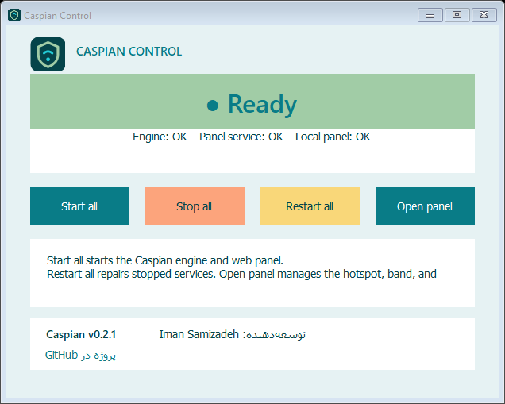

### دو صفحهٔ Caspian

Caspian در Windows دو صفحهٔ جدا دارد:

| صفحه | کجا باز می‌شود | چه کاری انجام می‌دهد |
|---|---|---|
| **Caspian Control** | برنامهٔ کوچک Windows و آیکون کنار ساعت | سرویس‌های پس‌زمینهٔ Caspian را شروع، متوقف یا دوباره راه‌اندازی می‌کند |
| **پنل وب Caspian** | مرورگر در `http://127.0.0.1:8088/` | نام و رمز وای‌فای، باند و اتصال پروکسی را تنظیم می‌کند |

ابتدا از **Caspian Control** استفاده کنید. وقتی **Ready** ظاهر شد، **Open
panel** را انتخاب کنید. پنل وب صفحهٔ دوم است. هات‌اسپات و تونل را در این صفحه
راه‌اندازی می‌کنید.

وضعیت **Ready** در Caspian Control فقط یعنی دو سرویس پس‌زمینه پاسخ می‌دهند. این
وضعیت به معنی اتصال تونل نیست. وقتی هات‌اسپات و تونل آماده‌اند، پنل وب سبز
می‌شود.

### اولین اجرا

1. **Caspian Control** را از منوی Start یا دسکتاپ باز کنید.
2. وقتی Windows اجازهٔ مدیر می‌خواهد، **Yes** را انتخاب کنید.
3. **Start all** را انتخاب کنید.
4. صبر کنید تا کارت بزرگ **Ready** را نشان دهد.
5. **Open panel** را انتخاب کنید.
6. رمزی را وارد کنید که هنگام نصب انتخاب کردید.
7. **Sign in** را انتخاب کنید.
8. یک نام برای شبکهٔ وای‌فای جدید وارد کنید.
9. یک رمز وای‌فای با دست‌کم هشت نویسه وارد کنید.
10. برای دستگاه‌های قدیمی، **2.4 GHz** را نگه دارید.
11. لینک یا پیکربندی پروکسی را پیست کنید.
12. کلید شروع Caspian را روشن کنید.
13. صبر کنید تا وضعیت پنل وب سبز شود.
14. تلفن یا دستگاه دیگر را به شبکهٔ وای‌فای جدید وصل کنید.
15. یک وب‌سایت را روی همان دستگاه باز کنید و اتصال را آزمایش کنید.

پنل دستگاه‌های متصل را نشان می‌دهد. Windows به آن‌ها نشانی‌هایی از
`192.168.137.0/24` می‌دهد. Caspian ترافیک اینترنت آن‌ها را از تونل `xray0`
می‌فرستد.

رمز پنل و رمز وای‌فای دو رمز جدا هستند. رمز پنل، پنل وب را باز می‌کند. رمز
وای‌فای، تلفن و دستگاه‌های دیگر را به شبکه وصل می‌کند.

### دکمه‌های Caspian Control

| دکمه | نتیجه |
|---|---|
| **Start all** | هر دو سرویس Caspian را شروع می‌کند |
| **Stop all** | هر دو سرویس را متوقف نگه می‌دارد |
| **Restart all** | هر دو سرویس را متوقف و دوباره شروع می‌کند |
| **Open panel** | پنل وب Caspian را در مرورگر باز می‌کند |

بعد از بستن پنجره، برنامه کنار ساعت Windows می‌ماند. برای باز کردن دوباره، روی
آیکون Caspian دو بار کلیک کنید.

Windows هنگام توقف یا شروع دوبارهٔ هات‌اسپات، دستگاه‌ها را قطع می‌کند. صبر کنید
تا پنل وب سبز شود، سپس دستگاه‌ها را دوباره وصل کنید.

اگر Caspian Control وضعیت **Ready** دارد ولی پنل وب قرمز است، پیام پنل وب را
بخوانید. پنل وب هات‌اسپات و تونل پروکسی را آزمایش می‌کند.

### نصب برای توسعه‌دهندگان

روش PowerShell فقط برای توسعه‌دهندگان است. ابتدا
[Go](https://go.dev/dl/)، [.NET 9 SDK](https://dotnet.microsoft.com/download/dotnet/9.0)
و [Git for Windows](https://git-scm.com/download/win) را نصب کنید. سپس PowerShell
را با دسترسی مدیر باز کنید و این فرمان را اجرا کنید:

    powershell.exe -NoProfile -ExecutionPolicy Bypass -File "C:\Users\YOUR-NAME\Documents\caspian\packaging\windows\install.ps1" -NoOpen

گزینهٔ `-NoOpen` از باز شدن خودکار پنل جلوگیری می‌کند. برنامه‌های Windows از
[.NET runtime and Windows Forms](https://github.com/dotnet/runtime) و
`System.ServiceProcess.ServiceController` استفاده می‌کنند. مجوزها و اعلان‌های
.NET در `third_party/dotnet/` قرار دارند. مجوز Wintun در
`third_party/wintun/PREBUILT-BINARIES-LICENSE.txt` قرار دارد و نسخهٔ اصلی آن از
[وب‌سایت Wintun](https://www.wintun.net/) دریافت می‌شود.

سرویس `caspian-panel` پنل وب را اجرا می‌کند. فایل `caspian.exe` تونل را می‌سازد.
فایل `caspian-tethering.exe` هات‌اسپات Windows را کنترل می‌کند. برنامهٔ
`CaspianControl.exe` سرویس‌ها را کنترل می‌کند و `wintun.dll` رابط تونل را فراهم
می‌کند.

---

## نصب در Linux و Raspberry Pi

دو راه. اولی برای کسی است که می‌خواهد آن را اجرا کند، دومی برای کسی که می‌خواهد
اول وارسی‌اش کند.

### خودکار: یک خط

    /bin/bash -c "$(curl -fsSL https://raw.githubusercontent.com/Iman/caspian/main/install.sh)"

نصب‌کننده تشخیص می‌دهد روی چه دستگاهی است، فایل اجراییِ متناظر را از آخرین
انتشار می‌گیرد، و اگر آنچه دانلود شد با چک‌سامِ منتشرشده نخواند، کار را رد
می‌کند.

| `uname -m` | فایل | دستگاهِ معمول |
|---|---|---|
| `x86_64` | `caspian-linux-amd64` | یک لپ‌تاپ یا یک مینی‌پی‌سی |
| `aarch64` | `caspian-linux-arm64` | Raspberry Pi 3، 4، 5 روی سیستم 64 بیتی |
| `armv7l` | `caspian-linux-arm` | Raspberry Pi 2 و 3 روی سیستم 32 بیتی |
| `armv6l` | `caspian-linux-arm` | Raspberry Pi 1، Zero، Zero W |

وقتی مطمئن نیست حدس نمی‌زند، بلکه رد می‌کند. لینوکس نبودن، معماری‌ای که در آن
جدول نیست، نبودِ systemd، یا چک‌سامی که نمی‌خواند: هر کدام یک ردکردن است که
می‌گوید چه دیده. `armv8l`، یعنی فضای کاربریِ 32 بیتی روی هستهٔ 64 بیتی، عمداً
به هیچ فایلی نگاشت نشده است، چون حدس زدن در همان‌جا بود که یک پروژهٔ قبلی کدِ
ARMv7 را روی دستگاه‌های ARMv6 فرستاد و آن‌ها در نخستین اجرا با دستورالعمل
غیرمجاز مردند.

**اسکریپت را پیش از آنکه به یک shell بدهید بخوانید.** برای نرم‌افزاری از این
جنس، این توصیه تشریفات نیست، و اسکریپت طوری نوشته شده که خوانده شود.

    curl -fsSL https://raw.githubusercontent.com/Iman/caspian/main/install.sh | less

برای سنجاق کردن یک نسخهٔ مشخص به‌جای گرفتن آخرین نسخه:

    CASPIAN_VERSION=v1.0.0 /bin/bash -c "$(curl -fsSL https://raw.githubusercontent.com/Iman/caspian/main/install.sh)"

### وارسی کردن دانلود، خودتان

هر انتشار یک فایل `SHA256SUMS` همراه دارد. نصب‌کننده آن را برای شما بررسی
می‌کند، و شما هم می‌توانید مستقل بررسی کنید:

    curl -fsSLO https://github.com/Iman/caspian/releases/latest/download/caspian-linux-arm64
    curl -fsSLO https://github.com/Iman/caspian/releases/latest/download/SHA256SUMS
    sha256sum -c SHA256SUMS --ignore-missing

این چه چیزی را ثابت می‌کند و چه چیزی را نه: ثابت می‌کند فایلی که دارید همان
فایلی است که آن انتشار منتشر کرده. ثابت نمی‌کند چه کسی آن انتشار را ساخته است.
فایل‌های اجرایی را GitHub Actions از یک کامیتِ تگ‌خورده می‌سازد، و گردش‌کاری که
آن‌ها را می‌سازد در همین مخزن است، در `.github/workflows/release.yml`. پس ساخت
خواندنی است، هرچند به‌طور مستقل بازتولیدپذیر نیست.

### دستی: خودتان بسازید

هیچ‌چیزِ راهِ خودکار اجباری نیست. ساخت از روی کد به Go 1.26 یا بالاتر نیاز دارد
و فایل اجرایی‌ای می‌دهد که در عملکرد یکی است.

    git clone https://github.com/Iman/caspian.git
    cd caspian
    go build -trimpath -o caspian ./cmd/caspian
    sudo CASPIAN_LOCAL_BINARY="$PWD/caspian" bash install.sh

`CASPIAN_LOCAL_BINARY` به نصب‌کننده می‌گوید به‌جای دانلود، از فایلی که همین حالا
ساخته‌اید استفاده کند. باقی کارهای نصب‌کننده، یعنی ساختن حساب سرویس و پوشه‌ها و
یونیت‌ها و دسترسی‌هایشان، به همان شکل انجام می‌شود.

کامپایل متقابل برای یک Pi از روی دستگاهی دیگر:

    GOOS=linux GOARCH=arm64 go build -trimpath -o caspian-linux-arm64 ./cmd/caspian
    GOOS=linux GOARCH=arm GOARM=6 go build -trimpath -o caspian-linux-arm ./cmd/caspian

**`GOARM=6` در ساخت 32 بیتی اختیاری نیست.** دستگاه‌های `armv6l` و `armv7l` هر دو
همان فایل `arm` را نصب می‌کنند، پس یک ساختِ ARMv7 هر Pi 1 و Zero و Zero W ای را
که آن را نصب کند از کار می‌اندازد. گردش‌کارِ انتشار این را با `readelf` بررسی
می‌کند و به‌جای منتشر کردن فایلی که دربارهٔ معماریِ خودش دروغ می‌گوید، شکست
می‌خورد.

پیش از آنکه به یک ساخت اعتماد کنید، دروازه را اجرا کنید:

    bash scripts/gate.sh

این دروازه قالب‌بندی، `go vet`، کل مجموعهٔ آزمون همراه با race detector، کف
پوششِ هر بسته، لایهٔ رگرسیونِ golden، یک پویش حریم خصوصی و یک زیرمجموعهٔ smoke را
اجرا می‌کند. در صورت شکست با کد غیرصفر بیرون می‌آید. آن را به هیچ لوله‌ای ندهید:
یک لولهٔ shell وضعیتِ آخرین فرمانش را گزارش می‌کند، پس دادنش به `tail` همان
جوابی را که خواسته بودید دور می‌ریزد.

---

## دو خواننده، دو مسیر در این فایل

اگر دارید تصمیم می‌گیرید که **آیا این را اجرا کنید یا نه**، بخش‌های «این برای
چیست»، «به چه نیاز دارد» و «اجرای آن» را بخوانید.

اگر دارید تصمیم می‌گیرید که **آیا به آن اعتماد کنید یا نه**، اول «چه چیزی را
تضمین می‌کند»، بعد «چه چیزی را تضمین نمی‌کند»، بعد «واقعاً چه چیزی وارسی شده
است»، و بعد `docs/DEFECTS.md` را بخوانید. دومی و سومی همان‌هایی هستند که اهمیت
دارند. ادعای امنیتی‌ای که نتوانید وارسی‌اش کنید، برای کسی که اگر آن ادعا غلط
باشد تاوانش را می‌دهد، هیچ ارزشی ندارد.

`FAQ.md` به پرسش‌هایی که مردم در عمل با آن‌ها روبه‌رو می‌شوند جواب می‌دهد، و هر
جواب نام فایل یا کدِ خطایی را که از آن آمده می‌گوید.

---

## این برای چیست

مخاطب کسی است که یک کانفیگ سالم را از آدمی که به او اعتماد دارد گرفته و می‌خواهد
دستگاه‌های داخل اتاق کار کنند. او ترمینال باز نمی‌کند، گزارش نمی‌خواند و فایلی
را ویرایش نمی‌کند. بعد از نصب، هر کاری در پنل انجام می‌شود. ببینید
`docs/2026-08-29-design.md`، بخش‌های 5.1 و 5.2.

نرم‌افزار اتصال، xray-core نسخهٔ v26.4.15 (Go module version `v1.260327.1-0.20260415235634-c5edc122b70e`) است که به‌جای دانلود شدن، داخل خودِ
فایل اجرایی لینک شده است. تجزیه‌کنندهٔ لینک اشتراک‌گذاری، بستهٔ `share` با پروانهٔ
MIT از XTLS/libXray است که در تگ v26.3.27 زیر `third_party/libxray-share/`
همراه با پروانهٔ خودش نگهداری می‌شود.

`supportedSchemes` در `internal/link/link.go` هفت اسکیم را می‌پذیرد: `vless` که
REALITY را هم شامل می‌شود، به‌علاوهٔ `vmess`، `trojan`، `ss`، `socks`،
`hysteria2` و `hy2`. هر چیز دیگری، از جمله `tuic`، `ssr`، `wireguard` و
`anytls`، با نام رد می‌شود.

---

## معماری

### دو فرایند، یک فایل اجرایی

یک فایل اجرایی در دو نقش اجرا می‌شود، و زیرفرمان تعیین می‌کند کدام نقش. این
جدایی برای این هست که ایرادی در بخشی که ورودی کاربر را تجزیه می‌کند و HTTP سرو
می‌کند، ایرادی در بخشی که root را در دست دارد نباشد. `docs/LAYOUT.md`، بخش
«Two processes, one binary»، بیانِ قطعیِ آن است.

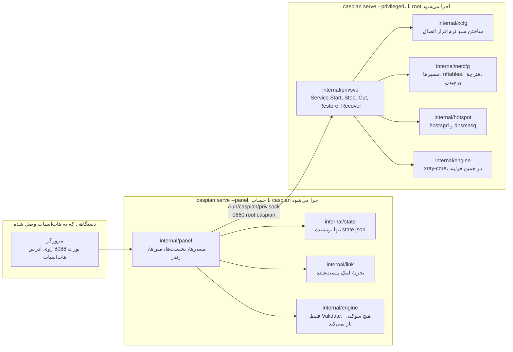

`cmd/caspian/main.go` این دو نقش را در متن راهنمای خودش چاپ می‌کند:

    caspian serve --privileged     root: routes, firewall, access point, engine
    caspian serve --panel          the caspian user: the web panel, nothing privileged

### سوکت، و اینکه چرا واژگانش بسته است

`internal/panel/priv.go` قاعده‌ای را که کل این جدایی برای آن هست می‌نویسد:
"A privileged helper that takes a path and an argument list from its client is
not a boundary; it is a way to run anything as root." یعنی: کمک‌کارِ ممتازی که
یک مسیر و یک فهرست آرگومان را از کلاینتش می‌گیرد، مرز نیست؛ راهی است برای اجرای
هر چیزی با دسترسی root. نقطه‌ویرگول از خودشان است. جمله عیناً نقل شده، چون
بازگفتِ یک قاعده، خودِ قاعده نیست.

پس پنل اصلاً نمی‌تواند «این را اجرا کن» را بیان کند. فقط می‌تواند یکی از هشت
کنش را نام ببرد، و سمت ممتاز تصمیم می‌گیرد هر کدام چه معنایی دارد.
`panel.Actions` همان مجموعهٔ بسته است، و
`TestActionVocabularyMatchesTheInterface` اگر متدی به رابط اضافه شود بی‌آنکه
نامی در آن فهرست بیاید، شکست می‌خورد.

| کنش | سمت ممتاز چه می‌کند | دستگاه را تغییر می‌دهد |
|---|---|---|
| `detect` | گزارش رابط‌ها، محدودیت‌های رادیو، و زیرشبکهٔ انتخاب‌شده | نه |
| `status` | گزارش فازِ نرم‌افزار اتصال، هات‌اسپات، و اینکه ترافیک قطع است یا نه | نه |
| `start` | بالا آوردن تونل و هات‌اسپات | بله |
| `stop` | پایین آوردن آن دو و بازپخش دفترچهٔ برچیدن | بله |
| `recover` | توقف، بازپخش دفترچه، بعد شروع دوباره از همان درخواست | بله |
| `engine-log` | برگرداندن خط‌های اخیرِ نرم‌افزار اتصال، از پیش پاک‌سازی‌شده | نه |
| `cut` | قطع ترافیکِ عبوریِ دستگاه‌ها و روشن ماندن باقی چیزها | بله |
| `restore` | برگرداندن ترافیک عبوریِ دستگاه‌ها | بله |

یک درخواست، یک پاسخ، یک اتصال. هر پیام یک طولِ 4 بایتیِ big-endian است و بعد
همان تعداد بایت JSON. طول، پیش از آنکه چیزی تخصیص یا تجزیه شود، در برابر
`maxFrameBytes` بررسی می‌شود، پس پیامی که بیش از اندازه بزرگ باشد فقط چهار بایت
و یک ردکردن خرج برمی‌دارد. فیلدهای ناشناختهٔ JSON نادیده گرفته نمی‌شوند، بلکه رد
می‌شوند. `protocolVersion` در هر درخواست بررسی می‌شود. پس پنلی از یک انتشار که
با سرویس ممتازِ انتشاری دیگر حرف بزند، یک ردکردنِ نام‌دار می‌گیرد، نه فیلدی که
بی‌سروصدا به مقدار صفرش رمزگشایی شده باشد.

در مسیرِ شکست هیچ چیز جز یک واژه برنمی‌گردد: یک `panel.Fault` از یک مجموعهٔ
بسته، یا یک `privsvc.Refusal` از مجموعهٔ بستهٔ دوم. متنِ خطای خودِ نرم‌افزار
اتصال کلیدِ کاربر را در خودش دارد، پس در سمت ممتاز ثبت و بعد دور ریخته می‌شود.
در پاسخ هیچ فیلدی نیست که بتواند در آن سفر کند.

### هر بسته مالکِ چیست

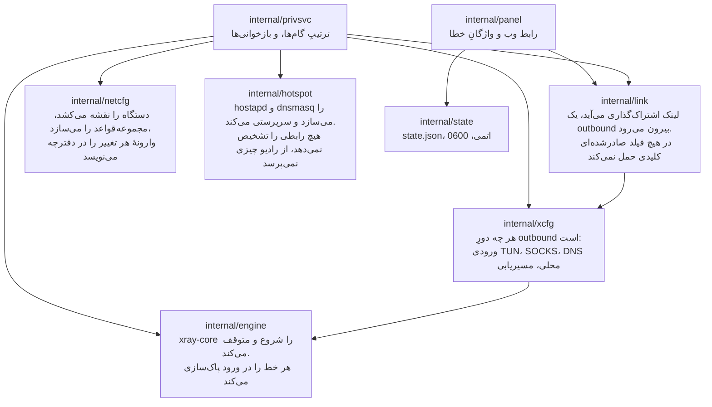

`internal/privsvc` به‌جای اعتماد به اینکه پنل این کار را کرده،
`StartRequest.ConfigJSON` را دوباره با `internal/link` تجزیه می‌کند. همچنین رابط
اینترنت را در برابر مسیرِ پیش‌فرضِ خودِ این دستگاه، رابط هات‌اسپات را در برابر
خروجیِ `iw list` خودِ این دستگاه، و کانال را در برابر آنچه رادیو قابل‌استفاده
اعلام کرده بررسی می‌کند.

### وضعیت کجا می‌ماند، و چه کسی آن را می‌نویسد

دو نویسنده، دو فایل، هیچ فایل مشترکی. هیچ‌کدام از دو فرایند فایلِ آن یکی را
نمی‌نویسد، پس نه قفلی لازم است و نه به‌روزرسانیِ گم‌شده‌ای هست که باید از آن
محافظت شود. `docs/LAYOUT.md`، بخش «Who writes what»، این تصمیم و پیش‌نویسِ
قبلی‌ای را که وارونه کرد ثبت کرده است.

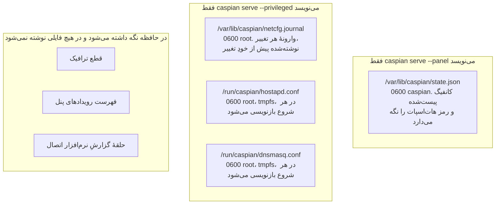

سمت ممتاز اصلاً هیچ فایل وضعیتی نمی‌خواند. هر چه لازم دارد در درخواستِ شروع
می‌آید. `TestPrivsvcReadsNoStateFile` کدِ خودِ آن بسته را پویش می‌کند و اگر روزی
فایلی بخواند شکست می‌خورد. یک کامنت چنین چیزی فراهم نمی‌کرد.

جدول کاملِ مسیرها، دسترسی‌ها و مالک‌ها در `docs/LAYOUT.md` است. پورت‌ها هم
همان‌جا تثبیت شده‌اند: 53 برای DNS دستگاه‌ها روی هات‌اسپات، 5354 روی loopback
برای شنوندهٔ DNS نرم‌افزار اتصال، 8088 برای پنل، و 10808 روی loopback برای
ورودیِ SOCKS تشخیصی.

---

## داده چگونه جریان می‌یابد

### یک لینکِ پیست‌شده به تونلی در حال کار تبدیل می‌شود

`startNow` در `internal/panel/handlers.go` ترتیب را مستند می‌کند، و همین ترتیب
است که سه شکستِ کانفیگ را از هم جدا می‌کند. تا وقتی حالت 1 و حالت 2 هر دو با
موفقیت پشت سر گذاشته نشوند، به هیچ چیزِ روی دستگاه دست زده نمی‌شود.

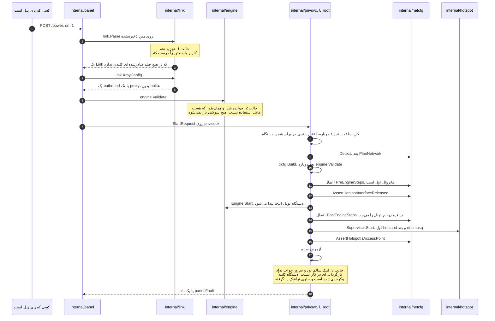

سه نکته در آن توالی تعیین‌کننده‌اند.

سندِ نرم‌افزار اتصال دو بار و به دو دلیل ساخته می‌شود. `internal/link` فقط
outbound را می‌سازد و نه چیز دیگری. `internal/xcfg` هر چه دور آن است را
می‌سازد: ورودیِ TUN که ترافیک دستگاه‌ها از آن می‌آید، ورودیِ SOCKS روی loopback،
شنوندهٔ محلیِ DNS، سیاستِ resolver، و قواعد مسیریابی. هیچ‌کدام از این‌ها از چیزی
که فراخواننده فرستاده گرفته نمی‌شود.

شروعی که در میانهٔ راه شکست بخورد، کاملاً برگردانده می‌شود. دفترچه از پیش
وارونهٔ هر تغییر را دارد، و پیش از آنکه تغییر به هسته برسد روی دیسک نوشته شده
است. شروعی که شکست بخورد، دستگاه را همان‌طور که پیدایش کرده رها می‌کند.

سروری که جواب نمی‌دهد به معنی دستگاهی نیمه‌پیکربندی‌شده نیست. هر تغییری موفق
بوده، فایروال برقرار است، و ترافیک عبوریِ دستگاه‌ها بسته است چون تونل چیزی حمل
نمی‌کند. پس خطا گزارش می‌شود و هیچ چیز برچیده نمی‌شود.

### مسیرِ شبکه‌ایِ یک بستهٔ دستگاه‌ها

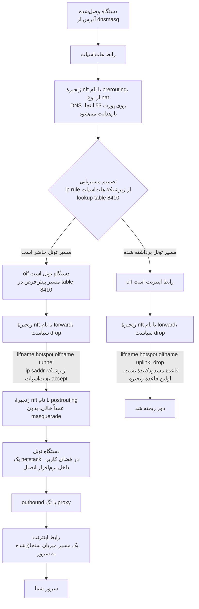

قاعدهٔ مسدودکنندهٔ نشت فقط نامِ هات‌اسپات و رابط اینترنت را می‌برد. وقتی تونل
برود نمی‌تواند از کار بیفتد، چون اصلاً نامی از تونل نبرده است. هر قاعده‌ای که به
ترافیک دستگاه‌ها اجازه می‌دهد نامِ تونل را می‌برد، پس آن قواعد دیگر منطبق
نمی‌شوند و سیاستِ زنجیره همه چیز را drop می‌کند.

هر رابط با نام تطبیق داده می‌شود و هرگز با شماره. شماره هنگام بارگذاریِ
مجموعه‌قواعد حل می‌شود، پس مجموعه‌قواعدی که تونل را با شماره نام ببرد وقتی تونل
پایین است بارگذاری نمی‌شود، و دقیقاً همان وقت است که باید برقرار باشد.

زنجیرهٔ postrouting عمداً خالی است. یک masquerade به سمتِ رابط اینترنت همان یک
خطی است که این دستگاه را بی‌سروصدا به یک روتر معمولی تبدیل می‌کند.

### ناپدید شدن تونل با آن مسیر چه می‌کند

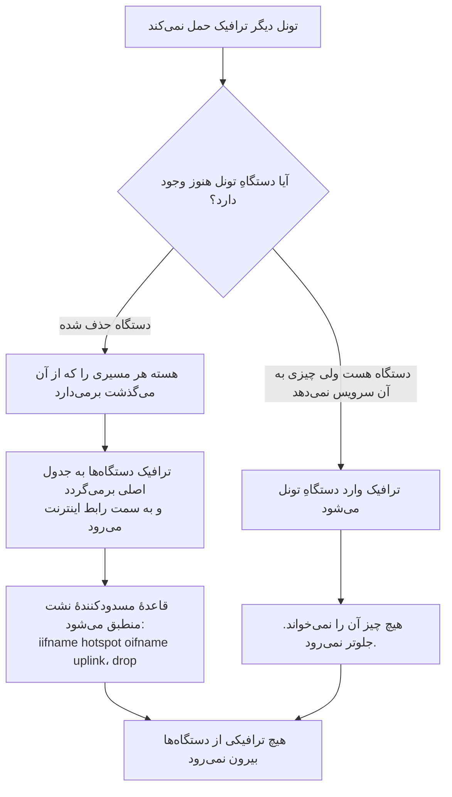

اینکه کدام شاخه رخ می‌دهد روشن نشده است.
`internal/netcfg/testdata/PROVENANCE.md` مشاهده‌ای از دستگاهِ هدف در تاریخ
2026-08-30 را ثبت کرده: در حالی که سرویس خاموش بود، `xray0` در فهرست دستگاه‌های
NetworkManager با وضعیت `connected (externally)` حاضر بود. هیچ چیز اینجا دلیلش
را روشن نکرد، و نرم‌افزار اتصال کدِ این پروژه نیست. هیچ‌کدام از دو شاخه نشت
نمی‌دهد، و هیچ‌کدام به دانستنِ اینکه کدام رخ می‌دهد وابسته نیست. به همین دلیل آن
قاعده طوری نوشته شد که فقط نامِ هات‌اسپات و رابط اینترنت را ببرد.

### مسیرِ DNS، که مسیرِ ترافیک نیست

این همان جایی است که مردم اشتباه می‌کنند. پرسشِ DNS یک دستگاه فقط اجازه داده
نمی‌شود. گرفته می‌شود.

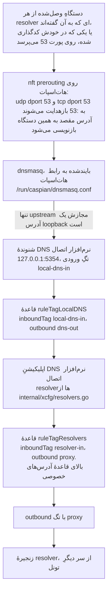

چهار ویژگیِ آن زنجیره، و برای هر کدام چیزی که نگهش می‌دارد.

بازهدایت، مقصد را بازنویسی می‌کند، پس دستگاهی که resolver در خودش کدگذاری شده،
همین‌جا جواب می‌گیرد و اجازه ندارد بیرون برود تا به آنکه به آن گفته‌اند برسد.
سناریو: "a client cannot reach a resolver of its own choosing".

پیشنهادِ DHCP فقط همین دستگاه را نام می‌برد و هیچ resolver دیگری را. این سناریوی
خودش را می‌ارزد، چون غلط بودنش نامرئی است: بازهدایت به‌هرحال بسته‌ها را بازنویسی
می‌کند، پس هیچ چیز روی سیم غلط به نظر نمی‌رسد. سناریو: "the box offers itself as
the resolver and never names another".

`internal/hotspot` هر upstream ای برای dnsmasq که آدرس loopback نباشد را رد
می‌کند. مقصدی که loopback نباشد یعنی پرسشی که بیرون از تونل از دستگاه خارج
می‌شود، آن هم برای هر نامی که هر دستگاهی می‌پرسد. آنچه آنجا جواب می‌دهد شنوندهٔ
نرم‌افزار اتصال است، و `TestLocalDNSDefaultMatchesTheHotspotUpstream` اگر آن دو
پورت از هم فاصله بگیرند شکست می‌خورد. `docs/LAYOUT.md` همین جفت را جفتی می‌نامد
که بی‌سروصدا خراب می‌شود: اگر آن دو از هم فاصله بگیرند، هر دستگاهِ وصل‌شده از
ترجمهٔ نام می‌افتد، در حالی که هات‌اسپات و تونل هر دو سالم به نظر می‌رسند.

قاعده‌ای که پرسش‌های خودِ resolver را به داخل تونل می‌فرستد، بالای قاعده‌ای است
که آدرس‌های خصوصی را مستقیم می‌فرستد. پس به resolver ای که روی آدرس خصوصی است هم
از راه تونل می‌رسند، نه از راه شبکهٔ محلی.
`TestLocalDNSQueriesCannotFallOutToTheUplink` و `TestPrivateRangesRouteDirect`
دو نیمهٔ آن را نگه می‌دارند.

خودِ زنجیرهٔ resolver سه اپراتور در سه حوزهٔ قضایی است: سرویس فیلترشدهٔ Quad9،
گونهٔ FAMILY از Cloudflare، و CleanBrowsing Security.
`internal/xcfg/resolvers.go` ثبت کرده هر کدام چرا انتخاب شده، و عمداً کدام آدرسِ
تقریباً یکسانِ همان اپراتور نیست. هیچ resolver گوگلی در هیچ پیش‌فرضی نمی‌آید، و
`TestNoGoogleAnywhereInGeneratedConfigs` هر سندِ تولیدشده را برای یافتن یکی از
آن‌ها پویش می‌کند.

به پورت‌های دیگر رسیدگی می‌شود، و به یکی از آن‌ها نمی‌شود رسیدگی کرد:

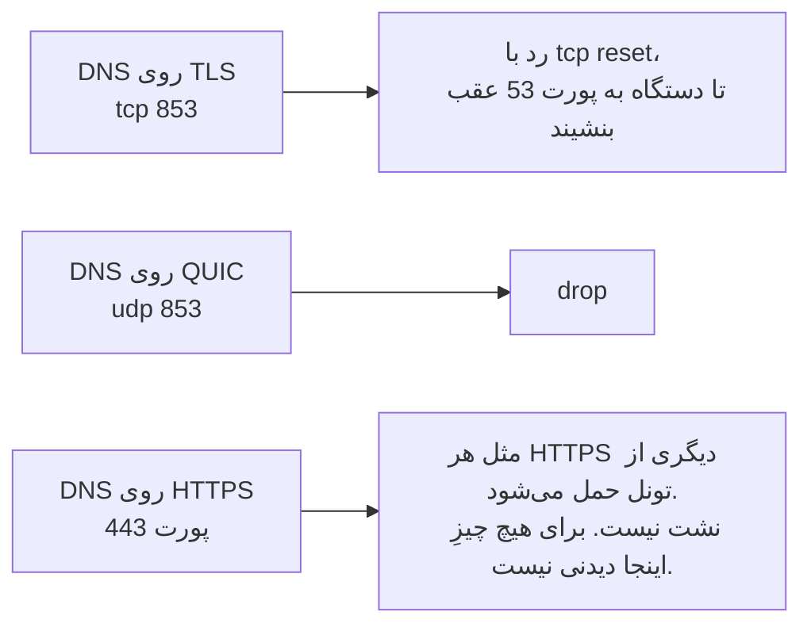

---

## پروتکل‌ها و ترابری‌ها

یک لینک اشتراک‌گذاری سه چیزِ جدا را حمل می‌کند، و جدا نگه داشتنشان کمک می‌کند:
پروتکلِ پروکسی، ترابری‌ای (transport) که آن را حمل می‌کند، و لایهٔ رمزنگاری‌ای
که دور آن ترابری پیچیده می‌شود. یک لینک VLESS روی WebSocket با TLS و یک لینک
VLESS روی TCP ساده با REALITY، یک پروتکل واحدند که از دو راهِ متفاوت به یک نوع
سرور می‌رسند. آن دو به شکل‌های متفاوتی شکست می‌خورند.

پروتکل‌های پروکسی همان هفت اسکیمی هستند که بالاتر آمد. بیشترِ مثال‌های این سند از
VLESS استفاده می‌کنند، چون REALITY برای همان ساخته شده است. هیچ چیزِ این دستگاه
مخصوص آن نیست. تجزیه‌کننده یک توصیف می‌سازد، `internal/xcfg` دورِ آن یک سندِ
نرم‌افزار اتصال می‌چیند، و باقیِ دستگاه نمی‌داند دارد کدام پروتکل را حمل می‌کند.

ترابری‌ها از xray-core می‌آیند و در تجزیه‌کنندهٔ همراه‌شده نام برده شده‌اند:

- `tcp`، که `raw` هم نوشته می‌شود
- `ws`، برای WebSocket
- `httpupgrade`
- `xhttp`، پروتکلی که پیش‌تر SplitHTTP نام داشت. هر دو املا تجزیه می‌شوند
- `grpc`
- `kcp` و `mkcp`، برای mKCP

`h2` و `http` و `h3` و `quic` در این فهرست نیستند و لینکی که یکی از آن‌ها را
بخواهد رد می‌شود، نه اینکه حمل شود. این‌ها در نسخه‌ای از موتور که اینجا پین شده
حذف شده‌اند، و `TestRemovedTransportsAreRefusedWithASentence` در `internal/link`
همان ردکردن را سرِ جایش نگه می‌دارد.

اینکه این ردکردن چقدر خوب خوانده می‌شود به مسیرِ ورود بستگی دارد. سندِ Clash که
یکی از این‌ها را نام ببرد، جمله‌ای دربارهٔ ترابری می‌گیرد. همان ترابری در پارامترِ
`type=` روی یک لینکِ اشتراک از تجزیه‌کنندهٔ همراه‌شده رد می‌شود و به شکلِ پیام کلیِ
«چیزی در متنِ پیست‌شده لینکِ پروکسی‌ای نبود که این دستگاه بفهمد» بیرون می‌آید، که
درست است و کمکی نمی‌کند. `TestRemovedTransportInAURIIsReportedLessWell` همین
تفاوت را پین می‌کند تا یک شکافِ شناخته‌شده باشد نه یک غافلگیری.

### HTTP/2 و HTTP/3 حمل می‌شوند، با نامی دیگر

اینکه `type=h2` یا `type=quic` رد می‌شود به این معنا نیست که دستگاه نمی‌تواند
آن‌ها را حرف بزند. یعنی املایش جابه‌جا شده است. XHTTP جای هر دو را گرفته و نسخهٔ
HTTP خود را از ALPN در TLS انتخاب می‌کند، نه از نامِ ترابری:

| چه می‌خواهید | چه بنویسید |
|---|---|
| HTTP/3، که همان QUIC است | `type=xhttp` با `security=tls` و `alpn=h3` و `mode=stream-one` |
| HTTP/2 | `type=xhttp` با `security=tls` و هر ALPN‌ای که دقیقاً `h3` نباشد |
| QUIC بدونِ XHTTP | یک لینکِ `hysteria2://` که زیرش QUIC است و به `alpn=h3` نیاز دارد |

این کلیدها دست‌نخورده به موتور می‌رسند: `internal/xcfg` خروجی را به‌شکلِ JSON مبهم
حمل می‌کند و هرگز بازش نمی‌کند، پس `alpn` و `mode` و `xmux` و بلوکِ تنظیمِ QUIC
دقیقاً همان‌طور که پیست شده‌اند می‌رسند.

چهار نکته تعیین می‌کند که h3 بگیرید یا بی‌صدا چیزِ دیگری:

`alpn` باید دقیقاً یک مقدار باشد و آن مقدار باید `h3` باشد. نوشتنِ `alpn=h3,h2`
بدونِ هیچ هشداری به شما HTTP/2 می‌دهد، چون موتور فهرستی با هر طولِ دیگری را
درخواستِ نسخهٔ ۲ می‌گیرد. REALITY هر جا حاضر باشد HTTP/2 را تحمیل می‌کند، پس REALITY
و h3 با هم جمع نمی‌شوند و جفت‌کردنشان به‌جای خطا به شما h2 می‌دهد. `mode` باید
صریح نوشته شود، چون حالتِ پیش‌فرض به `packet-up` می‌رسد و نه به شکلِ `stream-one`
که موتور آن را جانشینِ QUIC نام می‌برد. و `downloadSettings`، برای جداکردنِ مسیرِ
بالا و پایین، همراهِ `mode: stream-one` رد می‌شود؛ آن ترکیب به `stream-up` نیاز
دارد.

یک برخوردِ واژگانی هست که بهتر است صریح گفته شود، چون شبیهِ تناقض خوانده می‌شود:
`type=h3` رد می‌شود و `alpn=h3` لازم است. این‌ها دو فیلدِ متفاوت‌اند. اولی نامِ
ترابری‌ای است که دیگر وجود ندارد؛ دومی نامِ پروتکلی است که داخلِ TLS مذاکره می‌شود.

این پیکربندی‌ها را دستگاه می‌پذیرد و اعتبارسنجی می‌کند. هنوز از اینجا در برابرِ یک
سرورِ واقعی رانده نشده‌اند، پس این سطر را توانِ موتور بدانید و نه چیزی که این پروژه
دیدنش کرده باشد.

لایهٔ امنیت یکی از `reality`، `tls`، یا `none` است.

هر ترکیبی به یک اندازه مفید نیست. REALITY معمولاً با TCP ساده جفت می‌شود، چون کلِ
روشش قرض گرفتنِ دست‌دادنِ TLS یک سایتِ واقعی است، پس پیچیدنش در یک لایهٔ TLS دیگر
هدف را از بین می‌برد. WebSocket و HTTPUpgrade و XHTTP برای این هستند که در چشمِ
چیزی که اتصال را بازرسی می‌کند شبیه ترافیک وبِ معمولی باشند، و معمولاً به همان
دلیلی که یک وب‌سایت معمولی TLS دارد، با TLS جفت می‌شوند. WebSocket با
`security=none` تنها شکلی است که باید دو بار به آن فکر کرد. روی سیم متنِ آشکار
است، و فقط وقتی معقول است که چیز دیگری از پیش رمزنگاری را فراهم کرده باشد، مثل
یک CDN که TLS را جلوی سرور خاتمه می‌دهد.

### سه ادعای متفاوت، جدا از هم

تفکیکِ زیر مهم‌ترین چیز در این سند است. پیش از سطرها، عنوانِ ستون‌ها را بخوانید.

| ادعا | بر چه تکیه دارد | چقدر می‌ارزد |
|---|---|---|
| تجزیه‌کننده آن را می‌پذیرد | `internal/link`، و یک سندِ golden کامیت‌شدهٔ نرم‌افزار اتصال | سند پایدار است. چیزی شماره‌گیری نشده |
| بایت حمل می‌کند | `test/tunnel`، یک سرور واقعیِ xray-core روی loopback | ترافیک از دلِ پروتکل عبور کرد. نه آدرس خروجی، نه دستگاه، نه اینترنت |
| سرتاسر اثبات شده است | `test/hardware`، یک گوشیِ واقعی روی هات‌اسپات | ترافیک واقعی از دستگاه بیرون رفت و آدرسِ خروجی گرفته و نام‌گذاری شد |

### چه چیزی از دلِ یک سرورِ واقعی بایت حمل کرده است

`test/tunnel` این را اضافه کرد. هر اسکیمی که تجزیه‌کننده می‌پذیرد، سرتاسر در
برابر یک نمونهٔ واقعیِ xray-core رانده می‌شود که از وابستگیِ خودِ همین ماژول
ساخته شده و با همان بارگذارنده‌ای بار می‌شود که `internal/engine` استفاده
می‌کند. سمتِ کلاینت همان مسیرِ محصول است، بدون تغییر: `link.Parse`، بعد
`xcfg.Build`، بعد `engine.Engine.Start`. هیچ کانفیگی دستی نوشته نمی‌شود.

| پروتکل | ترابری | امنیت | یک درخواست HTTP را حمل می‌کند |
|---|---|---|---|
| VLESS | tcp (raw) | none | بله |
| VMess | tcp (raw) | none | بله |
| Shadowsocks، aes-256-gcm | tcp (raw) | none | بله |
| SOCKS | tcp (raw) | none | بله |
| Trojan | tcp (raw) | TLS، سنجاق‌شده با digest | بله |
| Hysteria2، و نام مستعارِ `hy2` | QUIC | TLS، سنجاق‌شده با digest | بله |

چهار کنترل جلوی قبول شدنِ درخواستی را که از تونل رد نشده می‌گیرند، و هر چهار تا
اجرا می‌شوند نه اینکه در متن ادعا شوند. به کلاینت هرگز گفته نمی‌شود مبدأ کجاست؛
به او یک نامِ `.invalid` و پورتِ یک طعمه داده می‌شود. آن نام قابل ترجمه نیست، و
اگر resolver ای روی دستگاه با این حال جوابش را بدهد، مجموعهٔ آزمون بلند
می‌گویدش. مبدأ بررسی می‌کند درخواست به کجا خطاب شده بود، نه فقط اینکه رسیده است.
طعمه ضربه‌های خودش را می‌شمارد، و یک درخواستِ تونل‌شده نباید حتی یکی به آن اضافه
کند. `TestEveryCarriageProofCanFail` و
`TestTheProofRejectsARequestThatDidNotGoThroughTheTunnel` همان‌هایی هستند که این
کنترل‌ها را از قصد به شاهد تبدیل می‌کنند.

هر سطر را تنگ بخوانید. هر سطر جز Hysteria2 روی TCP خام اجرا می‌شود. هیچ سطری
REALITY را نمی‌راند، چون سمتِ سرورِ آن به یک هدفِ دست‌دادنِ واقعی نیاز دارد.
Shadowsocks فقط aes-256-gcm است، چون رمزهای 2022 مسیرِ کدِ دیگری دارند. هر سطر
یک درخواست TCP حمل می‌کند و UDP associate خاموش است. همه چیز روی loopback است،
پس هیچ آدرسِ خروجی‌ای گرفته نمی‌شود و نمی‌تواند گرفته شود.

`TestEveryProtocolTheParserAcceptsIsDrivenEndToEnd` فهرستِ اسکیم‌های
پذیرفته‌شده را از کدِ `internal/link` می‌خواند، پس اسکیمِ هشتم بدون یک سطر در
اینجا اضافه نمی‌شود.

### واقعاً چه چیزی روی سخت‌افزار اثبات شده است

جدول زیر چیزی است که ترافیکِ واقعی از آن عبور کرده و آدرسِ خروجی‌اش گرفته شده.
این نه آن چیزی است که تجزیه‌کننده می‌پذیرد، و نه آن چیزی که مجموعهٔ آزمونِ
loopback حمل می‌کند.

| پروتکل | ترابری | امنیت | سرتاسر اثبات شده |
|---|---|---|---|
| VLESS | tcp (raw) | REALITY | بله، روی سه سرور جداگانه |
| VLESS | ws (WebSocket) | none، به‌علاوهٔ VLESS Encryption | بله |
| VLESS | ws (WebSocket) | TLS | بله، از راه یک CDN |
| VLESS | httpupgrade | TLS | بله، از راه یک CDN |
| VLESS | xhttp | TLS | بله |
| VMess، Trojan، Shadowsocks، SOCKS، Hysteria2 | هر کدام | هر کدام | نه |

هر کدام از این‌ها با راندنِ یک مرورگر واقعی روی یک گوشیِ واقعیِ وصل به
هات‌اسپات اثبات شده است. آدرسِ خروجی از دو منبعِ مستقل گرفته و با سروری که
پیکربندی نام می‌برد تطبیق داده شد. سه سرور متفاوت به کار رفت و هر کدام آدرس
متفاوتی برگرداند، پس خواندنی که تکراری یا از حافظهٔ نهان باشد را نمی‌شود با
تونلِ سالم اشتباه گرفت.

سطری که اثبات نشده، ادعای خراب بودن نیست. ادعای این است که هیچ‌کس ندیده بسته‌ای
از سرِ دیگر بیرون بیاید، که چیزِ دیگری است و تنها چیزی است که این پروژه شاهد
می‌داند. سندِ نرم‌افزار اتصالی که هر ترابری تولید می‌کند **به‌عنوان یک فایل
golden سنجاق شده است**، پس تغییر در نحوهٔ ساخته شدنش به شکل یک diff دیده
می‌شود. این ثابت می‌کند سند پایدار است و دربارهٔ اینکه ترابری وصل می‌شود یا نه
چیزی نمی‌گوید.

### چرا سطری که ترابری‌اش امنیت ندارد باز هم رمزنگاری‌شده است

ستون `security` در بالا دربارهٔ لایه‌ای است که **دورِ** ترابری پیچیده می‌شود، و
`none` در آنجا به معنی «بدون رمزنگاری» نیست. یعنی نه TLS و نه REALITY. دقت در
این مورد می‌ارزد، چون خواندنش به شکل دیگر نگران‌کننده است و خواندنش با سخاوتِ
بیش از حد بدتر.

VLESS به‌تنهایی هیچ رمزنگاری‌ای حمل نمی‌کند. پروتکلی بی‌حالت است که انتظار دارد
لایهٔ زیرینش محرمانگی را فراهم کند، که معمولاً REALITY یا TLS است. یک لینک VLESS
روی WebSocket با `security=none` و هیچ چیزِ دیگر، روی سیم متنِ آشکار **می‌بود**،
و آدرسِ خروجی اثبات می‌شد در حالی که هر بسته برای هر چیزی که روی مسیر بود خواندنی
بود.

آنچه آن سطر را امن می‌کند VLESS Encryption است، که در پارامترِ `encryption=`
لینک حمل می‌شود. این یک تبادلِ کلیدِ ترکیبی است، ML-KEM-768 برای مقاومتِ
پساکوانتومی همراه با X25519، که در خودِ لایهٔ VLESS اعمال می‌شود نه زیرِ آن. پس
ترافیک رمزنگاری‌شده است، و چیزی آن را رمز کرده که ساخته شده تا در برابرِ مهاجمی
که امروز ضبط می‌کند و بعداً کامپیوترِ کوانتومی دارد امن بماند. لینکی که هم
`encryption=none` و هم `security=none` دارد، هیچ‌کدام را ندارد، و همین ترکیب است
که باید رد شود.

این **همان** Noise Protocol Framework (noiseprotocol.org) **نیست**. نه در این
دستگاه، نه در تجزیه‌کنندهٔ همراه‌شدهٔ لینک، و نه در نرم‌افزار اتصال، هیچ چیز
Noise را پیاده نمی‌کند. واژهٔ "noise" در پیکربندیِ xray-core برای چیزِ دیگری
می‌آید، یعنی پر کردنِ ترافیک با بایت‌های تصادفی تا شکلش روی سیم عوض شود، که
مبهم‌سازی است و دست‌دادن نیست. آنچه به این سطر محرمانگی می‌دهد VLESS Encryption
است، و نام اهمیت دارد چون آن دو تضمین‌های متفاوتی می‌دهند.

**اندازه‌گیری شده**، نه فرض‌شده، در 2026-08-30. این بسته outbound را فیلد به
فیلد بازنمی‌سازد. آنچه را تجزیه‌کننده تولید کرده دوباره سریال می‌کند، و تنظیماتِ
پروتکل به شکلِ یک بلوکِ مبهم همراهش می‌آیند. به همین دلیل است که آن پارامتر زنده
می‌ماند. و به همین دلیل هم هست که اگر روزی زنده نماند هیچ چیز نمی‌شکند: هیچ
فیلدی گم نمی‌شود، هیچ نوعی عوض نمی‌شود، و هیچ آزمون دیگری متوجه نمی‌شود، در حالی
که تونل ترافیکِ کاربر را آشکار حمل می‌کند و همهٔ بررسی‌ها هنوز سبزند.
`TestVLESSEncryptionSurvivesIntoTheEngineDocument` در `internal/link` همان
نگهبان است، و پیش از آنکه نگه داشته شود، دیده شد که دقیقاً در برابرِ همان تنزلِ
بی‌سروصدا شکست می‌خورد.

### نامِ گواهی‌ای که نخواند، و اصلاحی که سمتِ کلاینت است

یک نتیجه ثبت کردن دارد، چون ایرادی است که این دستگاه به‌درستی حاضر نمی‌شود رویش
سرپوش بگذارد. دو پیکربندی به آدرسِ خودِ سرور اشاره می‌کردند در حالی که نامِ TLS
مربوط به CDN جلوی آن را حمل می‌کردند. نرم‌افزار اتصال گزارش داد:

    transport/internet/httpupgrade: failed to dial request ...
      tls: failed to verify certificate: x509: certificate is valid for
      <the apex>, not <the cdn subdomain>

این واقعاً گواهی‌ای است که با نامِ درخواست‌شده نمی‌خواند، و رد کردنش همان رفتاری
است که می‌خواهید. پذیرفتنش یعنی تونل را هر چیزی که هر گواهی‌ای در دست دارد بتواند
خاتمه بدهد.

علت و اصلاح هر دو سمتِ کلاینت هستند، و هیچ تغییری در سرور لازم نیست. یک لینکِ
اشتراک‌گذاری دو نام حمل می‌کند که مردم فکر می‌کنند باید یکی باشند و نیستند:

- `sni` نامی که TLS گواهی را در برابرِ آن اعتبارسنجی می‌کند
- `host` نامی که سرور درخواست را بر اساس آن مسیریابی می‌کند، یک هدر HTTP

لینک‌های ناموفق نامِ CDN را در **هر دو** حمل می‌کردند. از راه CDN این کار
می‌کند، چون CDN گواهیِ آن نام را دارد. وقتی مستقیم به مبدأ اشاره کند نمی‌تواند،
چون مبدأ فقط گواهیِ دامنهٔ اصلی را دارد. `sni` را روی نامی بگذارید که گواهی
واقعاً حمل می‌کند، و `host` را همان نامی بگذارید که سرور بر اساس آن مسیریابی
می‌کند:

    sni=example.com          host=cdn.example.com

**اندازه‌گیری شده** در 2026-08-30. دو لینکی که با خطای گواهیِ بالا شکست خورده
بودند، بعد از همان یک تغییر هر دو وصل شدند. آدرس‌های خروجی از دو منبعِ مستقل
گرفته و با سرورهای خودشان تطبیق داده شد، و در همان اجرا، بررسیِ نشتِ DNS و بررسیِ
fail-closed هم قبول شدند.

پس اگر ترابری‌ای فقط وقتی مستقیم به مبدأ اشاره می‌کند شکست می‌خورد، پیش از آنکه
به ترابری شک کنید، `sni` را با نام‌های جایگزینِ موضوعِ گواهیِ مبدأ مقایسه کنید.
`openssl s_client -connect <address>:443 -servername <name>` چاپ می‌کند سرور
واقعاً چه ارائه می‌دهد.

### پنل لینکِ پیست‌شده می‌گیرد، نه تصویر

انداختنِ یک تصویر QR در طراحی، بخش 5.2، توصیف شده و **پیاده نشده است**.
`internal/panel/qr` فقط رمزگذار است، و هیچ هندلری در `internal/panel` بارگذاریِ
multipart نمی‌خواند. کدِ QR ای که پنل تولید می‌کند همانی است که گوشی برای وصل شدن
به هات‌اسپات اسکن می‌کند. `internal/panel/view.go` آن را با `qr.Encode` و
`qr.WiFiJoin` می‌سازد، پس نه کتابخانهٔ تصویری در کار است و نه سرویس راه دور.

---

## به چه نیاز دارد

تنها هدفِ نسخهٔ v1 یک Raspberry Pi است. ببینید `docs/2026-08-29-design.md`،
بخش 2. macOS و Windows به‌عنوان فازهای بعدی نام برده شده‌اند و ساخته نشده‌اند.
Android و iOS به‌عنوان «هرگز» نام برده شده‌اند.

`internal/netcfg/testdata/PROVENANCE.md` دستگاهی را که این پروژه روی آن توسعه و
اندازه‌گیری شده ثبت کرده است: یک Raspberry Pi 5 Model B Rev 1.0، Debian 13
(trixie)، هستهٔ 6.18.34+rpt-rpi-2712 aarch64، nftables 1.1.3، iw 6.9،
iproute2 6.15.0، brcmfmac روی phy0، و NetworkManager که netplan آن را می‌سازد.

`install.sh` پیش از آنکه به دستگاه دست بزند، هر چیزی را که لینوکس روی x86_64،
aarch64، armv7l یا armv6l نباشد، با systemd نسخهٔ 240 یا بالاتر، و اجراشده با
root، رد می‌کند. هر ردکردن می‌گوید چه دیده.

به دو رابط شبکه در یکی از دو چیدمان نیاز دارید. ببینید
`docs/2026-08-29-design.md`، بخش 4.7.

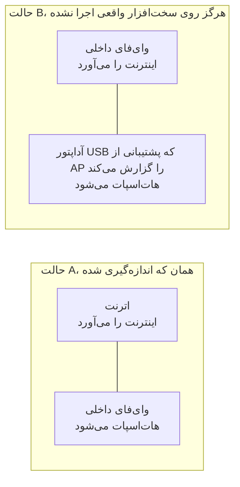

حالت B هرگز اجرا نشده است. `PROVENANCE.md` ثبت کرده که دستگاهِ هدف دقیقاً یک
رادیو دارد و هیچ دستگاه USB ای به آن وصل نیست، پس هر فیکسچرِ حالت B در این درخت
نوشته شده است و از دستگاه گرفته نشده.

**روی سخت‌افزاری که اندازه‌گیری شده، بالا آوردنِ هات‌اسپات به قیمتِ از دست رفتنِ
وای‌فایِ خودِ دستگاه تمام می‌شود.** درایور `brcmfmac` فرمانِ
`iw phy phy0 interface add ap0 type __ap` را با `Input/output error (-5)` رد
می‌کند، هرچند `iw list` آن ترکیب را تبلیغ می‌کند. پس دستگاه به تصاحبِ `wlan0`
عقب می‌نشیند: رابط را از NetworkManager آزاد می‌کند، آدرسی را که روی شبکهٔ خانه
دارد برمی‌دارد، و نوعش را عوض می‌کند. هم آن ردکردن و هم توالیِ موفقِ تصاحب
اندازه‌گیری و در `PROVENANCE.md` ثبت شده‌اند. پنل و گزارش، پیش از آنکه این اتفاق
بیفتد، می‌گویند هزینه‌اش چیست. آزمون: `TestTheTakeoverSaysWhatItCost`.

ساختنِ یک رابطِ دوم همچنان انتخابِ اول است، چون وقتی کار کند برای کاربر هزینه‌ای
ندارد. راهِ دوم فقط بعد از آنکه انتخابِ اول امتحان و رد شد سراغش می‌روند، و نقشهٔ
اول کاملاً برچیده می‌شود پیش از آنکه نقشهٔ دوم اعمال شود.

---

## اجرای آن

فایل اجرایی را بسازید و به نصب‌کننده بدهید. این راه به هیچ انتشاری نیاز ندارد، و
نصب‌کننده آن را هم برای نصب واقعی و هم برای اجرای آزمایشی می‌پذیرد:

    go build -o /tmp/caspian-linux-arm64 ./cmd/caspian
    sha256sum /tmp/caspian-linux-arm64 | sed 's|/tmp/||' > /tmp/SHA256SUMS

    env CASPIAN_LOCAL_BINARY=/tmp/caspian-linux-arm64 \
        CASPIAN_LOCAL_CHECKSUMS=/tmp/SHA256SUMS \
        bash install.sh --dry-run --yes

`--dry-run` را بردارید تا نصبِ واقعی انجام شود. بدون `CASPIAN_LOCAL_CHECKSUMS`،
نصب‌کننده با همین واژه‌ها هشدار می‌دهد که دارد یک فایل اجراییِ وارسی‌نشده را نصب
می‌کند. `docs/INSTALL.md` دستورکار کامل است. یک بسترِ `uname` قلابی هم دارد تا
بشود ردکردن‌ها را روی دستگاهی که نصب روی آن ممکن نیست مرور کرد.

فایل اجرایی چهار زیرفرمان دارد:

    caspian serve --privileged     root: routes, firewall, access point, engine
    caspian serve --panel          the caspian user: the web panel, nothing privileged
    caspian check                  report what this box looks like; changes nothing
    caspian version

عمداً هیچ زیرفرمانی نیست که کانفیگی را اعمال کند یا کلید را بزند. خودِ CLI این را
می‌گوید: "After the installer has run, everything a person does happens in the
panel." یعنی: بعد از اجرای نصب‌کننده، هر کاری که آدم می‌کند در پنل انجام می‌شود.

`uninstall.sh` یونیت‌ها، فایل اجرایی و پوشه‌ها را حذف می‌کند و دفترچهٔ شبکه را
بازپخش می‌کند تا دستگاه همان‌طور که پیدا شده رها شود. پیش از آنکه به آن تکیه
کنید، نقصِ D5 در پایین را بخوانید.

---

## کنترل‌ها، و اینکه کدام را باید زد

پنل سه کنترل دارد که کارِ در حالِ انجامِ دستگاه را عوض می‌کنند. دو تای آن‌ها
اینترنتِ دستگاه‌های وصل به هات‌اسپات را قطع می‌کنند، و یک کنترلِ واحد نیستند. این
بخش برای این هست که تفاوتِ آن دو فقط در کد نوشته شده بود، جایی که کسی که گوشی
دستش است نمی‌تواند بخواندش.

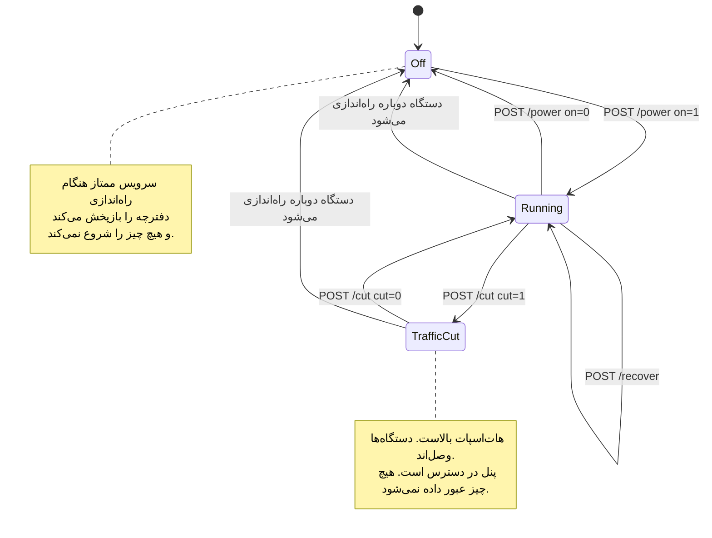

### کلید، `POST /power`

کلید کلِ دستگاه را روشن و خاموش می‌کند. خاموش کردن، `Stop` را روی سرویسِ ممتاز
صدا می‌زند، که پنج کار را به ترتیب انجام می‌دهد:

1. نرم‌افزار اتصال را متوقف می‌کند
2. نقطهٔ دسترسی و سرویسِ DHCP و DNS کنارش را متوقف می‌کند
3. فایل‌های پیکربندی‌ای را که آن دو با آن ساخته شده بودند حذف می‌کند
4. اگر کاسپین همان چیزی بوده که رادیو را باز کرده، دوباره آن را می‌بندد
5. دفترچهٔ برچیدن را بازپخش می‌کند

ببینید `internal/privsvc/start.go`، تابع `stopLocked`، و
`internal/hotspot/supervisor.go`، تابع `Supervisor.Stop`.

پیامدی که اهمیت دارد همان وسطی است. شبکهٔ وای‌فای دیگر وجود ندارد. هر دستگاهِ
وصل‌شده از آن می‌افتد، و این شاملِ گوشیِ در دستِ همان کسی است که دکمه را زده.

### قطعِ ترافیک، `POST /cut`

قطعِ ترافیک فقط ترافیکی را متوقف می‌کند که دستگاه از طرفِ آن دستگاه‌ها عبور
می‌دهد. یک مجموعه‌قواعدِ nftables را جای مجموعه‌قواعدِ دیگری بار می‌کند. ببینید
`internal/privsvc/cut.go`، تابع `setForward`، و `internal/netcfg/nftables.go`،
تابع `RulesetFor`.

آن دو مجموعه‌قواعد فقط در زنجیرهٔ forward فرق دارند و جای دیگری فرق نمی‌کنند.
`TestForwardCut_DiffersFromNormalOnlyInTheForwardChain` این را با مقایسهٔ
خط‌به‌خطِ زنجیره‌های input، output، prerouting و postrouting تصدیق می‌کند. در
مجموعه‌قواعدِ قطع، زنجیرهٔ forward هیچ چیزی را نمی‌پذیرد. یک `drop` صریح با
دلیلِ نوشته‌شده روی آن دارد، تا کسی که مجموعه‌قواعدِ زنده را می‌خواند دلیلِ
توقفِ ترافیک را ببیند، نه نبودِ قاعده را:

    iifname "wlan0" drop comment "client traffic cut by the user"

به زنجیرهٔ input دست زده نمی‌شود. پس دستگاه به جواب دادن ادامه می‌دهد: DHCP روی
پورت 67، DNS روی پورتِ DNS دستگاه‌ها، و پنل روی پورتِ خودش، هر کدام از سمتِ رابط
هات‌اسپات. نرم‌افزار اتصال متوقف نمی‌شود و نقطهٔ دسترسی هم متوقف نمی‌شود.
دستگاه‌ها وصل می‌مانند، اجارهٔ آدرسشان را نگه می‌دارند، و هنوز می‌توانند پنل را
باز کنند. آزمون: `TestForwardCut_StopsClientsAndKeepsThePanelReachable`.

### چرا این تفاوت تعیین می‌کند از روی گوشی کدام را می‌توانید بزنید

پنل به‌طور پیش‌فرض فقط به آدرسِ هات‌اسپات بایند می‌شود و به هیچ آدرس دیگری. سرو
کردنش روی شبکه‌ای که خودِ دستگاه روی آن نشسته، تنظیمی است که کاربر باید روشنش
کند، و در پیش‌فرضِ منتشرشده خاموش است. ببینید `internal/panel/listen.go`، تابع
`BindAddrs`، و `internal/state/state.go`، فیلد `PanelOnLAN`.

پس کسی که تنها دستگاهش یک گوشی روی هات‌اسپات است، می‌تواند از همان گوشی قطعِ
ترافیک را برگرداند. اما نمی‌تواند خاموش کردن را از آن برگرداند، چون خاموش کردن
همان شبکه‌ای را که از راهش به پنل می‌رسید برداشت. پس قطعِ ترافیک همان توقفِ
اضطراری‌ای است که کسی را که از آن استفاده می‌کند جا نمی‌گذارد. برگرداندنش هزینهٔ
اتصالِ دوباره ندارد، چون هیچ چیزی که دستگاه به آن وصل بود از بین نرفته است.

وقتی ترافیک باید همین حالا بایستد و قصد دارید برش گردانید، قطعِ ترافیک را بزنید.
فوری است و تأیید نمی‌خواهد، و تا وقتی برقرار است پنل این حالت را بی‌ابهام نشان
می‌دهد. وقتی کارتان با دستگاه تمام شده، یا می‌خواهید آداپتور وای‌فای به شبکه‌ای
که از آن آمده برگردد، کلید را بزنید. **از کلید به‌عنوان توقفِ اضطراری روی گوشی‌ای
که به هات‌اسپات وصل است استفاده نکنید.**

دو نکتهٔ کوچک‌تر، چون متنِ کوتاهِ روی صفحه راحت از زیرِ چشم رد می‌شود. اول، قطعِ
ترافیک روی دستگاهی که در حال کار نیست رد می‌شود، و این را با واژه‌های خودش
می‌گوید نه به شکلِ یک شکستِ ناشناخته. عبوری در کار نیست که متوقف شود. و
مجموعه‌قواعدی که رابطِ هات‌اسپاتِ ناموجودی را نام ببرد، تغییری است در دستگاهی که
تمام ثابتِ حالت خاموشش این است که همان‌طور که پیدا شده رها شده باشد. ببینید
`errNotRunning` و خطای `not-running`. دوم، قطعِ ترافیک در حافظه نگه داشته می‌شود
و در هیچ فایلی نوشته نمی‌شود، پس راه‌اندازیِ دوبارهٔ دستگاه آن را از بین می‌برد.
این عمدی است: کسی که نمی‌فهمد چرا اینترنتش قطع شده، با کشیدنِ برق آن را
برمی‌گرداند. کاری که راه‌اندازیِ دوباره **نمی‌کند** روشن کردنِ دستگاه است. سرویسِ
ممتاز هنگام راه‌اندازی دفترچه را بازپخش می‌کند و هیچ چیز را شروع نمی‌کند. ببینید
`cmd/caspian/serve_priv.go`. پس راه‌اندازیِ دوباره قطعِ ترافیک را پاک می‌کند و
دستگاه را خاموش می‌گذارد، و ترافیک وقتی دوباره جاری می‌شود که کلید زده شود، نه
پیش از آن.

### کنترلِ بازیابی، `POST /recover`

کنترلِ سوم راهِ بیرون آمدن از دستگاهی است که گیر کرده، بدون راه‌اندازیِ دوباره و
بدون ترمینال. همه چیز را متوقف می‌کند، دفترچهٔ برچیدن را بازپخش می‌کند تا هر
رابط و مسیر و قاعدهٔ فایروالی که این دستگاه عوض کرده سر جایش برگردد، و بعد از
روی تنظیماتِ ذخیره‌شده دوباره شروع می‌کند. `Service.Recover` همان
`recoverToCleanMachine` است و بعدش همان `Start` ای که کلید استفاده می‌کند، پس
بازیابی پیاده‌سازیِ دومِ شروع کردن نیست که بتواند از آن فاصله بگیرد.

این کنترل به خاطرِ یک روزِ اندازه‌گیری‌شده وجود دارد. در 2026-08-30 دستگاه بارها
به حالت‌هایی رسید که فقط کسی با نشستِ SSH می‌توانست پاکشان کند: رابطی که شروعِ
ناموفق ساخته بود و هرگز حذف نشد، آدرسی که از زیرش شسته شده بود، و مدخلی در دفترچه
که از یک شروعِ ناموفق جان به در برده بود. هر کدام از این‌ها با بازپخشِ چیزی که از
پیش نوشته شده قابلِ برگرداندن است، و هیچ‌کدام از پنل در دسترس نبود.

عمداً دستگاه را راه‌اندازیِ دوباره نمی‌کند و هیچ‌کدام از دو یونیتِ systemd را هم
دوباره شروع نمی‌کند، پس فرایندِ پنل و هر نشستِ SSH در تمامِ مدت بالا می‌مانند. اما
نقطهٔ دسترسی را متوقف و دوباره شروع می‌کند، پس دستگاهی که به هات‌اسپات وصل است از
شبکه بیرون می‌رود و وقتی هات‌اسپات برگشت دوباره وصل می‌شود.

---

## قاعده‌هایی که این پروژه خودش را به آن‌ها پایبند می‌داند

این‌ها آرزو نیستند. هر کدام سازوکاری دارند، و آن سازوکار نام برده شده است.

**بدون گرفتنِ آدرسِ خروجی از ترافیکِ واقعی، هیچ چیز «کار می‌کند» نامیده
نمی‌شود.** `docs/2026-08-29-design.md`، بخش 6. یک اتصال، نتیجه نیست. بسترِ
سخت‌افزاری وقتی هیچ آدرسِ خروجی‌ای گرفته نشده باشد نمرهٔ UNPROVEN می‌دهد، نه
PASS، و با کد 1 بیرون می‌آید.

**یک جملهٔ غلطِ مطمئن از هیچ جمله‌ای بدتر است.** خواننده‌ای که به او گفته‌اند
چیزی درست رسیدگی شده، نتیجه می‌گیرد چیزی برای وارسی نیست. پس هر اصلاح، یک آزمون
از خودش به جا می‌گذارد، نه یک جملهٔ بهتر. `TestNothingInTheApplianceWatchesTheUplink`
به این دلیل وجود دارد که دو سند زمانی ادعا می‌کردند دستگاه رابطِ اینترنتش را
می‌پاید و وقتی جابه‌جا شود فایروال را دوباره بار می‌کند.

**یک فرایندِ شروع‌شده، شاهدِ کار کردنش نیست.** رابطِ هات‌اسپات پیش از آنکه چیزی
به آن بایند شود از هسته بازخوانی می‌شود، و نقطهٔ دسترسی پیش از آنکه سرویس خودش
را «در حال کار» گزارش کند بازخوانی می‌شود. هر دو بازخوانی بعد از یک رویدادِ
اندازه‌گیری‌شده اضافه شدند که در آن هر فرمانی موفقیت برگردانده بود.

**هر سناریو دیده شده که شکست بخورد.** `TestEveryScenarioCanFail` یک نقصِ نام‌دار
را به هر رفتار تزریق می‌کند و لازم می‌داند که قرمز شود. آزمونی که هیچ‌کس شکستش را
ندیده، چراغِ سبزی است که به هیچ چیز وصل نیست.

**تبارِ هر فیکسچر در نامِ فایلش است.** `capture-pi5-` خروجیِ بایتیِ یک فرمانِ
واقعی روی دستگاهِ هدف است، `scenario-` دستگاهی است که هیچ‌کس اندازه‌اش نگرفته، و
`golden-` خروجیِ خودِ این پروژه است. آزمونی که فایلِ `capture-pi5-` می‌خواند
دربارهٔ دستگاهِ هدف ادعا می‌کند. آزمونی که فایلِ `scenario-` می‌خواند چنین ادعایی
نمی‌کند.

**یک راز در یک کامیت، همیشگی است.** `test/goldenscan` هر فیکسچرِ کامیت‌شده را
برای نشانه‌های ثبت‌شده و برای شکل‌های رازها جارو می‌کند، و نامِ فایل‌ها را هم مثل
بدنهٔ فایل‌ها بررسی می‌کند. دیده شده که رازِ کاشته‌شده را از هر کلاسی که می‌شناسد
گرفته است.

**کف‌های پوشش فقط بالا می‌روند.** هر عددی در `scripts/gate.sh` همان چیزی است که
یک بسته پس از کاری که آن را وارد کرد اندازه‌گیری شد، نه هدفی که کسی آرزویش را
داشت. بسته‌ای که سطری ندارد دروازه‌بندی نشده، و نبودِ سطر یعنی «هنوز کفی توافق
نشده»، نه «این بسته پوشش دارد».

**سمتِ ممتاز به هیچ چیزی که فراخواننده می‌فرستد اعتماد نمی‌کند.** هر فیلدِ هر
درخواست در برابرِ آنچه این دستگاه خودش تشخیص داده بررسی می‌شود. ردکردن یک کدِ خطا
از یک مجموعهٔ بسته است، هرگز یک جمله نیست، و هرگز مقداری که فراخواننده فرستاده
نیست.

**دستگاه از اینترنت چیزی نمی‌خواهد.** نه داده‌ای می‌فرستد، نه به خانه زنگ
می‌زند، نه گزارشِ خرابی بالا می‌فرستد، نه فونتِ وب می‌گیرد، نه فایلِ دادهٔ
جغرافیایی، و نه هیچ resolver گوگلی در هیچ پیش‌فرضی.

---

## چه چیزی را تضمین می‌کند

هر عنوان در اینجا با خروجیِ تولیدشدهٔ فایروال در `internal/netcfg/testdata/`، یا
با یک آزمونِ نام‌دار، یا با اندازه‌گیری‌ای که در مخزن ثبت شده پشتیبانی می‌شود.
`docs/BEHAVIOUR.md` فهرستِ خواندنیِ قول‌هاست. هر عنوان در آن، نامِ یک سناریو در
`test/bdd/` است، و هر سناریو یک نقصِ تزریق‌شدهٔ متناظر دارد. پس «این آزمون
می‌تواند همان چیزی را که ادعا می‌کند تشخیص دهد» خودش یک نتیجهٔ آزمون است.

### ترافیکِ عبوریِ دستگاه‌ها fail-closed است، و قاعدهٔ مسدودکننده به تونل نیاز ندارد

اصطلاحِ fail-closed یعنی وقتی تونل نباشد، ترافیک متوقف می‌شود و از راهِ دیگری
بیرون نمی‌رود.

سیاستِ زنجیرهٔ forward برابرِ `drop` است. اولین قاعده در آن، قاعدهٔ مسدودکنندهٔ
نشت است، و فقط نامِ هات‌اسپات و رابطِ اینترنت را می‌برد:

    iifname "wlan0" oifname "eth0" drop comment "fail-closed: client traffic never leaves by the uplink"

هر قاعده‌ای که به ترافیکِ دستگاه‌ها اجازه می‌دهد نامِ دستگاهِ تونل را می‌برد، پس
وقتی تونل ناپدید شود آن قواعد دیگر منطبق نمی‌شوند و سیاست همه چیز را drop
می‌کند. خودِ قاعدهٔ مسدودکننده وقتی تونل برود نمی‌تواند از کار بیفتد، چون نامی از
آن نبرده است. هر رابط با نام تطبیق داده می‌شود و هرگز با شماره، پس مجموعه‌قواعد
بدون حضورِ تونل هم بار می‌شود، و دقیقاً همان وقت است که لازم است. زنجیرهٔ
postrouting عمداً خالی است.

سناریو: "with the tunnel gone, nothing lets client traffic out by the uplink".
آزمونِ پشتیبانِ تحلیل‌گر: `TestWithoutInterfaceRemovesOnlyTheRulesNamingIt`.

### کلیدِ قطع، ترافیکِ خودِ دستگاه را هم پوشش می‌دهد

زنجیرهٔ output سیاستِ `drop` دارد با یک فهرستِ اجازهٔ نام‌دار. اجازه‌ها از شمردنِ
آنچه واقعاً روی دستگاهِ هدف اجرا می‌شود به دست آمده‌اند، نه از نمونه‌برداریِ
ترافیک، و هر اجازه در مجموعه‌قواعدِ تولیدشده، خواندنی را که آن را توجیه می‌کند با
خود دارد: سوکت‌های کلاینتِ DHCP از NetworkManager، systemd-timesyncd، DNS،
loopback، دستگاهِ تونل، کشفِ همسایهٔ IPv6، و سرورِ پروکسی که **با آدرس** اجازه
دارد نه با پورت، تا ترابری‌ای که روی UDP و پورت 443 است بی‌سروصدا نشکند. یک
اجازه از استدلال آمده نه از اندازه‌گیری، و خودش این را می‌گوید: جواب دادنِ دستگاه
به DHCP در نقشِ سرور روی هات‌اسپات، که conntrack نمی‌تواند پوششش دهد چون پاسخِ
DHCP و درخواستش هیچ چندتاییِ مشترکی ندارند.

تحریک‌ها و مهم‌تر از آن، کنترل‌های منفی، در `PROVENANCE.md` زیر عنوانِ
"The three provocations, run with the policy loaded" ثبت شده‌اند. آزمون‌ها:
`TestRestrictedEgress_PermitList`،
`TestRestrictedEgress_AcceptsEstablishedBeforeItDropsAnything`،
`TestRestrictedEgress_ServerIsPermittedByAddressNotPort`.

**هزینه در سرآیندِ خودِ مجموعه‌قواعد نوشته شده و لازم نیست کشف شود: تا وقتی
دستگاه روشن است، `apt update` از یک shell روی دستگاه شکست می‌خورد.**

### یک قطعِ اضطراری هست که هات‌اسپات را با خودش نمی‌برد

خاموش کردنِ دستگاه هات‌اسپات را هم پایین می‌آورد، که گوشیِ نگه‌دارندهٔ دکمه را
قطع می‌کند. پس کنترلِ جداگانه‌ای هست که ترافیکِ عبوریِ دستگاه‌ها را قطع می‌کند و
هات‌اسپات و DHCP و DNS و پنل را بالا می‌گذارد. ببینید `internal/privsvc/cut.go`
و کنشِ `cut` در `internal/panel/priv.go`.

قطعِ ترافیک وضعیتِ زمانِ اجراست و هرگز روی دیسک نوشته نمی‌شود، پس کشیدنِ برق آن
را برمی‌گرداند. آزمون‌ها: `TestCuttingClientTrafficLeavesTheWayBack`،
`TestACutIsNeverWrittenDown`، `TestACutDoesNotSurviveARestart`،
`TestForwardCut_StopsClientsAndKeepsThePanelReachable`.

اینکه کدام‌یک از آن دو را باید زد، و هر کدام چه چیزی را برمی‌چیند، در بخشِ
«کنترل‌ها، و اینکه کدام را باید زد» در بالا آمده است.

### رابط را از هسته بازخوانی می‌کند، به‌جای اعتماد به یک فرایند

یک فرایندِ شروع‌شده شاهدِ کار کردنش نیست. این یک خرابیِ واقعی بود. سرآیندِ
`internal/privsvc/readback.go` ثبت کرده که در 2026-08-30 سرویس خودش را «در حال
کار» با یک هات‌اسپات روی `wlan0` ثبت کرد، در حالی که `wlan0` هنوز یک ایستگاه روی
شبکهٔ خانه بود. hostapd فرایندی زنده بود که سوکتِ کنترلش جواب نمی‌داد. گوشی‌ای در
همان اتاق یازده شبکه فهرست کرد که شبکهٔ ما میانشان نبود. و dnsmasq داشت به دستگاهِ
یک غریبه روی شبکهٔ محلیِ کسی دیگر با DHCPNAK جواب می‌داد.

تا وقتی `netcfg.AssertHotspotInterfaceReleased` ثابت نکند رابطِ هات‌اسپات آزاد
است، هیچ چیز اجازهٔ بایند شدن به آن را ندارد، و تا وقتی
`AssertHotspotIsAccessPoint` نقطهٔ دسترسی‌ای را بازخوانی نکند که نامِ مورد انتظار
را پخش می‌کند، هیچ چیز خودش را «در حال کار» گزارش نمی‌کند. آزمون‌ها:
`TestNothingBindsToTheHotspotInterfaceUntilItIsProvedFree`،
`TestTheServiceDoesNotReportRunningUntilTheAccessPointReadsBackAsOne`،
`TestAnAccessPointBroadcastingAnotherNameIsNotOurs`،
`TestTheReleaseIsReadBackBeforeAnythingBindsAndTheAccessPointAfter`.

### وای‌فایتان را پس می‌گیرید

هر تغییرِ شبکه همراه با وارونه‌اش **پیش از** انجام شدن در
`/var/lib/caspian/netcfg.journal` نوشته می‌شود، و خاموش کردن آن‌ها را به ترتیبِ
معکوس بازپخش می‌کند. این ثبت روی دیسک است نه در حافظه، پس فرایندی که کشته شود یا
قطعِ برق آن را از بین نمی‌برد. دستگاهی که وسطِ یک تغییر مرده باشد، پیش از آنکه به
دستگاه نگاه کند یا چیزِ تازه‌ای اعمال کند، این ثبت را بازپخش می‌کند.

تصاحبِ یک رابطِ وای‌فای گام‌به‌گام در دفترچه ثبت می‌شود. توالیِ رفت و وارونه‌هایش
روی دستگاهِ هدف اجرا شده و در `PROVENANCE.md` زیر عنوانِ
"The release sequence has been run on the target" ثبت شده‌اند. آن چهار فرمان
بیرون رفتند، و وارونه‌ها هشت ثانیه بعد دستگاه را با آدرسِ خودش به شبکهٔ خودش
برگرداندند.

یک تغییر عمداً وارونه ندارد، و `TestPlan_InvariantsHoldOnEveryModelledMachine`
تصدیق می‌کند که تنها همان یکی است: بالا آوردنِ رابطِ هات‌اسپات. پایین آوردنِ یک
رادیو هنگامِ خروج بدتر از بالا گذاشتنش است، چون وای‌فایِ خودِ دستگاه، و پنلی که
کاربر دارد می‌خواند، می‌توانند روی همان باشند.

سناریوها: "turning the switch off returns every change the box made"،
"a teardown replayed from the journal of a killed process undoes the same
changes"، "a box killed halfway through cleans up before it does anything else".
آزمون‌ها: `TestJournal_RecordsInverseBeforeTheChange`،
`TestTeardown_ReplaysInExactReverseOrder`،
`TestRecover_UndoesAJournalLeftByAKilledProcess`،
`TestTheTakeoverReleasesTheInterfaceItSaysItWillRelease`.

اگر وارونه‌ای شکست بخورد، وارونهٔ خودِ فایروال **نگه داشته می‌شود** و اجرا
نمی‌شود، پس دستگاهی که نتوانسته مسیرهایش را برگرداند، مسدودسازی‌اش را حفظ
می‌کند. آزمون: `TestTheFirewallIsNotRemovedWhenAnEarlierInverseFailed`.

### کانفیگِ پیست‌شده به هیچ صفحه‌ای، هیچ گزارشی و هیچ فایلِ خواندنی‌ای نمی‌رسد

هر چه این جریان تولید می‌کند برای یافتنِ کانفیگِ پیست‌شده جست‌وجو می‌شود:

- هر خطا، و هر پیامی که به کاربر نشان داده می‌شود
- خط‌های گزارشِ دستگاه
- توصیفی که پنل از کانفیگ می‌دهد
- تنظیماتِ ذخیره‌شده، آن‌طور که برای تشخیص رندر می‌شوند
- فایروالِ تولیدشده
- پیکربندیِ تولیدشدهٔ DHCP و DNS
- گزارشِ خودِ نرم‌افزار اتصال
- دفترچه، روی دیسک
- درخواستی که از پنلِ غیرممتاز به سرویسِ ممتاز می‌رود

در هیچ‌کدام نیست. و بررسی می‌شود که در آن دو جایی که باید باشد هست، تا آزمون
نتواند به این دلیل که کانفیگ اصلاً گم شده قبول شود.

سناریوها: "the pasted credential never reaches a screen, a log or a readable
file"، "the hotspot password reaches the access point and nothing else".
آزمون‌ها: `TestPastedConfigNeverAppearsInAResponseOrALog`،
`TestFailedConfigPathsDoNotEchoTheInput`، `TestStartRequestRedactsItself`،
`TestNoCredentialReachesTheAdvancedView`،
`TestTheServerAddressNeverAppearsInADiagnosticLine`.

### پنل از اینترنت چیزی نمی‌خواهد

هر شیوه‌نامه و اسکریپت و آیکنی که مرورگر بار می‌کند با `go:embed` داخل فایل
اجرایی کامپایل شده است. ببینید `internal/panel/assets.go`. هیچ فونتِ وبی در کار
نیست: پشتهٔ فونتِ شیوه‌نامه تماماً از فونت‌های سیستمی است و فونت‌های
فارسی‌خوان اول می‌آیند.

دلیلِ حریم خصوصی این است که یک دارایی از راه دور، آدرسِ هر کسی را که پنل را باز
می‌کند به یک شخص ثالث می‌گوید. دلیلِ قوی‌تر در دسترس بودن است. پنل باید وقتی تونل
پایین است بار شود، و دقیقاً همان وقت است که کسی به آن نیاز دارد.

دو سازوکار، نه یکی. `TestNoAssetReferencesAnExternalURL` و
`TestNoRenderedPageReferencesAnExternalURL` دارایی‌ها و هر صفحهٔ رندرشده را برای
یافتنِ یک URL مطلق پویش می‌کنند. `setSecurityHeaders` با هر پاسخ
`default-src 'none'` می‌فرستد و هر منبعِ فهرست‌شده را روی `'self'` می‌گذارد، پس
مرورگر آن یکی را که از آزمون‌ها رد شده باشد رد می‌کند. هیچ کلاینتِ HTTP خروجی‌ای
در هیچ جای `internal/panel` بیرون از آزمون‌های خودش وجود ندارد.

پیکربندیِ تولیدشده هم هیچ resolver گوگلی را در هیچ جا نام نمی‌برد، و هیچ قاعدهٔ
`geoip:` یا `geosite:` به کار نمی‌برد، چون هر کدام یک دانلود را به محصولی
برمی‌گرداند که تمامِ داستانِ نصبش یک فایلِ اجراییِ وارسی‌شده است. آزمون‌ها:
`TestNoGoogleAnywhereInGeneratedConfigs`،
`TestGoogleResolverIsRejectedAtTheSource`. سناریو: "the box needs no download and
asks no Google server anything".

### دسترسیِ ممتاز جدا شده است

`caspian serve --privileged` با root اجرا می‌شود و مالکِ مسیرها، فایروال، نقطهٔ
دسترسی و نرم‌افزار اتصال است. یک فهرستِ کوتاه از کنش‌های نام‌دار را روی یک سوکتِ
یونیکس می‌پذیرد و هرگز فرمانی را که از ورودیِ کاربر ساخته شده باشد نمی‌پذیرد.
`caspian serve --panel` با حسابِ غیرممتازِ `caspian` اجرا می‌شود و مالکِ رابطِ وب
است و نه چیز دیگری. برای واژگان و قالبِ فریم، بخشِ «معماری» را در بالا ببینید.

رمزِ پنل با argon2id هش می‌شود. ببینید `internal/state/password.go`. این یک رمزِ
محلی روی خودِ دستگاه است. هیچ حسابی در هیچ جای دیگری وجود ندارد.

### ساعت پیش از هر دست‌دادنی بررسی می‌شود

یک Pi ساعتِ باتری‌دار ندارد، و دو سازوکارِ جدا به ساعتِ دیواری وابسته‌اند.
REALITY آن را داخلِ دست‌دادن می‌نویسد، و اینکه xray-core چه کانفیگ‌هایی را
**می‌پذیرد** به تاریخ بستگی دارد. پس دستگاهی که ساعتش غلط بالا بیاید فقط در وصل
شدن شکست نمی‌خورد. کانفیگی را می‌پذیرد که همان فایلِ اجرایی، پس از درست شدنِ
ساعت، ردش می‌کند.

بررسی پیش از اعتبارسنجی و پیش از هر تلاشی اجرا می‌شود. ببینید
`internal/privsvc/clock.go`، که از `Service.Start` به‌عنوانِ گام 1 از
`applyLocked` صدا زده می‌شود. یک خطای متمایز بالا می‌آورد تا پنل کانفیگِ کاربر را
مقصر نداند. آزمون: `TestClockFailureIsNotBlamedOnTheConfig`.

### سه شکستِ کانفیگ از هم جدا می‌شوند

«نتوانستم آن لینک را بخوانم»، «خواندمش، و همان‌طور که هست قابلِ استفاده نیست»، و
«لینک سالم بود و سرور جواب نداد» سه کارِ متفاوت از کاربر می‌خواهند، و سومی از همه
رایج‌تر است. مقصر دانستنِ کانفیگ در وهلهٔ اول همان چیزی است که باعث می‌شود کسی
کانفیگی را که هرگز خراب نبوده دور بیندازد. پیش از خوانده شدنِ متنِ پیست‌شده به
هیچ چیزِ روی دستگاه دست زده نمی‌شود. سناریوها: "text that is not a link at all is
refused before anything is touched"، "a link the engine will not accept is told
apart from one that would not parse"، "a link whose server never answers is not
blamed on the link".

---

## چه چیزی را تضمین نمی‌کند

همین فهرست است که باید با دقت خوانده شود.

### DNS روی HTTPS در پورت 443 حمل می‌شود، مسدود نمی‌شود، و هیچ چیزِ اینجا نمی‌تواند ببیندش

DNS دستگاه‌ها روی پورت 53 در هر دو پروتکل به همین دستگاه بازهدایت می‌شود، نه
اینکه فقط اجازه داده شود. پس دستگاهی که resolver در خودش کدگذاری شده همین‌جا جواب
می‌گیرد، و اجازه ندارد بیرون برود تا به آنکه به آن گفته‌اند برسد. DNS روی TLS
روی 853 با یک TCP reset رد می‌شود، تا دستگاه به پورتِ بازهدایت‌شده عقب بنشیند.
DNS روی QUIC روی 853 دور ریخته می‌شود.

DNS روی HTTPS در پورت 443 از هر HTTPS دیگری قابلِ تشخیص نیست و مثل هر چیزِ دیگری
از تونل حمل می‌شود. دستگاهی که از آن استفاده می‌کند داخلِ تونل است و نشت نمی‌دهد.
همچنین نامرئی است. هیچ چیز در این پروژه، و هیچ چیز در بسترِ سخت‌افزاری، نمی‌تواند
آن را ببیند. این یک محدودیتِ طراحی است. این نکته در خودِ مجموعه‌قواعدِ تولیدشده،
در `docs/BEHAVIOUR.md`، و در خروجیِ چاپ‌شدهٔ بررسیِ نشتِ DNS هم آمده، نه فقط
اینجا.

### IPv6 مسدود است، و مسیرِ IPv6 تمام نشده است

هیچ تونلِ IPv6 در کار نیست. دستگاهی که مسیرِ IPv6 سالمی داشته باشد آن را به IPv4
ترجیح می‌دهد و کلاً از تونل بیرون می‌زند، پس سیاستِ پیش‌فرض مسدود کردن است. چهار
چیز این را نگه می‌دارد. `IPv6Block` پیش‌فرضِ `netcfg.DefaultOptions` است. دستگاه
IPv6 را عبور نمی‌دهد. فایروال، IPv6 عبوری روی هات‌اسپات را در هر دو جهت drop
می‌کند. و اعلان‌های روتر به سمتِ هات‌اسپات دور ریخته می‌شوند، تا دستگاهی نتواند
به خودش آدرس بدهد. سناریو: "clients are never offered the IPv6 the tunnel cannot
carry".

`IPv6Forward` به‌عنوانِ یک گزینه وجود دارد و کامنتِ خودش می‌گوید آن را تنظیم
نکنید. نشان داده نشده که ورودیِ TUN نرم‌افزار اتصال روی دستگاهِ هدف IPv6 را حمل
کند. این گزینه عمداً هیچ قاعدهٔ اجازه‌ای هم به زنجیرهٔ forward اضافه نمی‌کند:
قاعده‌های IPv4 در هر دو جهت زیرشبکهٔ هات‌اسپات را نام می‌برند، هیچ پیشوندِ v6ای در
نقشه نیست که نامش برده شود، و قاعده‌ای که فقط نامِ دو رابط را بگوید هر آدرسِ مبدأیی
را که کاربر بنویسد می‌پذیرد. `TestRuleset_NoUnconstrainedIPv6AcceptInForward` همین
خط را نگه می‌دارد.

**«مسدود» دربارهٔ مسیریابی است و نه دربارهٔ DNS، و این تفاوت مهم است.** پرسشِ AAAA
از یک دستگاهِ وصل‌شده نه حذف می‌شود و نه خالی پاسخ داده می‌شود. به موتور می‌رود، از
داخلِ تونل می‌گذرد، و با رکوردهای AAAA واقعی برمی‌گردد، چون سندِ موتور `UseIP` را
می‌خواهد و dnsmasq هیچ `filter-AAAA` تنظیم نمی‌کند. پس دستگاه آدرس‌های IPv6ای را
یاد می‌گیرد که هیچ راهی برای رسیدن به آن‌ها ندارد و به IPv4 برمی‌گردد.

تا وقتی هیچ چیز نتواند به یک دستگاه آدرسِ v6 بدهد این بی‌ضرر است، و اولین چیزی است
که اگر روزی چیزی چنین آدرسی بدهد بی‌ضرر نمی‌ماند، چون دستگاهی که مسیرِ v6 کارآمد
داشته باشد پاسخِ AAAA را ترجیح می‌دهد و از مسیری بیرون می‌رود که این جعبه حملش
نمی‌کند. این را اینجا نوشته‌ایم تا غافلگیری نباشد، و
`TestAAAAQueriesAreAnsweredAndNotSuppressed` هر دو نیمه را پین می‌کند تا تغییرش
ناچار یک تصمیم باشد.

**بسترِ سخت‌افزاری اصلاً نمی‌تواند به IPv6 نمره بدهد، پس هیچ نتیجهٔ IPv6 از آن
معنایی ندارد.** `test/hardware/README.md` زیر عنوانِ
"What this vantage cannot grade: IPv6" ثبت کرده که گوشی فقط یک آدرسِ link-local
دارد، که `ip -6 route show default` هم روی گوشی و هم روی Pi خالی است، و که اتصال
به یک آدرسِ صریحِ IPv6 جوابِ "Network is unreachable" می‌گیرد. روی آن شبکهٔ محلی
اصلاً IPv6 وجود ندارد، پس یک بررسیِ نشتِ IPv6 که آنجا اجرا شود بدون آنکه دستگاه
کاری کرده باشد قبول می‌شود. هر نتیجهٔ سخت‌افزاری‌ای که این پروژه دارد یک نتیجهٔ
IPv4 است. هر کسی که این را روی شبکه‌ای با IPv6 سالم اجرا می‌کند باید آن را یک
پرسشِ تازه بداند، نه پرسشی که پوشش داده شده، و باید انتظار داشته باشد که خودش
آزمون را بنویسد، نه اینکه آزمونی را روشن کند.

### ترافیکِ خودِ دستگاه، عمداً بیرون از قولِ fail-closed است

آن قول دربارهٔ **ترافیکِ عبوریِ دستگاه‌ها** است. اتصالِ خودِ این دستگاه به سرورِ
شما باید مستقیم به رابطِ اینترنت برسد وگرنه اصلاً تونلی وجود ندارد، و
`docs/2026-08-29-design.md` بخش 7 به همین دلیل ترافیکِ خودِ دستگاه را بیرونِ آن
تضمین می‌گذارد.

کلیدِ قطع روی زنجیرهٔ output آن را تنگ‌تر می‌کند و نمی‌بنددش. مجموعه‌قواعدِ
تولیدشده باقی‌ماندهٔ آن را در سرآیندِ خودش می‌نویسد. DNS یک سوراخ است: هر چیزی
روی دستگاه هنوز می‌تواند روی پورت 53 به شبکه برسد، و نامِ میزبانِ سرور پیش از
آنکه تونلی وجود داشته باشد به‌صورتِ آشکار روی شبکهٔ محلی ترجمه می‌شود. هیچ‌کدام
نشتِ ترافیکِ دستگاه‌ها نیست، و کلیدِ قطع هیچ‌کدام را بدتر نمی‌کند.

سیاستِ زنجیرهٔ input برابرِ `accept` است، آن هم عمدی و آن هم نوشته‌شده در
مجموعه‌قواعد. نسخهٔ قبلی آن را `drop` گذاشته بود، و `PROVENANCE.md` ثبت کرده وقتی
روی دستگاهِ هدف اندازه‌گیری شد چه شد. هر اتصالِ ورودیِ تازه رد شد و SSH از جواب
دادن افتاد، در حالی که نشستِ از پیش باز همچنان کار می‌کرد، و این روی یک دستگاهِ
بدون صفحه‌نمایش از یک کرش قابلِ تشخیص نیست. تنها جایی که زنجیرهٔ input چیزی را
محدود می‌کند سمتِ هات‌اسپات است، جایی که یک دستگاهِ وصل‌شده به DHCP و DNS و پنل و
ICMP echo می‌رسد و به هیچ چیزِ دیگری روی دستگاه نمی‌رسد.

### جداسازیِ دستگاه‌ها یک قاعده است، نه یک اندازه‌گیری

مجموعه‌قواعد شاملِ `iifname "wlan0" oifname "wlan0" drop` است. حضورِ این قاعده
بررسی می‌شود. کار کردنش بررسی نمی‌شود.

### هیچ چیز در این مخزن آدرسِ خروجی نمی‌گیرد

`test/tunnel` بایت‌های واقعی را از دلِ یک سرور واقعیِ xray-core عبور می‌دهد، و هر
چه در آن است روی loopback است، پس هیچ آدرسِ خروجی‌ای نمی‌گیرد و نمی‌تواند
بگیرد. `test/bdd` نه شبکه دارد، نه رادیو، نه root و نه دستگاهِ تونل. نرم‌افزار
اتصالِ واقعی را در فرایند و از راهِ بارگذارندهٔ واقعیِ کانفیگ اجرا می‌کند، پس
«نرم‌افزار اتصال این کانفیگ را پذیرفت و شروع کرد» همان معنایی را می‌دهد که
می‌گوید، اما ورودیِ تونل خاموش است.

پس هیچ چیز در این مخزن استانداردِ خودِ این پروژه را برای «کار می‌کند» نامیدنِ
چیزی برآورده نمی‌کند. `docs/BEHAVIOUR.md` با بخشی به نامِ
"What this suite does not prove" تمام می‌شود که فهرست می‌کند چه چیزی هنوز بدهکار
است. آن را بخشی از مجموعهٔ آزمون بخوانید.

### هیچ چیز فایروال را پس از بار شدن دوباره بررسی نمی‌کند

نقصِ D1 در پایین را ببینید. اگر چیزی جدول را در حالی که دستگاه در حال کار است
پاک کند، دستگاه به عبور دادن ادامه می‌دهد، پنل به گزارشِ «متصل» ادامه می‌دهد، و
هیچ چیز متوجه نمی‌شود.

### هیچ چیز رابطِ اینترنت را نمی‌پاید

جابه‌جا شدنِ اینترنت، چون کابلی کشیده شد یا اجاره‌ای جور دیگری تمدید شد، تغییری
است که هیچ چیز برایش بلند شکست نمی‌خورد. مسیرِ سنجاق‌شده به سرور هنوز وجود دارد و
هنوز به آدرسی اشاره می‌کند که دیگر راهِ بیرون رفتن نیست. دستگاه متوجه نمی‌شود، و
تونل تا وقتی کسی دوباره کلید را بزند متوقف می‌ماند.

هزینهٔ این، در دسترس بودن است نه حریم خصوصی. ترافیکِ دستگاه‌ها در تمامِ مدت مسدود
می‌ماند، چون سیاستِ forward برابرِ drop است و هر accept در آن نامِ تونل را
می‌برد. `netcfg.WatchUplink` و `Plan.RederiveForUplink` وجود دارند و کار
می‌کنند، و هیچ کدِ منتشرشده‌ای هیچ‌کدام را صدا نمی‌زند.
`TestNothingInTheApplianceWatchesTheUplink` همان چیزی است که جلوی برگشتنِ جملهٔ
وارونه به داخلِ اسناد را می‌گیرد، جایی که تا 2026-08-30 ایستاده بود.

### حالت B هرگز روی سخت‌افزار واقعی اجرا نشده است

هر فیکسچرِ حالت B نوشته شده است. `PROVENANCE.md` ثبت کرده که دستگاهِ هدف یک رادیو
دارد و هیچ آداپتور USB ای ندارد، پس چیدمانی که این محصول به مردم می‌گوید برایش
آداپتور بخرند، در برابرِ بایت‌هایی اثبات شده که هیچ‌کس اندازه‌شان نگرفته.

---

## واقعاً چه چیزی وارسی شده است

### مجموعهٔ آزمونِ Go، همین مخزن، اندازه‌گیری‌شده در 2026-08-31

روی کامیتِ `5b0a8a7` با درختِ کاریِ تمیز، روی go1.27.0 darwin/arm64:

    go build ./...                 exit 0
    go test -count=1 -v ./...      exit 0

آن اجرا 1577 آزمون شاملِ زیرآزمون‌ها را اجرا کرد: 1572 قبول، 5 رد شده (skip)، 0
مردود. پانزده بسته `ok` گزارش دادند. دو بسته هیچ فایلِ آزمونی ندارند:
`bdd/harness` و `local/devpanel`. آن 5 رد شدن اعلام می‌کنند چه چیزی را اثبات
نمی‌کنند: چرخهٔ عمرِ دستگاهِ TUN، که فقط لینوکسی است و به root و `/dev/net/tun`
نیاز دارد؛ سه بررسیِ پیکربندیِ dnsmasq که به نصب بودنِ dnsmasq نیاز دارند؛ و یک
تخلیهٔ PNG از QR که باید خودتان روشنش کنید.

اجرای ثبت‌شدهٔ قبلی، روی کامیتِ `dd15ad6` در 2026-08-30، تعداد 1323 آزمون شاملِ
زیرآزمون‌ها را اجرا کرد: 1319 قبول، 4 رد شده، 0 مردود، در دوازده بسته که `ok`
گزارش دادند.

**`-count=1` اختیاری نیست.** حافظهٔ نهانِ نتیجه را از کار می‌اندازد. بدون آن،
اجرای دوم خط‌های PASS اجرای اول را چاپ می‌کند و با کد 0 بیرون می‌آید، در حالی که
هیچ چیز اجرا نکرده است.

دروازهٔ کامل `scripts/gate.sh` است: gofmt، `go vet`، کلِ مجموعهٔ آزمون همراه با
race detector، و کفِ پوشش برای هر بسته. پیش از آنکه آن را به لوله‌ای بدهید
سرآیندش را بخوانید. یک لولهٔ shell وضعیتِ آخرین فرمانش را برمی‌گرداند، و همین تله
پیش‌تر در این پروژه یک سبزِ دروغین ساخته است.

`packaging/test-install.sh` آن دو اسکریپتِ shell را روی هر دستگاهی که bash دارد
پوشش می‌دهد، از جمله دستگاهی که نصب روی آن ممکن نیست.

### مجموعهٔ آزمونِ رفتار

`docs/BEHAVIOUR.md` تعداد 24 سناریو را فهرست می‌کند. اجرای 2026-08-31 هر 24 تا را
اجرا کرد، و `TestEveryScenarioCanFail` تعداد 24 نقصِ تزریق‌شدهٔ متناظر را اجرا
کرد، پس هر سناریو دیده شده که برای همان چیزِ مشخصی که ادعای تشخیصش را دارد قرمز
شود. `TestBehaviourDocumentListsEveryScenario` اگر سند و مجموعهٔ آزمون از هم
فاصله بگیرند، در هر دو جهت، شکست می‌خورد. برای اجرای یکی:

    go test ./test/bdd/ -run 'TestBehaviour/the_firewall'

### مجموعهٔ آزمونِ حمل

`test/tunnel` هر کدام از هفت اسکیمی را که تجزیه‌کننده می‌پذیرد از دلِ یک سرورِ
واقعیِ xray-core روی loopback می‌راند. هر کدام باید یک درخواستِ HTTP را به مبدأیی
برساند که فقط سمتِ دورِ تونل به آن دسترسی دارد. برای اینکه هر سطر چه چیزی را
پوشش می‌دهد و چه چیزی را نه، بخشِ «چه چیزی از دلِ یک سرورِ واقعی بایت حمل کرده
است» در بالا را ببینید. پیش از آنکه این بسته وجود داشته باشد، قوی‌ترین جمله‌ای که
دربارهٔ شش تا از آن هفت پروتکل برقرار بود این بود که نرم‌افزار اتصال سندی را که
تولید می‌کنند بار می‌کند.

### روی سخت‌افزارِ هدف

`internal/netcfg/testdata/PROVENANCE.md` همان ثبت است، و دربارهٔ تفاوتِ آنچه
گرفته شده و آنچه نوشته شده دقیق است. نامِ فایل‌ها کلاس را حمل می‌کنند:
`capture-pi5-` خروجیِ بایتیِ یک فرمانِ واقعی روی Pi است، `scenario-` دستگاهی است
که هیچ‌کس اندازه‌اش نگرفته، و `golden-` خروجیِ خودِ این پروژه است.

آنچه روی Pi اندازه‌گیری و همان‌جا ثبت شد: هر پنج مجموعه‌قواعدِ تولیدشدهٔ متمایز
که `nft -c -f` آن‌ها را تجزیه کرد، با sha256 هر فایل که روی خودِ Pi خوانده شد و
نه روی دستگاهِ توسعه‌دهنده، و `nft list ruleset` که پیش و پس از آن خالی بود.
توالیِ آزاد کردنِ رابط و وارونه‌هایش. درایوری که از ساختنِ رابطِ AP دوم سر باز
می‌زند در حالی که تغییرِ نوعِ رابطِ موجود را می‌پذیرد. تحریک‌های کلیدِ قطع همراه
با کنترل‌های منفی‌شان. و قفل‌شدنی که سیاستِ input باعثش شد و همان سیاست را
پس گرفت.

آن فایل همچنین ثبت کرده که جایگزین کردنِ بایت‌های نوشته‌شده با بایت‌های
اندازه‌گیری‌شده چه چیزهایی را شکست، که همان استدلالِ نگه داشتنِ هر دو نوع است.
چند نقص در هر اجرای پیشین سبز مانده بودند، از جمله یک مجموعه‌قواعدِ فایروال که
هیچ هسته‌ای بارش نمی‌کرد، و یک برچیدن که روی دستگاهی که فیلترِ مسیرِ معکوس روشن
داشت آن را خاموش می‌کرد.

### سرتاسر، با یک گوشیِ واقعی

بستر `test/hardware/caspian-hw` است و دستورکارش `docs/HARDWARE-TEST.md`.
استانداردش استانداردِ خودِ این پروژه است. یک اتصال نتیجه نیست، و یک ترابری فقط
وقتی اثبات شده که ترافیکِ واقعی از آن عبور کرده و آدرسِ خروجی گرفته و با سروری که
کانفیگ نام می‌برد تطبیق داده شده باشد. آدرسِ خروجی‌ای که با مبنای بدونِ تونل یکی
باشد یک نشت است و از هر چیزِ دیگری در آن اجرا بالاتر می‌ایستد. گوشی‌ای که وسطِ
ضبط وضعیتِ شبکه‌اش را عوض کند، خواندن را VOID می‌کند، نه قبول و نه نشت.

یک اجرای ثبت‌شده در 2026-08-30، با نامِ `run-20260830T144015Z`، روی IPv4 این نمره
را داد:

- دو کانفیگ اثبات شدند، هر کدام با `verdict PASS` و `sources agree` و یک آدرسِ
  خروجی از هر دو منبعِ مستقل، تطبیق‌داده‌شده با دستگاهی که کانفیگ نامش را می‌برد.
- اثرِ انگشتِ خروجی وقتی کانفیگ عوض شد تغییر کرد.
- بررسیِ DNS در یک پنجرهٔ 30 ثانیه‌ای، یک برچسبِ `.invalid` تصادفیِ مخصوصِ همان
  اجرا را صفر بار به‌صورتِ آشکار روی رابطِ اینترنت پیدا کرد. چهار بستهٔ DNS آشکار
  در همان پنجره از آن رابط عبور کردند، و آن‌ها مالِ خودِ دستگاه‌اند، که طراحی
  بیرونِ تضمین می‌گذاردشان. دقیقاً به همین دلیل است که این بررسی دنبالِ برچسبی
  می‌گردد که هیچ چیزِ دیگری روی شبکه نمی‌توانست تولیدش کند، به‌جای شمردنِ
  بسته‌های پورت 53، که نمی‌توانند پرسشِ فرارکردهٔ یک دستگاه را از پرسشِ خودِ
  دستگاهِ کاسپین تشخیص دهند.
- fail-closed: با متوقف بودنِ نرم‌افزار اتصال و برداشته شدنِ اینترنتِ همراهِ گوشی
  با حالت پرواز، هیچ‌کدام از دو منبع به اینترنت نرسید، در حالی که پنل هنوز از
  روی هات‌اسپات جواب می‌داد. پس این فایروال بود که ترافیک را رد می‌کرد، نه یک
  لینکِ مرده. دو تلاشِ قبلی در همان گام نمرهٔ VOID گرفتند و به‌جای گزارش شدن،
  دوباره گرفته شدند.

دو نکته دربارهٔ آن ثبت. در تلاشِ سوم روی آخرین گام به قبولی رسید، و آن دو خواندنِ
VOID در دفتر هستند و پاک نشده‌اند. و فراورده‌های آن اجرا زیرِ `local/` زندگی
می‌کنند که در gitignore است، پس **در این مخزن نیستند**. اگر این را کلون کنید،
نمی‌توانید آن اجرا را وارسی کنید. فقط می‌توانید خودتان بستر را دوباره اجرا کنید.

دو منبع به کار می‌رود چون یکی می‌تواند از حافظهٔ نهان یا کهنه باشد، و هر دو به
آدرس‌های IP سنجاق شده‌اند نه به نام‌ها. `docs/HARDWARE-TEST.md` دلیلش را در
پاراگرافی توضیح می‌دهد که خودش آن را مهم‌ترین پاراگرافِ آن فایل می‌نامد. resolver
آن شبکهٔ محلی سرویس‌های اعلامِ IP را به چاهک می‌فرستد. پس دستگاهی که هیچ چیز جز
سرورِ DNS را عوض نکرده باشد و اصلاً هیچ ترافیکی را تونل نکرده باشد، دقیقاً همان
امضایی را نشان می‌داد که بستری با ترجمهٔ نام دنبالش می‌گردد. و نمرهٔ قبول
می‌گرفت.

بستر هر کانفیگ، آدرسِ سرور، شناسهٔ کاربر و کلید را از هر چه می‌نویسد پاک می‌کند.
هر فراورده را دوباره می‌خواند تا مطمئن شود پاک‌سازی گرفته، و یک جاروی جداگانه
دارد که کلِ اجرا را برای هر چیزی که از فیلتر فرار کرده دوباره می‌خواند. هیچ ضبطِ
بسته‌ای هرگز از Pi بیرون نمی‌رود. خروجیِ tcpdump روی خودِ دستگاه به دو عدد
فروکاسته می‌شود، چون یک ضبط روی آن رابطِ اینترنت، ضبطِ مرورِ خودِ نگهدارندهٔ
پروژه است.

---

## نقص‌های باز

`docs/DEFECTS.md` فهرستِ چیزهایی است که شناخته‌شده و مستند و اصلاح‌نشده‌اند،
همراه با آنچه اندازه‌گیری شد، آنچه هزینه می‌برد، و آنچه هر کدام را می‌بندد.
هیچ‌کدام نشتِ ترافیکِ دستگاه‌ها نیست. خلاصه‌شده، تا این فایل بهانه‌ای برای نخواندنِ
آن یکی نشود:

- **D1. هیچ چیز فایروال را پس از بار شدن دوباره تثبیت نمی‌کند.** باز. در هیچ جای
  کدِ محصول، مجموعه‌قواعدِ زنده خوانده نمی‌شود، و هیچ حلقه‌ای آن را دوباره بررسی
  نمی‌کند. پس هر چیزی که جدول را وسطِ یک نشست بردارد، دستگاه را در حالِ عبور دادن
  و پنل را در حالِ گزارشِ «متصل» رها می‌کند.
- **D2. دو تغییر روی دستگاه وارونه نداشتند.** یکی بسته شده و آن یکی در داخلِ
  فرایند بسته است و در برابرِ کشته شدن باز. فایل‌های پیکربندیِ تولیدشده حالا
  هنگام توقف حذف می‌شوند، و مسدودسازیِ نرم‌افزاریِ رادیو سر جایش برمی‌گردد، آن هم
  با خواندنِ دوبارهٔ وضعیتِ دستگاه، تا رادیویی که کسِ دیگری تغییرش داده دست‌نخورده
  بماند. آنچه هنوز باز است تنگ است: ثبتِ اینکه کدام دستگاه‌ها بازِ شده‌اند در
  حافظه زندگی می‌کند، پس سرویسی که کشته شود و متوقف نشود آن‌ها را دوباره
  نمی‌بندد.
- **D3. رابطِ هات‌اسپاتی که این بسته ساخته باشد از NetworkManager آزاد نمی‌شود.**
  باز، با تصمیم. مسیرهایی که رابطِ موجود را تصاحب می‌کنند آزادش می‌کنند. مسیرهایی
  که یکی می‌سازند این کار را نمی‌کنند، چون تشخیص پیش از وجود داشتنِ آن رابط اجرا
  شده بود. `TestACreatedHotspotInterfaceHasNoMeasuredManagerAndIsNotReleased`
  این شکاف را سنجاق می‌کند تا یک تصمیم بماند و به یک اتفاق تبدیل نشود.
- **D4. توقف وقتی هیچ چیز را برنگردانده هم موفقیت گزارش می‌کند.** باز، فقط در
  گزارش. برچیدنی که در آن هر وارونه‌ای شکست خورده باشد باز هم هیچ خطایی
  برنمی‌گرداند، پس پنل می‌تواند بگوید دستگاه به حالتی که پیدا شده بود برگشت، در
  حالی که هنوز کاملاً پیکربندی‌شده است. دستگاه در آن حالت fail-closed می‌ماند،
  چون وارونهٔ فایروال نگه داشته می‌شود.
- **D5. حذف‌کننده دفترچه را با قواعدِ خودش بازپخش می‌کند.** باز. `uninstall.sh`
  یک پیاده‌سازیِ مستقلِ Python از همان بازپخش را با خود دارد. هیچ معادلی برای آن
  قاعده ندارد که وقتی وارونه‌ای پیش‌تر شکست خورده وارونهٔ فایروال را نگه می‌دارد،
  پس حذفی که وارونه‌های مسیریابی‌اش شکست بخورند باز هم جدول را پاک می‌کند.

`docs/DEFECTS.md` همچنین فهرست می‌کند چه چیزی بسته شد و فقط ثبت نشد، تا فهرستِ
بازها با کلِ تصویر اشتباه گرفته نشود.

---

## نقشهٔ مستندات

اسناد بخشی از محصول‌اند. قاعده‌ای که زیرِ آن نوشته می‌شوند این است که یک جملهٔ
غلطِ مطمئن از هیچ جمله‌ای بدتر است، چون خواننده‌ای که به او گفته‌اند چیزی درست
رسیدگی شده نتیجه می‌گیرد چیزی برای وارسی نیست.

| فایل | چیست | کِی بخوانیدش |
|---|---|---|
| `README.md` | همین فایل، به انگلیسی: محصول چه می‌کند، چه چیزی را تضمین می‌کند و چه چیزی را نه | اول از همه |
| `README.fa.md` | همین فایل، به فارسی | اگر فارسی می‌خوانید |
| `FAQ.md` | پرسش‌هایی که مردم واقعاً با آن‌ها روبه‌رو می‌شوند، هر جواب با نامِ یک فایل یا یک کدِ خطا | چیزی کار نمی‌کند، یا نسخهٔ کوتاه را می‌خواهید |
| `docs/2026-08-29-design.md` | ثبتِ طراحی: چه اندازه‌گیری شد، چه تصمیمی گرفته شد، چه باز است، و برنامهٔ ساخت با شاهدی که هر گام لازم دارد | می‌خواهید بدانید یک تصمیم چرا آن‌طور شد |
| `docs/BEHAVIOUR.md` | فهرستِ قول‌ها، هر عنوان یک سناریو، و در پایان آنچه مجموعهٔ آزمون اثبات نمی‌کند | می‌خواهید بدانید در هر اجرا چه چیزی بررسی می‌شود |
| `docs/DEFECTS.md` | آنچه شناخته‌شده و مستند و اصلاح‌نشده است | پیش از آنکه به این تکیه کنید |
| `docs/LAYOUT.md` | نام‌ها، مسیرها، دسترسی‌ها و پورت‌ها، تثبیت‌شده در یک جا | دارید یک مسیر یا یک پورت را عوض می‌کنید |
| `docs/INSTALL.md` | دستورکارِ نصب، همراه با بسترِ ردکردن‌ها | دارید نصب می‌کنید |
| `docs/HARDWARE-TEST.md` | دستورکارِ اثباتِ سخت‌افزاری، کدهای خروج، و دو منبع | دارید یک ترابری را اثبات می‌کنید |
| `internal/netcfg/testdata/PROVENANCE.md` | فایل به فایل، چه چیزی روی سخت‌افزارِ واقعی اندازه‌گیری شد و چه چیزی نوشته شد | دارید یک آزمونِ سبز را شاهدی دربارهٔ سخت‌افزار می‌گیرید |
| `test/hardware/README.md` | نقشهٔ بستر، و اینکه چه چیزی را از آن جایگاه نمی‌شود نمره داد | دارید بستر را ویرایش می‌کنید |
| `bdd/README.md` | مجموعه‌های آزمونِ رفتارِ مرورگر و API | دارید روی پنل کار می‌کنید |

اندازه‌گیری‌ها در سراسرِ اسناد از استنتاج‌ها جدا نگه داشته می‌شوند، و هر ناشناخته
می‌گوید کدام فرمان آن را روشن می‌کند.

پیامِ کامیت‌ها استدلالِ پشتِ تصمیم‌ها را با خود دارند و خواندنشان می‌ارزد. عمداً
بلندند.

---

## پروانه

AGPL-3.0-or-later، با سه شرطِ اضافی زیرِ بخش 7. هر سه از جنسی هستند که بخش 7
اجازه می‌دهد و هیچ‌کدام آنچه را می‌توانید با نرم‌افزار بکنید محدود نمی‌کند: حفظِ
اعلانِ حقِ نشر، حفظِ همین انتساب و یک ارجاعِ دیدنی به پروژهٔ کاسپین در هر رابط
کاربری؛ علامت‌گذاریِ نسخهٔ خودتان به‌عنوانِ تغییریافته اگر تغییرش دادید؛ و
به‌کارنبردنِ نامِ نویسندگان یا نامِ پروژه برای تبلیغات، که شاملِ جمع‌کردنِ کمکِ مالی،
اسپانسر یا گرنت با آن نام‌ها هم می‌شود. متنِ کامل در `LICENSE` است و شرط‌ها در
`NOTICE`.

آن شرطِ سوم فقط کاربردِ نام‌ها را محدود می‌کند و نه چیزِ دیگری را. شما همچنان آزادید
نرم‌افزار را زیرِ AGPL اجرا کنید، مطالعه کنید، تغییر دهید و بازتوزیع کنید، برای هر
هدفی از جمله هدفِ تجاری. آنچه نمی‌توانید بکنید جمع‌کردنِ پول به نامِ نویسندگان است.

AGPL به‌جای GPL، چون این برنامه معمولاً به‌شکلِ سرویسی اجرا می‌شود که دیگران به آن
وصل می‌شوند، و بخش 13 شکافی را می‌بندد که GPL ساده باز می‌گذارد. پروانهٔ آزادتری
نیست، چون این باینری کدِ GPL-3.0-or-later را به‌شکلِ ایستا لینک می‌کند:
`github.com/sagernet/sing` و `github.com/sagernet/sing-shadowsocks`، که هر دو از
راهِ xray-core می‌آیند. پس کارِ ترکیب‌شده باید روی شرایطِ خانوادهٔ GPL باشد و MIT یا
Apache-2.0 برای آن در دسترس نیست.

## ساخته‌شده بر پایهٔ

کاسپین مقدار کمی کد است دورِ کارِ دیگران. موتور xray-core است و تجزیه‌کنندهٔ لینکِ
اشتراک مالِ XTLS است. هیچ‌کدام از این پروژه‌ها این یکی را تأیید نمی‌کنند؛ نامشان
اینجاست چون کار مالِ آن‌هاست.

| پروژه | پروانه | اینجا چه می‌کند |
|---|---|---|
| [xray-core](https://github.com/xtls/xray-core) | MPL-2.0 | موتورِ پروکسی، که در همین پروسه لینک می‌شود و نه به‌عنوانِ برنامه‌ای جدا اجرا |
| [libXray](https://github.com/XTLS/libXray) | MIT | تجزیه‌کنندهٔ لینکِ اشتراک، همراه‌شده زیرِ `third_party/libxray-share/` |
| [REALITY](https://github.com/xtls/reality) | MPL-2.0 | ترابریِ استتارِ TLS |
| [uTLS](https://github.com/refraction-networking/utls) | BSD-3-Clause | تقلیدِ اثرِانگشتِ TLS |
| [quic-go](https://github.com/apernet/quic-go) | MIT | پشتهٔ QUIC که Hysteria2 رویش کار می‌کند |
| [gVisor](https://github.com/google/gvisor) | Apache-2.0 | پشتهٔ شبکهٔ فضای‌کاربر که ورودیِ TUN از آن استفاده می‌کند |
| [sing](https://github.com/sagernet/sing) و [sing-shadowsocks](https://github.com/sagernet/sing-shadowsocks) | GPL-3.0-or-later | Shadowsocks 2022، و دلیلِ اینکه این پروژه کپی‌لفت است |
| [netlink](https://github.com/vishvananda/netlink) | Apache-2.0 | رابط‌ها، آدرس‌ها و مسیرها |
| [miekg/dns](https://github.com/miekg/dns) | BSD-3-Clause | کار با پیام‌های DNS |
| [gorilla/websocket](https://github.com/gorilla/websocket) | BSD-2-Clause | ترابریِ WebSocket |
| [CIRCL](https://github.com/cloudflare/circl) | BSD-3-Clause | تبادلِ کلیدِ پساکوانتومی |

همچنین روی خودِ دستگاه به `hostapd` و `dnsmasq` و `nftables` و `iw` و `iproute2`
نیاز دارد. این‌ها به‌شکلِ برنامه‌های جدا اجرا می‌شوند و لینک نمی‌شوند، پس پروانه‌شان
روی پروانهٔ این کار اثری ندارد، ولی بدونِ آن‌ها این دستگاه هیچ است.

`third_party/libxray-share/` با پروانهٔ MIT است، Copyright (c) 2023-2025 XTLS، و
متنِ پروانه‌اش کنارِ خودِ کد نگهداری می‌شود. `NOTICE` ثبتِ کامل را دارد: هر ماژولی که
در باینری است، پروانه‌ای که از فایلِ پروانهٔ خودش خوانده شده، و استدلالِ سازگاری.
