# Caspian-BYOC

[🇮🇷 فارسی](README.fa.md) | 🇬🇧 **English** | [🇷🇺 Русский](README.ru.md) | [🇨🇳 中文](README.zh.md)

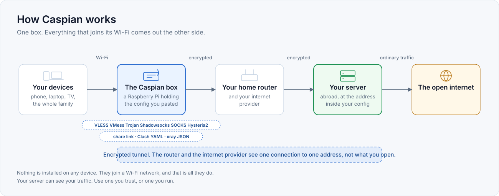

> ### [فارسی: راهنمای کامل به زبان فارسی](README.fa.md)
>
> این صفحه به فارسی هم هست. اگر انگلیسی نمی‌خوانید، روی خط بالا بزنید.
>
> **[Read this in Persian](README.fa.md)**

Caspian-BYOC turns a Raspberry Pi into a bring-your-own-config gateway. You
paste a proxy share link you already hold into a web panel on the box and press
one switch. The box connects with that link and shares the connection as a WiFi
hotspot, so every device that joins is tunnelled without installing anything.

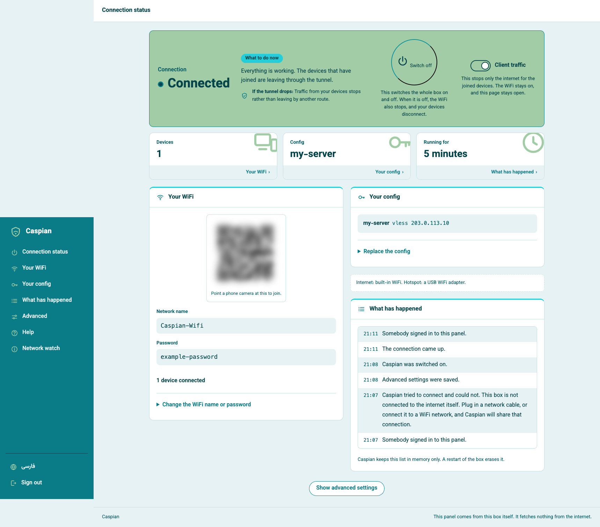

The panel above is a real screenshot from a running box, taken on a Raspberry Pi
5 on 2026-09-03 with the tunnel up, before any device had joined. The network
passphrase, the configuration name and the server address in it are substituted,
and the join code is blurred, because that code encodes the network name and its
password. Nothing else is altered.

The panel is Persian first and English second. There is no account, no
telemetry, and the panel fetches nothing from the internet.

This file describes what the code in this repository does, what it guarantees,
and what it does not. Every capability below names the code, the test, or the
recorded measurement it rests on. Where a claim rests on a test, the file names
the test rather than a line number, because names survive refactors.

---

## What you can paste, and what it will refuse

You bring the config. This is what the box accepts, taken from the code that
does the accepting rather than from a wish list. Every row was measured against
`internal/link` and the pinned engine.

| | It works | It is refused |
|---|---|---|
| Share links | `vless://` `vmess://` `ss://` `socks://` `trojan://` `hysteria2://` `hy2://` | `tuic://` `ssr://` `wireguard://` `anytls://` `naive+https://` `hysteria://` (version 1) |
| Pasted documents | Clash and Clash.Meta YAML, raw xray JSON, a list of links one per line, a base64 subscription blob | a subscription URL, a base64-wrapped Clash document, a JSON array, text whose first line is a comment |
| Transports | `raw` (also written `tcp`), `ws`, `grpc`, `httpupgrade`, `xhttp` (also `splithttp`), `kcp` and `mkcp` | `h2`, `h3`, `http`, `quic`, `gun` |
| Security | `none`, `tls`, `reality` | `xtls` (the legacy kind), `allowInsecure` |
| VLESS flow | `xtls-rprx-vision`, `xtls-rprx-vision-udp443`, or none | every other value |

`h2` and `h3` in that refused column are transport NAMES. HTTP/2 and HTTP/3
themselves are carried: `type=xhttp` with `security=tls`, and the TLS ALPN
decides which. See [HTTP/2 and HTTP/3 are carried, under a different
name](#http2-and-http3-are-carried-under-a-different-name).

Six things surprise people, so they are here rather than in a footnote:

Only the FIRST link is used. Paste forty servers and you configure one; the
panel tells you how many it found. `ss://` and `socks://` need the base64 form
of their user information, and the plain `method:password@host` spelling is
refused. REALITY works over `raw`, `xhttp` and `grpc` only, so pairing it with
WebSocket is refused by the engine at paste time rather than failing later.
`security=` has to be lowercase here even though the engine itself does not
care, and an uppercase `TLS` is reported back to you as `none`. A `plugin=`
parameter on an `ss://` link is ignored without saying so. And a subscription
URL is refused because the panel fetches nothing from the internet, which is a
deliberate property rather than a missing feature.

The full picture, including which of these have carried real bytes and which
have been proven end to end on hardware with an exit address captured, is under
[Protocols and transports](#protocols-and-transports). Those are three different
claims and this project does not let them blur.

---

## Installing

Two routes. The first is for people who want to run it, the second is for people
who want to check it first.

### Automated: one line

    /bin/bash -c "$(curl -fsSL https://raw.githubusercontent.com/Iman/caspian/main/install.sh)"

The installer works out what machine it is on, downloads the matching binary
from the latest release, and refuses if the download does not match the
published checksum.

| `uname -m` | artefact | typical machine |
|---|---|---|
| `x86_64` | `caspian-linux-amd64` | a laptop or a mini PC |
| `aarch64` | `caspian-linux-arm64` | Raspberry Pi 3, 4, 5 on a 64-bit system |
| `armv7l` | `caspian-linux-arm` | Raspberry Pi 2 and 3 on a 32-bit system |
| `armv6l` | `caspian-linux-arm` | Raspberry Pi 1, Zero, Zero W |

It refuses rather than guesses when it cannot be sure. Not Linux, an
architecture not in that table, no systemd, or a checksum that does not match:
each is a refusal naming what it found. `armv8l`, a 32-bit userland on a 64-bit
kernel, is deliberately not mapped, because guessing there is how a previous
project shipped ARMv7 code to ARMv6 machines and left them dying with an
illegal instruction on first run.

Read the script before you pipe it into a shell. That advice is not a formality
for software of this kind, and the script is written to be read.

    curl -fsSL https://raw.githubusercontent.com/Iman/caspian/main/install.sh | less

To pin a version rather than take the latest:

    CASPIAN_VERSION=v1.0.0 /bin/bash -c "$(curl -fsSL https://raw.githubusercontent.com/Iman/caspian/main/install.sh)"

### Verifying a download yourself

Every release carries a `SHA256SUMS` file. The installer checks it for you, and
you can check it independently:

    curl -fsSLO https://github.com/Iman/caspian/releases/latest/download/caspian-linux-arm64
    curl -fsSLO https://github.com/Iman/caspian/releases/latest/download/SHA256SUMS
    sha256sum -c SHA256SUMS --ignore-missing

What that proves and what it does not: it proves the file you have is the file
the release published. It does not prove who built that release. The binaries
are built by GitHub Actions from a tagged commit, and the workflow that builds
them is in this repository at `.github/workflows/release.yml`, so the build is
readable even though it is not independently reproducible.

### Manual: build it yourself

Nothing about the automated route is required. Building from source needs Go
1.26 or later and gives a binary identical in function.

    git clone https://github.com/Iman/caspian.git
    cd caspian
    go build -trimpath -o caspian ./cmd/caspian
    sudo CASPIAN_LOCAL_BINARY="$PWD/caspian" bash install.sh

`CASPIAN_LOCAL_BINARY` tells the installer to use the file you just built rather
than downloading one. Everything else the installer does, creating the service
account, the directories, the units and their permissions, happens the same way.

Cross-compiling for a Pi from another machine:

    GOOS=linux GOARCH=arm64 go build -trimpath -o caspian-linux-arm64 ./cmd/caspian
    GOOS=linux GOARCH=arm GOARM=6 go build -trimpath -o caspian-linux-arm ./cmd/caspian

`GOARM=6` on the 32-bit build is not optional. Both `armv6l` and `armv7l`
machines install the same `arm` artefact, so an ARMv7 build breaks every Pi 1,
Zero and Zero W that installs it. The release workflow checks this with
`readelf` and fails rather than publishing an artefact that lies about its
architecture.

Before you trust a build, run the gate:

    bash scripts/gate.sh

It runs formatting, vet, the whole suite with the race detector, per-package
coverage floors, the golden regression layer, a privacy scan and a smoke
subset. It exits non-zero on failure. Do not pipe it anywhere: a shell pipeline
reports the status of its last command, so piping it into `tail` throws away
the answer you asked for.

---

## Two readers, two routes through this file

If you are deciding **whether to run this**, read "What it is for", "What it
needs", and "Running it".

If you are deciding **whether to trust it**, read "What it guarantees", then
"What it does not guarantee", then "What has actually been verified", then
`docs/DEFECTS.md`. The second and third of those are the ones that matter. A
security claim you cannot check is worth nothing to somebody who faces
consequences if it is wrong.

`FAQ.md` answers the questions people hit in practice, and each answer names
the file or the fault code it comes from.

---

## What it is for

The audience is somebody who was given a working config by a person they trust,
and who wants the devices in the room to work. They will not open a terminal,
read a log, or edit a file. After the install, every action happens in the
panel. See `docs/2026-08-29-design.md`, sections 5.1 and 5.2.

The engine is xray-core v26.4.15 (Go module version `v1.260327.1-0.20260415235634-c5edc122b70e`), linked into the binary rather than
downloaded. The share-link parser is the MIT `share` package from XTLS/libXray,
vendored at tag v26.3.27 under `third_party/libxray-share/` with its own licence
kept beside it.

`supportedSchemes` in `internal/link/link.go` accepts seven schemes: `vless`,
including REALITY, plus `vmess`, `trojan`, `ss`, `socks`, `hysteria2` and
`hy2`. Anything else, including `tuic`, `ssr`, `wireguard` and `anytls`, is
refused by name.

---

## Architecture

### Two processes, one binary

One binary runs in two roles, chosen by subcommand. The split exists so that a
fault in the part that parses user input and serves HTTP is not a fault in the
part that holds root. `docs/LAYOUT.md`, "Two processes, one binary", is the
fixed statement of it.

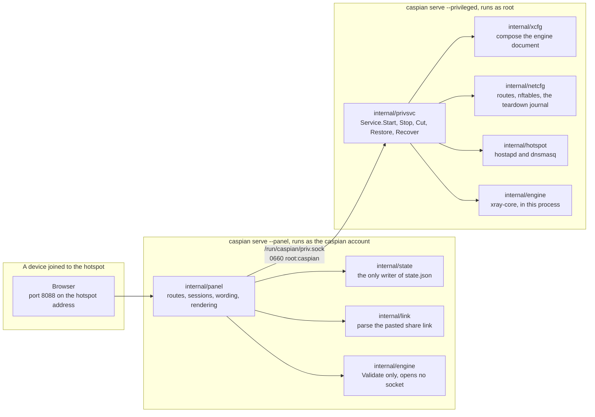

`cmd/caspian/main.go` prints the two roles in its own usage text:

    caspian serve --privileged     root: routes, firewall, access point, engine
    caspian serve --panel          the caspian user: the web panel, nothing privileged

### The socket, and why the vocabulary is closed

`internal/panel/priv.go` states the rule the whole split exists for: "A
privileged helper that takes a path and an argument list from its client is not
a boundary; it is a way to run anything as root." The semicolon is theirs. The
sentence is quoted exactly, because a paraphrase of a rule is not the rule.

So the panel cannot express "run this". It can only name one of eight actions,
and the privileged side decides what each one means. `panel.Actions` is that
closed set, and `TestActionVocabularyMatchesTheInterface` fails if a method is
added to the interface without a name in the list.

| Action | What the privileged side does | Changes the machine |
|---|---|---|
| `detect` | Report the interfaces, the radio's limits, and the chosen subnet | no |
| `status` | Report the engine phase, the hotspot, and whether traffic is cut | no |
| `start` | Bring the tunnel and the hotspot up | yes |
| `stop` | Take them down and replay the teardown journal | yes |
| `recover` | Stop, replay the journal, then start again from the same request | yes |
| `engine-log` | Return the engine's recent lines, already redacted | no |
| `cut` | Drop forwarded client traffic and leave everything else running | yes |
| `restore` | Put forwarded client traffic back | yes |

One request, one response, one connection. A message is a 4-byte big-endian
length followed by that many bytes of JSON. The length is checked against
`maxFrameBytes` before anything is allocated or parsed, so an oversized message
costs four bytes and a refusal. Unknown JSON fields are refused rather than
ignored. `protocolVersion` is checked on every request. So a panel from one
release talking to a privileged service from another gets a named refusal,
instead of a field silently decoded as its zero value.

Nothing crosses back on the failure path except one word: a `panel.Fault` from
a closed set, or a `privsvc.Refusal` from a second closed set. The engine's own
error text embeds the user's key material, so it is logged on the privileged
side and dropped. There is no field on the response it could travel in.

### Who owns which package

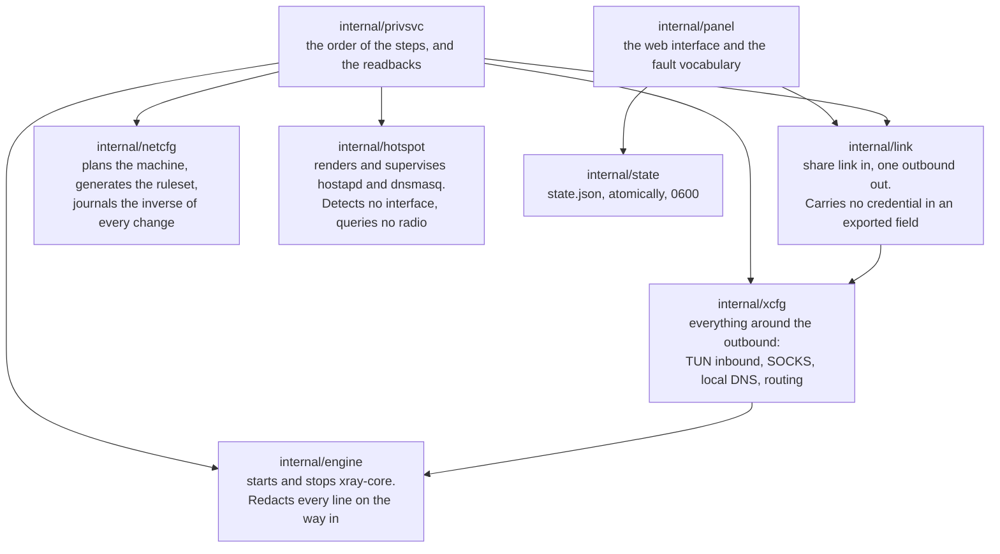

`internal/privsvc` re-parses `StartRequest.ConfigJSON` with `internal/link`
rather than trusting the panel to have done it. It also checks the internet
interface against this machine's own default route, the hotspot interface
against this machine's own `iw list` output, and the channel against what the
radio reported as usable.

### Where state lives, and who writes it

Two writers, two files, no shared file. Neither process writes the other's, so
there is no lock and no lost update to protect against. `docs/LAYOUT.md`, "Who
writes what", records the decision and the earlier draft it reversed.

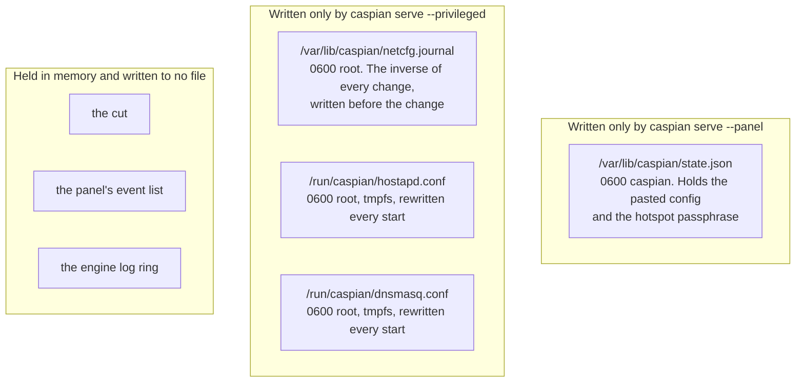

The privileged side reads no state file at all. Everything it needs arrives in
the start request. `TestPrivsvcReadsNoStateFile` scans that package's own source
and fails if it ever reads one, which a comment would not have provided.

The full table of paths, modes and owners is in `docs/LAYOUT.md`. The ports are
fixed there too: 53 for client DNS on the hotspot, 5354 on loopback for the
engine's DNS listener, 8088 for the panel, 10808 on loopback for the
diagnostics SOCKS inbound.

---

## How data flows

### A pasted share link becomes a running tunnel

`startNow` in `internal/panel/handlers.go` documents the order, and the order is
what tells the three config failures apart. Nothing on the machine is touched
until state 1 and state 2 have both passed.

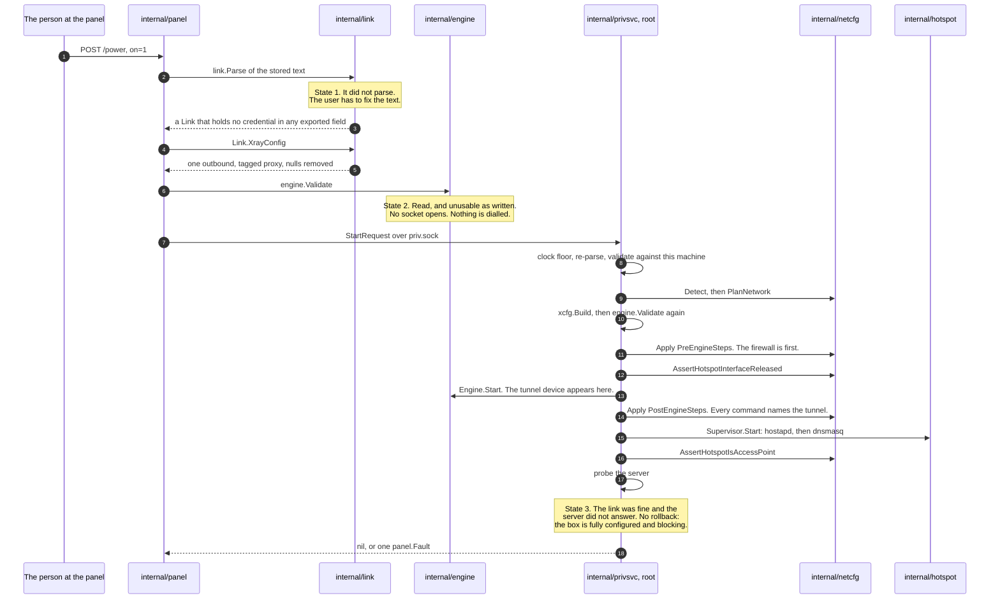

Three details in that sequence are load bearing.

The engine document is composed twice for different reasons. `internal/link`
produces the outbound and nothing else. `internal/xcfg` produces everything
around it: the TUN inbound that client traffic arrives on, the loopback SOCKS
inbound, the local DNS listener, the resolver policy, and the routing rules.
None of that is taken from anything the caller sent.

A start that fails part way through is undone completely. The journal already
holds the inverse of every change, written to disk before the change reached the
kernel. A start that fails leaves the machine as it was found.

A server that does not answer is not a half-applied box. Every change succeeded,
the firewall is in force, and forwarded client traffic is blocked because the
tunnel carries nothing. So the fault is reported and nothing is torn down.

### The network path of a client packet

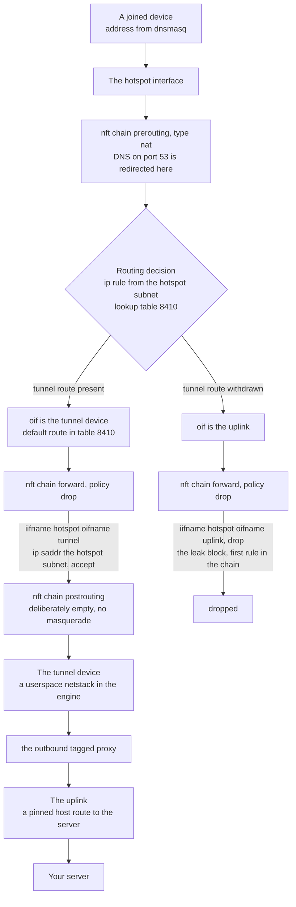

The leak block names only the hotspot and the uplink. It cannot stop working
when the tunnel goes, because it does not mention the tunnel. Every rule that
permits client traffic does name the tunnel, so those rules stop matching and
the policy drops everything.

Every interface is matched by name and never by index. An index is resolved when
the ruleset loads, so a ruleset naming the tunnel by index cannot load while the
tunnel is down, which is exactly when it has to be in force.

The postrouting chain is empty on purpose. A masquerade towards the uplink is
the single line that would quietly turn the appliance into an ordinary router.

### What the tunnel disappearing does to that path

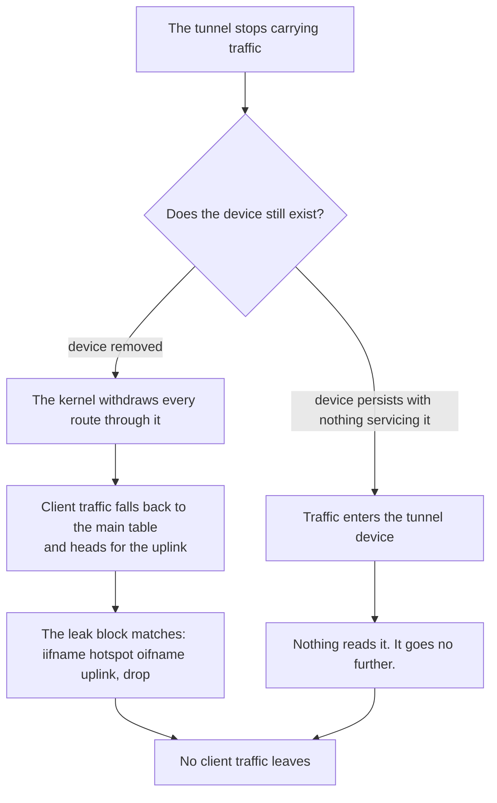

Which branch happens is not settled. `internal/netcfg/testdata/PROVENANCE.md`
records an observation from the target on 2026-08-30: `xray0` was present in
NetworkManager's device list with the service switched off, as
`connected (externally)`. Nothing here established why, and the engine is not
this project's code. Neither branch leaks, and neither depends on knowing which
one happens. That is why the block was written to name only the hotspot and the
uplink.

### The DNS path, which is not the traffic path

This is the part people get wrong. A client's DNS question is not merely
permitted. It is taken.

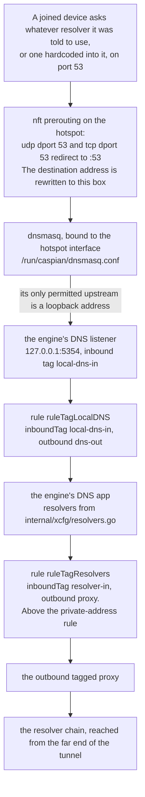

Four properties of that chain, each with the thing that holds it.

The redirect rewrites the destination, so a device with a resolver hardcoded
into it is answered here rather than allowed out to reach the one it was told to
use. Scenario: "a client cannot reach a resolver of its own choosing".

The DHCP offer names this box once and no other resolver. That is worth its own
scenario because getting it wrong is invisible: the redirect would rewrite the
packets anyway, so nothing on the wire would look wrong. Scenario: "the box
offers itself as the resolver and never names another".

`internal/hotspot` refuses any dnsmasq upstream that is not a loopback address.
A non-loopback target would be a query leaving the box outside the tunnel, for
every name every client asks for. The engine's listener is what answers there,
and `TestLocalDNSDefaultMatchesTheHotspotUpstream` fails if the two ports drift.
`docs/LAYOUT.md` calls that pairing the one that breaks quietly: if the two
drift, every joined device stops resolving while the hotspot and the tunnel both
look healthy.

The rule that sends the resolver's own queries into the tunnel sits above the
rule that sends private addresses direct. So a resolver on a private address is
still reached through the tunnel rather than on the local network.
`TestLocalDNSQueriesCannotFallOutToTheUplink` and `TestPrivateRangesRouteDirect`
hold the two halves.

The resolver chain itself is three operators in three jurisdictions: Quad9's
filtered service, the Cloudflare FAMILY variant, and CleanBrowsing Security.
`internal/xcfg/resolvers.go` records why each one, and which nearly identical
address of the same operator it is deliberately not. No Google resolver appears
in any default, and `TestNoGoogleAnywhereInGeneratedConfigs` scans every
generated document for one.

The other ports are handled and one of them cannot be:

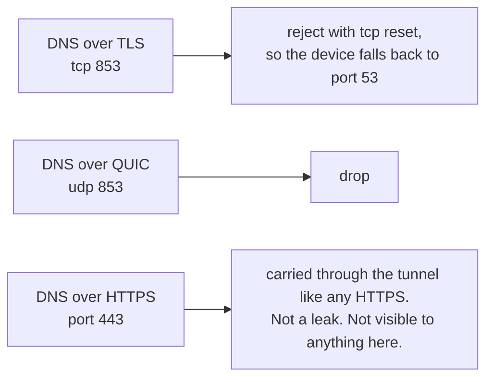

---

## Protocols and transports

A share link carries three separate things, and it helps to keep them apart: the
proxy protocol, the transport that carries it, and the encryption layer wrapped
around that transport. A VLESS link over WebSocket with TLS and a VLESS link
over plain TCP with REALITY are the same protocol reaching the same kind of
server by two different routes. They fail in different ways.

The proxy protocols are the seven schemes listed above. VLESS is the one most of
this document's examples use, because it is what REALITY is built for. Nothing
in the appliance is specific to it. The parser produces a description,
`internal/xcfg` composes an engine document around it, and the rest of the box
does not know which protocol it is carrying.

The transports come from xray-core and are named in the vendored parser:

- `tcp`, also written `raw`
- `ws`, for WebSocket
- `httpupgrade`
- `xhttp`, the protocol formerly called SplitHTTP. Both spellings parse
- `grpc`
- `kcp` and `mkcp`, for mKCP

`h2`, `http`, `h3` and `quic` are not on that list. The engine version this pins
removed them, so a link asking for one is refused rather than carried, and
`TestRemovedTransportsAreRefusedWithASentence` in `internal/link` holds that
refusal in place.

How well the refusal reads depends on the route in. A Clash document naming one
gets a sentence about the transport. The same transport in a `type=` parameter
on a share link arrives as the generic "nothing in the pasted text was a proxy
link this box understands", which is correct and unhelpful.
`TestRemovedTransportInAURIIsReportedLessWell` pins that difference so it is a
known gap rather than a surprise.

### HTTP/2 and HTTP/3 are carried, under a different name

Being refused `type=h2` or `type=quic` does not mean the box cannot speak them.
It means the spelling moved. XHTTP replaced both, and it chooses its HTTP
version from the TLS ALPN rather than from the transport name:

| What you want | What to write |
|---|---|
| HTTP/3, which is QUIC | `type=xhttp` with `security=tls`, `alpn=h3` and `mode=stream-one` |
| HTTP/2 | `type=xhttp` with `security=tls` and any ALPN that is not exactly `h3` |
| QUIC, without XHTTP | a `hysteria2://` link, which is QUIC underneath and needs `alpn=h3` |

The keys reach the engine untouched: `internal/xcfg` carries the outbound as
opaque JSON and never decodes it, so `alpn`, `mode`, `xmux` and the QUIC tuning
block arrive exactly as pasted.

Four details decide whether you get h3 or silently get something else:

`alpn` must be exactly one value and that value must be `h3`. Writing
`alpn=h3,h2` gives you HTTP/2 with no warning, because the engine takes a list
of any other length as a request for version 2. REALITY forces HTTP/2 whenever
it is present, so REALITY and h3 are mutually exclusive and pairing them gets
you h2 rather than an error. `mode` has to be set explicitly, because the
default resolves to `packet-up` rather than the `stream-one` shape the engine
names as the QUIC replacement. And `downloadSettings`, for a split upload and
download, is refused together with `mode: stream-one`; that combination needs
`stream-up`.

One collision in vocabulary is worth stating plainly, because it reads like a
contradiction: `type=h3` is refused, and `alpn=h3` is required. They are
different fields. The first names a transport that no longer exists; the second
names the protocol negotiated inside TLS.

These configurations are accepted and validated by the box. They have not yet
been driven against a live server from here, so treat the row as the engine's
capability rather than as something this project has watched work.

The security layer is `reality`, `tls`, or `none`.

Not every combination is equally useful. REALITY is normally paired with plain
TCP, because its whole method is to borrow a real site's TLS handshake, so
wrapping it in another TLS layer defeats the point. WebSocket, HTTPUpgrade and
XHTTP exist to look like ordinary web traffic to something inspecting the
connection, and they are usually paired with TLS for the same reason an ordinary
website is. WebSocket with `security=none` is the one shape to think twice
about. It is plaintext on the wire, and it is only sensible when something else
already provides the encryption, such as a CDN terminating TLS in front of the
server.

### Three different claims, kept apart

The distinction below is the most important thing in this document. Read the
column headings before the rows.

| Claim | What it rests on | What it is worth |
|---|---|---|
| The parser accepts it | `internal/link`, and a committed golden engine document | The document is stable. Nothing was dialled |
| It carries bytes | `test/tunnel`, a real xray-core server on loopback | Traffic moved through the protocol. No exit IP, no appliance, no internet |
| It is proven end to end | `test/hardware`, a real phone on the hotspot | Real traffic left the box and the exit address was captured and named |

### What has carried bytes through a real server

Added by `test/tunnel`. Every scheme the parser accepts is driven end to end
against a real xray-core instance, built from this module's own dependency and
loaded through the same loader `internal/engine` uses. The client side is the
product path, unmodified: `link.Parse`, then `xcfg.Build`, then
`engine.Engine.Start`. No config is hand-written.

| protocol | transport | security | carries an HTTP request |
|---|---|---|---|
| VLESS | tcp (raw) | none | yes |
| VMess | tcp (raw) | none | yes |
| Shadowsocks, aes-256-gcm | tcp (raw) | none | yes |
| SOCKS | tcp (raw) | none | yes |
| Trojan | tcp (raw) | TLS, pinned by digest | yes |
| Hysteria2, and the `hy2` alias | QUIC | TLS, pinned by digest | yes |

Four controls stop a request that skipped the tunnel from passing, and all four
run rather than being asserted in prose. The client is never told where the
origin is, and is given a `.invalid` name and the port of a decoy. The name
cannot be resolved, and the suite says so out loud if a resolver on the machine
answers it anyway. The origin checks where the request was addressed, not only
that it arrived. The decoy counts its own hits, and a tunnelled request must add
none. `TestEveryCarriageProofCanFail` and
`TestTheProofRejectsARequestThatDidNotGoThroughTheTunnel` are what make those
controls evidence rather than intent.

Read each row narrowly. Every row but Hysteria2 runs over raw TCP. No row drives
REALITY, whose server side needs a real handshake target. Shadowsocks is
aes-256-gcm only, because the 2022 ciphers take a different code path. Every row
carries a TCP request, and UDP associate is off. Everything is on loopback, so
no exit IP is captured and none can be.

`TestEveryProtocolTheParserAcceptsIsDrivenEndToEnd` reads the accepted-scheme
list out of `internal/link`'s source, so an eighth scheme cannot be added
without a row here.

### What has actually been proven on hardware

The table below is what real traffic has traversed with an exit IP captured. It
is not what the parser accepts, and it is not what the loopback suite carries.

| protocol | transport | security | proven end to end |
|---|---|---|---|
| VLESS | tcp (raw) | REALITY | yes, on three separate servers |
| VLESS | ws (WebSocket) | none, plus VLESS Encryption | yes |
| VLESS | ws (WebSocket) | TLS | yes, through a CDN |
| VLESS | httpupgrade | TLS | yes, through a CDN |
| VLESS | xhttp | TLS | yes |
| VMess, Trojan, Shadowsocks, SOCKS, Hysteria2 | any | any | no |

Each of those was proven by driving a real browser on a real phone joined to the
hotspot. The exit address was captured from two independent sources and matched
to the server the configuration names. Three different servers were used and
each returned a different address, so a repeated or cached reading cannot be
mistaken for a working tunnel.

A row that is not proven is not a claim that it is broken. It is a claim that
nobody has watched a packet come out of the far end, which is a different thing
and the only thing this project treats as evidence. The engine document each
transport produces IS pinned as a golden file, so a change to how one is
composed shows up as a diff. That proves the document is stable and says nothing
about whether the transport connects.

### Why a row with no transport security is still encrypted

The `security` column above is about the layer WRAPPED AROUND the transport, and
`none` there does not mean "no encryption". It means no TLS and no REALITY. That
is worth being precise about, because reading it the other way would be alarming
and reading it too generously would be worse.

VLESS by itself carries no encryption. It is a stateless protocol that expects
the layer underneath to provide confidentiality, which is normally REALITY or
TLS. A VLESS link over WebSocket with `security=none` and nothing else WOULD be
plaintext on the wire, and the exit address would be proven while every packet
was readable by anything on the path.

What makes that row safe is VLESS Encryption, carried in the link's
`encryption=` parameter. It is a hybrid key exchange, ML-KEM-768 for
post-quantum resistance combined with X25519, applied at the VLESS layer itself
rather than underneath it. So the traffic is encrypted, and it is encrypted by
something designed to stay secure against an attacker who records it today and
has a quantum computer later. A link carrying `encryption=none` AND
`security=none` has neither, and that is the combination to refuse.

This is NOT the Noise Protocol Framework (noiseprotocol.org). Nothing in this
appliance, in the vendored share-link parser, or in the engine implements Noise.
The word "noise" appears in xray-core's configuration for something unrelated,
padding traffic with random bytes to change its shape on the wire, which is
obfuscation and not a handshake. The thing that gives this row its
confidentiality is VLESS Encryption, and the name matters because the two
provide different guarantees.

MEASURED rather than assumed, on 2026-08-30. This package does not rebuild the
outbound field by field. It re-serialises what the parser produced, and the
protocol settings ride along as an opaque blob. That is why the parameter
survives. It is also why nothing would break if it stopped surviving: no field
would be missing, no type would change, and no other test would notice, while
the tunnel carried a user's traffic in the clear with every check still green.
`TestVLESSEncryptionSurvivesIntoTheEngineDocument` in `internal/link` is the
guard, and it was watched failing against exactly that silent downgrade before
it was kept.

### A certificate name that did not match, and the client-side fix

One result is worth recording, because it is a fault this appliance correctly
refuses to paper over. Two configurations pointed at a server's own address
while carrying the TLS name of the CDN in front of it. The engine reported:

    transport/internet/httpupgrade: failed to dial request ...
      tls: failed to verify certificate: x509: certificate is valid for
      <the apex>, not <the cdn subdomain>

That is a certificate that genuinely does not match the name asked for, and
refusing it is the behaviour you want. Accepting it would mean the tunnel could
be terminated by anything holding any certificate.

The cause and the fix are both on the client side, and no server change is
needed. A share link carries two names that people assume have to match and do
not:

    sni   the name TLS validates the certificate against
    host  the name the server routes the request on, an HTTP header

The failing links carried the CDN's name in BOTH. Through the CDN that works,
because the CDN holds a certificate for it. Pointed straight at the origin it
cannot, because the origin holds a certificate for the apex only. Set `sni` to
the name the certificate actually carries, and leave `host` as the name the
server routes on:

    sni=example.com          host=cdn.example.com

MEASURED on 2026-08-30. Two links that had failed with the certificate error
above both connected after that one change. Exit addresses were captured from
two independent sources and matched to their own servers, and the DNS leak and
fail-closed checks passed in the same run.

So if a transport fails only when pointed straight at the origin, compare `sni`
against the origin certificate's subject alternative names before you suspect
the transport. `openssl s_client -connect <address>:443 -servername <name>`
prints what the server actually presents.

### The panel takes a pasted link and not an image

Dropping a QR image is described in the design, section 5.2, and is **not
implemented**. `internal/panel/qr` is an encoder only, and no handler in
`internal/panel` reads a multipart upload. The QR code the panel does produce is
the one a phone scans to join the hotspot. `internal/panel/view.go` builds it
with `qr.Encode` and `qr.WiFiJoin`, so no image library and no remote service is
involved.

---

## What it needs

The only target for v1 is a Raspberry Pi. See `docs/2026-08-29-design.md`,
section 2. macOS and Windows are named as later phases and are not built.
Android and iOS are named as never.

`internal/netcfg/testdata/PROVENANCE.md` records the machine this has been
developed and measured against: a Raspberry Pi 5 Model B Rev 1.0, Debian 13
(trixie), kernel 6.18.34+rpt-rpi-2712 aarch64, nftables 1.1.3, iw 6.9,
iproute2 6.15.0, brcmfmac on phy0, NetworkManager rendered by netplan.

`install.sh` refuses, before it touches the machine, anything that is not Linux
on x86_64, aarch64, armv7l or armv6l, with systemd 240 or newer, run as root.
Each refusal names what it found.

You need two network interfaces in one of two arrangements. See
`docs/2026-08-29-design.md`, section 4.7.

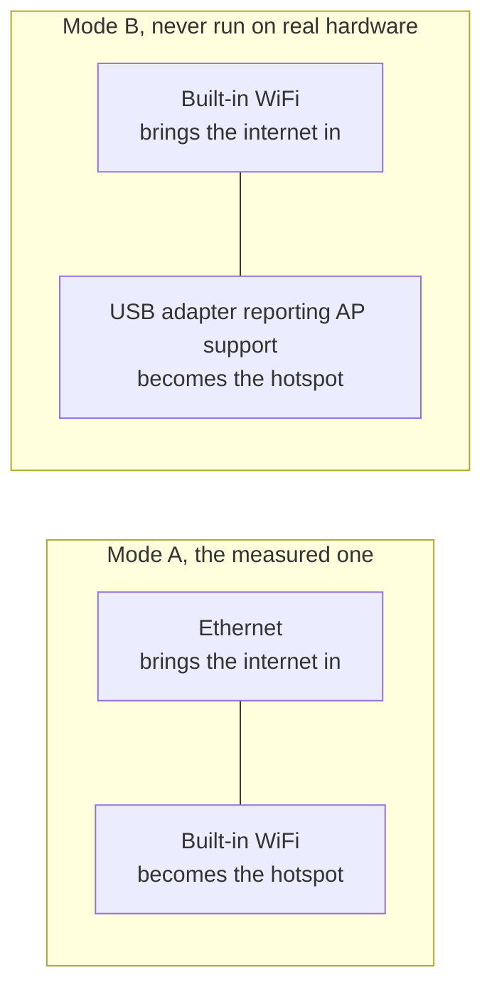

Mode B has never been run. `PROVENANCE.md` records that the target has exactly
one radio and no USB device attached, so every mode B fixture in the tree is
authored rather than captured.

**On the measured hardware, bringing the hotspot up costs the box its own
WiFi.** The `brcmfmac` driver refuses `iw phy phy0 interface add ap0 type __ap`
with `Input/output error (-5)`, even though `iw list` advertises the
combination. So the appliance falls back to taking over `wlan0`: it releases the
interface from NetworkManager, strips the address it holds on the house network,
and retypes it. Both the refusal and the successful takeover sequence are
measured and recorded in `PROVENANCE.md`. The panel and the log say what that
costs before it happens. Test: `TestTheTakeoverSaysWhatItCost`.

Creating a second interface stays the first choice, because when it works it
costs the user nothing. The fallback is reached only after the first choice has
been tried and refused, and the first plan is torn down completely before the
second is applied.

---

## Running it

Build the binary and hand it to the installer. This path needs no release, and
the installer takes it for a real install as well as a dry run:

    go build -o /tmp/caspian-linux-arm64 ./cmd/caspian
    sha256sum /tmp/caspian-linux-arm64 | sed 's|/tmp/||' > /tmp/SHA256SUMS

    env CASPIAN_LOCAL_BINARY=/tmp/caspian-linux-arm64 \
        CASPIAN_LOCAL_CHECKSUMS=/tmp/SHA256SUMS \
        bash install.sh --dry-run --yes

Drop `--dry-run` to install for real. Without `CASPIAN_LOCAL_CHECKSUMS` the
installer warns, in those words, that it is installing an unverified binary.
`docs/INSTALL.md` is the full runbook. It includes a fake `uname` harness for
walking the refusals on a machine that cannot be installed to.

The binary has four subcommands:

    caspian serve --privileged     root: routes, firewall, access point, engine
    caspian serve --panel          the caspian user: the web panel, nothing privileged
    caspian check                  report what this box looks like; changes nothing
    caspian version

There is deliberately no subcommand that applies a config or drives the switch.
The CLI says so itself: "After the installer has run, everything a person does
happens in the panel."

`uninstall.sh` removes the units, the binary and the directories, and replays
the network journal so the box is left as it was found. Read defect D5 below
before you rely on it.

---

## The controls, and which one to press

The panel carries three controls that change what the appliance is doing. Two of
them stop the internet for the devices joined to the hotspot, and they are not
the same control. This section exists because the difference between them was
written down only in the source, where the person holding the phone cannot read
it.

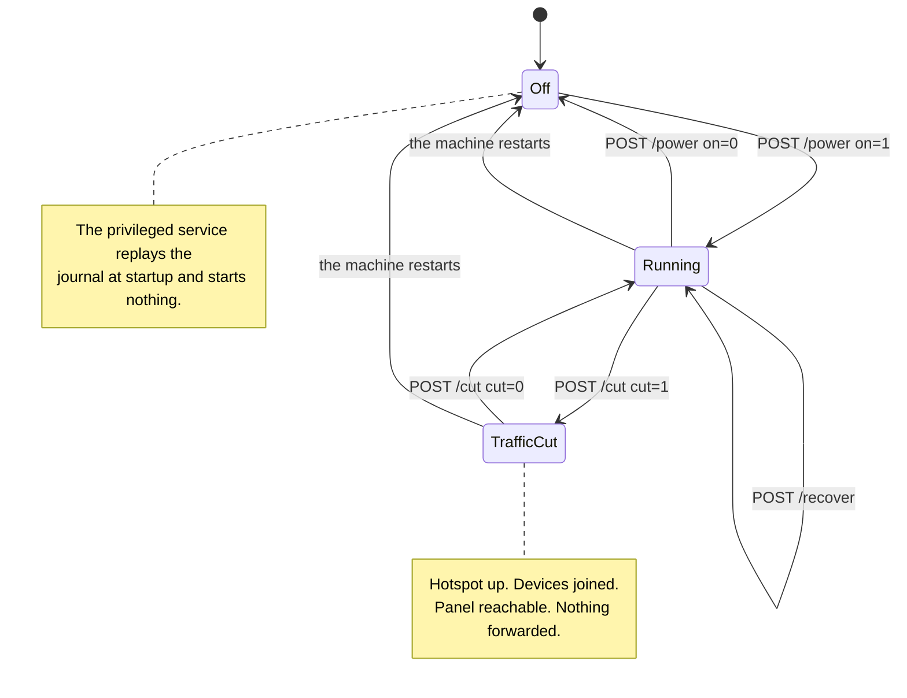

### The switch, `POST /power`

The switch turns the whole appliance on and off. Switching off calls `Stop` on
the privileged service, which does five things in order:

1. stops the engine
2. stops the access point and the DHCP and DNS server beside it
3. removes the configuration files those two were generated with
4. blocks the radio again, if Caspian was the thing that unblocked it
5. replays the teardown journal

See `internal/privsvc/start.go`, `stopLocked`, and
`internal/hotspot/supervisor.go`, `Supervisor.Stop`.

The consequence that matters is the one in the middle. The WiFi network stops
existing. Every joined device drops off it, and that includes the phone in the
hand of the person who pressed the button.

### The cut, `POST /cut`

The cut stops only the traffic the box forwards on behalf of those devices. It
loads one nftables ruleset in place of another. See `internal/privsvc/cut.go`,
`setForward`, and `internal/netcfg/nftables.go`, `RulesetFor`.

The two rulesets differ in the forward chain and nowhere else.
`TestForwardCut_DiffersFromNormalOnlyInTheForwardChain` asserts it by comparing
the input, output, prerouting and postrouting chains line for line. In the cut
ruleset the forward chain accepts nothing at all. It carries an explicit drop
with a reason on it, so an operator reading the live ruleset sees why traffic is
stopped rather than an absence of rules:

    iifname "wlan0" drop comment "client traffic cut by the user"

The input chain is untouched. So the box goes on answering DHCP on port 67, DNS
on the client DNS port, and the panel on its own port, each of them from the
hotspot interface. The engine is not stopped and the access point is not
stopped. Devices stay joined, keep their leases, and can still open the panel.
Test: `TestForwardCut_StopsClientsAndKeepsThePanelReachable`.

### Why the difference decides which one you can press from a phone

The panel binds to the hotspot address by default and to nothing else. Serving
it on the network the box itself sits on is a setting the user has to turn on,
and it is off in the shipped default. See `internal/panel/listen.go`,
`BindAddrs`, and `internal/state/state.go`, `PanelOnLAN`.

So somebody whose only device is a phone on the hotspot can undo a cut from that
phone. They cannot undo a switch-off from it, because the switch-off removed the
network they were reaching the panel over. The cut is therefore the emergency
stop that does not strand the person using it. Undoing it costs no
reassociation, because nothing the device was attached to went away.

Press the cut when traffic has to stop now and you intend to put it back. It is
immediate and it asks for no confirmation, and the page makes the state
unmistakable while it is in force. Press the switch when you have finished with
the appliance, or when you want the WiFi adapter handed back to the network it
came from. Do not reach for the switch as an emergency stop from a phone that is
on the hotspot.

Two smaller facts, because the short wording on the page is easy to read past.
First, a cut is refused on a box that is not running, and it says so in its own
words rather than as an unknown failure. There is no forwarding to stop. And a
ruleset that names a hotspot interface which does not exist is a change made to
a machine whose whole invariant while off is that it was left as it was found.
See `errNotRunning` and the `not-running` fault. Second, a cut
is held in memory and written to no file, so a restart of the machine loses it.
That is deliberate: somebody who cannot work out why their internet stopped gets
it back by pulling the plug. What a restart does not do is switch the appliance
on. The privileged service replays the journal at startup and starts nothing.
See `cmd/caspian/serve_priv.go`. A restart therefore clears the cut and leaves
the box off, and traffic flows again once the switch is pressed, not before.

### The recovery control, `POST /recover`

The third control is the way out of a stuck box without a reboot and without a
terminal. It stops everything, replays the teardown journal so that every
interface, route and firewall rule this appliance changed is put back, and then
starts again from the saved settings. `Service.Recover` is
`recoverToCleanMachine` followed by the same `Start` the switch uses, so a
recovery is not a second implementation of starting that could drift.

It exists because of a measured day. On 2026-08-30 the appliance repeatedly
reached states that only a person with an SSH session could clear: an interface
created by a failed start and never removed, an address flushed out from under
it, a journal entry that survived a failed start. Every one of those is
recoverable by replaying what is already written down, and none of it was
reachable from the panel.

It deliberately does not reboot the machine and does not restart either systemd
unit, so the panel process and any SSH session stay up throughout. It does stop
the access point and start it again, so a device joined to the hotspot leaves
the network and rejoins it when the hotspot returns.

---

## The rules this project holds itself to

These are not aspirations. Each one has a mechanism, and the mechanism is named.

**Nothing is called working without an exit IP captured from real traffic.**
`docs/2026-08-29-design.md`, section 6. A connect is not a result. The hardware
harness grades UNPROVEN, not PASS, when no exit IP was captured, and it exits 1.

**A confident wrong sentence is worse than no sentence.** A reader who is told
something is handled correctly concludes there is nothing to check. So a
correction leaves a test behind rather than a better sentence.
`TestNothingInTheApplianceWatchesTheUplink` exists because two documents once
claimed the box watches its uplink and reloads the firewall when it moves.

**A started process is not evidence that it worked.** The hotspot interface is
read back from the kernel before anything binds to it, and the access point is
read back before the service reports itself running. Both readbacks were added
after one measured event in which every command had returned success.

**Every scenario has been watched failing.** `TestEveryScenarioCanFail` injects a
named defect into each behaviour and requires it to go red. A test nobody has
seen fail is a green light wired to nothing.

**The provenance of a fixture is in its filename.** `capture-pi5-` is byte
output of a real command on the target, `scenario-` is a machine nobody has
measured, and `golden-` is this project's own output. A test reading a
`capture-pi5-` file makes a claim about the target. A test reading a `scenario-`
file does not.

**A credential in a commit is permanent.** `test/goldenscan` sweeps every
committed fixture for registered sentinels and for credential shapes, and it
checks file names as well as file bodies. It has been watched catching a planted
secret of every class it knows.

**The coverage floors are a ratchet.** Every number in `scripts/gate.sh` is what
a package measured after the work that introduced it, not a target somebody
hoped for. A package with no row is not gated, and the absence of a row means
"no floor agreed yet" rather than "this package is covered".

**The privileged side trusts nothing the caller sends.** Every field of every
request is checked against what this machine detected for itself. A refusal is a
fault code from a closed set, never a sentence, and never a value the caller
sent.

**The box asks the internet for nothing.** No telemetry, no phone-home, no crash
upload, no web font, no geo data file, and no Google resolver in any default.

---

## What it guarantees

Each heading here is backed by generated firewall output in
`internal/netcfg/testdata/`, by a named test, or by a measurement recorded in
the repository. `docs/BEHAVIOUR.md` is the readable list of promises. Every
heading in it is the name of a scenario in `test/bdd/`, and every scenario has a
matching injected defect. So "this test can detect the thing it claims to
detect" is itself a test result.

### Forwarded client traffic fails closed, and the block does not need the tunnel

The forward chain's policy is `drop`. The first rule in it is the leak block,
and it names only the hotspot and the uplink:

    iifname "wlan0" oifname "eth0" drop comment "fail-closed: client traffic never leaves by the uplink"

Every rule that permits client traffic names the tunnel device, so when the
tunnel disappears those rules stop matching and the policy drops everything. The
block itself cannot stop working when the tunnel goes, because it does not
mention it. Every interface is matched by name and never by index, so the
ruleset loads with no tunnel present, which is exactly when it is needed. The
postrouting chain is empty on purpose.

Scenario: "with the tunnel gone, nothing lets client traffic out by the uplink".
Supporting analyser test: `TestWithoutInterfaceRemovesOnlyTheRulesNamingIt`.

### The kill switch covers the box's own traffic too

The output chain is `policy drop` with a named permit list. The permits were
derived by enumerating what actually runs on the target rather than by sampling
traffic, and each permit in the generated ruleset carries the reading that
justifies it: NetworkManager's DHCP client sockets, systemd-timesyncd, DNS, the
loopback, the tunnel device, IPv6 neighbour discovery, and the proxy server
permitted **by address** rather than by port, so a UDP-on-443 transport is not
broken silently. One permit was added from reasoning rather than measurement and
says so: the box answering DHCP as a server on the hotspot, which conntrack
cannot cover because a DHCP reply and its request share no tuple.

The provocations and, more importantly, the negative controls are recorded in
`PROVENANCE.md`, "The three provocations, run with the policy loaded". Tests:
`TestRestrictedEgress_PermitList`,
`TestRestrictedEgress_AcceptsEstablishedBeforeItDropsAnything`,
`TestRestrictedEgress_ServerIsPermittedByAddressNotPort`.

The cost is stated in the ruleset's own header rather than discovered: `apt
update` from a shell on the box fails while the appliance is on.

### There is an emergency cut that does not take the hotspot with it

Switching the appliance off takes the hotspot down, which disconnects the phone
holding the button. So there is a separate control that drops forwarded client
traffic while leaving the hotspot, DHCP, DNS and the panel up. See
`internal/privsvc/cut.go` and panel action `cut` in `internal/panel/priv.go`.

The cut is runtime state and is never written to disk, so pulling the plug
undoes it. Tests: `TestCuttingClientTrafficLeavesTheWayBack`,
`TestACutIsNeverWrittenDown`, `TestACutDoesNotSurviveARestart`,
`TestForwardCut_StopsClientsAndKeepsThePanelReachable`.

Which of the two to press, and what each one tears down, is "The controls, and
which one to press" above.

### It reads the interface back from the kernel instead of trusting a process

A started process is not evidence that it worked. This was a real failure. The
header of `internal/privsvc/readback.go` records that on 2026-08-30 the service
logged itself running with a hotspot on `wlan0` while `wlan0` was still a
station on the house network. hostapd was a live process whose control socket
did not answer. A phone in the room listed eleven networks with ours not among
them. And dnsmasq was answering a stranger's device on somebody else's LAN with
a DHCPNAK.

Nothing is allowed to bind to the hotspot interface until
`netcfg.AssertHotspotInterfaceReleased` proves it is free, and nothing reports
itself running until `AssertHotspotIsAccessPoint` reads back an access point
broadcasting the expected name. Tests:
`TestNothingBindsToTheHotspotInterfaceUntilItIsProvedFree`,
`TestTheServiceDoesNotReportRunningUntilTheAccessPointReadsBackAsOne`,
`TestAnAccessPointBroadcastingAnotherNameIsNotOurs`,
`TestTheReleaseIsReadBackBeforeAnythingBindsAndTheAccessPointAfter`.

### You get your WiFi back

Every network change is written to `/var/lib/caspian/netcfg.journal` with its
inverse **before** it is made, and switching off replays those in reverse. The
record is on disk rather than in memory, so a killed process or a power cut does
not lose it. A box that died mid-change replays the record before it looks at
the machine or applies anything new.

The takeover of a WiFi interface is journalled step by step. The forward
sequence and its inverses have been run on the target and are recorded in
`PROVENANCE.md`, "The release sequence has been run on the target". The four
commands went out, and the inverses put the box back on its own network with its
own address eight seconds later.

One change has no inverse on purpose, and
`TestPlan_InvariantsHoldOnEveryModelledMachine` asserts it is the only one:
bringing the hotspot interface up. Taking a radio down on the way out is worse
than leaving it up, because the machine's own WiFi, and the panel the user is
reading, can be on it.

Scenarios: "turning the switch off returns every change the box made", "a
teardown replayed from the journal of a killed process undoes the same changes",
"a box killed halfway through cleans up before it does anything else". Tests:
`TestJournal_RecordsInverseBeforeTheChange`,
`TestTeardown_ReplaysInExactReverseOrder`,
`TestRecover_UndoesAJournalLeftByAKilledProcess`,
`TestTheTakeoverReleasesTheInterfaceItSaysItWillRelease`.

If an inverse fails, the firewall's own inverse is **held** rather than run, so
a box that could not undo its routes keeps its block. Test:
`TestTheFirewallIsNotRemovedWhenAnEarlierInverseFailed`.

### The pasted config never reaches a screen, a log or a readable file

Everything the flow produces is searched for the pasted credential:

- every error, and every message shown to the user
- the appliance's log lines
- the panel's description of the config
- the saved settings as they render for diagnostics
- the generated firewall
- the generated DHCP and DNS configuration
- the engine's own log
- the journal on disk
- the request that crosses from the unprivileged panel to the privileged service

It is in none of them. It is checked to be in the two places it has to be, so
the test cannot pass by the config having gone missing.

Scenarios: "the pasted credential never reaches a screen, a log or a readable
file", "the hotspot password reaches the access point and nothing else". Tests:
`TestPastedConfigNeverAppearsInAResponseOrALog`,
`TestFailedConfigPathsDoNotEchoTheInput`, `TestStartRequestRedactsItself`,
`TestNoCredentialReachesTheAdvancedView`,
`TestTheServerAddressNeverAppearsInADiagnosticLine`.

### The panel asks the internet for nothing

Every stylesheet, script and icon the browser loads is compiled into the binary
with `go:embed`. See `internal/panel/assets.go`. There is no web font at all:
the stylesheet's font stack is entirely system faces, Persian-capable ones
first.

The privacy reason is that a remote asset tells a third party the address of
everyone who opens the panel. The stronger reason is availability. The panel has
to load when the tunnel is down, which is exactly when somebody needs it.

Two mechanisms, not one. `TestNoAssetReferencesAnExternalURL` and
`TestNoRenderedPageReferencesAnExternalURL` scan the assets and every rendered
page for an absolute URL. `setSecurityHeaders` sends `default-src 'none'` with
every listed source set to `'self'`, so a browser refuses one that got past the
tests. No outbound HTTP client exists anywhere in `internal/panel` outside its
own tests.

The generated configuration also names no Google resolver anywhere, and uses no
`geoip:` or `geosite:` rule, because either would reintroduce a download to a
product whose whole install story is one verified binary. Tests:
`TestNoGoogleAnywhereInGeneratedConfigs`,
`TestGoogleResolverIsRejectedAtTheSource`. Scenario: "the box needs no download
and asks no Google server anything".

### Privilege is split

`caspian serve --privileged` runs as root and owns routes, the firewall, the
access point and the engine. It accepts a short list of named actions over a
unix socket and never a command built from user input. `caspian serve --panel`
runs as the unprivileged `caspian` account and owns the web interface and
nothing else. See "Architecture" above for the vocabulary and the frame format.

The panel password is hashed with argon2id. See `internal/state/password.go`. It
is a local password on the box. There is no account anywhere else.

### The clock is checked before anything handshakes

A Pi has no battery clock, and two separate mechanisms depend on the wall clock.
REALITY writes it into the handshake, and which configs xray-core **accepts**
depends on the date. So a box whose clock comes up wrong does not merely fail to
connect. It accepts a config the same binary rejects once the clock is
corrected.

The check runs before validation and before anything is attempted. See
`internal/privsvc/clock.go`, called from `Service.Start` as step 1 of
`applyLocked`. It raises a distinct fault so the panel does not blame the user's
config. Test: `TestClockFailureIsNotBlamedOnTheConfig`.

### Three config failures are told apart

"Could not read that link", "read it, and it cannot be used as written", and
"the link was fine and the server did not answer" need three different actions
from the user, and the third is the commonest. Blaming the config first is what
makes somebody throw away a config that was never broken. Nothing on the machine
is touched before the pasted text is read. Scenarios: "text that is not a link
at all is refused before anything is touched", "a link the engine will not
accept is told apart from one that would not parse", "a link whose server never
answers is not blamed on the link".

---

## What it does not guarantee

This list is the one to read closely.

### DNS over HTTPS on port 443 is carried, not blocked, and nothing here can see it

Client DNS on port 53 is redirected to this box over both protocols rather than
merely permitted. So a device with a hardcoded resolver is answered here, rather
than allowed out to reach the one it was told to use. DNS over TLS on 853 is
rejected with a TCP reset, so the device falls back to the redirected port. DNS
over QUIC on 853 is dropped.

DNS over HTTPS on port 443 is not distinguishable from any other HTTPS and is
carried through the tunnel like anything else. A client using it is inside the
tunnel and is not leaking. It is also invisible. Nothing in this project, and
nothing in the hardware harness, can observe it. That is a limit of the design.
It is stated in the generated ruleset itself, in `docs/BEHAVIOUR.md`, and in the
printed output of the DNS leak check rather than only here.

### IPv6 is blocked, and the IPv6 path is not finished

There is no IPv6 tunnel. A device with a working IPv6 path prefers it over IPv4
and would bypass the tunnel entirely, so the default policy is to block. Four
things hold that. `IPv6Block` is the default in `netcfg.DefaultOptions`. The box
does not forward IPv6. The firewall drops forwarded IPv6 on the hotspot in both
directions. And router advertisements towards the hotspot are dropped, so a
device cannot give itself an address. Scenario: "clients are never offered the
IPv6 the tunnel cannot carry".

`IPv6Forward` exists as an option and its own comment says not to set it. The
engine's TUN inbound has not been shown to carry IPv6 on the target. It also
adds no permit rule to the forward chain, deliberately: the IPv4 permits name
the hotspot subnet on both directions, there is no v6 prefix anywhere in the
plan to name, and a rule matching only the two interface names would accept any
source address a client wrote. `TestRuleset_NoUnconstrainedIPv6AcceptInForward`
holds that line.

**"Blocked" is about routing, not about DNS, and the difference matters.** An
AAAA query from a joined device is not suppressed and is not answered empty. It
goes to the engine, through the tunnel, and comes back with real AAAA records,
because the engine document asks for `UseIP` and dnsmasq sets no `filter-AAAA`.
A device therefore learns IPv6 addresses it has no way to reach, and falls back
to IPv4.

That is harmless while nothing can give a client a v6 address, and it is the
first thing that stops being harmless if anything ever does, because a client
with a working v6 path prefers the AAAA answer and would leave by a route this
box does not carry. It is written down here rather than left as a surprise, and
`TestAAAAQueriesAreAnsweredAndNotSuppressed` pins both halves so that changing
it has to be a decision.

**The hardware rig cannot grade IPv6 at all, so no IPv6 result from it means
anything.** `test/hardware/README.md` records, under "What this vantage cannot
grade: IPv6", that the phone carries only a link-local address, that
`ip -6 route show default` is empty on the phone and on the Pi, and that a
connection to an IPv6 literal answers "Network is unreachable". There is no IPv6
on that LAN at all, so an IPv6 leak check run there would pass without the
appliance doing anything. Every hardware result this project has is an IPv4
result. Anyone running this on a network with working IPv6 must treat that as a
new question, not a covered one, and must expect to write the test rather than
enable one.

### The box's own traffic is outside the fail-closed promise, by design

The promise is about **forwarded client traffic**. The box's own connection to
your server has to reach the uplink directly or there is no tunnel at all, and
`docs/2026-08-29-design.md` section 7 puts the box's own traffic outside the
guarantee for that reason.

The output-chain kill switch narrows that, and does not close it. The generated
ruleset states the residual in its own header. DNS is a hole: anything on the
box can still reach the network on port 53, and the server's hostname is
resolved in the clear on the local network before any tunnel exists. Neither is
a leak of client traffic, and neither is made worse by the kill switch.

The input chain's policy is `accept`, also by design and also stated in the
ruleset. An earlier version had it as `drop`, and `PROVENANCE.md` records what
happened when it was measured on the target. Every new inbound connection was
refused and SSH stopped answering, while the already-open session kept working,
which on a headless machine is indistinguishable from a crash. The only place
the input chain restricts anything is the hotspot side, where a joined device
reaches DHCP, DNS, the panel and ICMP echo and nothing else on the box.

### Client isolation is a rule, not a measurement

The ruleset contains `iifname "wlan0" oifname "wlan0" drop`. That the rule is
present is checked. That it works is not.

### Nothing in this repository captures an exit IP

`test/tunnel` moves real bytes through a real xray-core server, and everything
in it is on loopback, so it captures no exit IP and cannot. `test/bdd` has no
network, no radio, no root and no tunnel device. It runs the real engine in
process through the real config loader, so "the engine accepted this config and
started" means what it says, but the tunnel inbound is switched off.

So nothing in this repository satisfies the project's own standard for calling
something working. `docs/BEHAVIOUR.md` ends with a section, "What this suite
does not prove", listing what is still owed. Read it as part of the suite.

### Nothing re-checks the firewall once it is loaded

See defect D1 below. If something flushes the table while the appliance is
running, the box keeps forwarding, the panel keeps reporting connected, and
nothing notices.

### Nothing watches the uplink

The internet moving, because a cable was unplugged or a lease renewed
differently, is a change nothing fails loudly for. The pinned route to the
server still exists and still points at an address that is no longer a way out.
The box does not notice, and the tunnel stays stopped until somebody presses the
switch again.

What that costs is availability, not privacy. Client traffic stays blocked
throughout, because the forward policy is drop and every accept in it names the
tunnel. `netcfg.WatchUplink` and `Plan.RederiveForUplink` exist and work, and no
shipped code calls either. `TestNothingInTheApplianceWatchesTheUplink` is what
stops the opposite sentence drifting back into the documents, where it stood
until 2026-08-30.

### Mode B has never been run on real hardware

Every mode B fixture is authored. `PROVENANCE.md` records that the target has
one radio and no USB adapter, so the arrangement this product tells people to
buy an adapter for is proven against bytes nobody measured.

---

## What has actually been verified

### The Go suite, this repository, measured 2026-08-31

At commit `5b0a8a7` with a clean working tree, on go1.27.0 darwin/arm64:

    go build ./...                 exit 0
    go test -count=1 -v ./...      exit 0

That run executed 1577 tests including subtests: 1572 passed, 5 skipped, 0
failed. Fifteen packages reported `ok`. Two have no test files: `bdd/harness`
and `local/devpanel`. The five skips announce what they are not proving: the TUN
device lifecycle, which is linux-only and needs root and `/dev/net/tun`, three
dnsmasq configuration checks that need dnsmasq installed, and an opt-in QR PNG
dump.

The previous recorded run, at commit `dd15ad6` on 2026-08-30, executed 1323
tests including subtests: 1319 passed, 4 skipped, 0 failed, across twelve
packages reporting `ok`.

`-count=1` is not optional. It defeats the result cache. Without it a second run
prints the first run's PASS lines and exits 0 having executed nothing.

The full gate is `scripts/gate.sh`: gofmt, `go vet`, the whole suite with the
race detector, and a per-package coverage floor. Read its header before you pipe
it anywhere. A shell pipeline returns the status of its last command, and that
trap has produced a false green in this project before.

`packaging/test-install.sh` covers the two shell scripts on any machine with
bash, including one that cannot be installed to.

### The behaviour suite

`docs/BEHAVIOUR.md` lists 24 scenarios. The 2026-08-31 run executed all 24, and
`TestEveryScenarioCanFail` executed 24 matching injected defects, so each
scenario has been watched going red for the specific thing it claims to detect.
`TestBehaviourDocumentListsEveryScenario` fails if the document and the suite
drift apart, in either direction. To run one:

    go test ./test/bdd/ -run 'TestBehaviour/the_firewall'

### The carriage suite

`test/tunnel` drives each of the seven schemes the parser accepts through a real
xray-core server on loopback. Each one has to deliver an HTTP request to an
origin only the far side of the tunnel can reach. See "What has carried bytes through a
real server" above for what each row covers and what it does not. Before this
package existed, the strongest statement held about six of those seven protocols
was that the engine would load the document they produce.

### On the target hardware

`internal/netcfg/testdata/PROVENANCE.md` is the record, and it is careful about
the difference between what was captured and what was written. Filenames carry
the class: `capture-pi5-` is byte output of a real command on the Pi,
`scenario-` is a machine nobody has measured, and `golden-` is this project's
own output.

Measured on the Pi and recorded there: all five distinct generated rulesets
parsed by `nft -c -f`, with each file's sha256 read back on the Pi rather than
on the developer machine, and `nft list ruleset` empty before and after. The
interface release sequence and its inverses. The driver refusing to create a
second AP interface while accepting a type change on the existing one. The kill
switch's provocations with their negative controls. And the input-policy lockout
that caused that policy to be withdrawn.

That file also records what replacing authored bytes with measured ones broke,
which is the argument for keeping both kinds. Several defects had been green
through every prior run, including a firewall ruleset that no kernel would load
and a teardown that would have switched reverse-path filtering off on a machine
that had it on.

### End to end, with a real phone

The harness is `test/hardware/caspian-hw` and the runbook is
`docs/HARDWARE-TEST.md`. Its standard is the project's own. A connect is not a
result, and a transport is proven only when real traffic has traversed it and
the exit IP has been captured and matched to the server the config names. An
exit IP equal to the untunnelled baseline is a leak and outranks everything else
in the run. A phone that changed network state mid-capture makes the reading
void, not a pass and not a leak.

A run recorded on 2026-08-30, `run-20260830T144015Z`, graded, over IPv4:

- two configs proven, each `verdict PASS` with `sources agree` and an exit IP
  from both independent sources, matched to the box the config names.
- the exit fingerprint changing when the config was switched.
- the DNS check finding a per-run random `.invalid` label zero times in
  cleartext on the uplink during a 30 second window. Four plaintext DNS packets
  did cross that uplink in that window, and they are the box's own, which the
  design places outside the guarantee. That is exactly why the check looks for a
  label nothing else on the network could have produced, rather than counting
  port 53 packets, which cannot tell an escaped client query from the box's own.
- fail closed: with the engine stopped and the phone's cellular removed by
  airplane mode, neither source reached the internet, while the panel still
  answered over the hotspot. So this was the firewall refusing traffic rather
  than a dead link. Two earlier attempts at that step were graded VOID and
  retaken rather than reported.

Two things about that record. It reached a pass on the third attempt at the last
step, and the two void readings are in the ledger rather than deleted. And the
run artefacts live under `local/`, which is gitignored, so they are **not in
this repository**. If you clone this, you cannot check that run. You can only
re-run the harness yourself.

Two sources are used because one can be cached or stale, and both are pinned to
IP addresses rather than names. `docs/HARDWARE-TEST.md` explains why in the
paragraph it calls the most important in the file. The resolver on that LAN
sinkholes IP-echo services. So a box that changed nothing but the DNS server,
and tunnelled no traffic at all, would have shown exactly the signature a
name-resolving harness looks for. It would have been graded a pass.

The harness redacts every config, server address, user id and key from
everything it writes. It re-reads each artefact to check the redaction held, and
it has a sweep that re-reads the whole run for anything that escaped the filter. No
packet capture ever leaves the Pi. The tcpdump output is reduced to two integers
on the box, because a capture on that uplink is a recording of the maintainer's
own browsing.

---

## Open defects

`docs/DEFECTS.md` is the list of things that are known, evidenced and not fixed,
with what was measured, what it costs, and what would close each one. None of
them is a leak of client traffic. Summarised, so that this file is not a reason
to skip that one:

- **D1. Nothing re-asserts the firewall once it is loaded.** Open. There is no
  read of the live ruleset anywhere in production code, and no loop that
  re-checks it. So anything that removes the table mid-session leaves the box
  forwarding and the panel reporting connected.
- **D2. Two changes to the machine had no inverse.** One is closed and the other
  is closed in process and open across a kill. The generated configuration files
  are now removed on stop, and the radio soft-block is put back, re-reading the
  device state first so a radio somebody else changed is left alone. What is
  still open is narrow: the record of which devices were unblocked lives in
  memory, so a service that is killed rather than stopped does not re-block
  them.
- **D3. A hotspot interface this package created is not released from
  NetworkManager.** Open by decision. The paths that take over an existing
  interface do release it. The paths that create one do not, because detection
  ran before that interface existed.
  `TestACreatedHotspotInterfaceHasNoMeasuredManagerAndIsNotReleased` pins the
  gap so it stays a decision rather than becoming an accident.
- **D4. Stop reports success when it undid nothing.** Open, reporting only. A
  teardown in which every inverse failed still returns no error, so the panel
  can say the box was returned to how it was found while it is still fully
  configured. The box stays fail-closed in that state, because the firewall's
  inverse is held.
- **D5. The uninstaller replays the journal by its own rules.** Open.
  `uninstall.sh` carries an independent Python reimplementation of the replay.
  It has no equivalent of the rule that holds the firewall's inverse when an
  earlier one fails, so an uninstall whose routing inverses fail still deletes
  the table.

`docs/DEFECTS.md` also lists what was closed rather than recorded, so that the
open list is not mistaken for the whole picture.

---

## Documentation map

The documents are part of the product. The rule they are written under is that a
confident wrong sentence is worse than no sentence, because a reader who is told
something is handled correctly concludes there is nothing to check.

| File | What it is | Read it when |
|---|---|---|
| `README.md` | This file: what the product does, guarantees and does not guarantee | First |
| `FAQ.md` | The questions people actually hit, each answer named to a file or a fault code | Something is not working, or you want the short version |
| `docs/2026-08-29-design.md` | The design record: what was measured, what was decided, what is open, and the build plan with the proof each step needs | You want to know why a decision went the way it did |
| `docs/BEHAVIOUR.md` | The promise list, one heading per scenario, ending with what the suite does not prove | You want to know what is checked on every run |
| `docs/DEFECTS.md` | What is known, evidenced and not fixed | Before you rely on this |
| `docs/LAYOUT.md` | Names, paths, modes and ports, fixed in one place | You are changing a path or a port |
| `docs/INSTALL.md` | The install runbook, including the refusal harness | You are installing |
| `docs/HARDWARE-TEST.md` | The hardware proof runbook, exit codes, and the two sources | You are proving a transport |
| `internal/netcfg/testdata/PROVENANCE.md` | File by file, what was measured on real hardware and what was authored | You are treating a green test as evidence about hardware |
| `test/hardware/README.md` | The map of the harness, and what its vantage cannot grade | You are editing the harness |
| `bdd/README.md` | The browser and API behaviour suites | You are working on the panel |

Measurements are separated from inferences throughout, and an unknown says which
command would settle it.

The commit messages carry the arguments behind the decisions and are worth
reading. They are long on purpose.

---

## Licence

AGPL-3.0-or-later, with three additional terms under section 7. All three are of
a kind section 7 permits and none restricts what you may do with the software:
preserve the copyright notice, this attribution and a visible reference to the
Caspian project in any user interface; mark your version as changed if you
modify it; and do not use the authors' or the project's names for publicity,
which includes soliciting donations, sponsorship or grants in those names. The
full text is in `LICENSE` and the terms are in `NOTICE`.

That third term restricts the use of NAMES and nothing else. You remain free to
run, study, modify and redistribute the software under the AGPL, for any
purpose including a commercial one. What you may not do is raise money in the
authors' name.

The AGPL rather than the GPL, because this program is normally operated as a
service other people connect to, and section 13 closes the gap the plain GPL
leaves. Not a permissive licence, because the binary statically links
GPL-3.0-or-later code: `github.com/sagernet/sing` and
`github.com/sagernet/sing-shadowsocks`, both reached through xray-core. So the
combined work must be on GPL-family terms, and MIT or Apache-2.0 are not
available for it.

## Built on

Caspian is a small amount of code around other people's work. The engine is
xray-core, and the share-link parser is XTLS's. Neither project endorses this
one; they are credited because the work is theirs.

| Project | Licence | What it does here |
|---|---|---|
| [xray-core](https://github.com/xtls/xray-core) | MPL-2.0 | The proxy engine, linked in-process rather than run as a separate program |
| [libXray](https://github.com/XTLS/libXray) | MIT | The share-link parser, vendored under `third_party/libxray-share/` |
| [REALITY](https://github.com/xtls/reality) | MPL-2.0 | The TLS camouflage transport |
| [uTLS](https://github.com/refraction-networking/utls) | BSD-3-Clause | TLS fingerprint mimicry |
| [quic-go](https://github.com/apernet/quic-go) | MIT | The QUIC stack Hysteria2 runs on |
| [gVisor](https://github.com/google/gvisor) | Apache-2.0 | The userspace network stack the TUN inbound uses |
| [sing](https://github.com/sagernet/sing) and [sing-shadowsocks](https://github.com/sagernet/sing-shadowsocks) | GPL-3.0-or-later | Shadowsocks 2022, and the reason this project is copyleft |
| [netlink](https://github.com/vishvananda/netlink) | Apache-2.0 | Interfaces, addresses and routes |
| [miekg/dns](https://github.com/miekg/dns) | BSD-3-Clause | DNS message handling |
| [gorilla/websocket](https://github.com/gorilla/websocket) | BSD-2-Clause | The WebSocket transport |
| [CIRCL](https://github.com/cloudflare/circl) | BSD-3-Clause | Post-quantum key exchange |

It also needs `hostapd`, `dnsmasq`, `nftables`, `iw` and `iproute2` on the
machine. Those run as separate programs rather than being linked, so their
licences do not affect this one, but the appliance is nothing without them.

`NOTICE` carries the full record: every module in the binary, the licence read
from its own licence file, and the compatibility reasoning.
