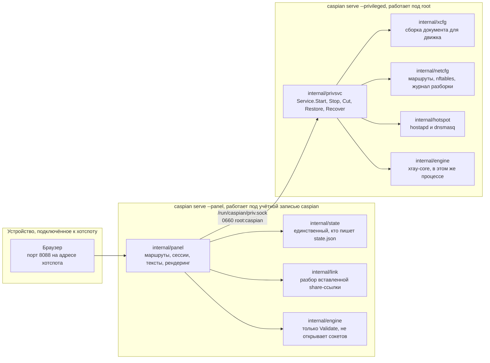
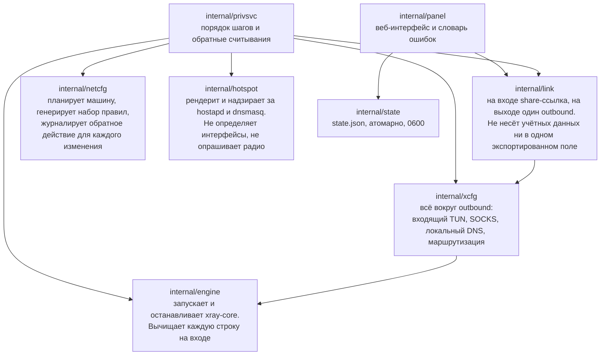
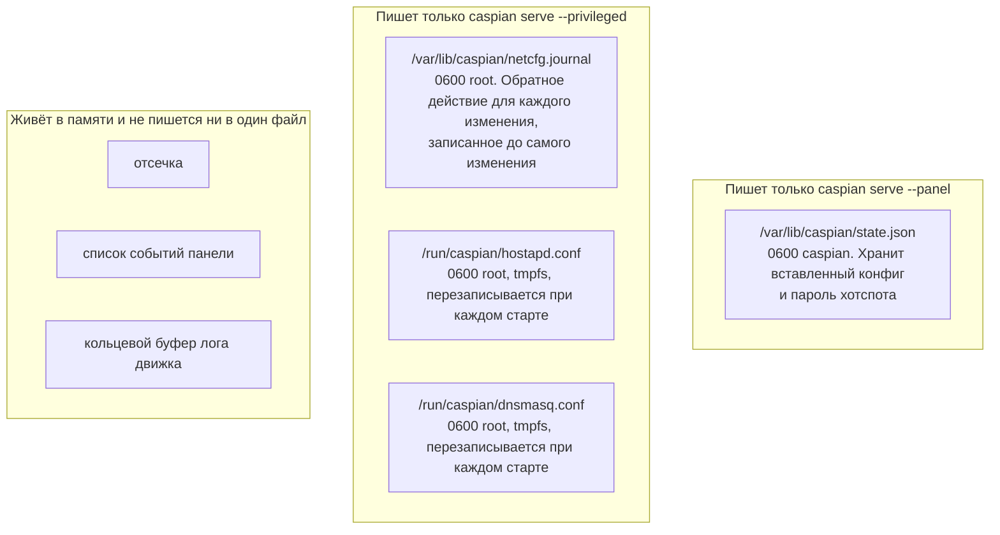
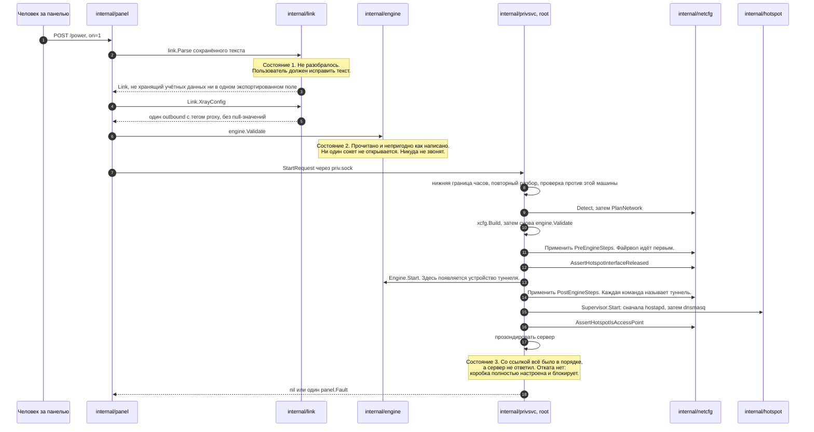
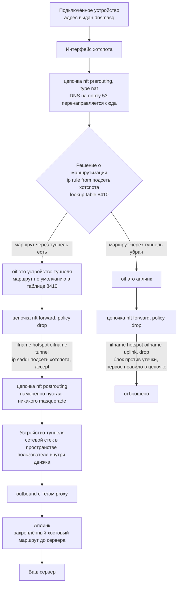
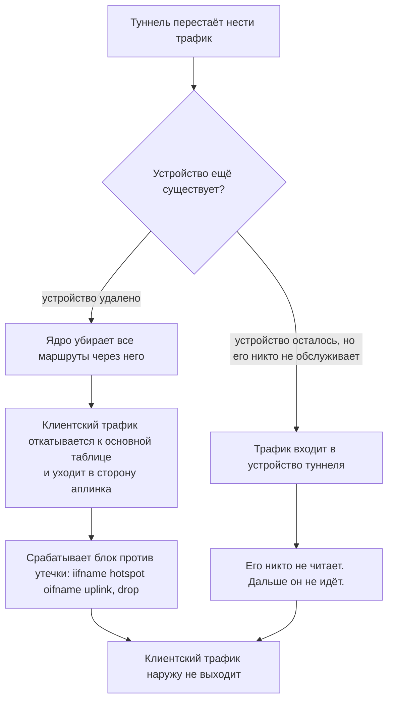
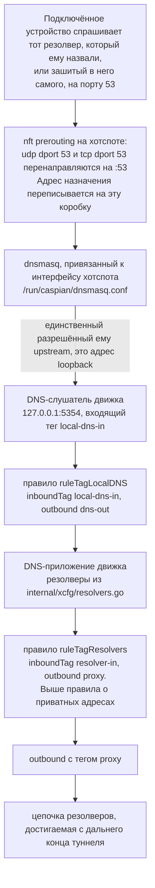
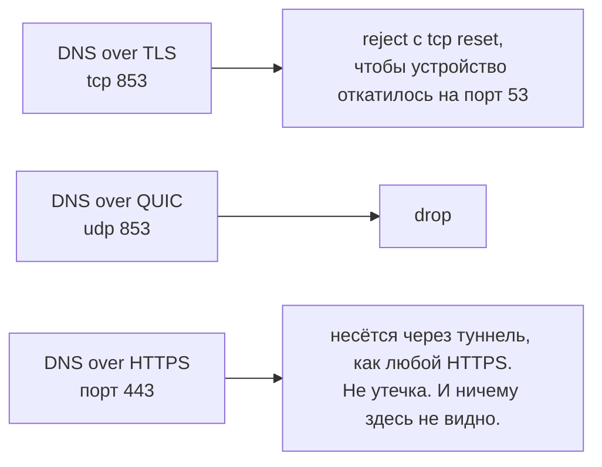
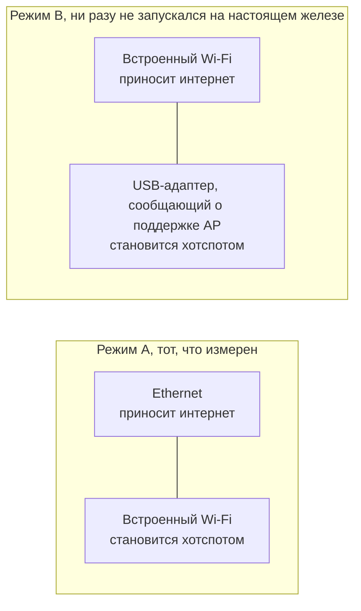
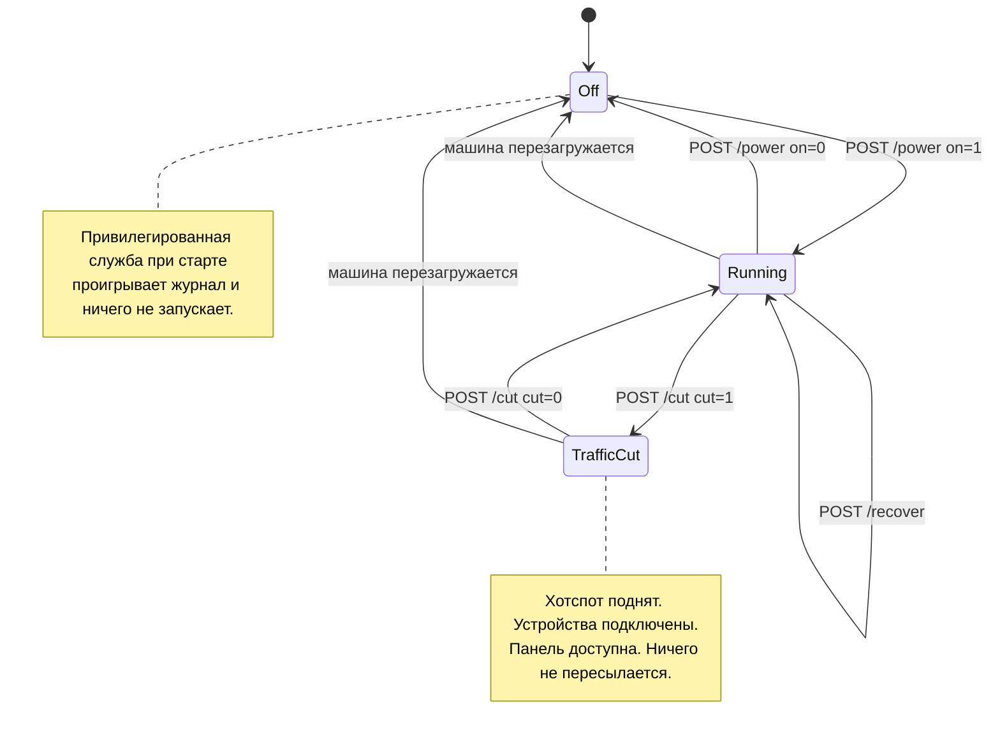

# Caspian-BYOC

[English](README.md) | [فارسی](README.fa.md) | [Русский](README.ru.md) | [中文](README.zh.md)

Caspian-BYOC превращает компьютер с Windows или macOS, Raspberry Pi или
компьютер с Linux в Wi-Fi-шлюз, работающий с вашей собственной конфигурацией.
Вставьте совместимую с V2Ray или Xray конфигурацию прокси в веб-панель и нажмите
один переключатель. Caspian принимает ссылки VLESS, VMess, Shadowsocks, SOCKS,
Trojan и Hysteria2, а также YAML Clash и Clash.Meta, необработанный JSON Xray,
списки ссылок и данные подписки в base64. Caspian подключается через Xray-core и
раздаёт туннель как точку доступа Wi-Fi, поэтому все подключённые устройства
защищены без установки приложений.

Снимок выше сделан 2026-09-03 с реально работающей коробки, на Raspberry Pi 5,
с поднятым туннелем, до подключения первого устройства. Русского снимка нет,
поэтому здесь показана английская версия панели. Пароль сети, имя конфигурации и адрес сервера
на нём заменены, а код для подключения размыт, потому что этот код содержит в
себе имя сети и её пароль. Больше ничего не изменено.

Панель сначала на персидском, потом на английском. Никаких учётных записей,
никакой телеметрии, и панель ничего не запрашивает из интернета.

## Установка и руководства

[Загрузки](https://github.com/Iman/caspian/releases/latest) | [Вики Caspian](https://github.com/Iman/caspian/wiki/Home.ru)

| Тема | English | فارسی | Русский | 中文 |
|---|---|---|---|---|
| Начало работы | [English](https://github.com/Iman/caspian/wiki/Getting-Started) | [فارسی](https://github.com/Iman/caspian/wiki/Getting-Started.fa) | [Русский](https://github.com/Iman/caspian/wiki/Getting-Started.ru) | [中文](https://github.com/Iman/caspian/wiki/Getting-Started.zh) |
| Установка | [English](https://github.com/Iman/caspian/wiki/Installation) | [فارسی](https://github.com/Iman/caspian/wiki/Installation.fa) | [Русский](https://github.com/Iman/caspian/wiki/Installation.ru) | [中文](https://github.com/Iman/caspian/wiki/Installation.zh) |
| Установка на Linux и Raspberry Pi | [English](https://github.com/Iman/caspian/wiki/Install-Linux) | [فارسی](https://github.com/Iman/caspian/wiki/Install-Linux.fa) | [Русский](https://github.com/Iman/caspian/wiki/Install-Linux.ru) | [中文](https://github.com/Iman/caspian/wiki/Install-Linux.zh) |
| Установка на macOS | [English](https://github.com/Iman/caspian/wiki/Install-macOS) | [فارسی](https://github.com/Iman/caspian/wiki/Install-macOS.fa) | [Русский](https://github.com/Iman/caspian/wiki/Install-macOS.ru) | [中文](https://github.com/Iman/caspian/wiki/Install-macOS.zh) |
| Установка на Windows | [English](https://github.com/Iman/caspian/wiki/Install-Windows) | [فارسی](https://github.com/Iman/caspian/wiki/Install-Windows.fa) | [Русский](https://github.com/Iman/caspian/wiki/Install-Windows.ru) | [中文](https://github.com/Iman/caspian/wiki/Install-Windows.zh) |
| Протоколы и транспорты | [English](https://github.com/Iman/caspian/wiki/Protocols-and-Transports) | [فارسی](https://github.com/Iman/caspian/wiki/Protocols-and-Transports.fa) | [Русский](https://github.com/Iman/caspian/wiki/Protocols-and-Transports.ru) | [中文](https://github.com/Iman/caspian/wiki/Protocols-and-Transports.zh) |
| Архитектура и потоки данных | [English](https://github.com/Iman/caspian/wiki/Architecture) | [فارسی](https://github.com/Iman/caspian/wiki/Architecture.fa) | [Русский](https://github.com/Iman/caspian/wiki/Architecture.ru) | [中文](https://github.com/Iman/caspian/wiki/Architecture.zh) |
| Панель и настройки | [English](https://github.com/Iman/caspian/wiki/Panel-and-Configuration) | [فارسی](https://github.com/Iman/caspian/wiki/Panel-and-Configuration.fa) | [Русский](https://github.com/Iman/caspian/wiki/Panel-and-Configuration.ru) | [中文](https://github.com/Iman/caspian/wiki/Panel-and-Configuration.zh) |
| Безопасность и конфиденциальность | [English](https://github.com/Iman/caspian/wiki/Security-and-Privacy) | [فارسی](https://github.com/Iman/caspian/wiki/Security-and-Privacy.fa) | [Русский](https://github.com/Iman/caspian/wiki/Security-and-Privacy.ru) | [中文](https://github.com/Iman/caspian/wiki/Security-and-Privacy.zh) |
| Разработка и тестирование | [English](https://github.com/Iman/caspian/wiki/Development-and-Testing) | [فارسی](https://github.com/Iman/caspian/wiki/Development-and-Testing.fa) | [Русский](https://github.com/Iman/caspian/wiki/Development-and-Testing.ru) | [中文](https://github.com/Iman/caspian/wiki/Development-and-Testing.zh) |
| Устранение неполадок и известные дефекты | [English](https://github.com/Iman/caspian/wiki/Troubleshooting) | [فارسی](https://github.com/Iman/caspian/wiki/Troubleshooting.fa) | [Русский](https://github.com/Iman/caspian/wiki/Troubleshooting.ru) | [中文](https://github.com/Iman/caspian/wiki/Troubleshooting.zh) |
| Релизы и сопровождение | [English](https://github.com/Iman/caspian/wiki/Releases-and-Maintenance) | [فارسی](https://github.com/Iman/caspian/wiki/Releases-and-Maintenance.fa) | [Русский](https://github.com/Iman/caspian/wiki/Releases-and-Maintenance.ru) | [中文](https://github.com/Iman/caspian/wiki/Releases-and-Maintenance.zh) |
| Лицензия и используемые проекты | [English](https://github.com/Iman/caspian/wiki/Licence-and-Credits) | [فارسی](https://github.com/Iman/caspian/wiki/Licence-and-Credits.fa) | [Русский](https://github.com/Iman/caspian/wiki/Licence-and-Credits.ru) | [中文](https://github.com/Iman/caspian/wiki/Licence-and-Credits.zh) |
| Карта документации | [English](https://github.com/Iman/caspian/wiki/Documentation-Map) | [فارسی](https://github.com/Iman/caspian/wiki/Documentation-Map.fa) | [Русский](https://github.com/Iman/caspian/wiki/Documentation-Map.ru) | [中文](https://github.com/Iman/caspian/wiki/Documentation-Map.zh) |
| Переводы | [English](https://github.com/Iman/caspian/wiki/Translations) | [فارسی](https://github.com/Iman/caspian/wiki/Translations.fa) | [Русский](https://github.com/Iman/caspian/wiki/Translations.ru) | [中文](https://github.com/Iman/caspian/wiki/Translations.zh) |
| Шаблон страницы | [English](https://github.com/Iman/caspian/wiki/Page-Template) | [فارسی](https://github.com/Iman/caspian/wiki/Page-Template.fa) | [Русский](https://github.com/Iman/caspian/wiki/Page-Template.ru) | [中文](https://github.com/Iman/caspian/wiki/Page-Template.zh) |

## Записанные эксперименты

> Руководство перенесено из README. Даты измерений сохранены; перенос документации не означает нового запуска тестов.
> [English](https://github.com/Iman/caspian/blob/108567a6a529be05b577ee68b65b48790f07e43d/README.md) | [فارسی](https://github.com/Iman/caspian/blob/108567a6a529be05b577ee68b65b48790f07e43d/README.fa.md) | [Русский](https://github.com/Iman/caspian/blob/108567a6a529be05b577ee68b65b48790f07e43d/README.ru.md) | [中文](https://github.com/Iman/caspian/blob/108567a6a529be05b577ee68b65b48790f07e43d/README.zh.md)

### Что переносило байты через настоящий сервер

Добавлено пакетом `test/tunnel`. Каждая схема, которую принимает парсер,
прогоняется целиком против настоящего экземпляра xray-core, собранного из
зависимости этого же модуля и загруженного тем же загрузчиком, которым
пользуется `internal/engine`. Клиентская сторона, это продуктовый путь без
изменений: `link.Parse`, затем `xcfg.Build`, затем `engine.Engine.Start`. Ни
один конфиг не написан вручную.

| протокол | транспорт | безопасность | переносит HTTP-запрос |
|---|---|---|---|
| VLESS | tcp (raw) | none | да |
| VMess | tcp (raw) | none | да |
| Shadowsocks, aes-256-gcm | tcp (raw) | none | да |
| SOCKS | tcp (raw) | none | да |
| Trojan | tcp (raw) | TLS, закреплённый по отпечатку | да |
| Hysteria2, и псевдоним `hy2` | QUIC | TLS, закреплённый по отпечатку | да |

Четыре контрольных механизма не дают пройти запросу, который прошёл мимо
туннеля, и все четыре реально выполняются, а не утверждаются в тексте. Клиенту
никогда не сообщают, где находится источник: ему дают имя в зоне `.invalid` и
порт приманки. Это имя невозможно разрешить, и набор тестов говорит об этом
вслух, если какой-нибудь резолвер на машине всё же на него ответит. Источник
проверяет, куда запрос был адресован, а не только то, что он пришёл. Приманка
считает попадания по себе, и туннелированный запрос не должен добавить ни
одного. `TestEveryCarriageProofCanFail` и
`TestTheProofRejectsARequestThatDidNotGoThroughTheTunnel` и делают эти механизмы
доказательством, а не намерением.

Читайте каждую строку узко. Все строки, кроме Hysteria2, работают поверх сырого
TCP. Ни одна строка не задействует REALITY, серверной стороне которого нужна
настоящая цель для рукопожатия. Shadowsocks взят только с aes-256-gcm, потому
что шифры 2022 года идут другим путём в коде. Каждая строка несёт запрос по TCP,
а UDP associate выключен. Всё происходит на loopback, поэтому адрес выхода не
фиксируется и зафиксирован быть не может.

`TestEveryProtocolTheParserAcceptsIsDrivenEndToEnd` читает список принимаемых
схем прямо из исходников `internal/link`, поэтому восьмую схему нельзя добавить,
не добавив здесь строку.

### Что действительно доказано на железе

Таблица ниже, это то, что прошло настоящим трафиком с зафиксированным адресом
выхода. Это не то, что принимает парсер, и не то, что переносит набор тестов на
loopback.

| протокол | транспорт | безопасность | доказано целиком |
|---|---|---|---|
| VLESS | tcp (raw) | REALITY | да, на трёх разных серверах |
| VLESS | ws (WebSocket) | none, плюс VLESS Encryption | да |
| VLESS | ws (WebSocket) | TLS | да, через CDN |
| VLESS | httpupgrade | TLS | да, через CDN |
| VLESS | xhttp | TLS | да |
| VMess, Trojan, Shadowsocks, SOCKS, Hysteria2 | любой | любая | нет |

Каждый из этих случаев был доказан работой настоящего браузера на настоящем
телефоне, подключённом к хотспоту. Адрес выхода фиксировался из двух независимых
источников и сопоставлялся с сервером, который назван в конфигурации.
Использовались три разных сервера, и каждый возвращал свой адрес, поэтому
повторное или закешированное показание нельзя принять за работающий туннель.

Строка, которая не доказана, не является утверждением, что она сломана. Это
утверждение, что никто не видел, как пакет вышел с дальнего конца, а это другое
дело и единственное, что этот проект считает доказательством. Документ для
движка, который порождает каждый транспорт, ЗАКРЕПЛЁН как золотой файл, поэтому
изменение в том, как он собирается, проявляется как diff. Это доказывает, что
документ стабилен, и ничего не говорит о том, соединяется ли транспорт.

## Что действительно проверено

### Набор тестов на Go, этот репозиторий, измерено 2026-08-31

На коммите `5b0a8a7` с чистым рабочим деревом, на go1.27.0 darwin/arm64:

    go build ./...                 exit 0
    go test -count=1 -v ./...      exit 0

Тот прогон выполнил 1577 тестов, включая подтесты: 1572 прошли, 5 пропущены, 0
упали. Пятнадцать пакетов отчитались `ok`. У двух нет файлов с тестами:
`bdd/harness` и `local/devpanel`. Пять пропусков объявляют, чего они не
доказывают: жизненный цикл устройства TUN, который работает только на Linux и
требует root и `/dev/net/tun`, три проверки конфигурации dnsmasq, которым нужен
установленный dnsmasq, и выгрузка PNG с QR-кодом, включаемая отдельно.

Предыдущий записанный прогон, на коммите `dd15ad6` от 2026-08-30, выполнил 1323
теста, включая подтесты: 1319 прошли, 4 пропущены, 0 упали, по двенадцати
пакетам, отчитавшимся `ok`.

`-count=1` не является необязательным. Он отключает кеш результатов. Без него
второй прогон печатает строки PASS из первого прогона и завершается с кодом 0,
не выполнив ничего.

Полная проверка, это [`scripts/gate.sh`](https://github.com/Iman/caspian/blob/main/scripts/gate.sh): gofmt, `go vet`, весь набор тестов с
детектором гонок и порог покрытия по каждому пакету. Прочитайте его заголовок,
прежде чем куда-либо направлять его по конвейеру. Конвейер в шелле возвращает
статус своей последней команды, и эта ловушка уже давала в этом проекте ложную
зелёную оценку.

[`packaging/test-install.sh`](https://github.com/Iman/caspian/blob/main/packaging/test-install.sh) покрывает два shell-скрипта на любой машине с bash,
включая ту, на которую установка невозможна.

### Набор поведенческих тестов

[`docs/BEHAVIOUR.md`](https://github.com/Iman/caspian/blob/main/docs/BEHAVIOUR.md) перечисляет 24 сценария. Прогон 2026-08-31 выполнил все 24,
а `TestEveryScenarioCanFail` выполнил 24 соответствующих внедрённых дефекта,
поэтому каждый сценарий видели краснеющим ровно на то, что он заявляет
обнаруживать. `TestBehaviourDocumentListsEveryScenario` падает, если документ и
набор тестов расходятся, в любую из сторон. Чтобы запустить один:

    go test ./test/bdd/ -run 'TestBehaviour/the_firewall'

### Набор тестов на перенос трафика

`test/tunnel` прогоняет каждую из семи схем, которые принимает парсер, через
настоящий сервер xray-core на loopback. Каждая обязана доставить HTTP-запрос
источнику, до которого можно добраться только с дальней стороны туннеля.
Смотрите раздел «Что переносило байты через настоящий сервер» выше, чтобы
понять, что покрывает каждая строка и чего она не покрывает. До появления этого
пакета самым сильным утверждением, которое держалось для шести из этих семи
протоколов, было то, что движок загрузит порождаемый ими документ.

### На целевом железе

[`internal/netcfg/testdata/PROVENANCE.md`](https://github.com/Iman/caspian/blob/main/internal/netcfg/testdata/PROVENANCE.md), это сама запись, и она аккуратна в
различении того, что было снято с машины, и того, что было написано вручную.
Имена файлов несут класс: `capture-pi5-`, это побайтовый вывод настоящей команды
на Pi, `scenario-`, это машина, которую никто не измерял, а `golden-`, это
собственный вывод этого проекта.

Измерено на Pi и там же записано: все пять различных сгенерированных наборов
правил разобраны через `nft -c -f`, причём sha256 каждого файла считывался
обратно на самом Pi, а не на машине разработчика, и `nft list ruleset` был пуст
до и после. Последовательность освобождения интерфейса и обратные к ней
действия. Драйвер, отказывающийся создать второй AP-интерфейс, но принимающий
смену типа у существующего. Провокации аварийного отключения с их отрицательными
контролями. И блокировка доступа из-за политики input, из-за которой ту политику
и отозвали.

Тот же файл фиксирует, что сломалось при замене написанных вручную байтов на
измеренные, и это и есть довод за то, чтобы держать оба вида. Несколько дефектов
проходили зелёными во всех предыдущих прогонах, включая набор правил файрвола,
который не загрузило бы ни одно ядро, и разборку, которая выключила бы проверку
обратного пути на машине, где та была включена.

### Целиком, с настоящим телефоном

Стенд, это [`test/hardware/caspian-hw`](https://github.com/Iman/caspian/blob/main/test/hardware/caspian-hw), а руководство, это
[`docs/HARDWARE-TEST.md`](https://github.com/Iman/caspian/blob/main/docs/HARDWARE-TEST.md). Его стандарт, это стандарт самого проекта. Соединение,
это не результат, и транспорт доказан только тогда, когда через него прошёл
настоящий трафик, а адрес выхода зафиксирован и сопоставлен с сервером, который
назван в конфиге. Адрес выхода, равный базовому значению без туннеля, это
утечка, и она перевешивает всё остальное в прогоне. Телефон, сменивший состояние
сети посреди съёма данных, делает показание недействительным, а не проходным и
не утечкой.

Прогон, записанный 2026-08-30, `run-20260830T144015Z`, дал оценки по IPv4:

- два конфига доказаны, каждый с `verdict PASS`, с `sources agree` и адресом
  выхода из обоих независимых источников, сопоставленным с той коробкой, которую
  называет конфиг.
- отпечаток выхода менялся при смене конфига.
- проверка DNS обнаружила случайную для каждого прогона метку `.invalid` ноль
  раз в открытом виде на аплинке за окно в 30 секунд. Четыре пакета DNS в
  открытом виде за это окно через аплинк всё же прошли, и они принадлежат самой
  коробке, что дизайн выносит за пределы гарантии. Именно поэтому проверка ищет
  метку, которую ничто другое в сети произвести не могло, а не считает пакеты на
  порту 53, что не позволяет отличить сбежавший запрос клиента от собственного
  запроса коробки.
- отказ в закрытую: с остановленным движком и отключённой сотовой связью на
  телефоне (режим полёта) ни один из источников не достучался до интернета, при
  этом панель всё ещё отвечала через хотспот. То есть это был файрвол,
  отклоняющий трафик, а не мёртвый канал. Две более ранние попытки этого шага
  получили оценку VOID и были переснятыми, а не отчитанными.

Про эту запись стоит сказать две вещи. Она дошла до прохождения с третьей
попытки на последнем шаге, и два недействительных показания лежат в журнале, а
не удалены. И артефакты прогона живут в `local/`, который в gitignore, поэтому
их **нет в этом репозитории**. Если вы клонируете это, проверить тот прогон вы
не сможете. Вы можете только заново прогнать стенд сами.

Два источника используются потому, что один может быть закеширован или
устаревшим, и оба привязаны к IP-адресам, а не к именам. [`docs/HARDWARE-TEST.md`](https://github.com/Iman/caspian/blob/main/docs/HARDWARE-TEST.md)
объясняет почему в абзаце, который сам называет самым важным в файле. Резолвер в
той локальной сети отправляет сервисы, показывающие ваш IP, в чёрную дыру.
Поэтому коробка, которая не поменяла ничего, кроме DNS-сервера, и не
туннелировала трафик вообще, показала бы ровно ту картину, которую ищет стенд,
разрешающий имена. И получила бы оценку «пройдено».

Стенд вычищает каждый конфиг, адрес сервера, идентификатор пользователя и ключ
из всего, что он пишет. Он перечитывает каждый артефакт, чтобы убедиться, что
вычистка удержалась, и у него есть проход, который перечитывает весь прогон в
поисках того, что просочилось мимо фильтра. Ни один захват пакетов никогда не
покидает Pi. Вывод tcpdump сводится к двум числам прямо на коробке, потому что
захват на том аплинке, это запись собственного веб-сёрфинга сопровождающего.

Схемы архитектуры и сети

## Лицензия

AGPL-3.0-or-later. [LICENSE](LICENSE) | [NOTICE](NOTICE) | [English](https://github.com/Iman/caspian/wiki/Licence-and-Credits) | [فارسی](https://github.com/Iman/caspian/wiki/Licence-and-Credits.fa) | [Русский](https://github.com/Iman/caspian/wiki/Licence-and-Credits.ru) | [中文](https://github.com/Iman/caspian/wiki/Licence-and-Credits.zh)
