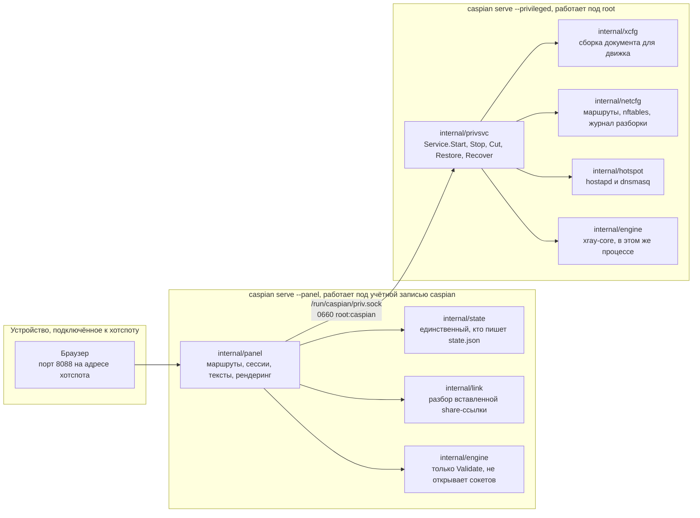
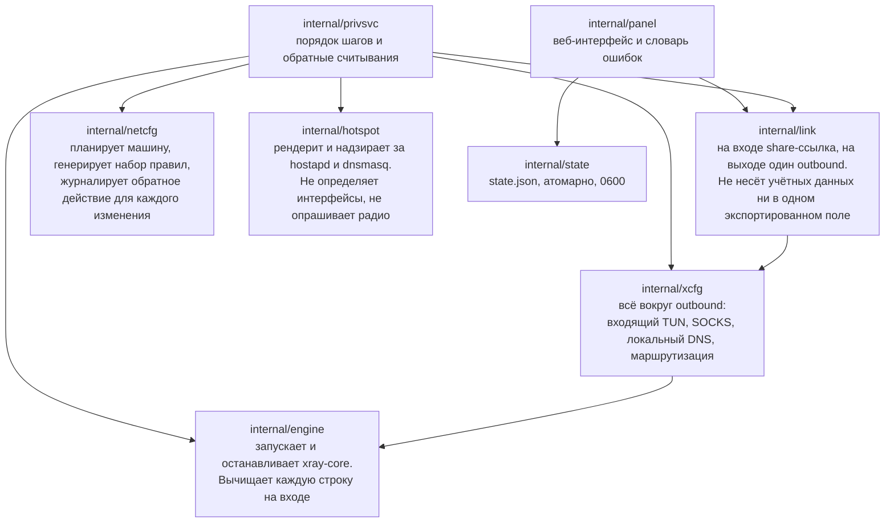
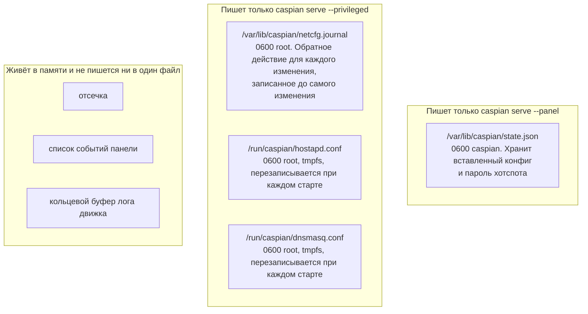
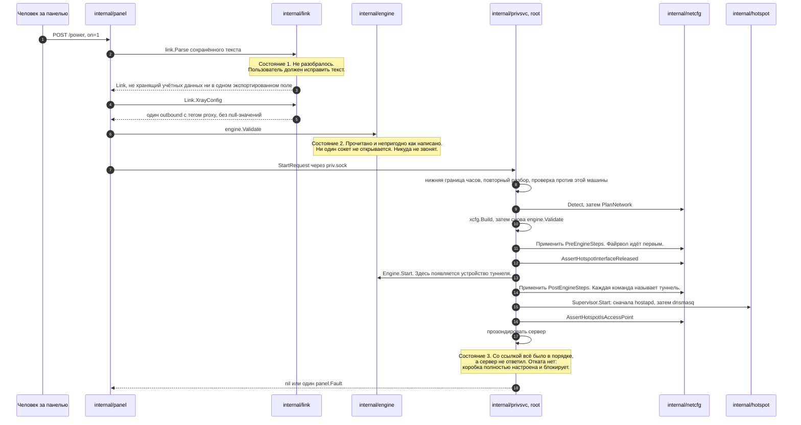
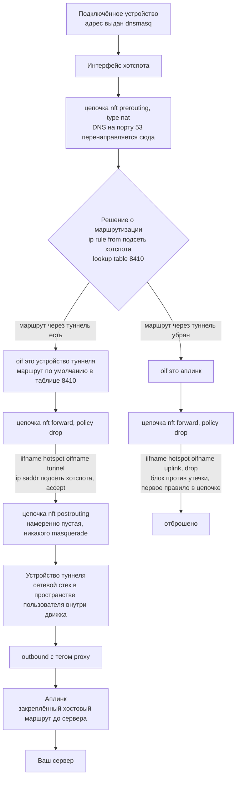
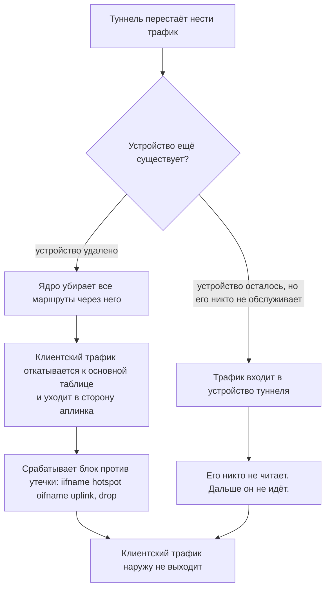
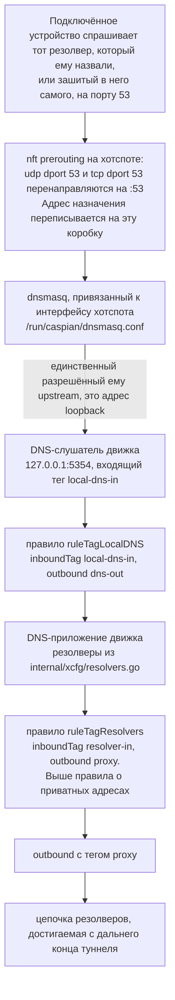
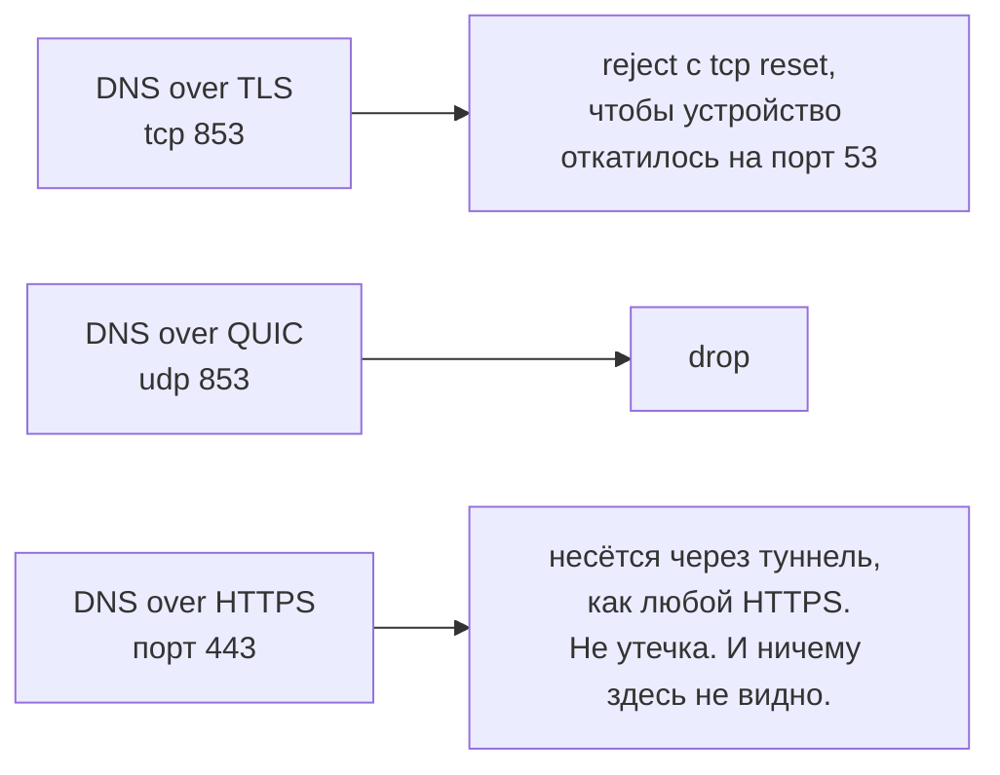
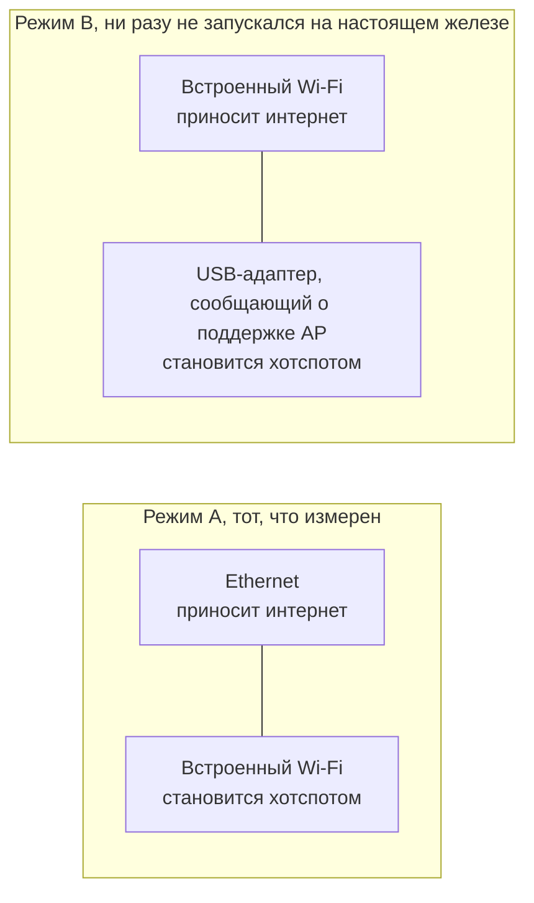
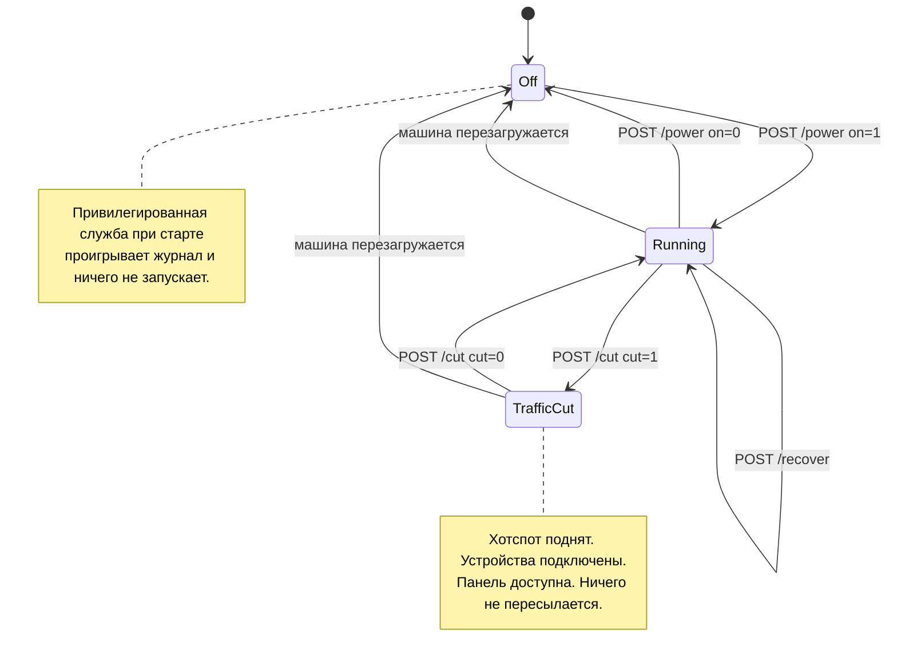

# Caspian-BYOC

[🇮🇷 فارسی](README.fa.md) | [🇬🇧 English](README.md) | 🇷🇺 **Русский** | [🇨🇳 中文](README.zh.md)

[](https://github.com/Iman/caspian/actions/workflows/ci.yml)
[](https://github.com/Iman/caspian/releases/latest)
[](LICENSE)
[](https://github.com/Iman/caspian/releases/latest)
[](https://github.com/Iman/caspian/pkgs/container/caspian)
[](https://deepwiki.com/Iman/caspian)


> ### [English: the full guide in English](README.md)
>
> Это перевод. Авторитетной версией является английский `README.md`: именно его
> проверяют тесты. Если два текста расходятся, прав английский.
>
> **[Read this in English](README.md)**

Caspian-BYOC превращает компьютер с Windows или macOS, Raspberry Pi или
компьютер с Linux в Wi-Fi-шлюз, работающий с вашей собственной конфигурацией.
Вставьте совместимую с V2Ray или Xray конфигурацию прокси в веб-панель и нажмите
один переключатель. Caspian принимает ссылки VLESS, VMess, Shadowsocks, SOCKS,
Trojan и Hysteria2, а также YAML Clash и Clash.Meta, необработанный JSON Xray,
списки ссылок и данные подписки в base64. Caspian подключается через Xray-core и
раздаёт туннель как точку доступа Wi-Fi, поэтому все подключённые устройства
защищены без установки приложений.


Снимок выше сделан 2026-09-03 с реально работающей коробки, на Raspberry Pi 5,
с поднятым туннелем, до подключения первого устройства. Русского снимка нет,
поэтому здесь показана английская версия панели. Пароль сети, имя конфигурации и адрес сервера
на нём заменены, а код для подключения размыт, потому что этот код содержит в
себе имя сети и её пароль. Больше ничего не изменено.

Панель сначала на персидском, потом на английском. Никаких учётных записей,
никакой телеметрии, и панель ничего не запрашивает из интернета.

Этот файл описывает, что делает код в этом репозитории, что он гарантирует и
чего не гарантирует. Каждая возможность ниже названа вместе с кодом, тестом или
записанным измерением, на которые она опирается. Там, где утверждение опирается
на тест, названо имя теста, а не номер строки, потому что имена переживают
рефакторинг.

---

## Что можно вставить и что будет отклонено

Конфиг приносите вы. Ниже то, что коробка принимает, взятое из самого кода,
который это принятие выполняет, а не из списка пожеланий. Каждая строка измерена
против `internal/link` и закреплённой версии движка.

| | Работает | Отклоняется |
|---|---|---|
| Share-ссылки | `vless://` `vmess://` `ss://` `socks://` `trojan://` `hysteria2://` `hy2://` | `tuic://` `ssr://` `wireguard://` `anytls://` `naive+https://` `hysteria://` (версия 1) |
| Вставленные документы | YAML для Clash и Clash.Meta, сырой xray JSON, список ссылок по одной в строке, блок подписки в base64 | адрес подписки, документ Clash, завёрнутый в base64, массив JSON, текст, первая строка которого является комментарием |
| Транспорты | `raw` (он же `tcp`), `ws`, `grpc`, `httpupgrade`, `xhttp` (он же `splithttp`), `kcp` и `mkcp` | `h2`, `h3`, `http`, `quic`, `gun` |
| Безопасность | `none`, `tls`, `reality` | `xtls` (старого образца), `allowInsecure` |
| flow в VLESS | `xtls-rprx-vision`, `xtls-rprx-vision-udp443` или ничего | любое другое значение |

`h2` и `h3` в том столбце с отклонёнными, это ИМЕНА транспортов. Сами HTTP/2 и
HTTP/3 переносятся: `type=xhttp` с `security=tls`, а какой именно, решает ALPN в
TLS. Смотрите [HTTP/2 и HTTP/3 переносятся, просто под другим
именем](#http2-и-http3-переносятся-просто-под-другим-именем).

Шесть вещей удивляют людей, поэтому они здесь, а не в сноске:

Используется только ПЕРВАЯ ссылка. Вставьте сорок серверов, и настроен будет
один; панель говорит, сколько она нашла. `ss://` и `socks://` требуют
пользовательские данные в форме base64, а простое написание
`method:password@host` отклоняется. REALITY работает только поверх `raw`,
`xhttp` и `grpc`, поэтому сочетание с WebSocket движок отклоняет прямо в момент
вставки, а не спустя время при подключении. `security=` здесь должен быть в
нижнем регистре, хотя самому движку это безразлично, и `TLS` заглавными буквами
возвращается вам как `none`. Параметр `plugin=` в ссылке `ss://` игнорируется
без каких-либо сообщений. И адрес подписки отклоняется, потому что панель ничего
не запрашивает из интернета, а это намеренное свойство, а не недостающая
функция.

Полная картина, включая то, что из перечисленного переносило настоящие байты, а
что доказано целиком на железе с зафиксированным адресом выхода, находится в
разделе [Протоколы и транспорты](#протоколы-и-транспорты). Это три разных
утверждения, и проект не даёт им смешаться.

---

## Установка

Сначала выберите свою операционную систему. Для macOS предназначен графический
DMG; Linux и Raspberry Pi можно установить автоматически, сначала проверить
или собрать самостоятельно.

### Windows 10 и 11

Поддержка Windows 10 экспериментальная и пока не проверена. На x64 текущий код
требует Windows 10 версии 2004 (сборка 19041) или новее. Совместимость с
Windows 10 на ARM64 пока не проверена.

Нужен компьютер с Windows 11 или Windows 10 версии 2004 или новее на x64
(экспериментальная поддержка). Также нужны учётная запись администратора,
Wi-Fi-адаптер с поддержкой Windows Mobile Hotspot и подключение к интернету.
Установщик включает необходимые компоненты. Устанавливать Go или .NET SDK не нужно.
Подробные шаги приведены в [инструкции для Windows на английском](README.md#windows-10-and-11).

### macOS 13 или новее

Образ диска для macOS содержит нативное приложение **Caspian Control** и движок
Caspian. Terminal, Go, Homebrew и другие среды выполнения не нужны. Требуется
учётная запись администратора, а если встроенный Wi-Fi используется как точка
доступа, интернет должен приходить на Mac по проводному Ethernet.

#### Выберите правильный файл

- На Mac с Intel нужен `Caspian-v0.2.4-macos-amd64.dmg`.
- На Mac с Apple Silicon, то есть M1 или новее, нужен
  `Caspian-v0.2.4-macos-arm64.dmg`.

Если тип процессора неизвестен, откройте **меню Apple → Об этом Mac**.

#### Установите и разрешите первый запуск

Приложение v0.2.4 имеет ad-hoc-подпись, но ещё не подписано сертификатом Apple
Developer ID и не нотарифицировано Apple. Поэтому Gatekeeper показывает
**“Caspian” Not Opened** и сообщает, что Apple не может проверить приложение на
отсутствие вредоносного ПО. Это не сбой приложения. Обходите предупреждение
только для файла, загруженного с официальной страницы релизов Caspian.

1. Откройте [последний релиз Caspian](https://github.com/Iman/caspian/releases/latest)
   и разверните **Assets**.
2. Загрузите DMG для процессора своего Mac и откройте его.
3. Перетащите `Caspian.app` в папку **Applications (Программы)**.
4. Один раз попытайтесь открыть копию из **Applications**.
5. Когда Gatekeeper заблокирует её, нажмите **Done**.
6. Откройте **меню Apple → System Settings → Privacy & Security**.
7. Прокрутите до раздела **Security** и нажмите **Open Anyway** рядом с
   Caspian. Кнопка доступна около часа после заблокированной попытки запуска.
8. Введите пароль входа на Mac, нажмите **OK**, затем подтвердите **Open**.

macOS сохранит приложение как исключение, и в дальнейшем оно будет открываться
обычным двойным щелчком. Тот же порядок описан в официальной инструкции Apple
[Открытие приложения с изменением настроек безопасности](https://support.apple.com/guide/mac-help/apple-cant-check-app-for-malicious-software-mchleab3a043/26/mac/26).

#### Если macOS по-прежнему блокирует фоновую службу

Установленный исполняемый файл фоновой службы, `/usr/local/bin/caspian`, может
сохранить атрибут карантина после разрешения запуска `Caspian.app`. В предупреждении
указано имя `caspian` со строчной буквы, а окно управления может показывать
**Caspian needs attention**.

**Если предупреждение называет троян или сообщает об обнаружении вредоносного ПО, не выполняйте команду ниже.**
Остановите установку и укажите точный текст предупреждения, название обнаруженной
угрозы, версию релиза и адрес загрузки в
[сообщении об ошибке на GitHub](https://github.com/Iman/caspian/issues).
Обнаружение вредоносного ПО требует расследования. Отсутствие подписи само по себе
не доказывает, что обнаружение ложное. См.
[объяснение предупреждений безопасности macOS от Apple](https://support.apple.com/en-ie/102445).

Используйте этот способ только при предупреждении о непроверенном разработчике
или отсутствии нотарификации, если вы доверяете файлу и его источнику.
Загрузите релиз с официальной страницы Caspian и сравните контрольную сумму DMG
с опубликованным для этого релиза файлом `SHA256SUMS`.
Совпадение контрольной суммы подтверждает соответствие файлу релиза, но не его безопасность.

1. Откройте **Terminal**.
2. Удалите атрибут карантина у установленного исполняемого файла фоновой службы:

   ```bash
   sudo xattr -d com.apple.quarantine /usr/local/bin/caspian
   ```

3. Введите пароль входа на Mac. Terminal не отображает пароль при вводе.
4. В Caspian выберите **Advanced options → Restart services**.

Эта команда удаляет только атрибут карантина указанного файла. Она не сканирует,
не подписывает и не нотарифицирует исполняемый файл. Если Terminal сообщает
`No such xattr`, атрибут уже отсутствует. Если служба по-прежнему не запускается,
сообщите об ошибке вместо отключения других средств защиты.

#### Установите Caspian и сохраните его пароль

1. В **Caspian Control** нажмите **Install / Update**.
2. В окне авторизации macOS введите пароль администратора.
3. Дождитесь надписи **Action completed** в окне управления.
4. При первой установке сохраните показанный в выводе **first-run panel
   password**. Кнопка **Copy panel password** копирует только этот пароль.
5. Нажмите **Open panel** и войдите с сохранённым паролем панели.
6. Задайте имя и пароль Wi-Fi, вставьте конфигурацию прокси и включите Caspian
   переключателем в панели.

Пароль входа на Mac, пароль панели Caspian и пароль Wi-Fi — три разных пароля.
Если пароль панели потерян, используйте **Reset password** в Caspian Control;
потребуется авторизация администратора, но конфигурация прокси и настройки точки
доступа сохранятся. После закрытия окна приложение остаётся в верхней строке
меню macOS; выберите там **Open Caspian Control**, чтобы снова открыть окно.

### Linux и Raspberry Pi

#### Автоматически: одна строка

    sudo /bin/bash -c "$(curl -fsSL https://raw.githubusercontent.com/Iman/caspian/main/install.sh)"

Установщик определяет, на какой машине он находится, скачивает подходящий
бинарник из последнего релиза и отказывается работать, если загруженное не
совпадает с опубликованной контрольной суммой.

| `uname -m` | артефакт | типичная машина |
|---|---|---|
| `x86_64` | `caspian-linux-amd64` | ноутбук или мини-ПК |
| `aarch64` | `caspian-linux-arm64` | Raspberry Pi 3, 4, 5 на 64-битной системе |
| `armv7l` | `caspian-linux-arm` | Raspberry Pi 2 и 3 на 32-битной системе |
| `armv6l` | `caspian-linux-arm` | Raspberry Pi 1, Zero, Zero W |

Когда уверенности нет, он отказывается, а не угадывает. Не Linux, архитектура не
из этой таблицы, отсутствие systemd или несовпавшая контрольная сумма: каждый
случай даёт отказ с указанием того, что было найдено. `armv8l`, 32-битное
пользовательское окружение на 64-битном ядре, намеренно не сопоставлен ни с чем,
потому что именно так предыдущий проект отправил код для ARMv7 на машины ARMv6 и
оставил их умирать с недопустимой инструкцией при первом же запуске.

Прочитайте скрипт, прежде чем направлять его в шелл. Для программ такого рода
это не формальность, и скрипт написан так, чтобы его читали.

    curl -fsSL https://raw.githubusercontent.com/Iman/caspian/main/install.sh | less

Чтобы закрепить версию, а не брать последнюю:

    sudo env CASPIAN_VERSION=v0.2.5 /bin/bash -c "$(curl -fsSL https://raw.githubusercontent.com/Iman/caspian/main/install.sh)"

#### Как проверить загрузку самостоятельно

Каждый релиз содержит файл `SHA256SUMS`. Установщик проверяет его за вас, и вы
можете проверить его независимо:

    curl -fsSLO https://github.com/Iman/caspian/releases/latest/download/caspian-linux-arm64
    curl -fsSLO https://github.com/Iman/caspian/releases/latest/download/SHA256SUMS
    sha256sum -c SHA256SUMS --ignore-missing

Что это доказывает и что нет: это доказывает, что файл у вас на руках является
тем файлом, который опубликовал релиз. Это не доказывает, кто этот релиз собрал.
Бинарники собираются GitHub Actions из помеченного коммита, а сборочный процесс
лежит в этом репозитории в `.github/workflows/release.yml`, так что сборку можно
прочитать, хотя она и не воспроизводима независимо.

#### Вручную: соберите сами

Ничто в автоматическом пути не является обязательным. Для сборки из исходников
нужен Go 1.26 или новее, и она даёт бинарник, функционально идентичный
опубликованному.

    git clone https://github.com/Iman/caspian.git
    cd caspian
    go build -trimpath -o caspian ./cmd/caspian
    sudo CASPIAN_LOCAL_BINARY="$PWD/caspian" bash install.sh

`CASPIAN_LOCAL_BINARY` говорит установщику взять файл, который вы только что
собрали, вместо того чтобы что-то скачивать. Всё остальное, что делает
установщик, а именно создание служебной учётной записи, каталогов, юнитов и их
прав, происходит точно так же.

Кросс-компиляция для Pi с другой машины:

    GOOS=linux GOARCH=arm64 go build -trimpath -o caspian-linux-arm64 ./cmd/caspian
    GOOS=linux GOARCH=arm GOARM=6 go build -trimpath -o caspian-linux-arm ./cmd/caspian

`GOARM=6` в 32-битной сборке не является необязательным. И `armv6l`, и `armv7l`
устанавливают один и тот же артефакт `arm`, поэтому сборка под ARMv7 ломает
каждый Pi 1, Zero и Zero W, который её поставит. Сборочный процесс релиза
проверяет это через `readelf` и падает, а не публикует артефакт, который врёт о
своей архитектуре.

Прежде чем доверять сборке, прогоните проверочный набор:

    bash scripts/gate.sh

Он прогоняет форматирование, vet, весь набор тестов с детектором гонок, пороги
покрытия по пакетам, слой золотых регрессий, сканирование на утечку приватных
данных и подмножество дымовых тестов. При неудаче он завершается ненулевым
кодом. Не направляйте его никуда по конвейеру: конвейер в шелле сообщает статус
своей последней команды, поэтому передача его в `tail` выбрасывает ровно тот
ответ, ради которого вы его запускали.

---

## Два читателя, два маршрута по этому файлу

Если вы решаете, **запускать ли это**, читайте «Для чего это», «Что для этого
нужно» и «Как это запускать».

Если вы решаете, **доверять ли этому**, читайте «Что он гарантирует», затем
«Чего он не гарантирует», затем «Что действительно проверено», затем
`docs/DEFECTS.md`. Второе и третье из перечисленного важнее всего. Утверждение о
безопасности, которое вы не можете проверить, ничего не стоит для того, кто
понесёт последствия, если оно окажется неверным.

`FAQ.md` отвечает на вопросы, с которыми люди сталкиваются на практике, и каждый
ответ называет файл или код ошибки, из которого он взят.

---

## Для чего это

Аудитория, это человек, которому доверенное лицо дало рабочий конфиг и который
хочет, чтобы устройства в комнате просто работали. Он не станет открывать
терминал, читать лог или править файл. После установки всё происходит в панели.
Смотрите `docs/2026-08-29-design.md`, разделы 5.1 и 5.2.

Движок, это xray-core v26.4.15 (Go module version `v1.260327.1-0.20260415235634-c5edc122b70e`), встроенный в бинарник, а не скачиваемый.
Разбор share-ссылок выполняет пакет `share` под лицензией MIT из XTLS/libXray,
вендоренный на теге v26.3.27 в `third_party/libxray-share/`, с сохранённой рядом
собственной лицензией.

`supportedSchemes` в `internal/link/link.go` принимает семь схем: `vless`,
включая REALITY, а также `vmess`, `trojan`, `ss`, `socks`, `hysteria2` и `hy2`.
Всё остальное, включая `tuic`, `ssr`, `wireguard` и `anytls`, отклоняется
поимённо.

---

## Архитектура

### Два процесса, один бинарник

Один бинарник работает в двух ролях, и роль выбирается подкомандой. Разделение
существует для того, чтобы сбой в той части, которая разбирает пользовательский
ввод и обслуживает HTTP, не был сбоем в той части, которая держит root.
`docs/LAYOUT.md`, раздел «Two processes, one binary», является закреплённой
формулировкой этого.



`cmd/caspian/main.go` печатает обе роли в собственной справке:

    caspian serve --privileged     root: routes, firewall, access point, engine
    caspian serve --panel          the caspian user: the web panel, nothing privileged

### Сокет и почему его словарь закрыт

`internal/panel/priv.go` формулирует правило, ради которого и существует всё это
разделение: "A privileged helper that takes a path and an argument list from its
client is not a boundary; it is a way to run anything as root." То есть:
привилегированный помощник, принимающий от своего клиента путь и список
аргументов, не является границей; это способ запустить что угодно от имени root.
Точка с запятой их. Фраза процитирована дословно, потому что пересказ правила не
является правилом.

Поэтому панель не может выразить «выполни это». Она может только назвать одно из
восьми действий, а привилегированная сторона решает, что каждое из них значит.
`panel.Actions` и есть это закрытое множество, а
`TestActionVocabularyMatchesTheInterface` падает, если в интерфейс добавлен
метод, которому нет имени в списке.

| Действие | Что делает привилегированная сторона | Меняет машину |
|---|---|---|
| `detect` | Сообщает интерфейсы, ограничения радио и выбранную подсеть | нет |
| `status` | Сообщает фазу движка, состояние хотспота и то, отсечён ли трафик | нет |
| `start` | Поднимает туннель и хотспот | да |
| `stop` | Опускает их и проигрывает журнал разборки | да |
| `recover` | Останавливает, проигрывает журнал, затем запускает заново из того же запроса | да |
| `engine-log` | Возвращает последние строки лога движка, уже вычищенные | нет |
| `cut` | Обрывает пересылаемый клиентский трафик, оставляя всё остальное работать | да |
| `restore` | Возвращает пересылаемый клиентский трафик обратно | да |

Один запрос, один ответ, одно соединение. Сообщение, это 4-байтовая длина в
порядке big-endian, за которой следует столько же байтов JSON. Длина
проверяется против `maxFrameBytes` до того, как что-либо будет выделено или
разобрано, поэтому слишком большое сообщение стоит четырёх байтов и отказа.
Неизвестные поля JSON отклоняются, а не игнорируются. `protocolVersion`
проверяется в каждом запросе. Поэтому панель из одного релиза, говорящая с
привилегированной службой из другого, получает поименованный отказ вместо поля,
молча разобранного как нулевое значение.

По пути ошибки обратно не переходит ничего, кроме одного слова: `panel.Fault` из
закрытого множества или `privsvc.Refusal` из второго закрытого множества. В
собственном тексте ошибок движка встроен ключевой материал пользователя, поэтому
он записывается в лог на привилегированной стороне и отбрасывается. В ответе нет
поля, в котором он мог бы уехать.

### Какой пакет за что отвечает



`internal/privsvc` заново разбирает `StartRequest.ConfigJSON` через
`internal/link`, а не доверяет тому, что это уже сделала панель. Он также
сверяет интерфейс выхода в интернет с собственным маршрутом по умолчанию этой
машины, интерфейс хотспота с собственным выводом `iw list` этой машины, а канал
с тем, что радио сообщило как пригодное.

### Где живёт состояние и кто его пишет

Два писателя, два файла, ни одного общего файла. Ни один процесс не пишет в файл
другого, поэтому нет ни блокировок, ни потерянных обновлений, от которых надо
было бы защищаться. `docs/LAYOUT.md`, раздел «Who writes what», фиксирует это
решение и более ранний черновик, который оно отменило.



Привилегированная сторона не читает вообще ни одного файла состояния. Всё, что
ей нужно, приходит в запросе на старт. `TestPrivsvcReadsNoStateFile` сканирует
исходники самого этого пакета и падает, если он когда-нибудь начнёт читать такой
файл, чего комментарий обеспечить бы не смог.

Полная таблица путей, прав и владельцев находится в `docs/LAYOUT.md`. Порты
зафиксированы там же: 53 для клиентского DNS на хотспоте, 5354 на loopback для
DNS-слушателя движка, 8088 для панели, 10808 на loopback для диагностического
входящего SOCKS.

---

## Как движутся данные

### Вставленная share-ссылка становится работающим туннелем

`startNow` в `internal/panel/handlers.go` документирует порядок, и именно
порядок позволяет различить три вида отказов конфига. Ничто на машине не
трогается, пока не пройдены и состояние 1, и состояние 2.



Три детали в этой последовательности несут нагрузку.

Документ для движка собирается дважды и по разным причинам. `internal/link`
производит outbound и ничего больше. `internal/xcfg` производит всё вокруг него:
входящий TUN, на который приходит клиентский трафик, входящий SOCKS на loopback,
локальный DNS-слушатель, политику резолверов и правила маршрутизации. Ничто из
этого не берётся из того, что прислал вызывающий.

Старт, упавший на полпути, отменяется полностью. В журнале уже лежит обратное
действие для каждого изменения, записанное на диск до того, как изменение
достигло ядра. Упавший старт оставляет машину такой, какой её нашли.

Сервер, который не отвечает, это не полунастроенная коробка. Все изменения
удались, файрвол действует, а пересылаемый клиентский трафик заблокирован,
потому что туннель ничего не несёт. Поэтому об ошибке сообщается и ничего не
разбирается.

### Сетевой путь клиентского пакета



Блок против утечки называет только хотспот и аплинк. Он не может перестать
работать при исчезновении туннеля, потому что туннель в нём не упоминается.
Каждое правило, разрешающее клиентский трафик, туннель называет, поэтому такие
правила перестают срабатывать, а политика отбрасывает всё.

Каждый интерфейс сопоставляется по имени и никогда по индексу. Индекс
разрешается при загрузке набора правил, поэтому набор, называющий туннель по
индексу, не может загрузиться, пока туннель не поднят, а это ровно тот момент,
когда он должен действовать.

Цепочка postrouting пуста намеренно. Masquerade в сторону аплинка, это та самая
единственная строка, которая тихо превратила бы устройство в обычный роутер.

### Что происходит с этим путём, когда туннель исчезает



Какая из ветвей происходит на деле, не установлено.
`internal/netcfg/testdata/PROVENANCE.md` фиксирует наблюдение на целевой машине
от 2026-08-30: `xray0` присутствовал в списке устройств NetworkManager при
выключенной службе, со статусом `connected (externally)`. Почему так, здесь
никто не установил, а движок, это не код этого проекта. Ни одна из ветвей не
течёт, и ни одна не зависит от того, знаем ли мы, какая именно случится. Именно
поэтому блок написан так, чтобы называть только хотспот и аплинк.

### Путь DNS, который не совпадает с путём трафика

Вот здесь люди чаще всего ошибаются. DNS-запрос клиента не просто разрешается.
Он перехватывается.



Четыре свойства этой цепочки, и то, что каждое из них держит.

Перенаправление переписывает адрес назначения, поэтому устройство с зашитым в
него резолвером получает ответ здесь, а не выпускается наружу к тому резолверу,
который ему назвали. Сценарий: «a client cannot reach a resolver of its own
choosing».

Предложение DHCP называет эту коробку один раз и никакого другого резолвера. Это
заслуживает отдельного сценария, потому что ошибка здесь невидима:
перенаправление всё равно переписало бы пакеты, поэтому в сети ничего бы не
выглядело неправильным. Сценарий: «the box offers itself as the resolver and
never names another».

`internal/hotspot` отклоняет любой upstream для dnsmasq, который не является
адресом loopback. Цель вне loopback означала бы запрос, покидающий коробку в
обход туннеля, для каждого имени, которое спрашивает каждый клиент. Отвечает там
слушатель движка, и `TestLocalDNSDefaultMatchesTheHotspotUpstream` падает, если
эти два порта разойдутся. `docs/LAYOUT.md` называет эту пару той, что ломается
тихо: если они разойдутся, все подключённые устройства перестанут резолвить, при
том что и хотспот, и туннель будут выглядеть здоровыми.

Правило, отправляющее собственные запросы резолвера в туннель, стоит выше
правила, отправляющего приватные адреса напрямую. Поэтому резолвер на приватном
адресе всё равно достигается через туннель, а не по локальной сети.
`TestLocalDNSQueriesCannotFallOutToTheUplink` и `TestPrivateRangesRouteDirect`
держат эти две половины.

Сама цепочка резолверов, это три оператора в трёх юрисдикциях: фильтрующий
сервис Quad9, вариант FAMILY у Cloudflare и CleanBrowsing Security.
`internal/xcfg/resolvers.go` фиксирует, почему выбран каждый из них и какой
почти идентичный адрес того же оператора выбран намеренно не был. Ни в одной
настройке по умолчанию не появляется резолвер Google, и
`TestNoGoogleAnywhereInGeneratedConfigs` сканирует на него каждый генерируемый
документ.

Остальные порты обработаны, и один из них обработать нельзя:



---

## Протоколы и транспорты

Share-ссылка несёт в себе три разные вещи, и их полезно держать порознь: сам
прокси-протокол, транспорт, который его переносит, и слой шифрования, обёрнутый
вокруг этого транспорта. Ссылка VLESS поверх WebSocket с TLS и ссылка VLESS
поверх обычного TCP с REALITY, это один и тот же протокол, доходящий до сервера
одного и того же типа двумя разными путями. Ломаются они по-разному.

Прокси-протоколы, это те семь схем, что перечислены выше. VLESS используется в
большинстве примеров этого документа, потому что REALITY построен именно под
него. Ничто в устройстве не привязано конкретно к нему. Парсер выдаёт описание,
`internal/xcfg` собирает вокруг него документ для движка, а остальная часть
коробки не знает, какой протокол она несёт.

Транспорты приходят из xray-core и названы во вендоренном парсере:

- `tcp`, он же `raw`
- `ws`, для WebSocket
- `httpupgrade`
- `xhttp`, протокол, ранее называвшийся SplitHTTP. Разбираются оба написания
- `grpc`
- `kcp` и `mkcp`, для mKCP

`h2`, `http`, `h3` и `quic` в этом списке отсутствуют. Версия движка, которая
здесь закреплена, их удалила, поэтому ссылка, запрашивающая один из них,
отклоняется, а не переносится, и
`TestRemovedTransportsAreRefusedWithASentence` в `internal/link` держит этот
отказ на месте.

Насколько понятно читается отказ, зависит от того, каким путём пришли данные.
Документ Clash, называющий такой транспорт, получает фразу про транспорт. Тот же
транспорт в параметре `type=` в share-ссылке приходит как обобщённое «nothing in
the pasted text was a proxy link this box understands», что верно и бесполезно.
`TestRemovedTransportInAURIIsReportedLessWell` закрепляет эту разницу, так что
она является известным пробелом, а не сюрпризом.

### HTTP/2 и HTTP/3 переносятся, просто под другим именем

Отказ в `type=h2` или `type=quic` не означает, что коробка не умеет на них
говорить. Он означает, что написание переехало. XHTTP заменил оба, и версию
HTTP он выбирает по ALPN в TLS, а не по имени транспорта:

| Что вам нужно | Что писать |
|---|---|
| HTTP/3, то есть QUIC | `type=xhttp` с `security=tls`, `alpn=h3` и `mode=stream-one` |
| HTTP/2 | `type=xhttp` с `security=tls` и любым ALPN, который не равен ровно `h3` |
| QUIC, без XHTTP | ссылка `hysteria2://`, под которой лежит QUIC и которой нужен `alpn=h3` |

Ключи доходят до движка нетронутыми: `internal/xcfg` несёт outbound как
непрозрачный JSON и никогда его не разбирает, поэтому `alpn`, `mode`, `xmux` и
блок настройки QUIC приходят ровно в том виде, в каком их вставили.

Четыре детали решают, получите вы h3 или молча получите что-то другое:

`alpn` должен содержать ровно одно значение, и это значение должно быть `h3`.
Написание `alpn=h3,h2` без всякого предупреждения даёт вам HTTP/2, потому что
список любой другой длины движок принимает за запрос версии 2. REALITY, где бы
он ни присутствовал, навязывает HTTP/2, поэтому REALITY и h3 взаимно исключают
друг друга, и их сочетание даёт вам h2, а не ошибку. `mode` надо задать явно,
потому что значение по умолчанию разрешается в `packet-up`, а не в ту форму
`stream-one`, которую движок называет заменой QUIC. А `downloadSettings`, для
раздельной загрузки вверх и вниз, отклоняется вместе с `mode: stream-one`; для
такого сочетания нужен `stream-up`.

Одно столкновение в терминах стоит проговорить прямо, потому что читается оно
как противоречие: `type=h3` отклоняется, а `alpn=h3` обязателен. Это разные
поля. Первое называет транспорт, которого больше нет; второе называет протокол,
о котором договариваются внутри TLS.

Эти конфигурации коробка принимает и проверяет. Их ещё ни разу не прогоняли
отсюда против живого сервера, поэтому считайте эту строку возможностью движка, а
не тем, что этот проект видел работающим.

Слой безопасности, это `reality`, `tls` или `none`.

Не всякое сочетание одинаково полезно. REALITY обычно сочетают с обычным TCP,
потому что весь его метод состоит в заимствовании TLS-рукопожатия настоящего
сайта, так что оборачивание его в ещё один слой TLS сводит смысл на нет.
WebSocket, HTTPUpgrade и XHTTP существуют, чтобы выглядеть как обычный
веб-трафик для того, кто рассматривает соединение, и их обычно сочетают с TLS по
той же причине, по которой это делает обычный сайт. WebSocket с `security=none`,
это единственная конфигурация, о которой стоит подумать дважды. На проводе это
открытый текст, и она уместна, только когда шифрование уже обеспечивает что-то
другое, например CDN, терминирующий TLS перед сервером.

### Три разных утверждения, которые не смешиваются

Различие ниже, это самое важное в этом документе. Прочитайте заголовки столбцов
раньше строк.

| Утверждение | На чём оно держится | Чего оно стоит |
|---|---|---|
| Парсер это принимает | `internal/link` и закоммиченный золотой документ для движка | Документ стабилен. Никуда не звонили |
| Оно переносит байты | `test/tunnel`, настоящий сервер xray-core на loopback | Трафик прошёл через протокол. Ни адреса выхода, ни устройства, ни интернета |
| Оно доказано целиком | `test/hardware`, настоящий телефон на хотспоте | Настоящий трафик вышел из коробки, и адрес выхода был зафиксирован и назван |

### Что переносило байты через настоящий сервер

Добавлено пакетом `test/tunnel`. Каждая схема, которую принимает парсер,
прогоняется целиком против настоящего экземпляра xray-core, собранного из
зависимости этого же модуля и загруженного тем же загрузчиком, которым
пользуется `internal/engine`. Клиентская сторона, это продуктовый путь без
изменений: `link.Parse`, затем `xcfg.Build`, затем `engine.Engine.Start`. Ни
один конфиг не написан вручную.

| протокол | транспорт | безопасность | переносит HTTP-запрос |
|---|---|---|---|
| VLESS | tcp (raw) | none | да |
| VMess | tcp (raw) | none | да |
| Shadowsocks, aes-256-gcm | tcp (raw) | none | да |
| SOCKS | tcp (raw) | none | да |
| Trojan | tcp (raw) | TLS, закреплённый по отпечатку | да |
| Hysteria2, и псевдоним `hy2` | QUIC | TLS, закреплённый по отпечатку | да |

Четыре контрольных механизма не дают пройти запросу, который прошёл мимо
туннеля, и все четыре реально выполняются, а не утверждаются в тексте. Клиенту
никогда не сообщают, где находится источник: ему дают имя в зоне `.invalid` и
порт приманки. Это имя невозможно разрешить, и набор тестов говорит об этом
вслух, если какой-нибудь резолвер на машине всё же на него ответит. Источник
проверяет, куда запрос был адресован, а не только то, что он пришёл. Приманка
считает попадания по себе, и туннелированный запрос не должен добавить ни
одного. `TestEveryCarriageProofCanFail` и
`TestTheProofRejectsARequestThatDidNotGoThroughTheTunnel` и делают эти механизмы
доказательством, а не намерением.

Читайте каждую строку узко. Все строки, кроме Hysteria2, работают поверх сырого
TCP. Ни одна строка не задействует REALITY, серверной стороне которого нужна
настоящая цель для рукопожатия. Shadowsocks взят только с aes-256-gcm, потому
что шифры 2022 года идут другим путём в коде. Каждая строка несёт запрос по TCP,
а UDP associate выключен. Всё происходит на loopback, поэтому адрес выхода не
фиксируется и зафиксирован быть не может.

`TestEveryProtocolTheParserAcceptsIsDrivenEndToEnd` читает список принимаемых
схем прямо из исходников `internal/link`, поэтому восьмую схему нельзя добавить,
не добавив здесь строку.

### Что действительно доказано на железе

Таблица ниже, это то, что прошло настоящим трафиком с зафиксированным адресом
выхода. Это не то, что принимает парсер, и не то, что переносит набор тестов на
loopback.

| протокол | транспорт | безопасность | доказано целиком |
|---|---|---|---|
| VLESS | tcp (raw) | REALITY | да, на трёх разных серверах |
| VLESS | ws (WebSocket) | none, плюс VLESS Encryption | да |
| VLESS | ws (WebSocket) | TLS | да, через CDN |
| VLESS | httpupgrade | TLS | да, через CDN |
| VLESS | xhttp | TLS | да |
| VMess, Trojan, Shadowsocks, SOCKS, Hysteria2 | любой | любая | нет |

Каждый из этих случаев был доказан работой настоящего браузера на настоящем
телефоне, подключённом к хотспоту. Адрес выхода фиксировался из двух независимых
источников и сопоставлялся с сервером, который назван в конфигурации.
Использовались три разных сервера, и каждый возвращал свой адрес, поэтому
повторное или закешированное показание нельзя принять за работающий туннель.

Строка, которая не доказана, не является утверждением, что она сломана. Это
утверждение, что никто не видел, как пакет вышел с дальнего конца, а это другое
дело и единственное, что этот проект считает доказательством. Документ для
движка, который порождает каждый транспорт, ЗАКРЕПЛЁН как золотой файл, поэтому
изменение в том, как он собирается, проявляется как diff. Это доказывает, что
документ стабилен, и ничего не говорит о том, соединяется ли транспорт.

### Почему строка без transport security всё равно зашифрована

Столбец `security` выше говорит о слое, ОБЁРНУТОМ ВОКРУГ транспорта, и `none`
там не означает «без шифрования». Он означает «без TLS и без REALITY». Об этом
стоит сказать точно, потому что прочтение наоборот пугало бы, а слишком щедрое
прочтение было бы хуже.

Сам по себе VLESS не несёт шифрования. Это протокол без состояния, который
ожидает, что конфиденциальность обеспечит слой под ним, обычно REALITY или TLS.
Ссылка VLESS поверх WebSocket с `security=none` и ничем больше БЫЛА БЫ открытым
текстом на проводе, и адрес выхода был бы доказан при том, что каждый пакет
читался бы всем, кто есть на пути.

Безопасной эту строку делает VLESS Encryption, передаваемое в параметре
`encryption=` в ссылке. Это гибридный обмен ключами, ML-KEM-768 для стойкости к
квантовым вычислениям в сочетании с X25519, применяемый на самом уровне VLESS, а
не под ним. Поэтому трафик зашифрован, и зашифрован тем, что спроектировано
оставаться стойким против того, кто записывает его сегодня, а квантовый
компьютер получит позже. Ссылка, несущая `encryption=none` И `security=none`, не
имеет ни того, ни другого, и именно это сочетание надо отклонять.

Это НЕ Noise Protocol Framework (noiseprotocol.org). Ни это устройство, ни
вендоренный парсер share-ссылок, ни движок не реализуют Noise. Слово «noise»
встречается в конфигурации xray-core по совсем другому поводу, для набивки
трафика случайными байтами, чтобы изменить его форму на проводе, а это
обфускация, а не рукопожатие. Конфиденциальность этой строке даёт именно VLESS
Encryption, и название важно, потому что эти две вещи дают разные гарантии.

ИЗМЕРЕНО, а не предположено, 2026-08-30. Этот пакет не пересобирает outbound
поле за полем. Он заново сериализует то, что выдал парсер, и настройки протокола
едут внутри как непрозрачный блок. Именно поэтому параметр выживает. И именно
поэтому ничего бы не сломалось, если бы он выживать перестал: ни одно поле не
пропало бы, ни один тип не изменился бы, и ни один другой тест ничего бы не
заметил, пока туннель нёс бы трафик пользователя в открытом виде со всеми
проверками зелёными. `TestVLESSEncryptionSurvivesIntoTheEngineDocument` в
`internal/link`, это страж, и его видели падающим ровно на таком тихом
понижении, прежде чем оставить в наборе.

### Имя в сертификате, которое не совпало, и исправление на стороне клиента

Один результат стоит записать, потому что это сбой, который устройство
совершенно правильно отказывается заминать. Две конфигурации указывали на
собственный адрес сервера, но несли TLS-имя стоящего перед ним CDN. Движок
сообщил:

    transport/internet/httpupgrade: failed to dial request ...
      tls: failed to verify certificate: x509: certificate is valid for
      <the apex>, not <the cdn subdomain>

Это сертификат, который действительно не соответствует запрошенному имени, и
отказ здесь, это именно то поведение, которое вам нужно. Принять его означало
бы, что туннель может быть терминирован чем угодно, у чего есть хоть какой-то
сертификат.

И причина, и исправление находятся на стороне клиента, менять на сервере ничего
не нужно. Share-ссылка несёт два имени, про которые считают, что они обязаны
совпадать, а это не так:

    sni   имя, по которому TLS проверяет сертификат
    host  имя, по которому сервер маршрутизирует запрос, HTTP-заголовок

В неработавших ссылках имя CDN стояло в ОБОИХ. Через CDN так работает, потому
что у CDN есть сертификат на это имя. При обращении прямо к источнику так
работать не может, потому что у источника есть сертификат только на основной
домен. Поставьте в `sni` то имя, которое действительно есть в сертификате, а в
`host` оставьте имя, по которому маршрутизирует сервер:

    sni=example.com          host=cdn.example.com

ИЗМЕРЕНО 2026-08-30. Две ссылки, падавшие с ошибкой сертификата выше, после
этого одного изменения обе подключились. Адреса выхода были зафиксированы из
двух независимых источников и сопоставлены с их собственными серверами, а
проверки на утечку DNS и на fail-closed прошли в том же прогоне.

Поэтому если транспорт отказывает только при обращении прямо к источнику,
сравните `sni` с альтернативными именами субъекта в сертификате источника,
прежде чем подозревать транспорт.
`openssl s_client -connect <address>:443 -servername <name>` печатает то, что
сервер на самом деле предъявляет.

### Панель принимает вставленную ссылку, а не изображение

Перетаскивание изображения с QR-кодом описано в дизайне, раздел 5.2, и **не
реализовано**. `internal/panel/qr`, это только кодировщик, и ни один обработчик
в `internal/panel` не читает multipart-загрузку. QR-код, который панель всё же
выдаёт, это тот, который телефон сканирует для подключения к хотспоту.
`internal/panel/view.go` строит его через `qr.Encode` и `qr.WiFiJoin`, поэтому
здесь нет ни графической библиотеки, ни удалённого сервиса.

---

## Что для этого нужно

Windows 10 версии 2004 (сборка 19041) или новее на x64 — экспериментальная
целевая платформа для выпуска Windows. Установка и работа точки доступа ещё требуют проверки.

Текущие релизы поддерживают Windows 11 на x64 и ARM64, macOS 13 или новее на
Intel и Apple Silicon, а также Linux на x86_64, ARM64, ARMv7 и ARMv6. Android и
iOS не служат хостами шлюза; телефоны и планшеты подключаются к Wi-Fi Caspian
как клиенты.

`internal/netcfg/testdata/PROVENANCE.md` фиксирует машину, на которой всё это
разрабатывалось и измерялось: Raspberry Pi 5 Model B Rev 1.0, Debian 13
(trixie), ядро 6.18.34+rpt-rpi-2712 aarch64, nftables 1.1.3, iw 6.9,
iproute2 6.15.0, brcmfmac на phy0, NetworkManager, разворачиваемый через netplan.

`install.sh` отказывается, ещё не тронув машину, работать на всём, что не
является Linux на x86_64, aarch64, armv7l или armv6l, с systemd 240 или новее,
запущенным от root. Каждый отказ называет то, что было найдено.

Бэкенду Linux и Raspberry Pi нужны два сетевых интерфейса в одной из схем ниже.
Смотрите `docs/2026-08-29-design.md`, раздел 4.7. Текущий бэкенд macOS получает
интернет через проводной Ethernet и создаёт точку доступа на встроенном Wi-Fi.
Windows использует Wi-Fi-адаптер с поддержкой Mobile Hotspot.



Режим B ни разу не запускался. `PROVENANCE.md` фиксирует, что у целевой машины
ровно одно радио и ни одного подключённого USB-устройства, поэтому каждая
фикстура режима B в дереве написана вручную, а не снята с машины.

**На измеренном железе поднятие хотспота стоит коробке её собственного Wi-Fi.**
Драйвер `brcmfmac` отклоняет `iw phy phy0 interface add ap0 type __ap` с
`Input/output error (-5)`, хотя `iw list` заявляет об этой комбинации. Поэтому
устройство откатывается к захвату `wlan0`: освобождает интерфейс из-под
NetworkManager, снимает адрес, который тот держит в домашней сети, и меняет его
тип. И отказ, и успешная последовательность захвата измерены и записаны в
`PROVENANCE.md`. Панель и лог говорят, чего это будет стоить, до того как это
произойдёт. Тест: `TestTheTakeoverSaysWhatItCost`.

Создание второго интерфейса остаётся первым выбором, потому что когда оно
работает, пользователю это ничего не стоит. К откату переходят только после
того, как первый выбор был испробован и отвергнут, и первый план полностью
разбирается прежде, чем применяется второй.

---

## Как это запускать

Соберите бинарник и передайте его установщику. Этому пути не нужен никакой
релиз, и установщик принимает его как для настоящей установки, так и для
пробного прогона:

    go build -o /tmp/caspian-linux-arm64 ./cmd/caspian
    sha256sum /tmp/caspian-linux-arm64 | sed 's|/tmp/||' > /tmp/SHA256SUMS

    env CASPIAN_LOCAL_BINARY=/tmp/caspian-linux-arm64 \
        CASPIAN_LOCAL_CHECKSUMS=/tmp/SHA256SUMS \
        bash install.sh --dry-run --yes

Уберите `--dry-run`, чтобы установить по-настоящему. Без
`CASPIAN_LOCAL_CHECKSUMS` установщик предупреждает, ровно этими словами, что он
устанавливает непроверенный бинарник. `docs/INSTALL.md`, это полное руководство.
В нём есть и подставной `uname` для того, чтобы пройти все отказы на машине, на
которую установка невозможна.

У бинарника четыре подкоманды:

    caspian serve --privileged     root: routes, firewall, access point, engine
    caspian serve --panel          the caspian user: the web panel, nothing privileged
    caspian check                  report what this box looks like; changes nothing
    caspian version

Подкоманды, которая применяла бы конфиг или дёргала переключатель, намеренно
нет. CLI говорит об этом сам: "After the installer has run, everything a person
does happens in the panel."

`uninstall.sh` удаляет юниты, бинарник и каталоги и проигрывает сетевой журнал,
так что коробка остаётся такой, какой её нашли. Прочитайте дефект D5 ниже,
прежде чем на это полагаться.

---

## Органы управления и какой из них нажимать

В панели три органа управления, которые меняют то, что устройство делает. Два из
них останавливают интернет для устройств, подключённых к хотспоту, и это не один
и тот же орган управления. Этот раздел существует потому, что разница между ними
была записана только в исходниках, где человек с телефоном в руках её прочитать
не может.



### Переключатель, `POST /power`

Переключатель включает и выключает устройство целиком. Выключение вызывает
`Stop` у привилегированной службы, которая делает пять вещей по порядку:

1. останавливает движок
2. останавливает точку доступа и стоящий рядом с ней сервер DHCP и DNS
3. удаляет файлы конфигурации, с которыми эти два были сгенерированы
4. снова блокирует радио, если разблокировал его именно Caspian
5. проигрывает журнал разборки

Смотрите `internal/privsvc/start.go`, `stopLocked`, и
`internal/hotspot/supervisor.go`, `Supervisor.Stop`.

Значение имеет то, что стоит в середине. Сеть Wi-Fi перестаёт существовать.
Каждое подключённое устройство отваливается от неё, и это включает телефон в
руке того, кто нажал кнопку.

### Отсечка, `POST /cut`

Отсечка останавливает только тот трафик, который коробка пересылает от имени
этих устройств. Она загружает один набор правил nftables вместо другого.
Смотрите `internal/privsvc/cut.go`, `setForward`, и
`internal/netcfg/nftables.go`, `RulesetFor`.

Два набора правил различаются в цепочке forward и больше нигде.
`TestForwardCut_DiffersFromNormalOnlyInTheForwardChain` утверждает это, сравнивая
цепочки input, output, prerouting и postrouting строка за строкой. В наборе
правил отсечки цепочка forward не пропускает вообще ничего. В ней есть явный
drop с указанием причины, поэтому оператор, читающий живой набор правил, видит,
почему трафик остановлен, а не отсутствие правил:

    iifname "wlan0" drop comment "client traffic cut by the user"

Цепочка input не затрагивается. Поэтому коробка продолжает отвечать по DHCP на
порту 67, по DNS на клиентском DNS-порту и панелью на её собственном порту,
каждый раз со стороны интерфейса хотспота. Движок не останавливается, и точка
доступа не останавливается. Устройства остаются подключёнными, сохраняют свои
аренды адресов и по-прежнему могут открыть панель. Тест:
`TestForwardCut_StopsClientsAndKeepsThePanelReachable`.

### Почему эта разница решает, что можно нажать с телефона

Панель по умолчанию слушает на адресе хотспота и больше нигде. Раздача её в ту
сеть, в которой стоит сама коробка, это настройка, которую пользователь должен
включить сам, и в поставляемых значениях по умолчанию она выключена. Смотрите
`internal/panel/listen.go`, `BindAddrs`, и `internal/state/state.go`,
`PanelOnLAN`.

Поэтому тот, у кого есть только телефон на хотспоте, может отменить отсечку с
этого телефона. Отменить выключение с него он не может, потому что выключение
убрало ту сеть, через которую он добирался до панели. Отсечка, таким образом,
это аварийная остановка, которая не бросает того, кто ею пользуется. Её отмена
не стоит переподключения к сети, потому что то, к чему устройство было
подключено, никуда не делось.

Нажимайте отсечку, когда трафик надо остановить прямо сейчас и вы собираетесь
вернуть его обратно. Она срабатывает мгновенно и ничего не переспрашивает, а
страница делает это состояние безошибочно понятным, пока оно действует.
Нажимайте переключатель, когда вы закончили с устройством или когда хотите
вернуть адаптер Wi-Fi той сети, из которой он пришёл. Не тянитесь к
переключателю как к аварийной остановке с телефона, который подключён к
хотспоту.

Два более мелких факта, потому что короткие формулировки на странице легко
пропустить. Во-первых, отсечка отклоняется на неработающей коробке, и говорит об
этом своими словами, а не как о неизвестном сбое. Останавливать нечего:
пересылки нет. А набор правил, называющий интерфейс хотспота, которого не
существует, был бы изменением машины, чей единственный инвариант в выключенном
состоянии в том, что её оставили такой, какой нашли. Смотрите `errNotRunning` и
ошибку `not-running`. Во-вторых, отсечка держится в памяти и не пишется ни в
какой файл, поэтому перезагрузка машины её теряет. Это сделано намеренно: тот,
кто не может понять, почему у него пропал интернет, возвращает его, выдернув
питание. Чего перезагрузка не делает, так это не включает устройство.
Привилегированная служба при старте проигрывает журнал и ничего не запускает.
Смотрите `cmd/caspian/serve_priv.go`. Таким образом, перезагрузка снимает
отсечку и оставляет коробку выключенной, а трафик пойдёт снова, когда нажмут
переключатель, и не раньше.

### Кнопка восстановления, `POST /recover`

Третий орган управления, это выход из застрявшей коробки без перезагрузки и без
терминала. Он всё останавливает, проигрывает журнал разборки, так что каждый
интерфейс, маршрут и правило файрвола, которые устройство меняло, возвращаются
на место, а затем запускает всё заново из сохранённых настроек. `Service.Recover`
это `recoverToCleanMachine`, за которым следует тот же `Start`, что использует
переключатель, поэтому восстановление не является второй реализацией запуска,
которая могла бы разойтись с первой.

Он существует из-за одного измеренного дня. 2026-08-30 устройство раз за разом
приходило в состояния, которые мог расчистить только человек с сессией SSH:
интерфейс, созданный неудавшимся стартом и так и не удалённый, адрес, снятый
из-под него, запись в журнале, пережившая неудавшийся старт. Каждое из этого
исправимо проигрыванием того, что уже записано, и ничто из этого не было
доступно из панели.

Он намеренно не перезагружает машину и не перезапускает ни один из двух
systemd-юнитов, поэтому процесс панели и любая сессия SSH остаются живыми всё
это время. Он всё же останавливает точку доступа и запускает её заново, поэтому
устройство, подключённое к хотспоту, покидает сеть и присоединяется снова, когда
хотспот возвращается.

---

## Правила, которым проект следует сам

Это не пожелания. У каждого правила есть механизм, и механизм назван.

**Ничто не называется работающим без адреса выхода, зафиксированного из
настоящего трафика.** `docs/2026-08-29-design.md`, раздел 6. Соединение, это не
результат. Аппаратный стенд ставит оценку UNPROVEN, а не PASS, когда адрес
выхода не зафиксирован, и завершается с кодом 1.

**Уверенно написанная неверная фраза хуже, чем отсутствие фразы.** Читатель,
которому сказали, что нечто обрабатывается правильно, делает вывод, что
проверять нечего. Поэтому исправление оставляет после себя тест, а не более
удачную формулировку. `TestNothingInTheApplianceWatchesTheUplink` существует
потому, что два документа когда-то утверждали, будто коробка следит за своим
аплинком и перезагружает файрвол, когда тот меняется.

**Запущенный процесс не является доказательством того, что он сработал.**
Интерфейс хотспота считывается обратно из ядра, прежде чем к нему что-либо
привяжется, и точка доступа считывается обратно, прежде чем служба сообщит о
себе как о работающей. Оба обратных считывания добавлены после одного
измеренного случая, в котором каждая команда вернула успех.

**Каждый сценарий видели падающим.** `TestEveryScenarioCanFail` внедряет
поименованный дефект в каждое поведение и требует, чтобы оно стало красным.
Тест, который никто не видел падающим, это зелёная лампочка, подключённая в
пустоту.

**Происхождение фикстуры записано в её имени файла.** `capture-pi5-`, это
побайтовый вывод настоящей команды на целевой машине, `scenario-`, это машина,
которую никто не измерял, а `golden-`, это собственный вывод этого проекта.
Тест, читающий файл `capture-pi5-`, делает утверждение о целевой машине. Тест,
читающий файл `scenario-`, не делает.

**Учётные данные в коммите остаются там навсегда.** `test/goldenscan` прочёсывает
каждую закоммиченную фикстуру на предмет зарегистрированных маркеров и форм
учётных данных, и проверяет имена файлов так же, как их содержимое. Его видели
ловящим подложенный секрет каждого известного ему класса.

**Пороги покрытия работают как храповик.** Каждое число в `scripts/gate.sh`, это
то, что пакет намерил после работы, которая его туда привела, а не цель, на
которую кто-то надеялся. Пакет без строки не контролируется порогом, и
отсутствие строки означает «порог ещё не согласован», а не «этот пакет покрыт».

**Привилегированная сторона не доверяет ничему из того, что присылает
вызывающий.** Каждое поле каждого запроса сверяется с тем, что эта машина
определила сама. Отказ, это код ошибки из закрытого множества, никогда не фраза
и никогда не значение, присланное вызывающим.

**Коробка ничего не просит у интернета.** Ни телеметрии, ни звонков домой, ни
отправки отчётов о падениях, ни веб-шрифтов, ни файлов гео-данных, ни резолвера
Google ни в одной настройке по умолчанию.

---

## Что он гарантирует

Каждый заголовок здесь подкреплён сгенерированным выводом файрвола в
`internal/netcfg/testdata/`, поименованным тестом или измерением, записанным в
репозитории. `docs/BEHAVIOUR.md`, это читаемый список обещаний. Каждый заголовок
в нём, это имя сценария в `test/bdd/`, и у каждого сценария есть соответствующий
внедряемый дефект. Поэтому «этот тест способен обнаружить то, что он заявляет»
само по себе является результатом теста.

### Пересылаемый клиентский трафик отказывает в закрытую, и блоку не нужен туннель

Политика цепочки forward, это `drop`. Первое правило в ней, это блок против
утечки, и он называет только хотспот и аплинк:

    iifname "wlan0" oifname "eth0" drop comment "fail-closed: client traffic never leaves by the uplink"

Каждое правило, разрешающее клиентский трафик, называет устройство туннеля,
поэтому, когда туннель исчезает, эти правила перестают срабатывать и политика
отбрасывает всё. Сам блок не может перестать работать при исчезновении туннеля,
потому что он его не упоминает. Каждый интерфейс сопоставляется по имени и
никогда по индексу, поэтому набор правил загружается и без туннеля, а это ровно
тот момент, когда он нужен. Цепочка postrouting пуста намеренно.

Сценарий: "with the tunnel gone, nothing lets client traffic out by the uplink".
Вспомогательный тест анализатора:
`TestWithoutInterfaceRemovesOnlyTheRulesNamingIt`.

### Аварийное отключение покрывает и собственный трафик коробки

Цепочка output имеет `policy drop` с поименованным списком разрешений.
Разрешения выведены перечислением того, что на целевой машине действительно
работает, а не выборочным наблюдением за трафиком, и каждое разрешение в
сгенерированном наборе правил несёт то показание, которое его оправдывает:
сокеты DHCP-клиента NetworkManager, systemd-timesyncd, DNS, loopback, устройство
туннеля, обнаружение соседей IPv6 и сам прокси-сервер, разрешённый **по
адресу**, а не по порту, чтобы транспорт по UDP на 443 не оказался молча сломан.
Одно разрешение добавлено из рассуждения, а не из измерения, и прямо об этом
говорит: коробка, отвечающая по DHCP как сервер на хотспоте, что conntrack
покрыть не может, потому что ответ DHCP и запрос к нему не имеют общего кортежа.

Провокации и, что важнее, отрицательные контроли записаны в `PROVENANCE.md`,
раздел «The three provocations, run with the policy loaded». Тесты:
`TestRestrictedEgress_PermitList`,
`TestRestrictedEgress_AcceptsEstablishedBeforeItDropsAnything`,
`TestRestrictedEgress_ServerIsPermittedByAddressNotPort`.

Цена этого указана в собственном заголовке набора правил, а не обнаруживается на
ходу: `apt update` из шелла на коробке не работает, пока устройство включено.

### Есть аварийная отсечка, которая не уносит с собой хотспот

Выключение устройства опускает хотспот, а это отключает телефон, с которого
нажимали кнопку. Поэтому существует отдельный орган управления, который обрывает
пересылаемый клиентский трафик, оставляя хотспот, DHCP, DNS и панель поднятыми.
Смотрите `internal/privsvc/cut.go` и действие панели `cut` в
`internal/panel/priv.go`.

Отсечка, это состояние времени выполнения, и оно никогда не пишется на диск,
поэтому выдёргивание питания её отменяет. Тесты:
`TestCuttingClientTrafficLeavesTheWayBack`, `TestACutIsNeverWrittenDown`,
`TestACutDoesNotSurviveARestart`,
`TestForwardCut_StopsClientsAndKeepsThePanelReachable`.

Что из двух нажимать и что каждое из них разбирает, описано выше в разделе
«Органы управления и какой из них нажимать».

### Он считывает интерфейс обратно из ядра, а не доверяет процессу

Запущенный процесс не является доказательством того, что он сработал. Это был
настоящий сбой. Заголовок `internal/privsvc/readback.go` фиксирует, что
2026-08-30 служба записала себя как работающую с хотспотом на `wlan0`, в то
время как `wlan0` всё ещё был клиентом в домашней сети. hostapd был живым
процессом, чей управляющий сокет не отвечал. Телефон в комнате показывал
одиннадцать сетей, и нашей среди них не было. А dnsmasq отвечал чужому
устройству в чужой локальной сети сообщением DHCPNAK.

Ничему не позволено привязаться к интерфейсу хотспота, пока
`netcfg.AssertHotspotInterfaceReleased` не докажет, что тот свободен, и ничто не
сообщает о себе как о работающем, пока `AssertHotspotIsAccessPoint` не считает
обратно точку доступа, вещающую ожидаемое имя. Тесты:
`TestNothingBindsToTheHotspotInterfaceUntilItIsProvedFree`,
`TestTheServiceDoesNotReportRunningUntilTheAccessPointReadsBackAsOne`,
`TestAnAccessPointBroadcastingAnotherNameIsNotOurs`,
`TestTheReleaseIsReadBackBeforeAnythingBindsAndTheAccessPointAfter`.

### Вы получаете свой Wi-Fi обратно

Каждое сетевое изменение записывается в `/var/lib/caspian/netcfg.journal` вместе
с обратным действием **до того**, как оно сделано, и выключение проигрывает их в
обратном порядке. Запись лежит на диске, а не в памяти, поэтому убитый процесс
или отключение питания её не теряют. Коробка, умершая посреди изменения,
проигрывает запись прежде, чем посмотрит на машину или применит что-то новое.

Захват интерфейса Wi-Fi журналируется шаг за шагом. Прямая последовательность и
обратные к ней действия были выполнены на целевой машине и записаны в
`PROVENANCE.md`, раздел «The release sequence has been run on the target».
Четыре команды ушли, и обратные действия вернули коробку в её собственную сеть с
её собственным адресом восемь секунд спустя.

У одного изменения намеренно нет обратного действия, и
`TestPlan_InvariantsHoldOnEveryModelledMachine` утверждает, что оно
единственное: поднятие интерфейса хотспота. Опускать радио на выходе хуже, чем
оставить его поднятым, потому что собственный Wi-Fi машины, и панель, которую
читает пользователь, могут быть на нём.

Сценарии: "turning the switch off returns every change the box made", "a teardown
replayed from the journal of a killed process undoes the same changes", "a box
killed halfway through cleans up before it does anything else". Тесты:
`TestJournal_RecordsInverseBeforeTheChange`,
`TestTeardown_ReplaysInExactReverseOrder`,
`TestRecover_UndoesAJournalLeftByAKilledProcess`,
`TestTheTakeoverReleasesTheInterfaceItSaysItWillRelease`.

Если обратное действие не удаётся, обратное действие для файрвола
**удерживается**, а не выполняется, поэтому коробка, которая не смогла отменить
свои маршруты, сохраняет блокировку. Тест:
`TestTheFirewallIsNotRemovedWhenAnEarlierInverseFailed`.

### Вставленный конфиг не попадает ни на экран, ни в лог, ни в читаемый файл

Всё, что порождает этот поток, проверяется на наличие вставленных учётных данных:

- каждая ошибка и каждое сообщение, показанное пользователю
- строки лога устройства
- описание конфига в панели
- сохранённые настройки в том виде, в каком они рендерятся для диагностики
- сгенерированный файрвол
- сгенерированная конфигурация DHCP и DNS
- собственный лог движка
- журнал на диске
- запрос, идущий от непривилегированной панели к привилегированной службе

Их нет ни в одном из перечисленного. При этом проверяется, что они есть в тех
двух местах, где они быть обязаны, чтобы тест не мог пройти из-за того, что
конфиг просто пропал.

Сценарии: "the pasted credential never reaches a screen, a log or a readable
file", "the hotspot password reaches the access point and nothing else". Тесты:
`TestPastedConfigNeverAppearsInAResponseOrALog`,
`TestFailedConfigPathsDoNotEchoTheInput`, `TestStartRequestRedactsItself`,
`TestNoCredentialReachesTheAdvancedView`,
`TestTheServerAddressNeverAppearsInADiagnosticLine`.

### Панель ничего не просит у интернета

Каждая таблица стилей, каждый скрипт и каждая иконка, которые загружает браузер,
вкомпилированы в бинарник через `go:embed`. Смотрите `internal/panel/assets.go`.
Веб-шрифтов нет вообще: набор шрифтов в таблице стилей состоит только из
системных начертаний, с поддерживающими персидский на первом месте.

Причина, связанная с приватностью, в том, что удалённый ресурс сообщает третьей
стороне адрес каждого, кто открывает панель. Более сильная причина, это
доступность. Панель должна загружаться, когда туннель лежит, а это ровно тот
момент, когда она кому-то нужна.

Механизмов два, а не один. `TestNoAssetReferencesAnExternalURL` и
`TestNoRenderedPageReferencesAnExternalURL` сканируют ресурсы и каждую
отрисованную страницу на наличие абсолютного URL. `setSecurityHeaders`
отправляет `default-src 'none'` со всеми перечисленными источниками,
выставленными в `'self'`, поэтому браузер откажет тому, что проскочило мимо
тестов. Никакого исходящего HTTP-клиента нигде в `internal/panel` за пределами
его собственных тестов не существует.

Сгенерированная конфигурация также нигде не называет резолвер Google и не
использует ни одного правила `geoip:` или `geosite:`, потому что любое из них
вернуло бы загрузку из сети в продукт, вся история установки которого состоит из
одного проверенного бинарника. Тесты:
`TestNoGoogleAnywhereInGeneratedConfigs`,
`TestGoogleResolverIsRejectedAtTheSource`. Сценарий: "the box needs no download
and asks no Google server anything".

### Привилегии разделены

`caspian serve --privileged` работает от root и владеет маршрутами, файрволом,
точкой доступа и движком. Он принимает короткий список поименованных действий
через unix-сокет и никогда команду, собранную из пользовательского ввода.
`caspian serve --panel` работает под непривилегированной учётной записью
`caspian` и владеет веб-интерфейсом и больше ничем. Про словарь и формат кадра
смотрите раздел «Архитектура» выше.

Пароль панели хешируется через argon2id. Смотрите
`internal/state/password.go`. Это локальный пароль на коробке. Никакой учётной
записи где-либо ещё не существует.

### Часы проверяются до любого рукопожатия

У Pi нет часов с батарейкой, а от настенного времени зависят два разных
механизма. REALITY вписывает его в рукопожатие, и то, какие конфиги xray-core
**принимает**, зависит от даты. Поэтому коробка, у которой часы поднялись
неверно, не просто не подключается. Она принимает конфиг, который тот же самый
бинарник отвергает, как только часы выправлены.

Проверка выполняется до валидации и до любых попыток. Смотрите
`internal/privsvc/clock.go`, вызываемый из `Service.Start` как шаг 1 в
`applyLocked`. Он выдаёт отдельную ошибку, чтобы панель не обвиняла конфиг
пользователя. Тест: `TestClockFailureIsNotBlamedOnTheConfig`.

### Три вида отказа конфига различаются между собой

«Не смог прочитать эту ссылку», «прочитал, и в таком виде её использовать
нельзя» и «со ссылкой всё было в порядке, а сервер не ответил» требуют от
пользователя трёх разных действий, и третий случай самый частый. Именно
обвинение конфига в первую очередь заставляет человека выбросить конфиг, который
никогда не был сломан. Ничто на машине не трогается до того, как вставленный
текст прочитан. Сценарии: "text that is not a link at all is refused before
anything is touched", "a link the engine will not accept is told apart from one
that would not parse", "a link whose server never answers is not blamed on the
link".

---

## Чего он не гарантирует

Вот этот список стоит читать внимательно.

### DNS over HTTPS на порту 443 переносится, а не блокируется, и здесь его никто не видит

Клиентский DNS на порту 53 перенаправляется на эту коробку по обоим протоколам,
а не просто разрешается. Поэтому устройство с зашитым резолвером получает ответ
здесь, а не выпускается наружу к тому резолверу, который ему назвали. DNS over
TLS на 853 отклоняется TCP-сбросом, поэтому устройство откатывается на
перенаправленный порт. DNS over QUIC на 853 отбрасывается.

DNS over HTTPS на порту 443 не отличим от любого другого HTTPS и переносится
через туннель, как и всё остальное. Клиент, который им пользуется, находится
внутри туннеля и ничего не утекает. Он при этом невидим. Ни что-либо в этом
проекте, ни что-либо в аппаратном стенде наблюдать его не может. Это ограничение
дизайна. Оно указано в самом сгенерированном наборе правил, в
`docs/BEHAVIOUR.md` и в печатаемом выводе проверки на утечку DNS, а не только
здесь.

### IPv6 заблокирован, и путь для IPv6 не доделан

Туннеля для IPv6 нет. Устройство с работающим путём по IPv6 предпочтёт его IPv4
и обошло бы туннель полностью, поэтому политика по умолчанию, это блокировать.
Держат это четыре вещи. `IPv6Block` является значением по умолчанию в
`netcfg.DefaultOptions`. Коробка не пересылает IPv6. Файрвол отбрасывает
пересылаемый IPv6 на хотспоте в обе стороны. И анонсы маршрутизатора в сторону
хотспота отбрасываются, поэтому устройство не может выдать себе адрес. Сценарий:
"clients are never offered the IPv6 the tunnel cannot carry".

`IPv6Forward` существует как опция, и её собственный комментарий говорит не
включать её. Не было показано, что входящий TUN движка переносит IPv6 на целевой
машине. Она также намеренно не добавляет ни одного разрешающего правила в
цепочку forward: разрешения для IPv4 называют подсеть хотспота в обе стороны, во
всём плане нет ни одного v6-префикса, который можно было бы назвать, а правило,
совпадающее только по двум именам интерфейсов, приняло бы любой адрес источника,
который написал клиент. `TestRuleset_NoUnconstrainedIPv6AcceptInForward` держит
эту линию.

**«Заблокирован» относится к маршрутизации, а не к DNS, и разница имеет
значение.** AAAA-запрос от подключённого устройства не подавляется и не получает
пустой ответ. Он идёт в движок, проходит через туннель и возвращается с
настоящими AAAA-записями, потому что документ движка запрашивает `UseIP`, а
dnsmasq не задаёт `filter-AAAA`. Поэтому устройство узнаёт IPv6-адреса, до
которых у него нет никакого пути, и откатывается на IPv4.

Это безвредно, пока ничто не может выдать клиенту v6-адрес, и это первое, что
перестанет быть безвредным, если что-нибудь когда-нибудь сможет, потому что
клиент с работающим путём по v6 предпочтёт AAAA-ответ и ушёл бы маршрутом,
который эта коробка не переносит. Это записано здесь, а не оставлено сюрпризом,
и `TestAAAAQueriesAreAnsweredAndNotSuppressed` закрепляет обе половины, так что
изменить это должно быть решением.

**Аппаратный стенд вообще не способен оценивать IPv6, поэтому никакой его
результат по IPv6 ничего не значит.** `test/hardware/README.md` фиксирует в
разделе «What this vantage cannot grade: IPv6», что у телефона есть только
link-local адрес, что `ip -6 route show default` пуст и на телефоне, и на Pi, и
что соединение с IPv6-литералом отвечает «Network is unreachable». В той
локальной сети IPv6 нет вообще, поэтому проверка на утечку IPv6, запущенная там,
прошла бы и без каких-либо действий устройства. Каждый аппаратный результат,
который есть у этого проекта, является результатом по IPv4. Тот, кто запускает
это в сети с работающим IPv6, обязан считать это новым вопросом, а не закрытым,
и должен рассчитывать, что тест придётся написать, а не включить.

### Собственный трафик коробки находится вне обещания fail-closed, и это сделано намеренно

Обещание касается **пересылаемого клиентского трафика**. Собственное соединение
коробки с вашим сервером обязано дойти до аплинка напрямую, иначе никакого
туннеля не будет, и `docs/2026-08-29-design.md`, раздел 7, по этой причине
выносит собственный трафик коробки за пределы гарантии.

Аварийное отключение в цепочке output сужает это, но не закрывает.
Сгенерированный набор правил указывает остаток в собственном заголовке. DNS, это
дыра: что угодно на коробке всё ещё может достучаться до сети по порту 53, а имя
сервера разрешается в открытом виде в локальной сети до того, как появится хоть
какой-то туннель. Ни то, ни другое не является утечкой клиентского трафика, и ни
то, ни другое не ухудшается аварийным отключением.

Политика цепочки input, это `accept`, тоже намеренно и тоже указано в наборе
правил. В более ранней версии стояло `drop`, и `PROVENANCE.md` фиксирует, что
случилось, когда это измерили на целевой машине. Каждое новое входящее
соединение отклонялось и SSH переставал отвечать, при этом уже открытая сессия
продолжала работать, что на машине без монитора неотличимо от падения.
Единственное место, где цепочка input что-то ограничивает, это сторона хотспота,
где подключённое устройство получает доступ к DHCP, DNS, панели и ICMP echo и ни
к чему больше на коробке.

### Изоляция клиентов друг от друга, это правило, а не измерение

В наборе правил есть `iifname "wlan0" oifname "wlan0" drop`. То, что правило
присутствует, проверяется. То, что оно работает, не проверяется.

### Ничто в этом репозитории не фиксирует адрес выхода

`test/tunnel` двигает настоящие байты через настоящий сервер xray-core, и всё в
нём происходит на loopback, поэтому он не фиксирует адрес выхода и не может.
У `test/bdd` нет ни сети, ни радио, ни root, ни устройства туннеля. Он запускает
настоящий движок внутри процесса через настоящий загрузчик конфигов, поэтому
«движок принял этот конфиг и запустился» означает именно это, но входящий
туннель при этом выключен.

Поэтому ничто в этом репозитории не удовлетворяет собственному стандарту
проекта для того, чтобы называть что-либо работающим. `docs/BEHAVIOUR.md`
заканчивается разделом «What this suite does not prove», перечисляющим то, что
ещё не сделано. Читайте его как часть набора тестов.

### Ничто не перепроверяет файрвол после его загрузки

Смотрите дефект D1 ниже. Если что-то очистит таблицу, пока устройство работает,
коробка продолжит пересылать трафик, панель продолжит показывать подключение, и
никто ничего не заметит.

### Ничто не следит за аплинком

Смена интернета, из-за выдернутого кабеля или иначе продлённой аренды адреса,
это изменение, на которое ничто громко не падает. Закреплённый маршрут до
сервера всё ещё существует и всё ещё указывает на адрес, который больше не
является выходом наружу. Коробка этого не замечает, и туннель остаётся
остановленным, пока кто-нибудь снова не нажмёт переключатель.

Ценой этому является доступность, а не приватность. Клиентский трафик остаётся
заблокированным всё это время, потому что политика forward, это drop, а каждое
разрешение в ней называет туннель. `netcfg.WatchUplink` и
`Plan.RederiveForUplink` существуют и работают, и ни один поставляемый участок
кода их не вызывает. `TestNothingInTheApplianceWatchesTheUplink`, это то, что не
даёт противоположной фразе снова просочиться в документы, где она стояла до
2026-08-30.

### Режим B ни разу не запускался на настоящем железе

Каждая фикстура режима B написана вручную. `PROVENANCE.md` фиксирует, что у
целевой машины одно радио и ни одного USB-адаптера, поэтому схема, ради которой
продукт советует людям купить адаптер, доказана против байтов, которые никто не
измерял.

---

## Что действительно проверено

### Набор тестов на Go, этот репозиторий, измерено 2026-08-31

На коммите `5b0a8a7` с чистым рабочим деревом, на go1.27.0 darwin/arm64:

    go build ./...                 exit 0
    go test -count=1 -v ./...      exit 0

Тот прогон выполнил 1577 тестов, включая подтесты: 1572 прошли, 5 пропущены, 0
упали. Пятнадцать пакетов отчитались `ok`. У двух нет файлов с тестами:
`bdd/harness` и `local/devpanel`. Пять пропусков объявляют, чего они не
доказывают: жизненный цикл устройства TUN, который работает только на Linux и
требует root и `/dev/net/tun`, три проверки конфигурации dnsmasq, которым нужен
установленный dnsmasq, и выгрузка PNG с QR-кодом, включаемая отдельно.

Предыдущий записанный прогон, на коммите `dd15ad6` от 2026-08-30, выполнил 1323
теста, включая подтесты: 1319 прошли, 4 пропущены, 0 упали, по двенадцати
пакетам, отчитавшимся `ok`.

`-count=1` не является необязательным. Он отключает кеш результатов. Без него
второй прогон печатает строки PASS из первого прогона и завершается с кодом 0,
не выполнив ничего.

Полная проверка, это `scripts/gate.sh`: gofmt, `go vet`, весь набор тестов с
детектором гонок и порог покрытия по каждому пакету. Прочитайте его заголовок,
прежде чем куда-либо направлять его по конвейеру. Конвейер в шелле возвращает
статус своей последней команды, и эта ловушка уже давала в этом проекте ложную
зелёную оценку.

`packaging/test-install.sh` покрывает два shell-скрипта на любой машине с bash,
включая ту, на которую установка невозможна.

### Набор поведенческих тестов

`docs/BEHAVIOUR.md` перечисляет 24 сценария. Прогон 2026-08-31 выполнил все 24,
а `TestEveryScenarioCanFail` выполнил 24 соответствующих внедрённых дефекта,
поэтому каждый сценарий видели краснеющим ровно на то, что он заявляет
обнаруживать. `TestBehaviourDocumentListsEveryScenario` падает, если документ и
набор тестов расходятся, в любую из сторон. Чтобы запустить один:

    go test ./test/bdd/ -run 'TestBehaviour/the_firewall'

### Набор тестов на перенос трафика

`test/tunnel` прогоняет каждую из семи схем, которые принимает парсер, через
настоящий сервер xray-core на loopback. Каждая обязана доставить HTTP-запрос
источнику, до которого можно добраться только с дальней стороны туннеля.
Смотрите раздел «Что переносило байты через настоящий сервер» выше, чтобы
понять, что покрывает каждая строка и чего она не покрывает. До появления этого
пакета самым сильным утверждением, которое держалось для шести из этих семи
протоколов, было то, что движок загрузит порождаемый ими документ.

### На целевом железе

`internal/netcfg/testdata/PROVENANCE.md`, это сама запись, и она аккуратна в
различении того, что было снято с машины, и того, что было написано вручную.
Имена файлов несут класс: `capture-pi5-`, это побайтовый вывод настоящей команды
на Pi, `scenario-`, это машина, которую никто не измерял, а `golden-`, это
собственный вывод этого проекта.

Измерено на Pi и там же записано: все пять различных сгенерированных наборов
правил разобраны через `nft -c -f`, причём sha256 каждого файла считывался
обратно на самом Pi, а не на машине разработчика, и `nft list ruleset` был пуст
до и после. Последовательность освобождения интерфейса и обратные к ней
действия. Драйвер, отказывающийся создать второй AP-интерфейс, но принимающий
смену типа у существующего. Провокации аварийного отключения с их отрицательными
контролями. И блокировка доступа из-за политики input, из-за которой ту политику
и отозвали.

Тот же файл фиксирует, что сломалось при замене написанных вручную байтов на
измеренные, и это и есть довод за то, чтобы держать оба вида. Несколько дефектов
проходили зелёными во всех предыдущих прогонах, включая набор правил файрвола,
который не загрузило бы ни одно ядро, и разборку, которая выключила бы проверку
обратного пути на машине, где та была включена.

### Целиком, с настоящим телефоном

Стенд, это `test/hardware/caspian-hw`, а руководство, это
`docs/HARDWARE-TEST.md`. Его стандарт, это стандарт самого проекта. Соединение,
это не результат, и транспорт доказан только тогда, когда через него прошёл
настоящий трафик, а адрес выхода зафиксирован и сопоставлен с сервером, который
назван в конфиге. Адрес выхода, равный базовому значению без туннеля, это
утечка, и она перевешивает всё остальное в прогоне. Телефон, сменивший состояние
сети посреди съёма данных, делает показание недействительным, а не проходным и
не утечкой.

Прогон, записанный 2026-08-30, `run-20260830T144015Z`, дал оценки по IPv4:

- два конфига доказаны, каждый с `verdict PASS`, с `sources agree` и адресом
  выхода из обоих независимых источников, сопоставленным с той коробкой, которую
  называет конфиг.
- отпечаток выхода менялся при смене конфига.
- проверка DNS обнаружила случайную для каждого прогона метку `.invalid` ноль
  раз в открытом виде на аплинке за окно в 30 секунд. Четыре пакета DNS в
  открытом виде за это окно через аплинк всё же прошли, и они принадлежат самой
  коробке, что дизайн выносит за пределы гарантии. Именно поэтому проверка ищет
  метку, которую ничто другое в сети произвести не могло, а не считает пакеты на
  порту 53, что не позволяет отличить сбежавший запрос клиента от собственного
  запроса коробки.
- отказ в закрытую: с остановленным движком и отключённой сотовой связью на
  телефоне (режим полёта) ни один из источников не достучался до интернета, при
  этом панель всё ещё отвечала через хотспот. То есть это был файрвол,
  отклоняющий трафик, а не мёртвый канал. Две более ранние попытки этого шага
  получили оценку VOID и были переснятыми, а не отчитанными.

Про эту запись стоит сказать две вещи. Она дошла до прохождения с третьей
попытки на последнем шаге, и два недействительных показания лежат в журнале, а
не удалены. И артефакты прогона живут в `local/`, который в gitignore, поэтому
их **нет в этом репозитории**. Если вы клонируете это, проверить тот прогон вы
не сможете. Вы можете только заново прогнать стенд сами.

Два источника используются потому, что один может быть закеширован или
устаревшим, и оба привязаны к IP-адресам, а не к именам. `docs/HARDWARE-TEST.md`
объясняет почему в абзаце, который сам называет самым важным в файле. Резолвер в
той локальной сети отправляет сервисы, показывающие ваш IP, в чёрную дыру.
Поэтому коробка, которая не поменяла ничего, кроме DNS-сервера, и не
туннелировала трафик вообще, показала бы ровно ту картину, которую ищет стенд,
разрешающий имена. И получила бы оценку «пройдено».

Стенд вычищает каждый конфиг, адрес сервера, идентификатор пользователя и ключ
из всего, что он пишет. Он перечитывает каждый артефакт, чтобы убедиться, что
вычистка удержалась, и у него есть проход, который перечитывает весь прогон в
поисках того, что просочилось мимо фильтра. Ни один захват пакетов никогда не
покидает Pi. Вывод tcpdump сводится к двум числам прямо на коробке, потому что
захват на том аплинке, это запись собственного веб-сёрфинга сопровождающего.

---

## Открытые дефекты

`docs/DEFECTS.md`, это список того, что известно, подтверждено и не исправлено,
с тем, что было измерено, чего это стоит и что закрыло бы каждый пункт. Ни один
из них не является утечкой клиентского трафика. Кратко, чтобы этот файл не стал
поводом пропустить тот:

- **D1. Ничто не подтверждает файрвол заново после его загрузки.** Открыт. В
  продуктовом коде нигде нет чтения живого набора правил, и нет цикла, который
  его перепроверял бы. Поэтому что угодно, что удалит таблицу посреди сессии,
  оставит коробку пересылающей трафик, а панель сообщающей о подключении.
- **D2. У двух изменений машины не было обратного действия.** Одно закрыто, а
  второе закрыто внутри процесса и открыто при его убийстве. Сгенерированные
  файлы конфигурации теперь удаляются при остановке, а программная блокировка
  радио возвращается на место, причём состояние устройства сначала считывается
  заново, так что радио, которое менял кто-то другой, не трогают. Открытым
  остаётся узкое место: запись о том, какие устройства были разблокированы,
  живёт в памяти, поэтому служба, которую убили, а не остановили, не блокирует
  их обратно.
- **D3. Интерфейс хотспота, созданный этим пакетом, не освобождается из-под
  NetworkManager.** Открыт по решению. Пути, которые захватывают существующий
  интерфейс, его освобождают. Пути, которые создают новый, не освобождают,
  потому что определение выполнялось до того, как этот интерфейс появился.
  `TestACreatedHotspotInterfaceHasNoMeasuredManagerAndIsNotReleased` закрепляет
  этот пробел, чтобы он оставался решением, а не превратился в случайность.
- **D4. Остановка сообщает об успехе, когда она ничего не отменила.** Открыт, в
  части отчётности. Разборка, в которой все обратные действия провалились, всё
  равно не возвращает ошибку, поэтому панель может сказать, что коробка
  возвращена в то состояние, в каком её нашли, в то время как она всё ещё
  полностью настроена. Коробка в этом состоянии остаётся отказывающей в
  закрытую, потому что обратное действие для файрвола удерживается.
- **D5. Деинсталлятор проигрывает журнал по своим собственным правилам.**
  Открыт. `uninstall.sh` несёт в себе независимую реализацию проигрывания на
  Python. В ней нет аналога правила, которое удерживает обратное действие для
  файрвола, когда более раннее провалилось, поэтому удаление, у которого
  провалились обратные действия по маршрутам, всё равно удаляет таблицу.

`docs/DEFECTS.md` также перечисляет то, что было закрыто, а не просто записано,
чтобы список открытого не приняли за всю картину.

---

## Карта документации

Документы являются частью продукта. Правило, по которому они написаны, состоит в
том, что уверенно написанная неверная фраза хуже, чем отсутствие фразы, потому
что читатель, которому сказали, что нечто обрабатывается правильно, делает вывод,
что проверять нечего.

| Файл | Что это | Когда его читать |
|---|---|---|
| `README.md` | Этот файл: что продукт делает, что гарантирует и чего не гарантирует | Первым |
| `FAQ.md` | Вопросы, с которыми люди действительно сталкиваются, каждый ответ привязан к файлу или коду ошибки | Что-то не работает или вам нужна короткая версия |
| `docs/2026-08-29-design.md` | Запись о дизайне: что измерено, что решено, что открыто, и план сборки с доказательством, нужным на каждом шаге | Вы хотите знать, почему решение приняли именно так |
| `docs/BEHAVIOUR.md` | Список обещаний, по одному заголовку на сценарий, с разделом в конце о том, чего набор тестов не доказывает | Вы хотите знать, что проверяется в каждом прогоне |
| `docs/DEFECTS.md` | Что известно, подтверждено и не исправлено | Прежде чем на это полагаться |
| `docs/LAYOUT.md` | Имена, пути, права и порты, зафиксированные в одном месте | Вы меняете путь или порт |
| `docs/INSTALL.md` | Руководство по установке, включая стенд для прохода по отказам | Вы устанавливаете |
| `docs/HARDWARE-TEST.md` | Руководство по аппаратному доказательству, коды выхода и два источника | Вы доказываете транспорт |
| `internal/netcfg/testdata/PROVENANCE.md` | Файл за файлом: что измерено на настоящем железе, а что написано вручную | Вы считаете зелёный тест доказательством про железо |
| `test/hardware/README.md` | Карта стенда и то, что его позиция оценить не может | Вы правите стенд |
| `bdd/README.md` | Наборы поведенческих тестов для браузера и API | Вы работаете над панелью |

Измерения всюду отделены от выводов, а на неизвестное указано, какая команда его
разрешила бы.

Сообщения коммитов несут в себе доводы, стоящие за решениями, и их стоит читать.
Они длинные намеренно.

---

## Лицензия

AGPL-3.0-or-later, с тремя дополнительными условиями по разделу 7. Все три
относятся к тем, что раздел 7 допускает, и ни одно не ограничивает того, что вы
можете делать с программой: сохранять уведомление об авторском праве, эту
атрибуцию и видимое упоминание проекта Caspian в любом пользовательском
интерфейсе; помечать вашу версию как изменённую, если вы её меняете; и не
использовать имена авторов или проекта в целях рекламы, что включает сбор
пожертвований, спонсорских средств или грантов под этими именами. Полный текст
находится в `LICENSE`, а условия в `NOTICE`.

Третье условие ограничивает использование ИМЁН и ничего больше. Вы по-прежнему
свободны запускать, изучать, изменять и распространять программу на условиях
AGPL, для любых целей, включая коммерческие. Чего вам нельзя, так это собирать
деньги от имени авторов.

AGPL, а не GPL, потому что эта программа обычно работает как сервис, к которому
подключаются другие люди, и раздел 13 закрывает пробел, который оставляет
обычная GPL. Не разрешительная лицензия, потому что бинарник статически
линкуется с кодом под GPL-3.0-or-later: `github.com/sagernet/sing` и
`github.com/sagernet/sing-shadowsocks`, оба достижимые через xray-core. Поэтому
совокупная работа должна быть на условиях семейства GPL, а MIT или Apache-2.0
для неё недоступны.

## На чём это построено

Caspian, это небольшое количество кода вокруг работы других людей. Движок, это
xray-core, а парсер share-ссылок принадлежит XTLS. Ни один из этих проектов не
поддерживает этот; они указаны потому, что работа их.

| Проект | Лицензия | Что он здесь делает |
|---|---|---|
| [xray-core](https://github.com/xtls/xray-core) | MPL-2.0 | Прокси-движок, слинкованный внутрь процесса, а не запускаемый отдельной программой |
| [libXray](https://github.com/XTLS/libXray) | MIT | Парсер share-ссылок, вендоренный в `third_party/libxray-share/` |
| [REALITY](https://github.com/xtls/reality) | MPL-2.0 | Транспорт с маскировкой под TLS |
| [uTLS](https://github.com/refraction-networking/utls) | BSD-3-Clause | Подражание отпечаткам TLS |
| [quic-go](https://github.com/apernet/quic-go) | MIT | Стек QUIC, на котором работает Hysteria2 |
| [gVisor](https://github.com/google/gvisor) | Apache-2.0 | Сетевой стек в пространстве пользователя, который использует входящий TUN |
| [sing](https://github.com/sagernet/sing) и [sing-shadowsocks](https://github.com/sagernet/sing-shadowsocks) | GPL-3.0-or-later | Shadowsocks 2022 и причина, по которой этот проект копилефтный |
| [netlink](https://github.com/vishvananda/netlink) | Apache-2.0 | Интерфейсы, адреса и маршруты |
| [miekg/dns](https://github.com/miekg/dns) | BSD-3-Clause | Обработка сообщений DNS |
| [gorilla/websocket](https://github.com/gorilla/websocket) | BSD-2-Clause | Транспорт WebSocket |
| [CIRCL](https://github.com/cloudflare/circl) | BSD-3-Clause | Постквантовый обмен ключами |

Ему также нужны `hostapd`, `dnsmasq`, `nftables`, `iw` и `iproute2` на машине.
Они работают как отдельные программы, а не линкуются внутрь, поэтому их лицензии
на эту не влияют, но без них устройство ничего собой не представляет.

`NOTICE` несёт полную запись: каждый модуль в бинарнике, лицензию, прочитанную
из его собственного файла лицензии, и рассуждение о совместимости.
