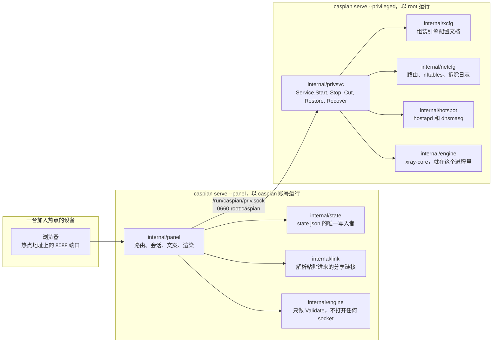
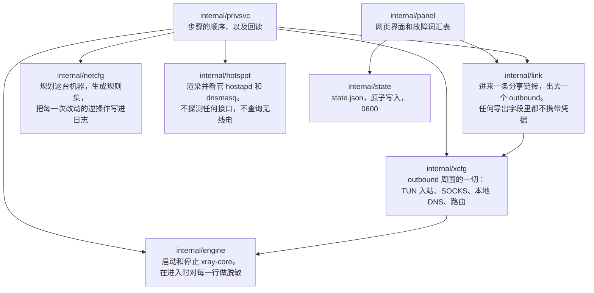
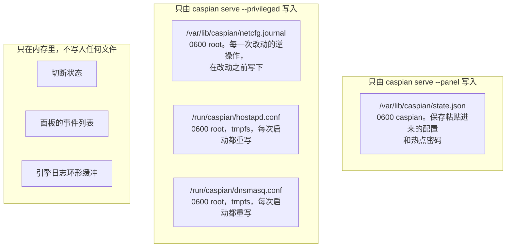
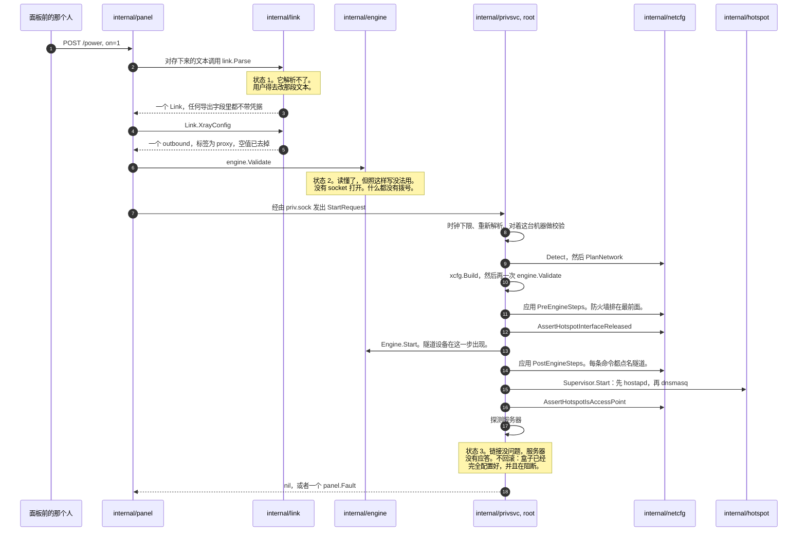
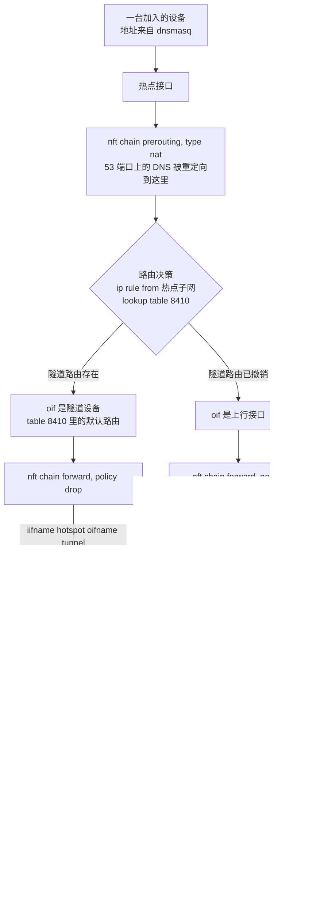
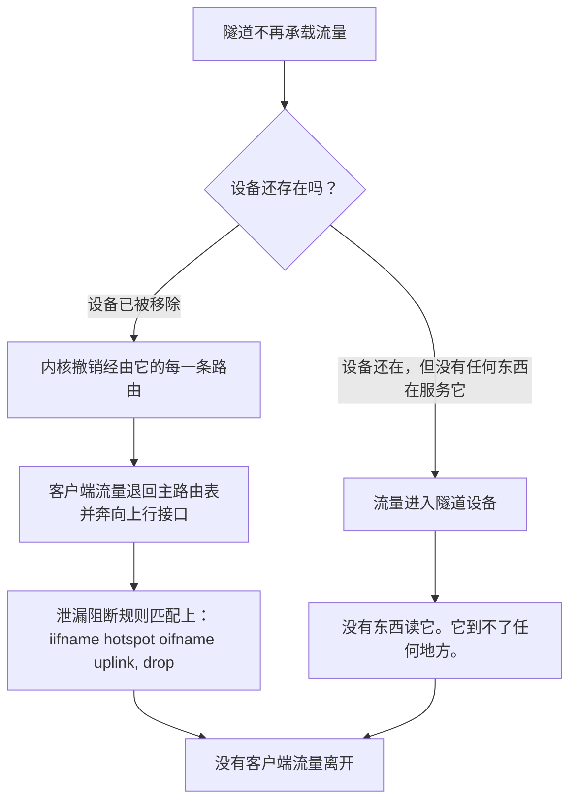
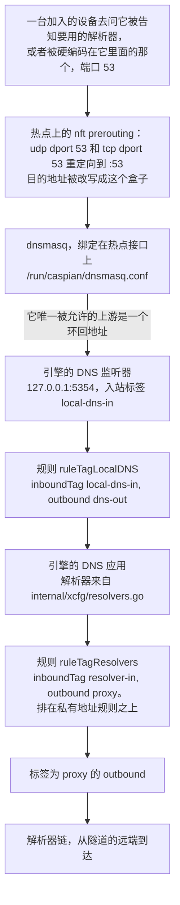
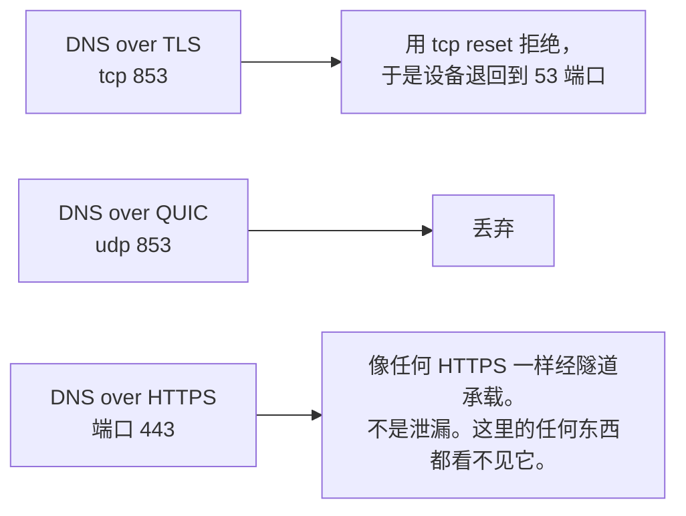
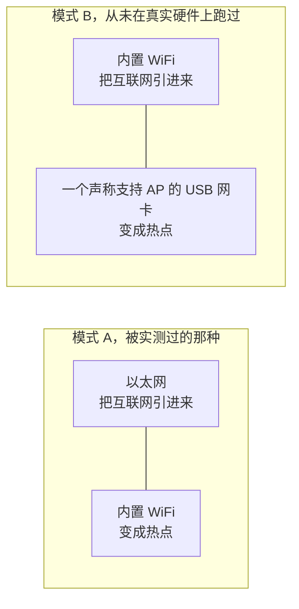
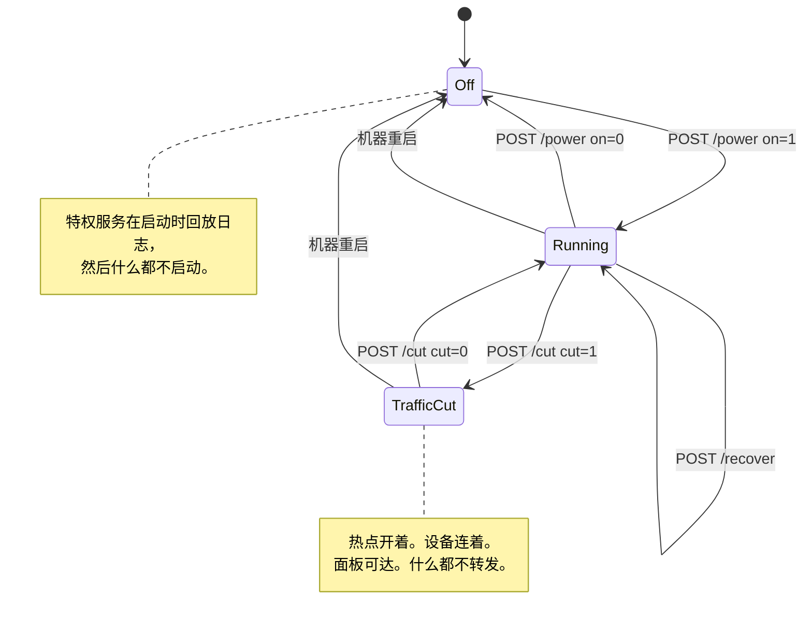

# Caspian-BYOC

[English](README.md) | [فارسی](README.fa.md) | [Русский](README.ru.md) | [中文](README.zh.md)

Caspian-BYOC 把运行 Windows 或 macOS 的电脑、Raspberry Pi 或 Linux 电脑变成一个
「自带配置」的 WiFi 网关。把 V2Ray 或 Xray 兼容的代理配置粘贴到网页面板，然后按一下
开关。Caspian 支持 VLESS、VMess、Shadowsocks、SOCKS、Trojan 和 Hysteria2 分享链接，
也支持 Clash 和 Clash.Meta YAML、原始 Xray JSON、链接列表以及 base64 订阅数据。
Caspian 通过 Xray-core 建立连接，并将隧道共享为 WiFi 热点，因此加入热点的每台设备
无需安装应用即可受到保护。

上面这张图是一台正在运行的盒子的真实截图，2026-09-03 拍摄自一台 Raspberry Pi 5，
当时隧道已经建立，尚未有设备加入。图中显示的是英文版面板，因为目前没有中文版的截图。网络
密码、配置名称和其中的服务器地址都做了替换，加入用的二维码被打了码，因为那个码里
编码了网络名称和它的密码。除此之外没有任何改动。

面板以波斯语为主、英语为辅。没有账号，没有遥测，面板也不从互联网上取任何东西。

## 安装与指南

[下载](https://github.com/Iman/caspian/releases/latest) | [Caspian Wiki](https://github.com/Iman/caspian/wiki/Home.zh)

| 主题 | English | فارسی | Русский | 中文 |
|---|---|---|---|---|
| 开始使用 | [English](https://github.com/Iman/caspian/wiki/Getting-Started) | [فارسی](https://github.com/Iman/caspian/wiki/Getting-Started.fa) | [Русский](https://github.com/Iman/caspian/wiki/Getting-Started.ru) | [中文](https://github.com/Iman/caspian/wiki/Getting-Started.zh) |
| 安装 | [English](https://github.com/Iman/caspian/wiki/Installation) | [فارسی](https://github.com/Iman/caspian/wiki/Installation.fa) | [Русский](https://github.com/Iman/caspian/wiki/Installation.ru) | [中文](https://github.com/Iman/caspian/wiki/Installation.zh) |
| 在 Linux 和 Raspberry Pi 上安装 | [English](https://github.com/Iman/caspian/wiki/Install-Linux) | [فارسی](https://github.com/Iman/caspian/wiki/Install-Linux.fa) | [Русский](https://github.com/Iman/caspian/wiki/Install-Linux.ru) | [中文](https://github.com/Iman/caspian/wiki/Install-Linux.zh) |
| 在 macOS 上安装 | [English](https://github.com/Iman/caspian/wiki/Install-macOS) | [فارسی](https://github.com/Iman/caspian/wiki/Install-macOS.fa) | [Русский](https://github.com/Iman/caspian/wiki/Install-macOS.ru) | [中文](https://github.com/Iman/caspian/wiki/Install-macOS.zh) |
| 在 Windows 上安装 | [English](https://github.com/Iman/caspian/wiki/Install-Windows) | [فارسی](https://github.com/Iman/caspian/wiki/Install-Windows.fa) | [Русский](https://github.com/Iman/caspian/wiki/Install-Windows.ru) | [中文](https://github.com/Iman/caspian/wiki/Install-Windows.zh) |
| 协议与传输 | [English](https://github.com/Iman/caspian/wiki/Protocols-and-Transports) | [فارسی](https://github.com/Iman/caspian/wiki/Protocols-and-Transports.fa) | [Русский](https://github.com/Iman/caspian/wiki/Protocols-and-Transports.ru) | [中文](https://github.com/Iman/caspian/wiki/Protocols-and-Transports.zh) |
| 架构与数据流 | [English](https://github.com/Iman/caspian/wiki/Architecture) | [فارسی](https://github.com/Iman/caspian/wiki/Architecture.fa) | [Русский](https://github.com/Iman/caspian/wiki/Architecture.ru) | [中文](https://github.com/Iman/caspian/wiki/Architecture.zh) |
| 面板与配置 | [English](https://github.com/Iman/caspian/wiki/Panel-and-Configuration) | [فارسی](https://github.com/Iman/caspian/wiki/Panel-and-Configuration.fa) | [Русский](https://github.com/Iman/caspian/wiki/Panel-and-Configuration.ru) | [中文](https://github.com/Iman/caspian/wiki/Panel-and-Configuration.zh) |
| 安全与隐私 | [English](https://github.com/Iman/caspian/wiki/Security-and-Privacy) | [فارسی](https://github.com/Iman/caspian/wiki/Security-and-Privacy.fa) | [Русский](https://github.com/Iman/caspian/wiki/Security-and-Privacy.ru) | [中文](https://github.com/Iman/caspian/wiki/Security-and-Privacy.zh) |
| 开发与测试 | [English](https://github.com/Iman/caspian/wiki/Development-and-Testing) | [فارسی](https://github.com/Iman/caspian/wiki/Development-and-Testing.fa) | [Русский](https://github.com/Iman/caspian/wiki/Development-and-Testing.ru) | [中文](https://github.com/Iman/caspian/wiki/Development-and-Testing.zh) |
| 故障排查与已知缺陷 | [English](https://github.com/Iman/caspian/wiki/Troubleshooting) | [فارسی](https://github.com/Iman/caspian/wiki/Troubleshooting.fa) | [Русский](https://github.com/Iman/caspian/wiki/Troubleshooting.ru) | [中文](https://github.com/Iman/caspian/wiki/Troubleshooting.zh) |
| 发布与维护 | [English](https://github.com/Iman/caspian/wiki/Releases-and-Maintenance) | [فارسی](https://github.com/Iman/caspian/wiki/Releases-and-Maintenance.fa) | [Русский](https://github.com/Iman/caspian/wiki/Releases-and-Maintenance.ru) | [中文](https://github.com/Iman/caspian/wiki/Releases-and-Maintenance.zh) |
| 许可证与致谢 | [English](https://github.com/Iman/caspian/wiki/Licence-and-Credits) | [فارسی](https://github.com/Iman/caspian/wiki/Licence-and-Credits.fa) | [Русский](https://github.com/Iman/caspian/wiki/Licence-and-Credits.ru) | [中文](https://github.com/Iman/caspian/wiki/Licence-and-Credits.zh) |
| 文档索引 | [English](https://github.com/Iman/caspian/wiki/Documentation-Map) | [فارسی](https://github.com/Iman/caspian/wiki/Documentation-Map.fa) | [Русский](https://github.com/Iman/caspian/wiki/Documentation-Map.ru) | [中文](https://github.com/Iman/caspian/wiki/Documentation-Map.zh) |
| 翻译 | [English](https://github.com/Iman/caspian/wiki/Translations) | [فارسی](https://github.com/Iman/caspian/wiki/Translations.fa) | [Русский](https://github.com/Iman/caspian/wiki/Translations.ru) | [中文](https://github.com/Iman/caspian/wiki/Translations.zh) |
| 页面模板 | [English](https://github.com/Iman/caspian/wiki/Page-Template) | [فارسی](https://github.com/Iman/caspian/wiki/Page-Template.fa) | [Русский](https://github.com/Iman/caspian/wiki/Page-Template.ru) | [中文](https://github.com/Iman/caspian/wiki/Page-Template.zh) |

## 已记录的实验

> 本指南从现有 README 迁移而来。测量结果保留原有日期；此次文档迁移不代表重新运行了测试。
> [English](https://github.com/Iman/caspian/blob/108567a6a529be05b577ee68b65b48790f07e43d/README.md) | [فارسی](https://github.com/Iman/caspian/blob/108567a6a529be05b577ee68b65b48790f07e43d/README.fa.md) | [Русский](https://github.com/Iman/caspian/blob/108567a6a529be05b577ee68b65b48790f07e43d/README.ru.md) | [中文](https://github.com/Iman/caspian/blob/108567a6a529be05b577ee68b65b48790f07e43d/README.zh.md)

### 什么真的通过一个真实服务端搬运过字节

由 `test/tunnel` 提供。解析器接受的每一种协议，都被端到端驱动去打一个真实的 xray-core
实例，该实例由本模块自己的依赖构建，并通过 `internal/engine` 用的同一个加载器加载。
客户端这一侧就是产品路径本身，没有改动：先 `link.Parse`，然后 `xcfg.Build`，然后
`engine.Engine.Start`。没有任何配置是手写的。

| 协议 | 传输 | 安全层 | 能送出一个 HTTP 请求 |
|---|---|---|---|
| VLESS | tcp (raw) | none | 是 |
| VMess | tcp (raw) | none | 是 |
| Shadowsocks，aes-256-gcm | tcp (raw) | none | 是 |
| SOCKS | tcp (raw) | none | 是 |
| Trojan | tcp (raw) | TLS，按摘要固定 | 是 |
| Hysteria2，以及 `hy2` 别名 | QUIC | TLS，按摘要固定 | 是 |

有四道控制措施能拦下一个绕过了隧道的请求，而且这四道都是真的在跑，不是在文字里断言。
客户端从不被告知源站在哪里，它拿到的是一个 `.invalid` 名字和一个诱饵的端口。那个名字
是解析不出来的，如果机器上有解析器居然应答了它，测试套件会大声说出来。源站检查的是
请求被寄往哪里，而不只是它到了。诱饵会数自己被打中了几次，一个走隧道的请求必须一次
都不加上去。`TestEveryCarriageProofCanFail` 和
`TestTheProofRejectsARequestThatDidNotGoThroughTheTunnel` 才是让这些控制措施成为证据
而不是意图的东西。

每一行都要读得窄一点。除 Hysteria2 外，每一行都跑在裸 TCP 上。没有一行驱动 REALITY，
因为它的服务端需要一个真实的握手目标。Shadowsocks 只有 aes-256-gcm，因为 2022 系列的
加密套件走的是另一条代码路径。每一行送的都是一个 TCP 请求，UDP associate 是关的。
一切都在环回地址上，所以没有抓到出口 IP，也不可能抓到。

`TestEveryProtocolTheParserAcceptsIsDrivenEndToEnd` 会从 `internal/link` 的源码里读出
那份被接受的协议名单，所以不可能加进第八种协议却不在这里加上一行。

### 什么在硬件上真的被证明过

下面这张表是真实流量走过、并且抓到了出口 IP 的那些。它不是解析器接受什么，也不是环回
测试套件搬运了什么。

| 协议 | 传输 | 安全层 | 端到端证明过 |
|---|---|---|---|
| VLESS | tcp (raw) | REALITY | 是，在三台不同的服务器上 |
| VLESS | ws (WebSocket) | none，外加 VLESS Encryption | 是 |
| VLESS | ws (WebSocket) | TLS | 是，经由一个 CDN |
| VLESS | httpupgrade | TLS | 是，经由一个 CDN |
| VLESS | xhttp | TLS | 是 |
| VMess、Trojan、Shadowsocks、SOCKS、Hysteria2 | 任意 | 任意 | 否 |

上面每一项，都是靠在一台连着热点的真手机上驱动一个真浏览器来证明的。出口地址由两个
彼此独立的来源抓到，并和配置里点名的那台服务器对上。用了三台不同的服务器，每一台
返回的地址都不同，所以一次重复的或缓存的读数不会被误当成隧道在工作。

一行没有被证明，不等于说它是坏的。它说的是还没有人看着一个数据包从远端出来，这是另一
回事，而且这是本项目唯一当作证据的东西。每一种传输产出的引擎配置文档**确实**被钉成了
黄金文件，所以组装方式一变就会显示成一处差异。那证明的是文档是稳定的，对这个传输能不能
连上则什么都没说。

## 实际验证过什么

### Go 测试套件，本仓库，2026-08-31 实测

在提交 `5b0a8a7`、工作区干净的情况下，在 go1.27.0 darwin/arm64 上：

    go build ./...                 exit 0
    go test -count=1 -v ./...      exit 0

那次运行执行了包含子测试在内的 1577 个测试：1572 个通过，5 个跳过，0 个失败。十五个包报告
了 `ok`。有两个包没有测试文件：`bdd/harness` 和 `local/devpanel`。那 5 个跳过都说明了它们没有
在证明什么：TUN 设备的生命周期，它只在 linux 上、并且需要 root 和 `/dev/net/tun`；三项需要装了
dnsmasq 才能做的 dnsmasq 配置检查；以及一个需要显式开启的二维码 PNG 导出。

上一次记录的运行是在 2026-08-30、提交 `dd15ad6` 上，执行了包含子测试在内的 1323 个测试：
1319 个通过，4 个跳过，0 个失败，十二个包报告 `ok`。

`-count=1` 不是可选项。它绕开结果缓存。没有它，第二次运行会把第一次运行的 PASS 行打印出来
并以 0 退出，实际上什么都没执行。

完整的门禁是 [`scripts/gate.sh`](https://github.com/Iman/caspian/blob/main/scripts/gate.sh)：gofmt、`go vet`、带竞态检测器的完整测试套件，以及每个包的
覆盖率下限。在把它接到任何管道之前，先读它的头部注释。shell 管道返回的是最后一条命令的状态，
而这个陷阱在本项目里已经造成过一次假绿灯。

[`packaging/test-install.sh`](https://github.com/Iman/caspian/blob/main/packaging/test-install.sh) 在任何有 bash 的机器上覆盖那两个 shell 脚本，包括一台根本装不上
的机器。

### 行为测试套件

[`docs/BEHAVIOUR.md`](https://github.com/Iman/caspian/blob/main/docs/BEHAVIOUR.md) 列出 24 个场景。2026-08-31 那次运行执行了全部 24 个，而
`TestEveryScenarioCanFail` 执行了 24 个与之匹配的注入缺陷，所以每一个场景都被看着为它声称能
检测的那件具体的事变红过。如果文档和测试套件出现分歧，无论朝哪个方向，
`TestBehaviourDocumentListsEveryScenario` 都会失败。要跑其中一个：

    go test ./test/bdd/ -run 'TestBehaviour/the_firewall'

### 搬运测试套件

`test/tunnel` 驱动解析器接受的七种协议中的每一种，去打一个跑在环回地址上的真实 xray-core
服务端。每一种都必须把一个 HTTP 请求送到一个只有隧道另一头才够得到的源站。每一行覆盖了什么、
没覆盖什么，见上面的「什么真的通过一个真实服务端搬运过字节」。在这个包存在之前，关于那七种
协议里的六种，能站得住的最强说法只是：引擎会加载它们产出的那份文档。

### 在目标硬件上

[`internal/netcfg/testdata/PROVENANCE.md`](https://github.com/Iman/caspian/blob/main/internal/netcfg/testdata/PROVENANCE.md) 就是那份记录，而且它对「什么是采集来的、什么是写出
来的」这个区别很小心。文件名带着类别：`capture-pi5-` 是 Pi 上一条真实命令的字节输出，
`scenario-` 是一台没有人实测过的机器，`golden-` 是本项目自己的输出。

在 Pi 上实测并记录在那里的有：全部五套各不相同的生成规则集都通过了 `nft -c -f` 的解析，每个
文件的 sha256 都是在 Pi 上回读的而不是在开发机上，并且 `nft list ruleset` 在之前和之后都是空
的。接口释放序列及其逆操作。驱动拒绝创建第二个 AP 接口，同时接受在已有接口上做类型变更。断网
开关的那几次主动挑衅测试，以及它们的阴性对照。还有那次导致 input 策略被撤回的输入策略锁死
事件。

那份文件还记录了把写出来的字节换成实测字节之后，暴露出了哪些原本没被发现的问题，这正是把两类
数据都留着的理由。有好几个缺陷在此前每一次运行里都是绿的，其中包括一套没有任何内核会加载的
防火墙规则集，以及一次会在一台原本开着反向路径过滤的机器上把它关掉的拆除操作。

### 端到端，用一台真手机

测试装置是 [`test/hardware/caspian-hw`](https://github.com/Iman/caspian/blob/main/test/hardware/caspian-hw)，操作手册是 [`docs/HARDWARE-TEST.md`](https://github.com/Iman/caspian/blob/main/docs/HARDWARE-TEST.md)。它的标准就是本项目
自己的标准。连上不等于结果，一个传输只有在真实流量穿过它、并且出口 IP 被抓到并和配置点名的
那台服务器对上时，才算被证明。一个等于未走隧道基线的出口 IP 是泄漏，而且在一次运行里它压倒
一切。一台在采集过程中改变了网络状态的手机，会让这次读数作废，既不算通过也不算泄漏。

一次记录于 2026-08-30 的运行 `run-20260830T144015Z`，在 IPv4 上给出的评级是：

- 两份配置被证明，各自 `verdict PASS`，`sources agree`，两个彼此独立的来源都给出了出口 IP，
  并和配置点名的那台盒子对上。
- 切换配置时出口指纹随之改变。
- DNS 检查在 30 秒的窗口里，在上行链路上以明文形式发现那个每次运行随机生成的 `.invalid`
  标签零次。在那个窗口里确实有四个明文 DNS 数据包穿过了那条上行链路，它们是盒子自己的，而
  设计把这部分放在保证范围之外。这正是为什么这项检查要找的是一个网络上别的东西不可能产生的
  标签，而不是去数 53 端口的数据包，后者分不清一个逃出去的客户端查询和盒子自己的查询。
- 失败即断开：在引擎停止、并用飞行模式把手机的蜂窝网络去掉之后，两个来源都够不到互联网，
  而面板仍然通过热点应答。所以这是防火墙在拒绝流量，而不是一条死掉的链路。这一步此前有两次
  尝试被评为 VOID 并重做，而不是被拿去报告。

关于那份记录有两点。它是在最后一步的第三次尝试上才通过的，而那两次作废的读数留在了台账里，
没有被删掉。还有，那次运行的产物存放在 `local/` 下，而该目录在 gitignore 里，所以它们**不在
这个仓库里**。如果您克隆了本仓库，您没法核查那次运行。您只能自己重新跑一遍测试装置。

之所以用两个来源，是因为单个来源可能被缓存或过期，而且两个都固定成 IP 地址而不是域名。
[`docs/HARDWARE-TEST.md`](https://github.com/Iman/caspian/blob/main/docs/HARDWARE-TEST.md) 用它称为全文最重要的那一段解释了原因。那个局域网上的解析器会把 IP
回显服务打到黑洞里。所以，一台只改了 DNS 服务器、根本没有隧道任何流量的盒子，会显示出恰恰是
一个靠解析域名的测试装置所寻找的那种特征。它会被评为通过。

这个测试装置会把它写出的每一样东西里的配置、服务器地址、用户 id 和密钥都脱敏掉。它会重新读一
遍每一份产物来确认脱敏生效了，而且它有一次通扫，会把整次运行重新读一遍，看有没有什么漏过了
过滤器。任何抓包都不会离开 Pi。tcpdump 的输出在盒子上被压缩成两个整数，因为在那条上行链路上
抓包就是在录下维护者自己的浏览记录。

架构与网络图

## 许可证

AGPL-3.0-or-later. [LICENSE](LICENSE) | [NOTICE](NOTICE) | [English](https://github.com/Iman/caspian/wiki/Licence-and-Credits) | [فارسی](https://github.com/Iman/caspian/wiki/Licence-and-Credits.fa) | [Русский](https://github.com/Iman/caspian/wiki/Licence-and-Credits.ru) | [中文](https://github.com/Iman/caspian/wiki/Licence-and-Credits.zh)
