# Caspian-BYOC

[🇮🇷 فارسی](README.fa.md) | [🇬🇧 English](README.md) | [🇷🇺 Русский](README.ru.md) | 🇨🇳 **中文**

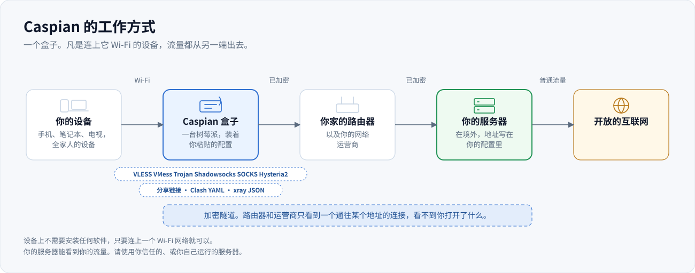

> ### [English: the full guide in English](README.md)
>
> 本页是 `README.md` 的简体中文翻译。英文的 `README.md` 是权威版本，也是测试实际
> 检查的对象。如果两份文档有出入，以英文那份为准。
>
> **[Read this in English](README.md)**

Caspian-BYOC 把运行 Windows 11 或 macOS 的电脑、Raspberry Pi 或 Linux 电脑变成一个
「自带配置」的 WiFi 网关。把 V2Ray 或 Xray 兼容的代理配置粘贴到网页面板，然后按一下
开关。Caspian 支持 VLESS、VMess、Shadowsocks、SOCKS、Trojan 和 Hysteria2 分享链接，
也支持 Clash 和 Clash.Meta YAML、原始 Xray JSON、链接列表以及 base64 订阅数据。
Caspian 通过 Xray-core 建立连接，并将隧道共享为 WiFi 热点，因此加入热点的每台设备
无需安装应用即可受到保护。

上面这张图是一台正在运行的盒子的真实截图，2026-09-03 拍摄自一台 Raspberry Pi 5，
当时隧道已经建立，尚未有设备加入。图中显示的是英文版面板，因为目前没有中文版的截图。网络
密码、配置名称和其中的服务器地址都做了替换，加入用的二维码被打了码，因为那个码里
编码了网络名称和它的密码。除此之外没有任何改动。

面板以波斯语为主、英语为辅。没有账号，没有遥测，面板也不从互联网上取任何东西。

本文说明这个仓库里的代码做什么、保证什么、不保证什么。下面每一项能力都点名了它所
依据的代码、测试或已记录的实测结果。当一项主张依据的是某个测试时，本文写的是测试的
名字而不是行号，因为名字能在重构中活下来。

---

## 您可以粘贴什么，什么会被拒绝

配置由您自己带来。下面这些是盒子接受的内容，取自真正负责接受的那段代码，而不是一份
愿望清单。每一行都是对着 `internal/link` 和固定版本的引擎实测出来的。

| | 可以用 | 会被拒绝 |
|---|---|---|
| 分享链接 | `vless://` `vmess://` `ss://` `socks://` `trojan://` `hysteria2://` `hy2://` | `tuic://` `ssr://` `wireguard://` `anytls://` `naive+https://` `hysteria://`（第 1 版） |
| 粘贴的文档 | Clash 和 Clash.Meta 的 YAML、原始的 xray JSON、每行一条的链接列表、base64 订阅数据块 | 订阅 URL、被 base64 包起来的 Clash 文档、JSON 数组、首行是注释的文本 |
| 传输方式 | `raw`（也写作 `tcp`）、`ws`、`grpc`、`httpupgrade`、`xhttp`（也写作 `splithttp`）、`kcp` 和 `mkcp` | `h2`、`h3`、`http`、`quic`、`gun` |
| 安全层 | `none`、`tls`、`reality` | `xtls`（旧的那种）、`allowInsecure` |
| VLESS 的 flow | `xtls-rprx-vision`、`xtls-rprx-vision-udp443`，或者不填 | 其他任何取值 |

`h2` 和 `h3` 在那个「会被拒绝」的列里是**传输的名字**。HTTP/2 和 HTTP/3 本身是被承载
的：`type=xhttp` 配上 `security=tls`，由 TLS 的 ALPN 决定是哪一个。见
[HTTP/2 与 HTTP/3 是被承载的，只是换了个名字](#http2-与-http3-是被承载的只是换了个名字)。

有六件事经常让人意外，所以写在正文里而不是脚注里：

只有第一条链接会被使用。粘贴四十个服务器，配置好的是一个；面板会告诉您它找到了
几条。`ss://` 和 `socks://` 需要用户信息的 base64 形式，纯 `method:password@host`
的写法会被拒绝。REALITY 只在 `raw`、`xhttp` 和 `grpc` 上可用，所以把它和 WebSocket
搭在一起，会在粘贴的那一刻就被引擎拒绝，而不是等到后面才失败。这里的 `security=`
必须小写，尽管引擎本身并不在意，大写的 `TLS` 会被报告成 `none`。`ss://` 链接上的
`plugin=` 参数会被忽略，而且不会告诉您。订阅 URL 会被拒绝，因为面板不从互联网上取
任何东西，这是刻意的性质，不是缺失的功能。

完整的情况，包括其中哪些真正搬运过字节、哪些在硬件上端到端证明过并抓到了出口地址，
在[协议与传输](#协议与传输)一节。这是三种不同的主张，本项目不允许它们混为一谈。

---

## 安装

请先选择您的操作系统。macOS 使用图形化 DMG；Linux 和 Raspberry Pi 可以自动安装，
也可以先检查或自己构建。

### macOS 13 或更高版本

macOS 磁盘映像包含原生的 **Caspian Control** 应用和 Caspian 引擎。无需 Terminal、
Go、Homebrew 或其他运行时。您需要管理员账户；当内置 Wi-Fi 用作热点时，Mac 还需要
通过有线 Ethernet 接入互联网。

#### 选择正确的下载文件

- Intel Mac 使用 `Caspian-v0.2.4-macos-amd64.dmg`。
- Apple Silicon Mac（M1 或更新型号）使用
  `Caspian-v0.2.4-macos-arm64.dmg`。

如果不确定处理器类型，请打开 **Apple 菜单 → 关于本机**。

#### 安装并批准首次打开

v0.2.4 应用带有 ad-hoc 签名，但尚未使用 Apple Developer ID 签名，也未经过 Apple
公证。因此 Gatekeeper 会显示 **“Caspian” Not Opened**，并提示 Apple 无法验证它是否
不含恶意软件。这不是应用崩溃。只有当文件来自 Caspian 官方发布页时才应绕过此警告。

1. 打开 [Caspian 最新发布](https://github.com/Iman/caspian/releases/latest)，展开
   **Assets**。
2. 下载适合 Mac 处理器的 DMG，并将它打开。
3. 将 `Caspian.app` 拖入 **Applications（应用程序）**文件夹。
4. 尝试打开 **Applications** 中的副本一次。
5. Gatekeeper 阻止它时，点击 **Done**。
6. 打开 **Apple 菜单 → System Settings → Privacy & Security**。
7. 向下滚动到 **Security**，在 Caspian 旁点击 **Open Anyway**。首次打开被阻止后，
   这个按钮大约只显示一小时。
8. 输入 Mac 登录密码，点击 **OK**，然后确认 **Open**。

macOS 会把这个应用保存为例外，以后可以正常双击打开。Apple 的官方说明见
[通过覆盖安全设置打开应用](https://support.apple.com/guide/mac-help/apple-cant-check-app-for-malicious-software-mchleab3a043/26/mac/26)。

#### 安装 Caspian 并保存密码

1. 在 **Caspian Control** 中点击 **Install / Update**。
2. 在 macOS 授权窗口中输入管理员密码。
3. 等待控制窗口显示 **Action completed**。
4. 首次安装时，保存输出中显示的 **first-run panel password**。
   **Copy panel password** 只会复制这个密码。
5. 点击 **Open panel**，使用保存的面板密码登录。
6. 输入 Wi-Fi 名称和密码，粘贴代理配置，然后使用面板开关启动 Caspian。

Mac 登录密码、Caspian 面板密码和 Wi-Fi 密码是三个不同的密码。如果面板密码丢失，
请在 Caspian Control 中使用 **Reset password**；这需要管理员授权，但会保留代理配置
和热点设置。关闭控制窗口后，应用仍留在 macOS 顶部菜单栏；从那里选择
**Open Caspian Control** 即可重新打开窗口。

### Linux 和 Raspberry Pi

#### 自动：一行命令

    sudo /bin/bash -c "$(curl -fsSL https://raw.githubusercontent.com/Iman/caspian/main/install.sh)"

安装脚本会判断自己在什么机器上，从最新的发布里下载对应的二进制文件，如果下载的内容
和已公布的校验和不符就拒绝继续。

| `uname -m` | 构建产物 | 典型机器 |
|---|---|---|
| `x86_64` | `caspian-linux-amd64` | 一台笔记本或迷你主机 |
| `aarch64` | `caspian-linux-arm64` | 64 位系统上的 Raspberry Pi 3、4、5 |
| `armv7l` | `caspian-linux-arm` | 32 位系统上的 Raspberry Pi 2 和 3 |
| `armv6l` | `caspian-linux-arm` | Raspberry Pi 1、Zero、Zero W |

当它不能确定时，它拒绝，而不是猜。不是 Linux、架构不在那张表里、没有 systemd、
校验和对不上：每一种情况都是一次拒绝，并说清楚它发现了什么。`armv8l`，也就是 64 位
内核上的 32 位用户态，是刻意不做映射的，因为在那里靠猜，正是从前某个项目把 ARMv7
代码发到 ARMv6 机器上、让它们第一次运行就死于非法指令的原因。

在把脚本喂给 shell 之前先读一遍。对这一类软件来说，这句话不是客套，脚本本身也是照着
「要被人读」来写的。

    curl -fsSL https://raw.githubusercontent.com/Iman/caspian/main/install.sh | less

如果想固定某个版本而不是取最新版：

    sudo env CASPIAN_VERSION=v0.2.5 /bin/bash -c "$(curl -fsSL https://raw.githubusercontent.com/Iman/caspian/main/install.sh)"

#### 自己验证下载的文件

每次发布都带一个 `SHA256SUMS` 文件。安装脚本会替您核对，您也可以自己独立核对：

    curl -fsSLO https://github.com/Iman/caspian/releases/latest/download/caspian-linux-arm64
    curl -fsSLO https://github.com/Iman/caspian/releases/latest/download/SHA256SUMS
    sha256sum -c SHA256SUMS --ignore-missing

这能证明什么，不能证明什么：它证明您手上的文件就是那次发布公布的文件。它不能证明那次
发布是谁构建的。这些二进制文件由 GitHub Actions 从一个打了标签的提交构建，构建它们的
工作流就在本仓库的 `.github/workflows/release.yml` 里，所以构建过程是可读的，尽管它
并不是可独立复现的。

#### 手动：自己构建

自动那条路一点也不是必须的。从源码构建需要 Go 1.26 或更高版本，得到的二进制在功能上
完全一样。

    git clone https://github.com/Iman/caspian.git
    cd caspian
    go build -trimpath -o caspian ./cmd/caspian
    sudo CASPIAN_LOCAL_BINARY="$PWD/caspian" bash install.sh

`CASPIAN_LOCAL_BINARY` 告诉安装脚本使用您刚构建出来的文件，而不是去下载一个。安装
脚本做的其他事情，创建服务账号、目录、systemd 单元以及它们的权限，都照旧进行。

在另一台机器上为 Pi 做交叉编译：

    GOOS=linux GOARCH=arm64 go build -trimpath -o caspian-linux-arm64 ./cmd/caspian
    GOOS=linux GOARCH=arm GOARM=6 go build -trimpath -o caspian-linux-arm ./cmd/caspian

32 位构建上的 `GOARM=6` 不是可选项。`armv6l` 和 `armv7l` 两种机器装的是同一个 `arm`
产物，所以一个按 ARMv7 构建的版本会让每一台装上它的 Pi 1、Zero 和 Zero W 都用不了。
发布工作流用 `readelf` 检查这一点，宁可失败也不发布一个谎报自己架构的产物。

在信任一个构建之前，先跑一遍门禁：

    bash scripts/gate.sh

它会跑格式检查、vet、带竞态检测器的完整测试套件、每个包的覆盖率下限、黄金回归层、
一次隐私扫描，以及一部分冒烟测试。失败时它以非零状态退出。不要把它接到管道里：shell
管道报告的是最后一条命令的状态，所以把它接给 `tail` 会把您要问的答案扔掉。

---

## 两类读者，两条阅读路线

如果您在决定**要不要运行它**，请读「它是做什么用的」「它需要什么」和「运行它」。

如果您在决定**要不要信任它**，请依次读「它保证什么」「它不保证什么」「实际验证过
什么」，然后读 `docs/DEFECTS.md`。后两项才是要紧的。一项您无法核查的安全主张，对一个
会因为它出错而承担后果的人来说，一文不值。

`FAQ.md` 回答的是人们在实践中真正撞上的问题，每个答案都点名它出自哪个文件或哪个
故障码。

---

## 它是做什么用的

目标用户是这样一个人：他从信得过的人那里拿到了一份能用的配置，只希望房间里的设备能
上网。他不会开终端、不会看日志、不会编辑文件。装好之后，所有操作都在面板里完成。见
`docs/2026-08-29-design.md` 的 5.1 和 5.2 节。

引擎是 xray-core v26.4.15 (Go module version `v1.260327.1-0.20260415235634-c5edc122b70e`)，编译进二进制而不是下载下来的。分享链接的解析器是
XTLS/libXray 里 MIT 许可的 `share` 包，以 v26.3.27 标签内置在
`third_party/libxray-share/` 下，并在旁边保留了它自己的许可证。

`internal/link/link.go` 里的 `supportedSchemes` 接受七种协议：`vless`（包括
REALITY），加上 `vmess`、`trojan`、`ss`、`socks`、`hysteria2` 和 `hy2`。其余的，包括
`tuic`、`ssr`、`wireguard` 和 `anytls`，都会被点名拒绝。

---

## 架构

### 两个进程，一个二进制

一个二进制文件以两种角色运行，由子命令选择。这样切分，是为了让解析用户输入并提供
HTTP 服务的那一部分出的故障，不会同时是持有 root 权限的那一部分的故障。
`docs/LAYOUT.md` 的「Two processes, one binary」一节是关于这件事的固定表述。

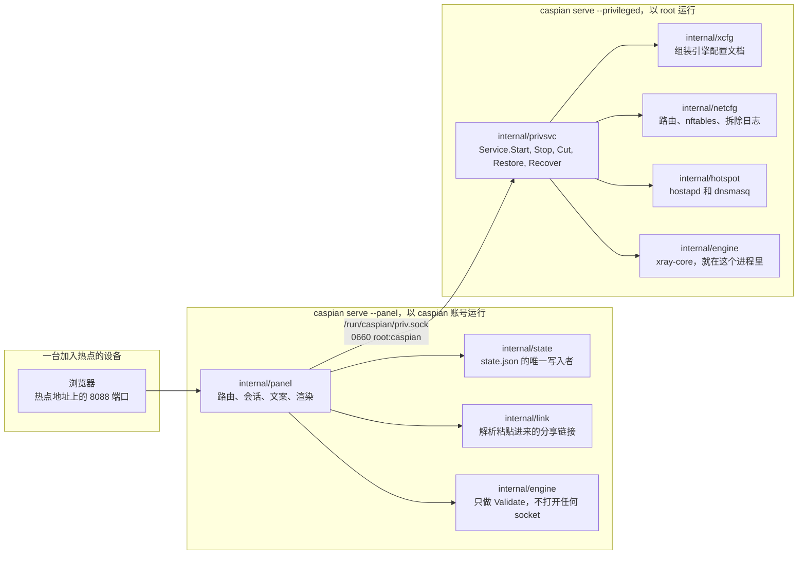

`cmd/caspian/main.go` 在自己的用法说明里就写出了这两个角色：

    caspian serve --privileged     root: routes, firewall, access point, engine
    caspian serve --panel          the caspian user: the web panel, nothing privileged

### 那个 socket，以及它的词汇表为什么是封闭的

`internal/panel/priv.go` 写下了整个权限切分之所以存在的那条规则："A privileged
helper that takes a path and an argument list from its client is not a boundary;
it is a way to run anything as root." 意思是：一个从客户端接收路径和参数列表的特权
助手不是一道边界；它是一条以 root 身份运行任何东西的途径。那个分号是他们自己写的。
这句话是原样引用的，因为把一条规则复述一遍，得到的就不是那条规则了。

所以面板根本没法表达「运行这个」。它只能点名八个动作中的一个，而每个动作是什么意思由
特权侧决定。`panel.Actions` 就是那个封闭集合，如果有人往接口里加了一个方法却没在这个
列表里给它一个名字，`TestActionVocabularyMatchesTheInterface` 就会失败。

| 动作 | 特权侧做什么 | 是否改动机器 |
|---|---|---|
| `detect` | 报告有哪些网络接口、无线电的能力上限，以及选定的子网 | 否 |
| `status` | 报告引擎所处的阶段、热点状态，以及流量是否被切断 | 否 |
| `start` | 把隧道和热点拉起来 | 是 |
| `stop` | 把它们停掉，并回放拆除日志 | 是 |
| `recover` | 停止、回放日志，然后用同一个请求重新启动 | 是 |
| `engine-log` | 返回引擎最近的日志行，已经做过脱敏 | 否 |
| `cut` | 丢弃转发的客户端流量，其余一切照常运行 | 是 |
| `restore` | 把转发的客户端流量放回去 | 是 |

一个请求，一个响应，一条连接。一条消息是 4 字节大端长度，后面跟着那么多字节的 JSON。
在分配或解析任何东西之前，长度会先和 `maxFrameBytes` 比对，所以一条超大的消息只要花
四个字节和一次拒绝。未知的 JSON 字段会被拒绝而不是被忽略。每个请求都会检查
`protocolVersion`。于是一个版本的面板去和另一个版本的特权服务对话，得到的是一次点名的
拒绝，而不是某个字段被悄悄解码成它的零值。

失败路径上除了一个词以外没有任何东西回传：要么是一个来自封闭集合的 `panel.Fault`，
要么是来自第二个封闭集合的 `privsvc.Refusal`。引擎自己的报错文本里嵌着用户的密钥
材料，所以它在特权侧被记录下来并丢弃。响应里根本没有可以让它搭车的字段。

### 哪个包归谁管

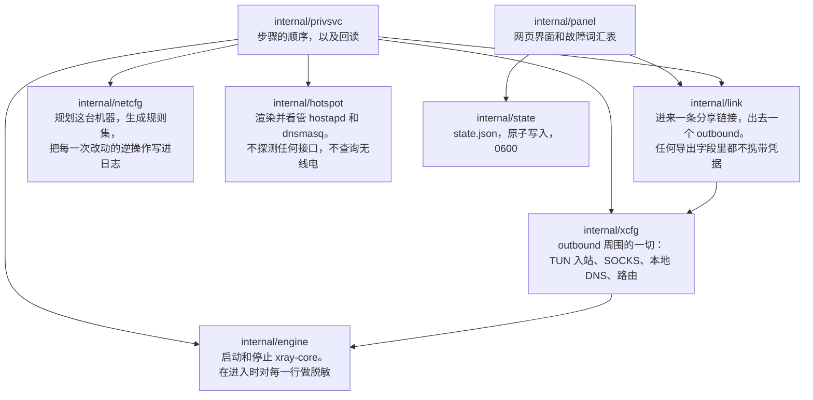

`internal/privsvc` 会用 `internal/link` 重新解析一遍 `StartRequest.ConfigJSON`，
而不是相信面板已经解析过了。它还会拿上网用的接口和这台机器自己的默认路由核对，拿热点
接口和这台机器自己的 `iw list` 输出核对，拿信道和无线电报告为可用的那些核对。

### 状态存在哪里，谁写它

两个写入者，两个文件，没有共享文件。两个进程都不写对方的文件，所以既不需要锁，也没有
需要防范的更新丢失。`docs/LAYOUT.md` 的「Who writes what」一节记录了这个决定，以及它
推翻的那份更早的草案。

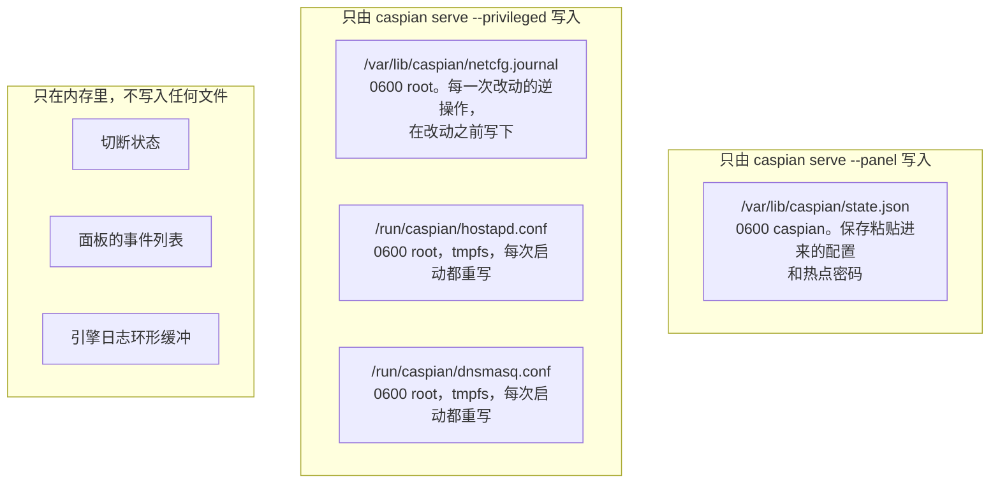

特权侧根本不读任何状态文件。它需要的一切都随启动请求一起送到。
`TestPrivsvcReadsNoStateFile` 会扫描那个包自己的源码，一旦它读了状态文件就失败，这是
一条注释做不到的事。

路径、权限位和属主的完整表格在 `docs/LAYOUT.md` 里。端口也固定在那里：客户端 DNS 在
热点上用 53，引擎的 DNS 监听器在环回地址上用 5354，面板用 8088，诊断用的 SOCKS 入站在
环回地址上用 10808。

---

## 数据是怎么流动的

### 一条粘贴的分享链接变成一条运行中的隧道

`internal/panel/handlers.go` 里的 `startNow` 记录了这个顺序，而正是这个顺序把三种
配置失败区分开来。在状态 1 和状态 2 都通过之前，机器上的任何东西都不会被碰。

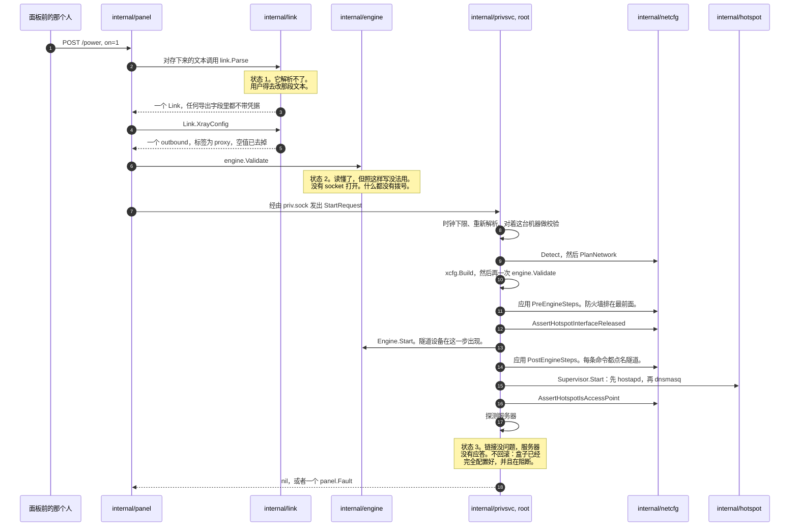

那个时序里有三个细节是承重的。

引擎配置文档被组装了两次，理由不同。`internal/link` 只产出 outbound，别的什么都不产。
`internal/xcfg` 产出它周围的一切：客户端流量到达的 TUN 入站、环回上的 SOCKS 入站、
本地 DNS 监听器、解析器策略，以及路由规则。这些没有一样是取自调用方送来的内容。

中途失败的启动会被完整撤销。日志里已经写着每一次改动的逆操作，而且是在改动到达内核
之前就写到磁盘上的。一次失败的启动会让机器保持它被发现时的样子。

一台不应答的服务器不等于一个只配置了一半的盒子。每一次改动都成功了，防火墙在生效，
转发的客户端流量被阻断，因为隧道什么都没在载。所以这里报告故障，什么都不拆。

### 一个客户端数据包走的网络路径

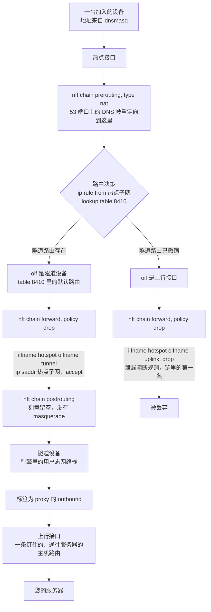

泄漏阻断规则只点名热点和上行接口。它不可能因为隧道没了就失效，因为它压根没提隧道。
每一条放行客户端流量的规则都点名了隧道设备，所以那些规则会不再匹配，然后策略把一切
丢弃。

每个接口都按名字匹配，从不按索引。索引是在规则集加载时解析的，所以一个按索引点名隧道
的规则集在隧道不在时根本加载不了，而那正是它必须生效的时候。

postrouting 链是刻意空着的。一条朝上行接口的 masquerade，就是那一行会悄悄把这个设备
变成一台普通路由器的规则。

### 隧道消失时那条路径会怎样

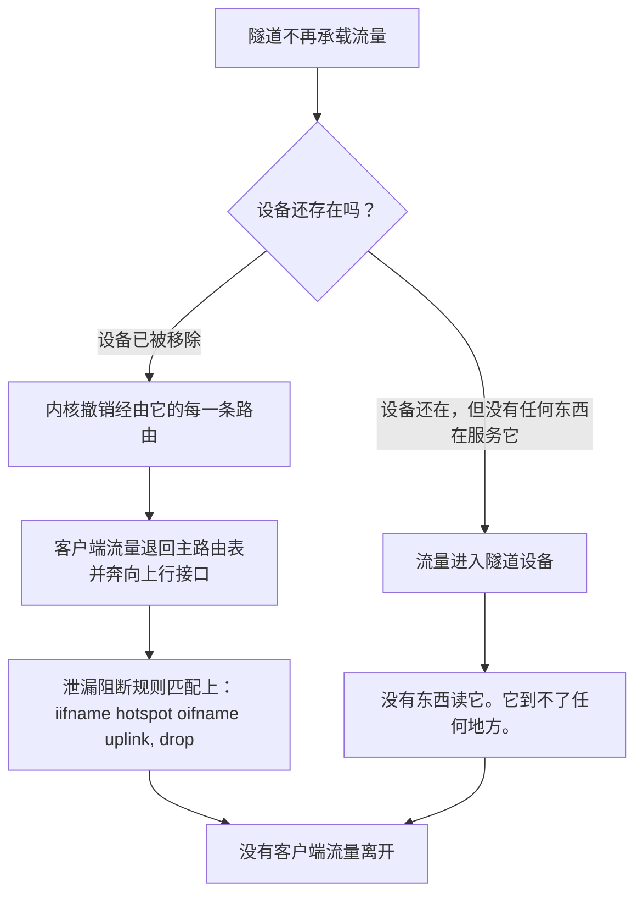

究竟走哪一支还没有定论。`internal/netcfg/testdata/PROVENANCE.md` 记录了 2026-08-30 在
目标机器上的一次观察：服务已经关闭，`xray0` 却仍出现在 NetworkManager 的设备列表里，
状态是 `connected (externally)`。这里没有查清原因，而且引擎并不是本项目的代码。两支
都不会泄漏，而且哪一支都不依赖于知道究竟发生的是哪一支。这正是那条阻断规则被写成只
点名热点和上行接口的原因。

### DNS 路径，它不是流量路径

这是人们最容易搞错的一部分。客户端的 DNS 查询不只是被放行。它是被截下来的。

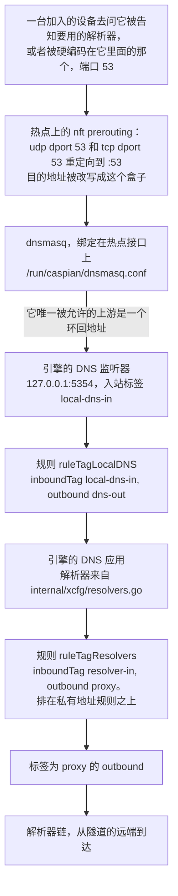

这条链有四个性质，每一个都写清了是什么在支撑它。

重定向改写的是目的地址，所以一台把解析器硬编码在自己身上的设备是在这里被应答的，而不是
被放出去找它被告知要用的那一个。场景：「a client cannot reach a resolver of its own
choosing」。

DHCP 应答只把这个盒子报为解析器，不报第二个。这值得单独一个场景，因为搞错了是看不出来
的：重定向反正会改写那些数据包，所以线路上不会有任何东西显得不对。场景：「the box
offers itself as the resolver and never names another」。

`internal/hotspot` 会拒绝任何不是环回地址的 dnsmasq 上游。一个非环回的目标意味着查询
会在隧道之外离开盒子，而且是每一台客户端问的每一个名字都如此。在那里作答的是引擎的
监听器，如果两边的端口发生漂移，`TestLocalDNSDefaultMatchesTheHotspotUpstream` 会失败。
`docs/LAYOUT.md` 把这一对称作「会安静地坏掉」的那一对：如果两者漂移了，每一台加入的
设备都会没法解析域名，而热点和隧道看上去都还健康。

把解析器自己的查询送进隧道的那条规则，排在把私有地址直连出去的那条规则之上。所以一个
位于私有地址上的解析器，仍然是经由隧道去到达，而不是在本地网络上。
`TestLocalDNSQueriesCannotFallOutToTheUplink` 和 `TestPrivateRangesRouteDirect` 各守
一半。

解析器链本身是分处三个司法辖区的三家运营商：Quad9 的过滤服务、Cloudflare 的 FAMILY
变体，以及 CleanBrowsing Security。`internal/xcfg/resolvers.go` 记录了为什么选每一个，
以及同一家运营商那个几乎一模一样、但被刻意不选的地址是哪一个。任何默认配置里都不出现
Google 的解析器，`TestNoGoogleAnywhereInGeneratedConfigs` 会扫描每一份生成的文档看有
没有。

其他端口都做了处理，其中有一个是处理不了的：

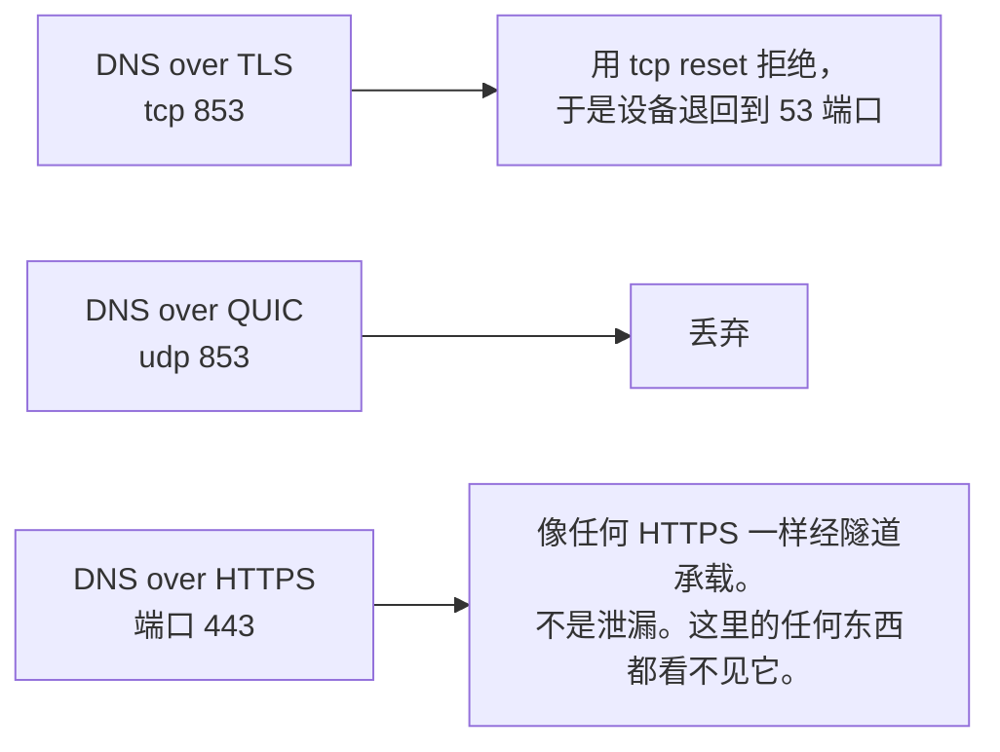

---

## 协议与传输

一条分享链接携带三样彼此独立的东西，把它们分开看会有帮助：代理协议、承载它的传输，
以及包在那个传输外面的加密层。一条走 WebSocket 加 TLS 的 VLESS 链接，和一条走纯 TCP
加 REALITY 的 VLESS 链接，是同一个协议用两条不同的路线到达同一类服务器。它们失败的
方式不一样。

代理协议就是上面列出的那七种。VLESS 是本文大多数例子用的那个，因为 REALITY 就是为它
造的。这台设备里没有任何东西是专门为它写的。解析器产出一份描述，`internal/xcfg` 围绕
它组装出一份引擎配置文档，盒子的其余部分并不知道自己在载的是哪个协议。

传输方式来自 xray-core，在内置的解析器里点了名：

- `tcp`，也写作 `raw`
- `ws`，即 WebSocket
- `httpupgrade`
- `xhttp`，也就是从前叫 SplitHTTP 的那个协议。两种拼法都能解析
- `grpc`
- `kcp` 和 `mkcp`，即 mKCP

`h2`、`http`、`h3` 和 `quic` 不在那份名单里。本项目固定的这个引擎版本把它们删掉了，
所以一条要求其中之一的链接会被拒绝而不是被承载，`internal/link` 里的
`TestRemovedTransportsAreRefusedWithASentence` 把这条拒绝钉住。

这条拒绝读起来有多清楚，取决于是从哪条路进来的。一份 Clash 文档点名其中之一，会得到
一句关于该传输的说明。同一个传输若出现在分享链接的 `type=` 参数里，得到的却是那句
笼统的「nothing in the pasted text was a proxy link this box understands」，它没说错，
但没什么用。`TestRemovedTransportInAURIIsReportedLessWell` 把这个差别钉住，好让它是一个
已知的缺口，而不是一个意外。

### HTTP/2 与 HTTP/3 是被承载的，只是换了个名字

`type=h2` 或 `type=quic` 被拒绝，并不意味着盒子说不了它们。意思是拼写换了地方。XHTTP 把这
两者都取代了，而且它是从 TLS 的 ALPN 而不是从传输的名字来选择自己的 HTTP 版本的：

| 您想要什么 | 该怎么写 |
|---|---|
| HTTP/3，也就是 QUIC | `type=xhttp`，加上 `security=tls`、`alpn=h3` 和 `mode=stream-one` |
| HTTP/2 | `type=xhttp`，加上 `security=tls`，以及任何不正好是 `h3` 的 ALPN |
| QUIC，不走 XHTTP | 一条 `hysteria2://` 链接，它底下就是 QUIC，并且需要 `alpn=h3` |

这些键会原封不动地到达引擎：`internal/xcfg` 把 outbound 当作不透明的 JSON 携带，从不解码
它，所以 `alpn`、`mode`、`xmux` 以及 QUIC 调优的那一块，会和您粘贴时一模一样地送达。

有四个细节决定您拿到的是 h3，还是不声不响地拿到了别的东西：

`alpn` 必须正好是一个值，而且那个值必须是 `h3`。写成 `alpn=h3,h2` 会让您拿到 HTTP/2，而且
没有任何警告，因为引擎把任何其他长度的列表都当成是在要第 2 版。只要 REALITY 在场，它就会
强制 HTTP/2，所以 REALITY 和 h3 是互斥的，把它们搭在一起得到的是 h2 而不是一个错误。`mode`
必须显式设置，因为默认值解析成 `packet-up`，而不是引擎点名作为 QUIC 替代品的 `stream-one`
那种形态。还有，用于上传下载分离的 `downloadSettings`，和 `mode: stream-one` 一起使用会被
拒绝；那种组合需要 `stream-up`。

有一处词汇上的冲突值得明说，因为它读起来像自相矛盾：`type=h3` 会被拒绝，而 `alpn=h3` 是
必需的。它们是两个不同的字段。前者点名的是一个已经不存在的传输；后者点名的是在 TLS 内部
协商出来的协议。

这些配置盒子是接受并且校验的。它们还没有从这里对着一台在线的服务器驱动过，所以请把表里
那些行当作引擎的能力，而不是当作本项目看着它工作过的东西。

安全层是 `reality`、`tls` 或 `none`。

并非每种组合都同样有用。REALITY 通常和纯 TCP 搭配，因为它的整套办法就是借用一个真实
网站的 TLS 握手，所以再包一层 TLS 就把这件事的意义抵消了。WebSocket、HTTPUpgrade 和
XHTTP 的存在，是为了在检查连接的东西看来像普通的网页流量，所以它们通常和 TLS 搭配，
理由和一个普通网站用 TLS 是一样的。`security=none` 的 WebSocket 是唯一一种值得多想
一下的形态。它在线路上是明文，只有当别的东西已经提供了加密时它才说得通，比如在服务器
前面有一个 CDN 在终结 TLS。

### 三种不同的主张，分开来说

下面这个区分是本文最重要的东西。先读列标题，再读每一行。

| 主张 | 它依据什么 | 它值多少 |
|---|---|---|
| 解析器接受它 | `internal/link`，以及一份提交在仓库里的黄金引擎配置文档 | 文档是稳定的。什么都没有拨号 |
| 它搬运了字节 | `test/tunnel`，一个跑在环回地址上的真实 xray-core 服务端 | 流量确实穿过了这个协议。没有出口 IP，没有这台设备，没有互联网 |
| 它被端到端证明过 | `test/hardware`，一台连在热点上的真手机 | 真实流量离开了盒子，出口地址被抓到并点了名 |

### 什么真的通过一个真实服务端搬运过字节

由 `test/tunnel` 提供。解析器接受的每一种协议，都被端到端驱动去打一个真实的 xray-core
实例，该实例由本模块自己的依赖构建，并通过 `internal/engine` 用的同一个加载器加载。
客户端这一侧就是产品路径本身，没有改动：先 `link.Parse`，然后 `xcfg.Build`，然后
`engine.Engine.Start`。没有任何配置是手写的。

| 协议 | 传输 | 安全层 | 能送出一个 HTTP 请求 |
|---|---|---|---|
| VLESS | tcp (raw) | none | 是 |
| VMess | tcp (raw) | none | 是 |
| Shadowsocks，aes-256-gcm | tcp (raw) | none | 是 |
| SOCKS | tcp (raw) | none | 是 |
| Trojan | tcp (raw) | TLS，按摘要固定 | 是 |
| Hysteria2，以及 `hy2` 别名 | QUIC | TLS，按摘要固定 | 是 |

有四道控制措施能拦下一个绕过了隧道的请求，而且这四道都是真的在跑，不是在文字里断言。
客户端从不被告知源站在哪里，它拿到的是一个 `.invalid` 名字和一个诱饵的端口。那个名字
是解析不出来的，如果机器上有解析器居然应答了它，测试套件会大声说出来。源站检查的是
请求被寄往哪里，而不只是它到了。诱饵会数自己被打中了几次，一个走隧道的请求必须一次
都不加上去。`TestEveryCarriageProofCanFail` 和
`TestTheProofRejectsARequestThatDidNotGoThroughTheTunnel` 才是让这些控制措施成为证据
而不是意图的东西。

每一行都要读得窄一点。除 Hysteria2 外，每一行都跑在裸 TCP 上。没有一行驱动 REALITY，
因为它的服务端需要一个真实的握手目标。Shadowsocks 只有 aes-256-gcm，因为 2022 系列的
加密套件走的是另一条代码路径。每一行送的都是一个 TCP 请求，UDP associate 是关的。
一切都在环回地址上，所以没有抓到出口 IP，也不可能抓到。

`TestEveryProtocolTheParserAcceptsIsDrivenEndToEnd` 会从 `internal/link` 的源码里读出
那份被接受的协议名单，所以不可能加进第八种协议却不在这里加上一行。

### 什么在硬件上真的被证明过

下面这张表是真实流量走过、并且抓到了出口 IP 的那些。它不是解析器接受什么，也不是环回
测试套件搬运了什么。

| 协议 | 传输 | 安全层 | 端到端证明过 |
|---|---|---|---|
| VLESS | tcp (raw) | REALITY | 是，在三台不同的服务器上 |
| VLESS | ws (WebSocket) | none，外加 VLESS Encryption | 是 |
| VLESS | ws (WebSocket) | TLS | 是，经由一个 CDN |
| VLESS | httpupgrade | TLS | 是，经由一个 CDN |
| VLESS | xhttp | TLS | 是 |
| VMess、Trojan、Shadowsocks、SOCKS、Hysteria2 | 任意 | 任意 | 否 |

上面每一项，都是靠在一台连着热点的真手机上驱动一个真浏览器来证明的。出口地址由两个
彼此独立的来源抓到，并和配置里点名的那台服务器对上。用了三台不同的服务器，每一台
返回的地址都不同，所以一次重复的或缓存的读数不会被误当成隧道在工作。

一行没有被证明，不等于说它是坏的。它说的是还没有人看着一个数据包从远端出来，这是另一
回事，而且这是本项目唯一当作证据的东西。每一种传输产出的引擎配置文档**确实**被钉成了
黄金文件，所以组装方式一变就会显示成一处差异。那证明的是文档是稳定的，对这个传输能不能
连上则什么都没说。

### 为什么传输安全层为空的那一行仍然是加密的

上表里的 `security` 一列说的是**包在传输外面**的那一层，那里的 `none` 并不意味着
「没有加密」。它意味着没有 TLS 也没有 REALITY。这一点值得说准确，因为反着理解会让人
惊慌，而理解得太宽松则更糟。

VLESS 本身不携带加密。它是一个无状态协议，指望下面那一层提供机密性，通常是 REALITY
或 TLS。一条走 WebSocket、`security=none` 且再没有别的东西的 VLESS 链接，**确实**会在
线路上是明文，出口地址会被证明，同时路径上的任何东西都能读到每一个数据包。

让那一行安全的东西是 VLESS Encryption，它由链接的 `encryption=` 参数携带。那是一个
混合密钥交换，用 ML-KEM-768 提供抗量子能力，并与 X25519 结合，作用在 VLESS 这一层本身
而不是它下面。所以流量是加密的，而且加密它的东西被设计成：面对一个今天把流量录下来、
以后再拿到量子计算机的攻击者，仍然保持安全。一条同时带着 `encryption=none` 和
`security=none` 的链接两样都没有，而那正是应该拒绝的组合。

这**不是** Noise 协议框架（noiseprotocol.org）。这台设备里、内置的分享链接解析器里、
以及引擎里，都没有任何东西实现了 Noise。「noise」这个词出现在 xray-core 的配置里，指的
是另一件不相干的事，即用随机字节填充流量以改变它在线路上的形状，那是混淆而不是握手。
给这一行提供机密性的东西是 VLESS Encryption，名字很重要，因为这两者提供的保证并不相同。

这是在 2026-08-30 **实测**出来的，不是假定的。这个包并不逐字段重建 outbound。它把
解析器产出的东西重新序列化一遍，协议设置作为一个不透明的数据块搭车通过。这就是那个参数
能存活下来的原因。这也是为什么如果它哪天不再存活，什么都不会坏掉：不会缺任何字段，不会
有类型改变，也不会有别的测试注意到，而与此同时隧道正明文承载着用户的流量，所有检查却
依然全绿。`internal/link` 里的 `TestVLESSEncryptionSurvivesIntoTheEngineDocument` 就是
那道守卫，而且在被保留下来之前，有人亲眼看着它对着恰恰是这种静默降级失败过。

### 一个对不上的证书名，以及客户端一侧的修法

有一个结果值得记下来，因为它是这台设备正确地拒绝掩饰过去的一种故障。有两份配置指向
服务器自己的地址，却携带着它前面那个 CDN 的 TLS 名字。引擎报告：

    transport/internet/httpupgrade: failed to dial request ...
      tls: failed to verify certificate: x509: certificate is valid for
      <the apex>, not <the cdn subdomain>

那确实是一个和所请求的名字对不上的证书，拒绝它正是您想要的行为。接受它则意味着隧道
可以被任何持有任何证书的东西终结掉。

原因和修法都在客户端一侧，服务器不需要任何改动。一条分享链接携带两个名字，人们以为它们
必须相同，其实不必：

- `sni` 是 TLS 用来校验证书的那个名字
- `host` 是服务器据以路由请求的那个名字，一个 HTTP 头

那些失败的链接在**两个**里都填了 CDN 的名字。经由 CDN 时这样是行的，因为 CDN 持有该
名字的证书。直接指向源站时就不行了，因为源站只持有主域名的证书。把 `sni` 设成证书实际
携带的那个名字，并让 `host` 保持服务器据以路由的那个名字：

    sni=example.com          host=cdn.example.com

2026-08-30 **实测**。两条此前带着上面那个证书错误失败的链接，在做了这一处改动之后都
连上了。出口地址由两个彼此独立的来源抓到，并和它们各自的服务器对上，同一次运行里 DNS
泄漏检查和失败即断开检查也都通过了。

所以，如果某个传输只在直接指向源站时才失败，先拿 `sni` 和源站证书的主题备用名称比一比，
再去怀疑传输。`openssl s_client -connect <address>:443 -servername <name>` 会打印出
服务器实际出示的是什么。

### 面板接受粘贴的链接，不接受图片

拖入二维码图片这件事在设计文档 5.2 节里有描述，但**没有实现**。`internal/panel/qr`
只是一个编码器，`internal/panel` 里没有任何 handler 读取 multipart 上传。面板确实会
生成一个二维码，那是给手机扫来加入热点用的。`internal/panel/view.go` 用 `qr.Encode` 和
`qr.WiFiJoin` 生成它，所以既不涉及图像库，也不涉及任何远程服务。

---

## 它需要什么

当前发布支持 x64 和 ARM64 上的 Windows 11、Intel 和 Apple Silicon 上的 macOS 13
或更高版本，以及 x86_64、ARM64、ARMv7 和 ARMv6 上的 Linux。Android 和 iOS 不作为
网关主机；手机和平板作为客户端加入 Caspian Wi-Fi。

`internal/netcfg/testdata/PROVENANCE.md` 记录了本项目开发和实测所针对的那台机器：一台
Raspberry Pi 5 Model B Rev 1.0，Debian 13（trixie），内核 6.18.34+rpt-rpi-2712
aarch64，nftables 1.1.3，iw 6.9，iproute2 6.15.0，phy0 上的 brcmfmac，由 netplan 渲染的
NetworkManager。

`install.sh` 会在碰这台机器之前就拒绝这些情况：不是运行在 x86_64、aarch64、armv7l 或
armv6l 上的 Linux，systemd 版本低于 240，或者不是以 root 运行。每一次拒绝都说清它发现了
什么。

Linux 和 Raspberry Pi 后端需要两个网络接口，摆法如下。见
`docs/2026-08-29-design.md` 第 4.7 节。当前 macOS 后端通过有线 Ethernet 接入互联网，
并使用内置 Wi-Fi 建立热点。Windows 使用支持 Mobile Hotspot 的 Wi-Fi 适配器。

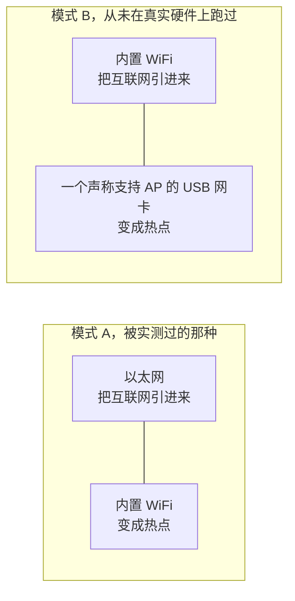

模式 B 从未被跑过。`PROVENANCE.md` 记录了目标机器只有一个无线电、也没有接任何 USB
设备，所以代码树里每一个模式 B 的测试数据都是写出来的，不是采集来的。

**在被实测的那台硬件上，把热点拉起来的代价是盒子失去自己的 WiFi。** `brcmfmac` 驱动
对 `iw phy phy0 interface add ap0 type __ap` 报 `Input/output error (-5)` 而拒绝，尽管
`iw list` 声称支持这种组合。于是这台设备退而接管 `wlan0`：把接口从 NetworkManager 手里
释放出来，剥掉它在家庭网络上持有的地址，然后改变它的类型。那次拒绝和那次成功的接管
序列都被实测并记录在 `PROVENANCE.md` 里。面板和日志会在这件事发生之前说清它的代价。
测试：`TestTheTakeoverSaysWhatItCost`。

创建第二个接口仍然是首选，因为它成功时对用户没有任何代价。只有在首选方案被尝试并遭到
拒绝之后才会走到那条退路，而且在应用第二套方案之前，第一套方案会被完整拆掉。

---

## 运行它

构建二进制，然后把它交给安装脚本。这条路不需要任何发布版，而且安装脚本既接受它做真装，
也接受它做试运行：

    go build -o /tmp/caspian-linux-arm64 ./cmd/caspian
    sha256sum /tmp/caspian-linux-arm64 | sed 's|/tmp/||' > /tmp/SHA256SUMS

    env CASPIAN_LOCAL_BINARY=/tmp/caspian-linux-arm64 \
        CASPIAN_LOCAL_CHECKSUMS=/tmp/SHA256SUMS \
        bash install.sh --dry-run --yes

去掉 `--dry-run` 就是真装。不带 `CASPIAN_LOCAL_CHECKSUMS` 时，安装脚本会用这样的措辞
警告您，它正在安装一个未经验证的二进制。`docs/INSTALL.md` 是完整的操作手册。它包含一个
假的 `uname` 装置，可以在一台根本装不上的机器上把各种拒绝走一遍。

这个二进制有四个子命令：

    caspian serve --privileged     root: routes, firewall, access point, engine
    caspian serve --panel          the caspian user: the web panel, nothing privileged
    caspian check                  report what this box looks like; changes nothing
    caspian version

刻意没有任何一个子命令能应用配置或者拨动那个开关。CLI 自己就是这么说的：「After the
installer has run, everything a person does happens in the panel.」

`uninstall.sh` 会移除 systemd 单元、二进制和目录，并回放网络日志，好让盒子回到被发现时
的样子。在依赖它之前，先读下面的缺陷 D5。

---

## 那几个控制，以及该按哪一个

面板上有三个控制会改变这台设备正在做的事。其中两个都会让连在热点上的设备断网，但它们
不是同一个控制。这一节之所以存在，是因为它们之间的差别以前只写在源码里，而拿着手机的
那个人读不到源码。

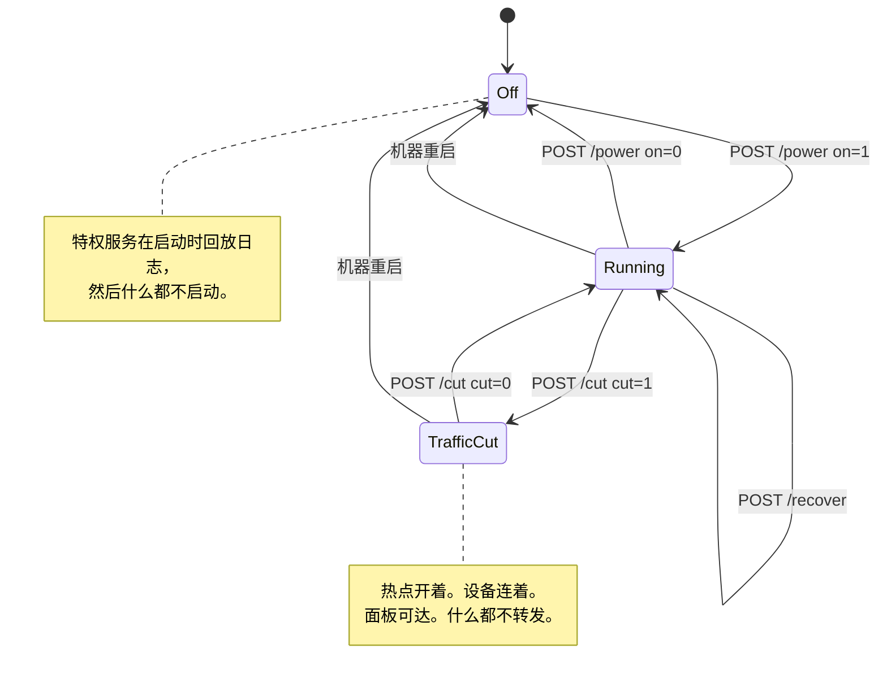

### 开关，`POST /power`

这个开关把整台设备打开和关闭。关闭时会调用特权服务的 `Stop`，它按顺序做五件事：

1. 停止引擎
2. 停止接入点，以及它旁边的 DHCP 和 DNS 服务
3. 删除生成给这两者用的配置文件
4. 如果无线电当初是 Caspian 解除阻断的，就把它重新阻断回去
5. 回放拆除日志

见 `internal/privsvc/start.go` 的 `stopLocked`，以及 `internal/hotspot/supervisor.go`
的 `Supervisor.Stop`。

要紧的后果是中间那一条。那个 WiFi 网络不再存在。每一台连上去的设备都会掉线，其中包括
按下按钮那个人手里的那台手机。

### 切断，`POST /cut`

切断只停掉盒子代那些设备转发的流量。它用一套 nftables 规则集换掉另一套。见
`internal/privsvc/cut.go` 的 `setForward`，以及 `internal/netcfg/nftables.go` 的
`RulesetFor`。

两套规则集只在 forward 链上有差别，别处都一样。
`TestForwardCut_DiffersFromNormalOnlyInTheForwardChain` 通过逐行比较 input、output、
prerouting 和 postrouting 链来断言这一点。在切断的那套规则集里，forward 链什么都不放行。
它带着一条写明理由的显式丢弃规则，好让读实时规则集的运维人员看到流量为什么停了，而不是
看到一片规则的缺席：

    iifname "wlan0" drop comment "client traffic cut by the user"

input 链没有被动过。所以盒子照样在 67 端口应答 DHCP、在客户端 DNS 端口应答 DNS、在
面板自己的端口提供面板，而且每一项都是从热点接口这一侧提供的。引擎没有被停，接入点也
没有被停。设备保持连接，保留自己的租约，仍然能打开面板。测试：
`TestForwardCut_StopsClientsAndKeepsThePanelReachable`。

### 为什么这个差别决定了您能从手机上按哪一个

面板默认只绑定在热点地址上，不绑别的。要让它同时在盒子自己所在的那个网络上提供服务，
是一个用户必须自己打开的设置，出厂默认是关的。见 `internal/panel/listen.go` 的
`BindAddrs`，以及 `internal/state/state.go` 的 `PanelOnLAN`。

所以，一个只有一台手机、而且手机连在热点上的人，可以从那台手机上撤销一次切断。他没法
从那台手机上撤销一次关机，因为关机把他用来访问面板的那个网络给拿走了。因此，切断才是那个
不会把使用它的人晾在原地的紧急停止。撤销它不需要重新连接，因为设备所连的东西没有消失过。

当流量必须立刻停下、而且您打算把它放回去时，按切断。它立即生效，不要求确认，而且在它
生效期间页面会把状态显示得明明白白。当您用完这台设备，或者想把 WiFi 网卡还给它原本所在的
那个网络时，按开关。不要把开关当作紧急停止来用，尤其当您是从一台连在热点上的手机上操作时。

还有两件小事，因为页面上那几句简短的措辞很容易被读过去。第一，在一台没有在运行的盒子上，
切断会被拒绝，而且它是用自己的话说明的，不是报一个不明失败。那时根本没有转发可以停。而
一套点名了一个并不存在的热点接口的规则集，就是对一台机器做了改动，而这台机器在关机期间
的整个不变量恰恰是「它被发现时是什么样，就保持什么样」。见 `errNotRunning` 和
`not-running` 这个故障。第二，切断状态保存在内存里，不写入任何文件，所以机器重启会把它
丢掉。这是刻意的：一个想不通自己的网为什么断了的人，拔一下电源就能把网拿回来。重启不会做
的，是把这台设备打开。特权服务在启动时回放日志，然后什么都不启动。见
`cmd/caspian/serve_priv.go`。所以一次重启会清掉切断状态，并让盒子处于关闭状态，流量要等到
开关被按下之后才会重新流动，在那之前不会。

### 恢复控制，`POST /recover`

第三个控制，是在不重启机器、也不用终端的情况下从一台卡住的盒子里脱身的办法。它停掉一切，
回放拆除日志，把这台设备改动过的每一个接口、路由和防火墙规则都放回去，然后用保存的设置
重新启动。`Service.Recover` 就是 `recoverToCleanMachine` 后面接上开关用的那个同一个
`Start`，所以恢复不是启动的第二套实现，也就不会跑偏。

它的存在源自被实测过的一天。2026-08-30，这台设备反复进入一些只有能开 SSH 会话的人才能
清理的状态：一次失败的启动创建了接口却从未移除，地址被从它下面冲掉了，一条日志记录在一次
失败的启动之后仍然留着。这些每一样都可以靠回放已经写下来的东西来恢复，而这些操作在面板上
一个都够不着。

它刻意不重启机器，也不重启任何一个 systemd 单元，所以面板进程和任何 SSH 会话在整个过程中
都保持在线。它确实会停掉接入点再重新启动它，所以一台连在热点上的设备会离开该网络，等热点
回来时再重新加入。

---

## 这个项目给自己定的规矩

这些不是愿景。每一条都有一个机制，而且机制被点了名。

**没有从真实流量里抓到出口 IP，就不叫可以用。** `docs/2026-08-29-design.md` 第 6 节。
连上不等于结果。当没有抓到出口 IP 时，硬件测试装置给出的评级是 UNPROVEN 而不是 PASS，
并且以 1 退出。

**一个自信的错句子比没有句子更糟。** 一个被告知某件事已经处理好的读者，会得出结论说
这里没什么需要检查的。所以一次纠正留下的是一个测试，而不是一句更好的话。
`TestNothingInTheApplianceWatchesTheUplink` 之所以存在，是因为曾经有两份文档声称盒子会
盯着自己的上行链路，并在它变动时重新加载防火墙。

**一个进程被启动了，不等于它起作用了。** 热点接口在任何东西绑定到它之前，会先从内核
回读一遍；接入点在服务报告自己正在运行之前，也会先回读一遍。这两次回读都是在一次被实测到
的事件之后加上的，那次事件里每一条命令都返回了成功。

**每一个场景都被看着失败过。** `TestEveryScenarioCanFail` 会往每一项行为里注入一个点了名
的缺陷，并要求它变红。一个没有人见它失败过的测试，是一盏接在什么都没有上的绿灯。

**一份测试数据的来源写在它的文件名里。** `capture-pi5-` 是目标机器上一条真实命令的字节
输出，`scenario-` 是一台没有人实测过的机器，`golden-` 是本项目自己的输出。一个读
`capture-pi5-` 文件的测试，做出的是关于目标机器的主张。一个读 `scenario-` 文件的测试则
不是。

**一份凭据一旦进了提交就是永久的。** `test/goldenscan` 会对每一份提交进来的测试数据扫描
已登记的哨兵值和各种凭据形态，而且它检查文件名，不只是文件内容。它已经被看着抓住了它认识的
每一类被人故意种进去的秘密。

**覆盖率下限是一把棘轮。** `scripts/gate.sh` 里的每一个数字，都是某个包在引入它的那次工作
之后实际测出来的值，不是谁希望达到的目标。没有对应行的包就是没有被设下限，而没有行的意思是
「还没有商定下限」，不是「这个包有覆盖」。

**特权侧不相信调用方送来的任何东西。** 每个请求的每个字段都会和这台机器自己探测到的结果
核对。一次拒绝是一个来自封闭集合的故障码，绝不是一句话，也绝不是调用方送来的某个值。

**盒子不向互联网要任何东西。** 没有遥测，不回传，不上传崩溃报告，没有网络字体，没有地理
数据文件，任何默认配置里也没有 Google 的解析器。

---

## 它保证什么

这里的每个标题，背后要么是 `internal/netcfg/testdata/` 里生成的防火墙输出，要么是一个
被点名的测试，要么是记录在仓库里的一次实测。`docs/BEHAVIOUR.md` 是那份可读的承诺清单。
它里面的每一个标题都是 `test/bdd/` 里一个场景的名字，而每一个场景都有一个与之匹配的
注入缺陷。所以「这个测试能检测出它声称能检测的东西」这件事本身，也是一个测试结果。

### 转发的客户端流量失败即断开，而且这道阻断不需要隧道

forward 链的策略是 `drop`。它里面的第一条规则就是泄漏阻断规则，而且它只点名了热点和上行
接口：

    iifname "wlan0" oifname "eth0" drop comment "fail-closed: client traffic never leaves by the uplink"

每一条放行客户端流量的规则都点名了隧道设备，所以隧道一消失，那些规则就不再匹配，策略把
一切丢弃。阻断规则本身不可能因为隧道没了就失效，因为它压根没提隧道。每个接口都按名字
匹配、从不按索引，所以规则集在没有隧道的情况下也能加载，而那正是需要它的时候。postrouting
链是刻意空着的。

场景：「with the tunnel gone, nothing lets client traffic out by the uplink」。配套的
分析器测试：`TestWithoutInterfaceRemovesOnlyTheRulesNamingIt`。

### 这个断网开关也覆盖盒子自己的流量

output 链是 `policy drop` 加上一份点了名的放行清单。这些放行项是靠枚举目标机器上真正在跑
的东西推导出来的，而不是靠采样流量，而且生成的规则集里每一条放行都带着支撑它的那次读数：
NetworkManager 的 DHCP 客户端 socket、systemd-timesyncd、DNS、环回、隧道设备、IPv6 邻居
发现，以及那台代理服务器，后者是**按地址**放行而不是按端口，这样一个跑在 UDP 443 上的传输
才不会被悄悄弄坏。有一条放行是靠推理而不是实测加上去的，并且它明说了这一点：盒子在热点上
作为服务器应答 DHCP，这件事 conntrack 覆盖不了，因为一个 DHCP 应答和它的请求不共享同一个
五元组。

那些主动挑衅测试，以及更重要的那些阴性对照，都记录在 `PROVENANCE.md` 的「The three
provocations, run with the policy loaded」一节。测试：`TestRestrictedEgress_PermitList`、
`TestRestrictedEgress_AcceptsEstablishedBeforeItDropsAnything`、
`TestRestrictedEgress_ServerIsPermittedByAddressNotPort`。

代价写在规则集自己的头部，而不是留给人去发现：在设备开着的时候，从盒子上的 shell 里跑
`apt update` 会失败。

### 有一个不会把热点一起带走的紧急切断

把设备关掉会让热点也下线，也就断开了拿着按钮的那台手机。所以另有一个控制，它丢弃转发的
客户端流量，同时让热点、DHCP、DNS 和面板保持在线。见 `internal/privsvc/cut.go` 和
`internal/panel/priv.go` 里的面板动作 `cut`。

切断是运行时状态，永远不写到磁盘上，所以拔电源就能撤销它。测试：
`TestCuttingClientTrafficLeavesTheWayBack`、`TestACutIsNeverWrittenDown`、
`TestACutDoesNotSurviveARestart`、`TestForwardCut_StopsClientsAndKeepsThePanelReachable`。

两者中该按哪一个、以及各自会拆掉什么，见上面的「那几个控制，以及该按哪一个」。

### 它从内核回读接口，而不是相信一个进程

一个进程被启动了，不等于它起作用了。这是一次真实的失败。`internal/privsvc/readback.go`
的头部记录着：2026-08-30，服务把自己记录成正在运行、热点在 `wlan0` 上，而 `wlan0` 当时
还是家庭网络上的一个 station。hostapd 是一个活着的进程，但它的控制 socket 不应答。房间里
的一台手机列出了十一个网络，我们的不在其中。而 dnsmasq 正在别人局域网上，用 DHCPNAK 应答
一台陌生人的设备。

在 `netcfg.AssertHotspotInterfaceReleased` 证明热点接口是空闲的之前，不允许任何东西绑定到
它；在 `AssertHotspotIsAccessPoint` 回读到一个正在广播预期名称的接入点之前，不允许任何
东西报告自己正在运行。测试：`TestNothingBindsToTheHotspotInterfaceUntilItIsProvedFree`、
`TestTheServiceDoesNotReportRunningUntilTheAccessPointReadsBackAsOne`、
`TestAnAccessPointBroadcastingAnotherNameIsNotOurs`、
`TestTheReleaseIsReadBackBeforeAnythingBindsAndTheAccessPointAfter`。

### 您能把自己的 WiFi 拿回来

每一次网络改动，都会在做出改动**之前**连同它的逆操作一起写进
`/var/lib/caspian/netcfg.journal`，而关闭时会倒着回放这些记录。记录在磁盘上而不是在内存
里，所以一个被杀掉的进程或者一次断电不会把它弄丢。一台在改动中途死掉的盒子，会先回放
记录，然后才去看这台机器、才去应用任何新的东西。

接管一个 WiFi 接口是一步一步记进日志的。正向序列和它的逆操作都在目标机器上跑过，记录在
`PROVENANCE.md` 的「The release sequence has been run on the target」一节。四条命令发了
出去，逆操作在八秒后把盒子放回了它自己的网络，带着它自己的地址。

有一次改动是刻意没有逆操作的，而且
`TestPlan_InvariantsHoldOnEveryModelledMachine` 断言它是唯一的一个：把热点接口拉起来。
在退出时把一个无线电关掉，比让它开着更糟，因为机器自己的 WiFi、以及用户正在看的那个面板，
都可能在它上面。

场景：「turning the switch off returns every change the box made」、「a teardown replayed
from the journal of a killed process undoes the same changes」、「a box killed halfway
through cleans up before it does anything else」。测试：
`TestJournal_RecordsInverseBeforeTheChange`、
`TestTeardown_ReplaysInExactReverseOrder`、
`TestRecover_UndoesAJournalLeftByAKilledProcess`、
`TestTheTakeoverReleasesTheInterfaceItSaysItWillRelease`。

如果某个逆操作失败了，防火墙自己的逆操作会被**扣住**而不是执行，这样一台没能撤销自己路由
的盒子仍然保有它的阻断。测试：`TestTheFirewallIsNotRemovedWhenAnEarlierInverseFailed`。

### 粘贴的配置不会出现在屏幕上、日志里或任何可读的文件里

这条流程产出的每一样东西，都会被拿去搜索那份粘贴进来的凭据：

- 每一个错误，以及每一条显示给用户的消息
- 这台设备的日志行
- 面板对配置的描述
- 保存的设置在诊断视图里渲染出来的样子
- 生成的防火墙规则
- 生成的 DHCP 和 DNS 配置
- 引擎自己的日志
- 磁盘上的日志文件
- 从非特权的面板发往特权服务的那个请求

它一个都不在里面。同时也会检查它确实在它必须在的那两个地方，这样测试就不会因为配置本身
不见了而通过。

场景：「the pasted credential never reaches a screen, a log or a readable file」、「the
hotspot password reaches the access point and nothing else」。测试：
`TestPastedConfigNeverAppearsInAResponseOrALog`、
`TestFailedConfigPathsDoNotEchoTheInput`、`TestStartRequestRedactsItself`、
`TestNoCredentialReachesTheAdvancedView`、
`TestTheServerAddressNeverAppearsInADiagnosticLine`。

### 面板不向互联网要任何东西

浏览器加载的每一份样式表、脚本和图标，都用 `go:embed` 编进了二进制。见
`internal/panel/assets.go`。完全没有网络字体：样式表的字体栈全是系统字体，波斯语可用的
排在前面。

隐私上的理由是，一个远程资源会把每一个打开面板的人的地址告诉第三方。更强的理由是可用性。
面板必须在隧道断掉时也能加载，而那恰恰是有人需要它的时候。

是两道机制，不是一道。`TestNoAssetReferencesAnExternalURL` 和
`TestNoRenderedPageReferencesAnExternalURL` 会扫描静态资源和每一个渲染出来的页面，看有没有
绝对 URL。`setSecurityHeaders` 会发送 `default-src 'none'`，并把列出的每一个源都设为
`'self'`，这样即使有漏网之鱼躲过了测试，浏览器也会拒绝它。`internal/panel` 里除了它自己的
测试之外，任何地方都不存在向外发起 HTTP 的客户端。

生成的配置里同样任何地方都不出现 Google 的解析器，也不使用任何 `geoip:` 或 `geosite:`
规则，因为这两样都会给一个整个安装故事就是「一个经过校验的二进制」的产品重新引入下载。
测试：`TestNoGoogleAnywhereInGeneratedConfigs`、
`TestGoogleResolverIsRejectedAtTheSource`。场景：「the box needs no download and asks no
Google server anything」。

### 权限是分开的

`caspian serve --privileged` 以 root 运行，掌管路由、防火墙、接入点和引擎。它通过一个
unix socket 接受一份简短的、点了名的动作清单，绝不接受由用户输入拼出来的命令。
`caspian serve --panel` 以非特权的 `caspian` 账号运行，只掌管网页界面，别的什么都不管。
词汇表和帧格式见上面的「架构」。

面板密码用 argon2id 哈希。见 `internal/state/password.go`。它是盒子上的一个本地密码。
别处不存在任何账号。

### 在任何握手之前先检查时钟

Pi 没有带电池的时钟，而有两个彼此独立的机制依赖挂钟时间。REALITY 会把它写进握手，而
xray-core **接受**哪些配置取决于日期。所以一台时钟起来就是错的盒子，不只是连不上而已。
它会接受一份同一个二进制在时钟被校正之后就会拒绝的配置。

这项检查在校验之前、在尝试任何东西之前就运行。见 `internal/privsvc/clock.go`，它作为
`applyLocked` 的第 1 步由 `Service.Start` 调用。它会抛出一个独立的故障码，好让面板不去
怪罪用户的配置。测试：`TestClockFailureIsNotBlamedOnTheConfig`。

### 三种配置失败被区分开来

「这条链接读不了」、「读懂了，但照这样写没法用」、「链接没问题，是服务器没有应答」这三
种情况需要用户做三件不同的事，而第三种最常见。先怪配置，正是让人扔掉一份从来没坏过的配置
的原因。在那段粘贴进来的文本被读之前，机器上的任何东西都不会被碰。场景：「text that is
not a link at all is refused before anything is touched」、「a link the engine will not
accept is told apart from one that would not parse」、「a link whose server never answers
is not blamed on the link」。

---

## 它不保证什么

这份清单才是要仔细读的那份。

### 443 端口上的 DNS over HTTPS 是被承载的，不是被阻断的，而且这里没有东西能看见它

客户端在 53 端口上的 DNS，在两种协议上都是被重定向到这个盒子，而不只是被放行。所以一台
把解析器硬编码在自己身上的设备是在这里被应答的，而不是被放出去找它被告知要用的那一个。
853 端口上的 DNS over TLS 会被 TCP reset 拒绝，于是设备退回到被重定向的那个端口。853 上的
DNS over QUIC 会被丢弃。

443 端口上的 DNS over HTTPS 和任何别的 HTTPS 都区分不开，会像别的东西一样经隧道承载。一个
使用它的客户端在隧道里面，不算泄漏。它同时也是不可见的。本项目里没有任何东西、硬件测试
装置里也没有任何东西能观察到它。这是设计上的一个界限。这一点写在生成的规则集本身里、写在
`docs/BEHAVIOUR.md` 里，也写在 DNS 泄漏检查打印出来的输出里，而不是只写在这里。

### IPv6 是被阻断的，而且 IPv6 那条路还没做完

没有 IPv6 隧道。一台有可用 IPv6 路径的设备会优先走 IPv6，从而完全绕开隧道，所以默认策略
是阻断。有四样东西撑着这一点。`IPv6Block` 是 `netcfg.DefaultOptions` 里的默认值。盒子不
转发 IPv6。防火墙在热点上双向丢弃转发的 IPv6。而朝热点的路由通告会被丢弃，所以设备没法
给自己弄一个地址。场景：「clients are never offered the IPv6 the tunnel cannot carry」。

`IPv6Forward` 作为一个选项存在，而它自己的注释就说不要打开它。引擎的 TUN 入站还没有在目标
机器上被证明能承载 IPv6。它也刻意不往 forward 链里加任何放行规则：IPv4 的那两条放行规则在
两个方向上都指名了热点子网，而整份方案里根本没有任何 v6 前缀可供指名，一条只匹配那两个接口
名字的规则会接受客户端写上去的任何源地址。`TestRuleset_NoUnconstrainedIPv6AcceptInForward`
守着这条线。

**「阻断」说的是路由，不是 DNS，而这个区别很重要。** 一台已接入设备发出的 AAAA 查询不会被
抑制，也不会被回以空答案。它会走到引擎，穿过隧道，然后带着真实的 AAAA 记录回来，因为引擎配
置文档要求 `UseIP`，而 dnsmasq 没有设 `filter-AAAA`。于是设备学到了一批它根本无法到达的
IPv6 地址，然后退回到 IPv4。

在没有任何东西能给客户端一个 v6 地址之前，这是无害的；而一旦有什么东西能给了，这就是第一件
不再无害的事，因为一个有可用 v6 路径的客户端会优先采用那个 AAAA 答案，并从一条这个盒子并不
承载的路径离开。这件事被写在这里，而不是留成一个意外，而且
`TestAAAAQueriesAreAnsweredAndNotSuppressed` 把这两半都钉住了，所以要改它就必须是一个决定。

**硬件测试台根本没法给 IPv6 打分，所以从它那里得到的任何 IPv6 结果都没有意义。**
`test/hardware/README.md` 在「What this vantage cannot grade: IPv6」一节里记录着：手机只有
一个链路本地地址，`ip -6 route show default` 在手机上和在 Pi 上都是空的，而连接一个 IPv6
字面地址会得到「Network is unreachable」。那个局域网上根本没有 IPv6，所以在那里跑一次 IPv6
泄漏检查，即使这台设备什么都不做也会通过。本项目手上的每一个硬件结果都是 IPv4 结果。任何
在一个 IPv6 可用的网络上运行它的人，都必须把这当成一个新问题，而不是一个已经覆盖了的问题，
并且要准备好自己去写那个测试，而不是打开一个现成的。

### 盒子自己的流量按设计不在失败即断开的承诺范围内

那个承诺说的是**转发的客户端流量**。盒子自己通往您服务器的那条连接必须直接到达上行接口，
否则根本就没有隧道，而 `docs/2026-08-29-design.md` 第 7 节正是因为这个原因把盒子自己的流量
放在保证范围之外。

output 链的断网开关缩小了这个范围，但没有把它关上。生成的规则集在自己的头部写明了残留风险。
DNS 是一个口子：盒子上的任何东西仍然能在 53 端口上够到网络，而且在任何隧道存在之前，服务器
的主机名就已经在本地网络上被明文解析了。这两样都不是客户端流量的泄漏，而且断网开关也没有
让它们变得更糟。

input 链的策略是 `accept`，这同样是按设计如此，也同样写在规则集里。早先的一个版本把它设为
`drop`，`PROVENANCE.md` 记录了在目标机器上实测时发生了什么。每一个新的入站连接都被拒绝，
SSH 不再应答，而已经打开的那个会话还能用，这在一台无头机器上和崩溃是分不清的。input 链
唯一限制了东西的地方是热点这一侧，在那里一台加入的设备只能够到 DHCP、DNS、面板和 ICMP
echo，盒子上别的什么都够不到。

### 客户端隔离是一条规则，不是一次实测

规则集里有 `iifname "wlan0" oifname "wlan0" drop`。这条规则在不在，是有检查的。它管不管用，
没有。

### 这个仓库里没有任何东西会抓取出口 IP

`test/tunnel` 让真实字节穿过一个真实的 xray-core 服务端，而它里面的一切都在环回地址上，
所以它抓不到出口 IP，也不可能抓到。`test/bdd` 没有网络、没有无线电、没有 root、也没有隧道
设备。它在进程内通过真实的配置加载器运行真实的引擎，所以「引擎接受了这份配置并启动了」这句
话是字面意思，但隧道入站是关掉的。

所以这个仓库里没有任何东西满足本项目自己给「可以用」定下的标准。`docs/BEHAVIOUR.md` 以一节
「What this suite does not prove」结尾，列出还欠着什么。请把它当作测试套件的一部分来读。

### 防火墙一旦加载就没有东西再复查它

见下面的缺陷 D1。如果在设备运行期间有东西把表清空了，盒子会继续转发，面板会继续报告已连接，
而没有任何东西会察觉。

### 没有东西盯着上行链路

互联网这一头挪了位置，比如线被拔了或者租约换了个方式续，这是一种没有任何东西会大声报错的
变化。那条钉住的、通往服务器的路由仍然存在，仍然指着一个已经不再是出路的地址。盒子不会
察觉，隧道会一直停着，直到有人再按一次开关。

这付出的代价是可用性，不是隐私。客户端流量在整个过程中一直被阻断，因为 forward 策略是 drop，
而它里面每一条 accept 都点名了隧道。`netcfg.WatchUplink` 和 `Plan.RederiveForUplink` 存在
而且能用，但没有任何已发布的代码调用它们中的任何一个。
`TestNothingInTheApplianceWatchesTheUplink` 就是那个防止相反的句子飘回文档里的东西，那句话
在文档里一直待到 2026-08-30。

### 模式 B 从未在真实硬件上跑过

每一份模式 B 的测试数据都是写出来的。`PROVENANCE.md` 记录了目标机器只有一个无线电、也没有
USB 网卡，所以这个产品叫人去买网卡才能用的那种摆法，是对着没有人实测过的字节做的证明。

---

## 实际验证过什么

### Go 测试套件，本仓库，2026-08-31 实测

在提交 `5b0a8a7`、工作区干净的情况下，在 go1.27.0 darwin/arm64 上：

    go build ./...                 exit 0
    go test -count=1 -v ./...      exit 0

那次运行执行了包含子测试在内的 1577 个测试：1572 个通过，5 个跳过，0 个失败。十五个包报告
了 `ok`。有两个包没有测试文件：`bdd/harness` 和 `local/devpanel`。那 5 个跳过都说明了它们没有
在证明什么：TUN 设备的生命周期，它只在 linux 上、并且需要 root 和 `/dev/net/tun`；三项需要装了
dnsmasq 才能做的 dnsmasq 配置检查；以及一个需要显式开启的二维码 PNG 导出。

上一次记录的运行是在 2026-08-30、提交 `dd15ad6` 上，执行了包含子测试在内的 1323 个测试：
1319 个通过，4 个跳过，0 个失败，十二个包报告 `ok`。

`-count=1` 不是可选项。它绕开结果缓存。没有它，第二次运行会把第一次运行的 PASS 行打印出来
并以 0 退出，实际上什么都没执行。

完整的门禁是 `scripts/gate.sh`：gofmt、`go vet`、带竞态检测器的完整测试套件，以及每个包的
覆盖率下限。在把它接到任何管道之前，先读它的头部注释。shell 管道返回的是最后一条命令的状态，
而这个陷阱在本项目里已经造成过一次假绿灯。

`packaging/test-install.sh` 在任何有 bash 的机器上覆盖那两个 shell 脚本，包括一台根本装不上
的机器。

### 行为测试套件

`docs/BEHAVIOUR.md` 列出 24 个场景。2026-08-31 那次运行执行了全部 24 个，而
`TestEveryScenarioCanFail` 执行了 24 个与之匹配的注入缺陷，所以每一个场景都被看着为它声称能
检测的那件具体的事变红过。如果文档和测试套件出现分歧，无论朝哪个方向，
`TestBehaviourDocumentListsEveryScenario` 都会失败。要跑其中一个：

    go test ./test/bdd/ -run 'TestBehaviour/the_firewall'

### 搬运测试套件

`test/tunnel` 驱动解析器接受的七种协议中的每一种，去打一个跑在环回地址上的真实 xray-core
服务端。每一种都必须把一个 HTTP 请求送到一个只有隧道另一头才够得到的源站。每一行覆盖了什么、
没覆盖什么，见上面的「什么真的通过一个真实服务端搬运过字节」。在这个包存在之前，关于那七种
协议里的六种，能站得住的最强说法只是：引擎会加载它们产出的那份文档。

### 在目标硬件上

`internal/netcfg/testdata/PROVENANCE.md` 就是那份记录，而且它对「什么是采集来的、什么是写出
来的」这个区别很小心。文件名带着类别：`capture-pi5-` 是 Pi 上一条真实命令的字节输出，
`scenario-` 是一台没有人实测过的机器，`golden-` 是本项目自己的输出。

在 Pi 上实测并记录在那里的有：全部五套各不相同的生成规则集都通过了 `nft -c -f` 的解析，每个
文件的 sha256 都是在 Pi 上回读的而不是在开发机上，并且 `nft list ruleset` 在之前和之后都是空
的。接口释放序列及其逆操作。驱动拒绝创建第二个 AP 接口，同时接受在已有接口上做类型变更。断网
开关的那几次主动挑衅测试，以及它们的阴性对照。还有那次导致 input 策略被撤回的输入策略锁死
事件。

那份文件还记录了把写出来的字节换成实测字节之后，暴露出了哪些原本没被发现的问题，这正是把两类
数据都留着的理由。有好几个缺陷在此前每一次运行里都是绿的，其中包括一套没有任何内核会加载的
防火墙规则集，以及一次会在一台原本开着反向路径过滤的机器上把它关掉的拆除操作。

### 端到端，用一台真手机

测试装置是 `test/hardware/caspian-hw`，操作手册是 `docs/HARDWARE-TEST.md`。它的标准就是本项目
自己的标准。连上不等于结果，一个传输只有在真实流量穿过它、并且出口 IP 被抓到并和配置点名的
那台服务器对上时，才算被证明。一个等于未走隧道基线的出口 IP 是泄漏，而且在一次运行里它压倒
一切。一台在采集过程中改变了网络状态的手机，会让这次读数作废，既不算通过也不算泄漏。

一次记录于 2026-08-30 的运行 `run-20260830T144015Z`，在 IPv4 上给出的评级是：

- 两份配置被证明，各自 `verdict PASS`，`sources agree`，两个彼此独立的来源都给出了出口 IP，
  并和配置点名的那台盒子对上。
- 切换配置时出口指纹随之改变。
- DNS 检查在 30 秒的窗口里，在上行链路上以明文形式发现那个每次运行随机生成的 `.invalid`
  标签零次。在那个窗口里确实有四个明文 DNS 数据包穿过了那条上行链路，它们是盒子自己的，而
  设计把这部分放在保证范围之外。这正是为什么这项检查要找的是一个网络上别的东西不可能产生的
  标签，而不是去数 53 端口的数据包，后者分不清一个逃出去的客户端查询和盒子自己的查询。
- 失败即断开：在引擎停止、并用飞行模式把手机的蜂窝网络去掉之后，两个来源都够不到互联网，
  而面板仍然通过热点应答。所以这是防火墙在拒绝流量，而不是一条死掉的链路。这一步此前有两次
  尝试被评为 VOID 并重做，而不是被拿去报告。

关于那份记录有两点。它是在最后一步的第三次尝试上才通过的，而那两次作废的读数留在了台账里，
没有被删掉。还有，那次运行的产物存放在 `local/` 下，而该目录在 gitignore 里，所以它们**不在
这个仓库里**。如果您克隆了本仓库，您没法核查那次运行。您只能自己重新跑一遍测试装置。

之所以用两个来源，是因为单个来源可能被缓存或过期，而且两个都固定成 IP 地址而不是域名。
`docs/HARDWARE-TEST.md` 用它称为全文最重要的那一段解释了原因。那个局域网上的解析器会把 IP
回显服务打到黑洞里。所以，一台只改了 DNS 服务器、根本没有隧道任何流量的盒子，会显示出恰恰是
一个靠解析域名的测试装置所寻找的那种特征。它会被评为通过。

这个测试装置会把它写出的每一样东西里的配置、服务器地址、用户 id 和密钥都脱敏掉。它会重新读一
遍每一份产物来确认脱敏生效了，而且它有一次通扫，会把整次运行重新读一遍，看有没有什么漏过了
过滤器。任何抓包都不会离开 Pi。tcpdump 的输出在盒子上被压缩成两个整数，因为在那条上行链路上
抓包就是在录下维护者自己的浏览记录。

---

## 未解决的缺陷

`docs/DEFECTS.md` 是那份「已知、有证据、尚未修复」的清单，列明了实测到了什么、代价是什么、
以及要怎样才能关掉每一条。它们没有一条是客户端流量的泄漏。这里做个摘要，好让本文不至于成为
跳过那份文档的理由：

- **D1. 防火墙一旦加载就没有东西再去重新断言它。** 未解决。生产代码里任何地方都没有读取
  实时规则集的操作，也没有任何循环去复查它。所以任何在会话中途移除那张表的东西，都会让盒子
  继续转发、面板继续报告已连接。
- **D2. 对机器所做的两处改动没有逆操作。** 一处已关闭，另一处在进程内已关闭、但跨越进程被杀
  时仍未关闭。生成的配置文件现在会在停止时被删除，无线电的软阻断也会被放回去，并且会先重新
  读一遍设备状态，好让别人改过的无线电不被动。仍然未解决的部分很窄：哪些设备被解除过阻断，
  这份记录存在内存里，所以一个被杀掉而不是被停止的服务不会把它们重新阻断。
- **D3. 由本包创建的热点接口不会从 NetworkManager 手里释放。** 出于决定而未解决。接管既有
  接口的那些路径确实会释放。创建接口的那些路径不会，因为探测是在那个接口存在之前跑的。
  `TestACreatedHotspotInterfaceHasNoMeasuredManagerAndIsNotReleased` 把这个缺口钉住，让它保持
  是一个决定，而不是变成一次意外。
- **D4. 停止操作在什么都没撤销时也报告成功。** 未解决，只是报告层面的问题。一次每个逆操作都
  失败了的拆除仍然返回无错误，所以面板可以在盒子仍然完全配置着的时候，说它已经被还原成被发现
  时的样子。在那种状态下盒子仍然是失败即断开的，因为防火墙的逆操作被扣住了。
- **D5. 卸载脚本按它自己的规则回放日志。** 未解决。`uninstall.sh` 带着一份独立的、用 Python
  重新实现的回放逻辑。它没有「当前面某个逆操作失败时扣住防火墙逆操作」这条规则的对应物，所以
  一次路由逆操作失败了的卸载，仍然会把那张表删掉。

`docs/DEFECTS.md` 还列出了哪些是被修好而不是被记录下来的，好让这份未解决清单不被误当成全貌。

---

## 文档地图

这些文档是产品的一部分。它们遵循的规则是：一个自信的错句子比没有句子更糟，因为一个被告知某件
事已经处理好的读者，会得出结论说这里没什么需要检查的。

| 文件 | 它是什么 | 什么时候读它 |
|---|---|---|
| `README.md` | 本文：产品做什么、保证什么、不保证什么 | 最先读 |
| `FAQ.md` | 人们实际撞上的问题，每个答案都点名到某个文件或某个故障码 | 有东西不工作，或者您想要简短版 |
| `docs/2026-08-29-design.md` | 设计记录：实测了什么、决定了什么、还开着什么，以及带着每一步所需证明的构建计划 | 您想知道某个决定为什么是那样定的 |
| `docs/BEHAVIOUR.md` | 承诺清单，一个场景一个标题，最后是这套测试不能证明什么 | 您想知道每次运行都检查了什么 |
| `docs/DEFECTS.md` | 已知、有证据、尚未修复的东西 | 在您依赖本项目之前 |
| `docs/LAYOUT.md` | 名称、路径、权限位和端口，固定在一个地方 | 您正在改一个路径或一个端口 |
| `docs/INSTALL.md` | 安装操作手册，包括那套拒绝行为的测试装置 | 您正在安装 |
| `docs/HARDWARE-TEST.md` | 硬件证明的操作手册、退出码，以及那两个来源 | 您正在证明一个传输 |
| `internal/netcfg/testdata/PROVENANCE.md` | 逐个文件说明：什么是在真实硬件上实测的，什么是写出来的 | 您正把一个绿色的测试当作关于硬件的证据 |
| `test/hardware/README.md` | 测试装置的地图，以及它那个观察点没法给什么打分 | 您正在改这套测试装置 |
| `bdd/README.md` | 浏览器和 API 行为测试套件 | 您正在做面板方面的工作 |

全文中实测和推断是分开写的，而每一处「不知道」都会说明哪条命令能把它弄清楚。

提交信息里带着各项决定背后的论证，值得一读。它们是故意写长的。

---

## 许可证

AGPL-3.0-or-later，并附有第 7 节允许的三条附加条款。三条都属于第 7 节允许的种类，没有一条
限制您可以用这个软件做什么：保留版权声明、这份署名，以及在任何用户界面中对 Caspian 项目的
可见引用；如果您修改了它，就标明您的版本已被更改；以及不要用作者或项目的名义做宣传，其中包括
以那些名义募捐、拉赞助或申请资助。完整文本在 `LICENSE` 里，条款在 `NOTICE` 里。

第三条限制的是**名称**的使用，别的什么都不限制。您仍然可以自由地运行、研究、修改和再分发这个
软件，用于任何目的，包括商业目的。您不能做的是用作者的名义去筹钱。

之所以用 AGPL 而不是 GPL，是因为这个程序通常是作为一项服务运行、由别人连上来使用的，而第 13
节堵上了普通 GPL 留下的那个口子。之所以不用宽松许可证，是因为这个二进制静态链接了
GPL-3.0-or-later 的代码：`github.com/sagernet/sing` 和 `github.com/sagernet/sing-shadowsocks`，
两者都是经由 xray-core 引入的。所以组合作品必须以 GPL 家族的条款发布，MIT 或 Apache-2.0 对它
不可用。

## 构建于

Caspian 是围绕别人的工作写的一小段代码。引擎是 xray-core，分享链接解析器是 XTLS 的。这两个
项目都不为本项目背书；它们被列出来，是因为那些工作是他们的。

| 项目 | 许可证 | 它在这里做什么 |
|---|---|---|
| [xray-core](https://github.com/xtls/xray-core) | MPL-2.0 | 代理引擎，在进程内链接，而不是作为一个独立程序运行 |
| [libXray](https://github.com/XTLS/libXray) | MIT | 分享链接解析器，内置在 `third_party/libxray-share/` 下 |
| [REALITY](https://github.com/xtls/reality) | MPL-2.0 | TLS 伪装传输 |
| [uTLS](https://github.com/refraction-networking/utls) | BSD-3-Clause | TLS 指纹模仿 |
| [quic-go](https://github.com/apernet/quic-go) | MIT | Hysteria2 所运行的 QUIC 栈 |
| [gVisor](https://github.com/google/gvisor) | Apache-2.0 | TUN 入站使用的用户态网络栈 |
| [sing](https://github.com/sagernet/sing) 和 [sing-shadowsocks](https://github.com/sagernet/sing-shadowsocks) | GPL-3.0-or-later | Shadowsocks 2022，以及本项目采用 copyleft 的原因 |
| [netlink](https://github.com/vishvananda/netlink) | Apache-2.0 | 接口、地址和路由 |
| [miekg/dns](https://github.com/miekg/dns) | BSD-3-Clause | DNS 报文处理 |
| [gorilla/websocket](https://github.com/gorilla/websocket) | BSD-2-Clause | WebSocket 传输 |
| [CIRCL](https://github.com/cloudflare/circl) | BSD-3-Clause | 后量子密钥交换 |

它还需要机器上有 `hostapd`、`dnsmasq`、`nftables`、`iw` 和 `iproute2`。这些是作为独立程序运行
的，不是被链接进来的，所以它们的许可证不影响本项目的许可证，但没有它们这台设备什么都不是。

`NOTICE` 里有完整的记录：二进制里的每一个模块、从它自己的许可证文件里读到的许可证，以及兼容性
方面的推理。
