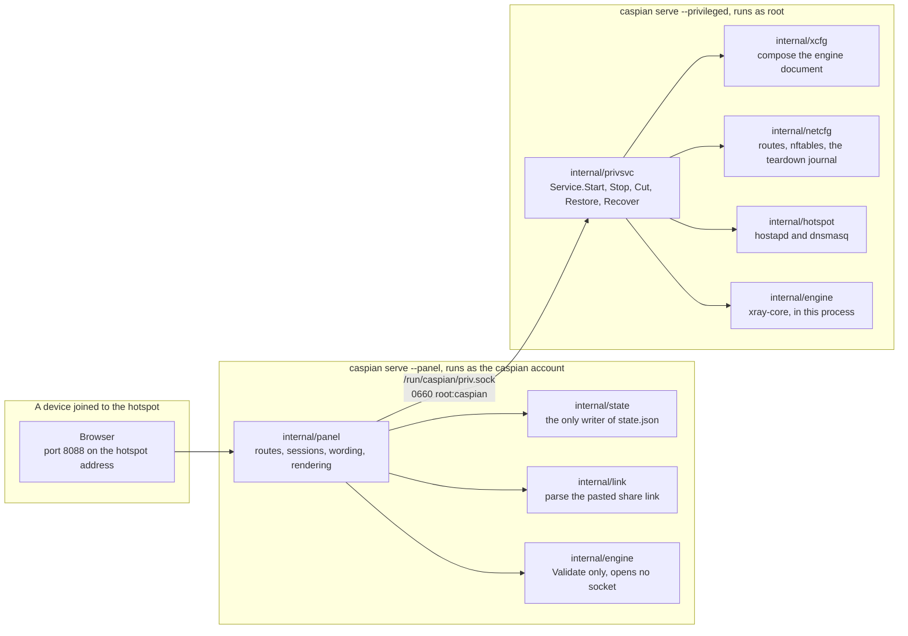
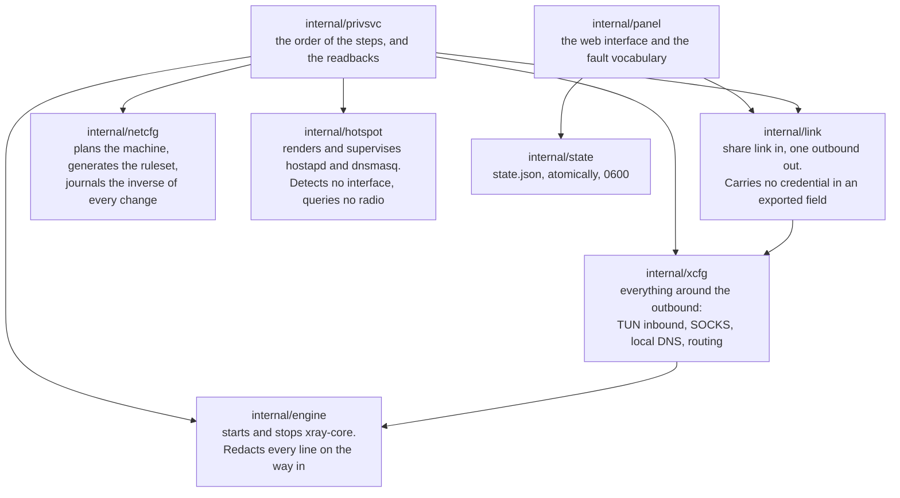
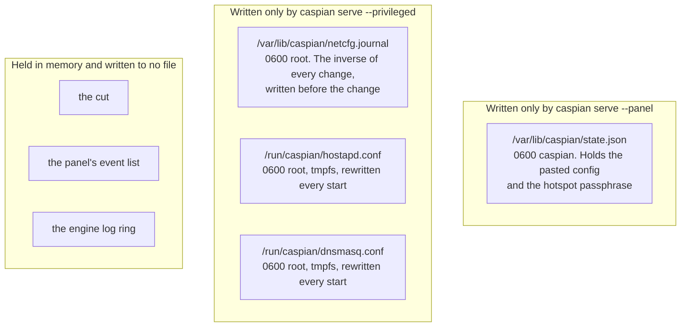
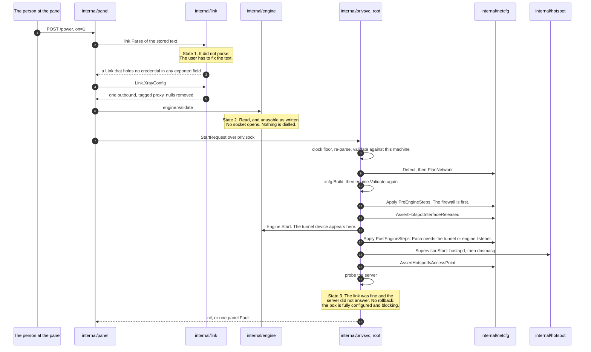
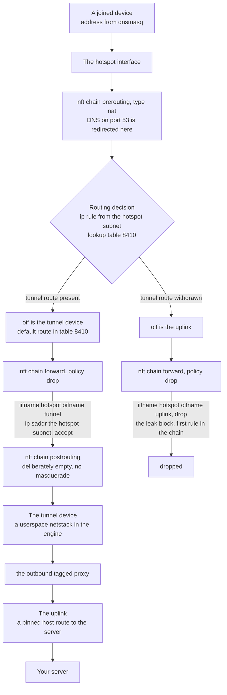
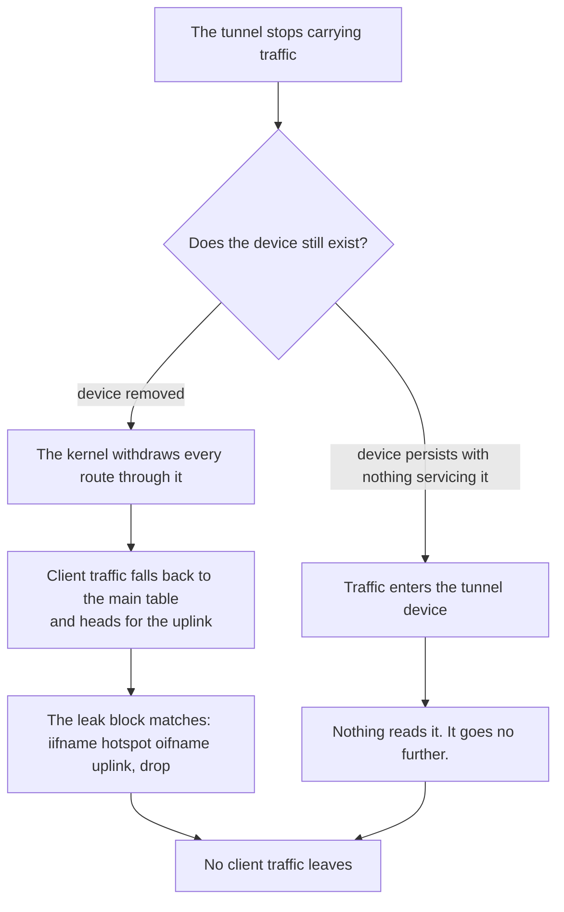
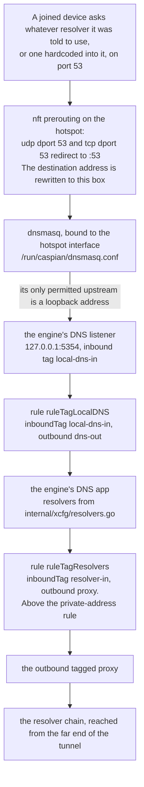
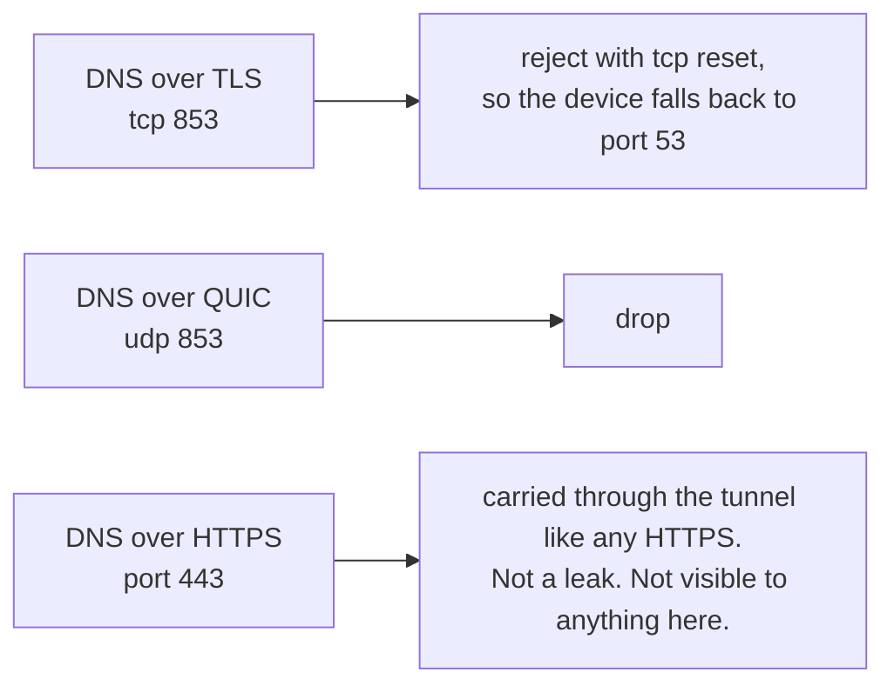

[English](https://github.com/Iman/caspian/wiki/Architecture) | [فارسی](https://github.com/Iman/caspian/wiki/Architecture.fa) | [Русский](https://github.com/Iman/caspian/wiki/Architecture.ru) | [中文](https://github.com/Iman/caspian/wiki/Architecture.zh) | [العربية](https://github.com/Iman/caspian/wiki/Architecture.ar) | [Türkçe](https://github.com/Iman/caspian/wiki/Architecture.tr) | [اردو](https://github.com/Iman/caspian/wiki/Architecture.ur)

# الهندسة المعمارية وتدفق البيانات

[ويكي قزوين](https://github.com/Iman/caspian/wiki/Home.ar)

> يأتي هذا الدليل من ملف README الموجود. تحتفظ قياساتها بتواريخها الأصلية. لا يُبلغ نقل التوثيق هذا عن تشغيل اختباري جديد.
> [English](https://github.com/Iman/caspian/blob/108567a6a529be05b577ee68b65b48790f07e43d/README.md) | [فارسی](https://github.com/Iman/caspian/blob/108567a6a529be05b577ee68b65b48790f07e43d/README.fa.md) | [Русский](https://github.com/Iman/caspian/blob/108567a6a529be05b577ee68b65b48790f07e43d/README.ru.md) | [中文](https://github.com/Iman/caspian/blob/108567a6a529be05b577ee68b65b48790f07e43d/README.zh.md)

## الهندسة المعمارية

### عمليتان، واحدة ثنائية

يعمل ثنائي واحد في دورين، يتم اختيارهما بواسطة أمر فرعي. الانقسام موجود بحيث أ
لا يعد الخطأ في الجزء الذي يوزع إدخال المستخدم ويخدم HTTP خطأً في
الجزء الذي يحمل الجذر. [`docs/LAYOUT.md`](https://github.com/Iman/caspian/blob/main/docs/LAYOUT.md)، "عمليتان، واحدة ثنائية"، هي
بيان ثابت منه.

يطبع [`cmd/caspian/main.go`](https://github.com/Iman/caspian/blob/main/cmd/caspian/main.go) الدورين في نص الاستخدام الخاص به:

خدمة قزوين - الجذر المميز: الطرق، جدار الحماية، نقطة الوصول، المحرك
خدمة قزوين - لوحة مستخدم قزوين: لوحة الويب، لا يوجد شيء مميز

### المقبس، وسبب إغلاق المفردات

ينص [`internal/panel/priv.go`](https://github.com/Iman/caspian/blob/main/internal/panel/priv.go) على القاعدة التي يوجد بها الانقسام بالكامل: "A
المساعد المميز الذي يأخذ المسار وقائمة الوسائط من عميله ليس كذلك
الحدود؛ إنها طريقة لتشغيل أي شيء كجذر." الفاصلة المنقوطة لهم. ال
يتم اقتباس الجملة بالضبط، لأن إعادة صياغة القاعدة ليست هي القاعدة.

لذلك لا يمكن للوحة التعبير عن "تشغيل هذا". ولا يمكن أن يسمي إلا إجراء واحدا من ثمانية أفعال،
والجانب المتميز هو الذي يقرر ما يعنيه كل واحد. `panel.Actions` هو ذلك
مجموعة مغلقة، ويفشل `TestActionVocabularyMatchesTheInterface` إذا كانت الطريقة كذلك
تمت إضافتها إلى الواجهة بدون اسم في القائمة.

| العمل | ما يفعله الجانب المميز | يغير الآلة |
|---|---|---|
| `detect` | قم بالإبلاغ عن الواجهات وحدود الراديو والشبكة الفرعية المختارة | لا |
| `status` | قم بالإبلاغ عن مرحلة المحرك ونقطة الاتصال وما إذا كانت حركة المرور مقطوعة | لا |
| `start` | قم بإحضار النفق ونقطة الاتصال للأعلى | نعم |
| `stop` | قم بإزالتهم وأعد تشغيل مجلة التفكيك | نعم |
| `recover` | توقف، أعد تشغيل المجلة، ثم ابدأ مرة أخرى من نفس الطلب | نعم |
| `engine-log` | قم بإرجاع الأسطر الأخيرة للمحرك، التي تم تنقيحها بالفعل | لا |
| `cut` | قم بإسقاط حركة مرور العميل المُعاد توجيهها واترك كل شيء آخر قيد التشغيل | نعم |
| `restore` | إعادة حركة مرور العميل المعاد توجيهها | نعم |

طلب واحد، استجابة واحدة، اتصال واحد. الرسالة عبارة عن نهاية كبيرة بحجم 4 بايت
length متبوعًا بالعديد من وحدات البايت من JSON. يتم التحقق من الطول
`maxFrameBytes` قبل تخصيص أي شيء أو تحليله، فهي رسالة كبيرة الحجم
تكاليف أربعة بايت والرفض. يتم رفض حقول JSON غير المعروفة بدلاً من ذلك
تم تجاهله. يتم فحص `protocolVersion` عند كل طلب. لذلك لوحة من واحد
إطلاق سراح التحدث إلى خدمة مميزة من شخص آخر يحصل على رفض محدد،
بدلاً من الحقل الذي تم فك تشفيره بصمت كقيمة صفرية.

لا شيء يعبر مرة أخرى على مسار الفشل باستثناء كلمة واحدة: `panel.Fault` من
مجموعة مغلقة، أو `privsvc.Refusal` من مجموعة مغلقة ثانية. المحرك الخاص
يتضمن نص الخطأ المادة الأساسية للمستخدم، لذلك يتم تسجيل دخوله إلى صاحب الامتياز
الجانب وانخفض. لا يوجد مجال للرد الذي يمكن أن يسافر فيه.

### من يملك أي حزمة

`internal/privsvc` يعيد توزيع `StartRequest.ConfigJSON` مع `internal/link`
بدلاً من الثقة في قيام اللجنة بذلك. كما أنه يتحقق من الإنترنت
واجهة مقابل المسار الافتراضي لهذا الجهاز، واجهة نقطة الاتصال
مقابل مخرج `iw list` الخاص بهذا الجهاز، والقناة مقابل ما
ذكرت الراديو أنها قابلة للاستخدام.

### أين تعيش الدولة ومن يكتبها

كاتبان، ملفان، لا يوجد ملف مشترك. لا تكتب أي من العمليتين عملية الأخرى، لذلك
لا يوجد قفل ولا يوجد تحديث مفقود للحماية منه. [`docs/LAYOUT.md`](https://github.com/Iman/caspian/blob/main/docs/LAYOUT.md)، "من
يكتب ماذا"، يسجل القرار والمسودة السابقة التي نقضها.

لا يقرأ الجانب المميز أي ملف حالة على الإطلاق. كل ما يحتاجه يصل
طلب البداية. يقوم `TestPrivsvcReadsNoStateFile` بفحص المصدر الخاص بتلك الحزمة
ويفشل إذا قرأ واحدة على الإطلاق، وهو ما لم يكن ليقدمه تعليق.

الجدول الكامل للمسارات والأوضاع والمالكين موجود في [`docs/LAYOUT.md`](https://github.com/Iman/caspian/blob/main/docs/LAYOUT.md). الموانئ هي
تم إصلاحه هناك أيضًا: 53 للعميل DNS على نقطة الاتصال، 5354 عند الاسترجاع لـ
مستمع DNS الخاص بالمحرك، 8088 للوحة، 10808 عند الاسترجاع لـ
الجوارب التشخيصية واردة.

## كيف تتدفق البيانات

### يصبح رابط المشاركة الذي تم لصقه نفقًا قيد التشغيل

`startNow` في [`internal/panel/handlers.go`](https://github.com/Iman/caspian/blob/main/internal/panel/handlers.go) يوثق الأمر، والأمر هو
ما الذي يفصل بين فشل التكوين الثلاثة. لم يتم لمس أي شيء على الجهاز
حتى تنتهي الحالة 1 والحالة 2.

ثلاثة تفاصيل في هذا التسلسل هي الحاملة.

تم إنشاء مستند المحرك مرتين لأسباب مختلفة. `internal/link`
ينتج الخارج ولا شيء غير ذلك. `internal/xcfg` تنتج كل شيء
من حوله: شبكة TUN الواردة التي تصل إليها حركة مرور العميل، وSOCKS الاسترجاع
الوارد الذي تستخدمه التشخيصات والوكيل المؤقت لنظام macOS، DNS المحلي
المستمع وسياسة المحلل وقواعد التوجيه.
ولا يؤخذ شيء من ذلك مما أرسله المتصل.

البداية التي تفشل جزئيًا يتم التراجع عنها تمامًا. المجلة بالفعل
يحمل معكوس كل تغيير، مكتوبًا على القرص قبل أن يصل التغيير إلى
نواة. البداية التي تفشل تترك الآلة كما تم العثور عليها.

الخادم الذي لا يجيب ليس مربعًا نصف مطبق. كل تغيير نجح
جدار الحماية ساري المفعول، ويتم حظر حركة مرور العميل المعاد توجيهها بسبب
النفق لا يحمل شيئا فيبلغ العيب ولا يهدم شيء.

### مسار الشبكة لحزمة العميل

تقوم كتلة التسرب بتسمية نقطة الاتصال والوصلة الصاعدة فقط. لا يمكن أن يتوقف عن العمل
عندما يذهب النفق، لأنه لم يذكر النفق. كل حكم ذلك
تسمح حركة مرور العميل بتسمية النفق، لذلك تتوقف هذه القواعد عن المطابقة و
السياسة تسقط كل شيء.

تتم مطابقة كل واجهة بالاسم وليس بالفهرس أبدًا. يتم حل الفهرس عندما
يتم تحميل مجموعة القواعد، لذلك لا يمكن تحميل مجموعة القواعد التي تسمي النفق حسب الفهرس أثناء تشغيل
النفق معطل، وهو بالضبط الوقت الذي يجب أن يدخل فيه حيز التنفيذ.

سلسلة ما بعد التوجيه فارغة عن قصد. حفلة تنكرية تجاه الوصلة الصاعدة هي
الخط الوحيد الذي من شأنه أن يحول الجهاز بهدوء إلى جهاز توجيه عادي.

### ما يفعله اختفاء النفق بهذا المسار

الفرع الذي يحدث لم يتم تسويته. [`internal/netcfg/testdata/PROVENANCE.md`](https://github.com/Iman/caspian/blob/main/internal/netcfg/testdata/PROVENANCE.md)
يسجل ملاحظة من الهدف بتاريخ 30-08-2026: `xray0` كان موجودا في
تم إيقاف تشغيل قائمة أجهزة NetworkManager مع الخدمة، كما
`connected (externally)`. لا شيء هنا يحدد السبب، والمحرك ليس كذلك
رمز هذا المشروع. لا يتسرب أي من الفرعين، ولا يعتمد أي منهما على معرفة أي منهما
يحدث واحد. ولهذا السبب تمت كتابة الكتلة لتسمية نقطة الاتصال ونقطة الاتصال فقط
الوصلة الصاعدة.

### مسار DNS، وهو ليس مسار حركة المرور

هذا هو الجزء الذي يخطئ فيه الناس. سؤال DNS الخاص بالعميل ليس مجرد سؤال
مسموح به. يؤخذ.

وهذه السلسلة أربع خواص، كل منها بما يحملها.

تقوم عملية إعادة التوجيه بإعادة كتابة الوجهة، بحيث يكون الجهاز مزودًا بوحدة تحليل مضمنة
يتم الرد عليه هنا بدلاً من السماح له بالوصول إلى الشخص الذي قيل له
استخدام. السيناريو: "لا يمكن للعميل الوصول إلى محلل من اختياره".

يقوم عرض DHCP بتسمية هذا المربع مرة واحدة وليس أي محلل آخر. وهذا يستحق خاصة به
السيناريو لأن الخطأ هو أمر غير مرئي: ستعيد عملية إعادة التوجيه كتابة ملف
الحزم على أي حال، لذلك لن يبدو أي شيء على السلك خاطئًا. السيناريو: "الصندوق
تقدم نفسها كمحلل ولا تسمي شخصًا آخر أبدًا".

يرفض `internal/hotspot` أي منبع dnsmasq ليس عنوان استرجاع.
سيكون الهدف غير القابل للاسترجاع عبارة عن استعلام يترك الصندوق خارج النفق
كل اسم يطلبه كل عميل. مستمع المحرك هو ما يجيب هناك،
ويفشل `TestLocalDNSDefaultMatchesTheHotspotUpstream` إذا انحرف المنفذان.
[`docs/LAYOUT.md`](https://github.com/Iman/caspian/blob/main/docs/LAYOUT.md) يستدعي هذا الاقتران الذي ينكسر بهدوء: إذا كان الاثنان
الانجراف، يتوقف كل جهاز متصل عن العمل بينما تكون نقطة الاتصال والنفق معًا
تبدو صحية.

القاعدة التي ترسل استعلامات المحلل الخاصة إلى النفق تقع فوق
القاعدة التي ترسل عناوين خاصة مباشرة. لذلك محلل على عنوان خاص
لا يزال يتم الوصول إليها عبر النفق وليس على الشبكة المحلية.
`TestLocalDNSQueriesCannotFallOutToTheUplink` و`TestPrivateRangesRouteDirect`
عقد النصفين.

سلسلة المحلل نفسها عبارة عن ثلاثة مشغلين في ثلاث ولايات قضائية: Quad9's
الخدمة التي تمت تصفيتها ومتغير Cloudflare FAMILY وأمن CleanBrowsing.
يسجل [`internal/xcfg/resolvers.go`](https://github.com/Iman/caspian/blob/main/internal/xcfg/resolvers.go) سبب كل منها، وأي منها متطابق تقريبًا
عنوان نفس المشغل عمدا لا. لا يظهر أي محلل جوجل
في أي افتراضي، و`TestNoGoogleAnywhereInGeneratedConfigs` بمسح كل
الوثيقة التي تم إنشاؤها لأحد.

يتم التعامل مع المنافذ الأخرى ولا يمكن أن يكون أحدها:

<!-- Caspian guide navigation -->

أدلة Caspian: [الإعداد والبروتوكولات المدعومة](https://github.com/Iman/caspian/wiki/Home.ar) · [انتحال SNI للتحايل على DPI: الإعداد والحدود](https://github.com/Iman/caspian/wiki/SNI-Spoofing.ar).

<!-- English-source-sha256: 07a2e0584db74a162eb7938428d733054b00788748889213f96e0e0679d0f650 -->
