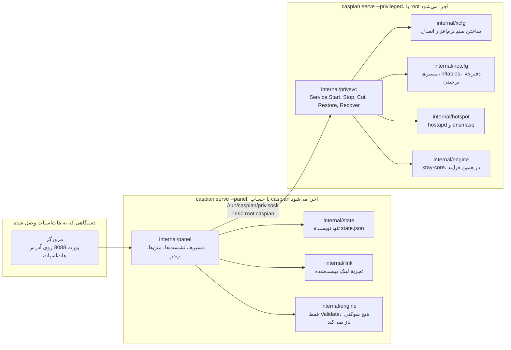
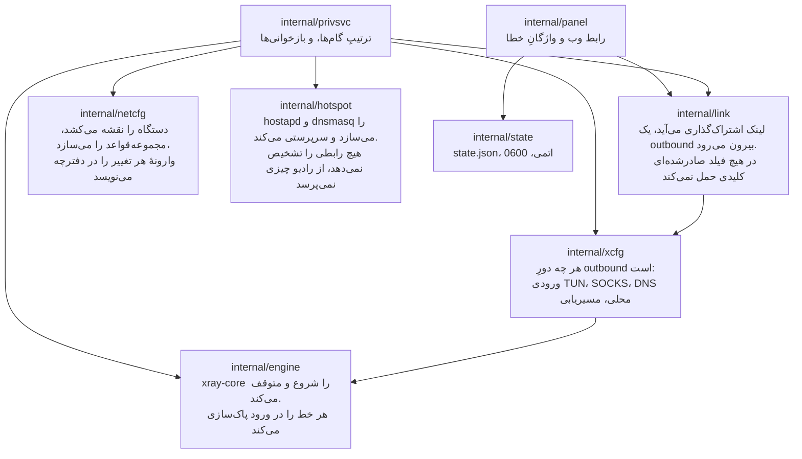
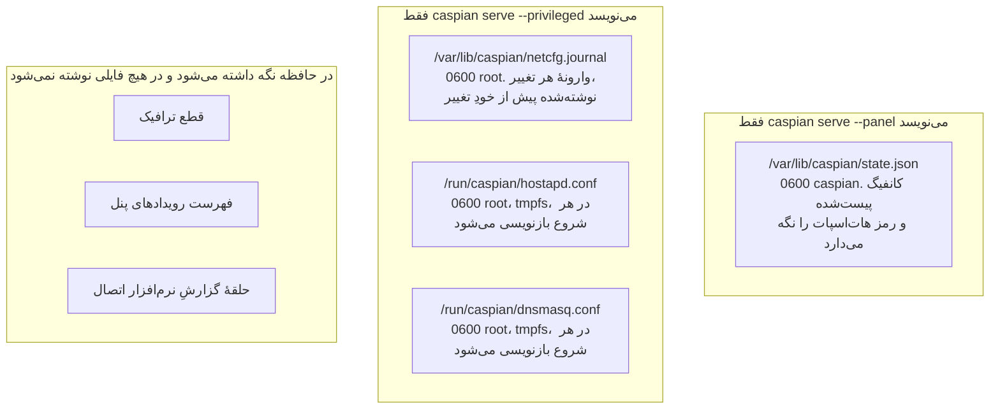
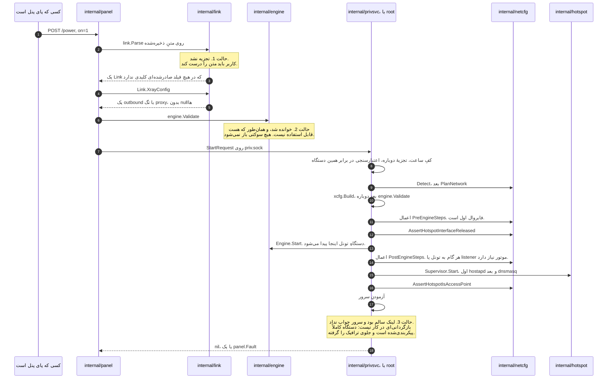
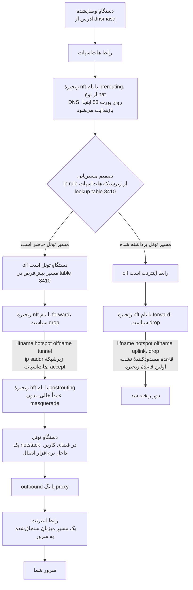
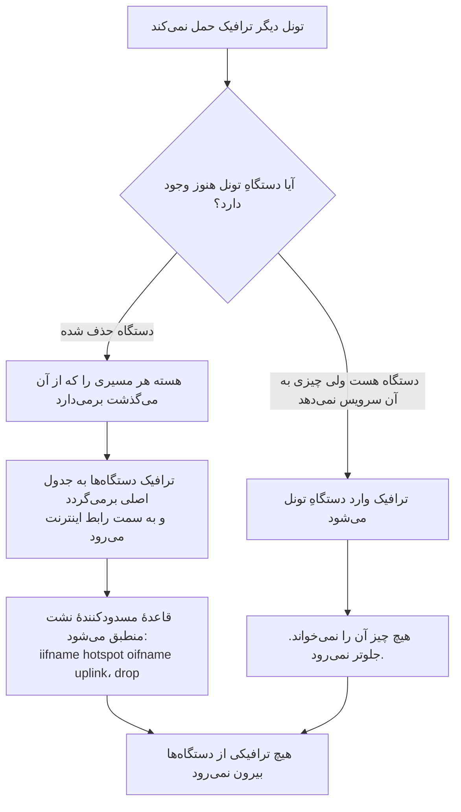
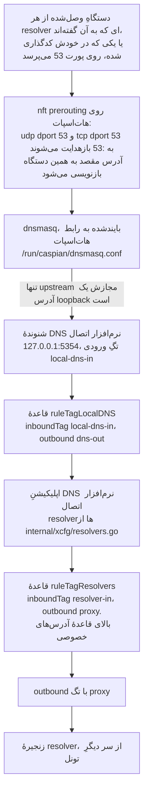
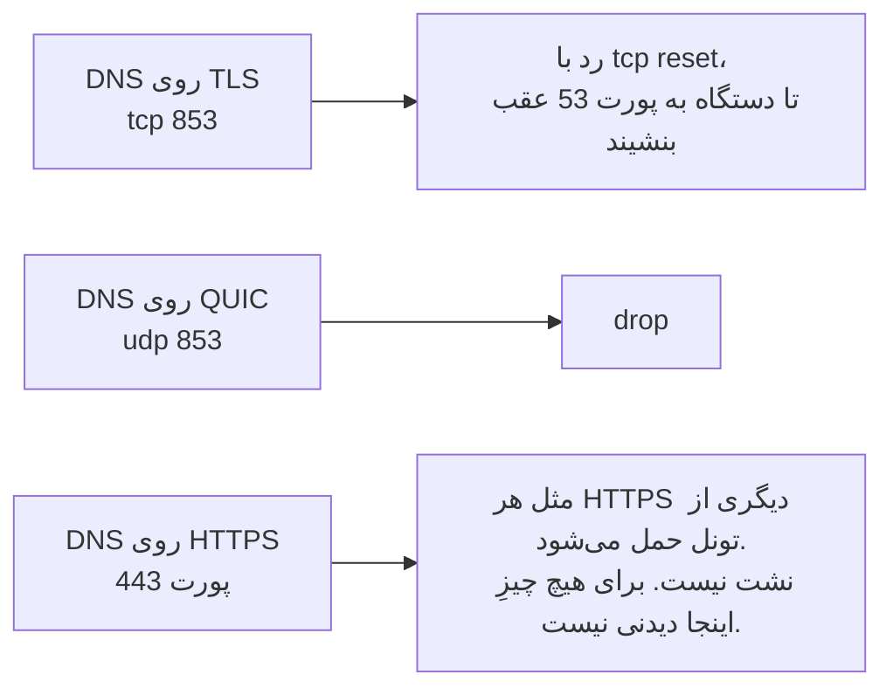

# معماری و جریان داده

[English](https://github.com/Iman/caspian/wiki/Architecture) | [فارسی](https://github.com/Iman/caspian/wiki/Architecture.fa) | [Русский](https://github.com/Iman/caspian/wiki/Architecture.ru) | [中文](https://github.com/Iman/caspian/wiki/Architecture.zh)

[ویکی کاسپین](https://github.com/Iman/caspian/wiki/Home.fa)

> این راهنما از README موجود منتقل شده است. تاریخ اندازه‌گیری‌ها همان تاریخ اصلی است؛ این جابه‌جایی گزارش اجرای تازهٔ آزمون‌ها نیست.
> [English](https://github.com/Iman/caspian/blob/108567a6a529be05b577ee68b65b48790f07e43d/README.md) | [فارسی](https://github.com/Iman/caspian/blob/108567a6a529be05b577ee68b65b48790f07e43d/README.fa.md) | [Русский](https://github.com/Iman/caspian/blob/108567a6a529be05b577ee68b65b48790f07e43d/README.ru.md) | [中文](https://github.com/Iman/caspian/blob/108567a6a529be05b577ee68b65b48790f07e43d/README.zh.md)

## معماری

### دو فرایند، یک فایل اجرایی

یک فایل اجرایی در دو نقش اجرا می‌شود، و زیرفرمان تعیین می‌کند کدام نقش. این
جدایی برای این هست که ایرادی در بخشی که ورودی کاربر را تجزیه می‌کند و HTTP سرو
می‌کند، ایرادی در بخشی که root را در دست دارد نباشد. [`docs/LAYOUT.md`](https://github.com/Iman/caspian/blob/main/docs/LAYOUT.md)، بخش
«Two processes, one binary»، بیانِ قطعیِ آن است.

[`cmd/caspian/main.go`](https://github.com/Iman/caspian/blob/main/cmd/caspian/main.go) این دو نقش را در متن راهنمای خودش چاپ می‌کند:

    caspian serve --privileged     root: routes, firewall, access point, engine
    caspian serve --panel          the caspian user: the web panel, nothing privileged

### سوکت، و اینکه چرا واژگانش بسته است

[`internal/panel/priv.go`](https://github.com/Iman/caspian/blob/main/internal/panel/priv.go) قاعده‌ای را که کل این جدایی برای آن هست می‌نویسد:
"A privileged helper that takes a path and an argument list from its client is
not a boundary; it is a way to run anything as root." یعنی: کمک‌کارِ ممتازی که
یک مسیر و یک فهرست آرگومان را از کلاینتش می‌گیرد، مرز نیست؛ راهی است برای اجرای
هر چیزی با دسترسی root. نقطه‌ویرگول از خودشان است. جمله عیناً نقل شده، چون
بازگفتِ یک قاعده، خودِ قاعده نیست.

پس پنل اصلاً نمی‌تواند «این را اجرا کن» را بیان کند. فقط می‌تواند یکی از هشت
کنش را نام ببرد، و سمت ممتاز تصمیم می‌گیرد هر کدام چه معنایی دارد.
`panel.Actions` همان مجموعهٔ بسته است، و
`TestActionVocabularyMatchesTheInterface` اگر متدی به رابط اضافه شود بی‌آنکه
نامی در آن فهرست بیاید، شکست می‌خورد.

| کنش | سمت ممتاز چه می‌کند | دستگاه را تغییر می‌دهد |
|---|---|---|
| `detect` | گزارش رابط‌ها، محدودیت‌های رادیو، و زیرشبکهٔ انتخاب‌شده | نه |
| `status` | گزارش فازِ نرم‌افزار اتصال، هات‌اسپات، و اینکه ترافیک قطع است یا نه | نه |
| `start` | بالا آوردن تونل و هات‌اسپات | بله |
| `stop` | پایین آوردن آن دو و بازپخش دفترچهٔ برچیدن | بله |
| `recover` | توقف، بازپخش دفترچه، بعد شروع دوباره از همان درخواست | بله |
| `engine-log` | برگرداندن خط‌های اخیرِ نرم‌افزار اتصال، از پیش پاک‌سازی‌شده | نه |
| `cut` | قطع ترافیکِ عبوریِ دستگاه‌ها و روشن ماندن باقی چیزها | بله |
| `restore` | برگرداندن ترافیک عبوریِ دستگاه‌ها | بله |

یک درخواست، یک پاسخ، یک اتصال. هر پیام یک طولِ 4 بایتیِ big-endian است و بعد
همان تعداد بایت JSON. طول، پیش از آنکه چیزی تخصیص یا تجزیه شود، در برابر
`maxFrameBytes` بررسی می‌شود، پس پیامی که بیش از اندازه بزرگ باشد فقط چهار بایت
و یک ردکردن خرج برمی‌دارد. فیلدهای ناشناختهٔ JSON نادیده گرفته نمی‌شوند، بلکه رد
می‌شوند. `protocolVersion` در هر درخواست بررسی می‌شود. پس پنلی از یک انتشار که
با سرویس ممتازِ انتشاری دیگر حرف بزند، یک ردکردنِ نام‌دار می‌گیرد، نه فیلدی که
بی‌سروصدا به مقدار صفرش رمزگشایی شده باشد.

در مسیرِ شکست هیچ چیز جز یک واژه برنمی‌گردد: یک `panel.Fault` از یک مجموعهٔ
بسته، یا یک `privsvc.Refusal` از مجموعهٔ بستهٔ دوم. متنِ خطای خودِ نرم‌افزار
اتصال کلیدِ کاربر را در خودش دارد، پس در سمت ممتاز ثبت و بعد دور ریخته می‌شود.
در پاسخ هیچ فیلدی نیست که بتواند در آن سفر کند.

### هر بسته مالکِ چیست

`internal/privsvc` به‌جای اعتماد به اینکه پنل این کار را کرده،
`StartRequest.ConfigJSON` را دوباره با `internal/link` تجزیه می‌کند. همچنین رابط
اینترنت را در برابر مسیرِ پیش‌فرضِ خودِ این دستگاه، رابط هات‌اسپات را در برابر
خروجیِ `iw list` خودِ این دستگاه، و کانال را در برابر آنچه رادیو قابل‌استفاده
اعلام کرده بررسی می‌کند.

### وضعیت کجا می‌ماند، و چه کسی آن را می‌نویسد

دو نویسنده، دو فایل، هیچ فایل مشترکی. هیچ‌کدام از دو فرایند فایلِ آن یکی را
نمی‌نویسد، پس نه قفلی لازم است و نه به‌روزرسانیِ گم‌شده‌ای هست که باید از آن
محافظت شود. [`docs/LAYOUT.md`](https://github.com/Iman/caspian/blob/main/docs/LAYOUT.md)، بخش «Who writes what»، این تصمیم و پیش‌نویسِ
قبلی‌ای را که وارونه کرد ثبت کرده است.

سمت ممتاز اصلاً هیچ فایل وضعیتی نمی‌خواند. هر چه لازم دارد در درخواستِ شروع
می‌آید. `TestPrivsvcReadsNoStateFile` کدِ خودِ آن بسته را پویش می‌کند و اگر روزی
فایلی بخواند شکست می‌خورد. یک کامنت چنین چیزی فراهم نمی‌کرد.

جدول کاملِ مسیرها، دسترسی‌ها و مالک‌ها در [`docs/LAYOUT.md`](https://github.com/Iman/caspian/blob/main/docs/LAYOUT.md) است. پورت‌ها هم
همان‌جا تثبیت شده‌اند: 53 برای DNS دستگاه‌ها روی هات‌اسپات، 5354 روی loopback
برای شنوندهٔ DNS نرم‌افزار اتصال، 8088 برای پنل، و 10808 روی loopback برای
ورودیِ SOCKS برای عیب‌یابی و پروکسی موقت سیستم در macOS.

## داده چگونه جریان می‌یابد

### یک لینکِ پیست‌شده به تونلی در حال کار تبدیل می‌شود

`startNow` در [`internal/panel/handlers.go`](https://github.com/Iman/caspian/blob/main/internal/panel/handlers.go) ترتیب را مستند می‌کند، و همین ترتیب
است که سه شکستِ کانفیگ را از هم جدا می‌کند. تا وقتی حالت 1 و حالت 2 هر دو با
موفقیت پشت سر گذاشته نشوند، به هیچ چیزِ روی دستگاه دست زده نمی‌شود.

سه نکته در آن توالی تعیین‌کننده‌اند.

سندِ نرم‌افزار اتصال دو بار و به دو دلیل ساخته می‌شود. `internal/link` فقط
outbound را می‌سازد و نه چیز دیگری. `internal/xcfg` هر چه دور آن است را
می‌سازد: ورودیِ TUN که ترافیک دستگاه‌ها از آن می‌آید، ورودیِ SOCKS روی loopback
برای عیب‌یابی و پروکسی موقت سیستم در macOS، شنوندهٔ محلیِ DNS، سیاستِ resolver،
و قواعد مسیریابی. هیچ‌کدام از این‌ها از چیزی
که فراخواننده فرستاده گرفته نمی‌شود.

شروعی که در میانهٔ راه شکست بخورد، کاملاً برگردانده می‌شود. دفترچه از پیش
وارونهٔ هر تغییر را دارد، و پیش از آنکه تغییر به هسته برسد روی دیسک نوشته شده
است. شروعی که شکست بخورد، دستگاه را همان‌طور که پیدایش کرده رها می‌کند.

سروری که جواب نمی‌دهد به معنی دستگاهی نیمه‌پیکربندی‌شده نیست. هر تغییری موفق
بوده، فایروال برقرار است، و ترافیک عبوریِ دستگاه‌ها بسته است چون تونل چیزی حمل
نمی‌کند. پس خطا گزارش می‌شود و هیچ چیز برچیده نمی‌شود.

### مسیرِ شبکه‌ایِ یک بستهٔ دستگاه‌ها

قاعدهٔ مسدودکنندهٔ نشت فقط نامِ هات‌اسپات و رابط اینترنت را می‌برد. وقتی تونل
برود نمی‌تواند از کار بیفتد، چون اصلاً نامی از تونل نبرده است. هر قاعده‌ای که به
ترافیک دستگاه‌ها اجازه می‌دهد نامِ تونل را می‌برد، پس آن قواعد دیگر منطبق
نمی‌شوند و سیاستِ زنجیره همه چیز را drop می‌کند.

هر رابط با نام تطبیق داده می‌شود و هرگز با شماره. شماره هنگام بارگذاریِ
مجموعه‌قواعد حل می‌شود، پس مجموعه‌قواعدی که تونل را با شماره نام ببرد وقتی تونل
پایین است بارگذاری نمی‌شود، و دقیقاً همان وقت است که باید برقرار باشد.

زنجیرهٔ postrouting عمداً خالی است. یک masquerade به سمتِ رابط اینترنت همان یک
خطی است که این دستگاه را بی‌سروصدا به یک روتر معمولی تبدیل می‌کند.

### ناپدید شدن تونل با آن مسیر چه می‌کند

اینکه کدام شاخه رخ می‌دهد روشن نشده است.
[`internal/netcfg/testdata/PROVENANCE.md`](https://github.com/Iman/caspian/blob/main/internal/netcfg/testdata/PROVENANCE.md) مشاهده‌ای از دستگاهِ هدف در تاریخ
2026-08-30 را ثبت کرده: در حالی که سرویس خاموش بود، `xray0` در فهرست دستگاه‌های
NetworkManager با وضعیت `connected (externally)` حاضر بود. هیچ چیز اینجا دلیلش
را روشن نکرد، و نرم‌افزار اتصال کدِ این پروژه نیست. هیچ‌کدام از دو شاخه نشت
نمی‌دهد، و هیچ‌کدام به دانستنِ اینکه کدام رخ می‌دهد وابسته نیست. به همین دلیل آن
قاعده طوری نوشته شد که فقط نامِ هات‌اسپات و رابط اینترنت را ببرد.

### مسیرِ DNS، که مسیرِ ترافیک نیست

این همان جایی است که مردم اشتباه می‌کنند. پرسشِ DNS یک دستگاه فقط اجازه داده
نمی‌شود. گرفته می‌شود.

چهار ویژگیِ آن زنجیره، و برای هر کدام چیزی که نگهش می‌دارد.

بازهدایت، مقصد را بازنویسی می‌کند، پس دستگاهی که resolver در خودش کدگذاری شده،
همین‌جا جواب می‌گیرد و اجازه ندارد بیرون برود تا به آنکه به آن گفته‌اند برسد.
سناریو: "a client cannot reach a resolver of its own choosing".

پیشنهادِ DHCP فقط همین دستگاه را نام می‌برد و هیچ resolver دیگری را. این سناریوی
خودش را می‌ارزد، چون غلط بودنش نامرئی است: بازهدایت به‌هرحال بسته‌ها را بازنویسی
می‌کند، پس هیچ چیز روی سیم غلط به نظر نمی‌رسد. سناریو: "the box offers itself as
the resolver and never names another".

`internal/hotspot` هر upstream ای برای dnsmasq که آدرس loopback نباشد را رد
می‌کند. مقصدی که loopback نباشد یعنی پرسشی که بیرون از تونل از دستگاه خارج
می‌شود، آن هم برای هر نامی که هر دستگاهی می‌پرسد. آنچه آنجا جواب می‌دهد شنوندهٔ
نرم‌افزار اتصال است، و `TestLocalDNSDefaultMatchesTheHotspotUpstream` اگر آن دو
پورت از هم فاصله بگیرند شکست می‌خورد. [`docs/LAYOUT.md`](https://github.com/Iman/caspian/blob/main/docs/LAYOUT.md) همین جفت را جفتی می‌نامد
که بی‌سروصدا خراب می‌شود: اگر آن دو از هم فاصله بگیرند، هر دستگاهِ وصل‌شده از
ترجمهٔ نام می‌افتد، در حالی که هات‌اسپات و تونل هر دو سالم به نظر می‌رسند.

قاعده‌ای که پرسش‌های خودِ resolver را به داخل تونل می‌فرستد، بالای قاعده‌ای است
که آدرس‌های خصوصی را مستقیم می‌فرستد. پس به resolver ای که روی آدرس خصوصی است هم
از راه تونل می‌رسند، نه از راه شبکهٔ محلی.
`TestLocalDNSQueriesCannotFallOutToTheUplink` و `TestPrivateRangesRouteDirect`
دو نیمهٔ آن را نگه می‌دارند.

خودِ زنجیرهٔ resolver سه اپراتور در سه حوزهٔ قضایی است: سرویس فیلترشدهٔ Quad9،
گونهٔ FAMILY از Cloudflare، و CleanBrowsing Security.
[`internal/xcfg/resolvers.go`](https://github.com/Iman/caspian/blob/main/internal/xcfg/resolvers.go) ثبت کرده هر کدام چرا انتخاب شده، و عمداً کدام آدرسِ
تقریباً یکسانِ همان اپراتور نیست. هیچ resolver گوگلی در هیچ پیش‌فرضی نمی‌آید، و
`TestNoGoogleAnywhereInGeneratedConfigs` هر سندِ تولیدشده را برای یافتن یکی از
آن‌ها پویش می‌کند.

به پورت‌های دیگر رسیدگی می‌شود، و به یکی از آن‌ها نمی‌شود رسیدگی کرد:

[English](https://github.com/Iman/caspian/blob/main/README.md) | [فارسی](https://github.com/Iman/caspian/blob/main/README.fa.md) | [Русский](https://github.com/Iman/caspian/blob/main/README.ru.md) | [中文](https://github.com/Iman/caspian/blob/main/README.zh.md)
