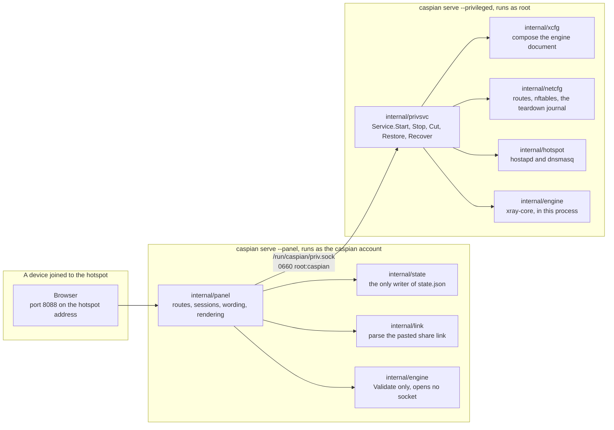
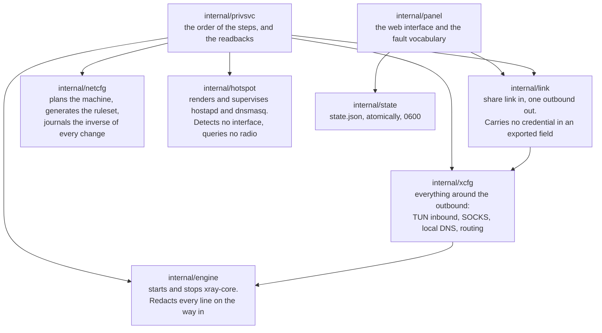
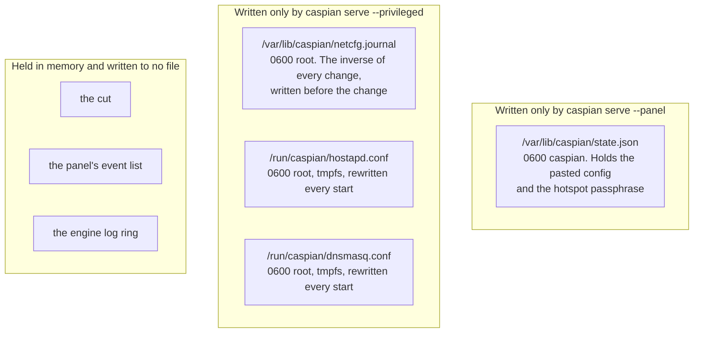
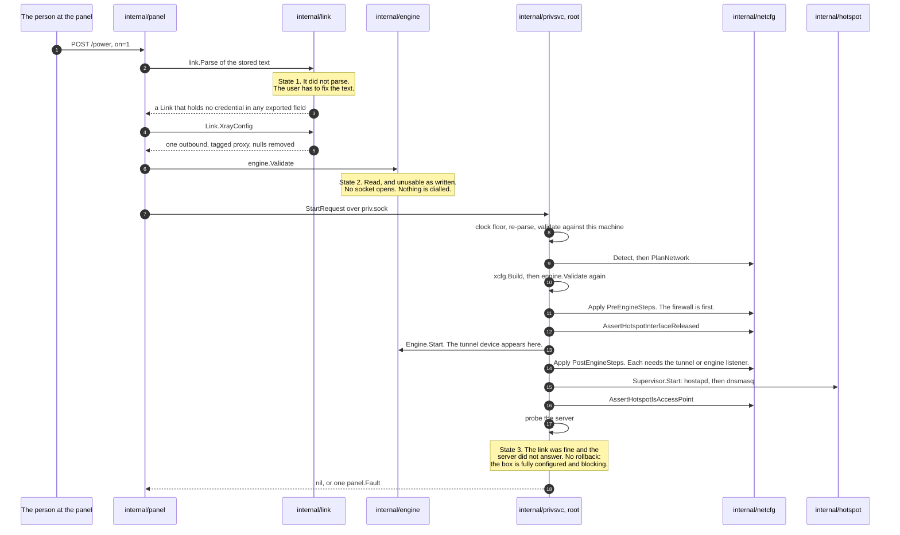
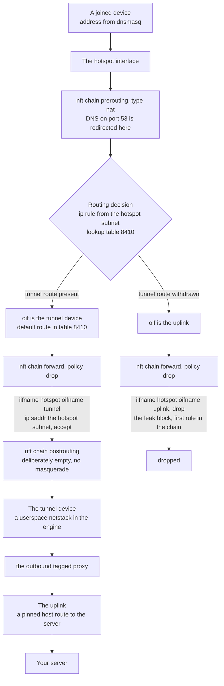
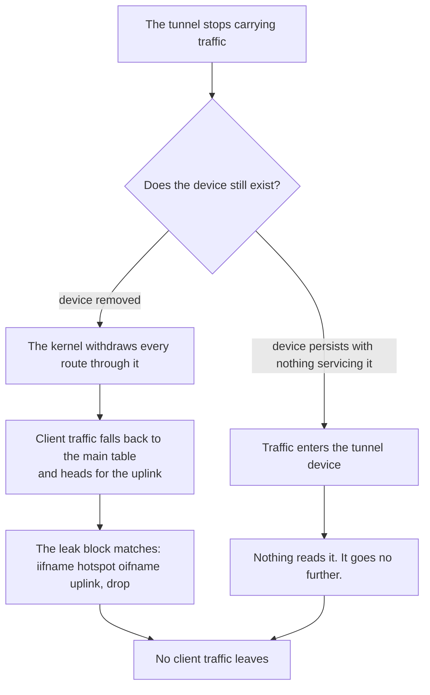
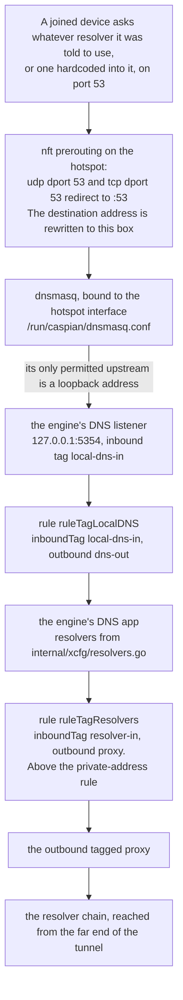
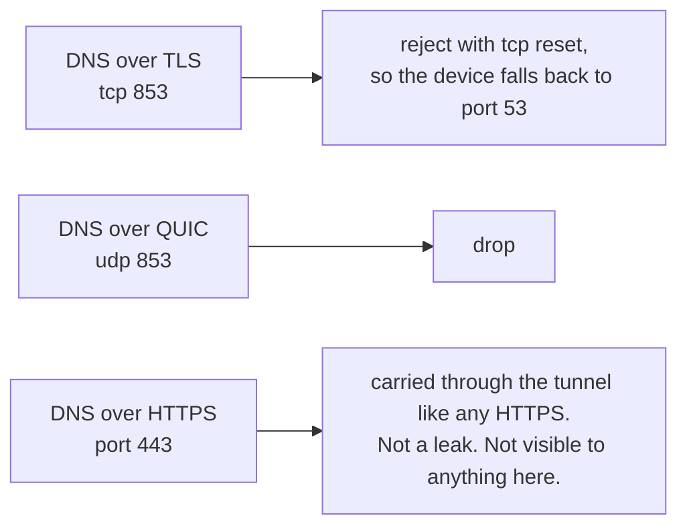

[English](https://github.com/Iman/caspian/wiki/Architecture) | [فارسی](https://github.com/Iman/caspian/wiki/Architecture.fa) | [Русский](https://github.com/Iman/caspian/wiki/Architecture.ru) | [中文](https://github.com/Iman/caspian/wiki/Architecture.zh) | [العربية](https://github.com/Iman/caspian/wiki/Architecture.ar) | [Türkçe](https://github.com/Iman/caspian/wiki/Architecture.tr) | [اردو](https://github.com/Iman/caspian/wiki/Architecture.ur)

# معماری و جریان داده ها

[ویکی کاسپین](https://github.com/Iman/caspian/wiki/Home.fa)

> این راهنما از README موجود می آید. اندازه گیری های آن تاریخ اصلی خود را حفظ می کند. این حرکت مستندسازی اجرای آزمایشی جدیدی را گزارش نمی‌کند.
> [English](https://github.com/Iman/caspian/blob/108567a6a529be05b577ee68b65b48790f07e43d/README.md) | [فارسی](https://github.com/Iman/caspian/blob/108567a6a529be05b577ee68b65b48790f07e43d/README.fa.md) | [Русский](https://github.com/Iman/caspian/blob/108567a6a529be05b577ee68b65b48790f07e43d/README.ru.md) | [中文](https://github.com/Iman/caspian/blob/108567a6a529be05b577ee68b65b48790f07e43d/README.zh.md)

## معماری

### دو فرآیند، یکی باینری

یک باینری در دو نقش اجرا می شود که توسط دستور فرعی انتخاب می شوند. شکاف وجود دارد به طوری که الف
خطا در بخشی که ورودی کاربر را تجزیه و تحلیل می کند و HTTP را ارائه می دهد یک نقص در قسمت نیست
بخشی که ریشه دارد [`docs/LAYOUT.md`](https://github.com/Iman/caspian/blob/main/docs/LAYOUT.md)، "دو فرآیند، یک باینری" است
بیانیه ثابت آن

[`cmd/caspian/main.go`](https://github.com/Iman/caspian/blob/main/cmd/caspian/main.go) دو نقش را در متن استفاده خود چاپ می کند:

caspian serve -- root privileged: routes, firewall, access point, engine
caspian serve --panel the caspian user: پنل وب، هیچ چیز ممتازی ندارد

### سوکت، و چرا واژگان بسته است

[`internal/panel/priv.go`](https://github.com/Iman/caspian/blob/main/internal/panel/priv.go) قاعده ای را بیان می کند که کل تقسیم برای آن وجود دارد: "الف
کمک کننده ممتازی که یک مسیر و لیست آرگومان را از مشتری خود می گیرد، نیست
یک مرز؛ این راهی برای اجرای هر چیزی به عنوان روت است." نقطه ویرگول مال آنهاست. را
جمله دقیقاً نقل شده است، زیرا نقل یک قاعده، قاعده نیست.

بنابراین پانل نمی تواند "اجرای این" را بیان کند. فقط می تواند یکی از هشت عمل را نام برد،
و طرف ممتاز تصمیم می گیرد که منظور هر کدام چیست. `panel.Actions` این است
مجموعه بسته شد، و اگر یک روش وجود داشته باشد، `TestActionVocabularyMatchesTheInterface` با شکست مواجه می شود
بدون نام در لیست به رابط اضافه شده است.

| اقدام | کاری که طرف ممتاز انجام می دهد | دستگاه را عوض می کند |
|---|---|---|
| `detect` | رابط ها، محدودیت های رادیو و زیرشبکه انتخابی را گزارش کنید | نه |
| `status` | فاز موتور، هات اسپات و قطع شدن ترافیک را گزارش دهید | نه |
| `start` | تونل و هات اسپات را بالا بیاورید | بله |
| `stop` | آنها را پایین بیاورید و ژورنال پارگی را دوباره پخش کنید | بله |
| `recover` | توقف کنید، ژورنال را دوباره پخش کنید، سپس دوباره از همان درخواست شروع کنید | بله |
| `engine-log` | خطوط اخیر موتور را که قبلاً ویرایش شده است برگردانید | نه |
| `cut` | ترافیک ارسال‌شده مشتری را رها کنید و بقیه موارد را در حال اجرا بگذارید | بله |
| `restore` | ترافیک ارسال شده مشتری را برگردانید | بله |

یک درخواست، یک پاسخ، یک اتصال. یک پیام یک 4 بایتی بزرگ است
طول و به دنبال آن تعداد زیادی بایت JSON. طول در برابر بررسی می شود
`maxFrameBytes` قبل از تخصیص یا تجزیه هر چیزی، بنابراین یک پیام بزرگ
هزینه چهار بایت و یک رد. فیلدهای JSON ناشناخته رد می شوند
نادیده گرفته شده است. `protocolVersion` در هر درخواست بررسی می شود. بنابراین یک پانل از یک
رهایی از صحبت کردن با یک سرویس ممتاز از طرف دیگر، یک امتناع نامی دریافت می کند،
به جای یک فیلد که در سکوت به عنوان مقدار صفر آن رمزگشایی می شود.

هیچ چیز در مسیر شکست به عقب بر نمی گردد به جز یک کلمه: `panel.Fault` از
یک مجموعه بسته، یا یک `privsvc.Refusal` از مجموعه بسته دوم. مال موتوره
متن خطا مطالب کلیدی کاربر را جاسازی می کند، بنابراین در ممتاز وارد می شود
طرف و افتاد. هیچ فیلدی در مورد پاسخی که می تواند در آن سفر کند وجود ندارد.

### چه کسی صاحب کدام بسته است

`internal/privsvc` `StartRequest.ConfigJSON` را با `internal/link` دوباره تجزیه می کند
به جای اعتماد به پنل که این کار را انجام داده است. اینترنت رو هم چک میکنه
رابط در برابر مسیر پیش فرض خود این دستگاه، رابط نقطه اتصال
در برابر خروجی `iw list` خود این دستگاه و کانال در برابر آنچه که
رادیو به عنوان قابل استفاده گزارش شد.

### ایالت کجا زندگی می کند و چه کسی آن را می نویسد

دو نویسنده، دو فایل، بدون فایل مشترک. هیچ یک از فرآیندهای دیگر را نمی نویسد، بنابراین
هیچ قفل و به روز رسانی گم شده ای برای محافظت وجود ندارد. [`docs/LAYOUT.md`](https://github.com/Iman/caspian/blob/main/docs/LAYOUT.md)، "چه کسی
می نویسد چه»، تصمیم را ثبت می کند و پیش نویس قبلی آن را معکوس می کند.

طرف ممتاز اصلاً هیچ پرونده ایالتی را نمی خواند. هر چیزی که نیاز دارد وارد می شود
درخواست شروع `TestPrivsvcReadsNoStateFile` منبع خود بسته را اسکن می کند
و اگر یک مورد را بخواند، شکست می خورد، که نظر ارائه نمی کرد.

جدول کامل مسیرها، حالت‌ها و مالکان در [`docs/LAYOUT.md`](https://github.com/Iman/caspian/blob/main/docs/LAYOUT.md) است. پورت ها هستند
در آنجا نیز ثابت شد: 53 برای DNS مشتری در هات اسپات، 5354 در Loopback برای
شنونده DNS موتور، 8088 برای پنل، 10808 در Loopback برای
تشخیص SOCKS ورودی.

## نحوه جریان داده ها

### پیوند اشتراک گذاری چسبانده شده به یک تونل در حال اجرا تبدیل می شود

`startNow` در [`internal/panel/handlers.go`](https://github.com/Iman/caspian/blob/main/internal/panel/handlers.go) سفارش را مستند می کند و سفارش
چه چیزی سه شکست پیکربندی را از هم جدا می کند. هیچ چیز روی دستگاه لمس نمی شود
تا حالت 1 و حالت 2 هر دو بگذرند.

سه جزئیات در آن دنباله تحمل بار هستند.

سند موتور دو بار به دلایل مختلف تنظیم می شود. `internal/link`
خروجی را تولید می کند و هیچ چیز دیگری. `internal/xcfg` همه چیز را تولید می کند
اطراف آن: ورودی TUN که ترافیک مشتری به آن می رسد، حلقه بک SOCKS
ورودی توسط عیب‌یابی و پروکسی موقت سیستم macOS، DNS محلی استفاده می‌شود
شنونده، خط مشی حل کننده و قوانین مسیریابی.
هیچ کدام از آن چیزی که تماس گیرنده فرستاده گرفته نمی شود.

شروعی که تا حدی با شکست مواجه شود، کاملاً لغو می شود. مجله قبلا
معکوس هر تغییری را نگه می دارد که قبل از رسیدن تغییر به دیسک نوشته شده است
هسته شروعی که با شکست مواجه می شود، دستگاه را همانگونه که پیدا شده است، رها می کند.

سروری که جواب نمی دهد یک جعبه نیمه کاربردی نیست. هر تغییری موفقیت آمیز بود،
فایروال فعال است و ترافیک مشتری ارسال شده مسدود شده است زیرا
تونل چیزی حمل نمی کند بنابراین عیب گزارش می شود و چیزی پاره نمی شود.

### مسیر شبکه بسته مشتری

بلوک نشت فقط هات اسپات و لینک بالا را نام می برد. نمی تواند کار را متوقف کند
هنگامی که تونل می رود، زیرا در آن اشاره ای به تونل نمی شود. هر قانون که
اجازه می دهد که ترافیک مشتری تونل را نامگذاری کند، بنابراین این قوانین مطابقت ندارند و
سیاست همه چیز را رها می کند.

هر رابط با نام و هرگز با فهرست مطابقت داده می شود. یک شاخص زمانی حل می شود که
مجموعه قوانین بارگذاری می شود، بنابراین مجموعه قوانینی که تونل را بر اساس شاخص نامگذاری می کند، نمی تواند در حالی که بارگذاری شود
تونل خراب است، دقیقاً زمانی که باید راه اندازی شود.

زنجیره postrouting عمدا خالی است. بالماسکه به سمت بالا لینک است
خط واحدی که دستگاه را بی سر و صدا به یک روتر معمولی تبدیل می کند.

### ناپدید شدن تونل با آن مسیر چه می کند

کدام شاخه اتفاق می افتد تسویه حساب نمی شود. [`internal/netcfg/testdata/PROVENANCE.md`](https://github.com/Iman/caspian/blob/main/internal/netcfg/testdata/PROVENANCE.md)
مشاهده ای از هدف را در 30/08/2026 ثبت می کند: `xray0` در
لیست دستگاه های NetworkManager با خاموش بودن سرویس، به عنوان
`connected (externally)`. هیچ چیز در اینجا مشخص نکرد که چرا، و موتور نیست
کد این پروژه هیچ یک از شاخه ها نشت نمی کند و هیچ کدام به دانستن کدام یک بستگی ندارد
یکی اتفاق می افتد به همین دلیل است که بلوک فقط برای نامگذاری هات اسپات و the نوشته شده است
آپلینک

### مسیر DNS که مسیر ترافیک نیست

این قسمتی است که مردم اشتباه می کنند. سؤال DNS یک مشتری صرفاً نیست
مجاز است. گرفته می شود.

چهار خاصیت از آن زنجیره، هر کدام با چیزی که آن را نگه می دارد.

تغییر مسیر، مقصد را بازنویسی می‌کند، بنابراین دستگاهی با یک حل‌کننده کدگذاری شده است
در اینجا به جای اینکه اجازه داده شود به کسی که به آن گفته شده است برسد، پاسخ داده می شود
استفاده کنید. سناریو: "یک مشتری نمی تواند به حل کننده ای که خودش انتخاب کرده است برسد".

پیشنهاد DHCP یک بار این کادر را نامگذاری می کند و هیچ حل کننده دیگری وجود ندارد. که ارزش خودش را دارد
این سناریو به این دلیل است که اشتباه گرفتن آن نامرئی است: تغییر مسیر باعث بازنویسی مجدد می شود
به هر حال بسته ها، بنابراین هیچ چیز روی سیم اشتباه به نظر نمی رسد. سناریو: "جعبه
خود را به عنوان حل کننده عرضه می کند و هرگز از دیگری نام نمی برد».

`internal/hotspot` هرگونه dnsmasq بالادستی را که آدرس حلقه بک نباشد، رد می کند.
یک هدف غیرحلقه‌ای، درخواستی است که جعبه را خارج از تونل می‌گذارد
هر نامی که هر مشتری می خواهد شنونده موتور اونجا جواب میده
و `TestLocalDNSDefaultMatchesTheHotspotUpstream` در صورت جابجایی دو پورت از کار می افتد.
[`docs/LAYOUT.md`](https://github.com/Iman/caspian/blob/main/docs/LAYOUT.md) جفتی که بی سر و صدا می شکند را فراخوانی می کند: اگر این دو
رانش، هر دستگاه متصل شده در حالی که هات اسپات و تونل هر دو حل نمی شوند
سالم به نظر برسند

قاعده‌ای که درخواست‌های خود حل‌کننده را به داخل تونل ارسال می‌کند، بالاتر از آن قرار دارد
قانونی که آدرس های خصوصی را مستقیما ارسال می کند. بنابراین یک حل کننده در یک آدرس خصوصی است
هنوز از طریق تونل به جای شبکه محلی رسیده است.
`TestLocalDNSQueriesCannotFallOutToTheUplink` و `TestPrivateRangesRouteDirect`
دو نیمه را نگه دارید

خود زنجیره حل‌کننده سه اپراتور در سه حوزه قضایی است: Quad9
سرویس فیلتر شده، نوع Cloudflare FAMILY و CleanBrowsing Security.
[`internal/xcfg/resolvers.go`](https://github.com/Iman/caspian/blob/main/internal/xcfg/resolvers.go) چرایی هر کدام و تقریباً یکسان را ثبت می کند
آدرس همان اپراتور عمدا نیست. هیچ Google Resolver ظاهر نمی شود
در هر پیش‌فرض، و `TestNoGoogleAnywhereInGeneratedConfigs` هر کدام را اسکن می‌کند
سند تولید شده برای یک

سایر پورت ها مدیریت می شوند و یکی از آنها نمی تواند:

<!-- Caspian guide navigation -->

راهنماهای کاسپین: [راه اندازی و پروتکل های پشتیبانی شده](https://github.com/Iman/caspian/wiki/Home.fa) · [جعل SNI برای دور زدن DPI: راه اندازی و محدودیت ها](https://github.com/Iman/caspian/wiki/SNI-Spoofing.fa).

<!-- English-source-sha256: 07a2e0584db74a162eb7938428d733054b00788748889213f96e0e0679d0f650 -->
