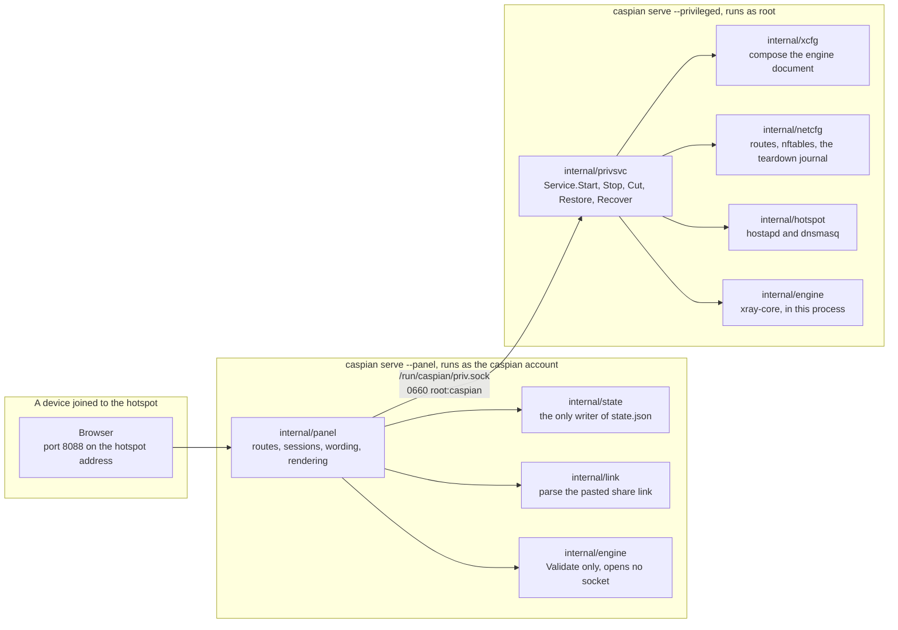
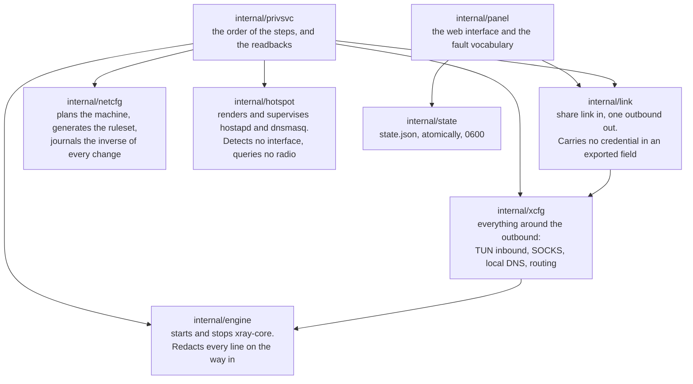
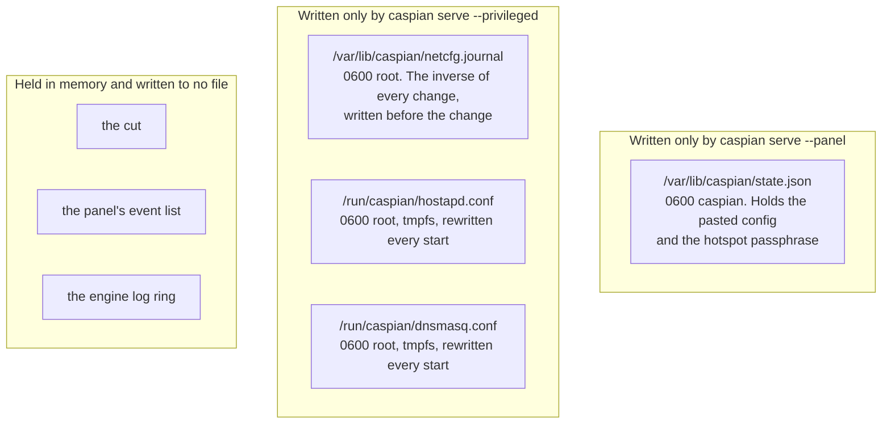
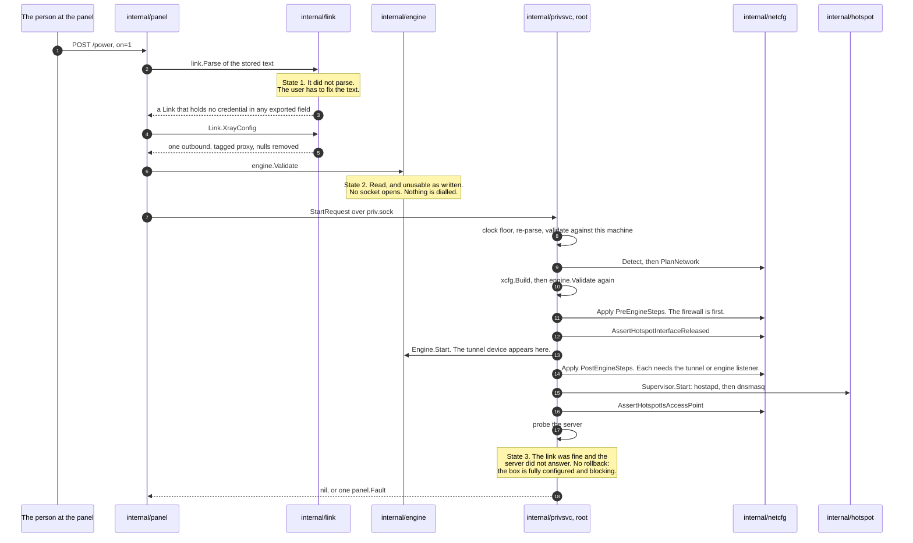
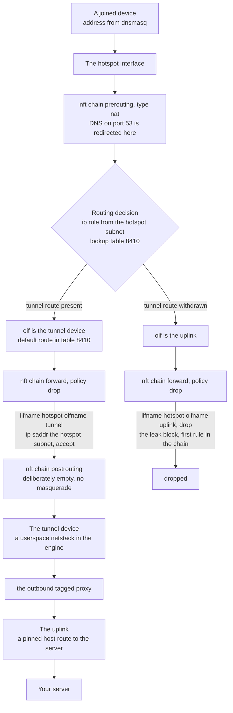
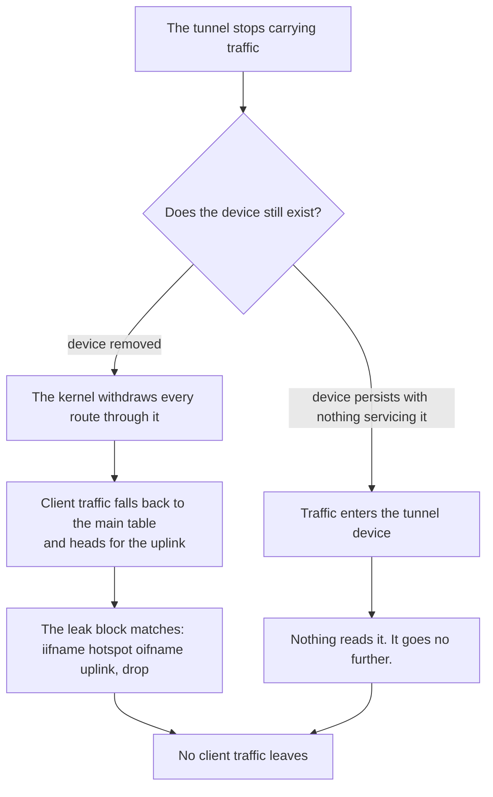
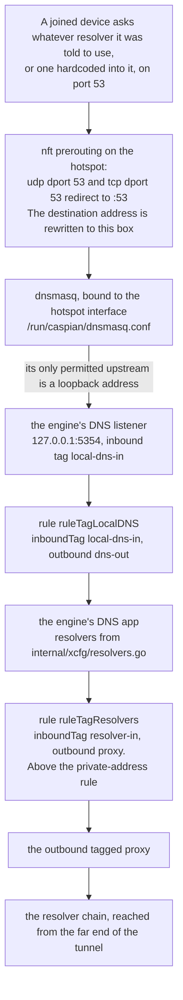
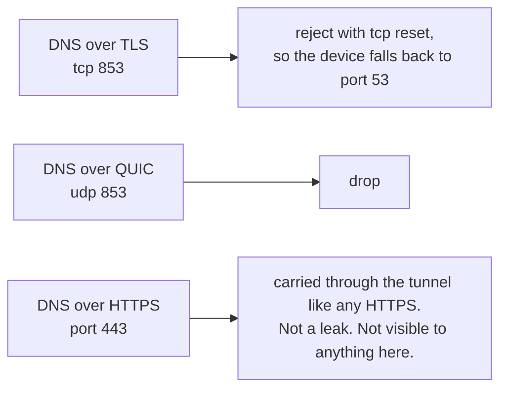

# Architecture and data flow

[English](https://github.com/Iman/caspian/wiki/Architecture) | [فارسی](https://github.com/Iman/caspian/wiki/Architecture.fa) | [Русский](https://github.com/Iman/caspian/wiki/Architecture.ru) | [中文](https://github.com/Iman/caspian/wiki/Architecture.zh)

[Caspian wiki](https://github.com/Iman/caspian/wiki/Home)

> This guide comes from the existing README. Its measurements retain their original dates; this documentation move does not report a new test run.
> [English](https://github.com/Iman/caspian/blob/108567a6a529be05b577ee68b65b48790f07e43d/README.md) | [فارسی](https://github.com/Iman/caspian/blob/108567a6a529be05b577ee68b65b48790f07e43d/README.fa.md) | [Русский](https://github.com/Iman/caspian/blob/108567a6a529be05b577ee68b65b48790f07e43d/README.ru.md) | [中文](https://github.com/Iman/caspian/blob/108567a6a529be05b577ee68b65b48790f07e43d/README.zh.md)

## Architecture

### Two processes, one binary

One binary runs in two roles, chosen by subcommand. The split exists so that a
fault in the part that parses user input and serves HTTP is not a fault in the
part that holds root. [`docs/LAYOUT.md`](https://github.com/Iman/caspian/blob/main/docs/LAYOUT.md), "Two processes, one binary", is the
fixed statement of it.

[`cmd/caspian/main.go`](https://github.com/Iman/caspian/blob/main/cmd/caspian/main.go) prints the two roles in its own usage text:

    caspian serve --privileged     root: routes, firewall, access point, engine
    caspian serve --panel          the caspian user: the web panel, nothing privileged

### The socket, and why the vocabulary is closed

[`internal/panel/priv.go`](https://github.com/Iman/caspian/blob/main/internal/panel/priv.go) states the rule the whole split exists for: "A
privileged helper that takes a path and an argument list from its client is not
a boundary; it is a way to run anything as root." The semicolon is theirs. The
sentence is quoted exactly, because a paraphrase of a rule is not the rule.

So the panel cannot express "run this". It can only name one of eight actions,
and the privileged side decides what each one means. `panel.Actions` is that
closed set, and `TestActionVocabularyMatchesTheInterface` fails if a method is
added to the interface without a name in the list.

| Action | What the privileged side does | Changes the machine |
|---|---|---|
| `detect` | Report the interfaces, the radio's limits, and the chosen subnet | no |
| `status` | Report the engine phase, the hotspot, and whether traffic is cut | no |
| `start` | Bring the tunnel and the hotspot up | yes |
| `stop` | Take them down and replay the teardown journal | yes |
| `recover` | Stop, replay the journal, then start again from the same request | yes |
| `engine-log` | Return the engine's recent lines, already redacted | no |
| `cut` | Drop forwarded client traffic and leave everything else running | yes |
| `restore` | Put forwarded client traffic back | yes |

One request, one response, one connection. A message is a 4-byte big-endian
length followed by that many bytes of JSON. The length is checked against
`maxFrameBytes` before anything is allocated or parsed, so an oversized message
costs four bytes and a refusal. Unknown JSON fields are refused rather than
ignored. `protocolVersion` is checked on every request. So a panel from one
release talking to a privileged service from another gets a named refusal,
instead of a field silently decoded as its zero value.

Nothing crosses back on the failure path except one word: a `panel.Fault` from
a closed set, or a `privsvc.Refusal` from a second closed set. The engine's own
error text embeds the user's key material, so it is logged on the privileged
side and dropped. There is no field on the response it could travel in.

### Who owns which package

`internal/privsvc` re-parses `StartRequest.ConfigJSON` with `internal/link`
rather than trusting the panel to have done it. It also checks the internet
interface against this machine's own default route, the hotspot interface
against this machine's own `iw list` output, and the channel against what the
radio reported as usable.

### Where state lives, and who writes it

Two writers, two files, no shared file. Neither process writes the other's, so
there is no lock and no lost update to protect against. [`docs/LAYOUT.md`](https://github.com/Iman/caspian/blob/main/docs/LAYOUT.md), "Who
writes what", records the decision and the earlier draft it reversed.

The privileged side reads no state file at all. Everything it needs arrives in
the start request. `TestPrivsvcReadsNoStateFile` scans that package's own source
and fails if it ever reads one, which a comment would not have provided.

The full table of paths, modes and owners is in [`docs/LAYOUT.md`](https://github.com/Iman/caspian/blob/main/docs/LAYOUT.md). The ports are
fixed there too: 53 for client DNS on the hotspot, 5354 on loopback for the
engine's DNS listener, 8088 for the panel, 10808 on loopback for the
diagnostics SOCKS inbound.

## How data flows

### A pasted share link becomes a running tunnel

`startNow` in [`internal/panel/handlers.go`](https://github.com/Iman/caspian/blob/main/internal/panel/handlers.go) documents the order, and the order is
what tells the three config failures apart. Nothing on the machine is touched
until state 1 and state 2 have both passed.

Three details in that sequence are load bearing.

The engine document is composed twice for different reasons. `internal/link`
produces the outbound and nothing else. `internal/xcfg` produces everything
around it: the TUN inbound that client traffic arrives on, the loopback SOCKS
inbound used by diagnostics and the interim macOS system proxy, the local DNS
listener, the resolver policy, and the routing rules.
None of that is taken from anything the caller sent.

A start that fails part way through is undone completely. The journal already
holds the inverse of every change, written to disk before the change reached the
kernel. A start that fails leaves the machine as it was found.

A server that does not answer is not a half-applied box. Every change succeeded,
the firewall is in force, and forwarded client traffic is blocked because the
tunnel carries nothing. So the fault is reported and nothing is torn down.

### The network path of a client packet

The leak block names only the hotspot and the uplink. It cannot stop working
when the tunnel goes, because it does not mention the tunnel. Every rule that
permits client traffic does name the tunnel, so those rules stop matching and
the policy drops everything.

Every interface is matched by name and never by index. An index is resolved when
the ruleset loads, so a ruleset naming the tunnel by index cannot load while the
tunnel is down, which is exactly when it has to be in force.

The postrouting chain is empty on purpose. A masquerade towards the uplink is
the single line that would quietly turn the appliance into an ordinary router.

### What the tunnel disappearing does to that path

Which branch happens is not settled. [`internal/netcfg/testdata/PROVENANCE.md`](https://github.com/Iman/caspian/blob/main/internal/netcfg/testdata/PROVENANCE.md)
records an observation from the target on 2026-08-30: `xray0` was present in
NetworkManager's device list with the service switched off, as
`connected (externally)`. Nothing here established why, and the engine is not
this project's code. Neither branch leaks, and neither depends on knowing which
one happens. That is why the block was written to name only the hotspot and the
uplink.

### The DNS path, which is not the traffic path

This is the part people get wrong. A client's DNS question is not merely
permitted. It is taken.

Four properties of that chain, each with the thing that holds it.

The redirect rewrites the destination, so a device with a resolver hardcoded
into it is answered here rather than allowed out to reach the one it was told to
use. Scenario: "a client cannot reach a resolver of its own choosing".

The DHCP offer names this box once and no other resolver. That is worth its own
scenario because getting it wrong is invisible: the redirect would rewrite the
packets anyway, so nothing on the wire would look wrong. Scenario: "the box
offers itself as the resolver and never names another".

`internal/hotspot` refuses any dnsmasq upstream that is not a loopback address.
A non-loopback target would be a query leaving the box outside the tunnel, for
every name every client asks for. The engine's listener is what answers there,
and `TestLocalDNSDefaultMatchesTheHotspotUpstream` fails if the two ports drift.
[`docs/LAYOUT.md`](https://github.com/Iman/caspian/blob/main/docs/LAYOUT.md) calls that pairing the one that breaks quietly: if the two
drift, every joined device stops resolving while the hotspot and the tunnel both
look healthy.

The rule that sends the resolver's own queries into the tunnel sits above the
rule that sends private addresses direct. So a resolver on a private address is
still reached through the tunnel rather than on the local network.
`TestLocalDNSQueriesCannotFallOutToTheUplink` and `TestPrivateRangesRouteDirect`
hold the two halves.

The resolver chain itself is three operators in three jurisdictions: Quad9's
filtered service, the Cloudflare FAMILY variant, and CleanBrowsing Security.
[`internal/xcfg/resolvers.go`](https://github.com/Iman/caspian/blob/main/internal/xcfg/resolvers.go) records why each one, and which nearly identical
address of the same operator it is deliberately not. No Google resolver appears
in any default, and `TestNoGoogleAnywhereInGeneratedConfigs` scans every
generated document for one.

The other ports are handled and one of them cannot be:

[English](https://github.com/Iman/caspian/blob/main/README.md) | [فارسی](https://github.com/Iman/caspian/blob/main/README.fa.md) | [Русский](https://github.com/Iman/caspian/blob/main/README.ru.md) | [中文](https://github.com/Iman/caspian/blob/main/README.zh.md)
