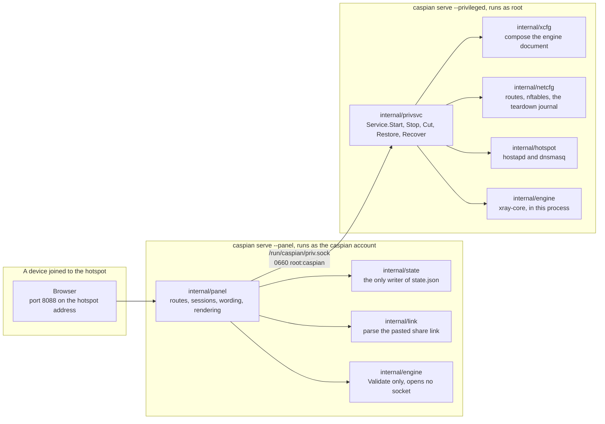
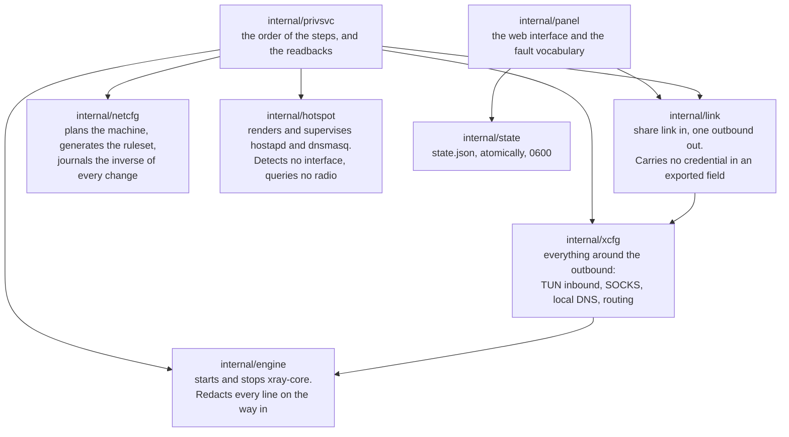
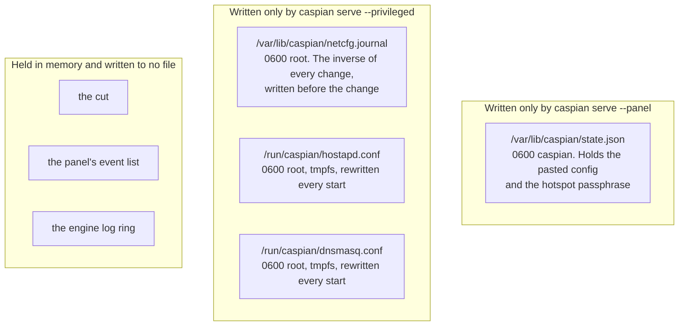
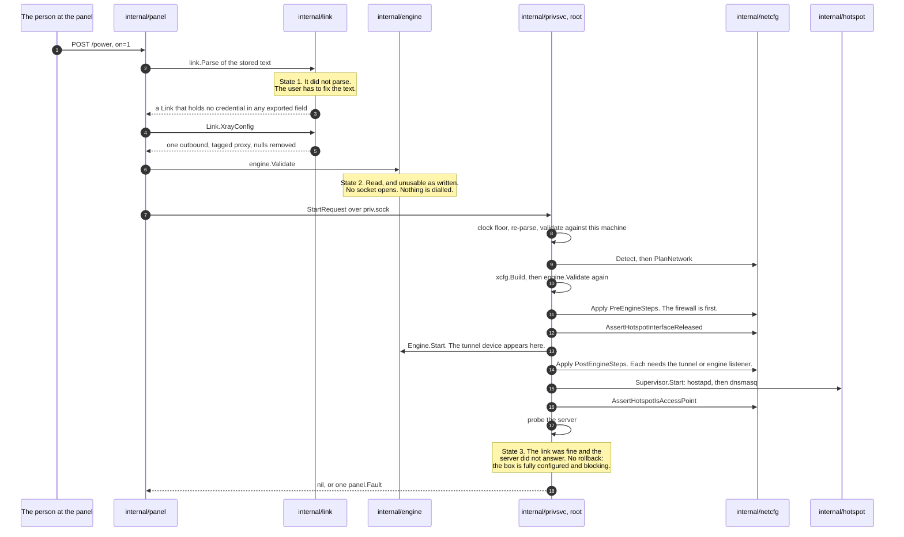
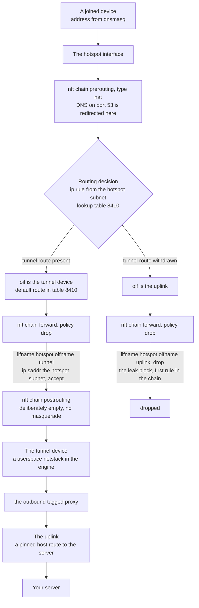
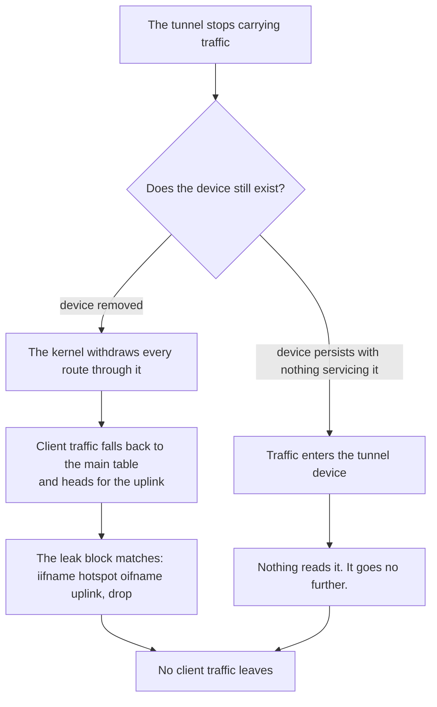
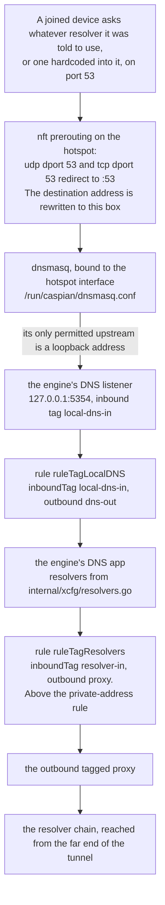
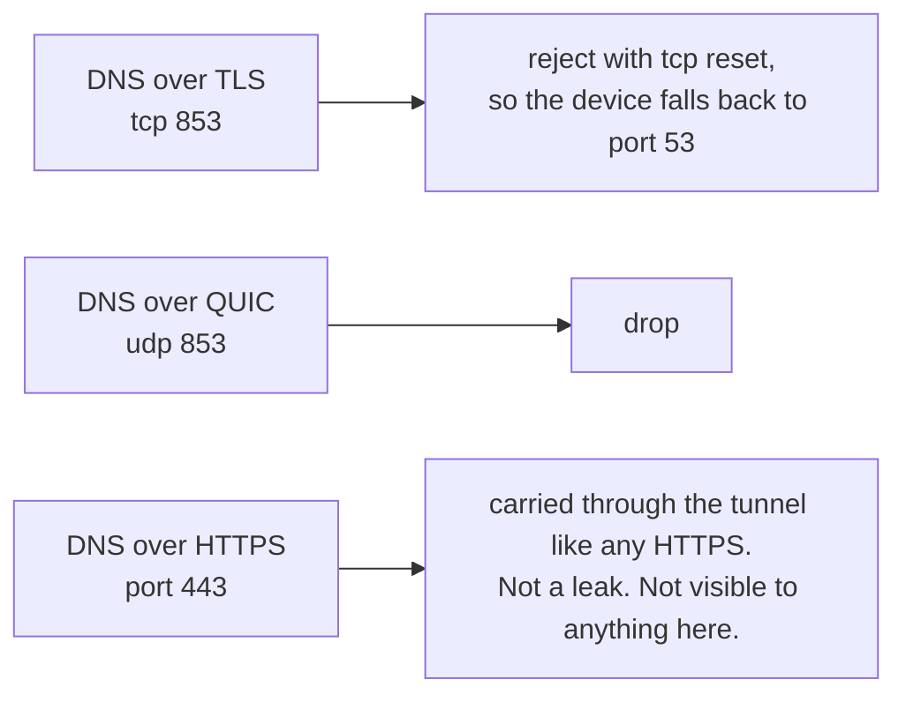

<!-- wiki-navigation:start -->

[English](https://github.com/Iman/caspian/wiki/Architecture) · [فارسی](https://github.com/Iman/caspian/wiki/Architecture.fa) · [**Русский**](https://github.com/Iman/caspian/wiki/Architecture.ru) · [简体中文](https://github.com/Iman/caspian/wiki/Architecture.zh) · [العربية](https://github.com/Iman/caspian/wiki/Architecture.ar) · [Türkçe](https://github.com/Iman/caspian/wiki/Architecture.tr) · [اردو](https://github.com/Iman/caspian/wiki/Architecture.ur)

[Вики Caspian](https://github.com/Iman/caspian/wiki/Home.ru) · [Устранение неполадок](https://github.com/Iman/caspian/wiki/Troubleshooting.ru)

<!-- wiki-navigation:end -->

# Архитектура и поток данных

> Это руководство взято из существующего README. Его измерения сохраняют свои первоначальные даты; этот шаг документации не сообщает о новом тестовом запуске.
> [English](https://github.com/Iman/caspian/blob/108567a6a529be05b577ee68b65b48790f07e43d/README.md) | [فارسی](https://github.com/Iman/caspian/blob/108567a6a529be05b577ee68b65b48790f07e43d/README.fa.md) | [Русский](https://github.com/Iman/caspian/blob/108567a6a529be05b577ee68b65b48790f07e43d/README.ru.md) | [中文](https://github.com/Iman/caspian/blob/108567a6a529be05b577ee68b65b48790f07e43d/README.zh.md)

## Архитектура

### Два процесса, один двоичный файл

Один двоичный файл выполняется в двух ролях, выбираемых подкомандой. Раскол существует так, что
ошибка в части, которая анализирует пользовательский ввод и обслуживает HTTP, не является ошибкой в
часть, удерживающая корень. [`docs/LAYOUT.md`](https://github.com/Iman/caspian/blob/main/docs/LAYOUT.md), «Два процесса, один двоичный файл», — это
фиксированное заявление об этом.

[`cmd/caspian/main.go`](https://github.com/Iman/caspian/blob/main/cmd/caspian/main.go) печатает две роли в своем собственном тексте использования:

каспийская служба --привилегированный корень: маршруты, брандмауэр, точка доступа, движок
каспийский сервис --panel пользователь каспийского: веб-панель, без привилегий

### Розетка, и почему словарь закрыт

[`internal/panel/priv.go`](https://github.com/Iman/caspian/blob/main/internal/panel/priv.go) устанавливает правило, по которому существует все разделение: «A
привилегированный помощник, который принимает путь и список аргументов от своего клиента, не является
граница; это способ запустить что-либо с правами root». Точка с запятой принадлежит им.
предложение цитируется точно, потому что перефразирование правила не является правилом.

Таким образом, комиссия не может сказать «запустите это». Он может назвать только одно из восьми действий,
и привилегированная сторона решает, что означает каждый из них. `panel.Actions` это
закрытый набор, и `TestActionVocabularyMatchesTheInterface` завершается с ошибкой, если метод
добавлен в интерфейс без имени в списке.

| Действие | Что делает привилегированная сторона | Меняет машину |
|---|---|---|
| `detect` | Сообщите об интерфейсах, ограничениях радиосвязи и выбранной подсети. | нет |
| `status` | Сообщайте о фазе двигателя, точке доступа и о том, отключен ли трафик. | нет |
| `start` | Поднимите туннель и точку доступа. | да |
| `stop` | Уничтожьте их и просмотрите журнал разборки. | да |
| `recover` | Остановитесь, воспроизведите журнал, затем начните снова с того же запроса. | да |
| `engine-log` | Вернуть последние строки движка, уже отредактированные. | нет |
| `cut` | Отбросьте перенаправленный клиентский трафик и оставьте все остальное включенным | да |
| `restore` | Вернуть перенаправленный клиентский трафик | да |

Один запрос, один ответ, одно соединение. Сообщение представляет собой 4-байтовый код с обратным порядком байтов.
длина, за которой следует такое же количество байтов JSON. Длина сверяется с
`maxFrameBytes` перед тем, как что-либо будет выделено или проанализировано, поэтому сообщение слишком большого размера.
стоит четыре байта и отказ. Неизвестные поля JSON отклоняются, а не
игнорируется. `protocolVersion` проверяется при каждом запросе. Итак, панель из одного
освободить разговор с привилегированным сервисом от другого, получив поименованный отказ,
вместо поля, молча декодируемого как его нулевое значение.

Ничто не возвращается на путь отказа, кроме одного слова: `panel.Fault` от
закрытый набор или `privsvc.Refusal` из второго закрытого набора. Двигатель собственный
текст ошибки включает в себя ключевой материал пользователя, поэтому он регистрируется в привилегированном
в сторону и упал. В ответе нет поля, в котором он мог бы пройти.

### Кому какой пакет принадлежит

`internal/privsvc` повторно анализирует `StartRequest.ConfigJSON` с помощью `internal/link`
вместо того, чтобы доверять комиссии, чтобы сделать это. Он также проверяет Интернет
интерфейс против собственного маршрута по умолчанию этого компьютера, интерфейс точки доступа
против собственного выхода `iw list` этой машины, а канал против того, что
Радио сообщается как пригодное к использованию.

### Где живет государство и кто его пишет

Два автора, два файла, нет общего файла. Ни один из процессов не записывает данные другого, поэтому
нет блокировки и потери обновлений, от которых можно было бы защититься. [`docs/LAYOUT.md`](https://github.com/Iman/caspian/blob/main/docs/LAYOUT.md), "Кто
что пишет", записывает решение и более ранний проект, который он отменил.

Привилегированная сторона вообще не читает файл состояния. Все, что ему нужно, поступает
запрос на запуск. `TestPrivsvcReadsNoStateFile` сканирует собственный источник этого пакета.
и терпит неудачу, если он когда-либо прочитает тот, который не был бы предоставлен в комментарии.

Полная таблица путей, режимов и владельцев находится в [`docs/LAYOUT.md`](https://github.com/Iman/caspian/blob/main/docs/LAYOUT.md). Порты
там тоже исправлено: 53 для клиентского DNS в точке доступа, 5354 в шлейфе для
прослушиватель DNS движка, 8088 для панели, 10808 на шлейфе для
диагностика SOCKS входящая.

## Как передаются данные

### Вставленная ссылка общего доступа становится работающим туннелем.

`startNow` в [`internal/panel/handlers.go`](https://github.com/Iman/caspian/blob/main/internal/panel/handlers.go) документирует заказ, и заказ
что отличает три ошибки конфигурации друг от друга. В машине ничего не трогается
пока состояние 1 и состояние 2 не пройдут.

Три детали в этой последовательности являются несущими.

Документ двигателя составляется дважды по разным причинам. `internal/link`
производит исходящий трафик и ничего больше. `internal/xcfg` производит все
вокруг него: входящий TUN, на который поступает клиентский трафик, шлейф SOCKS
входящие, используемые диагностикой и временным системным прокси-сервером macOS, локальным DNS
прослушиватель, политика преобразователя и правила маршрутизации.
Ничего из этого не взято из того, что отправил вызывающий абонент.

Старт, который провалился на полпути, полностью отменяется. Журнал уже
хранит инверсию каждого изменения, записанную на диск до того, как изменение достигло
ядро. При неудачном запуске машина остается в том виде, в котором она была обнаружена.

Сервер, который не отвечает, это не полуприложенный ящик. Каждое изменение удалось,
брандмауэр действует, и пересылаемый клиентский трафик блокируется, поскольку
туннель ничего не несет. Таким образом, о неисправности сообщается, и ничего не сносится.

### Сетевой путь клиентского пакета

Блок утечки называет только точку доступа и восходящий канал. Он не может перестать работать
когда туннель идет, потому что там не упоминается туннель. Каждое правило, которое
разрешает клиентский трафик, но называет туннель, поэтому эти правила перестают совпадать и
политика отбрасывает все.

Каждый интерфейс сопоставляется по имени, а не по индексу. Индекс разрешается, когда
набор правил загружается, поэтому набор правил, именующий туннель по индексу, не может загружаться, пока
туннель не работает, а это именно тот момент, когда он должен действовать.

Цепочка postrouting намеренно пуста. Маскарад в сторону восходящей линии связи
единственная линия, которая незаметно превратила бы устройство в обычный маршрутизатор.

### Что исчезновение туннеля делает с этим путем

Какая именно ветка происходит, не установлено. [`internal/netcfg/testdata/PROVENANCE.md`](https://github.com/Iman/caspian/blob/main/internal/netcfg/testdata/PROVENANCE.md)
записывает наблюдение с цели 30 августа 2026 г.: `xray0` присутствовал в
Список устройств NetworkManager с отключенной службой, т.к.
`connected (externally)`. Здесь ничего не установлено, почему и двигатель не работает.
код этого проекта. Ни одна из ветвей не дает утечек, и ни одна из них не зависит от знания того, какая
случается одно. Вот почему блок был написан так, чтобы называть только хотспот и
восходящая линия связи.

### Путь DNS, который не является путем трафика.

Это то, в чем люди ошибаются. Вопрос DNS клиента – это не просто
разрешено. Оно взято.

Четыре свойства этой цепочки, каждое из которых имеет предмет, который его удерживает.

Перенаправление перезаписывает пункт назначения, поэтому устройство с жестко запрограммированным преобразователем
здесь дается ответ, а не позволяется добраться до того, кому было сказано
использовать. Сценарий: «клиент не может связаться с резолвером по своему выбору».

Предложение DHCP называет это поле один раз, а не другой преобразователь. Это того стоит
сценарий, потому что ошибка невидима: перенаправление перепишет
пакеты в любом случае, поэтому ничто в проводе не будет выглядеть неправильно. Сценарий: «коробка
предлагает себя в качестве решателя и никогда не называет другого».

`internal/hotspot` отклоняет любой восходящий поток dnsmasq, который не является адресом обратной связи.
Целью без шлейфа может быть запрос, выходящий за пределы туннеля, поскольку
каждое имя, которое просит каждый клиент. Слушатель двигателя - это то, что там отвечает,
и `TestLocalDNSDefaultMatchesTheHotspotUpstream` дает сбой, если два порта смещаются.
[`docs/LAYOUT.md`](https://github.com/Iman/caspian/blob/main/docs/LAYOUT.md) называет эту пару той, которая распадается тихо: если два
дрейф, каждое подключенное устройство перестает разрешать, в то время как точка доступа и туннель оба
выглядеть здоровым.

Правило, которое отправляет собственные запросы преобразователя в туннель, находится над правилом
правило, которое отправляет частные адреса напрямую. Таким образом, преобразователь на частном адресе
по-прежнему достигается через туннель, а не по локальной сети.
`TestLocalDNSQueriesCannotFallOutToTheUplink` и `TestPrivateRangesRouteDirect`
держите две половинки.

Сама цепочка резольверов состоит из трех операторов в трех юрисдикциях: Quad9
фильтрованный сервис, вариант Cloudflare FAMILY и CleanBrowsing Security.
[`internal/xcfg/resolvers.go`](https://github.com/Iman/caspian/blob/main/internal/xcfg/resolvers.go) записывает, почему каждый из них и какой из них практически идентичен.
адрес того же оператора намеренно не указан. Резолвер Google не отображается
по умолчанию, а `TestNoGoogleAnywhereInGeneratedConfigs` сканирует каждый
созданный документ для одного.

Остальные порты обрабатываются, и один из них не может быть:

<!-- English-source-sha256: c61eb46a98fa09164d26fd64714b16205c6a95bd9f2b26e13ccca199283bcb0d -->
