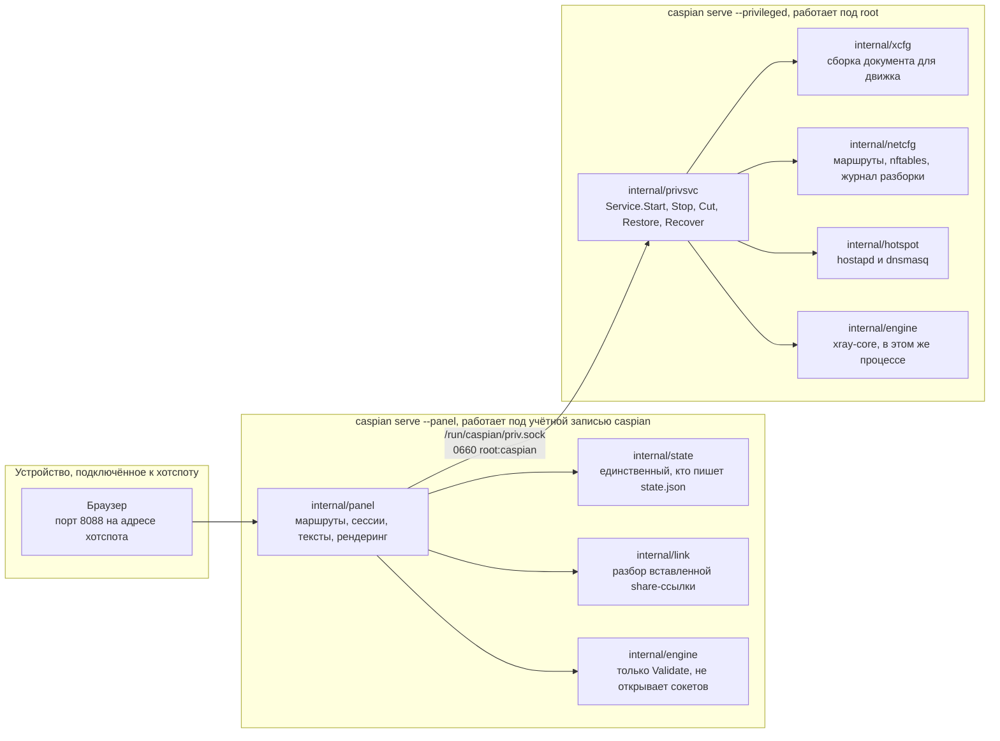
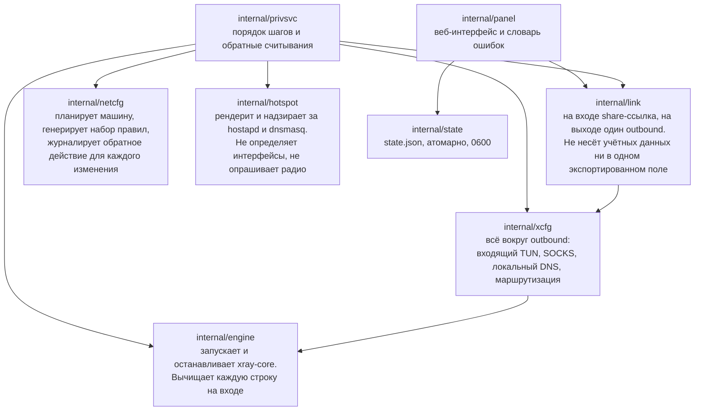
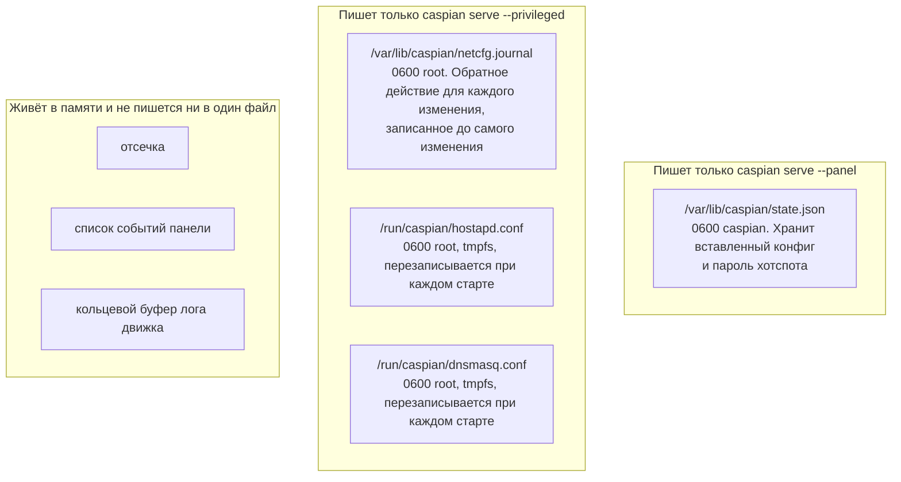
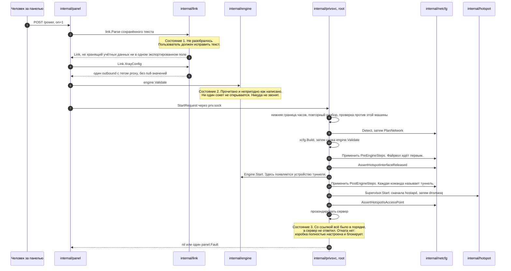
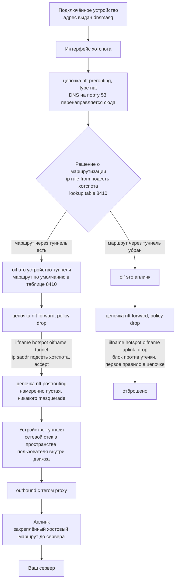
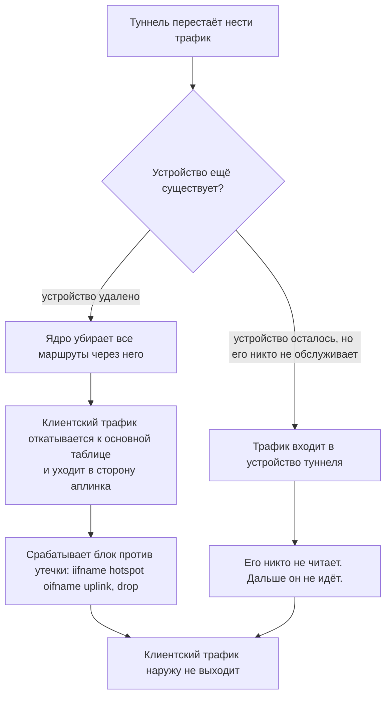
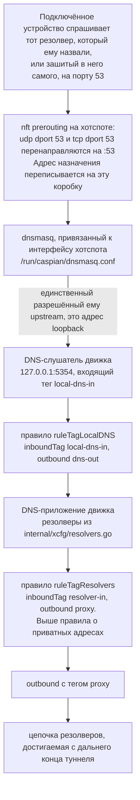
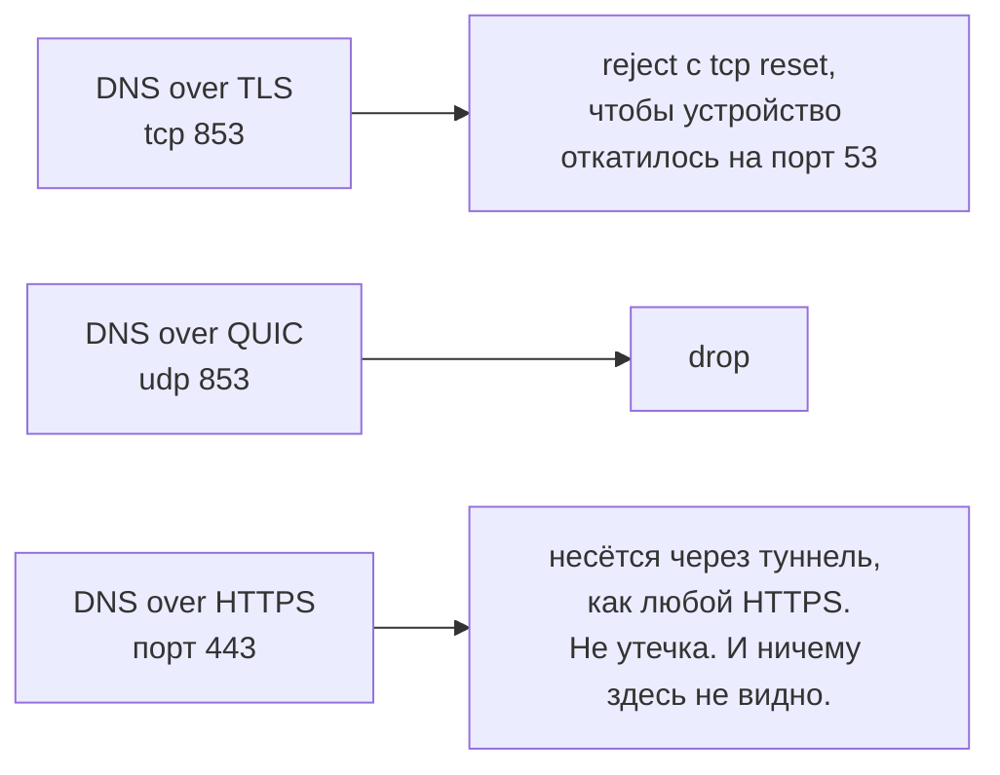

# Архитектура и потоки данных

[English](https://github.com/Iman/caspian/wiki/Architecture) | [فارسی](https://github.com/Iman/caspian/wiki/Architecture.fa) | [Русский](https://github.com/Iman/caspian/wiki/Architecture.ru) | [中文](https://github.com/Iman/caspian/wiki/Architecture.zh)

[Вики Caspian](https://github.com/Iman/caspian/wiki/Home.ru)

> Руководство перенесено из README. Даты измерений сохранены; перенос документации не означает нового запуска тестов.
> [English](https://github.com/Iman/caspian/blob/108567a6a529be05b577ee68b65b48790f07e43d/README.md) | [فارسی](https://github.com/Iman/caspian/blob/108567a6a529be05b577ee68b65b48790f07e43d/README.fa.md) | [Русский](https://github.com/Iman/caspian/blob/108567a6a529be05b577ee68b65b48790f07e43d/README.ru.md) | [中文](https://github.com/Iman/caspian/blob/108567a6a529be05b577ee68b65b48790f07e43d/README.zh.md)

## Архитектура

### Два процесса, один бинарник

Один бинарник работает в двух ролях, и роль выбирается подкомандой. Разделение
существует для того, чтобы сбой в той части, которая разбирает пользовательский
ввод и обслуживает HTTP, не был сбоем в той части, которая держит root.
[`docs/LAYOUT.md`](https://github.com/Iman/caspian/blob/main/docs/LAYOUT.md), раздел «Two processes, one binary», является закреплённой
формулировкой этого.

[`cmd/caspian/main.go`](https://github.com/Iman/caspian/blob/main/cmd/caspian/main.go) печатает обе роли в собственной справке:

    caspian serve --privileged     root: routes, firewall, access point, engine
    caspian serve --panel          the caspian user: the web panel, nothing privileged

### Сокет и почему его словарь закрыт

[`internal/panel/priv.go`](https://github.com/Iman/caspian/blob/main/internal/panel/priv.go) формулирует правило, ради которого и существует всё это
разделение: "A privileged helper that takes a path and an argument list from its
client is not a boundary; it is a way to run anything as root." То есть:
привилегированный помощник, принимающий от своего клиента путь и список
аргументов, не является границей; это способ запустить что угодно от имени root.
Точка с запятой их. Фраза процитирована дословно, потому что пересказ правила не
является правилом.

Поэтому панель не может выразить «выполни это». Она может только назвать одно из
восьми действий, а привилегированная сторона решает, что каждое из них значит.
`panel.Actions` и есть это закрытое множество, а
`TestActionVocabularyMatchesTheInterface` падает, если в интерфейс добавлен
метод, которому нет имени в списке.

| Действие | Что делает привилегированная сторона | Меняет машину |
|---|---|---|
| `detect` | Сообщает интерфейсы, ограничения радио и выбранную подсеть | нет |
| `status` | Сообщает фазу движка, состояние хотспота и то, отсечён ли трафик | нет |
| `start` | Поднимает туннель и хотспот | да |
| `stop` | Опускает их и проигрывает журнал разборки | да |
| `recover` | Останавливает, проигрывает журнал, затем запускает заново из того же запроса | да |
| `engine-log` | Возвращает последние строки лога движка, уже вычищенные | нет |
| `cut` | Обрывает пересылаемый клиентский трафик, оставляя всё остальное работать | да |
| `restore` | Возвращает пересылаемый клиентский трафик обратно | да |

Один запрос, один ответ, одно соединение. Сообщение, это 4-байтовая длина в
порядке big-endian, за которой следует столько же байтов JSON. Длина
проверяется против `maxFrameBytes` до того, как что-либо будет выделено или
разобрано, поэтому слишком большое сообщение стоит четырёх байтов и отказа.
Неизвестные поля JSON отклоняются, а не игнорируются. `protocolVersion`
проверяется в каждом запросе. Поэтому панель из одного релиза, говорящая с
привилегированной службой из другого, получает поименованный отказ вместо поля,
молча разобранного как нулевое значение.

По пути ошибки обратно не переходит ничего, кроме одного слова: `panel.Fault` из
закрытого множества или `privsvc.Refusal` из второго закрытого множества. В
собственном тексте ошибок движка встроен ключевой материал пользователя, поэтому
он записывается в лог на привилегированной стороне и отбрасывается. В ответе нет
поля, в котором он мог бы уехать.

### Какой пакет за что отвечает

`internal/privsvc` заново разбирает `StartRequest.ConfigJSON` через
`internal/link`, а не доверяет тому, что это уже сделала панель. Он также
сверяет интерфейс выхода в интернет с собственным маршрутом по умолчанию этой
машины, интерфейс хотспота с собственным выводом `iw list` этой машины, а канал
с тем, что радио сообщило как пригодное.

### Где живёт состояние и кто его пишет

Два писателя, два файла, ни одного общего файла. Ни один процесс не пишет в файл
другого, поэтому нет ни блокировок, ни потерянных обновлений, от которых надо
было бы защищаться. [`docs/LAYOUT.md`](https://github.com/Iman/caspian/blob/main/docs/LAYOUT.md), раздел «Who writes what», фиксирует это
решение и более ранний черновик, который оно отменило.

Привилегированная сторона не читает вообще ни одного файла состояния. Всё, что
ей нужно, приходит в запросе на старт. `TestPrivsvcReadsNoStateFile` сканирует
исходники самого этого пакета и падает, если он когда-нибудь начнёт читать такой
файл, чего комментарий обеспечить бы не смог.

Полная таблица путей, прав и владельцев находится в [`docs/LAYOUT.md`](https://github.com/Iman/caspian/blob/main/docs/LAYOUT.md). Порты
зафиксированы там же: 53 для клиентского DNS на хотспоте, 5354 на loopback для
DNS-слушателя движка, 8088 для панели, 10808 на loopback для диагностического
входящего SOCKS.

## Как движутся данные

### Вставленная share-ссылка становится работающим туннелем

`startNow` в [`internal/panel/handlers.go`](https://github.com/Iman/caspian/blob/main/internal/panel/handlers.go) документирует порядок, и именно
порядок позволяет различить три вида отказов конфига. Ничто на машине не
трогается, пока не пройдены и состояние 1, и состояние 2.

Три детали в этой последовательности несут нагрузку.

Документ для движка собирается дважды и по разным причинам. `internal/link`
производит outbound и ничего больше. `internal/xcfg` производит всё вокруг него:
входящий TUN, на который приходит клиентский трафик, входящий SOCKS на loopback,
локальный DNS-слушатель, политику резолверов и правила маршрутизации. Ничто из
этого не берётся из того, что прислал вызывающий.

Старт, упавший на полпути, отменяется полностью. В журнале уже лежит обратное
действие для каждого изменения, записанное на диск до того, как изменение
достигло ядра. Упавший старт оставляет машину такой, какой её нашли.

Сервер, который не отвечает, это не полунастроенная коробка. Все изменения
удались, файрвол действует, а пересылаемый клиентский трафик заблокирован,
потому что туннель ничего не несёт. Поэтому об ошибке сообщается и ничего не
разбирается.

### Сетевой путь клиентского пакета

Блок против утечки называет только хотспот и аплинк. Он не может перестать
работать при исчезновении туннеля, потому что туннель в нём не упоминается.
Каждое правило, разрешающее клиентский трафик, туннель называет, поэтому такие
правила перестают срабатывать, а политика отбрасывает всё.

Каждый интерфейс сопоставляется по имени и никогда по индексу. Индекс
разрешается при загрузке набора правил, поэтому набор, называющий туннель по
индексу, не может загрузиться, пока туннель не поднят, а это ровно тот момент,
когда он должен действовать.

Цепочка postrouting пуста намеренно. Masquerade в сторону аплинка, это та самая
единственная строка, которая тихо превратила бы устройство в обычный роутер.

### Что происходит с этим путём, когда туннель исчезает

Какая из ветвей происходит на деле, не установлено.
[`internal/netcfg/testdata/PROVENANCE.md`](https://github.com/Iman/caspian/blob/main/internal/netcfg/testdata/PROVENANCE.md) фиксирует наблюдение на целевой машине
от 2026-08-30: `xray0` присутствовал в списке устройств NetworkManager при
выключенной службе, со статусом `connected (externally)`. Почему так, здесь
никто не установил, а движок, это не код этого проекта. Ни одна из ветвей не
течёт, и ни одна не зависит от того, знаем ли мы, какая именно случится. Именно
поэтому блок написан так, чтобы называть только хотспот и аплинк.

### Путь DNS, который не совпадает с путём трафика

Вот здесь люди чаще всего ошибаются. DNS-запрос клиента не просто разрешается.
Он перехватывается.

Четыре свойства этой цепочки, и то, что каждое из них держит.

Перенаправление переписывает адрес назначения, поэтому устройство с зашитым в
него резолвером получает ответ здесь, а не выпускается наружу к тому резолверу,
который ему назвали. Сценарий: «a client cannot reach a resolver of its own
choosing».

Предложение DHCP называет эту коробку один раз и никакого другого резолвера. Это
заслуживает отдельного сценария, потому что ошибка здесь невидима:
перенаправление всё равно переписало бы пакеты, поэтому в сети ничего бы не
выглядело неправильным. Сценарий: «the box offers itself as the resolver and
never names another».

`internal/hotspot` отклоняет любой upstream для dnsmasq, который не является
адресом loopback. Цель вне loopback означала бы запрос, покидающий коробку в
обход туннеля, для каждого имени, которое спрашивает каждый клиент. Отвечает там
слушатель движка, и `TestLocalDNSDefaultMatchesTheHotspotUpstream` падает, если
эти два порта разойдутся. [`docs/LAYOUT.md`](https://github.com/Iman/caspian/blob/main/docs/LAYOUT.md) называет эту пару той, что ломается
тихо: если они разойдутся, все подключённые устройства перестанут резолвить, при
том что и хотспот, и туннель будут выглядеть здоровыми.

Правило, отправляющее собственные запросы резолвера в туннель, стоит выше
правила, отправляющего приватные адреса напрямую. Поэтому резолвер на приватном
адресе всё равно достигается через туннель, а не по локальной сети.
`TestLocalDNSQueriesCannotFallOutToTheUplink` и `TestPrivateRangesRouteDirect`
держат эти две половины.

Сама цепочка резолверов, это три оператора в трёх юрисдикциях: фильтрующий
сервис Quad9, вариант FAMILY у Cloudflare и CleanBrowsing Security.
[`internal/xcfg/resolvers.go`](https://github.com/Iman/caspian/blob/main/internal/xcfg/resolvers.go) фиксирует, почему выбран каждый из них и какой
почти идентичный адрес того же оператора выбран намеренно не был. Ни в одной
настройке по умолчанию не появляется резолвер Google, и
`TestNoGoogleAnywhereInGeneratedConfigs` сканирует на него каждый генерируемый
документ.

Остальные порты обработаны, и один из них обработать нельзя:

[English](https://github.com/Iman/caspian/blob/main/README.md) | [فارسی](https://github.com/Iman/caspian/blob/main/README.fa.md) | [Русский](https://github.com/Iman/caspian/blob/main/README.ru.md) | [中文](https://github.com/Iman/caspian/blob/main/README.zh.md)
