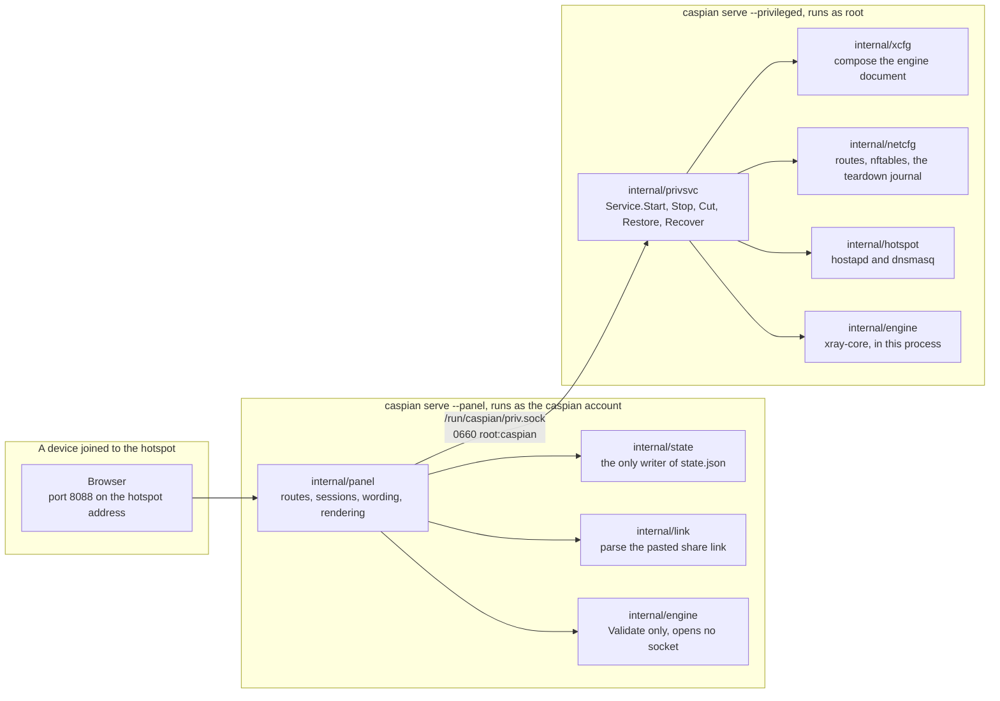
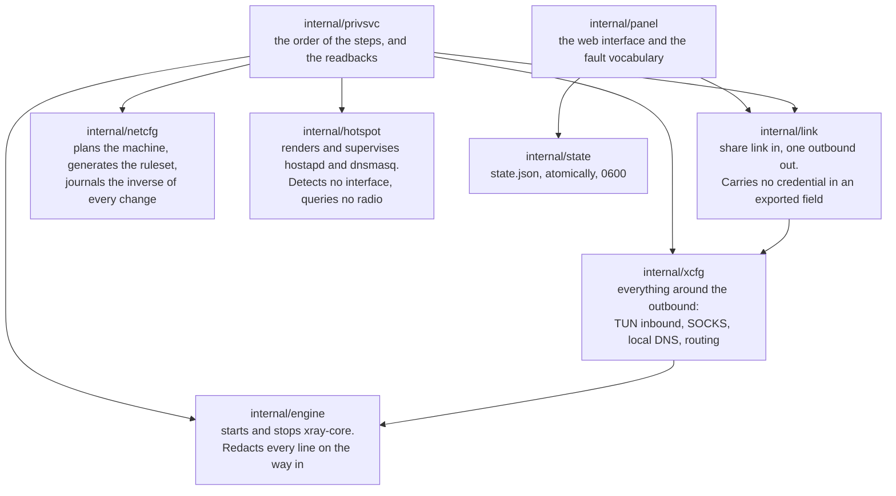
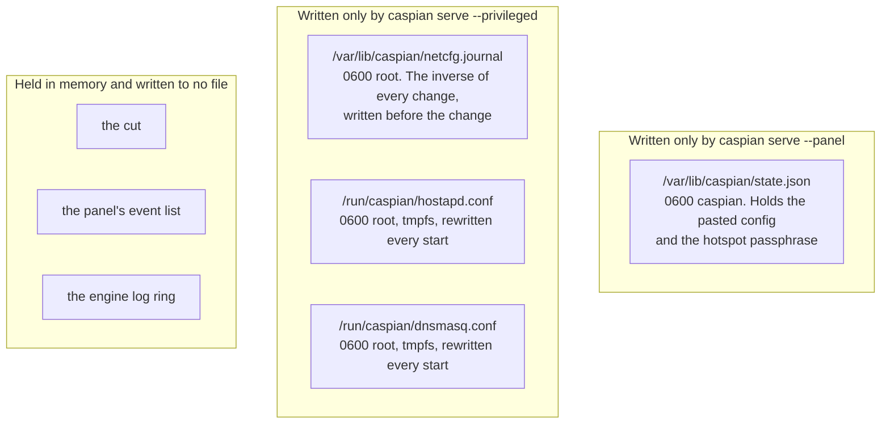
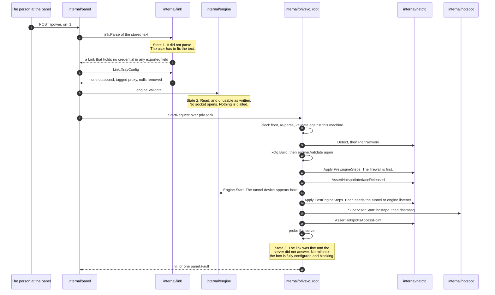
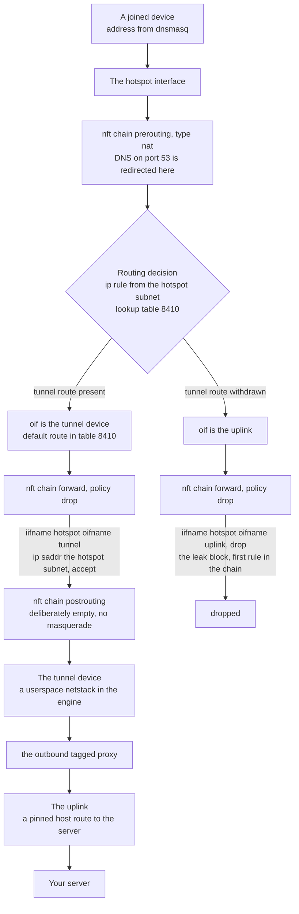
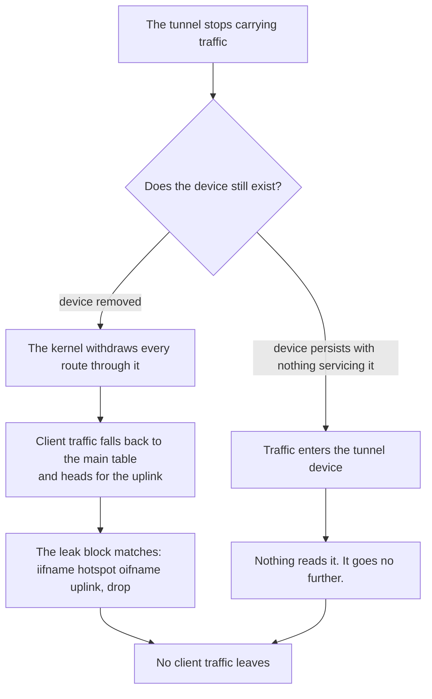
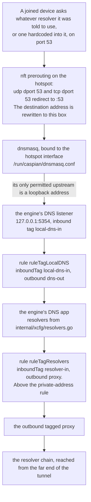
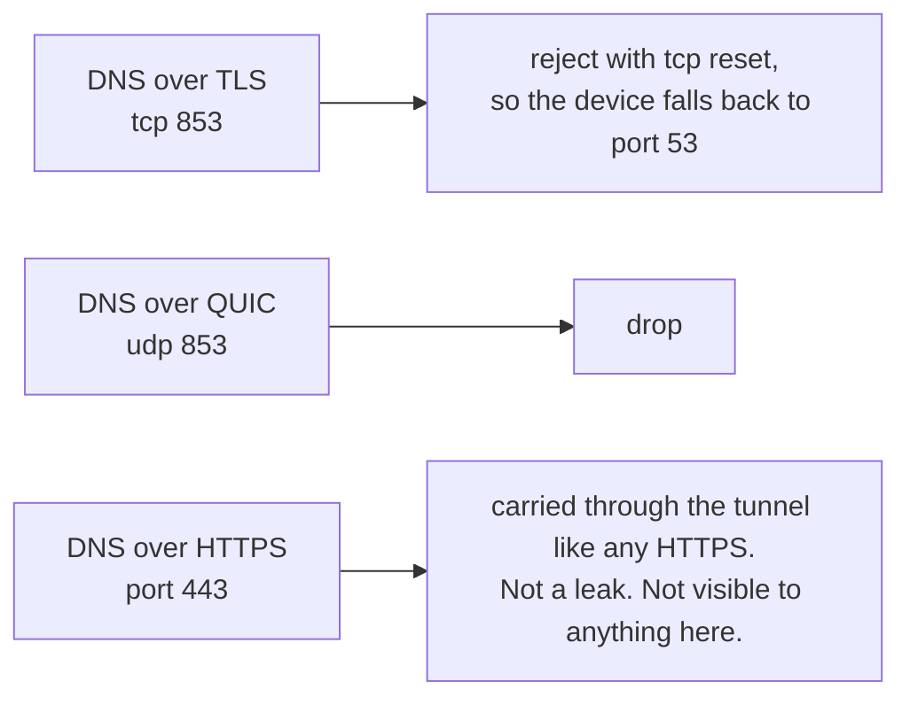

[English](https://github.com/Iman/caspian/wiki/Architecture) | [فارسی](https://github.com/Iman/caspian/wiki/Architecture.fa) | [Русский](https://github.com/Iman/caspian/wiki/Architecture.ru) | [中文](https://github.com/Iman/caspian/wiki/Architecture.zh) | [العربية](https://github.com/Iman/caspian/wiki/Architecture.ar) | [Türkçe](https://github.com/Iman/caspian/wiki/Architecture.tr) | [اردو](https://github.com/Iman/caspian/wiki/Architecture.ur)

# Mimari ve veri akışı

[Caspian wiki'si](https://github.com/Iman/caspian/wiki/Home.tr)

> Bu kılavuz mevcut README'den alınmıştır. Ölçümleri orijinal tarihlerini koruyor; bu belgeleme hamlesi yeni bir test çalıştırmasını bildirmez.
> [English](https://github.com/Iman/caspian/blob/108567a6a529be05b577ee68b65b48790f07e43d/README.md) | [فارسی](https://github.com/Iman/caspian/blob/108567a6a529be05b577ee68b65b48790f07e43d/README.fa.md) | [Русский](https://github.com/Iman/caspian/blob/108567a6a529be05b577ee68b65b48790f07e43d/README.ru.md) | [中文](https://github.com/Iman/caspian/blob/108567a6a529be05b577ee68b65b48790f07e43d/README.zh.md)

## Mimarlık

### İki süreç, bir ikili

Bir ikili, alt komut tarafından seçilen iki rolde çalışır. Bölünme öyle bir şekilde var ki
Kullanıcı girişini ayrıştıran ve HTTP'ye hizmet eden kısımdaki hata,
kökü tutan kısım. [`docs/LAYOUT.md`](https://github.com/Iman/caspian/blob/main/docs/LAYOUT.md), "İki süreç, bir ikili"
bunun sabit beyanı.

[`cmd/caspian/main.go`](https://github.com/Iman/caspian/blob/main/cmd/caspian/main.go) iki rolü kendi kullanım metninde yazdırır:

caspian service --ayrıcalıklı kök: yollar, güvenlik duvarı, erişim noktası, motor
caspian service --panel caspian kullanıcısını: web paneli, ayrıcalıklı bir şey yok

### Soket ve kelime dağarcığının neden kapalı olduğu

[`internal/panel/priv.go`](https://github.com/Iman/caspian/blob/main/internal/panel/priv.go), tüm bölünmenin var olduğu kuralı belirtir: "A
istemcisinden bir yol ve argüman listesi alan ayrıcalıklı bir yardımcı değildir.
bir sınır; herhangi bir şeyi root olarak çalıştırmanın bir yoludur." Noktalı virgül onlarındır.
cümle aynen alıntılanmıştır, çünkü bir kuralın başka sözcüklerle ifade edilmesi kural değildir.

Dolayısıyla panel "bunu çalıştır" ifadesini ifade edemez. Sekiz eylemden yalnızca birini adlandırabilir,
ve her birinin ne anlama geldiğine ayrıcalıklı taraf karar verir. `panel.Actions` bu
kapalı küme ve bir yöntem varsa `TestActionVocabularyMatchesTheInterface` başarısız olur
listede isim olmadan arayüze eklendi.

| Eylem | Ayrıcalıklı taraf ne yapar? | Makineyi değiştirir |
|---|---|---|
| `detect` | Arayüzleri, radyonun sınırlarını ve seçilen alt ağı rapor edin | hayır |
| `status` | Motor aşamasını, sıcak noktayı ve trafiğin kesilip kesilmediğini bildirin | hayır |
| `start` | Tüneli ve sıcak noktayı yukarı getirin | evet |
| `stop` | Onları aşağı indirin ve sökme günlüğünü tekrar oynatın | evet |
| `recover` | Durdurun, günlüğü yeniden oynatın ve ardından aynı istekten yeniden başlayın | evet |
| `engine-log` | Motorun zaten düzenlenmiş olan son satırlarını döndür | hayır |
| `cut` | İletilen istemci trafiğini bırakın ve diğer her şeyi çalışır durumda bırakın | evet |
| `restore` | İletilen istemci trafiğini geri koyun | evet |

Tek istek, tek yanıt, tek bağlantı. Bir mesaj 4 baytlık big-endian'dır
uzunluk ve ardından bu kadar JSON baytı gelir. Uzunluk kontrol edilir
`maxFrameBytes` herhangi bir şey tahsis edilmeden veya ayrıştırılmadan önce, dolayısıyla büyük boyutlu bir mesaj
dört bayta mal olur ve bir ret. Bilinmeyen JSON alanları reddedilmek yerine reddedilir
görmezden gelindi. `protocolVersion` her istekte kontrol edilir. Yani birinden bir panel
başka birinden ayrıcalıklı bir hizmetle konuşmayı serbest bırakmanın ismen reddedilmesi,
sessizce sıfır değeri olarak kodu çözülen bir alan yerine.

Başarısızlık yolunda tek bir kelime dışında hiçbir şey geri dönemez: `panel.Fault`
kapalı bir küme veya ikinci bir kapalı kümeden bir `privsvc.Refusal`. Motor kendi
hata metni kullanıcının anahtar materyalini gömer, böylece ayrıcalıklı oturum açılır
yan ve düştü. Yanıt üzerinde seyahat edebileceği hiçbir alan yok.

### Kim hangi paketin sahibi

`internal/privsvc`, `StartRequest.ConfigJSON`'yi `internal/link` ile yeniden ayrıştırır
Panelin bunu yaptığına güvenmek yerine. Ayrıca interneti de kontrol ediyor
Bu makinenin kendi varsayılan rotasına karşı arayüz, sıcak nokta arayüzü
bu makinenin kendi `iw list` çıkışına ve kanala karşı
radyonun kullanılabilir olduğu bildirildi.

### Devlet nerede yaşıyor ve onu kim yazıyor?

İki yazar, iki dosya, paylaşılan dosya yok. Hiçbir süreç diğerininkini yazmaz, dolayısıyla
Korunacak bir kilit veya kayıp güncelleme yoktur. [`docs/LAYOUT.md`](https://github.com/Iman/caspian/blob/main/docs/LAYOUT.md), "Kim
ne yazıyor", kararı ve tersine çevirdiği önceki taslağı kaydeder.

Ayrıcalıklı taraf hiçbir durum dosyasını okumaz. İhtiyacı olan her şey geliyor
başlatma isteği. `TestPrivsvcReadsNoStateFile` bu paketin kendi kaynağını tarar
ve bir yorumun sağlayamayacağı bir tanesini okursa başarısız olur.

Yolların, modların ve sahiplerin tam tablosu [`docs/LAYOUT.md`](https://github.com/Iman/caspian/blob/main/docs/LAYOUT.md)'dedir. Bağlantı noktaları
burada da düzeltildi: etkin noktadaki istemci DNS'si için 53, geri döngüde 5354
motorun DNS dinleyicisi, panel için 8088, geri döngüde 10808
tanılama ÇORAPLARI geliyor.

## Veri akışı nasıl

### Yapıştırılan bir paylaşım bağlantısı çalışan bir tünele dönüşür

[`internal/panel/handlers.go`](https://github.com/Iman/caspian/blob/main/internal/panel/handlers.go)'deki `startNow` siparişi belgeliyor ve sipariş şu şekilde:
üç yapılandırma hatasını birbirinden ayıran şey nedir? Makinedeki hiçbir şeye dokunulmuyor
durum 1 ve durum 2'nin her ikisi de geçene kadar.

Bu dizideki üç detay yük taşıyor.

Motor belgesi farklı nedenlerle iki kez oluşturulmuştur. `internal/link`
gideni üretir ve başka hiçbir şey yapmaz. `internal/xcfg` her şeyi üretir
etrafında: istemci trafiğinin geldiği TUN girişi, geri döngü SOCKS
Tanılama tarafından kullanılan gelen ve geçici macOS sistem proxy'si olan yerel DNS
dinleyici, çözümleyici politikası ve yönlendirme kuralları.
Bunların hiçbiri arayanın gönderdiği herhangi bir şeyden alınmaz.

Kısmen başarısız olan bir başlangıç tamamen geri alınır. Dergi zaten
Değişiklik istenen noktaya ulaşmadan önce diske yazılan her değişikliğin tersini tutar.
çekirdek. Başarısız olan bir başlatma, makineyi bulunduğu şekilde bırakır.

Yanıt vermeyen bir sunucu yarı uygulanmış bir kutu değildir. Her değişiklik başarılı oldu
güvenlik duvarı yürürlükte ve iletilen istemci trafiği engellendi çünkü
tünel hiçbir şey taşımaz. Böylece arıza bildirilir ve hiçbir şey yıkılmaz.

### Bir istemci paketinin ağ yolu

Sızıntı bloğu yalnızca sıcak noktayı ve yukarı bağlantıyı adlandırır. Çalışmayı durduramaz
Tünel gittiğinde, çünkü tünelden bahsetmiyor. Her kural
istemci trafiğinin tüneli adlandırmasına izin verir, böylece bu kurallar eşleşmeyi durdurur ve
politika her şeyi bırakır.

Her arayüz ada göre eşleştirilir, asla dizine göre eşleştirilmez. Bir dizin şu durumlarda çözümlenir:
kural kümesi yüklenir, dolayısıyla tüneli dizine göre adlandıran bir kural kümesi,
Tünel kapandı, tam da yürürlüğe girmesi gereken zamanda.

Postrouting zinciri bilerek boş bırakılmıştır. Yukarı bağlantıya yönelik bir maskeli balo
cihazı sessizce sıradan bir yönlendiriciye dönüştürecek tek hat.

### Tünelin kaybolması o yola ne yapıyor?

Hangi şubenin olacağı henüz belirlenmedi. [`internal/netcfg/testdata/PROVENANCE.md`](https://github.com/Iman/caspian/blob/main/internal/netcfg/testdata/PROVENANCE.md)
30-08-2026 tarihinde hedeften bir gözlem kaydediyor: `xray0` şurada mevcuttu
NetworkManager'ın hizmetin kapalı olduğu cihaz listesi,
`connected (externally)`. Burada bunun nedenini açıklayan hiçbir şey yok ve motor da
bu projenin kodu. Hiçbir dal sızıntı yapmaz ve hangisinin hangisi olduğunu bilmeye bağlı değildir.
biri olur. Bu nedenle blok yalnızca etkin noktayı ve etkin noktayı adlandıracak şekilde yazılmıştır.
yukarı bağlantı.

### Trafik yolu olmayan DNS yolu

İnsanların yanlış anladığı kısım burası. Bir müşterinin DNS sorusu yalnızca
izin verildi. Alındı.

Bu zincirin dört özelliği, her biri onu tutan şeyle birlikte.

Yönlendirme hedefi yeniden yazar, böylece kodlanmış çözümleyiciye sahip bir cihaz
kendisine söylenen kişiye ulaşması yerine burada yanıtlanır
kullanın. Senaryo: "istemci kendi seçtiği çözümleyiciye ulaşamıyor".

DHCP teklifi bu kutuyu bir kez adlandırır ve başka çözümleyici içermez. Bu kendine değer
senaryo çünkü yanlış yapmak görünmez: yönlendirme yeniden yazar
paketler zaten, böylece kablodaki hiçbir şey yanlış görünmez. Senaryo: "kutu
kendisini çözümleyici olarak sunar ve asla başkasının adını vermez".

`internal/hotspot`, geridöngü adresi olmayan herhangi bir dnsmasq yukarı akışını reddeder.
Geridöngü olmayan hedef, kutuyu tünelin dışında bırakan bir sorgu olacaktır.
her müşterinin istediği her isim. Motorun dinleyicisi orada cevap veriyor,
ve iki bağlantı noktası sürüklenirse `TestLocalDNSDefaultMatchesTheHotspotUpstream` başarısız olur.
[`docs/LAYOUT.md`](https://github.com/Iman/caspian/blob/main/docs/LAYOUT.md) buna sessizce kırılan eşleşmeyi çağırıyor: eğer ikisi
sürüklenme, sıcak nokta ve tünelin her ikisi de çalışırken, birleştirilen her cihaz çözümlemeyi durdurur
sağlıklı görünün.

Çözümleyicinin kendi sorgularını tünele gönderen kural,
özel adresleri doğrudan gönderen kural. Yani özel bir adresteki çözümleyici
hâlâ yerel ağ yerine tünel yoluyla ulaşılıyor.
`TestLocalDNSQueriesCannotFallOutToTheUplink` ve `TestPrivateRangesRouteDirect`
iki yarımı tutun.

Çözümleyici zincirinin kendisi üç yargı bölgesindeki üç operatörden oluşur: Quad9'lar
filtrelenmiş hizmet, Cloudflare AİLE çeşidi ve CleanBrowsing Güvenliği.
[`internal/xcfg/resolvers.go`](https://github.com/Iman/caspian/blob/main/internal/xcfg/resolvers.go) her birinin nedenini ve hangilerinin neredeyse aynı olduğunu kaydeder
Aynı operatörün adresi kasıtlı olarak verilmemiştir. Hiçbir Google çözümleyici görünmüyor
herhangi bir varsayılanda ve `TestNoGoogleAnywhereInGeneratedConfigs` her
biri için belge oluşturuldu.

Diğer bağlantı noktaları işlenir ve bunlardan biri olamaz:

<!-- Caspian guide navigation -->

Caspian kılavuzları: [kurulum ve desteklenen protokoller](https://github.com/Iman/caspian/wiki/Home.tr) · [DPI'yı aşmak için SNI sahtekarlığı: kurulum ve sınırlar](https://github.com/Iman/caspian/wiki/SNI-Spoofing.tr).

<!-- English-source-sha256: 07a2e0584db74a162eb7938428d733054b00788748889213f96e0e0679d0f650 -->
