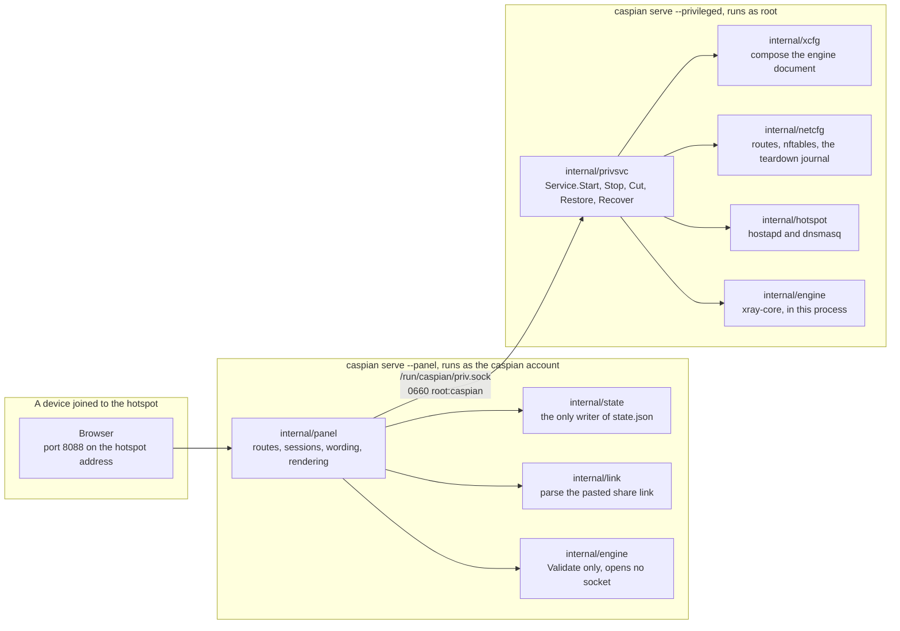
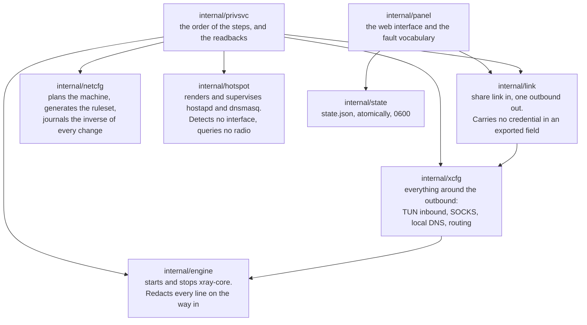
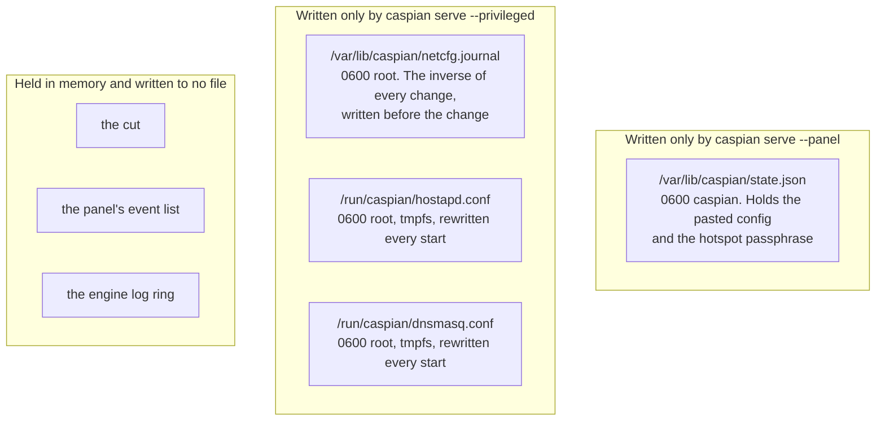
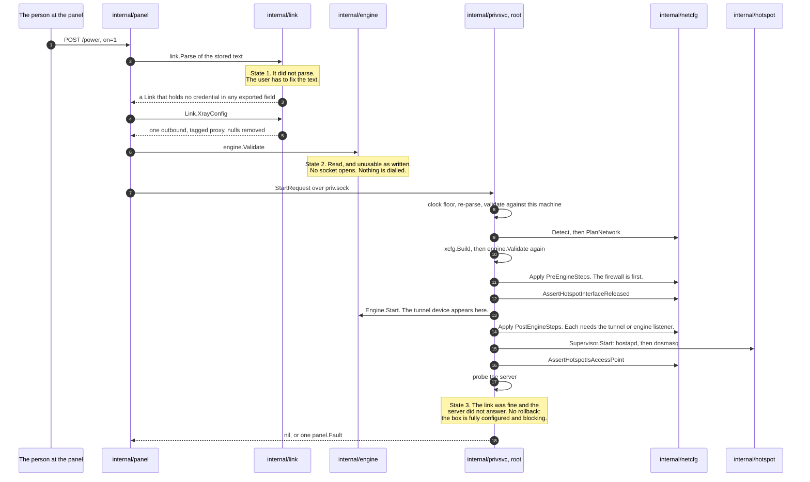
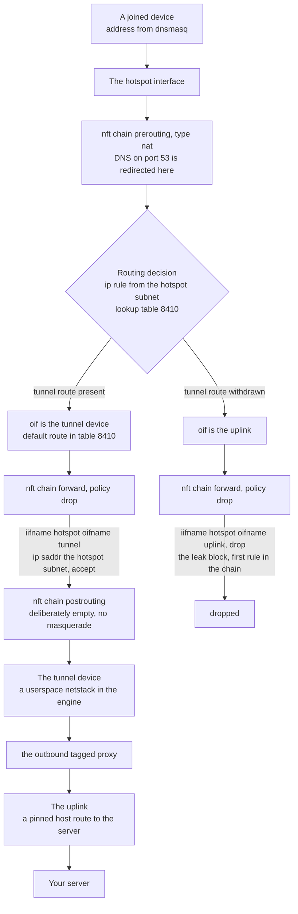
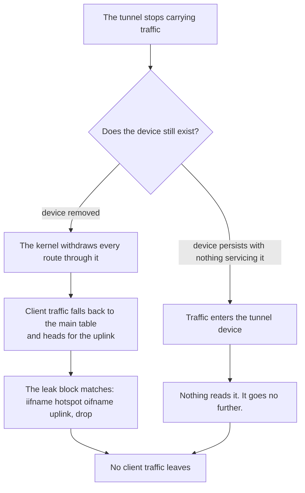
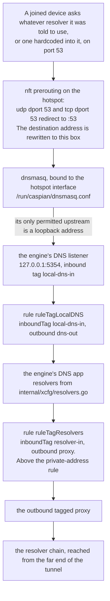
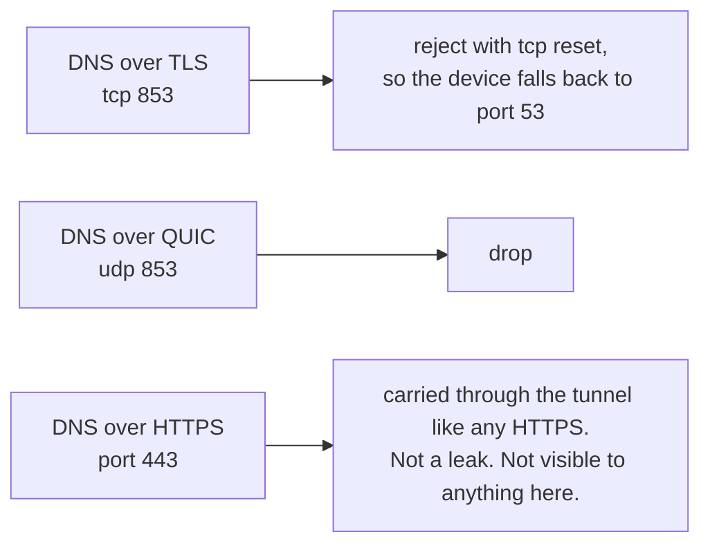

[English](https://github.com/Iman/caspian/wiki/Architecture) | [فارسی](https://github.com/Iman/caspian/wiki/Architecture.fa) | [Русский](https://github.com/Iman/caspian/wiki/Architecture.ru) | [中文](https://github.com/Iman/caspian/wiki/Architecture.zh) | [العربية](https://github.com/Iman/caspian/wiki/Architecture.ar) | [Türkçe](https://github.com/Iman/caspian/wiki/Architecture.tr) | [اردو](https://github.com/Iman/caspian/wiki/Architecture.ur)

# فن تعمیر اور ڈیٹا کا بہاؤ

[Caspian ویکی](https://github.com/Iman/caspian/wiki/Home.ur)

> یہ گائیڈ موجودہ README سے آتا ہے۔ اس کی پیمائش اپنی اصل تاریخوں کو برقرار رکھتی ہے۔ یہ دستاویزی اقدام نئے ٹیسٹ رن کی اطلاع نہیں دیتا ہے۔
> [English](https://github.com/Iman/caspian/blob/108567a6a529be05b577ee68b65b48790f07e43d/README.md) | [فارسی](https://github.com/Iman/caspian/blob/108567a6a529be05b577ee68b65b48790f07e43d/README.fa.md) | [Русский](https://github.com/Iman/caspian/blob/108567a6a529be05b577ee68b65b48790f07e43d/README.ru.md) | [中文](https://github.com/Iman/caspian/blob/108567a6a529be05b577ee68b65b48790f07e43d/README.zh.md)

## فن تعمیر

### دو عمل، ایک بائنری

ایک بائنری دو کرداروں میں چلتی ہے، جسے ذیلی کمانڈ کے ذریعے منتخب کیا جاتا ہے۔ تقسیم موجود ہے تاکہ a
اس حصے میں غلطی جو صارف کے ان پٹ کو پارس کرتا ہے اور HTTP کو پیش کرتا ہے اس میں کوئی غلطی نہیں ہے۔
وہ حصہ جو جڑ رکھتا ہے۔ [`docs/LAYOUT.md`](https://github.com/Iman/caspian/blob/main/docs/LAYOUT.md)، "دو عمل، ایک بائنری"، ہے۔
اس کا مقررہ بیان۔

[`cmd/caspian/main.go`](https://github.com/Iman/caspian/blob/main/cmd/caspian/main.go) اپنے استعمال کے متن میں دو کرداروں کو پرنٹ کرتا ہے:

caspian serve --privileged root: راستے، فائر وال، ایکسیس پوائنٹ، انجن
caspian serve --panel the caspian user: ویب پینل، کچھ بھی مراعات یافتہ نہیں۔

### ساکٹ، اور الفاظ کیوں بند ہیں

[`internal/panel/priv.go`](https://github.com/Iman/caspian/blob/main/internal/panel/priv.go) اس اصول کو بیان کرتا ہے جس کے لیے پوری تقسیم موجود ہے: "A
مراعات یافتہ مددگار جو راستہ اختیار کرتا ہے اور اپنے مؤکل سے دلیل کی فہرست نہیں ہے۔
ایک حد؛ یہ کسی بھی چیز کو جڑ کے طور پر چلانے کا ایک طریقہ ہے۔" سیمی کالون ان کا ہے۔ دی
جملہ بالکل ٹھیک نقل کیا گیا ہے، کیونکہ اصول کا پیرا فریس اصول نہیں ہے۔

لہذا پینل "اس کو چلائیں" کا اظہار نہیں کرسکتا۔ یہ آٹھ اعمال میں سے صرف ایک کا نام دے سکتا ہے،
اور مراعات یافتہ فریق فیصلہ کرتا ہے کہ ہر ایک کا کیا مطلب ہے۔ `panel.Actions` وہ ہے۔
بند سیٹ، اور `TestActionVocabularyMatchesTheInterface` ناکام ہوجاتا ہے اگر کوئی طریقہ ہے۔
فہرست میں نام کے بغیر انٹرفیس میں شامل کیا گیا۔

| ایکشن | مراعات یافتہ فریق کیا کرتا ہے۔ | مشین بدلتا ہے۔ |
|---|---|---|
| `detect` | انٹرفیس، ریڈیو کی حدود، اور منتخب کردہ سب نیٹ کی اطلاع دیں۔ | نہیں |
| `status` | انجن کے مرحلے، ہاٹ سپاٹ، اور کیا ٹریفک کٹ گئی ہے کی اطلاع دیں۔ | نہیں |
| `start` | سرنگ اور ہاٹ سپاٹ کو اوپر لائیں۔ | ہاں |
| `stop` | انہیں نیچے اتاریں اور ٹیر ڈاؤن جرنل کو دوبارہ چلائیں۔ | ہاں |
| `recover` | رکیں، جرنل کو دوبارہ چلائیں، پھر اسی درخواست سے دوبارہ شروع کریں۔ | ہاں |
| `engine-log` | انجن کی حالیہ لائنوں کو واپس کریں، جو پہلے ہی درست کر دی گئی ہیں۔ | نہیں |
| `cut` | فارورڈ کردہ کلائنٹ ٹریفک کو ڈراپ کریں اور باقی سب کچھ چلتے رہنے دیں۔ | ہاں |
| `restore` | آگے بھیجے گئے کلائنٹ ٹریفک کو واپس رکھیں | ہاں |

ایک درخواست، ایک جواب، ایک رابطہ۔ ایک پیغام 4 بائٹ کا بڑا اینڈین ہوتا ہے۔
لمبائی کے بعد JSON کے اتنے بائٹس۔ لمبائی کے خلاف جانچ پڑتال کی جاتی ہے
`maxFrameBytes` کسی بھی چیز کو مختص یا تجزیہ کرنے سے پہلے، لہذا ایک بڑا پیغام
چار بائٹس اور انکار کی قیمت ہے۔ نامعلوم JSON فیلڈز کے بجائے انکار کر دیا گیا ہے۔
نظر انداز کیا `protocolVersion` ہر درخواست پر چیک کیا جاتا ہے۔ تو ایک سے ایک پینل
کسی دوسرے سے مراعات یافتہ سروس سے بات کرنے پر نام سے انکار ملتا ہے،
ایک فیلڈ کی بجائے خاموشی سے اس کی صفر ویلیو کے طور پر ڈی کوڈ کیا گیا۔

ناکامی کے راستے پر ایک لفظ کے علاوہ کچھ بھی نہیں آتا: ایک `panel.Fault` سے
ایک بند سیٹ، یا دوسرے بند سیٹ سے `privsvc.Refusal`۔ انجن کا اپنا
غلطی کا متن صارف کے کلیدی مواد کو سرایت کرتا ہے، لہذا یہ مراعات یافتہ افراد پر لاگ ان ہوتا ہے۔
طرف اور گرا دیا. جواب کے بارے میں کوئی فیلڈ نہیں ہے جس میں یہ سفر کر سکتا ہے۔

### کون سا پیکج کا مالک ہے۔

`internal/privsvc` `StartRequest.ConfigJSON` کو `internal/link` کے ساتھ دوبارہ تجزیہ کرتا ہے
پینل پر بھروسہ کرنے کے بجائے یہ کیا ہے۔ یہ انٹرنیٹ بھی چیک کرتا ہے۔
اس مشین کے اپنے طے شدہ راستے، ہاٹ سپاٹ انٹرفیس کے خلاف انٹرفیس
اس مشین کے اپنے `iw list` آؤٹ پٹ کے خلاف، اور چینل کے خلاف کیا
ریڈیو کو قابل استعمال قرار دیا گیا۔

### ریاست کہاں رہتی ہے، اور اسے کون لکھتا ہے۔

دو مصنفین، دو فائلیں، کوئی مشترکہ فائل نہیں۔ کوئی بھی عمل دوسرے کو نہیں لکھتا، تو
اس سے بچانے کے لیے کوئی لاک اور کوئی گمشدہ اپ ڈیٹ نہیں ہے۔ [`docs/LAYOUT.md`](https://github.com/Iman/caspian/blob/main/docs/LAYOUT.md)، "کون
کیا لکھتا ہے"، فیصلے کو ریکارڈ کرتا ہے اور اس سے پہلے کے مسودے کو الٹ دیا جاتا ہے۔

مراعات یافتہ فریق کوئی بھی ریاستی فائل نہیں پڑھتا۔ اس کی ضرورت کی ہر چیز پہنچ جاتی ہے۔
شروع کی درخواست. `TestPrivsvcReadsNoStateFile` اس پیکیج کے اپنے ماخذ کو اسکین کرتا ہے۔
اور ناکام ہو جاتا ہے اگر یہ کبھی ایک پڑھتا ہے، جسے کوئی تبصرہ فراہم نہیں کرتا۔

راستوں، طریقوں اور مالکان کی مکمل جدول [`docs/LAYOUT.md`](https://github.com/Iman/caspian/blob/main/docs/LAYOUT.md) میں ہے۔ بندرگاہیں ہیں۔
وہاں بھی فکسڈ: ہاٹ اسپاٹ پر کلائنٹ DNS کے لیے 53، لوپ بیک پر 5354
انجن کا DNS سننے والا، پینل کے لیے 8088، لوپ بیک پر 10808
تشخیصی SOCKS ان باؤنڈ۔

## ڈیٹا کیسے بہتا ہے۔

### پیسٹ کردہ شیئر لنک ایک چلتی ہوئی سرنگ بن جاتا ہے۔

`startNow` [`internal/panel/handlers.go`](https://github.com/Iman/caspian/blob/main/internal/panel/handlers.go) میں آرڈر کو دستاویز کرتا ہے، اور آرڈر یہ ہے
تین تشکیل کی ناکامیوں کو الگ کیا بتاتا ہے۔ مشین پر کسی چیز کو چھوا نہیں ہے۔
جب تک کہ ریاست 1 اور ریاست 2 دونوں گزر نہ جائیں۔

اس ترتیب میں تین تفصیلات لوڈ بیئرنگ ہیں۔

انجن کی دستاویز مختلف وجوہات کی بنا پر دو بار بنائی گئی ہے۔ `internal/link`
آؤٹ باؤنڈ پیدا کرتا ہے اور کچھ نہیں۔ `internal/xcfg` سب کچھ پیدا کرتا ہے۔
اس کے ارد گرد: TUN ان باؤنڈ جس پر کلائنٹ ٹریفک آتا ہے، لوپ بیک SOCKS
تشخیصی اور عبوری macOS سسٹم پراکسی، مقامی DNS کے ذریعے استعمال ہونے والا ان باؤنڈ
سننے والا، حل کرنے والی پالیسی، اور روٹنگ کے اصول۔
اس میں سے کوئی بھی کال کرنے والے کے بھیجے گئے کسی بھی چیز سے نہیں لیا گیا ہے۔

ایک آغاز جو جزوی طور پر ناکام ہو جاتا ہے اسے مکمل طور پر کالعدم کر دیا جاتا ہے۔ جریدہ پہلے ہی
ہر تبدیلی کا الٹا رکھتا ہے، تبدیلی تک پہنچنے سے پہلے ڈسک پر لکھا جاتا ہے۔
دانا ایک ایسا آغاز جو ناکام ہو جاتا ہے مشین کو اسی طرح چھوڑ دیتا ہے جیسے اسے پایا گیا تھا۔

ایک سرور جو جواب نہیں دیتا ہے وہ آدھا لاگو باکس نہیں ہے۔ ہر تبدیلی کامیاب ہوئی،
فائر وال نافذ ہے، اور فارورڈ کلائنٹ ٹریفک بلاک ہے کیونکہ
سرنگ میں کچھ نہیں ہوتا۔ لہذا غلطی کی اطلاع دی جاتی ہے اور کچھ بھی نہیں پھٹا جاتا ہے۔

### کلائنٹ پیکٹ کا نیٹ ورک پاتھ

لیک بلاک میں صرف ہاٹ اسپاٹ اور اپلنک کا نام ہے۔ یہ کام نہیں روک سکتا
جب سرنگ جاتی ہے، کیونکہ اس میں سرنگ کا ذکر نہیں ہے۔ ہر اصول کہ
اجازت دیتا ہے کلائنٹ ٹریفک سرنگ کا نام رکھتا ہے، لہذا وہ قواعد مماثلت بند کر دیتے ہیں اور
پالیسی سب کچھ چھوڑ دیتی ہے۔

ہر انٹرفیس نام سے مماثل ہوتا ہے اور کبھی بھی انڈیکس سے نہیں۔ ایک انڈیکس حل کیا جاتا ہے جب
رولسیٹ لوڈ ہوتا ہے، لہٰذا سرنگ کو انڈیکس کے لحاظ سے نام دینے والا رولسیٹ لوڈ نہیں ہو سکتا جب کہ
سرنگ نیچے ہے، جو بالکل اسی وقت ہے جب اسے نافذ ہونا ہے۔

پوسٹ روٹنگ کا سلسلہ جان بوجھ کر خالی ہے۔ اپلنک کی طرف ایک بہانا ہے
واحد لائن جو خاموشی سے آلات کو ایک عام راؤٹر میں بدل دے گی۔

### غائب ہونے والی سرنگ اس راستے پر کیا کرتی ہے۔

کون سی شاخ ہوتی ہے طے نہیں ہوتی۔ [`internal/netcfg/testdata/PROVENANCE.md`](https://github.com/Iman/caspian/blob/main/internal/netcfg/testdata/PROVENANCE.md)
2026-08-30 کو ہدف سے ایک مشاہدہ ریکارڈ کرتا ہے: `xray0` میں موجود تھا
سروس کے ساتھ نیٹ ورک مینجر کی ڈیوائس کی فہرست بند کر دی گئی، جیسا کہ
`connected (externally)` یہاں کچھ بھی قائم نہیں ہوا کیوں، اور انجن نہیں ہے۔
اس منصوبے کا کوڈ. نہ تو شاخ لیک ہوتی ہے، اور نہ ہی یہ جاننے پر منحصر ہے کہ کون سا
ایک ہوتا ہے. اس لیے بلاک کو صرف ہاٹ اسپاٹ اور کے نام لکھا گیا تھا۔
اپ لنک

### DNS پاتھ، جو ٹریفک کا راستہ نہیں ہے۔

یہ وہ حصہ ہے جس سے لوگ غلط ہو جاتے ہیں۔ ایک کلائنٹ کا DNS سوال محض نہیں ہے۔
اجازت دی لیا جاتا ہے۔

اس سلسلہ کی چار خصوصیات، ہر ایک اس چیز کے ساتھ جو اسے رکھتی ہے۔

ری ڈائریکٹ منزل کو دوبارہ لکھتا ہے، لہذا ایک آلہ جس میں حل کرنے والا ہارڈ کوڈ ہوتا ہے۔
اس کا جواب یہاں دیا گیا ہے بجائے اس کے کہ اس تک پہنچنے کی اجازت دی جائے جس سے اسے بتایا گیا تھا۔
استعمال کریں منظر نامہ: "ایک کلائنٹ اپنی پسند کے حل کرنے والے تک نہیں پہنچ سکتا"۔

DHCP اس باکس کو ایک بار نام پیش کرتا ہے اور کوئی دوسرا حل کرنے والا نہیں۔ یہ اس کی اپنی قیمت ہے
منظر نامہ کیونکہ اس کا غلط ہونا پوشیدہ ہے: ری ڈائریکٹ دوبارہ لکھے گا۔
ویسے بھی پیکٹ، تو تار پر کچھ بھی غلط نظر نہیں آئے گا۔ منظر نامہ: "باکس
خود کو حل کرنے والے کے طور پر پیش کرتا ہے اور کبھی کسی کا نام نہیں لیتا"۔

`internal/hotspot` کسی بھی dnsmasq اپ اسٹریم سے انکار کرتا ہے جو لوپ بیک ایڈریس نہیں ہے۔
ایک نان لوپ بیک ٹارگٹ ایک سوال ہوگا جو باکس کو ٹنل سے باہر چھوڑتا ہے۔
ہر وہ نام جو ہر کلائنٹ کے لیے پوچھتا ہے۔ انجن کا سننے والا وہی ہے جو وہاں جواب دیتا ہے،
اور `TestLocalDNSDefaultMatchesTheHotspotUpstream` ناکام ہوجاتا ہے اگر دونوں بندرگاہیں بڑھ جاتی ہیں۔
[`docs/LAYOUT.md`](https://github.com/Iman/caspian/blob/main/docs/LAYOUT.md) اسے کہتے ہیں جوڑ جوڑنا جو خاموشی سے ٹوٹ جاتا ہے: اگر دونوں
بڑھے ہوئے، ہر جوائنڈ ڈیوائس حل ہونا بند کر دیتی ہے جبکہ ہاٹ اسپاٹ اور ٹنل دونوں
صحت مند نظر آتے ہیں.

قاعدہ جو حل کرنے والے کے اپنے سوالات کو سرنگ میں بھیجتا ہے اس کے اوپر بیٹھتا ہے۔
قاعدہ جو نجی پتے براہ راست بھیجتا ہے۔ تو ایک نجی ایڈریس پر حل کرنے والا ہے۔
اب بھی مقامی نیٹ ورک کے بجائے سرنگ کے ذریعے پہنچا۔
`TestLocalDNSQueriesCannotFallOutToTheUplink` اور `TestPrivateRangesRouteDirect`
دو حصوں کو پکڑو.

حل کرنے والا سلسلہ خود تین دائرہ اختیار میں تین آپریٹرز ہے: Quad9's
فلٹرڈ سروس، کلاؤڈ فلیئر فیملی ویرینٹ، اور کلین براؤزنگ سیکیورٹی۔
[`internal/xcfg/resolvers.go`](https://github.com/Iman/caspian/blob/main/internal/xcfg/resolvers.go) ریکارڈ کرتا ہے کہ ہر ایک کیوں، اور جو تقریباً ایک جیسا ہے۔
اسی آپریٹر کا پتہ یہ جان بوجھ کر نہیں ہے۔ کوئی گوگل حل کرنے والا ظاہر نہیں ہوتا ہے۔
کسی بھی ڈیفالٹ میں، اور `TestNoGoogleAnywhereInGeneratedConfigs` ہر اسکین کرتا ہے۔
ایک کے لیے تیار کردہ دستاویز۔

دوسری بندرگاہوں کو سنبھالا جاتا ہے اور ان میں سے ایک نہیں ہوسکتی ہے:

<!-- Caspian guide navigation -->

Caspian گائیڈز: [سیٹ اپ اور معاون پروٹوکول](https://github.com/Iman/caspian/wiki/Home.ur) · [ڈی پی آئی کو روکنے کے لیے SNI کی جعل سازی: سیٹ اپ اور حدود](https://github.com/Iman/caspian/wiki/SNI-Spoofing.ur)۔

<!-- English-source-sha256: 07a2e0584db74a162eb7938428d733054b00788748889213f96e0e0679d0f650 -->
