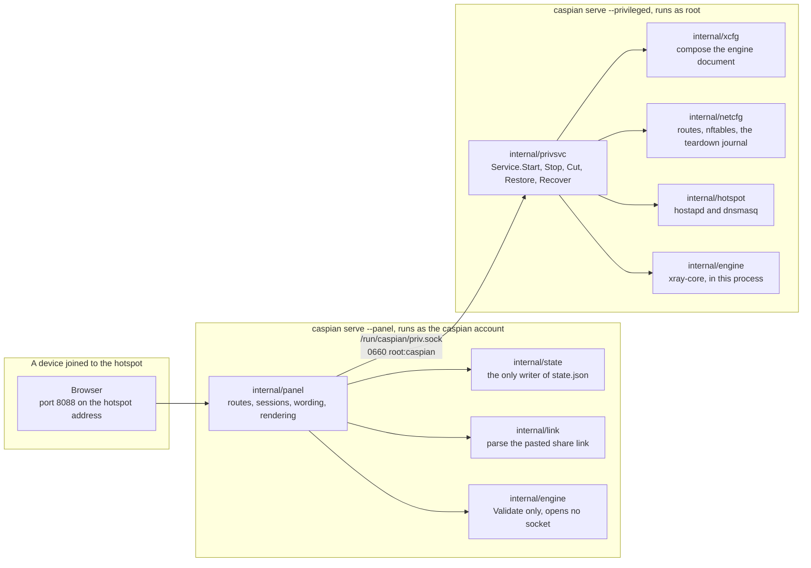
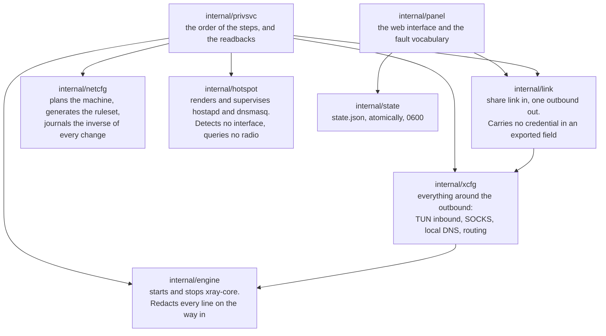
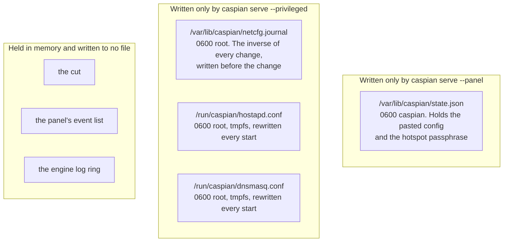
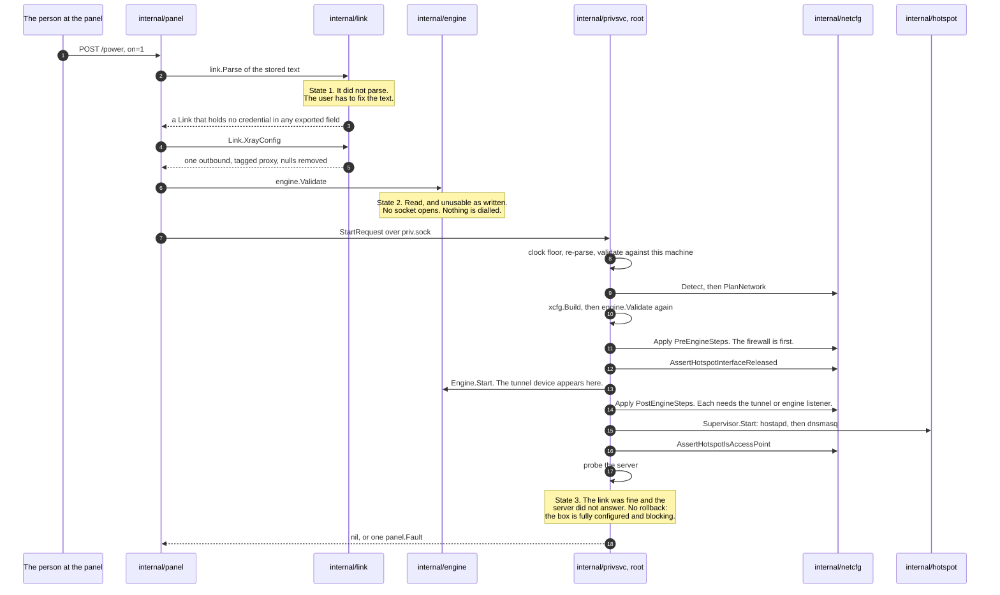
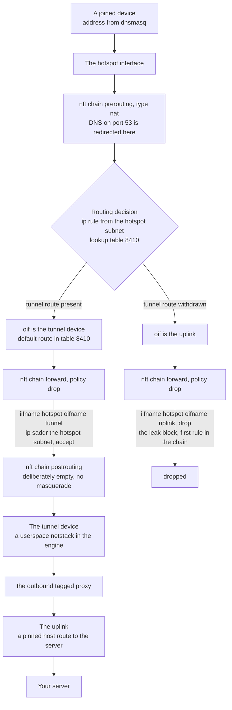
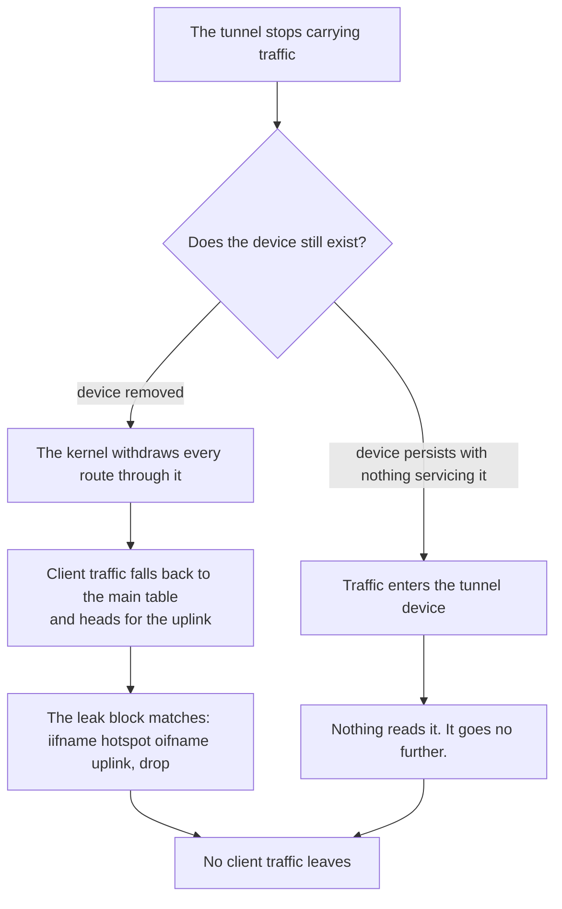
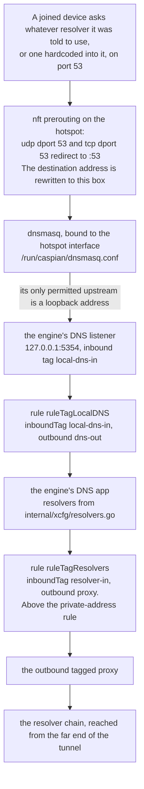
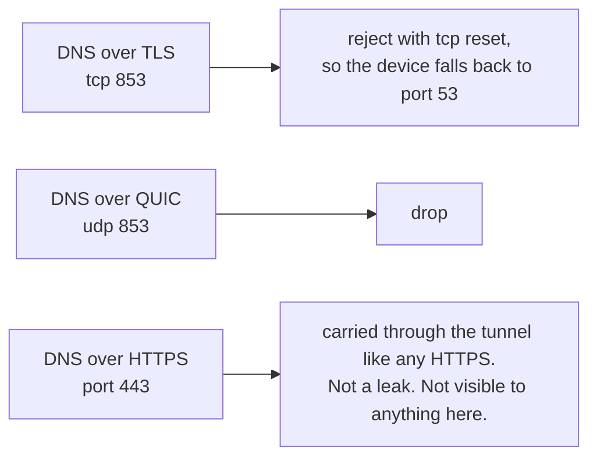

[English](https://github.com/Iman/caspian/wiki/Architecture) | [فارسی](https://github.com/Iman/caspian/wiki/Architecture.fa) | [Русский](https://github.com/Iman/caspian/wiki/Architecture.ru) | [中文](https://github.com/Iman/caspian/wiki/Architecture.zh) | [العربية](https://github.com/Iman/caspian/wiki/Architecture.ar) | [Türkçe](https://github.com/Iman/caspian/wiki/Architecture.tr) | [اردو](https://github.com/Iman/caspian/wiki/Architecture.ur)

# 架构和数据流

[Caspian维基](https://github.com/Iman/caspian/wiki/Home.zh)

> 本指南来自现有的自述文件。其测量结果保留其原始日期；此文档移动不会报告新的测试运行。
> [English](https://github.com/Iman/caspian/blob/108567a6a529be05b577ee68b65b48790f07e43d/README.md) | [فارسی](https://github.com/Iman/caspian/blob/108567a6a529be05b577ee68b65b48790f07e43d/README.fa.md) | [Русский](https://github.com/Iman/caspian/blob/108567a6a529be05b577ee68b65b48790f07e43d/README.ru.md) | [中文](https://github.com/Iman/caspian/blob/108567a6a529be05b577ee68b65b48790f07e43d/README.zh.md)

## 建筑

### 两个进程，一个二进制文件

一个二进制文件以两种角色运行，由子命令选择。分裂的存在使得
解析用户输入并提供 HTTP 服务的部分的故障不是
持有根的部分。 [`docs/LAYOUT.md`](https://github.com/Iman/caspian/blob/main/docs/LAYOUT.md)，“两个进程，一个二进制”，是
它的固定声明。

[`cmd/caspian/main.go`](https://github.com/Iman/caspian/blob/main/cmd/caspian/main.go) 在其自己的使用文本中打印两个角色：

caspian服务--特权根：路由、防火墙、接入点、引擎
caspianserve --panel caspian 用户：Web 面板，没有任何特权

### 套接字，以及为什么词汇被关闭

[`internal/panel/priv.go`](https://github.com/Iman/caspian/blob/main/internal/panel/priv.go) 陈述了整个分割存在的规则：“A
从客户端获取路径和参数列表的特权助手不是
边界；这是一种以 root 身份运行任何东西的方法。”分号是他们的。的
句子被准确地引用，因为规则的释义并不是规则。

所以面板无法表达“运行这个”。它只能命名八个动作之一，
特权方决定每一项的含义。 `panel.Actions`就是那个
闭集，如果方法是 `TestActionVocabularyMatchesTheInterface` 失败
添加到列表中没有名称的界面。

| 行动 | 特权方做什么 | 换机器了 |
|---|---|---|
| `detect` | 报告接口、无线电限制和所选子网 | 不 |
| `status` | 报告引擎阶段、热点以及流量是否被切断 | 不 |
| `start` | 打开隧道和热点 | 是的 |
| `stop` | 把它们拿下来并重播拆解日志 | 是的 |
| `recover` | 停止，重播日志，然后从同一请求重新开始 | 是的 |
| `engine-log` | 返回引擎最近的行，已经编辑过 | 不 |
| `cut` | 丢弃转发的客户端流量并保持其他一切运行 | 是的 |
| `restore` | 将转发的客户端流量放回 | 是的 |

一个请求，一个响应，一个连接。消息是 4 字节的大端字节序
length 后跟 JSON 的那么多字节。检查长度
`maxFrameBytes` 在分配或解析任何内容之前，因此消息过大
花费四个字节和拒绝。未知的 JSON 字段被拒绝而不是
被忽略。每个请求都会检查 `protocolVersion`。所以一个面板
释放与另一个特权服务的对话会被命名为拒绝，
而不是默默地解码为零值的字段。

除了一个词之外，故障路径上没有任何内容交叉回来：来自的 `panel.Fault`
一个封闭集，或来自第二个封闭集的 `privsvc.Refusal`。发动机自己的
错误文本嵌入了用户的密钥材料，因此以特权身份登录
侧并掉落。响应中没有可以传输的字段。

### 谁拥有哪个包

`internal/privsvc` 用 `internal/link` 重新解析 `StartRequest.ConfigJSON`
而不是相信小组已经做到了。它还会检查互联网
针对本机自身默认路由的接口，热点接口
针对本机自带的`iw list`输出，以及通道针对什么
无线电报告可用。

### 状态存在于何处以及由谁编写

两个作家，两个文件，没有共享文件。两个进程都不写对方的，所以
没有锁定，也没有丢失更新来防止。 [`docs/LAYOUT.md`](https://github.com/Iman/caspian/blob/main/docs/LAYOUT.md)，“谁
写了什么”，记录了决定和它推翻的早期草案。

特权端根本不读取任何状态文件。它所需要的一切都到达了
启动请求。 `TestPrivsvcReadsNoStateFile` 扫描该包自己的源
如果它读到一个评论则不会提供的内容，则会失败。

路径、模式和所有者的完整表位于 [`docs/LAYOUT.md`](https://github.com/Iman/caspian/blob/main/docs/LAYOUT.md) 中。这些端口是
也已修复：热点上的客户端 DNS 为 53，环回上为 5354
引擎的 DNS 侦听器，面板为 8088，环回为 10808
诊断 SOCKS 入站。

## 数据如何流动

### 粘贴的共享链接成为运行隧道

[`internal/panel/handlers.go`](https://github.com/Iman/caspian/blob/main/internal/panel/handlers.go) 中的 `startNow` 记录了订单，订单为
是什么区分了这三个配置失败。机器上没有任何东西被触及
直到状态 1 和状态 2 都通过。

该序列中的三个细节是承重的。

由于不同的原因，引擎文件被两次组成。 `internal/link`
产生出站，仅此而已。 `internal/xcfg` 生产一切
周围：客户端流量到达的 TUN 入站、环回 SOCKS
诊断和临时 macOS 系统代理、本地 DNS 使用的入站
监听器、解析器策略和路由规则。
这些都不是从调用者发送的任何内容中获取的。

中途失败的开始就完全失败了。杂志已经
保存每个更改的倒数，在更改到达之前写入磁盘
内核。启动失败后，机器将保持被发现时的状态。

不应答的服务器并不是一个半应用的盒子。每一次改变都成功了
防火墙生效，转发的客户端流量被阻止，因为
隧道什么也没有承载。所以报了故障，什么也没拆。

### 客户端数据包的网络路径

泄漏块仅命名热点和上行链路。它无法停止工作
当隧道走的时候，因为它没有提到隧道。每条规则都表明
允许客户端流量确实命名了隧道，因此这些规则停止匹配并且
政策放弃了一切。

每个接口都按名称匹配，而不是按索引匹配。当以下情况时，索引被解析：
规则集加载，因此按索引命名隧道的规则集无法加载
隧道已经塌陷，这正是它必须生效的时候。

后路由链故意为空。上行链路的伪装是
一条线就能悄悄地将设备变成普通路由器。

### 隧道消失对该路径有何影响

哪个分支发生还没有确定。 [`internal/netcfg/testdata/PROVENANCE.md`](https://github.com/Iman/caspian/blob/main/internal/netcfg/testdata/PROVENANCE.md)
记录了 2026 年 8 月 30 日对目标的观察结果：`xray0` 出现在
服务关闭后的 NetworkManager 设备列表，如下
`connected (externally)`。这里没有确定原因，而且引擎也没有
这个项目的代码。两个分支都不会泄漏，也不依赖于知道哪个分支
有一种情况发生了。这就是为什么该块被写入仅命名热点和
上行链路。

### DNS 路径，不是流量路径

这是人们容易犯错的部分。客户端的 DNS 问题不仅仅是
允许的。它被采取了。

该链的四个属性，每个属性都有承载它的东西。

重定向重写了目的地，因此具有硬编码解析器的设备
在这里得到答复，而不是被允许到达它被告知的地方
使用。场景：“客户端无法找到自己选择的解析器”。

DHCP 服务会命名此框一次，而不会使用其他解析器。那是值得自己的
场景，因为出错是不可见的：重定向将重写
无论如何，数据包，所以线路上看起来不会有任何问题。场景：“盒子
将自己作为解析器，并且从不指定其他人”。

`internal/hotspot` 拒绝任何不是环回地址的 dnsmasq 上游。
非环回目标是离开隧道外部的框的查询，例如
每个客户要求的每个名字。引擎的监听器就是那里的答案，
如果两个端口漂移，则 `TestLocalDNSDefaultMatchesTheHotspotUpstream` 会失败。
[`docs/LAYOUT.md`](https://github.com/Iman/caspian/blob/main/docs/LAYOUT.md) 称这种配对为悄然破裂的配对：如果两者
漂移，每个连接的设备都停止解析，而热点和隧道都
看起来很健康。

将解析器自己的查询发送到隧道的规则位于
直接发送私有地址的规则。所以私有地址上的解析器是
仍然通过隧道而不是本地网络到达。
`TestLocalDNSQueriesCannotFallOutToTheUplink` 和 `TestPrivateRangesRouteDirect`
握住两半。

解析器链本身是三个管辖区的三个运营商：Quad9's
过滤服务、Cloudflare FAMILY 变体和 CleanBrowsing Security。
[`internal/xcfg/resolvers.go`](https://github.com/Iman/caspian/blob/main/internal/xcfg/resolvers.go) 记录了每一项的原因，以及哪些几乎相同
它故意不是同一运营商的地址。没有出现 Google 解析器
在任何默认情况下，`TestNoGoogleAnywhereInGeneratedConfigs` 都会扫描
生成的文档之一。

其他端口已处理，但其中之一不能：

<!-- Caspian guide navigation -->

Caspian指南：[设置和支持的协议](https://github.com/Iman/caspian/wiki/Home.zh)·[用于 DPI 规避的 SNI 欺骗：设置和限制](https://github.com/Iman/caspian/wiki/SNI-Spoofing.zh)。

<!-- English-source-sha256: 07a2e0584db74a162eb7938428d733054b00788748889213f96e0e0679d0f650 -->
