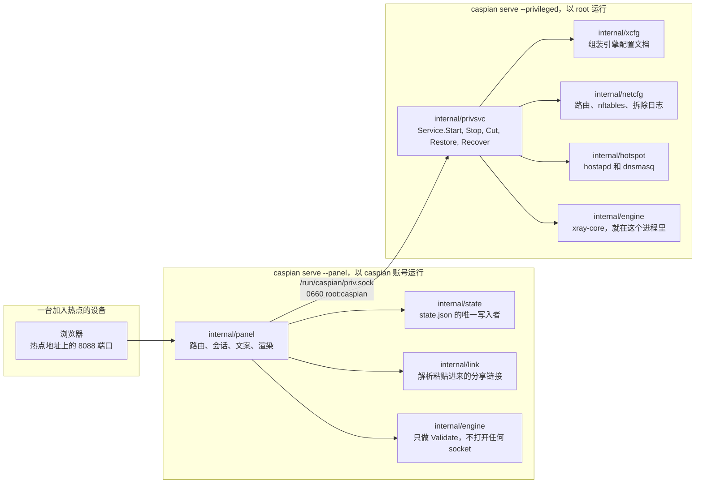
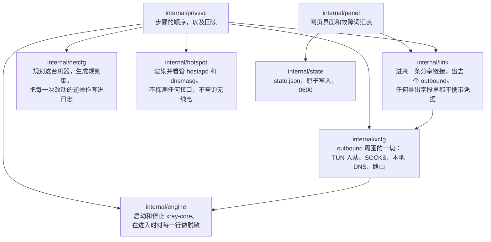
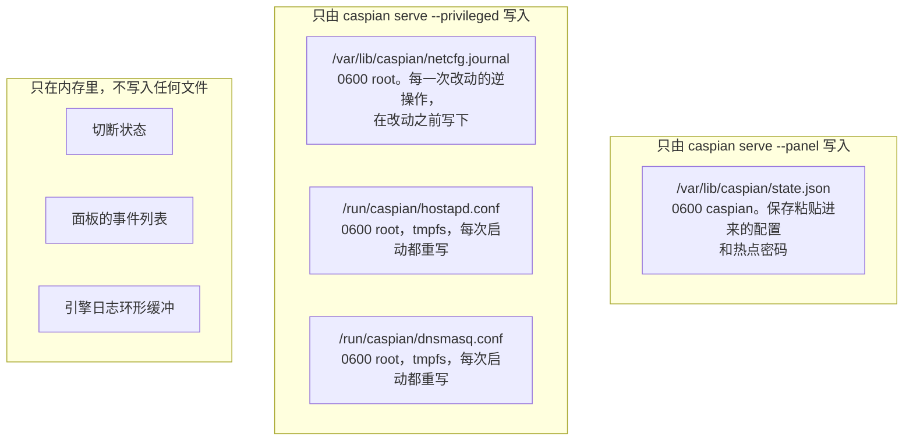
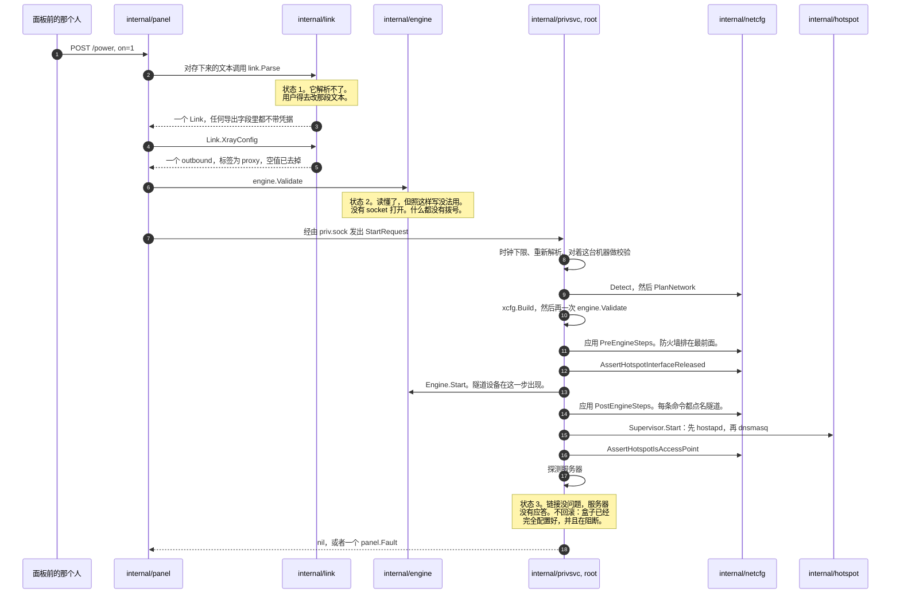
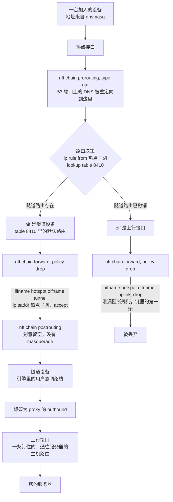
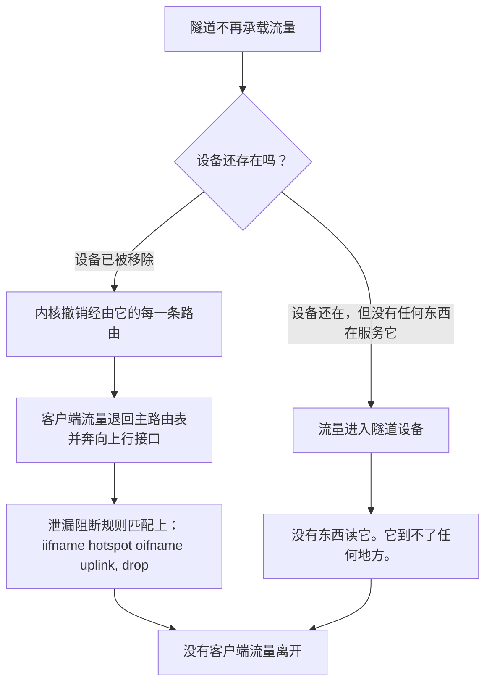
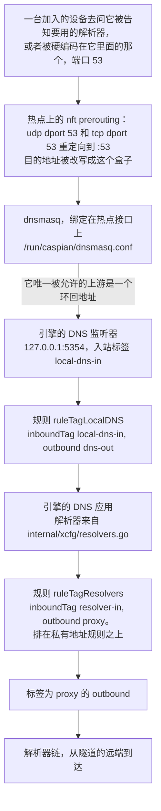
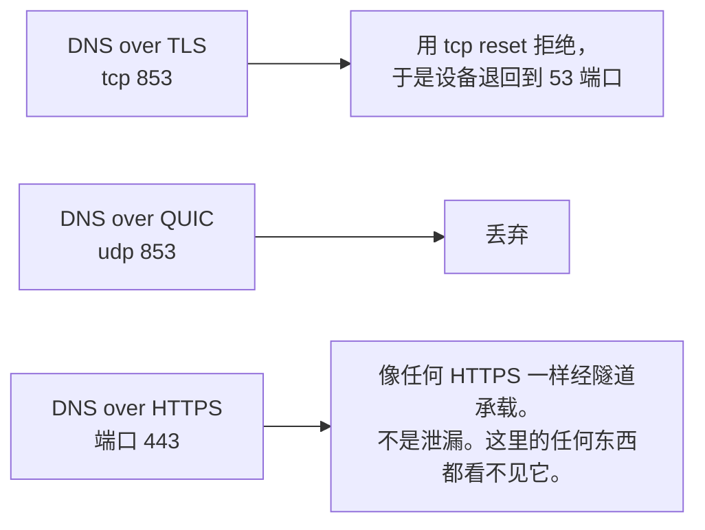

# 架构与数据流

[English](https://github.com/Iman/caspian/wiki/Architecture) | [فارسی](https://github.com/Iman/caspian/wiki/Architecture.fa) | [Русский](https://github.com/Iman/caspian/wiki/Architecture.ru) | [中文](https://github.com/Iman/caspian/wiki/Architecture.zh)

[Caspian Wiki](https://github.com/Iman/caspian/wiki/Home.zh)

> 本指南从现有 README 迁移而来。测量结果保留原有日期；此次文档迁移不代表重新运行了测试。
> [English](https://github.com/Iman/caspian/blob/108567a6a529be05b577ee68b65b48790f07e43d/README.md) | [فارسی](https://github.com/Iman/caspian/blob/108567a6a529be05b577ee68b65b48790f07e43d/README.fa.md) | [Русский](https://github.com/Iman/caspian/blob/108567a6a529be05b577ee68b65b48790f07e43d/README.ru.md) | [中文](https://github.com/Iman/caspian/blob/108567a6a529be05b577ee68b65b48790f07e43d/README.zh.md)

## 架构

### 两个进程，一个二进制

一个二进制文件以两种角色运行，由子命令选择。这样切分，是为了让解析用户输入并提供
HTTP 服务的那一部分出的故障，不会同时是持有 root 权限的那一部分的故障。
[`docs/LAYOUT.md`](https://github.com/Iman/caspian/blob/main/docs/LAYOUT.md) 的「Two processes, one binary」一节是关于这件事的固定表述。

[`cmd/caspian/main.go`](https://github.com/Iman/caspian/blob/main/cmd/caspian/main.go) 在自己的用法说明里就写出了这两个角色：

    caspian serve --privileged     root: routes, firewall, access point, engine
    caspian serve --panel          the caspian user: the web panel, nothing privileged

### 那个 socket，以及它的词汇表为什么是封闭的

[`internal/panel/priv.go`](https://github.com/Iman/caspian/blob/main/internal/panel/priv.go) 写下了整个权限切分之所以存在的那条规则："A privileged
helper that takes a path and an argument list from its client is not a boundary;
it is a way to run anything as root." 意思是：一个从客户端接收路径和参数列表的特权
助手不是一道边界；它是一条以 root 身份运行任何东西的途径。那个分号是他们自己写的。
这句话是原样引用的，因为把一条规则复述一遍，得到的就不是那条规则了。

所以面板根本没法表达「运行这个」。它只能点名八个动作中的一个，而每个动作是什么意思由
特权侧决定。`panel.Actions` 就是那个封闭集合，如果有人往接口里加了一个方法却没在这个
列表里给它一个名字，`TestActionVocabularyMatchesTheInterface` 就会失败。

| 动作 | 特权侧做什么 | 是否改动机器 |
|---|---|---|
| `detect` | 报告有哪些网络接口、无线电的能力上限，以及选定的子网 | 否 |
| `status` | 报告引擎所处的阶段、热点状态，以及流量是否被切断 | 否 |
| `start` | 把隧道和热点拉起来 | 是 |
| `stop` | 把它们停掉，并回放拆除日志 | 是 |
| `recover` | 停止、回放日志，然后用同一个请求重新启动 | 是 |
| `engine-log` | 返回引擎最近的日志行，已经做过脱敏 | 否 |
| `cut` | 丢弃转发的客户端流量，其余一切照常运行 | 是 |
| `restore` | 把转发的客户端流量放回去 | 是 |

一个请求，一个响应，一条连接。一条消息是 4 字节大端长度，后面跟着那么多字节的 JSON。
在分配或解析任何东西之前，长度会先和 `maxFrameBytes` 比对，所以一条超大的消息只要花
四个字节和一次拒绝。未知的 JSON 字段会被拒绝而不是被忽略。每个请求都会检查
`protocolVersion`。于是一个版本的面板去和另一个版本的特权服务对话，得到的是一次点名的
拒绝，而不是某个字段被悄悄解码成它的零值。

失败路径上除了一个词以外没有任何东西回传：要么是一个来自封闭集合的 `panel.Fault`，
要么是来自第二个封闭集合的 `privsvc.Refusal`。引擎自己的报错文本里嵌着用户的密钥
材料，所以它在特权侧被记录下来并丢弃。响应里根本没有可以让它搭车的字段。

### 哪个包归谁管

`internal/privsvc` 会用 `internal/link` 重新解析一遍 `StartRequest.ConfigJSON`，
而不是相信面板已经解析过了。它还会拿上网用的接口和这台机器自己的默认路由核对，拿热点
接口和这台机器自己的 `iw list` 输出核对，拿信道和无线电报告为可用的那些核对。

### 状态存在哪里，谁写它

两个写入者，两个文件，没有共享文件。两个进程都不写对方的文件，所以既不需要锁，也没有
需要防范的更新丢失。[`docs/LAYOUT.md`](https://github.com/Iman/caspian/blob/main/docs/LAYOUT.md) 的「Who writes what」一节记录了这个决定，以及它
推翻的那份更早的草案。

特权侧根本不读任何状态文件。它需要的一切都随启动请求一起送到。
`TestPrivsvcReadsNoStateFile` 会扫描那个包自己的源码，一旦它读了状态文件就失败，这是
一条注释做不到的事。

路径、权限位和属主的完整表格在 [`docs/LAYOUT.md`](https://github.com/Iman/caspian/blob/main/docs/LAYOUT.md) 里。端口也固定在那里：客户端 DNS 在
热点上用 53，引擎的 DNS 监听器在环回地址上用 5354，面板用 8088，诊断用的 SOCKS 入站在
环回地址上用 10808。

## 数据是怎么流动的

### 一条粘贴的分享链接变成一条运行中的隧道

[`internal/panel/handlers.go`](https://github.com/Iman/caspian/blob/main/internal/panel/handlers.go) 里的 `startNow` 记录了这个顺序，而正是这个顺序把三种
配置失败区分开来。在状态 1 和状态 2 都通过之前，机器上的任何东西都不会被碰。

那个时序里有三个细节是承重的。

引擎配置文档被组装了两次，理由不同。`internal/link` 只产出 outbound，别的什么都不产。
`internal/xcfg` 产出它周围的一切：客户端流量到达的 TUN 入站、环回上的 SOCKS 入站、
本地 DNS 监听器、解析器策略，以及路由规则。这些没有一样是取自调用方送来的内容。

中途失败的启动会被完整撤销。日志里已经写着每一次改动的逆操作，而且是在改动到达内核
之前就写到磁盘上的。一次失败的启动会让机器保持它被发现时的样子。

一台不应答的服务器不等于一个只配置了一半的盒子。每一次改动都成功了，防火墙在生效，
转发的客户端流量被阻断，因为隧道什么都没在载。所以这里报告故障，什么都不拆。

### 一个客户端数据包走的网络路径

泄漏阻断规则只点名热点和上行接口。它不可能因为隧道没了就失效，因为它压根没提隧道。
每一条放行客户端流量的规则都点名了隧道设备，所以那些规则会不再匹配，然后策略把一切
丢弃。

每个接口都按名字匹配，从不按索引。索引是在规则集加载时解析的，所以一个按索引点名隧道
的规则集在隧道不在时根本加载不了，而那正是它必须生效的时候。

postrouting 链是刻意空着的。一条朝上行接口的 masquerade，就是那一行会悄悄把这个设备
变成一台普通路由器的规则。

### 隧道消失时那条路径会怎样

究竟走哪一支还没有定论。[`internal/netcfg/testdata/PROVENANCE.md`](https://github.com/Iman/caspian/blob/main/internal/netcfg/testdata/PROVENANCE.md) 记录了 2026-08-30 在
目标机器上的一次观察：服务已经关闭，`xray0` 却仍出现在 NetworkManager 的设备列表里，
状态是 `connected (externally)`。这里没有查清原因，而且引擎并不是本项目的代码。两支
都不会泄漏，而且哪一支都不依赖于知道究竟发生的是哪一支。这正是那条阻断规则被写成只
点名热点和上行接口的原因。

### DNS 路径，它不是流量路径

这是人们最容易搞错的一部分。客户端的 DNS 查询不只是被放行。它是被截下来的。

这条链有四个性质，每一个都写清了是什么在支撑它。

重定向改写的是目的地址，所以一台把解析器硬编码在自己身上的设备是在这里被应答的，而不是
被放出去找它被告知要用的那一个。场景：「a client cannot reach a resolver of its own
choosing」。

DHCP 应答只把这个盒子报为解析器，不报第二个。这值得单独一个场景，因为搞错了是看不出来
的：重定向反正会改写那些数据包，所以线路上不会有任何东西显得不对。场景：「the box
offers itself as the resolver and never names another」。

`internal/hotspot` 会拒绝任何不是环回地址的 dnsmasq 上游。一个非环回的目标意味着查询
会在隧道之外离开盒子，而且是每一台客户端问的每一个名字都如此。在那里作答的是引擎的
监听器，如果两边的端口发生漂移，`TestLocalDNSDefaultMatchesTheHotspotUpstream` 会失败。
[`docs/LAYOUT.md`](https://github.com/Iman/caspian/blob/main/docs/LAYOUT.md) 把这一对称作「会安静地坏掉」的那一对：如果两者漂移了，每一台加入的
设备都会没法解析域名，而热点和隧道看上去都还健康。

把解析器自己的查询送进隧道的那条规则，排在把私有地址直连出去的那条规则之上。所以一个
位于私有地址上的解析器，仍然是经由隧道去到达，而不是在本地网络上。
`TestLocalDNSQueriesCannotFallOutToTheUplink` 和 `TestPrivateRangesRouteDirect` 各守
一半。

解析器链本身是分处三个司法辖区的三家运营商：Quad9 的过滤服务、Cloudflare 的 FAMILY
变体，以及 CleanBrowsing Security。[`internal/xcfg/resolvers.go`](https://github.com/Iman/caspian/blob/main/internal/xcfg/resolvers.go) 记录了为什么选每一个，
以及同一家运营商那个几乎一模一样、但被刻意不选的地址是哪一个。任何默认配置里都不出现
Google 的解析器，`TestNoGoogleAnywhereInGeneratedConfigs` 会扫描每一份生成的文档看有
没有。

其他端口都做了处理，其中有一个是处理不了的：

[English](https://github.com/Iman/caspian/blob/main/README.md) | [فارسی](https://github.com/Iman/caspian/blob/main/README.fa.md) | [Русский](https://github.com/Iman/caspian/blob/main/README.ru.md) | [中文](https://github.com/Iman/caspian/blob/main/README.zh.md)
