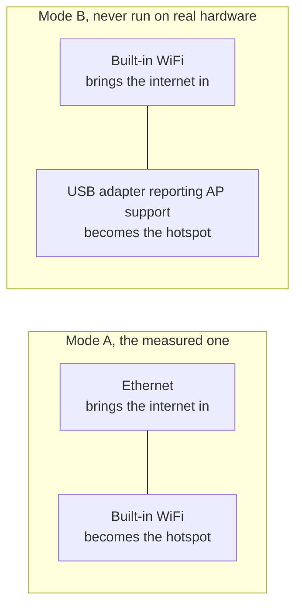

<!-- wiki-navigation:start -->

[English](https://github.com/Iman/caspian/wiki/Getting-Started) · [فارسی](https://github.com/Iman/caspian/wiki/Getting-Started.fa) · [Русский](https://github.com/Iman/caspian/wiki/Getting-Started.ru) · [简体中文](https://github.com/Iman/caspian/wiki/Getting-Started.zh) · [**العربية**](https://github.com/Iman/caspian/wiki/Getting-Started.ar) · [Türkçe](https://github.com/Iman/caspian/wiki/Getting-Started.tr) · [اردو](https://github.com/Iman/caspian/wiki/Getting-Started.ur)

[ويكي Caspian](https://github.com/Iman/caspian/wiki/Home.ar) · [استكشاف الأخطاء وإصلاحها](https://github.com/Iman/caspian/wiki/Troubleshooting.ar)

<!-- wiki-navigation:end -->

# البدء

[للتعرف على مخططات الاتصال وإعداد الكابل أولاً وإعادة تشغيل الخدمة والأخطاء الشائعة، اقرأ دليل استكشاف الأخطاء وإصلاحها للمستخدم المنزلي.](https://github.com/Iman/caspian/wiki/Troubleshooting.ar)

> يأتي هذا الدليل من ملف README الموجود. تحتفظ قياساتها بتواريخها الأصلية. لا يُبلغ نقل التوثيق هذا عن تشغيل اختباري جديد.
> [English](https://github.com/Iman/caspian/blob/108567a6a529be05b577ee68b65b48790f07e43d/README.md) | [فارسی](https://github.com/Iman/caspian/blob/108567a6a529be05b577ee68b65b48790f07e43d/README.fa.md) | [Русский](https://github.com/Iman/caspian/blob/108567a6a529be05b577ee68b65b48790f07e43d/README.ru.md) | [中文](https://github.com/Iman/caspian/blob/108567a6a529be05b577ee68b65b48790f07e43d/README.zh.md)

## ما هو عليه

الجمهور هو شخص تم إعطاؤه تكوينًا عمليًا من قبل شخص يثق به،
ومن يريد أن تعمل الأجهزة الموجودة في الغرفة. لن يفتحوا محطة ،
قراءة سجل، أو تحرير ملف. بعد التثبيت، يحدث كل إجراء في الملف
لوحة. راجع [`docs/2026-08-29-design.md`](https://github.com/Iman/caspian/blob/main/docs/2026-08-29-design.md)، الأقسام 5.1 و5.2.

المحرك هو xray-core v26.4.15 (إصدار وحدة Go `v1.260327.1-0.20260415235634-c5edc122b70e`)، مرتبط بالثنائي بدلاً من
تم تنزيله. محلل ارتباط المشاركة هو حزمة MIT `share` من XTLS/libXray،
يتم بيعها في العلامة v26.3.27 تحت `third_party/libxray-share/` بترخيصها الخاص
أبقى بجانبه.

يقبل `supportedSchemes` في [`internal/link/link.go`](https://github.com/Iman/caspian/blob/main/internal/link/link.go) سبعة مخططات: `vless`،
بما في ذلك REALITY، بالإضافة إلى `vmess`، `trojan`، `ss`، `socks`، `hysteria2` و
`hy2`. أي شيء آخر، بما في ذلك `tuic`، و`ssr`، و`wireguard`، و`anytls`، هو
رفض بالاسم.

## ما يحتاجه

يحتاج الاتصال إلى Windows 10 الإصدار 2004 (النسخة 19041) أو إصدار أحدث. على أقدم
Windows، العودة إلى الإصدار 1607، يتم تثبيت Caspian وتفتح اللوحة وتقول
ما لا يستطيع هذا الإصدار فعله. تتضمن الإصدارات الحالية Windows 10 الإصدار 2004 (النسخة 19041) أو الإصدارات الأحدث و
Windows 11 على x64 وARM64، وmacOS 13 أو أحدث على Intel وApple Silicon، و
Linux على x86_64 وARM64 وARMv7 وARMv6. أندرويد و iOS
ليسوا مضيفين للبوابة؛ تنضم الهواتف والأجهزة اللوحية إلى شبكة Caspian Wi-Fi كعملاء.

يسجل [`internal/netcfg/testdata/PROVENANCE.md`](https://github.com/Iman/caspian/blob/main/internal/netcfg/testdata/PROVENANCE.md) الجهاز الذي كان عليه
تم تطويره وقياسه وفقًا لـ: Raspberry Pi 5 Model B Rev 1.0 وDebian 13
(تريكسي)، النواة 6.18.34+rpt-rpi-2712 aarch64، nftables 1.1.3، iw 6.9،
iproute2 6.15.0، brcmfmac على phy0، تم تقديم NetworkManager بواسطة netplan.

[`install.sh`](https://github.com/Iman/caspian/blob/main/install.sh) يرفض، قبل أن يلمس الجهاز، أي شيء ليس من نظام Linux
على x86_64، أو aarch64، أوarmv7l، أوarmv6l، مع الإصدار systemd 240 أو الأحدث، قم بتشغيله كجذر.
كل رفض يذكر ما وجده.

تحتاج الواجهة الخلفية لنظامي Linux وRaspberry Pi إلى واجهتين للشبكة في إحدى هاتين الواجهتين
الترتيبات أدناه. راجع [`docs/2026-08-29-design.md`](https://github.com/Iman/caspian/blob/main/docs/2026-08-29-design.md)، القسم 4.7. الحالي
تستخدم الواجهة الخلفية لنظام التشغيل macOS شبكة إيثرنت سلكية للاتصال بالإنترنت ومدمجة
واي فاي لنقطة الاتصال. يستخدم Windows محول Wi-Fi يدعم الهاتف المحمول
نقطة اتصال.

لم يتم تشغيل الوضع B مطلقًا. يسجل `PROVENANCE.md` أن الهدف قد تم تحديده بالضبط
راديو واحد ولا يوجد جهاز USB متصل، لذلك يتم توصيل كل وضع B في الشجرة
تأليف بدلا من التقاطها.

**بالنسبة للأجهزة التي تم قياسها، فإن رفع نقطة الاتصال يكلف الصندوق نفسه
WiFi.** يرفض برنامج التشغيل `brcmfmac` `iw phy phy0 interface add ap0 type __ap`
مع `Input/output error (-5)`، على الرغم من أن `iw list` يعلن عن
مزيج. لذلك يعود الجهاز إلى الاستيلاء على `wlan0`: فهو يطلق ملف
واجهة من NetworkManager، تزيل العنوان الموجود على الشبكة المنزلية،
ويعيد كتابته. كل من الرفض وتسلسل الاستحواذ الناجح
تم قياسها وتسجيلها في `PROVENANCE.md`. اللوحة والسجل يقولان ما ذلك
التكاليف قبل حدوثها. الاختبار: `TestTheTakeoverSaysWhatItCost`.

يبقى إنشاء واجهة ثانية هو الخيار الأول، لأنه عندما يتم تشغيله
لا يكلف المستخدم شيئا. يتم الوصول إلى الخيار الاحتياطي فقط بعد الاختيار الأول
تمت محاكمتها ورفضها، وتم هدم الخطة الأولى بالكامل قبل
يتم تطبيق الثاني.

<!-- SNI upstream credits -->

أرصدة انتحال SNI: [patterniha/SNI-Spoofing](https://github.com/patterniha/SNI-Spoofing) (GPL-3.0)، مع WinDivert (LGPL-3.0) على نظام التشغيل Windows x64.
[تراخيص الطرف الثالث، والإصدارات المصدر، والائتمانات](https://github.com/Iman/caspian/blob/feature/sni/docs/THIRD-PARTY.md).

<!-- English-source-sha256: a5c74774081ac02e3989f9029f44839c260680e1757760cd49c2d5dfabe4ed92 -->
