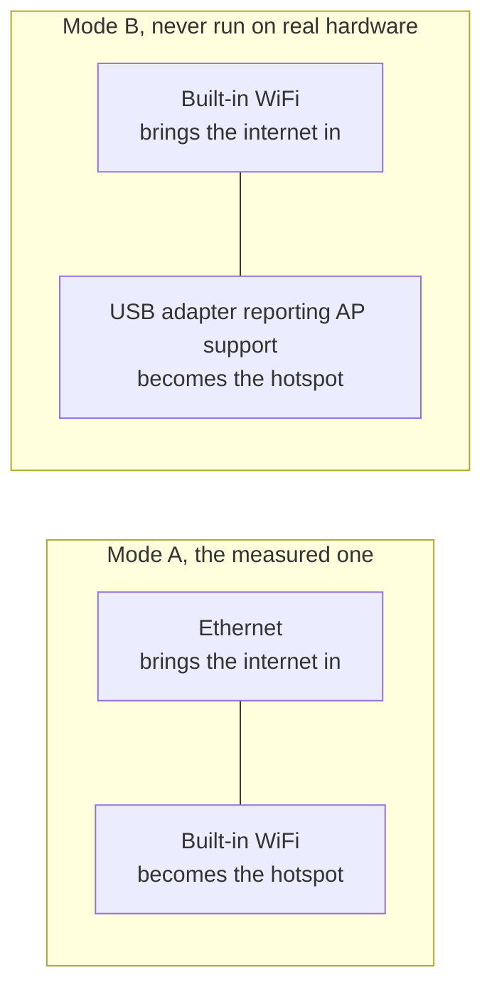

<!-- wiki-navigation:start -->

[English](https://github.com/Iman/caspian/wiki/Getting-Started) · [**فارسی**](https://github.com/Iman/caspian/wiki/Getting-Started.fa) · [Русский](https://github.com/Iman/caspian/wiki/Getting-Started.ru) · [简体中文](https://github.com/Iman/caspian/wiki/Getting-Started.zh) · [العربية](https://github.com/Iman/caspian/wiki/Getting-Started.ar) · [Türkçe](https://github.com/Iman/caspian/wiki/Getting-Started.tr) · [اردو](https://github.com/Iman/caspian/wiki/Getting-Started.ur)

[ویکی کاسپین](https://github.com/Iman/caspian/wiki/Home.fa) · [عیب‌یابی](https://github.com/Iman/caspian/wiki/Troubleshooting.fa)

<!-- wiki-navigation:end -->

# شروع کردن

[برای نمودارهای اتصال، راه اندازی اول کابل، راه اندازی مجدد سرویس و خطاهای رایج، راهنمای عیب یابی کاربر خانگی را بخوانید.](https://github.com/Iman/caspian/wiki/Troubleshooting.fa)

> این راهنما از README موجود می آید. اندازه گیری های آن تاریخ اصلی خود را حفظ می کند. این حرکت مستندسازی اجرای آزمایشی جدیدی را گزارش نمی‌کند.
> [English](https://github.com/Iman/caspian/blob/108567a6a529be05b577ee68b65b48790f07e43d/README.md) | [فارسی](https://github.com/Iman/caspian/blob/108567a6a529be05b577ee68b65b48790f07e43d/README.fa.md) | [Русский](https://github.com/Iman/caspian/blob/108567a6a529be05b577ee68b65b48790f07e43d/README.ru.md) | [中文](https://github.com/Iman/caspian/blob/108567a6a529be05b577ee68b65b48790f07e43d/README.zh.md)

## برای چیست

مخاطب کسی است که توسط شخصی که به او اعتماد دارد یک پیکربندی کار داده شده است.
و چه کسی می خواهد دستگاه های موجود در اتاق کار کنند. آنها ترمینال را باز نمی کنند،
یک گزارش را بخوانید یا یک فایل را ویرایش کنید. پس از نصب، هر عملی در قسمت انجام می شود
پانل. به [`docs/2026-08-29-design.md`](https://github.com/Iman/caspian/blob/main/docs/2026-08-29-design.md)، بخش‌های 5.1 و 5.2 مراجعه کنید.

موتور xray-core v26.4.15 (نسخه ماژول Go نسخه `v1.260327.1-0.20260415235634-c5edc122b70e`) است، به جای اینکه به باینری متصل شود
دانلود شده است. تجزیه کننده پیوند اشتراکی، بسته MIT `share` از XTLS/libXray است،
عرضه شده در برچسب v26.3.27 تحت `third_party/libxray-share/` با مجوز خاص خود
در کنار آن نگه داشته شد

`supportedSchemes` در [`internal/link/link.go`](https://github.com/Iman/caspian/blob/main/internal/link/link.go) هفت طرح را می پذیرد: `vless`،
از جمله REALITY، به علاوه `vmess`، `trojan`، `ss`، `socks`، `hysteria2` و
`hy2`. هر چیز دیگری، از جمله `tuic`، `ssr`، `wireguard` و `anytls`،
با نام خودداری کرد

## آنچه نیاز دارد

اتصال به ویندوز 10 نسخه 2004 (بیلد 19041) یا جدیدتر نیاز دارد. روی یک بزرگتر
ویندوز برگشت به ورژن 1607 کاسپین نصب میکنه و پنل باز میشه و میگه
کاری که آن نسخه نمی تواند انجام دهد. نسخه های فعلی شامل ویندوز 10 نسخه 2004 (بیلد 19041) یا جدیدتر و
ویندوز 11 در x64 و ARM64، macOS 13 یا جدیدتر در Intel و Apple Silicon و
لینوکس در x86_64، ARM64، ARMv7 و ARMv6. اندروید و iOS
میزبان دروازه نیستند. تلفن ها و تبلت ها به عنوان مشتری به وای فای کاسپین می پیوندند.

[`internal/netcfg/testdata/PROVENANCE.md`](https://github.com/Iman/caspian/blob/main/internal/netcfg/testdata/PROVENANCE.md) دستگاهی را که بوده است ثبت می کند
توسعه یافته و اندازه گیری شده بر اساس: Raspberry Pi 5 Model B Rev 1.0, Debian 13
(trixie)، هسته 6.18.34+rpt-rpi-2712 aarch64، nftables 1.1.3، iw 6.9،
iproute2 6.15.0، brcmfmac در phy0، NetworkManager ارائه شده توسط netplan.

[`install.sh`](https://github.com/Iman/caspian/blob/main/install.sh)، قبل از اینکه دستگاه را لمس کند، از هر چیزی که لینوکس نیست، امتناع می کند
در x86_64، aarch64، armv7l یا armv6l، با systemd 240 یا جدیدتر، به صورت root اجرا شود.
هر امتناع چیزی را که پیدا کرده نام می برد.

باطن لینوکس و رزبری پای به دو رابط شبکه در یکی از آنها نیاز دارد
ترتیبات زیر [`docs/2026-08-29-design.md`](https://github.com/Iman/caspian/blob/main/docs/2026-08-29-design.md)، بخش 4.7 را ببینید. جریان
باطن macOS از اترنت سیمی برای اتصال به اینترنت و داخلی استفاده می کند
Wi-Fi برای هات اسپات. ویندوز از یک آداپتور Wi-Fi استفاده می کند که از موبایل پشتیبانی می کند
هات اسپات.

حالت B هرگز اجرا نشده است. `PROVENANCE.md` ثبت می کند که هدف دقیقاً دارد
یک رادیو و هیچ دستگاه USB متصل نشده است، بنابراین هر فیکسچر حالت B در درخت وجود دارد
به جای ضبط

**در سخت افزار اندازه گیری شده، بالا بردن نقطه اتصال هزینه جعبه را دارد
WiFi.** درایور `brcmfmac` `iw phy phy0 interface add ap0 type __ap` را رد می کند
با `Input/output error (-5)`، حتی اگر `iw list` تبلیغ می کند
ترکیبی بنابراین دستگاه به تصاحب `wlan0` برمی گردد: آن را آزاد می کند
رابط از NetworkManager، آدرسی را که در شبکه خانه نگه می‌دارد، حذف می‌کند،
و آن را دوباره تایپ می کند. هر دو رد و توالی تصاحب موفق هستند
اندازه گیری و در `PROVENANCE.md` ثبت شد. پانل و گزارش می گویند که چه
هزینه های قبل از وقوع تست: `TestTheTakeoverSaysWhatItCost`.

ایجاد یک رابط دوم در انتخاب اول باقی می‌ماند، زیرا وقتی کار می‌کند
هیچ هزینه ای برای کاربر ندارد بازگشت مجدد تنها پس از انتخاب اول حاصل می شود
محاکمه شد و رد شد و طرح اول به طور کامل از بین رفت
دوم اعمال می شود.

<!-- SNI upstream credits -->

اعتبارات جعل SNI: [patterniha/SNI-Spoofing](https://github.com/patterniha/SNI-Spoofing) (GPL-3.0)، با WinDivert (LGPL-3.0) در Windows x64.
[مجوزهای شخص ثالث، نسخه های منبع، و اعتبار](https://github.com/Iman/caspian/blob/feature/sni/docs/THIRD-PARTY.md).

<!-- English-source-sha256: a5c74774081ac02e3989f9029f44839c260680e1757760cd49c2d5dfabe4ed92 -->
