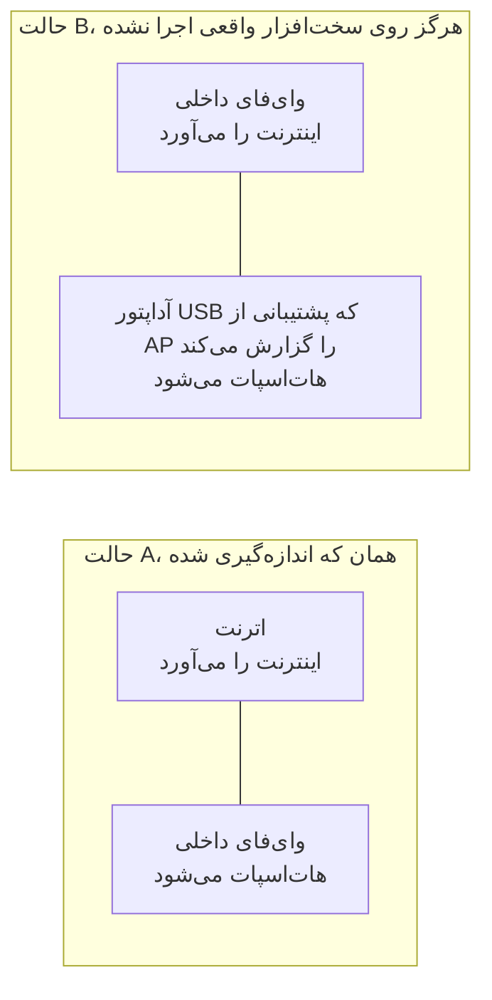

# شروع کار

[English](https://github.com/Iman/caspian/wiki/Getting-Started) | [فارسی](https://github.com/Iman/caspian/wiki/Getting-Started.fa) | [Русский](https://github.com/Iman/caspian/wiki/Getting-Started.ru) | [中文](https://github.com/Iman/caspian/wiki/Getting-Started.zh)

[ویکی کاسپین](https://github.com/Iman/caspian/wiki/Home.fa)

> این راهنما از README موجود منتقل شده است. تاریخ اندازه‌گیری‌ها همان تاریخ اصلی است؛ این جابه‌جایی گزارش اجرای تازهٔ آزمون‌ها نیست.
> [English](https://github.com/Iman/caspian/blob/108567a6a529be05b577ee68b65b48790f07e43d/README.md) | [فارسی](https://github.com/Iman/caspian/blob/108567a6a529be05b577ee68b65b48790f07e43d/README.fa.md) | [Русский](https://github.com/Iman/caspian/blob/108567a6a529be05b577ee68b65b48790f07e43d/README.ru.md) | [中文](https://github.com/Iman/caspian/blob/108567a6a529be05b577ee68b65b48790f07e43d/README.zh.md)

## این برای چیست

مخاطب کسی است که یک کانفیگ سالم را از آدمی که به او اعتماد دارد گرفته و می‌خواهد
دستگاه‌های داخل اتاق کار کنند. او ترمینال باز نمی‌کند، گزارش نمی‌خواند و فایلی
را ویرایش نمی‌کند. بعد از نصب، هر کاری در پنل انجام می‌شود. ببینید
[`docs/2026-08-29-design.md`](https://github.com/Iman/caspian/blob/main/docs/2026-08-29-design.md)، بخش‌های 5.1 و 5.2.

نرم‌افزار اتصال، xray-core نسخهٔ v26.4.15 (Go module version `v1.260327.1-0.20260415235634-c5edc122b70e`) است که به‌جای دانلود شدن، داخل خودِ
فایل اجرایی لینک شده است. تجزیه‌کنندهٔ لینک اشتراک‌گذاری، بستهٔ `share` با پروانهٔ
MIT از XTLS/libXray است که در تگ v26.3.27 زیر `third_party/libxray-share/`
همراه با پروانهٔ خودش نگهداری می‌شود.

`supportedSchemes` در [`internal/link/link.go`](https://github.com/Iman/caspian/blob/main/internal/link/link.go) هفت اسکیم را می‌پذیرد: `vless` که
REALITY را هم شامل می‌شود، به‌علاوهٔ `vmess`، `trojan`، `ss`، `socks`،
`hysteria2` و `hy2`. هر چیز دیگری، از جمله `tuic`، `ssr`، `wireguard` و
`anytls`، با نام رد می‌شود.

## به چه نیاز دارد

انتشارهای کنونی Windows 11 روی x64 و ARM64، نسخهٔ macOS 13 یا جدیدتر روی Intel
و Apple Silicon، و Linux روی x86_64، ARM64، ARMv7 و ARMv6 را در بر می‌گیرند.
Android و iOS میزبان دروازه نیستند؛ تلفن و تبلت به‌عنوان دستگاه به وای‌فای
Caspian وصل می‌شوند.

Windows 10 نسخهٔ 2004 (بیلد 19041) یا جدیدتر روی x64 یک هدف آزمایشی برای
انتشار Windows است. نصب و عملکرد هات‌اسپات روی آن هنوز به تست نیاز دارد.

[`internal/netcfg/testdata/PROVENANCE.md`](https://github.com/Iman/caspian/blob/main/internal/netcfg/testdata/PROVENANCE.md) دستگاهی را که این پروژه روی آن توسعه و
اندازه‌گیری شده ثبت کرده است: یک Raspberry Pi 5 Model B Rev 1.0، Debian 13
(trixie)، هستهٔ 6.18.34+rpt-rpi-2712 aarch64، nftables 1.1.3، iw 6.9،
iproute2 6.15.0، brcmfmac روی phy0، و NetworkManager که netplan آن را می‌سازد.

[`install.sh`](https://github.com/Iman/caspian/blob/main/install.sh) پیش از آنکه به دستگاه دست بزند، هر چیزی را که لینوکس روی x86_64،
aarch64، armv7l یا armv6l نباشد، با systemd نسخهٔ 240 یا بالاتر، و اجراشده با
root، رد می‌کند. هر ردکردن می‌گوید چه دیده.

بخش Linux و Raspberry Pi به دو رابط شبکه در یکی از چیدمان‌های زیر نیاز دارد.
ببینید [`docs/2026-08-29-design.md`](https://github.com/Iman/caspian/blob/main/docs/2026-08-29-design.md)، بخش 4.7. در بخش فعلی macOS، اینترنت از
Ethernet سیمی می‌آید و وای‌فای داخلی هات‌اسپات می‌شود. Windows از رابط وای‌فایی
استفاده می‌کند که Mobile Hotspot را پشتیبانی کند.

حالت B هرگز اجرا نشده است. `PROVENANCE.md` ثبت کرده که دستگاهِ هدف دقیقاً یک
رادیو دارد و هیچ دستگاه USB ای به آن وصل نیست، پس هر فیکسچرِ حالت B در این درخت
نوشته شده است و از دستگاه گرفته نشده.

**روی سخت‌افزاری که اندازه‌گیری شده، بالا آوردنِ هات‌اسپات به قیمتِ از دست رفتنِ
وای‌فایِ خودِ دستگاه تمام می‌شود.** درایور `brcmfmac` فرمانِ
`iw phy phy0 interface add ap0 type __ap` را با `Input/output error (-5)` رد
می‌کند، هرچند `iw list` آن ترکیب را تبلیغ می‌کند. پس دستگاه به تصاحبِ `wlan0`
عقب می‌نشیند: رابط را از NetworkManager آزاد می‌کند، آدرسی را که روی شبکهٔ خانه
دارد برمی‌دارد، و نوعش را عوض می‌کند. هم آن ردکردن و هم توالیِ موفقِ تصاحب
اندازه‌گیری و در `PROVENANCE.md` ثبت شده‌اند. پنل و گزارش، پیش از آنکه این اتفاق
بیفتد، می‌گویند هزینه‌اش چیست. آزمون: `TestTheTakeoverSaysWhatItCost`.

ساختنِ یک رابطِ دوم همچنان انتخابِ اول است، چون وقتی کار کند برای کاربر هزینه‌ای
ندارد. راهِ دوم فقط بعد از آنکه انتخابِ اول امتحان و رد شد سراغش می‌روند، و نقشهٔ
اول کاملاً برچیده می‌شود پیش از آنکه نقشهٔ دوم اعمال شود.

[English](https://github.com/Iman/caspian/blob/main/README.md) | [فارسی](https://github.com/Iman/caspian/blob/main/README.fa.md) | [Русский](https://github.com/Iman/caspian/blob/main/README.ru.md) | [中文](https://github.com/Iman/caspian/blob/main/README.zh.md)

