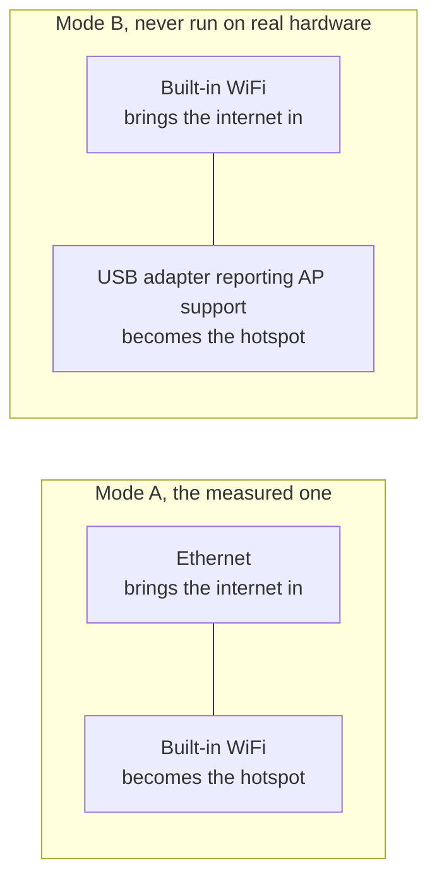

# Getting started

[English](https://github.com/Iman/caspian/wiki/Getting-Started) | [فارسی](https://github.com/Iman/caspian/wiki/Getting-Started.fa) | [Русский](https://github.com/Iman/caspian/wiki/Getting-Started.ru) | [中文](https://github.com/Iman/caspian/wiki/Getting-Started.zh)

[Caspian wiki](https://github.com/Iman/caspian/wiki/Home)

> This guide comes from the existing README. Its measurements retain their original dates; this documentation move does not report a new test run.
> [English](https://github.com/Iman/caspian/blob/108567a6a529be05b577ee68b65b48790f07e43d/README.md) | [فارسی](https://github.com/Iman/caspian/blob/108567a6a529be05b577ee68b65b48790f07e43d/README.fa.md) | [Русский](https://github.com/Iman/caspian/blob/108567a6a529be05b577ee68b65b48790f07e43d/README.ru.md) | [中文](https://github.com/Iman/caspian/blob/108567a6a529be05b577ee68b65b48790f07e43d/README.zh.md)

## What it is for

The audience is somebody who was given a working config by a person they trust,
and who wants the devices in the room to work. They will not open a terminal,
read a log, or edit a file. After the install, every action happens in the
panel. See [`docs/2026-08-29-design.md`](https://github.com/Iman/caspian/blob/main/docs/2026-08-29-design.md), sections 5.1 and 5.2.

The engine is xray-core v26.4.15 (Go module version `v1.260327.1-0.20260415235634-c5edc122b70e`), linked into the binary rather than
downloaded. The share-link parser is the MIT `share` package from XTLS/libXray,
vendored at tag v26.3.27 under `third_party/libxray-share/` with its own licence
kept beside it.

`supportedSchemes` in [`internal/link/link.go`](https://github.com/Iman/caspian/blob/main/internal/link/link.go) accepts seven schemes: `vless`,
including REALITY, plus `vmess`, `trojan`, `ss`, `socks`, `hysteria2` and
`hy2`. Anything else, including `tuic`, `ssr`, `wireguard` and `anytls`, is
refused by name.

## What it needs

Current releases include Windows 11 on x64 and ARM64, macOS 13 or later on Intel
and Apple Silicon, and Linux on x86_64, ARM64, ARMv7 and ARMv6. Android and iOS
are not gateway hosts; phones and tablets join the Caspian Wi-Fi as clients.

Windows 10 version 2004 (build 19041) or later on x64 is an experimental target
for the Windows release. It still needs installation and hotspot testing.

[`internal/netcfg/testdata/PROVENANCE.md`](https://github.com/Iman/caspian/blob/main/internal/netcfg/testdata/PROVENANCE.md) records the machine this has been
developed and measured against: a Raspberry Pi 5 Model B Rev 1.0, Debian 13
(trixie), kernel 6.18.34+rpt-rpi-2712 aarch64, nftables 1.1.3, iw 6.9,
iproute2 6.15.0, brcmfmac on phy0, NetworkManager rendered by netplan.

[`install.sh`](https://github.com/Iman/caspian/blob/main/install.sh) refuses, before it touches the machine, anything that is not Linux
on x86_64, aarch64, armv7l or armv6l, with systemd 240 or newer, run as root.
Each refusal names what it found.

The Linux and Raspberry Pi backend needs two network interfaces in one of the
arrangements below. See [`docs/2026-08-29-design.md`](https://github.com/Iman/caspian/blob/main/docs/2026-08-29-design.md), section 4.7. The current
macOS backend uses wired Ethernet for the internet connection and built-in
Wi-Fi for the hotspot. Windows uses a Wi-Fi adapter that supports Mobile
Hotspot.

Mode B has never been run. `PROVENANCE.md` records that the target has exactly
one radio and no USB device attached, so every mode B fixture in the tree is
authored rather than captured.

**On the measured hardware, bringing the hotspot up costs the box its own
WiFi.** The `brcmfmac` driver refuses `iw phy phy0 interface add ap0 type __ap`
with `Input/output error (-5)`, even though `iw list` advertises the
combination. So the appliance falls back to taking over `wlan0`: it releases the
interface from NetworkManager, strips the address it holds on the house network,
and retypes it. Both the refusal and the successful takeover sequence are
measured and recorded in `PROVENANCE.md`. The panel and the log say what that
costs before it happens. Test: `TestTheTakeoverSaysWhatItCost`.

Creating a second interface stays the first choice, because when it works it
costs the user nothing. The fallback is reached only after the first choice has
been tried and refused, and the first plan is torn down completely before the
second is applied.

[English](https://github.com/Iman/caspian/blob/main/README.md) | [فارسی](https://github.com/Iman/caspian/blob/main/README.fa.md) | [Русский](https://github.com/Iman/caspian/blob/main/README.ru.md) | [中文](https://github.com/Iman/caspian/blob/main/README.zh.md)
