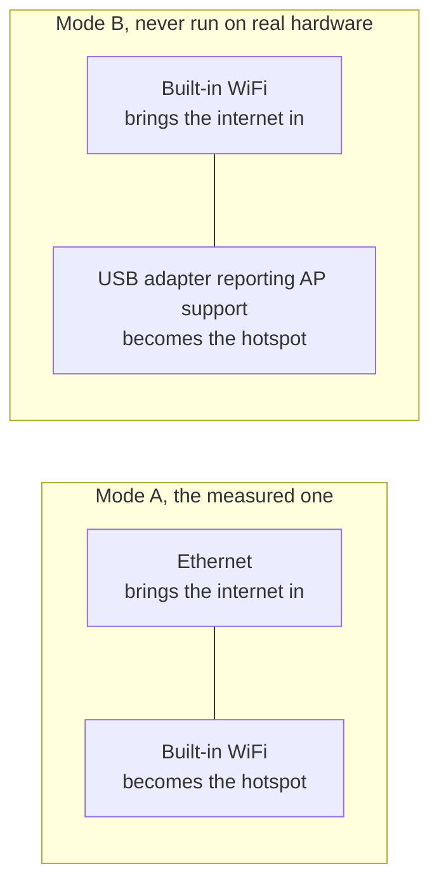

[English](https://github.com/Iman/caspian/wiki/Getting-Started) | [فارسی](https://github.com/Iman/caspian/wiki/Getting-Started.fa) | [Русский](https://github.com/Iman/caspian/wiki/Getting-Started.ru) | [中文](https://github.com/Iman/caspian/wiki/Getting-Started.zh) | [العربية](https://github.com/Iman/caspian/wiki/Getting-Started.ar) | [Türkçe](https://github.com/Iman/caspian/wiki/Getting-Started.tr) | [اردو](https://github.com/Iman/caspian/wiki/Getting-Started.ur)

# Начало работы

[Схемы подключения, настройку с подключением кабеля, перезапуск службы и распространенные ошибки см. в руководстве по устранению неполадок для домашних пользователей.](https://github.com/Iman/caspian/wiki/Troubleshooting.ru)

[Caspian вики](https://github.com/Iman/caspian/wiki/Home.ru)

> Это руководство взято из существующего README. Его измерения сохраняют свои первоначальные даты; этот шаг документации не сообщает о новом тестовом запуске.
> [English](https://github.com/Iman/caspian/blob/108567a6a529be05b577ee68b65b48790f07e43d/README.md) | [فارسی](https://github.com/Iman/caspian/blob/108567a6a529be05b577ee68b65b48790f07e43d/README.fa.md) | [Русский](https://github.com/Iman/caspian/blob/108567a6a529be05b577ee68b65b48790f07e43d/README.ru.md) | [中文](https://github.com/Iman/caspian/blob/108567a6a529be05b577ee68b65b48790f07e43d/README.zh.md)

## Для чего это нужно

Аудитория – это тот, кому доверяемый человек предоставил рабочую конфигурацию.
и кто хочет, чтобы устройства в комнате работали. Они не откроют терминал,
прочитать журнал или отредактировать файл. После установки все действия происходят в
панель. См. [`docs/2026-08-29-design.md`](https://github.com/Iman/caspian/blob/main/docs/2026-08-29-design.md), разделы 5.1 и 5.2.

Движок — xray-core v26.4.15 (версия модуля Go `v1.260327.1-0.20260415235634-c5edc122b70e`), связанный с двоичным файлом, а не с
скачал. Анализатор общих ссылок — это пакет MIT `share` из XTLS/libXray,
продается по тегу v26.3.27 под `third_party/libxray-share/` с собственной лицензией
держался рядом с ним.

`supportedSchemes` в [`internal/link/link.go`](https://github.com/Iman/caspian/blob/main/internal/link/link.go) принимает семь схем: `vless`,
включая REALITY, а также `vmess`, `trojan`, `ss`, `socks`, `hysteria2` и
`hy2`. Все остальное, включая `tuic`, `ssr`, `wireguard` и `anytls`,
отказался по имени.

## Что ему нужно

Для подключения требуется Windows 10 версии 2004 (сборка 19041) или более поздней версии. На более старом
Винда, вернулась к версии 1607, Каспиан устанавливает и открывается панель и говорит
что эта версия не может сделать. Текущие выпуски включают Windows 10 версии 2004 (сборка 19041) или более позднюю версию.
Windows 11 на x64 и ARM64, macOS 13 или новее на Intel и Apple Silicon, а также
Linux на x86_64, ARM64, ARMv7 и ARMv6. Андроид и iOS
не являются узлами шлюза; телефоны и планшеты присоединяются к «Caspianскому Wi-Fi» в качестве клиентов.

[`internal/netcfg/testdata/PROVENANCE.md`](https://github.com/Iman/caspian/blob/main/internal/netcfg/testdata/PROVENANCE.md) записывает машину, на которой это было сделано.
разработано и протестировано на основе: Raspberry Pi 5 Model B Rev 1.0, Debian 13.
(трикси), ядро 6.18.34+rpt-rpi-2712 aarch64, nftables 1.1.3, iw 6.9,
iproute2 6.15.0, brcmfmac на phy0, NetworkManager, созданный с помощью netplan.

[`install.sh`](https://github.com/Iman/caspian/blob/main/install.sh) отказывается, прежде чем коснется машины, от всего, кроме Linux.
на x86_64, aarch64, Armv7l или Armv6l, с systemd 240 или новее, запускайте от имени пользователя root.
Каждый отказ называет то, что он нашел.

Серверной части Linux и Raspberry Pi требуется два сетевых интерфейса в одном из
договоренности ниже. См. [`docs/2026-08-29-design.md`](https://github.com/Iman/caspian/blob/main/docs/2026-08-29-design.md), раздел 4.7. Электрический ток
Серверная часть macOS использует проводной Ethernet для подключения к Интернету и встроенный
Wi-Fi для точки доступа. Windows использует адаптер Wi-Fi, поддерживающий мобильные устройства.
Точка доступа.

Режим B никогда не запускался. `PROVENANCE.md` записывает, что цель имеет ровно
одно радио и ни одно USB-устройство не подключено, поэтому каждое устройство режима B в дереве
создано, а не запечатлено.

**На измеренном оборудовании включение точки доступа обходится отдельно
WiFi.** Драйвер `brcmfmac` отказывается от `iw phy phy0 interface add ap0 type __ap`.
с `Input/output error (-5)`, хотя `iw list` рекламирует
комбинация. Таким образом, устройство возвращается к управлению `wlan0`: оно освобождает
интерфейс из NetworkManager удаляет адрес, который он хранит в домашней сети,
и перепечатывает его. И отказ, и успешная последовательность поглощения
измерено и записано в `PROVENANCE.md`. Панель и журнал говорят, что это
затраты до того, как это произойдет. Тест: `TestTheTakeoverSaysWhatItCost`.

Создание второго интерфейса остается первым выбором, потому что, когда он работает, он
пользователю ничего не стоит. Резервный вариант достигается только после того, как был сделан первый выбор.
был опробован, но ему было отказано, и первый план был полностью разрушен до того, как
применяется второй.

<!-- SNI upstream credits -->

Кредиты на подмену SNI: [patterniha/SNI-Spoofing](https://github.com/patterniha/SNI-Spoofing) (GPL-3.0) с WinDivert (LGPL-3.0) в Windows x64.
[Сторонние лицензии, исходные версии и авторство](https://github.com/Iman/caspian/blob/feature/sni/docs/THIRD-PARTY.md).

<!-- Caspian guide navigation -->

Caspianские гиды: [настройка и поддерживаемые протоколы](https://github.com/Iman/caspian/wiki/Home.ru) · [Подмена SNI для обхода DPI: настройка и ограничения](https://github.com/Iman/caspian/wiki/SNI-Spoofing.ru).

<!-- English-source-sha256: 629d6e2b6255b16d3bc76228a7aec238747c2de1af4bc20e44050dafefa13075 -->
