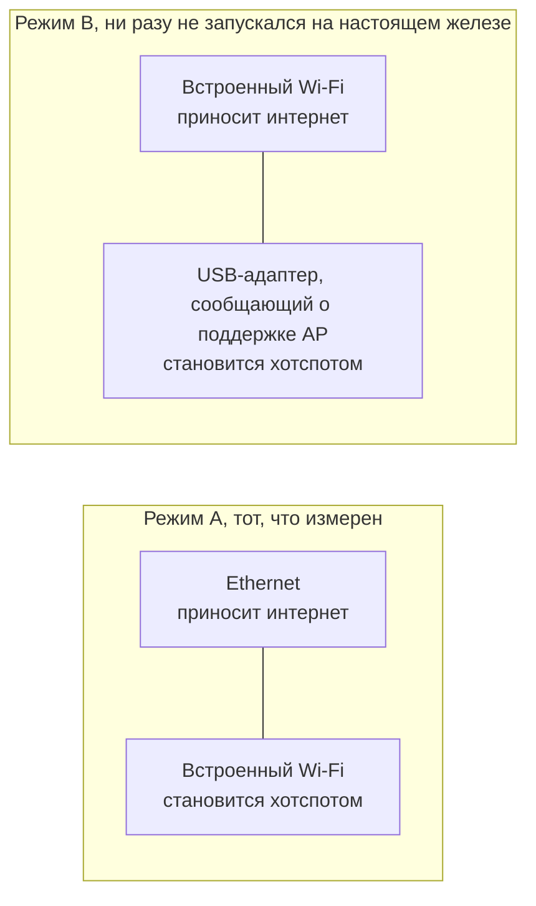

# Начало работы

[English](https://github.com/Iman/caspian/wiki/Getting-Started) | [فارسی](https://github.com/Iman/caspian/wiki/Getting-Started.fa) | [Русский](https://github.com/Iman/caspian/wiki/Getting-Started.ru) | [中文](https://github.com/Iman/caspian/wiki/Getting-Started.zh)

[Вики Caspian](https://github.com/Iman/caspian/wiki/Home.ru)

> Руководство перенесено из README. Даты измерений сохранены; перенос документации не означает нового запуска тестов.
> [English](https://github.com/Iman/caspian/blob/108567a6a529be05b577ee68b65b48790f07e43d/README.md) | [فارسی](https://github.com/Iman/caspian/blob/108567a6a529be05b577ee68b65b48790f07e43d/README.fa.md) | [Русский](https://github.com/Iman/caspian/blob/108567a6a529be05b577ee68b65b48790f07e43d/README.ru.md) | [中文](https://github.com/Iman/caspian/blob/108567a6a529be05b577ee68b65b48790f07e43d/README.zh.md)

## Для чего это

Аудитория, это человек, которому доверенное лицо дало рабочий конфиг и который
хочет, чтобы устройства в комнате просто работали. Он не станет открывать
терминал, читать лог или править файл. После установки всё происходит в панели.
Смотрите [`docs/2026-08-29-design.md`](https://github.com/Iman/caspian/blob/main/docs/2026-08-29-design.md), разделы 5.1 и 5.2.

Движок, это xray-core v26.4.15 (Go module version `v1.260327.1-0.20260415235634-c5edc122b70e`), встроенный в бинарник, а не скачиваемый.
Разбор share-ссылок выполняет пакет `share` под лицензией MIT из XTLS/libXray,
вендоренный на теге v26.3.27 в `third_party/libxray-share/`, с сохранённой рядом
собственной лицензией.

`supportedSchemes` в [`internal/link/link.go`](https://github.com/Iman/caspian/blob/main/internal/link/link.go) принимает семь схем: `vless`,
включая REALITY, а также `vmess`, `trojan`, `ss`, `socks`, `hysteria2` и `hy2`.
Всё остальное, включая `tuic`, `ssr`, `wireguard` и `anytls`, отклоняется
поимённо.

## Что для этого нужно

Windows 10 версии 2004 (сборка 19041) или новее на x64  -  экспериментальная
целевая платформа для выпуска Windows. Установка и работа точки доступа ещё требуют проверки.

Текущие релизы поддерживают Windows 11 на x64 и ARM64, macOS 13 или новее на
Intel и Apple Silicon, а также Linux на x86_64, ARM64, ARMv7 и ARMv6. Android и
iOS не служат хостами шлюза; телефоны и планшеты подключаются к Wi-Fi Caspian
как клиенты.

[`internal/netcfg/testdata/PROVENANCE.md`](https://github.com/Iman/caspian/blob/main/internal/netcfg/testdata/PROVENANCE.md) фиксирует машину, на которой всё это
разрабатывалось и измерялось: Raspberry Pi 5 Model B Rev 1.0, Debian 13
(trixie), ядро 6.18.34+rpt-rpi-2712 aarch64, nftables 1.1.3, iw 6.9,
iproute2 6.15.0, brcmfmac на phy0, NetworkManager, разворачиваемый через netplan.

[`install.sh`](https://github.com/Iman/caspian/blob/main/install.sh) отказывается, ещё не тронув машину, работать на всём, что не
является Linux на x86_64, aarch64, armv7l или armv6l, с systemd 240 или новее,
запущенным от root. Каждый отказ называет то, что было найдено.

Бэкенду Linux и Raspberry Pi нужны два сетевых интерфейса в одной из схем ниже.
Смотрите [`docs/2026-08-29-design.md`](https://github.com/Iman/caspian/blob/main/docs/2026-08-29-design.md), раздел 4.7. Текущий бэкенд macOS получает
интернет через проводной Ethernet и создаёт точку доступа на встроенном Wi-Fi.
Windows использует Wi-Fi-адаптер с поддержкой Mobile Hotspot.

Режим B ни разу не запускался. `PROVENANCE.md` фиксирует, что у целевой машины
ровно одно радио и ни одного подключённого USB-устройства, поэтому каждая
фикстура режима B в дереве написана вручную, а не снята с машины.

**На измеренном железе поднятие хотспота стоит коробке её собственного Wi-Fi.**
Драйвер `brcmfmac` отклоняет `iw phy phy0 interface add ap0 type __ap` с
`Input/output error (-5)`, хотя `iw list` заявляет об этой комбинации. Поэтому
устройство откатывается к захвату `wlan0`: освобождает интерфейс из-под
NetworkManager, снимает адрес, который тот держит в домашней сети, и меняет его
тип. И отказ, и успешная последовательность захвата измерены и записаны в
`PROVENANCE.md`. Панель и лог говорят, чего это будет стоить, до того как это
произойдёт. Тест: `TestTheTakeoverSaysWhatItCost`.

Создание второго интерфейса остаётся первым выбором, потому что когда оно
работает, пользователю это ничего не стоит. К откату переходят только после
того, как первый выбор был испробован и отвергнут, и первый план полностью
разбирается прежде, чем применяется второй.

[English](https://github.com/Iman/caspian/blob/main/README.md) | [فارسی](https://github.com/Iman/caspian/blob/main/README.fa.md) | [Русский](https://github.com/Iman/caspian/blob/main/README.ru.md) | [中文](https://github.com/Iman/caspian/blob/main/README.zh.md)
