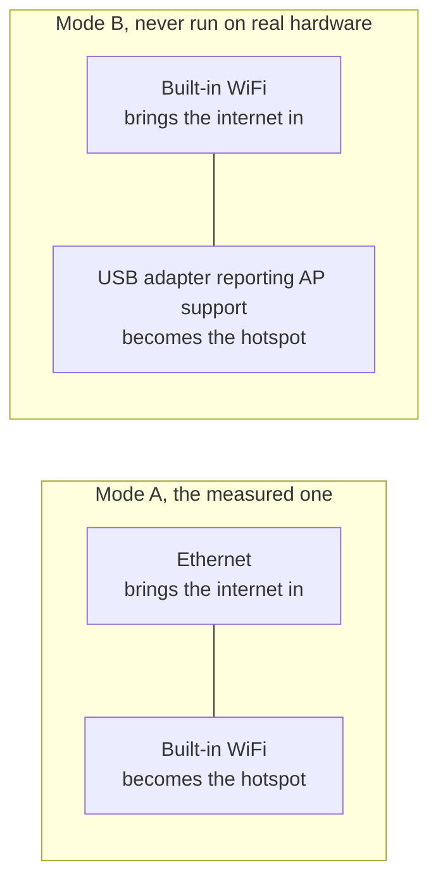

[English](https://github.com/Iman/caspian/wiki/Getting-Started) | [فارسی](https://github.com/Iman/caspian/wiki/Getting-Started.fa) | [Русский](https://github.com/Iman/caspian/wiki/Getting-Started.ru) | [中文](https://github.com/Iman/caspian/wiki/Getting-Started.zh) | [العربية](https://github.com/Iman/caspian/wiki/Getting-Started.ar) | [Türkçe](https://github.com/Iman/caspian/wiki/Getting-Started.tr) | [اردو](https://github.com/Iman/caspian/wiki/Getting-Started.ur)

# Başlarken

[Bağlantı şemaları, ilk kablo kurulumu, hizmetin yeniden başlatılması ve yaygın hatalar için ev kullanıcısı sorun giderme kılavuzunu okuyun.](https://github.com/Iman/caspian/wiki/Troubleshooting.tr)

[Caspian wiki'si](https://github.com/Iman/caspian/wiki/Home.tr)

> Bu kılavuz mevcut README'den alınmıştır. Ölçümleri orijinal tarihlerini koruyor; bu belgeleme hamlesi yeni bir test çalıştırmasını bildirmez.
> [English](https://github.com/Iman/caspian/blob/108567a6a529be05b577ee68b65b48790f07e43d/README.md) | [فارسی](https://github.com/Iman/caspian/blob/108567a6a529be05b577ee68b65b48790f07e43d/README.fa.md) | [Русский](https://github.com/Iman/caspian/blob/108567a6a529be05b577ee68b65b48790f07e43d/README.ru.md) | [中文](https://github.com/Iman/caspian/blob/108567a6a529be05b577ee68b65b48790f07e43d/README.zh.md)

## Ne için?

Seyirci, güvendiği bir kişi tarafından çalışan bir yapılandırma verilen kişidir.
ve odadaki cihazların çalışmasını kim ister? Terminal açmayacaklar,
bir günlüğü okuyun veya bir dosyayı düzenleyin. Kurulumdan sonra her eylem
paneli. Bkz. [`docs/2026-08-29-design.md`](https://github.com/Iman/caspian/blob/main/docs/2026-08-29-design.md), bölüm 5.1 ve 5.2.

Motor, xray-core v26.4.15'tir (Go modülü sürümü `v1.260327.1-0.20260415235634-c5edc122b70e`), ikili dosyaya bağlanmıştır.
indirildi. Paylaşım bağlantısı ayrıştırıcısı, XTLS/libXray'den MIT `share` paketidir,
kendi lisansı ile `third_party/libxray-share/` kapsamında v26.3.27 etiketinde satılmaktadır
yanında tutuldu.

[`internal/link/link.go`](https://github.com/Iman/caspian/blob/main/internal/link/link.go)'deki `supportedSchemes` yedi şemayı kabul eder: `vless`,
içermek

REALITY

, artı

`vmess`, `trojan`, `ss`, `socks`, `hysteria2`

Ve
`hy2`. `tuic`, `ssr`, `wireguard` ve `anytls` dahil diğer her şey
ismiyle reddedildi.

## Neye ihtiyacı var

Bağlanmak için Windows 10 sürüm 2004 (derleme 19041) veya üzeri gerekir. Daha yaşlı bir
Windows, 1607 sürümüne geri dönüyor, Caspian kuruluyor ve panel açılıyor ve diyor ki
bu sürümün yapamayacağı şey. Güncel sürümler arasında Windows 10 sürüm 2004 (derleme 19041) veya üzeri yer alır ve
x64 ve ARM64'te Windows 11, Intel ve Apple Silicon'da macOS 13 veya üzeri ve
x86_64, ARM64, ARMv7 ve ARMv6'da Linux. Android ve iOS
ağ geçidi ana bilgisayarları değildir; telefonlar ve tabletler Caspian Wi-Fi'sine istemci olarak katılıyor.

[`internal/netcfg/testdata/PROVENANCE.md`](https://github.com/Iman/caspian/blob/main/internal/netcfg/testdata/PROVENANCE.md) bunun bulunduğu makineyi kaydeder
aşağıdakilere göre geliştirildi ve ölçüldü: Raspberry Pi 5 Model B Rev 1.0, Debian 13
(trixie), çekirdek 6.18.34+rpt-rpi-2712 aarch64, nftables 1.1.3, iw 6.9,
iproute2 6.15.0, phy0'da brcmfmac, Netplan tarafından oluşturulan NetworkManager.

[`install.sh`](https://github.com/Iman/caspian/blob/main/install.sh), makineye dokunmadan önce Linux olmayan herhangi bir şeyi reddediyor
x86_64, aarch64, armv7l veya armv6l'de, systemd 240 veya daha yenisiyle root olarak çalıştırın.
Her ret, bulduğu şeyin adını verir.

Linux ve Raspberry Pi arka ucunun, aşağıdakilerden birinde iki ağ arayüzüne ihtiyacı vardır:
aşağıdaki düzenlemeler. Bkz. [`docs/2026-08-29-design.md`](https://github.com/Iman/caspian/blob/main/docs/2026-08-29-design.md), bölüm 4.7. Mevcut
macOS arka ucu internet bağlantısı için kablolu Ethernet kullanır ve yerleşiktir
Erişim noktası için Wi-Fi. Windows, Mobile'ı destekleyen bir Wi-Fi bağdaştırıcısı kullanıyor
Sıcak nokta.

Mod B hiç çalıştırılmadı. `PROVENANCE.md`, hedefin tam olarak sahip olduğunu kaydediyor
bir radyo var ve hiçbir USB aygıtı bağlı değil; dolayısıyla ağaçtaki her mod B donanımı
yakalanmak yerine yazılmıştır.

**Ölçülen donanımda, sıcak noktayı yükseltmek kutunun kendisine mal olur
WiFi.** `brcmfmac` sürücüsü `iw phy phy0 interface add ap0 type __ap`'yi reddediyor
`Input/output error (-5)` ile `iw list`'nin reklamını yapmasına rağmen
kombinasyon. Böylece cihaz `wlan0`'yi devralmaya geri döner:
NetworkManager'ın arayüzü, ev ağında tuttuğu adresi çıkarır,
ve yeniden yazar. Hem reddetme hem de başarılı devralma dizisi
`PROVENANCE.md`'de ölçülmüş ve kaydedilmiştir. Panel ve kayıt bunun ne olduğunu söylüyor
gerçekleşmeden önce maliyetler. Test: `TestTheTakeoverSaysWhatItCost`.

İkinci bir arayüz oluşturmak ilk tercih olmaya devam ediyor çünkü çalıştığında
kullanıcıya hiçbir maliyeti yoktur. Geri dönüşe ancak ilk tercih yapıldıktan sonra ulaşılır
denenmiş ve reddedilmiş ve ilk plan daha sonuçlanmadan tamamen yıkılmıştır.
ikincisi uygulanır.

<!-- SNI upstream credits -->

SNI kimlik sahtekarlığı kredileri: [patterniha/SNI-Spoofing](https://github.com/patterniha/SNI-Spoofing) (GPL-3.0), Windows x64'te WinDivert (LGPL-3.0) ile.
[Üçüncü taraf lisanslar, kaynak sürümleri ve krediler](https://github.com/Iman/caspian/blob/feature/sni/docs/THIRD-PARTY.md).

<!-- Caspian guide navigation -->

Caspian kılavuzları: [kurulum ve desteklenen protokoller](https://github.com/Iman/caspian/wiki/Home.tr) · [DPI'yı aşmak için SNI sahtekarlığı: kurulum ve sınırlar](https://github.com/Iman/caspian/wiki/SNI-Spoofing.tr).

<!-- English-source-sha256: 629d6e2b6255b16d3bc76228a7aec238747c2de1af4bc20e44050dafefa13075 -->
