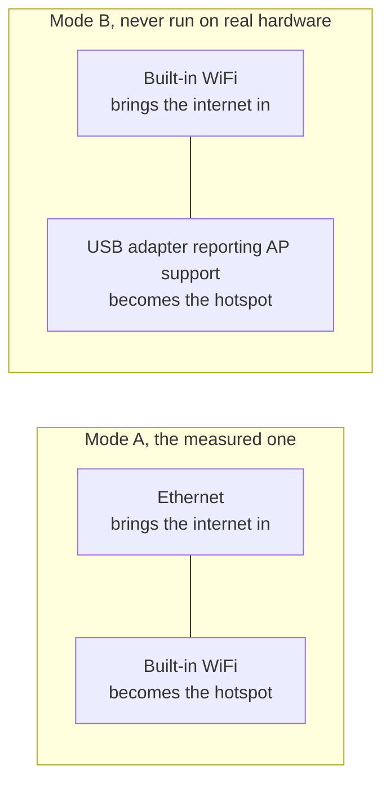

[English](https://github.com/Iman/caspian/wiki/Getting-Started) | [فارسی](https://github.com/Iman/caspian/wiki/Getting-Started.fa) | [Русский](https://github.com/Iman/caspian/wiki/Getting-Started.ru) | [中文](https://github.com/Iman/caspian/wiki/Getting-Started.zh) | [العربية](https://github.com/Iman/caspian/wiki/Getting-Started.ar) | [Türkçe](https://github.com/Iman/caspian/wiki/Getting-Started.tr) | [اردو](https://github.com/Iman/caspian/wiki/Getting-Started.ur)

# شروع کرنا

[کنکشن ڈایاگرامس، کیبل فرسٹ سیٹ اپ، سروس دوبارہ شروع ہونے اور عام غلطیوں کے لیے، ہوم یوزر ٹربل شوٹنگ گائیڈ پڑھیں۔](https://github.com/Iman/caspian/wiki/Troubleshooting.ur)

[Caspian ویکی](https://github.com/Iman/caspian/wiki/Home.ur)

> یہ گائیڈ موجودہ README سے آتا ہے۔ اس کی پیمائش اپنی اصل تاریخوں کو برقرار رکھتی ہے۔ یہ دستاویزی اقدام نئے ٹیسٹ رن کی اطلاع نہیں دیتا ہے۔
> [English](https://github.com/Iman/caspian/blob/108567a6a529be05b577ee68b65b48790f07e43d/README.md) | [فارسی](https://github.com/Iman/caspian/blob/108567a6a529be05b577ee68b65b48790f07e43d/README.fa.md) | [Русский](https://github.com/Iman/caspian/blob/108567a6a529be05b577ee68b65b48790f07e43d/README.ru.md) | [中文](https://github.com/Iman/caspian/blob/108567a6a529be05b577ee68b65b48790f07e43d/README.zh.md)

## یہ کس کے لیے ہے۔

سامعین وہ ہوتا ہے جسے کسی ایسے شخص نے ورکنگ کنفیگریشن دی تھی جس پر وہ بھروسہ کرتے تھے،
اور کون چاہتا ہے کہ کمرے میں موجود آلات کام کریں۔ وہ ٹرمینل نہیں کھولیں گے،
لاگ پڑھیں، یا فائل میں ترمیم کریں۔ انسٹال ہونے کے بعد، ہر عمل میں ہوتا ہے۔
پینل دیکھیں [`docs/2026-08-29-design.md`](https://github.com/Iman/caspian/blob/main/docs/2026-08-29-design.md)، سیکشن 5.1 اور 5.2۔

انجن xray-core v26.4.15 (Go ماڈیول ورژن `v1.260327.1-0.20260415235634-c5edc122b70e`) ہے، بجائے بائنری سے منسلک
ڈاؤن لوڈ شیئر لنک پارسر XTLS/libXray سے MIT `share` پیکیج ہے،
اس کے اپنے لائسنس کے ساتھ `third_party/libxray-share/` کے تحت ٹیگ v26.3.27 پر فروخت کیا گیا
اس کے پاس رکھا.

`supportedSchemes` [`internal/link/link.go`](https://github.com/Iman/caspian/blob/main/internal/link/link.go) میں سات اسکیمیں قبول کرتا ہے: `vless`،
بشمول REALITY، plus `vmess`، `trojan`، `ss`، `socks`، `hysteria2` اور
`hy2` `tuic`، `ssr`، `wireguard` اور `anytls` سمیت، کچھ بھی ہے
نام سے انکار کر دیا.

## اس کی کیا ضرورت ہے۔

کنیکٹنگ کے لیے Windows 10 ورژن 2004 (build 19041) یا اس کے بعد کی ضرورت ہے۔ ایک بوڑھے پر
ونڈوز، ورژن 1607 پر واپس، Caspian انسٹال ہوتا ہے اور پینل کھلتا ہے اور کہتا ہے۔
وہ ورژن کیا نہیں کر سکتا۔ موجودہ ریلیز میں شامل ہیں Windows 10 ورژن 2004 (تعمیر 19041) یا بعد کا اور
X64 اور ARM64 پر Windows 11، MacOS 13 یا بعد میں Intel اور Apple Silicon پر، اور
x86_64، ARM64، ARMv7 اور ARMv6 پر لینکس۔ اینڈرائیڈ اور آئی او ایس
گیٹ وے کے میزبان نہیں ہیں؛ فونز اور ٹیبلٹس Caspian وائی فائی میں بطور کلائنٹ شامل ہوتے ہیں۔

[`internal/netcfg/testdata/PROVENANCE.md`](https://github.com/Iman/caspian/blob/main/internal/netcfg/testdata/PROVENANCE.md) اس مشین کو ریکارڈ کرتا ہے۔
اس کے خلاف تیار اور ماپا گیا: A Raspberry Pi 5 Model B Rev 1.0، Debian 13
(trixie)، کرنل 6.18.34+rpt-rpi-2712 aarch64، nftables 1.1.3، iw 6.9،
iproute2 6.15.0، brcmfmac on phy0، NetworkManager جو نیٹپلان کے ذریعے پیش کیا گیا ہے۔

[`install.sh`](https://github.com/Iman/caspian/blob/main/install.sh) انکار کر دیتا ہے، اس سے پہلے کہ وہ مشین کو چھوئے، کوئی بھی چیز جو لینکس نہیں ہے۔
x86_64، aarch64، armv7l یا armv6l پر، systemd 240 یا جدید تر کے ساتھ، روٹ کے طور پر چلائیں۔
ہر انکار نام بتاتا ہے کہ اسے کیا ملا۔

لینکس اور راسبیری پائی بیک اینڈ کو ایک میں دو نیٹ ورک انٹرفیس کی ضرورت ہے۔
ذیل میں انتظامات. دیکھیں [`docs/2026-08-29-design.md`](https://github.com/Iman/caspian/blob/main/docs/2026-08-29-design.md)، سیکشن 4.7۔ کرنٹ
میکوس بیک اینڈ انٹرنیٹ کنکشن اور بلٹ ان کے لیے وائرڈ ایتھرنیٹ استعمال کرتا ہے۔
ہاٹ اسپاٹ کے لیے وائی فائی۔ ونڈوز ایک Wi-Fi اڈاپٹر استعمال کرتا ہے جو موبائل کو سپورٹ کرتا ہے۔
ہاٹ سپاٹ

موڈ بی کبھی نہیں چلایا گیا ہے۔ `PROVENANCE.md` ریکارڈ کرتا ہے کہ ہدف بالکل ٹھیک ہے۔
ایک ریڈیو اور کوئی USB ڈیوائس منسلک نہیں ہے، لہذا درخت میں ہر موڈ B فکسچر ہے۔
تصنیف کرنے کی بجائے۔

**ماپا ہارڈ ویئر پر، ہاٹ اسپاٹ کو اوپر لانے پر باکس کا اپنا خرچہ آتا ہے۔
وائی فائی۔** `brcmfmac` ڈرائیور نے `iw phy phy0 interface add ap0 type __ap` سے انکار کر دیا
`Input/output error (-5)` کے ساتھ، اگرچہ `iw list` اشتہار دیتا ہے
مجموعہ لہذا آلات `wlan0` پر قبضہ کرنے کے لئے واپس آتا ہے: یہ جاری کرتا ہے
نیٹ ورک مینجر سے انٹرفیس، گھر کے نیٹ ورک پر موجود ایڈریس کو ہٹا دیتا ہے،
اور اسے دوبارہ ٹائپ کرتا ہے۔ انکار اور کامیاب قبضے کا سلسلہ دونوں ہی ہیں۔
`PROVENANCE.md` میں ماپا اور ریکارڈ کیا گیا۔ پینل اور لاگ وہ کیا کہتے ہیں۔
اس کے ہونے سے پہلے لاگت آتی ہے۔ ٹیسٹ: `TestTheTakeoverSaysWhatItCost`۔

دوسرا انٹرفیس بنانا پہلا انتخاب رہتا ہے، کیونکہ جب یہ کام کرتا ہے۔
صارف کو کچھ بھی خرچ نہیں ہوتا۔ پہلی پسند کے ہونے کے بعد ہی فال بیک حاصل ہوتا ہے۔
کوشش کی گئی اور انکار کر دیا گیا، اور پہلے منصوبہ کو مکمل طور پر ختم کر دیا گیا۔
دوسرا لاگو کیا جاتا ہے.

<!-- SNI upstream credits -->

SNI سپوفنگ کریڈٹ: [patterniha/SNI-Spoofing](https://github.com/patterniha/SNI-Spoofing) (GPL-3.0)، WinDivert (LGPL-3.0) کے ساتھ Windows x64 پر۔
[فریق ثالث کے لائسنس، سورس ورژنز، اور کریڈٹس](https://github.com/Iman/caspian/blob/feature/sni/docs/THIRD-PARTY.md)

<!-- Caspian guide navigation -->

Caspian گائیڈز: [سیٹ اپ اور معاون پروٹوکول](https://github.com/Iman/caspian/wiki/Home.ur) · [ڈی پی آئی کو روکنے کے لیے SNI کی جعل سازی: سیٹ اپ اور حدود](https://github.com/Iman/caspian/wiki/SNI-Spoofing.ur)۔

<!-- English-source-sha256: 629d6e2b6255b16d3bc76228a7aec238747c2de1af4bc20e44050dafefa13075 -->
