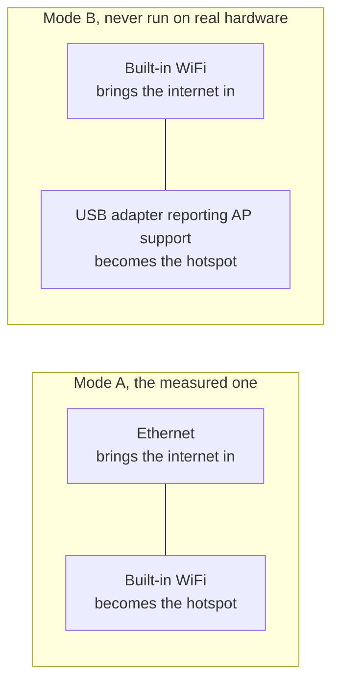

<!-- wiki-navigation:start -->

[English](https://github.com/Iman/caspian/wiki/Getting-Started) · [فارسی](https://github.com/Iman/caspian/wiki/Getting-Started.fa) · [Русский](https://github.com/Iman/caspian/wiki/Getting-Started.ru) · [**简体中文**](https://github.com/Iman/caspian/wiki/Getting-Started.zh) · [العربية](https://github.com/Iman/caspian/wiki/Getting-Started.ar) · [Türkçe](https://github.com/Iman/caspian/wiki/Getting-Started.tr) · [اردو](https://github.com/Iman/caspian/wiki/Getting-Started.ur)

[Caspian 文档](https://github.com/Iman/caspian/wiki/Home.zh) · [故障排除](https://github.com/Iman/caspian/wiki/Troubleshooting.zh)

<!-- wiki-navigation:end -->

# 开始使用

[有关连接图、电缆优先设置、服务重新启动和常见错误的信息，请阅读家庭用户故障排除指南。](https://github.com/Iman/caspian/wiki/Troubleshooting.zh)

> 本指南来自现有的自述文件。其测量结果保留其原始日期；此文档移动不会报告新的测试运行。
> [English](https://github.com/Iman/caspian/blob/108567a6a529be05b577ee68b65b48790f07e43d/README.md) | [فارسی](https://github.com/Iman/caspian/blob/108567a6a529be05b577ee68b65b48790f07e43d/README.fa.md) | [Русский](https://github.com/Iman/caspian/blob/108567a6a529be05b577ee68b65b48790f07e43d/README.ru.md) | [中文](https://github.com/Iman/caspian/blob/108567a6a529be05b577ee68b65b48790f07e43d/README.zh.md)

## 它的用途是什么

受众是由他们信任的人提供工作配置的人，
谁希望房间里的设备正常工作。他们不会打开终端，
读取日志或编辑文件。安装后，每个操作都发生在
面板。参见 [`docs/2026-08-29-design.md`](https://github.com/Iman/caspian/blob/main/docs/2026-08-29-design.md)，第 5.1 节和 5.2 节。

引擎是 xray-core v26.4.15（Go 模块版本 `v1.260327.1-0.20260415235634-c5edc122b70e`），链接到二进制文件而不是
下载了。共享链接解析器是 XTLS/libXray 中的 MIT `share` 包，
在 `third_party/libxray-share/` 下以 v26.3.27 标签出售，并拥有自己的许可证
放在它旁边。

[`internal/link/link.go`](https://github.com/Iman/caspian/blob/main/internal/link/link.go)中的`supportedSchemes`接受七种方案：`vless`，
包括 REALITY，加上 `vmess`、`trojan`、`ss`、`socks`、`hysteria2` 和
`hy2`。其他任何内容，包括 `tuic`、`ssr`、`wireguard` 和 `anytls`，都是
点名拒绝。

## 它需要什么

连接需要 Windows 10 版本 2004（内部版本 19041）或更高版本。在较旧的
Windows，回到版本 1607，Caspian 安装并打开面板并显示
该版本不能做什么。当前版本包括 Windows 10 版本 2004（内部版本 19041）或更高版本以及
x64 和 ARM64 上的 Windows 11、Intel 和 Apple Silicon 上的 macOS 13 或更高版本，以及
x86_64、ARM64、ARMv7 和 ARMv6 上的 Linux。安卓和iOS
不是网关主机；手机和平板电脑作为客户端加入 Caspian Wi-Fi。

[`internal/netcfg/testdata/PROVENANCE.md`](https://github.com/Iman/caspian/blob/main/internal/netcfg/testdata/PROVENANCE.md) 记录该机器已
开发和测量依据：Raspberry Pi 5 Model B Rev 1.0、Debian 13
（trixie），内核6.18.34+rpt-rpi-2712 aarch64，nftables 1.1.3，iw 6.9，
iproute2 6.15.0，phy0 上的 brcmfmac，由 netplan 呈现的 NetworkManager。

[`install.sh`](https://github.com/Iman/caspian/blob/main/install.sh) 在接触机器之前拒绝任何非 Linux 的东西
在 x86_64、aarch64、armv7l 或 armv6l 上，使用 systemd 240 或更高版本，以 root 身份运行。
每次拒绝都会说出它发现的内容。

Linux 和 Raspberry Pi 后端之一需要两个网络接口
安排如下。参见 [`docs/2026-08-29-design.md`](https://github.com/Iman/caspian/blob/main/docs/2026-08-29-design.md)，第 4.7 节。目前的
macOS 后端使用有线以太网进行互联网连接并内置
用于热点的 Wi-Fi。 Windows 使用支持移动设备的 Wi-Fi 适配器
热点。

模式 B 从未运行过。 `PROVENANCE.md` 记录目标已准确
一台收音机且未连接 USB 设备，因此树中的每个 B 模式灯具都是
创作而不是捕获。

**在测量的硬件上，增加热点需要花费盒子本身的费用
WiFi.** `brcmfmac` 驱动程序拒绝 `iw phy phy0 interface add ap0 type __ap`
与 `Input/output error (-5)`，即使 `iw list` 宣传
组合。因此，设备回退到接管 `wlan0`：它释放
来自 NetworkManager 的接口，剥离它在家庭网络上持有的地址，
并重新输入。拒绝和成功的接管顺序都是
测量并记录在`PROVENANCE.md`中。面板和日志说明了什么
在发生之前就付出代价。测试：`TestTheTakeoverSaysWhatItCost`。

创建第二个界面仍然是第一选择，因为当它起作用时
用户无需支付任何费用。只有在第一个选择完成后才会达到后备
屡试不爽，第一个方案在实施前被彻底推倒
第二个被应用。

<!-- SNI upstream credits -->

SNI 欺骗来源：[patterniha/SNI-Spoofing](https://github.com/patterniha/SNI-Spoofing) (GPL-3.0)，以及 Windows x64 上的 WinDivert (LGPL-3.0)。
[第三方许可证、源版本和积分](https://github.com/Iman/caspian/blob/feature/sni/docs/THIRD-PARTY.md)。

<!-- English-source-sha256: a5c74774081ac02e3989f9029f44839c260680e1757760cd49c2d5dfabe4ed92 -->
