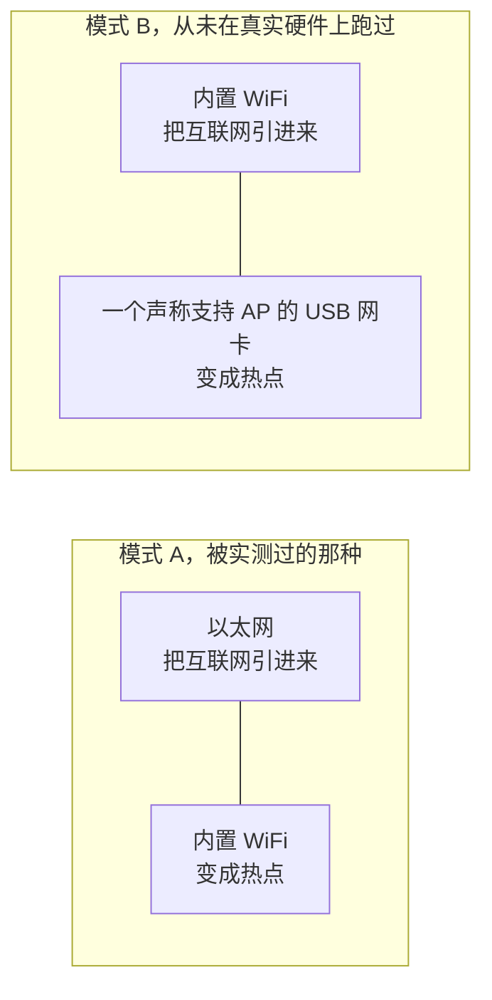

# 开始使用

[English](https://github.com/Iman/caspian/wiki/Getting-Started) | [فارسی](https://github.com/Iman/caspian/wiki/Getting-Started.fa) | [Русский](https://github.com/Iman/caspian/wiki/Getting-Started.ru) | [中文](https://github.com/Iman/caspian/wiki/Getting-Started.zh)

[Caspian Wiki](https://github.com/Iman/caspian/wiki/Home.zh)

> 本指南从现有 README 迁移而来。测量结果保留原有日期；此次文档迁移不代表重新运行了测试。
> [English](https://github.com/Iman/caspian/blob/108567a6a529be05b577ee68b65b48790f07e43d/README.md) | [فارسی](https://github.com/Iman/caspian/blob/108567a6a529be05b577ee68b65b48790f07e43d/README.fa.md) | [Русский](https://github.com/Iman/caspian/blob/108567a6a529be05b577ee68b65b48790f07e43d/README.ru.md) | [中文](https://github.com/Iman/caspian/blob/108567a6a529be05b577ee68b65b48790f07e43d/README.zh.md)

## 它是做什么用的

目标用户是这样一个人：他从信得过的人那里拿到了一份能用的配置，只希望房间里的设备能
上网。他不会开终端、不会看日志、不会编辑文件。装好之后，所有操作都在面板里完成。见
[`docs/2026-08-29-design.md`](https://github.com/Iman/caspian/blob/main/docs/2026-08-29-design.md) 的 5.1 和 5.2 节。

引擎是 xray-core v26.4.15 (Go module version `v1.260327.1-0.20260415235634-c5edc122b70e`)，编译进二进制而不是下载下来的。分享链接的解析器是
XTLS/libXray 里 MIT 许可的 `share` 包，以 v26.3.27 标签内置在
`third_party/libxray-share/` 下，并在旁边保留了它自己的许可证。

[`internal/link/link.go`](https://github.com/Iman/caspian/blob/main/internal/link/link.go) 里的 `supportedSchemes` 接受七种协议：`vless`（包括
REALITY），加上 `vmess`、`trojan`、`ss`、`socks`、`hysteria2` 和 `hy2`。其余的，包括
`tuic`、`ssr`、`wireguard` 和 `anytls`，都会被点名拒绝。

## 它需要什么

Windows 发布版以 x64 上的 Windows 10 版本 2004（内部版本 19041）或更高版本
作为实验性兼容目标。安装和热点功能仍需测试。

当前发布支持 x64 和 ARM64 上的 Windows 11、Intel 和 Apple Silicon 上的 macOS 13
或更高版本，以及 x86_64、ARM64、ARMv7 和 ARMv6 上的 Linux。Android 和 iOS 不作为
网关主机；手机和平板作为客户端加入 Caspian Wi-Fi。

[`internal/netcfg/testdata/PROVENANCE.md`](https://github.com/Iman/caspian/blob/main/internal/netcfg/testdata/PROVENANCE.md) 记录了本项目开发和实测所针对的那台机器：一台
Raspberry Pi 5 Model B Rev 1.0，Debian 13（trixie），内核 6.18.34+rpt-rpi-2712
aarch64，nftables 1.1.3，iw 6.9，iproute2 6.15.0，phy0 上的 brcmfmac，由 netplan 渲染的
NetworkManager。

[`install.sh`](https://github.com/Iman/caspian/blob/main/install.sh) 会在碰这台机器之前就拒绝这些情况：不是运行在 x86_64、aarch64、armv7l 或
armv6l 上的 Linux，systemd 版本低于 240，或者不是以 root 运行。每一次拒绝都说清它发现了
什么。

Linux 和 Raspberry Pi 后端需要两个网络接口，摆法如下。见
[`docs/2026-08-29-design.md`](https://github.com/Iman/caspian/blob/main/docs/2026-08-29-design.md) 第 4.7 节。当前 macOS 后端通过有线 Ethernet 接入互联网，
并使用内置 Wi-Fi 建立热点。Windows 使用支持 Mobile Hotspot 的 Wi-Fi 适配器。

模式 B 从未被跑过。`PROVENANCE.md` 记录了目标机器只有一个无线电、也没有接任何 USB
设备，所以代码树里每一个模式 B 的测试数据都是写出来的，不是采集来的。

**在被实测的那台硬件上，把热点拉起来的代价是盒子失去自己的 WiFi。** `brcmfmac` 驱动
对 `iw phy phy0 interface add ap0 type __ap` 报 `Input/output error (-5)` 而拒绝，尽管
`iw list` 声称支持这种组合。于是这台设备退而接管 `wlan0`：把接口从 NetworkManager 手里
释放出来，剥掉它在家庭网络上持有的地址，然后改变它的类型。那次拒绝和那次成功的接管
序列都被实测并记录在 `PROVENANCE.md` 里。面板和日志会在这件事发生之前说清它的代价。
测试：`TestTheTakeoverSaysWhatItCost`。

创建第二个接口仍然是首选，因为它成功时对用户没有任何代价。只有在首选方案被尝试并遭到
拒绝之后才会走到那条退路，而且在应用第二套方案之前，第一套方案会被完整拆掉。

[English](https://github.com/Iman/caspian/blob/main/README.md) | [فارسی](https://github.com/Iman/caspian/blob/main/README.fa.md) | [Русский](https://github.com/Iman/caspian/blob/main/README.ru.md) | [中文](https://github.com/Iman/caspian/blob/main/README.zh.md)
