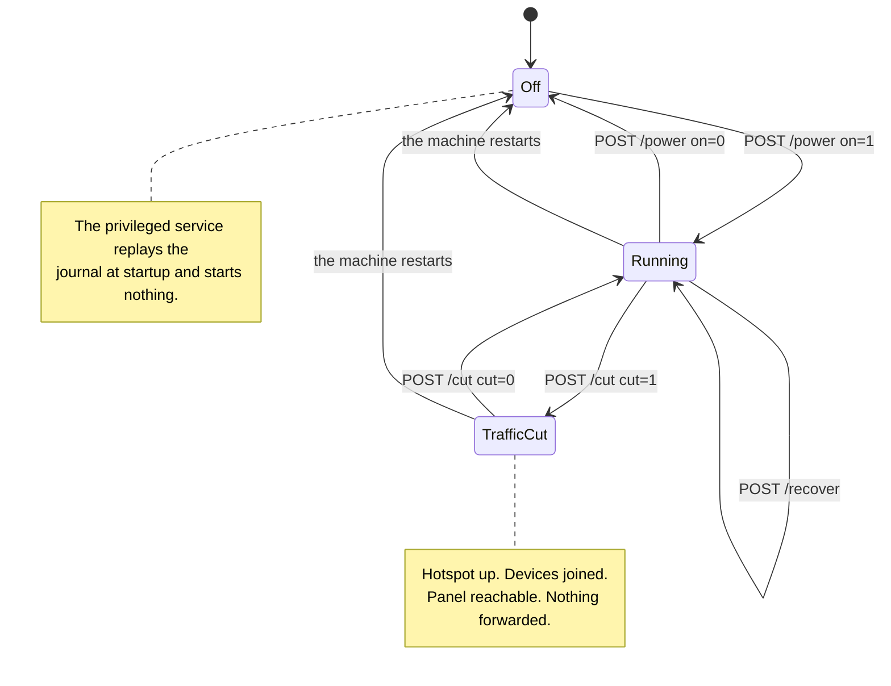

[English](https://github.com/Iman/caspian/wiki/Panel-and-Configuration) | [فارسی](https://github.com/Iman/caspian/wiki/Panel-and-Configuration.fa) | [Русский](https://github.com/Iman/caspian/wiki/Panel-and-Configuration.ru) | [中文](https://github.com/Iman/caspian/wiki/Panel-and-Configuration.zh) | [العربية](https://github.com/Iman/caspian/wiki/Panel-and-Configuration.ar) | [Türkçe](https://github.com/Iman/caspian/wiki/Panel-and-Configuration.tr) | [اردو](https://github.com/Iman/caspian/wiki/Panel-and-Configuration.ur)

# لوحة والتكوين

[ويكي قزوين](https://github.com/Iman/caspian/wiki/Home.ar)

يتم فتح اللوحة باللغة الإنجليزية عندما لا يكون لدى المتصفح خيار محفوظ. استخدم قائمة اللغة في الأعلى وحدد تطبيق للتبديل إلى اللغة الفارسية أو العودة إلى اللغة الإنجليزية. يبقى الاختيار مع هذا المتصفح، بما في ذلك صفحات تسجيل الدخول والمساعدة. القائمة تعمل بدون جافا سكريبت. في الشاشات الضيقة، يلتف الرأس والتنقل ليناسب العرض المتاح.

> يأتي هذا الدليل من ملف README الموجود. تحتفظ قياساتها بتواريخها الأصلية. لا يُبلغ نقل التوثيق هذا عن تشغيل اختباري جديد.
> [English](https://github.com/Iman/caspian/blob/108567a6a529be05b577ee68b65b48790f07e43d/README.md) | [فارسی](https://github.com/Iman/caspian/blob/108567a6a529be05b577ee68b65b48790f07e43d/README.fa.md) | [Русский](https://github.com/Iman/caspian/blob/108567a6a529be05b577ee68b65b48790f07e43d/README.ru.md) | [中文](https://github.com/Iman/caspian/blob/108567a6a529be05b577ee68b65b48790f07e43d/README.zh.md)

## الضوابط، وأي واحد للضغط

تحمل اللوحة ثلاثة عناصر تحكم تغير ما يفعله الجهاز. اثنان من
يقومون بإيقاف الإنترنت للأجهزة المرتبطة بنقطة الاتصال، وهم ليسوا كذلك
نفس السيطرة. وهذا القسم موجود لأن الفرق بينهما كان
مكتوب فقط في المصدر، حيث لا يستطيع الشخص الذي يحمل الهاتف القراءة
ذلك.

### التبديل، `POST /power`

يقوم المفتاح بتشغيل الجهاز بأكمله وإيقاف تشغيله. إيقاف تشغيل المكالمات `Stop`
الخدمة المميزة، والتي تقوم بخمسة أشياء بالترتيب:

1. يوقف المحرك
2. يوقف نقطة الوصول وخادم DHCP وDNS بجانبها
3. يزيل ملفات التكوين التي تم إنشاء هذين الملفين بها
4. يحظر الراديو مرة أخرى، إذا كان قزوين هو الشيء الذي قام بإلغاء حظره
5. يعيد تشغيل مجلة Teardown

راجع [`internal/privsvc/start.go`](https://github.com/Iman/caspian/blob/main/internal/privsvc/start.go)، و`stopLocked`، و
[`internal/hotspot/supervisor.go`](https://github.com/Iman/caspian/blob/main/internal/hotspot/supervisor.go)، `Supervisor.Stop`.

والنتيجة التي تهم هي التي في المنتصف. تتوقف شبكة WiFi
موجود. يتم إسقاط كل جهاز متصل به، وهذا يتضمن الهاتف الموجود في
يد الشخص الذي ضغط على الزر.

### القطع، `POST /cut`

يوقف القطع فقط حركة المرور التي يوجهها الصندوق نيابة عن تلك الأجهزة. ذلك
يقوم بتحميل مجموعة قواعد nftables واحدة بدلاً من أخرى. انظر [`internal/privsvc/cut.go`](https://github.com/Iman/caspian/blob/main/internal/privsvc/cut.go)،
`setForward`، و[`internal/netcfg/nftables.go`](https://github.com/Iman/caspian/blob/main/internal/netcfg/nftables.go)، `RulesetFor`.

تختلف مجموعتا القواعد في السلسلة الأمامية وليس في أي مكان آخر.
يؤكد `TestForwardCut_DiffersFromNormalOnlyInTheForwardChain` ذلك من خلال المقارنة
خط سلاسل الإدخال والإخراج والتوجيه المسبق والتوجيه التالي للخط. في القطع
مجموعة القواعد: السلسلة الأمامية لا تقبل أي شيء على الإطلاق. يحمل انخفاضا واضحا
مع وجود سبب لذلك، حتى يتمكن المشغل الذي يقرأ مجموعة القواعد المباشرة من معرفة سبب حركة المرور
توقف بدلاً من غياب القواعد:

iifname "wlan0" أسقط التعليق "تم قطع حركة مرور العميل من قبل المستخدم"

سلسلة الإدخال لم تمس. لذلك يستمر المربع في الرد على DHCP على المنفذ 67، DNS
على منفذ DNS العميل، واللوحة على المنفذ الخاص بها، كل واحد منهم من
واجهة نقطة الاتصال. لم يتم إيقاف المحرك ونقطة الوصول ليست كذلك
توقف. تظل الأجهزة متصلة، وتحتفظ بعقود الإيجار الخاصة بها، ولا يزال بإمكانها فتح اللوحة.
الاختبار: `TestForwardCut_StopsClientsAndKeepsThePanelReachable`.

### لماذا يحدد الفرق أي واحد يمكنك الضغط عليه من الهاتف

ترتبط اللوحة بعنوان نقطة الاتصال افتراضيًا وليس بأي شيء آخر. التقديم
إن وجود الصندوق نفسه على الشبكة هو إعداد يجب على المستخدم تشغيله،
ويتم إيقافه في الوضع الافتراضي الذي يتم شحنه. انظر [`internal/panel/listen.go`](https://github.com/Iman/caspian/blob/main/internal/panel/listen.go)،
`BindAddrs`، و[`internal/state/state.go`](https://github.com/Iman/caspian/blob/main/internal/state/state.go)، `PanelOnLAN`.

لذلك يمكن لأي شخص يكون جهازه الوحيد هو الهاتف الموجود على نقطة الاتصال أن يتراجع عن ذلك
هاتف. لا يمكنهم التراجع عن إيقاف التشغيل منه، لأن إيقاف التشغيل أزال
الشبكة كانوا يصلون إلى اللوحة. وبالتالي فإن الخفض هو حالة الطوارئ
التوقف عن ذلك لا يقطع الطريق على الشخص الذي يستخدمه. التراجع عن ذلك لا يكلف
إعادة الاقتران، لأنه لم يختفي أي شيء متصل بالجهاز.

اضغط على القطع عندما تتوقف حركة المرور الآن وتنوي إعادته. إنه كذلك
فوري ولا يطلب أي تأكيد، والصفحة تجعل الحالة
لا لبس فيه أثناء سريانه. اضغط على المفتاح عند الانتهاء
الجهاز، أو عندما تريد إعادة محول WiFi إلى الشبكة
جاء من. لا تصل إلى المفتاح كمحطة توقف طارئة من هاتف موجود
على النقطة الساخنة.

حقيقتان أصغر، لأن الصياغة القصيرة في الصفحة يسهل قراءتها.
أولاً، يتم رفض القطع على الصندوق الذي لا يعمل، وهو يقول ذلك من تلقاء نفسه
الكلمات وليس كفشل غير معروف. ليس هناك إعادة توجيه للتوقف. و أ
مجموعة القواعد التي تسمي واجهة نقطة اتصال غير موجودة هي تغيير تم إجراؤه على
الآلة التي تكون ثابتة بالكامل أثناء إيقاف تشغيلها هي تركها كما تم العثور عليها.
راجع `errNotRunning` وخطأ `not-running`. ثانيا، قطع
يتم الاحتفاظ به في الذاكرة ولا يتم كتابته على أي ملف، لذا فإن إعادة تشغيل الجهاز يفقده.
هذا أمر متعمد: شخص لا يستطيع معرفة سبب توقف الإنترنت لديه
إعادته عن طريق سحب القابس. ما لا تفعله إعادة التشغيل هو تبديل الجهاز
على. تقوم الخدمة المميزة بإعادة تشغيل اليومية عند بدء التشغيل ولا تبدأ أي شيء.
انظر [`cmd/caspian/serve_priv.go`](https://github.com/Iman/caspian/blob/main/cmd/caspian/serve_priv.go). وبالتالي فإن إعادة التشغيل تؤدي إلى مسح القطع والأوراق
يتم إيقاف تشغيل الصندوق، وتتدفق حركة المرور مرة أخرى بمجرد الضغط على المفتاح، وليس قبل ذلك.

### التحكم في الاسترداد، `POST /recover`

عنصر التحكم الثالث هو المخرج من الصندوق العالق بدون إعادة التشغيل وبدون
محطة. إنه يوقف كل شيء، ويعيد تشغيل مجلة التفكيك حتى يتمكن الجميع
يتم وضع الواجهة والطريق وقاعدة جدار الحماية التي تغيرها هذا الجهاز مرة أخرى، وبعد ذلك
يبدأ مرة أخرى من الإعدادات المحفوظة. `Service.Recover` هو
`recoverToCleanMachine` متبوعًا بنفس `Start` الذي يستخدمه المحول، لذلك
إن التعافي ليس تنفيذًا ثانيًا للبدء يمكن أن ينجرف.

إنه موجود بسبب يوم قياس. بتاريخ 30-08-2026 تم تكرار الجهاز
تنص على أن الشخص الذي لديه جلسة SSH فقط يمكنه مسح: واجهة
تم إنشاؤه بواسطة بداية فاشلة ولم تتم إزالته أبدًا، تم مسح العنوان من الأسفل
it، وهو إدخال دفتر يومية نجا من بداية فاشلة. كل واحد من هؤلاء هو
يمكن استردادها من خلال إعادة تشغيل ما هو مكتوب بالفعل، ولم يكن أي منها
يمكن الوصول إليها من اللوحة.

لا يقوم بإعادة تشغيل الجهاز عمدًا ولا يقوم بإعادة تشغيل أي من النظامين
الوحدة، بحيث تظل عملية اللوحة وأي جلسة SSH مستمرة طوال الوقت. إنه يتوقف
نقطة الوصول وتشغيلها مرة أخرى، لذلك يغادر الجهاز المنضم إلى نقطة الاتصال
الشبكة والانضمام إليها مرة أخرى عند عودة نقطة الاتصال.

<!-- Caspian guide navigation -->

أدلة Caspian: [الإعداد والبروتوكولات المدعومة](https://github.com/Iman/caspian/wiki/Home.ar) · [انتحال SNI للتحايل على DPI: الإعداد والحدود](https://github.com/Iman/caspian/wiki/SNI-Spoofing.ar).

<!-- English-source-sha256: a8e4593b041147f8a67533ec5f1eb75b6017a32cf457d4ea6151af7a8232382b -->
