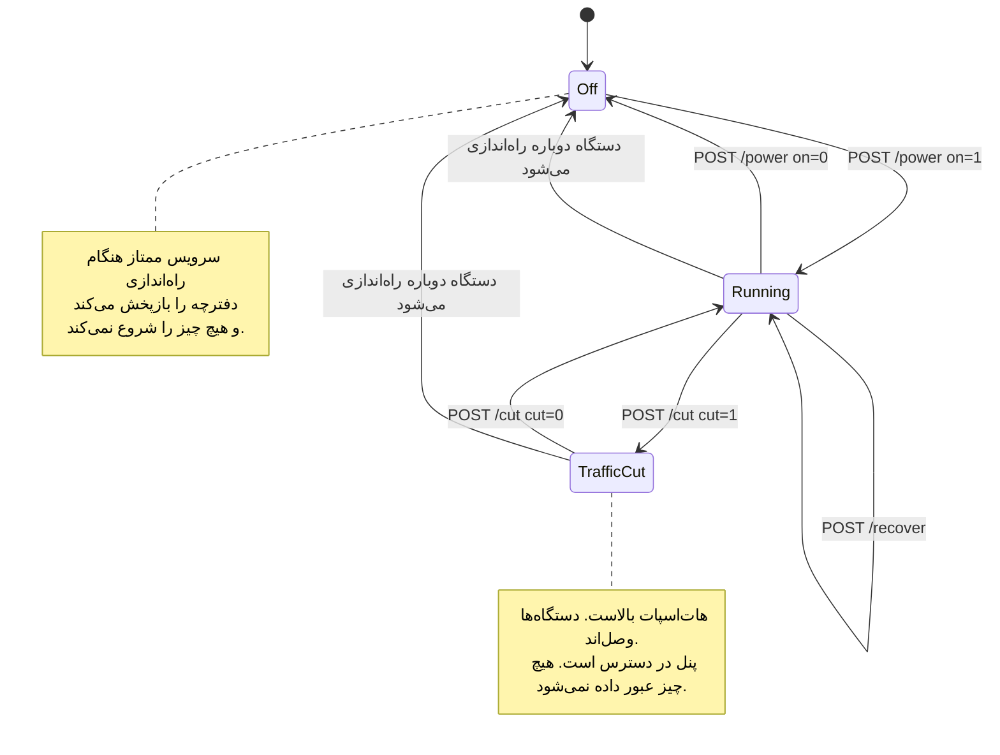

# پنل و تنظیمات

[English](https://github.com/Iman/caspian/wiki/Panel-and-Configuration) | [فارسی](https://github.com/Iman/caspian/wiki/Panel-and-Configuration.fa) | [Русский](https://github.com/Iman/caspian/wiki/Panel-and-Configuration.ru) | [中文](https://github.com/Iman/caspian/wiki/Panel-and-Configuration.zh)

[ویکی کاسپین](https://github.com/Iman/caspian/wiki/Home.fa)

> این راهنما از README موجود منتقل شده است. تاریخ اندازه‌گیری‌ها همان تاریخ اصلی است؛ این جابه‌جایی گزارش اجرای تازهٔ آزمون‌ها نیست.
> [English](https://github.com/Iman/caspian/blob/108567a6a529be05b577ee68b65b48790f07e43d/README.md) | [فارسی](https://github.com/Iman/caspian/blob/108567a6a529be05b577ee68b65b48790f07e43d/README.fa.md) | [Русский](https://github.com/Iman/caspian/blob/108567a6a529be05b577ee68b65b48790f07e43d/README.ru.md) | [中文](https://github.com/Iman/caspian/blob/108567a6a529be05b577ee68b65b48790f07e43d/README.zh.md)

## کنترل‌ها، و اینکه کدام را باید زد

پنل سه کنترل دارد که کارِ در حالِ انجامِ دستگاه را عوض می‌کنند. دو تای آن‌ها
اینترنتِ دستگاه‌های وصل به هات‌اسپات را قطع می‌کنند، و یک کنترلِ واحد نیستند. این
بخش برای این هست که تفاوتِ آن دو فقط در کد نوشته شده بود، جایی که کسی که گوشی
دستش است نمی‌تواند بخواندش.

### کلید، `POST /power`

کلید کلِ دستگاه را روشن و خاموش می‌کند. خاموش کردن، `Stop` را روی سرویسِ ممتاز
صدا می‌زند، که پنج کار را به ترتیب انجام می‌دهد:

1. نرم‌افزار اتصال را متوقف می‌کند
2. نقطهٔ دسترسی و سرویسِ DHCP و DNS کنارش را متوقف می‌کند
3. فایل‌های پیکربندی‌ای را که آن دو با آن ساخته شده بودند حذف می‌کند
4. اگر کاسپین همان چیزی بوده که رادیو را باز کرده، دوباره آن را می‌بندد
5. دفترچهٔ برچیدن را بازپخش می‌کند

ببینید [`internal/privsvc/start.go`](https://github.com/Iman/caspian/blob/main/internal/privsvc/start.go)، تابع `stopLocked`، و
[`internal/hotspot/supervisor.go`](https://github.com/Iman/caspian/blob/main/internal/hotspot/supervisor.go)، تابع `Supervisor.Stop`.

پیامدی که اهمیت دارد همان وسطی است. شبکهٔ وای‌فای دیگر وجود ندارد. هر دستگاهِ
وصل‌شده از آن می‌افتد، و این شاملِ گوشیِ در دستِ همان کسی است که دکمه را زده.

### قطعِ ترافیک، `POST /cut`

قطعِ ترافیک فقط ترافیکی را متوقف می‌کند که دستگاه از طرفِ آن دستگاه‌ها عبور
می‌دهد. یک مجموعه‌قواعدِ nftables را جای مجموعه‌قواعدِ دیگری بار می‌کند. ببینید
[`internal/privsvc/cut.go`](https://github.com/Iman/caspian/blob/main/internal/privsvc/cut.go)، تابع `setForward`، و [`internal/netcfg/nftables.go`](https://github.com/Iman/caspian/blob/main/internal/netcfg/nftables.go)،
تابع `RulesetFor`.

آن دو مجموعه‌قواعد فقط در زنجیرهٔ forward فرق دارند و جای دیگری فرق نمی‌کنند.
`TestForwardCut_DiffersFromNormalOnlyInTheForwardChain` این را با مقایسهٔ
خط‌به‌خطِ زنجیره‌های input، output، prerouting و postrouting تصدیق می‌کند. در
مجموعه‌قواعدِ قطع، زنجیرهٔ forward هیچ چیزی را نمی‌پذیرد. یک `drop` صریح با
دلیلِ نوشته‌شده روی آن دارد، تا کسی که مجموعه‌قواعدِ زنده را می‌خواند دلیلِ
توقفِ ترافیک را ببیند، نه نبودِ قاعده را:

    iifname "wlan0" drop comment "client traffic cut by the user"

به زنجیرهٔ input دست زده نمی‌شود. پس دستگاه به جواب دادن ادامه می‌دهد: DHCP روی
پورت 67، DNS روی پورتِ DNS دستگاه‌ها، و پنل روی پورتِ خودش، هر کدام از سمتِ رابط
هات‌اسپات. نرم‌افزار اتصال متوقف نمی‌شود و نقطهٔ دسترسی هم متوقف نمی‌شود.
دستگاه‌ها وصل می‌مانند، اجارهٔ آدرسشان را نگه می‌دارند، و هنوز می‌توانند پنل را
باز کنند. آزمون: `TestForwardCut_StopsClientsAndKeepsThePanelReachable`.

### چرا این تفاوت تعیین می‌کند از روی گوشی کدام را می‌توانید بزنید

پنل به‌طور پیش‌فرض فقط به آدرسِ هات‌اسپات بایند می‌شود و به هیچ آدرس دیگری. سرو
کردنش روی شبکه‌ای که خودِ دستگاه روی آن نشسته، تنظیمی است که کاربر باید روشنش
کند، و در پیش‌فرضِ منتشرشده خاموش است. ببینید [`internal/panel/listen.go`](https://github.com/Iman/caspian/blob/main/internal/panel/listen.go)، تابع
`BindAddrs`، و [`internal/state/state.go`](https://github.com/Iman/caspian/blob/main/internal/state/state.go)، فیلد `PanelOnLAN`.

پس کسی که تنها دستگاهش یک گوشی روی هات‌اسپات است، می‌تواند از همان گوشی قطعِ
ترافیک را برگرداند. اما نمی‌تواند خاموش کردن را از آن برگرداند، چون خاموش کردن
همان شبکه‌ای را که از راهش به پنل می‌رسید برداشت. پس قطعِ ترافیک همان توقفِ
اضطراری‌ای است که کسی را که از آن استفاده می‌کند جا نمی‌گذارد. برگرداندنش هزینهٔ
اتصالِ دوباره ندارد، چون هیچ چیزی که دستگاه به آن وصل بود از بین نرفته است.

وقتی ترافیک باید همین حالا بایستد و قصد دارید برش گردانید، قطعِ ترافیک را بزنید.
فوری است و تأیید نمی‌خواهد، و تا وقتی برقرار است پنل این حالت را بی‌ابهام نشان
می‌دهد. وقتی کارتان با دستگاه تمام شده، یا می‌خواهید آداپتور وای‌فای به شبکه‌ای
که از آن آمده برگردد، کلید را بزنید. **از کلید به‌عنوان توقفِ اضطراری روی گوشی‌ای
که به هات‌اسپات وصل است استفاده نکنید.**

دو نکتهٔ کوچک‌تر، چون متنِ کوتاهِ روی صفحه راحت از زیرِ چشم رد می‌شود. اول، قطعِ
ترافیک روی دستگاهی که در حال کار نیست رد می‌شود، و این را با واژه‌های خودش
می‌گوید نه به شکلِ یک شکستِ ناشناخته. عبوری در کار نیست که متوقف شود. و
مجموعه‌قواعدی که رابطِ هات‌اسپاتِ ناموجودی را نام ببرد، تغییری است در دستگاهی که
تمام ثابتِ حالت خاموشش این است که همان‌طور که پیدا شده رها شده باشد. ببینید
`errNotRunning` و خطای `not-running`. دوم، قطعِ ترافیک در حافظه نگه داشته می‌شود
و در هیچ فایلی نوشته نمی‌شود، پس راه‌اندازیِ دوبارهٔ دستگاه آن را از بین می‌برد.
این عمدی است: کسی که نمی‌فهمد چرا اینترنتش قطع شده، با کشیدنِ برق آن را
برمی‌گرداند. کاری که راه‌اندازیِ دوباره **نمی‌کند** روشن کردنِ دستگاه است. سرویسِ
ممتاز هنگام راه‌اندازی دفترچه را بازپخش می‌کند و هیچ چیز را شروع نمی‌کند. ببینید
[`cmd/caspian/serve_priv.go`](https://github.com/Iman/caspian/blob/main/cmd/caspian/serve_priv.go). پس راه‌اندازیِ دوباره قطعِ ترافیک را پاک می‌کند و
دستگاه را خاموش می‌گذارد، و ترافیک وقتی دوباره جاری می‌شود که کلید زده شود، نه
پیش از آن.

### کنترلِ بازیابی، `POST /recover`

کنترلِ سوم راهِ بیرون آمدن از دستگاهی است که گیر کرده، بدون راه‌اندازیِ دوباره و
بدون ترمینال. همه چیز را متوقف می‌کند، دفترچهٔ برچیدن را بازپخش می‌کند تا هر
رابط و مسیر و قاعدهٔ فایروالی که این دستگاه عوض کرده سر جایش برگردد، و بعد از
روی تنظیماتِ ذخیره‌شده دوباره شروع می‌کند. `Service.Recover` همان
`recoverToCleanMachine` است و بعدش همان `Start` ای که کلید استفاده می‌کند، پس
بازیابی پیاده‌سازیِ دومِ شروع کردن نیست که بتواند از آن فاصله بگیرد.

این کنترل به خاطرِ یک روزِ اندازه‌گیری‌شده وجود دارد. در 2026-08-30 دستگاه بارها
به حالت‌هایی رسید که فقط کسی با نشستِ SSH می‌توانست پاکشان کند: رابطی که شروعِ
ناموفق ساخته بود و هرگز حذف نشد، آدرسی که از زیرش شسته شده بود، و مدخلی در دفترچه
که از یک شروعِ ناموفق جان به در برده بود. هر کدام از این‌ها با بازپخشِ چیزی که از
پیش نوشته شده قابلِ برگرداندن است، و هیچ‌کدام از پنل در دسترس نبود.

عمداً دستگاه را راه‌اندازیِ دوباره نمی‌کند و هیچ‌کدام از دو یونیتِ systemd را هم
دوباره شروع نمی‌کند، پس فرایندِ پنل و هر نشستِ SSH در تمامِ مدت بالا می‌مانند. اما
نقطهٔ دسترسی را متوقف و دوباره شروع می‌کند، پس دستگاهی که به هات‌اسپات وصل است از
شبکه بیرون می‌رود و وقتی هات‌اسپات برگشت دوباره وصل می‌شود.

[English](https://github.com/Iman/caspian/blob/main/README.md) | [فارسی](https://github.com/Iman/caspian/blob/main/README.fa.md) | [Русский](https://github.com/Iman/caspian/blob/main/README.ru.md) | [中文](https://github.com/Iman/caspian/blob/main/README.zh.md)

