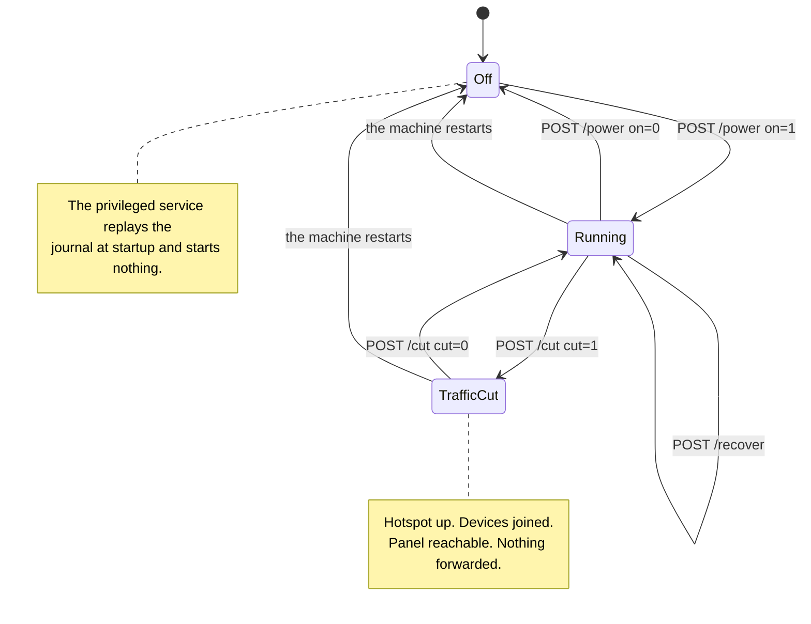

<!-- wiki-navigation:start -->

[English](https://github.com/Iman/caspian/wiki/Panel-and-Configuration) · [**فارسی**](https://github.com/Iman/caspian/wiki/Panel-and-Configuration.fa) · [Русский](https://github.com/Iman/caspian/wiki/Panel-and-Configuration.ru) · [简体中文](https://github.com/Iman/caspian/wiki/Panel-and-Configuration.zh) · [العربية](https://github.com/Iman/caspian/wiki/Panel-and-Configuration.ar) · [Türkçe](https://github.com/Iman/caspian/wiki/Panel-and-Configuration.tr) · [اردو](https://github.com/Iman/caspian/wiki/Panel-and-Configuration.ur)

[ویکی کاسپین](https://github.com/Iman/caspian/wiki/Home.fa) · [عیب‌یابی](https://github.com/Iman/caspian/wiki/Troubleshooting.fa)

<!-- wiki-navigation:end -->

# پنل و پیکربندی

پانل به زبان انگلیسی باز می شود که مرورگر هیچ گزینه ذخیره شده ای نداشته باشد. از منوی زبان در بالا استفاده کنید و Apply را انتخاب کنید تا به فارسی یا انگلیسی برگردید. انتخاب با آن مرورگر باقی می ماند، از جمله در صفحات ورود به سیستم و راهنما. منو بدون جاوا اسکریپت کار می کند. در صفحه‌های باریک، هدر و ناوبری بسته می‌شوند تا با عرض موجود مطابقت داشته باشند.

> این راهنما از README موجود می آید. اندازه گیری های آن تاریخ اصلی خود را حفظ می کند. این حرکت مستندسازی اجرای آزمایشی جدیدی را گزارش نمی‌کند.
> [English](https://github.com/Iman/caspian/blob/108567a6a529be05b577ee68b65b48790f07e43d/README.md) | [فارسی](https://github.com/Iman/caspian/blob/108567a6a529be05b577ee68b65b48790f07e43d/README.fa.md) | [Русский](https://github.com/Iman/caspian/blob/108567a6a529be05b577ee68b65b48790f07e43d/README.ru.md) | [中文](https://github.com/Iman/caspian/blob/108567a6a529be05b577ee68b65b48790f07e43d/README.zh.md)

## کنترل ها و اینکه کدام یک را فشار دهید

این پنل دارای سه کنترل است که عملکرد دستگاه را تغییر می دهد. دو تا از
آنها اینترنت را برای دستگاه های متصل به هات اسپات متوقف می کنند و اینطور نیست
همان کنترل این بخش وجود دارد زیرا تفاوت بین آنها بود
فقط در منبعی که شخصی که تلفن را در دست دارد نمی تواند بخواند، نوشته شده است
آن را

### سوئیچ، `POST /power`

سوئیچ کل دستگاه را روشن و خاموش می کند. خاموش کردن، `Stop` را روشن می کند
سرویس ممتاز، که پنج کار را به ترتیب انجام می دهد:

1. موتور را متوقف می کند
2. نقطه دسترسی و سرور DHCP و DNS در کنار آن را متوقف می کند
3. فایل های پیکربندی که آن دو با آن ها تولید شده اند را حذف می کند
4. دوباره رادیو را مسدود می کند، اگر کاسپین چیزی بود که آن را رفع انسداد کرد
5. ژورنال تخریب را دوباره پخش می کند

[`internal/privsvc/start.go`](https://github.com/Iman/caspian/blob/main/internal/privsvc/start.go)، `stopLocked` و
[`internal/hotspot/supervisor.go`](https://github.com/Iman/caspian/blob/main/internal/hotspot/supervisor.go)، `Supervisor.Stop`.

عاقبتی که اهمیت دارد همان وسط است. شبکه وای فای متوقف می شود
موجود هر دستگاه متصل شده آن را رها می‌کند، و این شامل تلفن نیز می‌شود
دست کسی که دکمه را فشار داده است.

### برش، `POST /cut`

برش فقط ترافیکی را که جعبه به نمایندگی از آن دستگاه ها به جلو می برد متوقف می کند. آن را
یک مجموعه قوانین nftables را به جای دیگری بارگذاری می کند. [`internal/privsvc/cut.go`](https://github.com/Iman/caspian/blob/main/internal/privsvc/cut.go) را ببینید،
`setForward`، و [`internal/netcfg/nftables.go`](https://github.com/Iman/caspian/blob/main/internal/netcfg/nftables.go)، `RulesetFor`.

این دو قاعده در زنجیره رو به جلو و هیچ جای دیگر متفاوت هستند.
`TestForwardCut_DiffersFromNormalOnlyInTheForwardChain` آن را با مقایسه بیان می کند
زنجیره ورودی، خروجی، پیش مسیریابی و پس مسیریابی خط برای خط. در برش
ruleset زنجیره رو به جلو هیچ چیز را قبول نمی کند. افت آشکاری را به همراه دارد
با یک دلیل روی آن، بنابراین اپراتور در حال خواندن مجموعه قوانین زنده می بیند که چرا ترافیک است
متوقف شده به جای عدم وجود قوانین:

iifname "wlan0" نظر را رها کنید "ترافیک مشتری توسط کاربر قطع شده است"

زنجیره ورودی دست نخورده است. بنابراین جعبه به DHCP در پورت 67، DNS پاسخ می دهد
در پورت DNS مشتری، و پنل در پورت خودش، هر کدام از آنها
رابط هات اسپات موتور خاموش نیست و نقطه دسترسی خاموش نیست
متوقف شد. دستگاه‌ها متصل می‌مانند، قراردادهای اجاره خود را حفظ می‌کنند و همچنان می‌توانند پانل را باز کنند.
تست: `TestForwardCut_StopsClientsAndKeepsThePanelReachable`.

### چرا این تفاوت تعیین می کند که کدام یک را می توانید از تلفن فشار دهید

پانل به طور پیش فرض به آدرس هات اسپات متصل می شود و به هیچ چیز دیگری. در حال خدمت کردن
آن در شبکه که خود جعبه روی آن قرار دارد تنظیمی است که کاربر باید آن را روشن کند،
و در حالت پیش فرض ارسال خاموش است. [`internal/panel/listen.go`](https://github.com/Iman/caspian/blob/main/internal/panel/listen.go) را ببینید،
`BindAddrs`، و [`internal/state/state.go`](https://github.com/Iman/caspian/blob/main/internal/state/state.go)، `PanelOnLAN`.

بنابراین کسی که تنها دستگاهش یک تلفن در نقطه اتصال است، می‌تواند بریدگی آن را لغو کند
تلفن آنها نمی توانند خاموشی را از آن خنثی کنند، زیرا خاموش کردن آن را حذف کرد
شبکه ای که از طریق آن به پنل می رسیدند. بنابراین بریدگی اضطراری است
توقفی که فردی را که از آن استفاده می کند گیر نمی کند. خنثی کردن آن هزینه ندارد
ارتباط مجدد، زیرا چیزی که دستگاه به آن متصل نشده بود از بین نرفت.

هنگامی که ترافیک باید اکنون متوقف شود و شما قصد دارید آن را برگردانید، برش را فشار دهید. هست
فوری و درخواست تاییدیه نمی کند و صفحه حالت را ایجاد می کند
تا زمانی که لازم الاجراست غیر قابل انکار پس از اتمام کار، سوئیچ را فشار دهید
دستگاه، یا زمانی که می خواهید آداپتور وای فای آن را به شبکه بازگرداند
از به عنوان یک توقف اضطراری از گوشی که هست دستش را به سوی کلید نزنید
در هات اسپات

دو واقعیت کوچکتر، زیرا عبارت کوتاه در صفحه به راحتی قابل خواندن است.
اول، برش روی جعبه ای که کار نمی کند، رد می شود و خودش این را می گوید
کلمات و نه به عنوان یک شکست ناشناخته. هیچ ارسالی برای توقف وجود ندارد. و الف
مجموعه قوانینی که یک رابط هات اسپات را نامگذاری می کند که وجود ندارد، تغییری در آن ایجاد شده است
ماشینی که کل ثابت آن در حالت خاموش این است که همانطور که پیدا شده رها شده است.
`errNotRunning` و خطای `not-running` را ببینید. دوم، یک برش
در حافظه نگهداری می شود و در هیچ فایلی نوشته می شود، بنابراین راه اندازی مجدد دستگاه آن را از دست می دهد.
این عمدی است: کسی که نمی تواند بفهمد چرا اینترنتش قطع شده است دچار مشکل می شود
با کشیدن دوشاخه آن را به عقب برگردانید. کاری که راه اندازی مجدد انجام نمی دهد، تعویض دستگاه است
در سرویس ممتاز در هنگام راه اندازی ژورنال را دوباره پخش می کند و هیچ چیز را شروع نمی کند.
[`cmd/caspian/serve_priv.go`](https://github.com/Iman/caspian/blob/main/cmd/caspian/serve_priv.go) را ببینید. بنابراین راه اندازی مجدد برش را پاک می کند و می رود
جعبه خاموش می شود و با فشار دادن سوئیچ، ترافیک دوباره جریان می یابد، نه قبل از آن.

### کنترل بازیابی، `POST /recover`

سومین کنترل راه خروج از جعبه گیر بدون راه اندازی مجدد و بدون a است
ترمینال همه چیز را متوقف می کند، ژورنال پراکنده را دوباره پخش می کند تا هر
قاعده رابط، مسیر و فایروال این دستگاه تغییر کرده است، و سپس
دوباره از تنظیمات ذخیره شده شروع می شود. `Service.Recover` است
`recoverToCleanMachine` به دنبال همان `Start` که سوئیچ استفاده می کند، بنابراین
بازیابی اجرای دومی از شروع نیست که می تواند تغییر کند.

به دلیل یک روز اندازه گیری شده وجود دارد. در 30-08-2026 دستگاه به طور مکرر
رسیده است که فقط شخصی با یک جلسه SSH می تواند پاک کند: یک رابط
با شروع ناموفق ایجاد شد و هرگز حذف نشد، آدرسی از زیر پاک شد
آن، یک مدخل ژورنالی که از یک شروع ناموفق جان سالم به در برد. هر یک از آن ها هستند
قابل بازیابی با پخش مجدد مطالبی که قبلاً نوشته شده است، و هیچ کدام از آنها نبود
قابل دسترسی از پنل

عمدا دستگاه را راه اندازی مجدد نمی کند و هیچ یک از سیستم ها را مجددا راه اندازی نمی کند
واحد، بنابراین فرآیند پانل و هر جلسه SSH در تمام طول باقی می ماند. متوقف می شود
نقطه دسترسی و آن را دوباره راه اندازی کنید، بنابراین دستگاهی که به هات اسپات متصل می شود خارج می شود
شبکه و پس از بازگشت هات اسپات دوباره به آن ملحق می شود.

<!-- English-source-sha256: d7e1ff1af94ccc77a97648658f4f4ee5fb24c5af9ae551c062ccc6677af7542d -->
