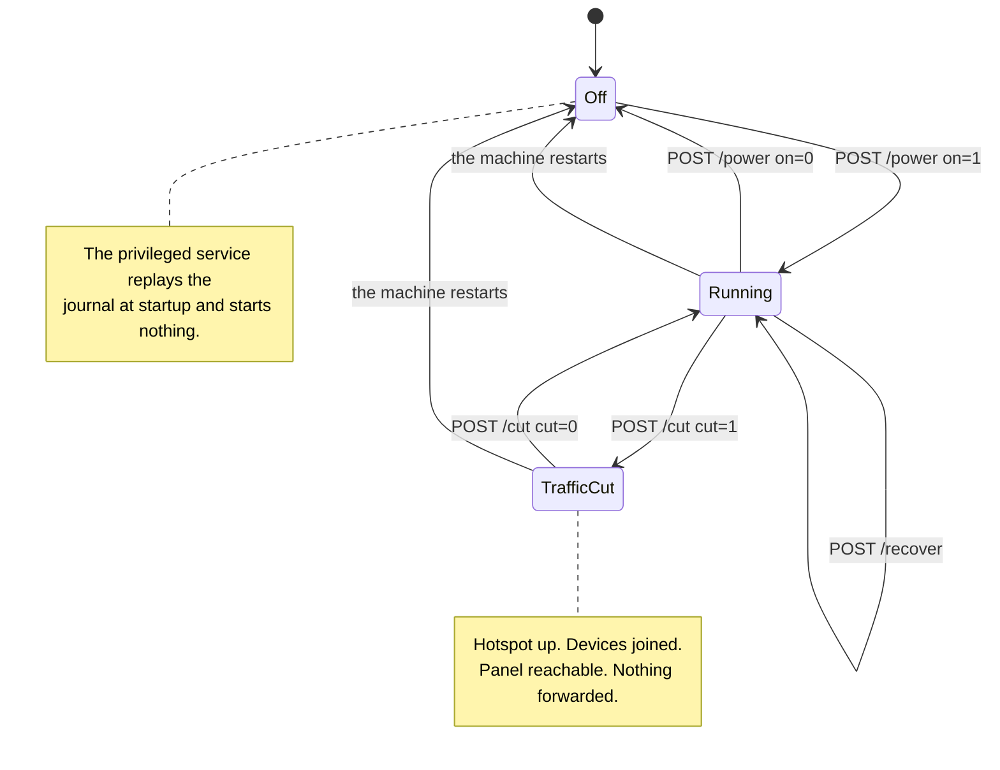

# Panel and configuration

[English](https://github.com/Iman/caspian/wiki/Panel-and-Configuration) | [فارسی](https://github.com/Iman/caspian/wiki/Panel-and-Configuration.fa) | [Русский](https://github.com/Iman/caspian/wiki/Panel-and-Configuration.ru) | [中文](https://github.com/Iman/caspian/wiki/Panel-and-Configuration.zh)

[Caspian wiki](https://github.com/Iman/caspian/wiki/Home)

> This guide comes from the existing README. Its measurements retain their original dates; this documentation move does not report a new test run.
> [English](https://github.com/Iman/caspian/blob/108567a6a529be05b577ee68b65b48790f07e43d/README.md) | [فارسی](https://github.com/Iman/caspian/blob/108567a6a529be05b577ee68b65b48790f07e43d/README.fa.md) | [Русский](https://github.com/Iman/caspian/blob/108567a6a529be05b577ee68b65b48790f07e43d/README.ru.md) | [中文](https://github.com/Iman/caspian/blob/108567a6a529be05b577ee68b65b48790f07e43d/README.zh.md)

## The controls, and which one to press

The panel carries three controls that change what the appliance is doing. Two of
them stop the internet for the devices joined to the hotspot, and they are not
the same control. This section exists because the difference between them was
written down only in the source, where the person holding the phone cannot read
it.

### The switch, `POST /power`

The switch turns the whole appliance on and off. Switching off calls `Stop` on
the privileged service, which does five things in order:

1. stops the engine
2. stops the access point and the DHCP and DNS server beside it
3. removes the configuration files those two were generated with
4. blocks the radio again, if Caspian was the thing that unblocked it
5. replays the teardown journal

See [`internal/privsvc/start.go`](https://github.com/Iman/caspian/blob/main/internal/privsvc/start.go), `stopLocked`, and
[`internal/hotspot/supervisor.go`](https://github.com/Iman/caspian/blob/main/internal/hotspot/supervisor.go), `Supervisor.Stop`.

The consequence that matters is the one in the middle. The WiFi network stops
existing. Every joined device drops off it, and that includes the phone in the
hand of the person who pressed the button.

### The cut, `POST /cut`

The cut stops only the traffic the box forwards on behalf of those devices. It
loads one nftables ruleset in place of another. See [`internal/privsvc/cut.go`](https://github.com/Iman/caspian/blob/main/internal/privsvc/cut.go),
`setForward`, and [`internal/netcfg/nftables.go`](https://github.com/Iman/caspian/blob/main/internal/netcfg/nftables.go), `RulesetFor`.

The two rulesets differ in the forward chain and nowhere else.
`TestForwardCut_DiffersFromNormalOnlyInTheForwardChain` asserts it by comparing
the input, output, prerouting and postrouting chains line for line. In the cut
ruleset the forward chain accepts nothing at all. It carries an explicit drop
with a reason on it, so an operator reading the live ruleset sees why traffic is
stopped rather than an absence of rules:

    iifname "wlan0" drop comment "client traffic cut by the user"

The input chain is untouched. So the box goes on answering DHCP on port 67, DNS
on the client DNS port, and the panel on its own port, each of them from the
hotspot interface. The engine is not stopped and the access point is not
stopped. Devices stay joined, keep their leases, and can still open the panel.
Test: `TestForwardCut_StopsClientsAndKeepsThePanelReachable`.

### Why the difference decides which one you can press from a phone

The panel binds to the hotspot address by default and to nothing else. Serving
it on the network the box itself sits on is a setting the user has to turn on,
and it is off in the shipped default. See [`internal/panel/listen.go`](https://github.com/Iman/caspian/blob/main/internal/panel/listen.go),
`BindAddrs`, and [`internal/state/state.go`](https://github.com/Iman/caspian/blob/main/internal/state/state.go), `PanelOnLAN`.

So somebody whose only device is a phone on the hotspot can undo a cut from that
phone. They cannot undo a switch-off from it, because the switch-off removed the
network they were reaching the panel over. The cut is therefore the emergency
stop that does not strand the person using it. Undoing it costs no
reassociation, because nothing the device was attached to went away.

Press the cut when traffic has to stop now and you intend to put it back. It is
immediate and it asks for no confirmation, and the page makes the state
unmistakable while it is in force. Press the switch when you have finished with
the appliance, or when you want the WiFi adapter handed back to the network it
came from. Do not reach for the switch as an emergency stop from a phone that is
on the hotspot.

Two smaller facts, because the short wording on the page is easy to read past.
First, a cut is refused on a box that is not running, and it says so in its own
words rather than as an unknown failure. There is no forwarding to stop. And a
ruleset that names a hotspot interface which does not exist is a change made to
a machine whose whole invariant while off is that it was left as it was found.
See `errNotRunning` and the `not-running` fault. Second, a cut
is held in memory and written to no file, so a restart of the machine loses it.
That is deliberate: somebody who cannot work out why their internet stopped gets
it back by pulling the plug. What a restart does not do is switch the appliance
on. The privileged service replays the journal at startup and starts nothing.
See [`cmd/caspian/serve_priv.go`](https://github.com/Iman/caspian/blob/main/cmd/caspian/serve_priv.go). A restart therefore clears the cut and leaves
the box off, and traffic flows again once the switch is pressed, not before.

### The recovery control, `POST /recover`

The third control is the way out of a stuck box without a reboot and without a
terminal. It stops everything, replays the teardown journal so that every
interface, route and firewall rule this appliance changed is put back, and then
starts again from the saved settings. `Service.Recover` is
`recoverToCleanMachine` followed by the same `Start` the switch uses, so a
recovery is not a second implementation of starting that could drift.

It exists because of a measured day. On 2026-08-30 the appliance repeatedly
reached states that only a person with an SSH session could clear: an interface
created by a failed start and never removed, an address flushed out from under
it, a journal entry that survived a failed start. Every one of those is
recoverable by replaying what is already written down, and none of it was
reachable from the panel.

It deliberately does not reboot the machine and does not restart either systemd
unit, so the panel process and any SSH session stay up throughout. It does stop
the access point and start it again, so a device joined to the hotspot leaves
the network and rejoins it when the hotspot returns.

[English](https://github.com/Iman/caspian/blob/main/README.md) | [فارسی](https://github.com/Iman/caspian/blob/main/README.fa.md) | [Русский](https://github.com/Iman/caspian/blob/main/README.ru.md) | [中文](https://github.com/Iman/caspian/blob/main/README.zh.md)
