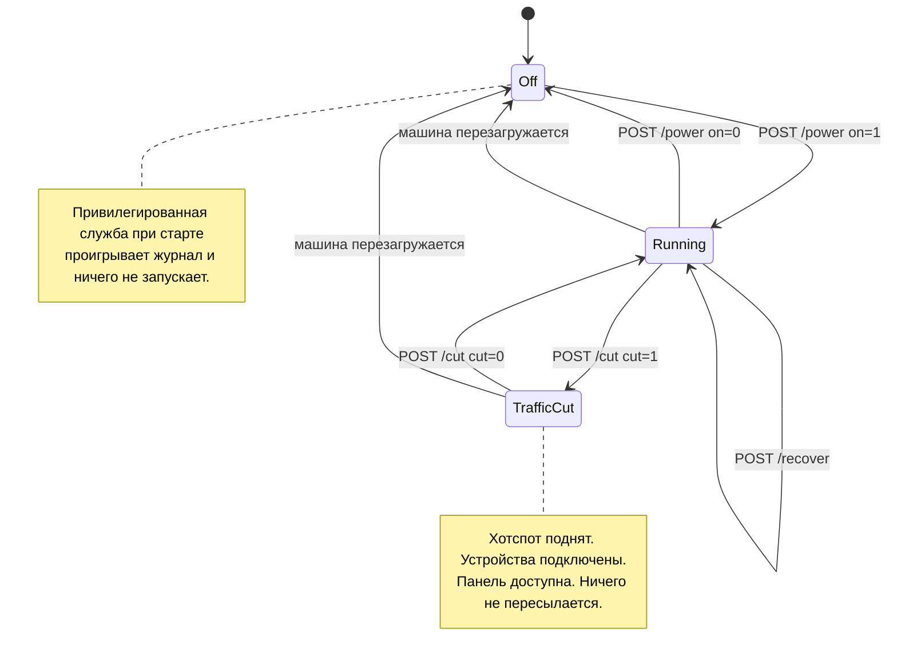

# Панель и настройки

[English](https://github.com/Iman/caspian/wiki/Panel-and-Configuration) | [فارسی](https://github.com/Iman/caspian/wiki/Panel-and-Configuration.fa) | [Русский](https://github.com/Iman/caspian/wiki/Panel-and-Configuration.ru) | [中文](https://github.com/Iman/caspian/wiki/Panel-and-Configuration.zh)

[Вики Caspian](https://github.com/Iman/caspian/wiki/Home.ru)

> Руководство перенесено из README. Даты измерений сохранены; перенос документации не означает нового запуска тестов.
> [English](https://github.com/Iman/caspian/blob/108567a6a529be05b577ee68b65b48790f07e43d/README.md) | [فارسی](https://github.com/Iman/caspian/blob/108567a6a529be05b577ee68b65b48790f07e43d/README.fa.md) | [Русский](https://github.com/Iman/caspian/blob/108567a6a529be05b577ee68b65b48790f07e43d/README.ru.md) | [中文](https://github.com/Iman/caspian/blob/108567a6a529be05b577ee68b65b48790f07e43d/README.zh.md)

## Органы управления и какой из них нажимать

В панели три органа управления, которые меняют то, что устройство делает. Два из
них останавливают интернет для устройств, подключённых к хотспоту, и это не один
и тот же орган управления. Этот раздел существует потому, что разница между ними
была записана только в исходниках, где человек с телефоном в руках её прочитать
не может.

### Переключатель, `POST /power`

Переключатель включает и выключает устройство целиком. Выключение вызывает
`Stop` у привилегированной службы, которая делает пять вещей по порядку:

1. останавливает движок
2. останавливает точку доступа и стоящий рядом с ней сервер DHCP и DNS
3. удаляет файлы конфигурации, с которыми эти два были сгенерированы
4. снова блокирует радио, если разблокировал его именно Caspian
5. проигрывает журнал разборки

Смотрите [`internal/privsvc/start.go`](https://github.com/Iman/caspian/blob/main/internal/privsvc/start.go), `stopLocked`, и
[`internal/hotspot/supervisor.go`](https://github.com/Iman/caspian/blob/main/internal/hotspot/supervisor.go), `Supervisor.Stop`.

Значение имеет то, что стоит в середине. Сеть Wi-Fi перестаёт существовать.
Каждое подключённое устройство отваливается от неё, и это включает телефон в
руке того, кто нажал кнопку.

### Отсечка, `POST /cut`

Отсечка останавливает только тот трафик, который коробка пересылает от имени
этих устройств. Она загружает один набор правил nftables вместо другого.
Смотрите [`internal/privsvc/cut.go`](https://github.com/Iman/caspian/blob/main/internal/privsvc/cut.go), `setForward`, и
[`internal/netcfg/nftables.go`](https://github.com/Iman/caspian/blob/main/internal/netcfg/nftables.go), `RulesetFor`.

Два набора правил различаются в цепочке forward и больше нигде.
`TestForwardCut_DiffersFromNormalOnlyInTheForwardChain` утверждает это, сравнивая
цепочки input, output, prerouting и postrouting строка за строкой. В наборе
правил отсечки цепочка forward не пропускает вообще ничего. В ней есть явный
drop с указанием причины, поэтому оператор, читающий живой набор правил, видит,
почему трафик остановлен, а не отсутствие правил:

    iifname "wlan0" drop comment "client traffic cut by the user"

Цепочка input не затрагивается. Поэтому коробка продолжает отвечать по DHCP на
порту 67, по DNS на клиентском DNS-порту и панелью на её собственном порту,
каждый раз со стороны интерфейса хотспота. Движок не останавливается, и точка
доступа не останавливается. Устройства остаются подключёнными, сохраняют свои
аренды адресов и по-прежнему могут открыть панель. Тест:
`TestForwardCut_StopsClientsAndKeepsThePanelReachable`.

### Почему эта разница решает, что можно нажать с телефона

Панель по умолчанию слушает на адресе хотспота и больше нигде. Раздача её в ту
сеть, в которой стоит сама коробка, это настройка, которую пользователь должен
включить сам, и в поставляемых значениях по умолчанию она выключена. Смотрите
[`internal/panel/listen.go`](https://github.com/Iman/caspian/blob/main/internal/panel/listen.go), `BindAddrs`, и [`internal/state/state.go`](https://github.com/Iman/caspian/blob/main/internal/state/state.go),
`PanelOnLAN`.

Поэтому тот, у кого есть только телефон на хотспоте, может отменить отсечку с
этого телефона. Отменить выключение с него он не может, потому что выключение
убрало ту сеть, через которую он добирался до панели. Отсечка, таким образом,
это аварийная остановка, которая не бросает того, кто ею пользуется. Её отмена
не стоит переподключения к сети, потому что то, к чему устройство было
подключено, никуда не делось.

Нажимайте отсечку, когда трафик надо остановить прямо сейчас и вы собираетесь
вернуть его обратно. Она срабатывает мгновенно и ничего не переспрашивает, а
страница делает это состояние безошибочно понятным, пока оно действует.
Нажимайте переключатель, когда вы закончили с устройством или когда хотите
вернуть адаптер Wi-Fi той сети, из которой он пришёл. Не тянитесь к
переключателю как к аварийной остановке с телефона, который подключён к
хотспоту.

Два более мелких факта, потому что короткие формулировки на странице легко
пропустить. Во-первых, отсечка отклоняется на неработающей коробке, и говорит об
этом своими словами, а не как о неизвестном сбое. Останавливать нечего:
пересылки нет. А набор правил, называющий интерфейс хотспота, которого не
существует, был бы изменением машины, чей единственный инвариант в выключенном
состоянии в том, что её оставили такой, какой нашли. Смотрите `errNotRunning` и
ошибку `not-running`. Во-вторых, отсечка держится в памяти и не пишется ни в
какой файл, поэтому перезагрузка машины её теряет. Это сделано намеренно: тот,
кто не может понять, почему у него пропал интернет, возвращает его, выдернув
питание. Чего перезагрузка не делает, так это не включает устройство.
Привилегированная служба при старте проигрывает журнал и ничего не запускает.
Смотрите [`cmd/caspian/serve_priv.go`](https://github.com/Iman/caspian/blob/main/cmd/caspian/serve_priv.go). Таким образом, перезагрузка снимает
отсечку и оставляет коробку выключенной, а трафик пойдёт снова, когда нажмут
переключатель, и не раньше.

### Кнопка восстановления, `POST /recover`

Третий орган управления, это выход из застрявшей коробки без перезагрузки и без
терминала. Он всё останавливает, проигрывает журнал разборки, так что каждый
интерфейс, маршрут и правило файрвола, которые устройство меняло, возвращаются
на место, а затем запускает всё заново из сохранённых настроек. `Service.Recover`
это `recoverToCleanMachine`, за которым следует тот же `Start`, что использует
переключатель, поэтому восстановление не является второй реализацией запуска,
которая могла бы разойтись с первой.

Он существует из-за одного измеренного дня. 2026-08-30 устройство раз за разом
приходило в состояния, которые мог расчистить только человек с сессией SSH:
интерфейс, созданный неудавшимся стартом и так и не удалённый, адрес, снятый
из-под него, запись в журнале, пережившая неудавшийся старт. Каждое из этого
исправимо проигрыванием того, что уже записано, и ничто из этого не было
доступно из панели.

Он намеренно не перезагружает машину и не перезапускает ни один из двух
systemd-юнитов, поэтому процесс панели и любая сессия SSH остаются живыми всё
это время. Он всё же останавливает точку доступа и запускает её заново, поэтому
устройство, подключённое к хотспоту, покидает сеть и присоединяется снова, когда
хотспот возвращается.

[English](https://github.com/Iman/caspian/blob/main/README.md) | [فارسی](https://github.com/Iman/caspian/blob/main/README.fa.md) | [Русский](https://github.com/Iman/caspian/blob/main/README.ru.md) | [中文](https://github.com/Iman/caspian/blob/main/README.zh.md)
