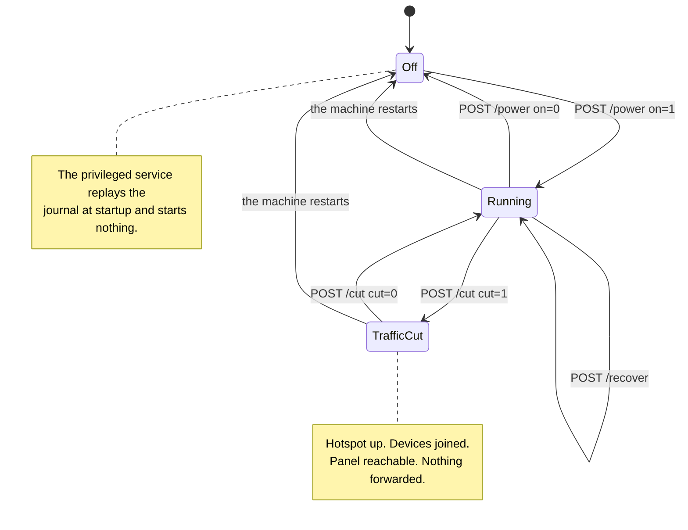

<!-- wiki-navigation:start -->

[English](https://github.com/Iman/caspian/wiki/Panel-and-Configuration) · [فارسی](https://github.com/Iman/caspian/wiki/Panel-and-Configuration.fa) · [**Русский**](https://github.com/Iman/caspian/wiki/Panel-and-Configuration.ru) · [简体中文](https://github.com/Iman/caspian/wiki/Panel-and-Configuration.zh) · [العربية](https://github.com/Iman/caspian/wiki/Panel-and-Configuration.ar) · [Türkçe](https://github.com/Iman/caspian/wiki/Panel-and-Configuration.tr) · [اردو](https://github.com/Iman/caspian/wiki/Panel-and-Configuration.ur)

[Вики Caspian](https://github.com/Iman/caspian/wiki/Home.ru) · [Устранение неполадок](https://github.com/Iman/caspian/wiki/Troubleshooting.ru)

<!-- wiki-navigation:end -->

# Панель и конфигурация

Панель открывается на английском языке, когда в браузере нет сохраненного выбора. Используйте языковое меню вверху и выберите «Применить», чтобы переключиться на персидский или обратно на английский. Выбор остается за этим браузером, в том числе на страницах входа и справки. Меню работает без JavaScript. На узких экранах заголовок и навигация переносятся по доступной ширине.

> Это руководство взято из существующего README. Его измерения сохраняют свои первоначальные даты; этот шаг документации не сообщает о новом тестовом запуске.
> [English](https://github.com/Iman/caspian/blob/108567a6a529be05b577ee68b65b48790f07e43d/README.md) | [فارسی](https://github.com/Iman/caspian/blob/108567a6a529be05b577ee68b65b48790f07e43d/README.fa.md) | [Русский](https://github.com/Iman/caspian/blob/108567a6a529be05b577ee68b65b48790f07e43d/README.ru.md) | [中文](https://github.com/Iman/caspian/blob/108567a6a529be05b577ee68b65b48790f07e43d/README.zh.md)

## Элементы управления и какой из них нажимать

На панели расположены три элемента управления, которые изменяют работу устройства. Два из
они останавливают доступ в Интернет для устройств, подключенных к точке доступа, и они не
тот же контроль. Этот раздел существует, потому что разница между ними была
записано только в первоисточнике, где человек, держащий телефон, не может прочитать
это.

### Переключатель, `POST /power`

Переключатель включает и выключает весь прибор. Отключение звонков `Stop` на
привилегированный сервис, который выполняет пять действий по порядку:

1. останавливает двигатель
2. останавливает точку доступа и DHCP- и DNS-сервер рядом с ней
3. удаляет файлы конфигурации, с помощью которых были созданы эти двое
4. снова блокирует радио, если Каспиан был тем, кто его разблокировал
5. воспроизводит журнал разборки

См. [`internal/privsvc/start.go`](https://github.com/Iman/caspian/blob/main/internal/privsvc/start.go), `stopLocked` и
[`internal/hotspot/supervisor.go`](https://github.com/Iman/caspian/blob/main/internal/hotspot/supervisor.go), `Supervisor.Stop`.

Последствие, которое имеет значение, находится посередине. Сеть Wi-Fi останавливается
существующий. Каждое подключенное устройство отключается от него, включая телефон в
рука того, кто нажал кнопку.

### Разрез, `POST /cut`

Отсечение останавливает только трафик, который устройство перенаправляет от имени этих устройств. Это
загружает один набор правил nftables вместо другого. См. [`internal/privsvc/cut.go`](https://github.com/Iman/caspian/blob/main/internal/privsvc/cut.go),
`setForward` и [`internal/netcfg/nftables.go`](https://github.com/Iman/caspian/blob/main/internal/netcfg/nftables.go), `RulesetFor`.

Два набора правил различаются только в прямой цепочке и нигде больше.
`TestForwardCut_DiffersFromNormalOnlyInTheForwardChain` утверждает это, сравнивая
цепочки ввода, вывода, предварительной маршрутизации и последующей маршрутизации строка за строкой. В разрезе
Ruleset прямая цепочка вообще ничего не принимает. Он несет в себе явное падение
с указанием причины, поэтому оператор, читающий текущий набор правил, видит, почему трафик
остановился, а не отсутствие правил:

iifname "wlan0" оставить комментарий "клиентский трафик сокращен пользователем"

Входная цепочка нетронута. Итак, коробка продолжает отвечать на DHCP на порту 67, DNS
на DNS-порт клиента, а панель на свой порт, каждый из
интерфейс точки доступа. Двигатель не остановлен, а точка доступа не
остановился. Устройства остаются подключенными, сохраняют аренду и по-прежнему могут открывать панель.
Тест: `TestForwardCut_StopsClientsAndKeepsThePanelReachable`.

### Почему разница решает, какую кнопку можно нажать с телефона?

По умолчанию панель привязывается к адресу точки доступа и ни к чему другому. Обслуживание
в сети, на которой находится само устройство, — это настройка, которую пользователь должен включить,
и он выключен в поставке по умолчанию. См. [`internal/panel/listen.go`](https://github.com/Iman/caspian/blob/main/internal/panel/listen.go),
`BindAddrs` и [`internal/state/state.go`](https://github.com/Iman/caspian/blob/main/internal/state/state.go), `PanelOnLAN`.

Таким образом, кто-то, чьим единственным устройством является телефон в точке доступа, может отменить вырезку из этого
телефон. Они не могут отменить отключение от него, потому что отключение устранило
сети, через которую они добирались до панели. Поэтому сокращение является чрезвычайной ситуацией.
стоп, который не ставит в тупик человека, использующего его. Отмена этого не стоит
переассоциацию, потому что ничего, к чему было подключено устройство, не исчезло.

Нажмите на сокращение, когда движение должно остановиться сейчас, и вы собираетесь вернуть его обратно. Это
немедленно, и он не запрашивает подтверждения, и страница делает состояние
безошибочно, пока он в силе. Нажмите переключатель, когда закончите
устройство или если вы хотите, чтобы адаптер Wi-Fi был возвращен в сеть, он
пришел из. Не тянитесь к выключателю в качестве аварийной остановки с телефона, который
на горячей точке.

Два небольших факта, потому что короткую формулировку на странице легко прочитать.
Во-первых, в резе отказывают на не запущенной коробке, и она сама так говорит
слова, а не как неизвестная неудача. Нет никакой пересылки, которую можно было бы остановить. И
набор правил, который называет несуществующий интерфейс точки доступа, является изменением, внесенным в
машина, весь инвариант которой в выключенном состоянии заключается в том, что она осталась такой, какой была найдена.
См. `errNotRunning` и ошибку `not-running`. Во-вторых, разрез
хранится в памяти и не записывается ни в один файл, поэтому при перезапуске машины он теряется.
Это намеренно: кто-то, кто не может понять, почему у него остановился Интернет, получает
его обратно, потянув за вилку. Чего не делает перезапуск, так это переключает устройство
дальше. Привилегированная служба воспроизводит журнал при запуске и ничего не запускает.
См. [`cmd/caspian/serve_priv.go`](https://github.com/Iman/caspian/blob/main/cmd/caspian/serve_priv.go). Таким образом, перезапуск очищает вырез и оставляет
коробка выключается, и трафик снова течет после нажатия переключателя, а не раньше.

### Контроль восстановления, `POST /recover`

Третий контроль - выход из зависшего ящика без перезагрузки и без
терминал. Он все останавливает, воспроизводит журнал разборки, чтобы каждый
правила интерфейса, маршрута и брандмауэра, которые изменило это устройство, возвращаются, а затем
начинается заново с сохраненными настройками. `Service.Recover` — это
`recoverToCleanMachine`, за которым следует тот же `Start`, который используется коммутатором, поэтому
восстановление — это не вторая реализация запуска, которая может дрейфовать.

Он существует благодаря размеренному дню. 30 августа 2026 г. прибор неоднократно
достигнутые состояния, которые может очистить только человек с сеансом SSH: интерфейс
созданный неудачным запуском и никогда не удаляемый, адрес выбрасывается из-под
это запись в журнале, пережившая неудачный старт. Каждый из них
можно восстановить, проиграв уже записанное, и ничего из этого не было
доступен с панели.

Он намеренно не перезагружает машину и не перезапускает ни systemd
блок, поэтому процесс панели и любой сеанс SSH остаются в рабочем состоянии на протяжении всего времени. Это останавливает
точку доступа и запустите ее заново, чтобы устройство, подключенное к точке доступа, покинуло
сети и повторно присоединяется к ней, когда точка доступа возвращается.

<!-- English-source-sha256: d7e1ff1af94ccc77a97648658f4f4ee5fb24c5af9ae551c062ccc6677af7542d -->
