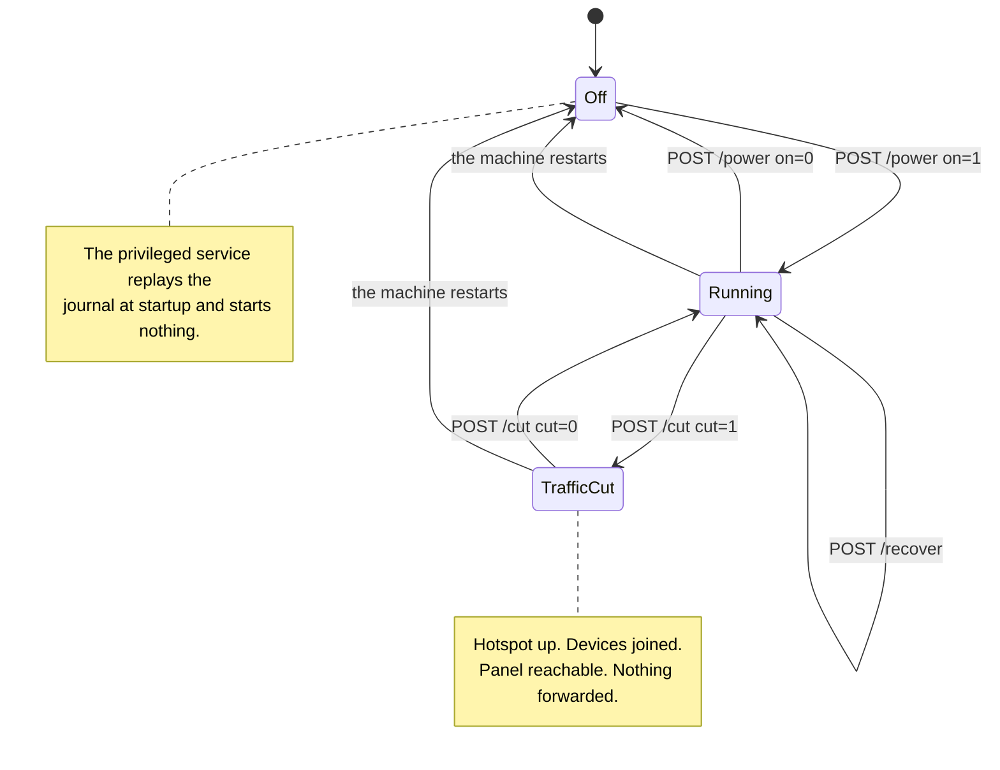

[English](https://github.com/Iman/caspian/wiki/Panel-and-Configuration) | [فارسی](https://github.com/Iman/caspian/wiki/Panel-and-Configuration.fa) | [Русский](https://github.com/Iman/caspian/wiki/Panel-and-Configuration.ru) | [中文](https://github.com/Iman/caspian/wiki/Panel-and-Configuration.zh) | [العربية](https://github.com/Iman/caspian/wiki/Panel-and-Configuration.ar) | [Türkçe](https://github.com/Iman/caspian/wiki/Panel-and-Configuration.tr) | [اردو](https://github.com/Iman/caspian/wiki/Panel-and-Configuration.ur)

# Panel ve konfigürasyon

[Caspian wiki'si](https://github.com/Iman/caspian/wiki/Home.tr)

Tarayıcının kayıtlı seçeneği olmadığında panel İngilizce olarak açılır. Üstteki dil menüsünü kullanın ve Farsçaya veya İngilizceye geri dönmek için Uygula'yı seçin. Seçim, oturum açma ve yardım sayfaları da dahil olmak üzere tarayıcıda kalır. Menü JavaScript olmadan çalışır. Dar ekranlarda başlık ve gezinme, mevcut genişliğe sığacak şekilde kaydırılır.

> Bu kılavuz mevcut README'den alınmıştır. Ölçümleri orijinal tarihlerini koruyor; bu belgeleme hamlesi yeni bir test çalıştırmasını bildirmez.
> [English](https://github.com/Iman/caspian/blob/108567a6a529be05b577ee68b65b48790f07e43d/README.md) | [فارسی](https://github.com/Iman/caspian/blob/108567a6a529be05b577ee68b65b48790f07e43d/README.fa.md) | [Русский](https://github.com/Iman/caspian/blob/108567a6a529be05b577ee68b65b48790f07e43d/README.ru.md) | [中文](https://github.com/Iman/caspian/blob/108567a6a529be05b577ee68b65b48790f07e43d/README.zh.md)

## Kontroller ve hangisine basılacağı

Panel, cihazın ne yaptığını değiştiren üç kontrol içerir. iki tanesi
erişim noktasına bağlanan cihazların internetini durdururlar ve
aynı kontrol. Bu bölüm var çünkü aralarındaki fark
sadece telefonu tutan kişinin okuyamayacağı kaynakta yazıyor
o.

### Anahtar, `POST /power`

Anahtar tüm cihazı açıp kapatır. Aramaların kapatılması `Stop` açık
ayrıcalıklı hizmet, beş şeyi sırayla yapar:

1. motoru durdurur
2. erişim noktasını ve yanındaki DHCP ve DNS sunucusunu durdurur
3. bu ikisinin oluşturulduğu yapılandırma dosyalarını kaldırır
4. Radyoyu tekrar bloke ediyor, eğer Caspian blokeyi kaldırmışsa
5. yırtma günlüğünü tekrar oynatır

Bkz. [`internal/privsvc/start.go`](https://github.com/Iman/caspian/blob/main/internal/privsvc/start.go), `stopLocked` ve
[`internal/hotspot/supervisor.go`](https://github.com/Iman/caspian/blob/main/internal/hotspot/supervisor.go), `Supervisor.Stop`.

Önemli olan sonuç ortadaki sonuçtur. Wi-Fi ağı duruyor
mevcut. Katılan her cihaz onu bırakır ve buna telefon da dahildir.
düğmeye basan kişinin eli.

### Kesim, `POST /cut`

Kesim yalnızca kutunun bu cihazlar adına ilettiği trafiği durdurur. o
bir nftables kural kümesini diğerinin yerine yükler. Bkz.[`internal/privsvc/cut.go`](https://github.com/Iman/caspian/blob/main/internal/privsvc/cut.go),
`setForward` ve [`internal/netcfg/nftables.go`](https://github.com/Iman/caspian/blob/main/internal/netcfg/nftables.go), `RulesetFor`.

İki kural seti ileri zincirde farklılık gösterir ve başka hiçbir yerde farklılık göstermez.
`TestForwardCut_DiffersFromNormalOnlyInTheForwardChain` bunu karşılaştırarak ileri sürüyor
satır satır giriş, çıkış, ön yönlendirme ve yönlendirme sonrası zincirler. kesimde
Kural seti ileri zincir hiçbir şeyi kabul etmez. Açık bir düşüş taşıyor
Bunun bir nedeni vardır, böylece canlı kural setini okuyan bir operatör trafiğin neden aktığını görür.
kuralların yokluğundan ziyade durduruldu:

iifname "wlan0" yorum bırak "istemci trafiği kullanıcı tarafından kesildi"

Giriş zincirine dokunulmaz. Böylece kutu 67 numaralı bağlantı noktasındaki DHCP'yi yanıtlamaya devam eder, DNS
istemcinin DNS portunda ve panelin kendi portunda, her biri
sıcak nokta arayüzü. Motor durdurulmamış ve erişim noktası kapatılmamış
durdu. Cihazlar bağlı kalır, kiralamalarını sürdürür ve paneli açmaya devam edebilir.
Test: `TestForwardCut_StopsClientsAndKeepsThePanelReachable`.

### Telefondan hangisine basabileceğinize neden fark karar veriyor?

Panel varsayılan olarak etkin nokta adresine bağlanır ve başka hiçbir şeye bağlanmaz. Servis
ağda kutunun bulunduğu yer kullanıcının açması gereken bir ayardır,
ve gönderilen varsayılan ayarda kapalıdır. Bkz. [`internal/panel/listen.go`](https://github.com/Iman/caspian/blob/main/internal/panel/listen.go),
`BindAddrs` ve [`internal/state/state.go`](https://github.com/Iman/caspian/blob/main/internal/state/state.go), `PanelOnLAN`.

Yani erişim noktasındaki tek cihazı telefon olan biri, bu kesintiyi geri alabilir.
telefon. Kapatma işlemini geri alamazlar çünkü kapatma,
ağ üzerinden panele ulaşıyorlardı. Kesim bu nedenle acil bir durumdur
kullanan kişiyi zor durumda bırakmayacak şekilde durdurun. Bunu geri almanın hiçbir maliyeti yoktur
yeniden ilişkilendirme, çünkü cihazın bağlı olduğu hiçbir şey kaybolmadı.

Trafiğin şimdi durması gerektiğinde ve onu geri koymak istediğinizde kesmeye basın. öyle
hemen ve hiçbir onay istemez ve sayfa durumu belirtir
yürürlükte olduğu sürece şüphe götürmez. İşiniz bittiğinde anahtara basın
cihazda veya WiFi adaptörünün ağa geri verilmesini istediğinizde
den geldi. Acil durumda durdurulması gereken bir telefondan anahtara uzanmayın.
sıcak noktada.

İki küçük gerçek, çünkü sayfadaki kısa ifadelerin okunması kolaydır.
İlk olarak, çalışmayan bir kutuda kesim reddediliyor ve kutu kendisinde de öyle yazıyor.
bilinmeyen bir başarısızlık yerine kelimeler. Durdurulacak bir yönlendirme yok. Ve bir
Var olmayan bir erişim noktası arayüzünü adlandıran kural kümesi,
Kapalıyken değişmezliği, bulunduğu gibi bırakılması olan bir makine.
Bkz. `errNotRunning` ve `not-running` hatası. İkincisi, bir kesim
bellekte tutulur ve hiçbir dosyaya yazılmaz, dolayısıyla makinenin yeniden başlatılması onu kaybeder.
Bu kasıtlıdır: İnternetinin neden kesildiğini çözemeyen biri
fişini çekerek geri çekin. Yeniden başlatmanın yapmadığı şey cihazı değiştirmektir
açık. Ayrıcalıklı hizmet, başlangıçta günlüğü yeniden oynatır ve hiçbir şey başlatmaz.
Bkz. [`cmd/caspian/serve_priv.go`](https://github.com/Iman/caspian/blob/main/cmd/caspian/serve_priv.go). Bu nedenle yeniden başlatma işlemi keser ve bırakır
kutu kapanır ve anahtara basıldığında trafik yeniden akar, daha önce değil.

### Kurtarma kontrolü, `POST /recover`

Üçüncü kontrol, sıkışmış bir kutudan, yeniden başlatmaya gerek kalmadan ve
terminal. Her şeyi durdurur, sökme günlüğünü yeniden oynatır, böylece her
değiştirilen bu cihazın arayüzü, rotası ve güvenlik duvarı kuralı geri konur ve ardından
kaydedilen ayarlardan yeniden başlar. `Service.Recover`:
`recoverToCleanMachine` ve ardından anahtarın kullandığı `Start`, yani
kurtarma, sürüklenebilecek ikinci bir başlatma uygulaması değildir.

Ölçülen bir gün nedeniyle var olur. 30.08.2026 tarihinde cihaz tekrar tekrar
Ulaşılan, yalnızca SSH oturumu olan bir kişinin temizleyebileceği belirtiliyor: bir arayüz
Başarısız bir başlatmayla oluşturulan ve asla kaldırılmayan bir adres, alttan dışarı atılır
başarısız bir başlangıçtan sağ kurtulan bir günlük girişi. Bunların her biri
zaten yazılmış olanın tekrar oynatılmasıyla kurtarılabilir ve bunların hiçbiri
panelden ulaşabilirsiniz.

Makineyi kasıtlı olarak yeniden başlatmaz ve her iki sistemi de yeniden başlatmaz.
Böylece panel süreci ve herhangi bir SSH oturumu baştan sona çalışır durumda kalır. Duruyor
erişim noktasına bağlanın ve yeniden başlatın, böylece erişim noktasına bağlanan bir cihaz ayrılır
ağa bağlanır ve sıcak nokta geri döndüğünde ağa yeniden katılır.

<!-- Caspian guide navigation -->

Caspian kılavuzları: [kurulum ve desteklenen protokoller](https://github.com/Iman/caspian/wiki/Home.tr) · [DPI'yı aşmak için SNI sahtekarlığı: kurulum ve sınırlar](https://github.com/Iman/caspian/wiki/SNI-Spoofing.tr).

<!-- English-source-sha256: a8e4593b041147f8a67533ec5f1eb75b6017a32cf457d4ea6151af7a8232382b -->
