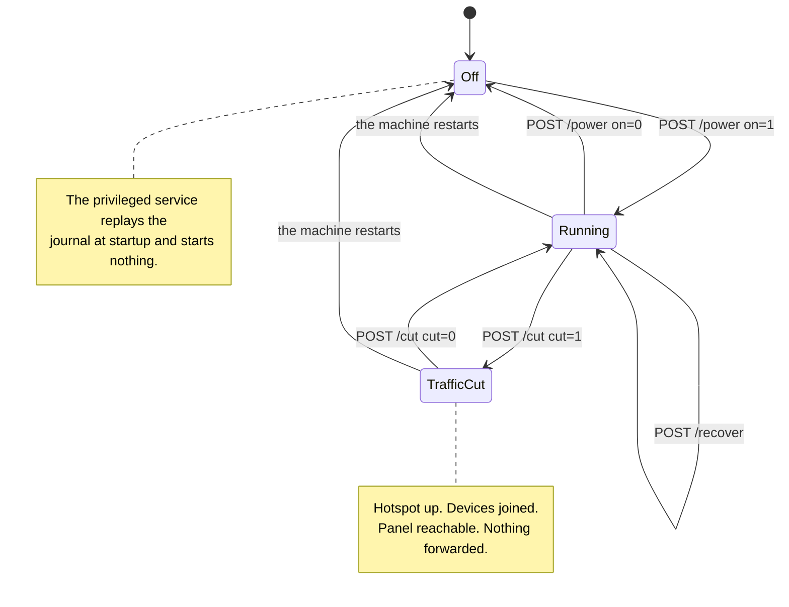

<!-- wiki-navigation:start -->

[English](https://github.com/Iman/caspian/wiki/Panel-and-Configuration) · [فارسی](https://github.com/Iman/caspian/wiki/Panel-and-Configuration.fa) · [Русский](https://github.com/Iman/caspian/wiki/Panel-and-Configuration.ru) · [简体中文](https://github.com/Iman/caspian/wiki/Panel-and-Configuration.zh) · [العربية](https://github.com/Iman/caspian/wiki/Panel-and-Configuration.ar) · [Türkçe](https://github.com/Iman/caspian/wiki/Panel-and-Configuration.tr) · [**اردو**](https://github.com/Iman/caspian/wiki/Panel-and-Configuration.ur)

[Caspian ویکی](https://github.com/Iman/caspian/wiki/Home.ur) · [مسائل کا حل](https://github.com/Iman/caspian/wiki/Troubleshooting.ur)

<!-- wiki-navigation:end -->

# پینل اور ترتیب

پینل انگریزی میں کھلتا ہے جب براؤزر کے پاس کوئی محفوظ کردہ انتخاب نہیں ہوتا ہے۔ سب سے اوپر لینگویج مینو کا استعمال کریں اور فارسی یا انگریزی میں واپس جانے کے لیے اپلائی کو منتخب کریں۔ انتخاب اس براؤزر کے ساتھ رہتا ہے، بشمول سائن ان اور مدد کے صفحات پر۔ مینو جاوا اسکرپٹ کے بغیر کام کرتا ہے۔ تنگ اسکرینوں پر، دستیاب چوڑائی کے مطابق ہونے کے لیے ہیڈر اور نیویگیشن لپیٹیں۔

> یہ گائیڈ موجودہ README سے آتا ہے۔ اس کی پیمائش اپنی اصل تاریخوں کو برقرار رکھتی ہے۔ یہ دستاویزی اقدام نئے ٹیسٹ رن کی اطلاع نہیں دیتا ہے۔
> [English](https://github.com/Iman/caspian/blob/108567a6a529be05b577ee68b65b48790f07e43d/README.md) | [فارسی](https://github.com/Iman/caspian/blob/108567a6a529be05b577ee68b65b48790f07e43d/README.fa.md) | [Русский](https://github.com/Iman/caspian/blob/108567a6a529be05b577ee68b65b48790f07e43d/README.ru.md) | [中文](https://github.com/Iman/caspian/blob/108567a6a529be05b577ee68b65b48790f07e43d/README.zh.md)

## کنٹرولز، اور کون سا دبانا ہے۔

پینل میں تین کنٹرول ہوتے ہیں جو بدلتے ہیں کہ آلات کیا کر رہا ہے۔ میں سے دو
وہ ہاٹ اسپاٹ سے جڑے ہوئے آلات کے لیے انٹرنیٹ بند کر دیتے ہیں، اور وہ نہیں ہیں۔
ایک ہی کنٹرول. یہ سیکشن موجود ہے کیونکہ ان کے درمیان فرق تھا
صرف ماخذ میں لکھا ہے، جہاں فون رکھنے والا شخص پڑھ نہیں سکتا
یہ

### سوئچ، `POST /power`

سوئچ پورے آلات کو آن اور آف کر دیتا ہے۔ کالز کو بند کرنے سے `Stop` آن ہو جاتا ہے۔
مراعات یافتہ خدمت، جو پانچ چیزوں کو ترتیب سے کرتی ہے:

1. انجن کو روکتا ہے
2. رسائی پوائنٹ اور اس کے ساتھ DHCP اور DNS سرور کو روکتا ہے۔
3. کنفیگریشن فائلوں کو ہٹاتا ہے جو ان دونوں کے ساتھ تیار کی گئی تھیں۔
4. ریڈیو کو دوبارہ بلاک کرتا ہے، اگر Caspian ہی وہ چیز تھی جس نے اسے بلاک کیا تھا۔
5. ٹیر ڈاؤن جرنل کو دوبارہ چلاتا ہے۔

دیکھیں [`internal/privsvc/start.go`](https://github.com/Iman/caspian/blob/main/internal/privsvc/start.go), `stopLocked`، اور
[`internal/hotspot/supervisor.go`](https://github.com/Iman/caspian/blob/main/internal/hotspot/supervisor.go), `Supervisor.Stop`۔

نتیجہ جو اہمیت رکھتا ہے وہ درمیان میں ہے۔ وائی فائی نیٹ ورک رک جاتا ہے۔
موجودہ ہر جوائنڈ ڈیوائس اسے چھوڑ دیتی ہے، اور اس میں فون بھی شامل ہے۔
اس شخص کا ہاتھ جس نے بٹن دبایا۔

### کٹ، `POST /cut`

کٹ صرف ان آلات کی جانب سے باکس کو آگے جانے والی ٹریفک کو روکتا ہے۔ یہ
دوسرے کی جگہ ایک این ایف ٹیبل رولسیٹ لوڈ کرتا ہے۔ دیکھیں [`internal/privsvc/cut.go`](https://github.com/Iman/caspian/blob/main/internal/privsvc/cut.go)،
`setForward`، اور [`internal/netcfg/nftables.go`](https://github.com/Iman/caspian/blob/main/internal/netcfg/nftables.go)، `RulesetFor`۔

دونوں اصول فارورڈ چین میں مختلف ہیں اور کہیں اور نہیں۔
`TestForwardCut_DiffersFromNormalOnlyInTheForwardChain` موازنہ کرکے اس کی تصدیق کرتا ہے۔
لائن کے لیے ان پٹ، آؤٹ پٹ، پری روٹنگ اور پوسٹ روٹنگ چینز لائن۔ کٹ میں
قواعد سیٹ فارورڈ چین کچھ بھی قبول نہیں کرتا ہے۔ یہ ایک واضح ڈراپ لے جاتا ہے
اس پر ایک وجہ کے ساتھ، لہذا لائیو رولسیٹ پڑھنے والا آپریٹر دیکھتا ہے کہ ٹریفک کیوں ہے۔
قواعد کی عدم موجودگی کے بجائے رک گیا:

iifname "wlan0" ڈراپ کمنٹ "صارف کے ذریعہ کلائنٹ ٹریفک کاٹ"

ان پٹ چین اچھوتا ہے۔ لہذا باکس پورٹ 67، DNS پر DHCP کا جواب دیتا ہے۔
کلائنٹ DNS پورٹ پر، اور پینل اس کے اپنے پورٹ پر، ان میں سے ہر ایک سے
ہاٹ سپاٹ انٹرفیس. انجن بند نہیں ہوا ہے اور رسائی پوائنٹ نہیں ہے۔
روک دیا آلات جڑے رہتے ہیں، اپنے لیز کو برقرار رکھتے ہیں، اور پھر بھی پینل کھول سکتے ہیں۔
ٹیسٹ: `TestForwardCut_StopsClientsAndKeepsThePanelReachable`۔

### فرق کیوں فیصلہ کرتا ہے کہ آپ فون سے کون سا دبا سکتے ہیں۔

پینل بطور ڈیفالٹ ہاٹ اسپاٹ ایڈریس سے منسلک ہوتا ہے اور کسی اور چیز سے نہیں۔ سرونگ
یہ نیٹ ورک پر جس پر باکس خود بیٹھتا ہے وہ ایک سیٹنگ ہے جسے صارف کو آن کرنا ہوتا ہے،
اور یہ بھیجے گئے ڈیفالٹ میں بند ہے۔ دیکھیں [`internal/panel/listen.go`](https://github.com/Iman/caspian/blob/main/internal/panel/listen.go)،
`BindAddrs`، اور [`internal/state/state.go`](https://github.com/Iman/caspian/blob/main/internal/state/state.go)، `PanelOnLAN`۔

لہذا کوئی جس کا واحد آلہ ہاٹ اسپاٹ پر ایک فون ہے اس سے کٹ کو کالعدم کرسکتا ہے۔
فون وہ اس سے سوئچ آف کو کالعدم نہیں کرسکتے ہیں، کیونکہ سوئچ آف نے اسے ہٹا دیا ہے۔
نیٹ ورک وہ پینل تک پہنچ رہے تھے۔ کٹوتی اس لیے ایمرجنسی ہے۔
روکیں جو اسے استعمال کرنے والے شخص کو نہ پھنسائے۔ اسے کالعدم کرنے کی لاگت نہیں آتی
reassociation، کیونکہ کوئی بھی چیز جس کے ساتھ ڈیوائس منسلک نہیں تھی ختم نہیں ہوئی۔

جب ٹریفک ابھی رکنا ہو اور آپ اسے واپس کرنے کا ارادہ رکھتے ہیں تو کٹ کو دبائیں۔ یہ ہے
فوری طور پر اور یہ کوئی تصدیق نہیں مانگتا ہے، اور صفحہ ریاست بناتا ہے۔
ناقابل تردید جب کہ یہ نافذ ہے۔ جب آپ ختم کر لیں تو سوئچ کو دبائیں۔
آلات، یا جب آپ چاہتے ہیں کہ وائی فائی اڈاپٹر اسے واپس نیٹ ورک کے حوالے کر دیں۔
سے آیا. کسی فون سے ہنگامی اسٹاپ کے طور پر سوئچ تک نہ پہنچیں۔
ہاٹ سپاٹ پر

دو چھوٹے حقائق، کیونکہ صفحہ پر مختصر الفاظ ماضی کو پڑھنا آسان ہے۔
سب سے پہلے، ایک باکس پر کٹ سے انکار کر دیا جاتا ہے جو نہیں چل رہا ہے، اور یہ اپنے آپ میں یہ کہتا ہے
ایک نامعلوم ناکامی کے بجائے الفاظ۔ روکنے کے لیے کوئی فارورڈنگ نہیں ہے۔ اور اے
قواعد سیٹ جو ایک ہاٹ سپاٹ انٹرفیس کا نام دیتا ہے جو موجود نہیں ہے اس میں کی گئی تبدیلی ہے۔
ایک مشین جس کا مکمل انویرینٹ آف ہونے کے دوران یہ ہے کہ اسے اسی طرح چھوڑ دیا گیا جیسا کہ یہ پایا گیا تھا۔
`errNotRunning` اور `not-running` فالٹ دیکھیں۔ دوسرا، ایک کٹ
میموری میں رکھا جاتا ہے اور بغیر کسی فائل میں لکھا جاتا ہے، لہذا مشین کے دوبارہ شروع ہونے سے وہ کھو جاتا ہے۔
یہ جان بوجھ کر ہے: کوئی ایسا شخص جو کام نہیں کرسکتا ہے کہ اس کا انٹرنیٹ کیوں بند ہوگیا ہے۔
پلگ کھینچ کر اسے واپس کریں۔ دوبارہ شروع کرنے سے جو نہیں ہوتا ہے وہ ہے آلات کو تبدیل کرنا
پر مراعات یافتہ سروس اسٹارٹ اپ پر جرنل کو دوبارہ چلاتی ہے اور کچھ بھی شروع نہیں کرتی ہے۔
[`cmd/caspian/serve_priv.go`](https://github.com/Iman/caspian/blob/main/cmd/caspian/serve_priv.go) دیکھیں۔ اس لیے دوبارہ شروع کرنے سے کٹ اور پتے صاف ہو جاتے ہیں۔
باکس بند ہو جاتا ہے، اور ایک بار جب سوئچ دبایا جاتا ہے تو ٹریفک دوبارہ رواں ہو جاتی ہے، پہلے نہیں۔

### ریکوری کنٹرول، `POST /recover`

تیسرا کنٹرول ریبوٹ کے بغیر اور بغیر کسی پھنسے باکس سے باہر نکلنے کا راستہ ہے۔
ٹرمینل یہ سب کچھ روکتا ہے، ٹیر ڈاؤن جرنل کو دوبارہ چلاتا ہے تاکہ ہر
انٹرفیس، روٹ اور فائر وال کے اصول اس آلے کو تبدیل کر دیا جاتا ہے، اور پھر
محفوظ کردہ ترتیبات سے دوبارہ شروع ہوتا ہے۔ `Service.Recover` ہے۔
`recoverToCleanMachine` کے بعد وہی `Start` سوئچ استعمال کرتا ہے، لہذا a
بحالی شروع کرنے کا دوسرا عمل نہیں ہے جو بڑھ سکتا ہے۔

یہ ایک ناپے ہوئے دن کی وجہ سے موجود ہے۔ 2026-08-30 کو بار بار آلات
ریاستوں تک پہنچ گئی ہے کہ صرف ایک شخص جس کا SSH سیشن ہے وہ صاف کر سکتا ہے: ایک انٹرفیس
ایک ناکام آغاز کے ذریعہ تخلیق کیا گیا اور اسے کبھی نہیں ہٹایا گیا، ایک پتہ نیچے سے نکل گیا۔
یہ، ایک جرنل اندراج جو ناکام آغاز سے بچ گیا۔ ان میں سے ہر ایک ہے۔
جو پہلے سے لکھا ہوا ہے اسے دوبارہ چلا کر بازیافت کیا جاسکتا ہے، اور اس میں سے کوئی بھی نہیں تھا۔
پینل سے قابل رسائی۔

یہ جان بوجھ کر مشین کو ریبوٹ نہیں کرتا ہے اور نہ ہی سسٹمڈ کو دوبارہ شروع کرتا ہے۔
یونٹ، تاکہ پینل کا عمل اور کوئی بھی SSH سیشن برقرار رہے۔ یہ رک جاتا ہے۔
رسائی پوائنٹ اور اسے دوبارہ شروع کریں، تو ایک آلہ ہاٹ اسپاٹ کی پتیوں سے جڑ گیا۔
نیٹ ورک اور ہاٹ اسپاٹ کے واپس آنے پر اسے دوبارہ جوائن کرتا ہے۔

<!-- English-source-sha256: d7e1ff1af94ccc77a97648658f4f4ee5fb24c5af9ae551c062ccc6677af7542d -->
