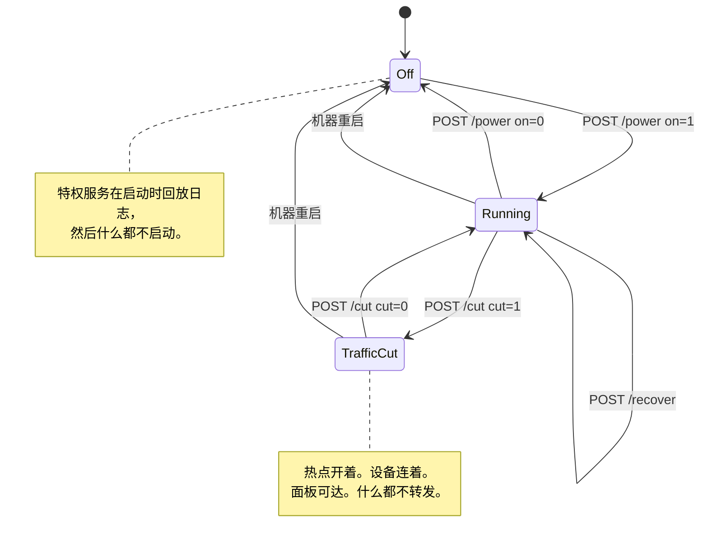

# 面板与配置

[English](https://github.com/Iman/caspian/wiki/Panel-and-Configuration) | [فارسی](https://github.com/Iman/caspian/wiki/Panel-and-Configuration.fa) | [Русский](https://github.com/Iman/caspian/wiki/Panel-and-Configuration.ru) | [中文](https://github.com/Iman/caspian/wiki/Panel-and-Configuration.zh)

[Caspian Wiki](https://github.com/Iman/caspian/wiki/Home.zh)

> 本指南从现有 README 迁移而来。测量结果保留原有日期；此次文档迁移不代表重新运行了测试。
> [English](https://github.com/Iman/caspian/blob/108567a6a529be05b577ee68b65b48790f07e43d/README.md) | [فارسی](https://github.com/Iman/caspian/blob/108567a6a529be05b577ee68b65b48790f07e43d/README.fa.md) | [Русский](https://github.com/Iman/caspian/blob/108567a6a529be05b577ee68b65b48790f07e43d/README.ru.md) | [中文](https://github.com/Iman/caspian/blob/108567a6a529be05b577ee68b65b48790f07e43d/README.zh.md)

## 那几个控制，以及该按哪一个

面板上有三个控制会改变这台设备正在做的事。其中两个都会让连在热点上的设备断网，但它们
不是同一个控制。这一节之所以存在，是因为它们之间的差别以前只写在源码里，而拿着手机的
那个人读不到源码。

### 开关，`POST /power`

这个开关把整台设备打开和关闭。关闭时会调用特权服务的 `Stop`，它按顺序做五件事：

1. 停止引擎
2. 停止接入点，以及它旁边的 DHCP 和 DNS 服务
3. 删除生成给这两者用的配置文件
4. 如果无线电当初是 Caspian 解除阻断的，就把它重新阻断回去
5. 回放拆除日志

见 [`internal/privsvc/start.go`](https://github.com/Iman/caspian/blob/main/internal/privsvc/start.go) 的 `stopLocked`，以及 [`internal/hotspot/supervisor.go`](https://github.com/Iman/caspian/blob/main/internal/hotspot/supervisor.go)
的 `Supervisor.Stop`。

要紧的后果是中间那一条。那个 WiFi 网络不再存在。每一台连上去的设备都会掉线，其中包括
按下按钮那个人手里的那台手机。

### 切断，`POST /cut`

切断只停掉盒子代那些设备转发的流量。它用一套 nftables 规则集换掉另一套。见
[`internal/privsvc/cut.go`](https://github.com/Iman/caspian/blob/main/internal/privsvc/cut.go) 的 `setForward`，以及 [`internal/netcfg/nftables.go`](https://github.com/Iman/caspian/blob/main/internal/netcfg/nftables.go) 的
`RulesetFor`。

两套规则集只在 forward 链上有差别，别处都一样。
`TestForwardCut_DiffersFromNormalOnlyInTheForwardChain` 通过逐行比较 input、output、
prerouting 和 postrouting 链来断言这一点。在切断的那套规则集里，forward 链什么都不放行。
它带着一条写明理由的显式丢弃规则，好让读实时规则集的运维人员看到流量为什么停了，而不是
看到一片规则的缺席：

    iifname "wlan0" drop comment "client traffic cut by the user"

input 链没有被动过。所以盒子照样在 67 端口应答 DHCP、在客户端 DNS 端口应答 DNS、在
面板自己的端口提供面板，而且每一项都是从热点接口这一侧提供的。引擎没有被停，接入点也
没有被停。设备保持连接，保留自己的租约，仍然能打开面板。测试：
`TestForwardCut_StopsClientsAndKeepsThePanelReachable`。

### 为什么这个差别决定了您能从手机上按哪一个

面板默认只绑定在热点地址上，不绑别的。要让它同时在盒子自己所在的那个网络上提供服务，
是一个用户必须自己打开的设置，出厂默认是关的。见 [`internal/panel/listen.go`](https://github.com/Iman/caspian/blob/main/internal/panel/listen.go) 的
`BindAddrs`，以及 [`internal/state/state.go`](https://github.com/Iman/caspian/blob/main/internal/state/state.go) 的 `PanelOnLAN`。

所以，一个只有一台手机、而且手机连在热点上的人，可以从那台手机上撤销一次切断。他没法
从那台手机上撤销一次关机，因为关机把他用来访问面板的那个网络给拿走了。因此，切断才是那个
不会把使用它的人晾在原地的紧急停止。撤销它不需要重新连接，因为设备所连的东西没有消失过。

当流量必须立刻停下、而且您打算把它放回去时，按切断。它立即生效，不要求确认，而且在它
生效期间页面会把状态显示得明明白白。当您用完这台设备，或者想把 WiFi 网卡还给它原本所在的
那个网络时，按开关。不要把开关当作紧急停止来用，尤其当您是从一台连在热点上的手机上操作时。

还有两件小事，因为页面上那几句简短的措辞很容易被读过去。第一，在一台没有在运行的盒子上，
切断会被拒绝，而且它是用自己的话说明的，不是报一个不明失败。那时根本没有转发可以停。而
一套点名了一个并不存在的热点接口的规则集，就是对一台机器做了改动，而这台机器在关机期间
的整个不变量恰恰是「它被发现时是什么样，就保持什么样」。见 `errNotRunning` 和
`not-running` 这个故障。第二，切断状态保存在内存里，不写入任何文件，所以机器重启会把它
丢掉。这是刻意的：一个想不通自己的网为什么断了的人，拔一下电源就能把网拿回来。重启不会做
的，是把这台设备打开。特权服务在启动时回放日志，然后什么都不启动。见
[`cmd/caspian/serve_priv.go`](https://github.com/Iman/caspian/blob/main/cmd/caspian/serve_priv.go)。所以一次重启会清掉切断状态，并让盒子处于关闭状态，流量要等到
开关被按下之后才会重新流动，在那之前不会。

### 恢复控制，`POST /recover`

第三个控制，是在不重启机器、也不用终端的情况下从一台卡住的盒子里脱身的办法。它停掉一切，
回放拆除日志，把这台设备改动过的每一个接口、路由和防火墙规则都放回去，然后用保存的设置
重新启动。`Service.Recover` 就是 `recoverToCleanMachine` 后面接上开关用的那个同一个
`Start`，所以恢复不是启动的第二套实现，也就不会跑偏。

它的存在源自被实测过的一天。2026-08-30，这台设备反复进入一些只有能开 SSH 会话的人才能
清理的状态：一次失败的启动创建了接口却从未移除，地址被从它下面冲掉了，一条日志记录在一次
失败的启动之后仍然留着。这些每一样都可以靠回放已经写下来的东西来恢复，而这些操作在面板上
一个都够不着。

它刻意不重启机器，也不重启任何一个 systemd 单元，所以面板进程和任何 SSH 会话在整个过程中
都保持在线。它确实会停掉接入点再重新启动它，所以一台连在热点上的设备会离开该网络，等热点
回来时再重新加入。

[English](https://github.com/Iman/caspian/blob/main/README.md) | [فارسی](https://github.com/Iman/caspian/blob/main/README.fa.md) | [Русский](https://github.com/Iman/caspian/blob/main/README.ru.md) | [中文](https://github.com/Iman/caspian/blob/main/README.zh.md)
