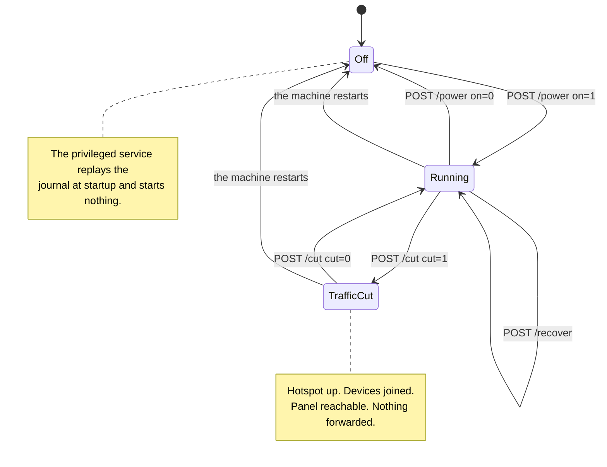

<!-- wiki-navigation:start -->

[English](https://github.com/Iman/caspian/wiki/Panel-and-Configuration) · [فارسی](https://github.com/Iman/caspian/wiki/Panel-and-Configuration.fa) · [Русский](https://github.com/Iman/caspian/wiki/Panel-and-Configuration.ru) · [**简体中文**](https://github.com/Iman/caspian/wiki/Panel-and-Configuration.zh) · [العربية](https://github.com/Iman/caspian/wiki/Panel-and-Configuration.ar) · [Türkçe](https://github.com/Iman/caspian/wiki/Panel-and-Configuration.tr) · [اردو](https://github.com/Iman/caspian/wiki/Panel-and-Configuration.ur)

[Caspian 文档](https://github.com/Iman/caspian/wiki/Home.zh) · [故障排除](https://github.com/Iman/caspian/wiki/Troubleshooting.zh)

<!-- wiki-navigation:end -->

# 面板及配置

当浏览器没有保存的选项时，面板会以英文打开。使用顶部的语言菜单并选择“应用”以切换到波斯语或返回英语。选择权取决于该浏览器，包括登录和帮助页面。该菜单无需 JavaScript 即可运行。在窄屏幕上，标题和导航会换行以适应可用宽度。

> 本指南来自现有的自述文件。其测量结果保留其原始日期；此文档移动不会报告新的测试运行。
> [English](https://github.com/Iman/caspian/blob/108567a6a529be05b577ee68b65b48790f07e43d/README.md) | [فارسی](https://github.com/Iman/caspian/blob/108567a6a529be05b577ee68b65b48790f07e43d/README.fa.md) | [Русский](https://github.com/Iman/caspian/blob/108567a6a529be05b577ee68b65b48790f07e43d/README.ru.md) | [中文](https://github.com/Iman/caspian/blob/108567a6a529be05b577ee68b65b48790f07e43d/README.zh.md)

## 控件以及按哪一个

该面板带有三个控件，可以改变设备正在执行的操作。两个
他们会停止连接到热点的设备的互联网，但他们不会
相同的控制。此部分存在是因为它们之间的区别是
仅写在来源中，拿着手机的人无法阅读
它。

### 开关，`POST /power`

开关可打开和关闭整个设备。关闭呼叫 `Stop` 打开
特权服务，按顺序执行五件事：

1. 停止发动机
2. 停止接入点及其旁边的 DHCP 和 DNS 服务器
3. 删除这两个生成的配置文件
4. 再次封锁无线电，如果凯斯宾是解除封锁的人的话
5. 重播拆解日志

参见 [`internal/privsvc/start.go`](https://github.com/Iman/caspian/blob/main/internal/privsvc/start.go)、`stopLocked` 和
[`internal/hotspot/supervisor.go`](https://github.com/Iman/caspian/blob/main/internal/hotspot/supervisor.go)、`Supervisor.Stop`。

重要的结果是中间的结果。 WiFi网络停止
现有的。每个连接的设备都会掉落它，其中包括手机
按下按钮的人的手。

### 剪裁，`POST /cut`

切断仅停止盒子代表这些设备转发的流量。它
加载一个 nftables 规则集来代替另一个规则集。参见 [`internal/privsvc/cut.go`](https://github.com/Iman/caspian/blob/main/internal/privsvc/cut.go)，
`setForward`、[`internal/netcfg/nftables.go`](https://github.com/Iman/caspian/blob/main/internal/netcfg/nftables.go)、`RulesetFor`。

这两个规则集在前向链中不同，在其他地方没有不同。
`TestForwardCut_DiffersFromNormalOnlyInTheForwardChain` 通过比较来断言
输入、输出、预路由和后路由链逐行。在剪辑中
规则集 正向链不接受任何内容。它带有明确的下降
上面有一个原因，因此操作员阅读实时规则集就会明白为什么流量如此
停止而不是缺乏规则：

iifname“wlan0”删除评论“客户端流量被用户削减”

输入链未受影响。所以盒子继续在端口 67 上应答 DHCP、DNS
在客户端 DNS 端口上，面板在其自己的端口上，每个端口都来自
热点接口。发动机未停止且接入点未关闭
停了下来。设备保持连接状态，保留租约，并且仍然可以打开面板。
测试：`TestForwardCut_StopsClientsAndKeepsThePanelReachable`。

### 为什么差异决定了您可以从手机上按哪一个

默认情况下，面板绑定到热点地址，而不绑定到其他任何东西。服务
它在盒子本身所在的网络上是用户必须打开的设置，
并且在出厂默认情况下它是关闭的。参见 [`internal/panel/listen.go`](https://github.com/Iman/caspian/blob/main/internal/panel/listen.go)，
`BindAddrs`、[`internal/state/state.go`](https://github.com/Iman/caspian/blob/main/internal/state/state.go)、`PanelOnLAN`。

因此，唯一设备是热点上的手机的人可以撤消该热点的切断
电话。他们无法撤消其关闭，因为关闭消除了
他们通过网络联系专家组。因此减产是紧急情况
停止不会让使用它的人陷入困境。撤销它不需要任何成本
重新关联，因为设备所连接的任何内容都消失了。

当交通现在必须停止并且您打算将其放回去时，请按下剪切按钮。它是
立即并且不要求确认，并且页面使状态
其生效期间是明确无误的。完成后按下开关
设备，或者当您希望将 WiFi 适配器交还给网络时
来自。请勿在手机处于紧急状态时伸手触碰开关作为紧急停止按钮
在热点上。

两个较小的事实，因为页面上的简短措辞很容易阅读过去。
首先，在未运行的盒子上拒绝剪切，它自己是这么说的
言语而不是作为未知的失败。没有转发可以停止。还有一个
命名不存在的热点接口的规则集是对
一台机器，其在关闭时的全部不变之处在于它保持被发现时的样子。
请参阅 `errNotRunning` 和 `not-running` 故障。二、切一刀
保存在内存中并且不写入任何文件，因此重新启动机器会丢失它。
这是故意的：无法弄清楚为什么他们的互联网停止的人会得到
拔掉插头即可将其恢复。重新启动不会执行切换设备的操作
上。特权服务在启动时重播日志并且不启动任何内容。
参见 [`cmd/caspian/serve_priv.go`](https://github.com/Iman/caspian/blob/main/cmd/caspian/serve_priv.go)。因此，重新启动会清除剪切并离开
盒子关闭，一旦按下开关，交通就会再次流动，而不是之前。

### 恢复控制，`POST /recover`

第三个控制是摆脱卡住盒子的方法，无需重新启动，也无需
终端。它会停止一切，重播拆卸日志，以便每个
该设备更改的接口、路由和防火墙规则被放回，然后
从保存的设置重新开始。 `Service.Recover` 是
`recoverToCleanMachine` 后跟交换机使用的相同 `Start`，因此
恢复并不是可能发生漂移的第二次启动实施。

它的存在是因为有一个测量的日子。 2026-08-30 电器反复
达到的状态只有具有 SSH 会话的人才能清除：接口
由失败的启动创建且从未删除，地址从下面刷新
它是一份在失败的开始后幸存下来的日记条目。其中每一项都是
可以通过重播已经写下的内容来恢复，而且没有一个是
可从面板访问。

它故意不重新启动机器，也不重新启动任何一个 systemd
单元，因此面板进程和任何 SSH 会话始终保持运行。它确实停止了
接入点并再次启动它，这样加入热点的设备就会离开
网络并在热点返回时重新加入。

<!-- English-source-sha256: d7e1ff1af94ccc77a97648658f4f4ee5fb24c5af9ae551c062ccc6677af7542d -->
